# 整理版：PC 后台经典界面模型系统化拆解

## 1. 文档定位

本文依据：

```text
D:\mywork\techdoc\00业务文档\系统设计\系统化拆解方法论-AI执行版.md
```

对 PC 后端管理界面中的经典模型进行系统化拆解。

分析对象：

```text
左树右表。
上筛下表。
主从表。
树表一体。
三栏。
矩阵。
看板。
图表钻取。
导入向导。
```

本文不从“页面长什么样”切入，而从方法论要求的三个锚点切入：

```text
本质模型：它把现实抽象成了什么？
核心张力：它优先保证什么，牺牲什么？
适用边界：它在什么条件下成立，什么条件下失效？
```

一句话总论：

```text
这些经典结构不是 UI 套路，而是企业业务关系在屏幕上的稳定表达。
```

## 2. 总体建模

PC 后台页面的本质是：

```text
在有限屏幕和有限注意力下，让用户稳定地识别对象、判断状态、控制风险、完成操作、留下证据。
```

不同经典结构来自不同业务关系：

| 经典结构 | 抽象的现实关系 | 本质模型 |
|---|---|---|
| 左树右表 | 范围决定对象集合 | Scope -> Objects |
| 上筛下表 | 条件决定结果集合 | Query -> ResultSet |
| 主从表 | 主对象拥有明细集合 | Master -> Details |
| 树表一体 | 对象本身有层级和属性 | Hierarchical Objects |
| 三栏 | 队列分类、对象列表、当前处理对象 | Category -> Queue -> Detail |
| 矩阵 | 两个维度交叉形成配置 | Row x Column -> Value |
| 看板 | 状态阶段承载对象集合 | State -> Cards |
| 图表钻取 | 指标可回溯到明细和原始对象 | Metric -> Detail -> Source |
| 导入向导 | 外部批量数据受控进入系统 | File -> Validate -> Commit |

核心判断：

```text
先识别业务关系，再选择页面结构。
```

如果关系识别错了，页面布局再精致也会难用。

## 3. 左树右表

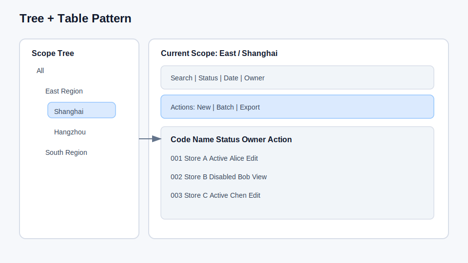

### 3.1 本质模型

左树右表抽象的是：

```text
范围控制对象集合。
```

模型：

```text
ScopeTreeNode -> QueryScope -> ObjectCollection -> Actions
```

也就是：

```text
左侧树节点不是导航装饰，而是数据作用域。
右侧表格不是全量列表，而是当前作用域下的对象集合。
```

典型例子：

```text
组织节点 -> 该组织下员工。
商品分类 -> 该分类下商品。
仓库节点 -> 该仓库库存。
区域节点 -> 该区域门店。
菜单节点 -> 该菜单权限点。
```
Mermaid 模型图：

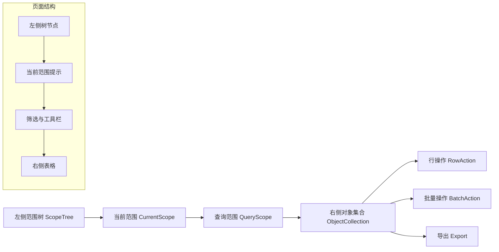
```mermaid
flowchart LR
  A[左侧范围树 ScopeTree] --> B[当前范围 CurrentScope]
  B --> C[查询范围 QueryScope]
  C --> D[右侧对象集合 ObjectCollection]
  D --> E[行操作 RowAction]
  D --> F[批量操作 BatchAction]
  D --> G[导出 Export]

  subgraph Page[页面结构]
    L[左侧树节点]
    R[右侧表格]
    T[当前范围提示]
    Q[筛选与工具栏]
  end

  L --> T
  T --> Q
  Q --> R
```


Mermaid 页面原型图：

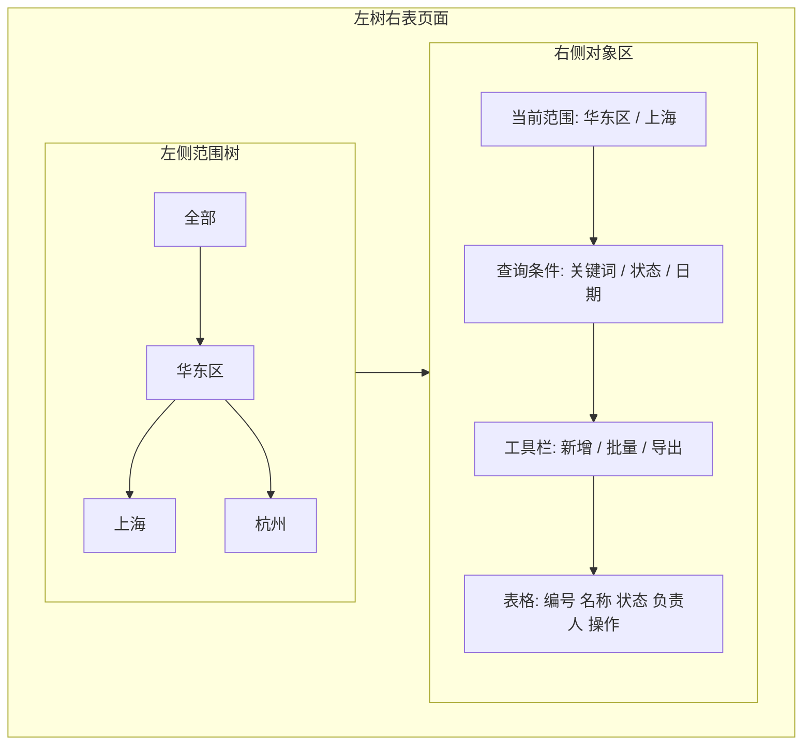
```mermaid
flowchart LR
  subgraph Page[左树右表页面]
    direction LR
    subgraph Left[左侧范围树]
      A1[全部]
      A2[华东区]
      A3[上海]
      A4[杭州]
      A1 --> A2
      A2 --> A3
      A2 --> A4
    end
    subgraph Right[右侧对象区]
      B1[当前范围: 华东区 / 上海]
      B2[查询条件: 关键词 / 状态 / 日期]
      B3[工具栏: 新增 / 批量 / 导出]
      B4[表格: 编号 名称 状态 负责人 操作]
      B1 --> B2 --> B3 --> B4
    end
    Left --> Right
  end
```
### 3.2 它解决什么问题

没有左树右表时，用户只能通过筛选项表达范围。

问题是：

```text
范围是高频操作，却被埋在筛选表单里。
范围有层级，但普通筛选无法表达层级。
用户切换范围成本高。
用户很难持续感知自己正在处理哪个范围。
批量操作时容易误判影响范围。
```

左树右表把“范围选择”常驻，让用户先确定范围，再处理范围内对象。

### 3.3 核心张力与取舍

核心张力：

```text
范围可见性 vs 屏幕空间。
```

它优先保证：

```text
范围长期可见。
范围切换高效。
批量操作范围清楚。
```

它牺牲：

```text
右侧横向空间。
小屏适配能力。
页面结构简单性。
```

所以它适合 PC 大屏，不适合移动端硬搬。

### 3.4 不变量

左树右表必须保持这些不变量：

```text
当前树节点必须唯一且可识别。
右侧表格数据必须属于当前范围。
批量操作必须以当前范围或明确选择范围为边界。
导出范围必须可解释。
无权限范围不能伪装成无数据。
```

破坏后果：

```text
用户以为在操作 A 范围，实际操作了 B 范围。
批量误操作。
导出越权。
测试无法证明数据范围正确。
```

### 3.5 适用边界

适用：

```text
存在稳定层级范围。
用户经常按范围处理数据。
范围切换频繁。
右侧对象数量较多。
新增、批量、导出都受范围影响。
```

不适用：

```text
没有层级范围。
树只是状态筛选。
用户主要靠搜索找对象。
树节点极少，下拉选择即可。
树层级太深但没有搜索。
移动端小屏。
```

### 3.6 失败模式

```text
左树只是装饰，右表数据不受树节点控制。
右表不显示当前范围。
父节点是否包含子节点没有定义。
切换节点后筛选条件残留，造成误判。
无权限节点和空节点表现一样。
批量操作跨范围误伤数据。
```

### 3.7 对比

与上筛下表对比：

```text
左树右表：范围是主轴，筛选是辅助。
上筛下表：条件是主轴，范围只是筛选条件之一。
```

选择判据：

```text
如果用户先选范围，再处理对象，用左树右表。
如果用户先输入条件，再找对象，用上筛下表。
```

## 4. 上筛下表

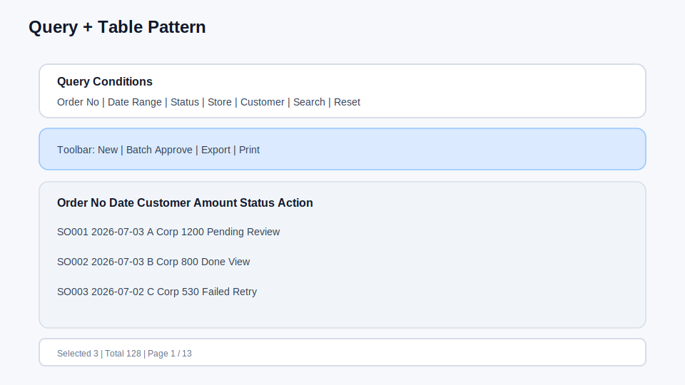

### 4.1 本质模型

上筛下表抽象的是：

```text
查询条件决定结果集合。
```

模型：

```text
QueryCondition -> ResultSet -> RowAction / BatchAction
```

它不是“上面放表单，下面放表格”，而是把用户的查找过程显式化。
Mermaid 模型图：

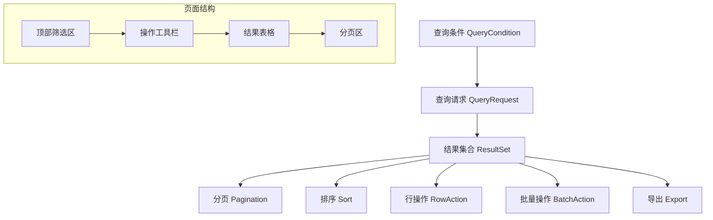
```mermaid
flowchart TB
  A[查询条件 QueryCondition] --> B[查询请求 QueryRequest]
  B --> C[结果集合 ResultSet]
  C --> D[分页 Pagination]
  C --> E[排序 Sort]
  C --> F[行操作 RowAction]
  C --> G[批量操作 BatchAction]
  C --> H[导出 Export]

  subgraph Page[页面结构]
    Q[顶部筛选区]
    O[操作工具栏]
    T[结果表格]
    P[分页区]
  end

  Q --> O --> T --> P
```


Mermaid 页面原型图：

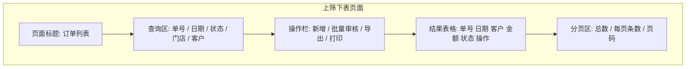
```mermaid
flowchart TB
  subgraph Page[上筛下表页面]
    A[页面标题: 订单列表]
    B[查询区: 单号 / 日期 / 状态 / 门店 / 客户]
    C[操作栏: 新增 / 批量审核 / 导出 / 打印]
    D[结果表格: 单号 日期 客户 金额 状态 操作]
    E[分页区: 总数 / 每页条数 / 页码]
    A --> B --> C --> D --> E
  end
```
### 4.2 它解决什么问题

后台系统中大量数据没有一个固定层级入口。

用户更常见的行为是：

```text
按日期查订单。
按状态查退款。
按客户查应收。
按金额查异常。
按创建人查单据。
```

上筛下表解决：

```text
如何从大集合中得到一个可操作结果集。
```

### 4.3 核心张力与取舍

核心张力：

```text
查询能力完整性 vs 页面认知负担。
```

它优先保证：

```text
用户能用多个条件精确找到数据。
结果集可分页、排序、导出、批量操作。
```

它牺牲：

```text
首屏空间。
简单性。
低门槛使用体验。
```

所以高级筛选必须折叠，默认条件必须安全。

### 4.4 不变量

```text
结果集必须由当前查询条件决定。
分页、排序、导出必须继承当前查询条件。
重置规则必须明确。
空结果必须区分“无数据”和“条件过窄”。
```

### 4.5 适用边界

适用：

```text
数据对象很多。
查询条件是用户主要入口。
结果需要排序、分页、导出、批量处理。
```

不适用：

```text
用户主要按层级范围浏览。
用户主要按状态推进对象。
查询条件非常少，搜索框即可。
结果不是集合，而是单个对象。
```

### 4.6 失败模式

```text
默认全量查询导致性能和权限风险。
筛选条件太多，占满首屏。
重置后变成危险查询。
导出范围不清楚。
查询条件和 URL / 报表 / 导出不一致。
```

### 4.7 对比

与左树右表对比：

```text
左树右表强调“范围先行”。
上筛下表强调“条件先行”。
```

与看板对比：

```text
上筛下表用于找数据。
看板用于推进状态。
```

## 5. 主从表

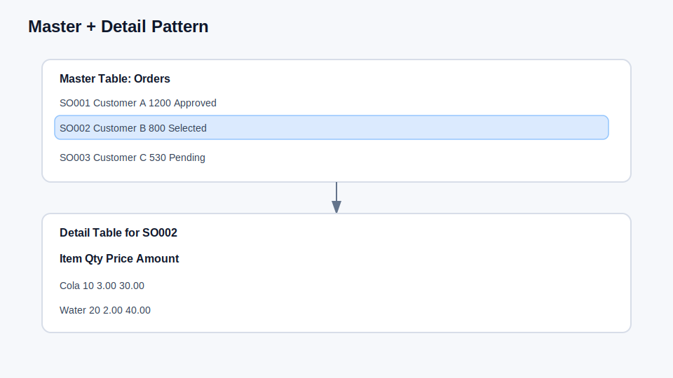

### 5.1 本质模型

主从表抽象的是：

```text
一个主对象控制一个明细集合。
```

模型：

```text
MasterRecord -> DetailCollection
```

例如：

```text
订单 -> 订单明细。
入库单 -> 入库分录。
客户 -> 联系人。
门店 -> 设备。
对账单 -> 流水。
```
Mermaid 模型图：

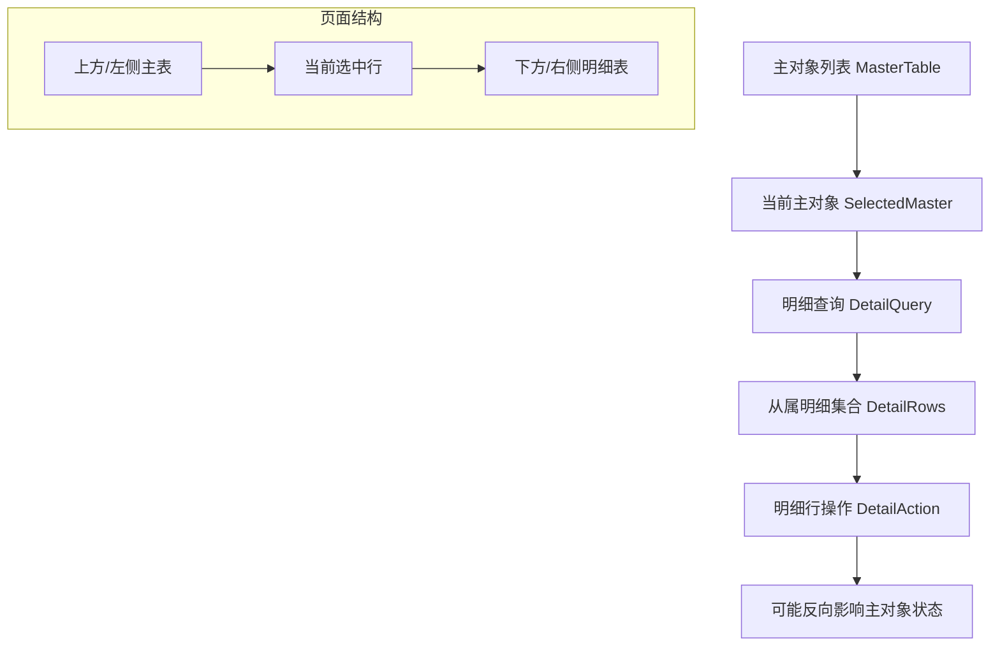
```mermaid
flowchart TB
  A[主对象列表 MasterTable] --> B[当前主对象 SelectedMaster]
  B --> C[明细查询 DetailQuery]
  C --> D[从属明细集合 DetailRows]
  D --> E[明细行操作 DetailAction]
  E --> F[可能反向影响主对象状态]

  subgraph Page[页面结构]
    M[上方/左侧主表]
    S[当前选中行]
    Dp[下方/右侧明细表]
  end

  M --> S --> Dp
```


Mermaid 页面原型图：

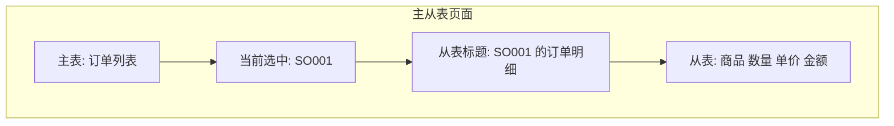
```mermaid
flowchart TB
  subgraph Page[主从表页面]
    A[主表: 订单列表]
    B[当前选中: SO001]
    C[从表标题: SO001 的订单明细]
    D[从表: 商品 数量 单价 金额]
    A --> B --> C --> D
  end
```
### 5.2 它解决什么问题

没有主从表时，用户要么：

```text
打开详情页才能看明细。
在列表中看不到对象和明细的关系。
频繁跳转，效率低。
```

主从表让用户在一个页面中完成：

```text
选择主对象。
查看它的明细。
切换另一个主对象。
继续比较明细。
```

### 5.3 核心张力与取舍

核心张力：

```text
上下文连续性 vs 单个对象详情完整性。
```

它优先保证：

```text
快速切换主对象。
快速查看明细。
保持列表上下文。
```

它牺牲：

```text
明细展示空间。
复杂编辑能力。
单个对象沉浸式详情。
```

### 5.4 不变量

```text
从表必须属于当前主对象。
当前主对象必须可见。
主对象切换后从表必须刷新或清空。
从表操作影响主表时必须反馈。
```

### 5.5 适用边界

适用：

```text
主对象和明细关系稳定。
用户需要频繁比较多个主对象的明细。
明细可在有限空间内表达。
```

不适用：

```text
明细非常复杂。
主对象详情本身很重。
需要完整编辑流程。
主从关系不稳定或一对多层级过深。
```

### 5.6 失败模式

```text
主表当前行不明显。
从表不知道属于哪个主对象。
主表切换后从表旧数据残留。
从表操作改变主表，但主表状态不更新。
```

## 6. 树表一体

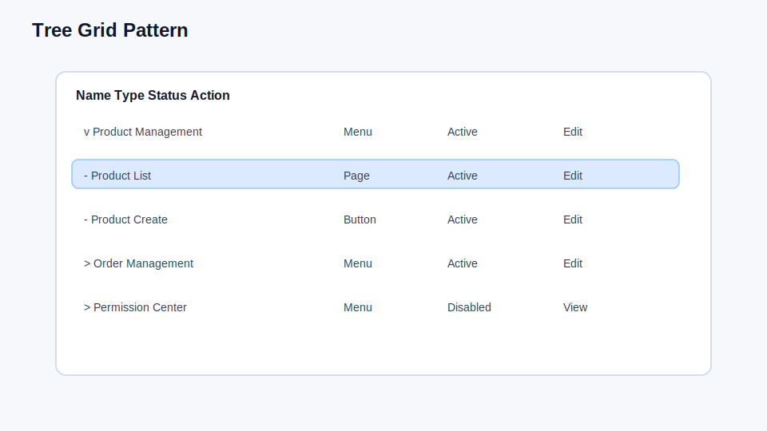

### 6.1 本质模型

树表一体抽象的是：

```text
层级对象集合，每个对象都有属性和操作。
```

模型：

```text
Node -> Children -> Attributes -> Actions
```

它不是“左边一棵树”，而是“表格行本身就是树节点”。
Mermaid 模型图：

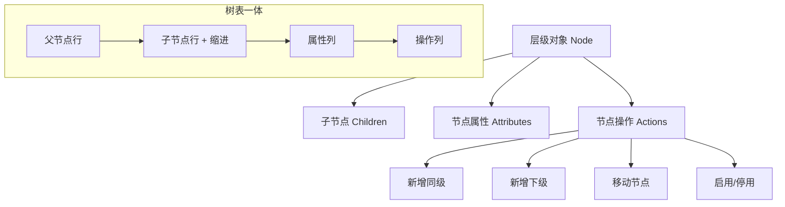
```mermaid
flowchart TB
  A[层级对象 Node] --> B[子节点 Children]
  A --> C[节点属性 Attributes]
  A --> D[节点操作 Actions]
  D --> E[新增同级]
  D --> F[新增下级]
  D --> G[移动节点]
  D --> H[启用/停用]

  subgraph Grid[树表一体]
    R1[父节点行]
    R2[子节点行 + 缩进]
    R3[属性列]
    R4[操作列]
  end

  R1 --> R2
  R2 --> R3
  R3 --> R4
```


Mermaid 页面原型图：

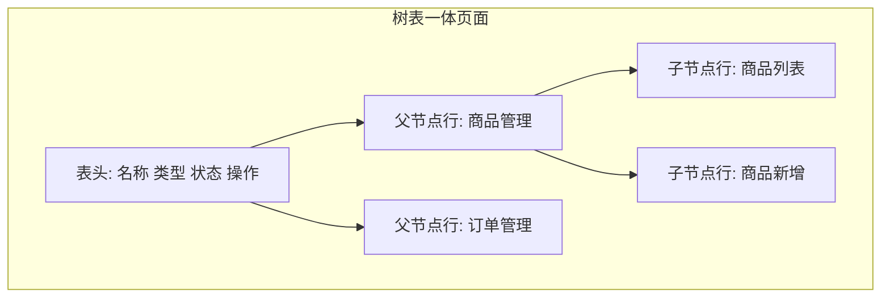
```mermaid
flowchart TB
  subgraph Page[树表一体页面]
    A[表头: 名称 类型 状态 操作]
    B[父节点行: 商品管理]
    C[子节点行: 商品列表]
    D[子节点行: 商品新增]
    E[父节点行: 订单管理]
    A --> B
    B --> C
    B --> D
    A --> E
  end
```
### 6.2 它解决什么问题

有些业务对象本身就是层级结构：

```text
菜单资源。
权限点。
会计科目。
组织架构。
物料 BOM。
分类体系。
```

用户既要看层级，又要维护每个节点的属性。

树表一体把层级和属性合并到一个视图中。

### 6.3 核心张力与取舍

核心张力：

```text
层级表达 vs 表格可读性。
```

它优先保证：

```text
父子关系可见。
节点属性可编辑。
层级对象可批量管理。
```

它牺牲：

```text
普通表格的平整性。
深层级下的可读性。
横向列空间。
```

### 6.4 不变量

```text
父子关系必须正确。
新增同级和新增下级必须区分。
父节点状态对子节点影响必须定义。
节点移动必须保持树结构合法。
```

### 6.5 适用边界

适用：

```text
层级对象本身需要维护属性。
层级深度可控。
用户需要在同一视图理解父子关系和节点属性。
```

不适用：

```text
只是按范围筛选对象。
层级非常深。
每个节点属性非常复杂。
用户主要处理叶子节点集合。
```

### 6.6 对比

与左树右表的根本区别：

```text
左树右表：树是范围，表是范围内对象。
树表一体：表格行本身就是层级对象。
```

## 7. 三栏

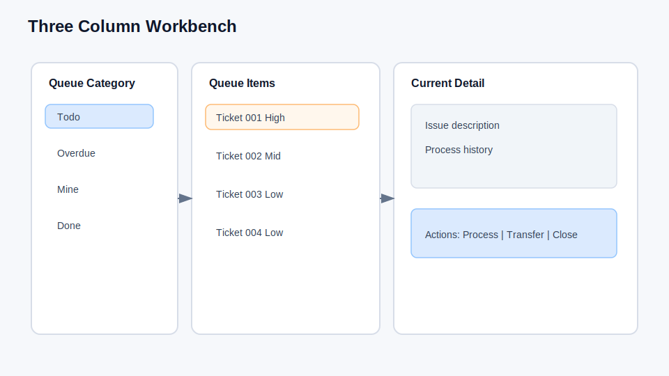

### 7.1 本质模型

三栏抽象的是：

```text
队列分类 -> 对象列表 -> 当前对象处理。
```

模型：

```text
Category -> QueueItems -> CurrentItemDetail -> Action
```
Mermaid 模型图：

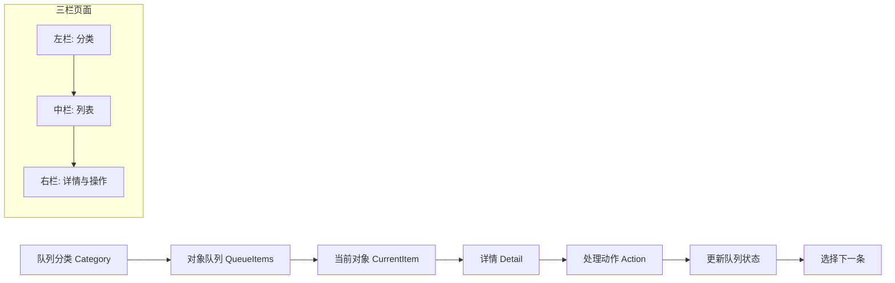
```mermaid
flowchart LR
  A[队列分类 Category] --> B[对象队列 QueueItems]
  B --> C[当前对象 CurrentItem]
  C --> D[详情 Detail]
  D --> E[处理动作 Action]
  E --> F[更新队列状态]
  F --> G[选择下一条]

  subgraph Page[三栏页面]
    L[左栏: 分类]
    M[中栏: 列表]
    R[右栏: 详情与操作]
  end

  L --> M --> R
```


Mermaid 页面原型图：

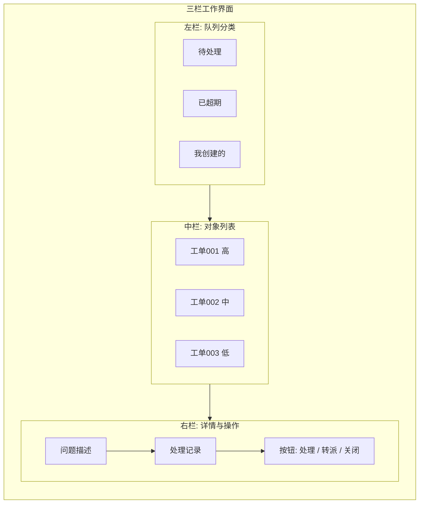
```mermaid
flowchart LR
  subgraph Page[三栏工作界面]
    subgraph Col1[左栏: 队列分类]
      A1[待处理]
      A2[已超期]
      A3[我创建的]
    end
    subgraph Col2[中栏: 对象列表]
      B1[工单001 高]
      B2[工单002 中]
      B3[工单003 低]
    end
    subgraph Col3[右栏: 详情与操作]
      C1[问题描述]
      C2[处理记录]
      C3[按钮: 处理 / 转派 / 关闭]
      C1 --> C2 --> C3
    end
    Col1 --> Col2 --> Col3
  end
```
### 7.2 它解决什么问题

三栏解决连续处理任务的问题。

例如：

```text
审批人连续处理待审批单据。
客服连续处理会话。
工单人员连续处理工单。
运维人员连续处理异常。
```

没有三栏时，用户需要在列表和详情之间反复跳转。

三栏让用户保持队列上下文，并快速处理当前对象。

### 7.3 核心张力与取舍

核心张力：

```text
连续作业效率 vs 页面复杂度。
```

它优先保证：

```text
队列可见。
当前对象可见。
处理动作可见。
处理后能进入下一条。
```

它牺牲：

```text
单栏页面的简洁。
每栏展示空间。
低频用户的学习成本。
```

### 7.4 不变量

```text
分类、列表、详情必须同步。
当前对象必须唯一。
处理后队列数量必须更新。
处理完成后的下一条规则必须明确。
```

### 7.5 适用边界

适用：

```text
任务量大。
用户需要连续处理。
对象处理路径相似。
队列状态经常变化。
```

不适用：

```text
低频查看页面。
单个对象非常复杂。
任务没有队列属性。
小屏设备。
```

### 7.6 失败模式

```text
三栏都很重，焦点混乱。
处理后列表不刷新。
自动跳下一条但用户无感知。
分类数量和列表数量不一致。
```

## 8. 矩阵

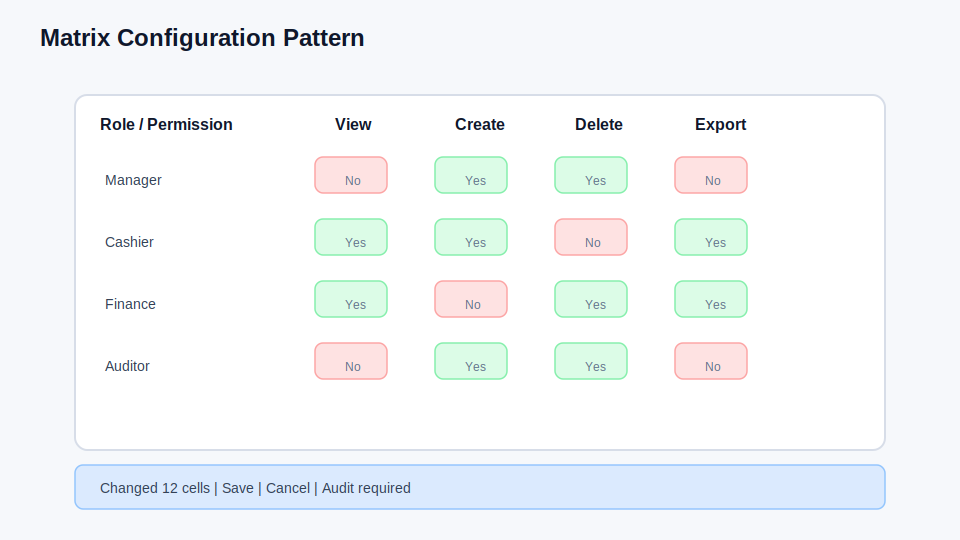

### 8.1 本质模型

矩阵抽象的是：

```text
两个维度交叉形成一个配置结果。
```

模型：

```text
RowDimension x ColumnDimension -> CellValue
```

例如：

```text
角色 x 权限。
门店 x 商品。
人员 x 日期。
客户等级 x 价格。
渠道 x 能力开关。
```
Mermaid 模型图：

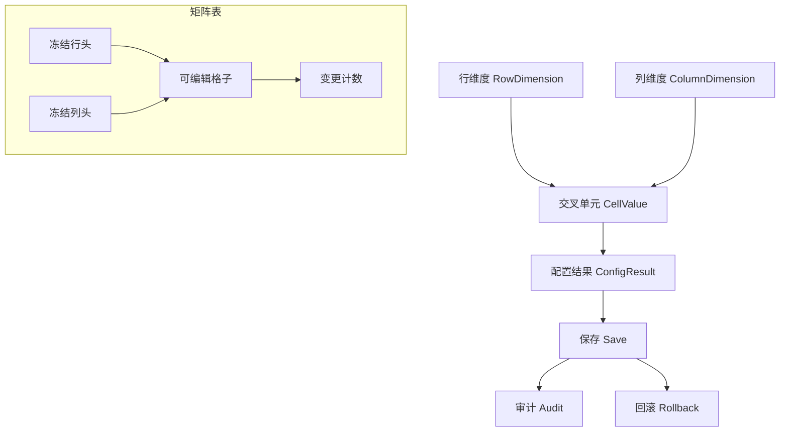
```mermaid
flowchart TB
  A[行维度 RowDimension] --> C[交叉单元 CellValue]
  B[列维度 ColumnDimension] --> C
  C --> D[配置结果 ConfigResult]
  D --> E[保存 Save]
  E --> F[审计 Audit]
  E --> G[回滚 Rollback]

  subgraph Matrix[矩阵表]
    H[冻结行头]
    I[冻结列头]
    J[可编辑格子]
    K[变更计数]
  end

  H --> J
  I --> J
  J --> K
```


Mermaid 页面原型图：

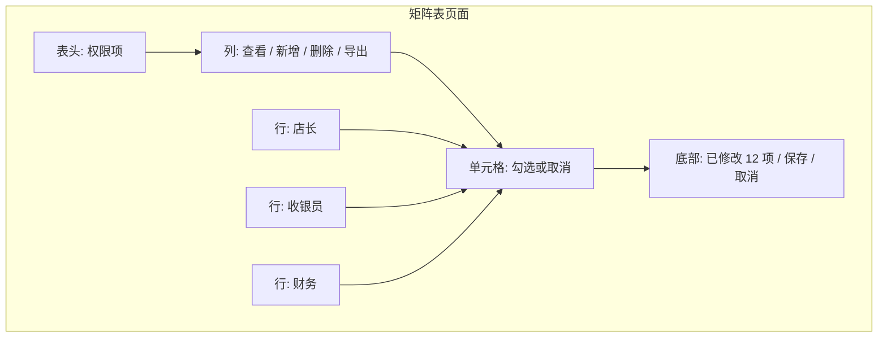
```mermaid
flowchart TB
  subgraph Page[矩阵表页面]
    A[表头: 权限项]
    B[行: 店长]
    C[行: 收银员]
    D[行: 财务]
    E[列: 查看 / 新增 / 删除 / 导出]
    F[单元格: 勾选或取消]
    G[底部: 已修改 12 项 / 保存 / 取消]
    A --> E --> F --> G
    B --> F
    C --> F
    D --> F
  end
```
### 8.2 它解决什么问题

如果不用矩阵，用户需要逐条配置关系：

```text
角色 A 有权限 1。
角色 A 有权限 2。
角色 B 有权限 1。
```

矩阵把二维关系一次展开，适合高密度配置和比较。

### 8.3 核心张力与取舍

核心张力：

```text
配置密度 vs 改错风险。
```

它优先保证：

```text
高密度呈现。
横纵对比。
批量配置。
```

它牺牲：

```text
单个格子的解释空间。
移动端适配。
低风险操作感。
```

### 8.4 不变量

```text
行列含义必须稳定。
格子含义必须清楚。
保存前必须知道改了哪些格子。
高风险矩阵必须可审计和回滚。
```

### 8.5 适用边界

适用：

```text
天然二维关系。
行列数量可控。
用户需要横向/纵向比较。
批量配置价值高。
```

不适用：

```text
只有一维配置。
格子值非常复杂。
行列数量巨大但无冻结、搜索、分组。
用户不需要比较。
```

## 9. 看板

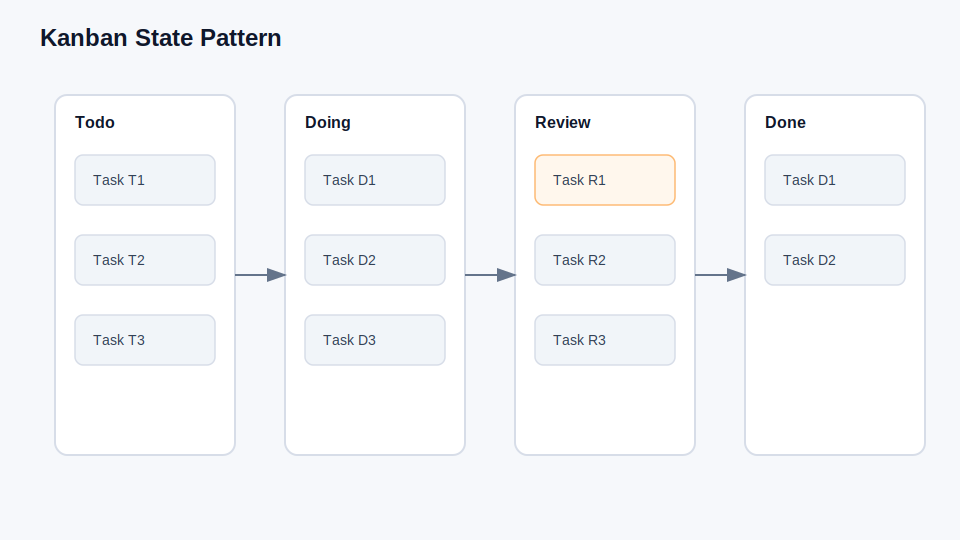

### 9.1 本质模型

看板抽象的是：

```text
状态阶段承载对象集合，对象可在状态之间流转。
```

模型：

```text
StateColumn -> Cards
Card Move -> StateTransition
```
Mermaid 模型图：

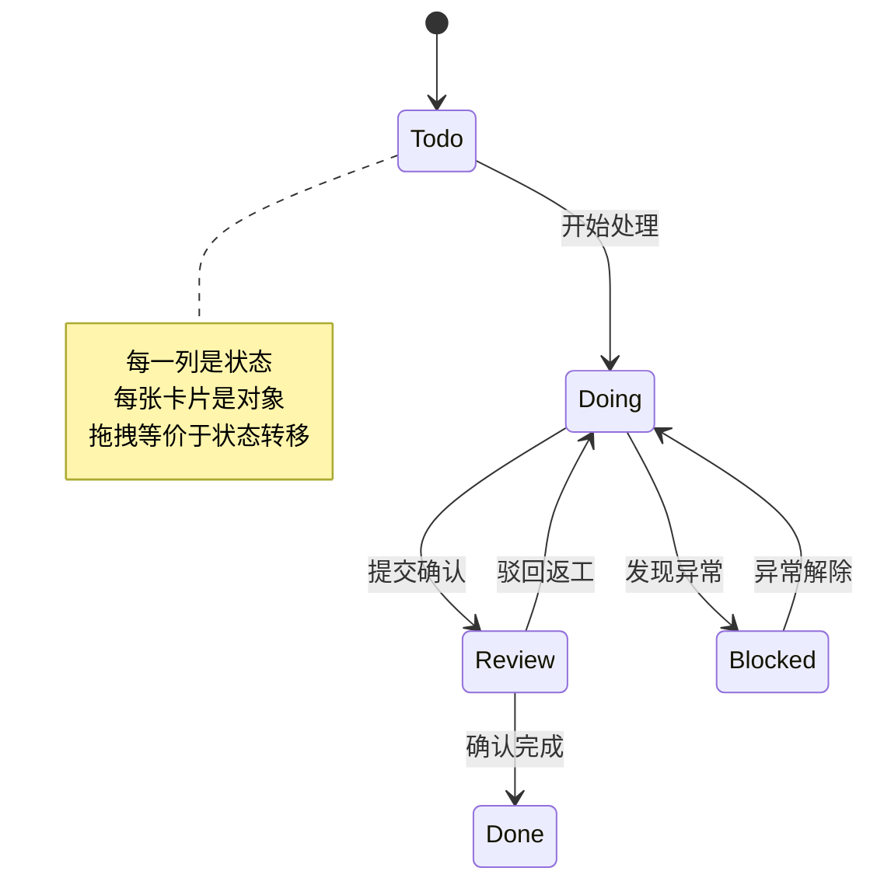
```mermaid
stateDiagram-v2
  [*] --> Todo
  Todo --> Doing: 开始处理
  Doing --> Review: 提交确认
  Review --> Done: 确认完成
  Review --> Doing: 驳回返工
  Doing --> Blocked: 发现异常
  Blocked --> Doing: 异常解除

  note right of Todo
    每一列是状态
    每张卡片是对象
    拖拽等价于状态转移
  end note
```


Mermaid 页面原型图：

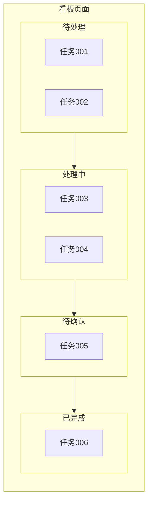
```mermaid
flowchart LR
  subgraph Page[看板页面]
    subgraph S1[待处理]
      A1[任务001]
      A2[任务002]
    end
    subgraph S2[处理中]
      B1[任务003]
      B2[任务004]
    end
    subgraph S3[待确认]
      C1[任务005]
    end
    subgraph S4[已完成]
      D1[任务006]
    end
    S1 --> S2 --> S3 --> S4
  end
```
### 9.2 它解决什么问题

看板解决状态推进问题。

用户关心：

```text
每个阶段有多少对象。
哪些对象卡在哪个阶段。
哪些对象超期。
对象如何推进到下一状态。
```

### 9.3 核心张力与取舍

核心张力：

```text
流程可视化 vs 数据密度。
```

它优先保证：

```text
状态阶段清楚。
对象推进直观。
瓶颈和超期可见。
```

它牺牲：

```text
表格查询能力。
字段展示完整性。
复杂筛选和排序能力。
```

### 9.4 不变量

```text
列必须代表真实状态。
拖拽必须等价于状态变更。
状态变更必须经过权限和规则校验。
失败必须回滚。
```

### 9.5 适用边界

适用：

```text
对象有少量稳定阶段。
用户主要任务是推进状态。
状态之间有明确流转规则。
```

不适用：

```text
状态很多。
对象字段很多。
用户主要通过查询找数据。
状态流转受复杂规则影响，不适合拖拽。
```

## 10. 图表钻取

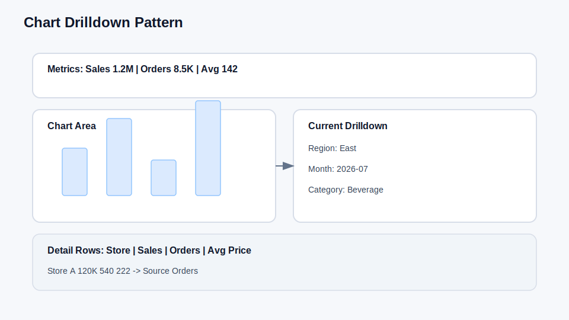

### 10.1 本质模型

图表钻取抽象的是：

```text
经营结果必须能回溯到业务事实。
```

模型：

```text
Metric -> DimensionBreakdown -> DetailRows -> SourceObject
```
Mermaid 模型图：

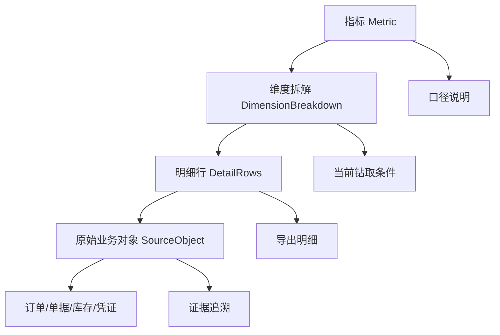
```mermaid
flowchart TB
  A[指标 Metric] --> B[维度拆解 DimensionBreakdown]
  B --> C[明细行 DetailRows]
  C --> D[原始业务对象 SourceObject]
  D --> E[订单/单据/库存/凭证]

  A --> F[口径说明]
  B --> G[当前钻取条件]
  C --> H[导出明细]
  D --> I[证据追溯]
```


Mermaid 页面原型图：

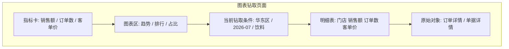
```mermaid
flowchart TB
  subgraph Page[图表钻取页面]
    A[指标卡: 销售额 / 订单数 / 客单价]
    B[图表区: 趋势 / 排行 / 占比]
    C[当前钻取条件: 华东区 / 2026-07 / 饮料]
    D[明细表: 门店 销售额 订单数 客单价]
    E[原始对象: 订单详情 / 单据详情]
    A --> B --> C --> D --> E
  end
```
### 10.2 它解决什么问题

只有图表时，用户知道“发生了什么”，但不知道“为什么”。

图表钻取让用户从：

```text
指标异常
```

一路追到：

```text
哪个维度异常 -> 哪些明细异常 -> 哪些原始单据导致异常
```

### 10.3 核心张力与取舍

核心张力：

```text
宏观概览 vs 微观证据。
```

它优先保证：

```text
从指标到证据的解释链。
```

它牺牲：

```text
页面简单性。
查询链路性能。
指标口径维护成本。
```

### 10.4 不变量

```text
指标口径必须清楚。
钻取条件必须可见。
明细必须继承图表条件。
明细必须能回到原始对象。
```

### 10.5 适用边界

适用：

```text
经营分析。
财务分析。
库存分析。
销售分析。
异常监控。
```

不适用：

```text
指标只是装饰。
无法提供明细。
口径不稳定。
数据无法回到原始对象。
```

## 11. 导入向导

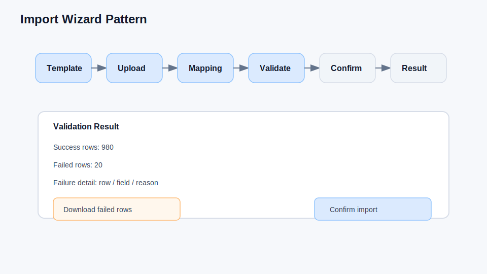

### 11.1 本质模型

导入向导抽象的是：

```text
外部批量数据进入系统前，必须被分阶段校验和受控提交。
```

模型：

```text
File -> Parse -> Map -> Validate -> Confirm -> ImportJob -> Result
```
Mermaid 模型图：

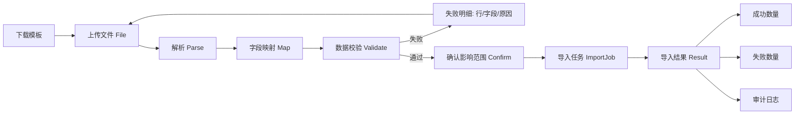
```mermaid
flowchart LR
  A[下载模板] --> B[上传文件 File]
  B --> C[解析 Parse]
  C --> D[字段映射 Map]
  D --> E[数据校验 Validate]
  E -->|失败| F[失败明细: 行/字段/原因]
  F --> B
  E -->|通过| G[确认影响范围 Confirm]
  G --> H[导入任务 ImportJob]
  H --> I[导入结果 Result]
  I --> J[成功数量]
  I --> K[失败数量]
  I --> L[审计日志]
```


Mermaid 页面原型图：

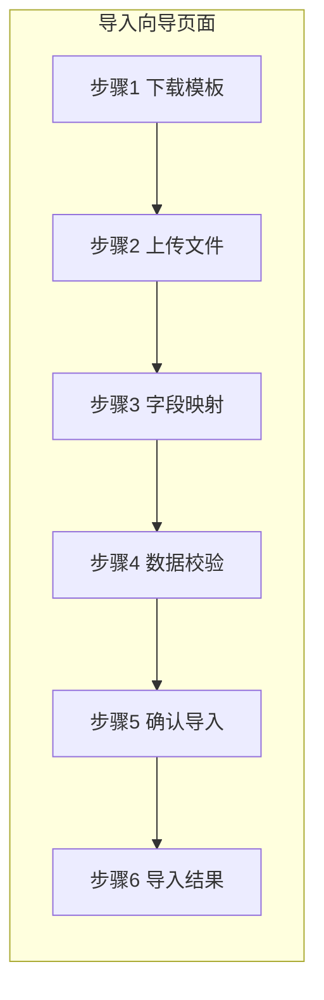
```mermaid
flowchart LR
  subgraph Page[导入向导页面]
    A[步骤1 下载模板]
    B[步骤2 上传文件]
    C[步骤3 字段映射]
    D[步骤4 数据校验]
    E[步骤5 确认导入]
    F[步骤6 导入结果]
    A --> B --> C --> D --> E --> F
  end
```
### 11.2 它解决什么问题

导入是高风险写操作。

没有导入向导时，常见问题是：

```text
上传即入库。
失败不知道哪一行。
部分成功不可追踪。
重复导入。
字段映射错误。
错误数据污染业务系统。
```

导入向导把风险拆成阶段：

```text
文件格式风险。
字段映射风险。
业务规则风险。
影响范围风险。
写入结果风险。
```

### 11.3 核心张力与取舍

核心张力：

```text
批量效率 vs 数据安全。
```

它优先保证：

```text
数据进入系统前可校验。
失败可定位。
结果可追溯。
```

它牺牲：

```text
一次性操作速度。
流程短平快。
实现简单性。
```

### 11.4 不变量

```text
导入前必须校验。
失败必须定位到行、字段、原因。
写入必须有结果反馈。
导入任务必须有日志。
重复导入必须有幂等策略或提示。
```

### 11.5 适用边界

适用：

```text
批量主数据。
批量价格。
批量库存。
批量权限。
批量单据。
批量配置。
```

不适用：

```text
单条简单新增。
低风险临时数据。
不需要持久化的文件预览。
```

## 12. 横向对比：如何选择模型

| 用户问题 | 优先模型 | 不要误用 |
|---|---|---|
| 我要先选一个组织/分类/仓库再看数据 | 左树右表 | 不要用一堆筛选代替稳定范围 |
| 我要按条件查找数据 | 上筛下表 | 不要强行加树 |
| 我要看主对象和明细关系 | 主从表 | 不要让用户频繁跳详情 |
| 我要维护层级对象本身 | 树表一体 | 不要误用左树右表 |
| 我要连续处理待办 | 三栏 | 不要用普通列表 + 详情反复跳转 |
| 我要配置二维关系 | 矩阵 | 不要做成大量重复表单 |
| 我要推进状态 | 看板 | 不要用普通表格隐藏状态流转 |
| 我要从指标追原因 | 图表钻取 | 不要只做静态图 |
| 我要批量导入数据 | 导入向导 | 不要上传即入库 |

## 13. 最终结论

这些经典模型的共同底层逻辑是：

```text
把企业业务中的对象、关系、状态、范围、证据，以最稳定的界面结构表达出来。
```

选择模型不是看哪个页面好看，而是看业务关系是什么：

```text
范围关系 -> 左树右表。
查询关系 -> 上筛下表。
主从关系 -> 主从表。
层级对象 -> 树表一体。
队列处理 -> 三栏。
二维配置 -> 矩阵。
状态推进 -> 看板。
指标追溯 -> 图表钻取。
批量入库 -> 导入向导。
```

按照系统化拆解方法论，真正理解一个界面模型，必须能说清：

```text
它抽象了什么。
它解决了什么问题。
它维护哪些不变量。
它优先保证什么。
它牺牲了什么。
它什么时候会坏。
它和相似模型如何选择。
```

这才是从世界级架构师和设计师角度理解后台界面，而不是停留在页面样式层。

