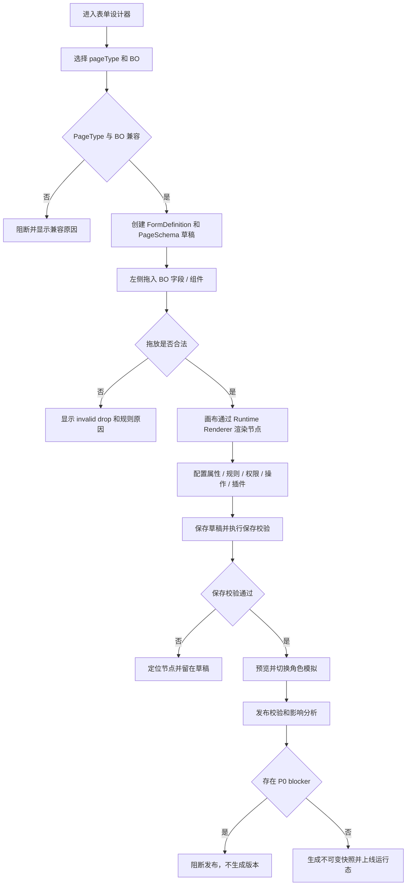
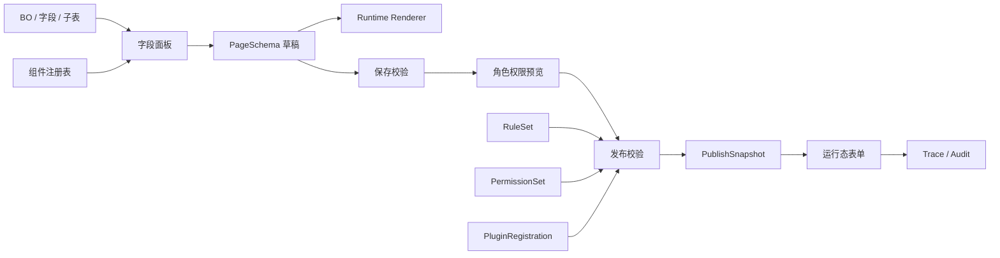

# T-207 表单设计器 · 功能规格文档

> 阶段：AI 研发流程阶段 2（功能设计）  
> 流程版本：`AI研发流程规范.md` v2.1  
> 质量档位：L3-strict  
> 版本：v2.0  
> 日期：2026-07-08  
> 上游：`T-207-表单设计器-PRD-产品需求规格说明书.md`、`T-207-表单设计器-需求追溯表.md`  
> 下游：`../05-详细设计/T-207-表单设计器-技术设计文档.md`、`../06-任务与测试/测试规格/T-207-表单设计器-测试用例规格文档.md`

---

## 1. 功能点映射

| 需求编号 | 设计编号 | 设计功能点 | 变更标识 | 可测试输出 |
|---|---|---|---|---|
| REQ-FD-001 | FD-DES-001 | FormDefinition 基础模型 | 新增 | 草稿含 formId、boId、pageType、schemaVersion。 |
| REQ-FD-002 | FD-DES-002 | PageType 能力边界 | 新增 | 页面类型能力矩阵和不兼容阻断。 |
| REQ-FD-003 | FD-DES-003 | PageSchema 与 BO 分离 | 新增 | 直接修改 BO 实体被阻断。 |
| REQ-FD-004 | FD-DES-004 | 同对象多视图 | 新增 | 多 PageSchema 独立保存、发布、回放。 |
| REQ-FD-010 | FD-DES-010 | 五区设计器工作台 | 新增 | 多视口五区不重叠。 |
| REQ-FD-011 | FD-DES-011 | 左侧组件/字段/大纲面板 | 新增 | 搜索、拖拽、大纲同步。 |
| REQ-FD-012 | FD-DES-012 | PC Web 可视化画布与 Renderer 复用 | 新增 | 设计态与预览态主体渲染一致，复杂 Web 单据页面可还原。 |
| REQ-FD-013 | FD-DES-013 | 选中与层级定位 | 新增 | 属性、大纲、路径同步 selectedNode。 |
| REQ-FD-014 | FD-DES-014 | 顶部命令栏 | 新增 | 命令按 dirty、权限、选中态启用。 |
| REQ-FD-015 | FD-DES-015 | 运行态字段样式 | 新增 | 下划线、错误、禁用、只读、下拉、两列布局。 |
| REQ-FD-020 | FD-DES-020 | 属性面板分层 | 新增 | 业务/样式/布局/规则/权限/操作/插件分层。 |
| REQ-FD-021 | FD-DES-021 | 业务属性 | 新增 | 字段绑定、控件、默认值、必填、提交策略校验。 |
| REQ-FD-022 | FD-DES-022 | 强 Web 布局属性 | 新增 | Grid、Flex、嵌套容器、滚动、Sticky、span、gap、尺寸约束可校验。 |
| REQ-FD-023 | FD-DES-023 | 界面规则 | 新增 | 条件、目标、动作、影响范围可见。 |
| REQ-FD-024 | FD-DES-024 | 业务规则 | 新增 | 服务端校验链和依赖图。 |
| REQ-FD-025 | FD-DES-025 | 字段权限闭环 | 新增 | 设计/运行/API/导出/打印一致。 |
| REQ-FD-026 | FD-DES-026 | 操作配置 | 新增 | 操作按角色和状态显示/禁用。 |
| REQ-FD-030 | FD-DES-030 | 保存校验 | 新增 | node/field/component/expression 定位。 |
| REQ-FD-031 | FD-DES-031 | 发布校验 | 新增 | P0 blocker 阻断且不生成版本。 |
| REQ-FD-032 | FD-DES-032 | 即时预览 | 新增 | 草稿 + 角色权限模拟预览。 |
| REQ-FD-033 | FD-DES-033 | 版本快照 | 新增 | 不可变快照和版本回放。 |
| REQ-FD-034 | FD-DES-034 | 影响分析 | 新增 | 字段/规则/权限/插件/视图 diff。 |
| REQ-FD-040 | FD-DES-040 | 配置优先插件兜底 | 新增 | 可配置场景提示不用插件。 |
| REQ-FD-041 | FD-DES-041 | 插件事件点 | 新增 | 事件点白名单校验。 |
| REQ-FD-042 | FD-DES-042 | 插件上下文边界 | 新增 | DOM/越权数据访问阻断。 |
| REQ-FD-043 | FD-DES-043 | AI 草稿建议 | 新增 | AI patch 可审查、应用、撤销。 |
| REQ-FD-044 | FD-DES-044 | AI 风险解释 | 新增 | blocker 不被 AI 隐藏或降级。 |
| REQ-FD-050 | FD-DES-050 | BO 字段优先 | 新增 | 拖入字段自动生成绑定节点。 |
| REQ-FD-051 | FD-DES-051 | 属性搜索与解释 | 新增 | 按业务含义和风险定位属性。 |
| REQ-FD-052 | FD-DES-052 | 设计态权限模拟 | 新增 | 隐藏/只读/脱敏原因可见。 |
| REQ-FD-053 | FD-DES-053 | 设计运行一致性报告 | 新增 | 三态差异可归因。 |
| REQ-FD-054 | FD-DES-054 | 新手任务流 | 新增 | 引导完成销售订单闭环。 |

---

## 2. 主业务流程

### 2.1 设计到发布闭环

### 2.2 销售订单端到端样例

| 步骤 | 角色 | 输入 | 操作 | 输出 | 异常处理 |
|---|---|---|---|---|---|
| 1 | 应用设计者 | 销售订单 BO | 创建 bill 类型表单 | FormDefinition 草稿 | pageType 不兼容则阻断。 |
| 2 | 应用设计者 | 客户、日期、明细字段 | 拖入画布 | FieldNode/SubTableNode | 重复字段提示定位已有节点。 |
| 3 | 应用设计者 | 字段节点 | 配必填、只读、span、标签位置 | NodeSchema 属性 | 默认值类型不匹配保存失败。 |
| 4 | 应用设计者 | 数量、单价、金额 | 配计算规则 | RuleSet | 规则循环发布阻断。 |
| 5 | 租户管理员 | 销售、经理、文员 | 配字段和操作权限 | PermissionOverlay | 权限放宽发布阻断。 |
| 6 | 应用设计者 | 草稿 + roleId | 预览权限态 | Runtime preview | Renderer 缺组件阻断发布。 |
| 7 | 应用设计者 | 草稿 + 旧版本 | 发布校验和影响分析 | PublishReport | P0 blocker 不生成版本。 |
| 8 | 业务用户 | 发布快照 | 录入、保存、提交 | 业务数据 | 必填/规则/权限错误清晰提示。 |
| 9 | 运维/审计 | traceId、versionId | 查询日志 | 审计记录 | 无 traceId 视为上线阻断。 |

---

## 3. PageType 能力矩阵

| PageType | 存储 | 子表 | 操作栏 | 规则 | 权限 | 插件 | 发布 | 首版状态 |
|---|---|---|---|---|---|---|---|---|
| dynamicForm | 可选 | 可选 | 可选 | 支持 | 支持 | 支持 | 支持 | P0 |
| bill | 必需 | 支持 | 支持 | 支持 | 支持 | 支持 | 支持 | P0 |
| masterData | 必需 | 可选 | 支持 | 支持 | 支持 | 支持 | 支持 | P1 |
| list | 读取为主 | 不直接编辑 | 支持批量操作 | 过滤/显示规则 | 支持 | 列表插件 | 支持 | P1 |
| detail | 读取为主 | 展示 | 操作可选 | 显示规则 | 支持 | 支持 | 支持 | P1 |
| filter | 不存储业务数据 | 不支持 | 不支持 | 条件规则 | 支持 | 不建议 | 随宿主页发布 | P2 |
| dialog | 可选 | 可选 | 可选 | 支持 | 支持 | 支持 | 随宿主页发布 | P2 |

规则：

| 编号 | IF | THEN |
|---|---|---|
| PT-R-001 | PageType 为 bill | 必须绑定可持久化 BO，并至少有一个主实体字段。 |
| PT-R-002 | PageType 为 list | 禁止直接配置主表编辑字段，只允许列表列和批量操作。 |
| PT-R-003 | PageType 为 filter | 禁止配置保存/提交/审核类业务操作。 |
| PT-R-004 | PageType 不支持子表 | 拖入 SubTableNode 时显示 invalid drop。 |

---

## 4. 企业级 PC Web 设计器与布局约束

表单设计器是高频生产工具，UI 必须符合企业后台规范。参考金蝶的三栏密度、中央运行态画布、右侧属性面板和蓝色选中框，但产品定位必须更进一步：它是 **可见即可得的 PC Web 业务页面设计器**，不是只能摆字段的普通表单搭建器。

强 Web 布局能力是 T-207 的核心。功能规格必须保证设计器能设计复杂 PC Web 单据页面，包括顶部命令栏、状态条、主表 FormGrid、分录 Subtable、汇总 SummaryBar、右侧审批/附件/关联单据面板、底部固定操作栏，以及 Grid/Flex/嵌套容器/局部滚动/Sticky 等真实 Web 布局能力。

详细规范见：

| 文档 | 用途 |
|---|---|
| `../05-详细设计/T-207-表单设计器-企业级UI重设计规范.md` | 定义企业级视觉、布局、色彩、Figma 重画验收标准。 |
| `../05-详细设计/T-207-表单设计器-全量表单元素设计规范.md` | 定义全量表单元素分类、状态、属性、权限和测试契约。 |
| `../05-详细设计/T-207-PC-Web可视化布局设计器规范.md` | 定义 PC Web 布局能力、LayoutEngine、复杂单据页面和 Figma 布局验收标准。 |

### 4.1 UI 约束

| 编号 | 约束 | 可测试输出 |
|---|---|---|
| FD-UI-001 | 主界面必须是三栏企业工具布局，不做营销页、展示页、功能卡片墙 | Figma 截图第一屏评审通过。 |
| FD-UI-002 | 主色只用于选中、焦点、主操作；风险色只用于真实异常 | 截图中色彩不超过蓝灰主体系。 |
| FD-UI-003 | 左侧控件库采用列表/树，不使用大面积彩色卡片 | 控件库截图评审。 |
| FD-UI-004 | 右侧属性面板采用页签 + 分组 + 属性行 | 属性面板截图评审。 |
| FD-UI-005 | 发布影响、权限冲突、AI Patch 进入抽屉/面板，不常驻铺满主画布 | 交互原型评审。 |
| FD-UI-006 | 中央画布复用运行态 Renderer，默认呈现真实 PC Web 表单或单据页面 | 设计态与预览态截图一致。 |
| FD-UI-007 | 表单元素必须能映射到元素契约、状态矩阵和测试用例 | 元素注册表和测试规格可追踪。 |
| FD-UI-008 | 复杂单据页面必须可设计：Toolbar、StatusBar、FormGrid、Subtable、SummaryBar、SidePanel、BottomActionBar | Figma 原型和功能验收样例均覆盖。 |
| FD-UI-009 | 布局能力必须覆盖 Grid、Flex、嵌套容器、SplitPane、Tabs、Collapse、局部滚动、Sticky | 布局属性面板和 schema 校验均覆盖。 |
| FD-UI-010 | Figma 截图不得出现文本换行错乱、截断不可读、组件重叠、面板溢出、底部裁切 | 截图验收不通过则不得交付。 |

### 4.2 Web 布局能力范围

| 能力 | P0 要求 | 可测试输出 |
|---|---|---|
| CSS Grid | 12/24 列、span、gap、嵌套 Grid、自定义列宽 | 保存校验能阻断 span 超限和非法嵌套。 |
| Flex | row/column、align、justify、wrap、grow/shrink/basis | 按钮组、工具栏、页签内容可稳定排布。 |
| 尺寸约束 | fixed、fill、hug、min/max width/height | 不同设计宽度下布局不塌陷。 |
| 局部滚动 | 页面滚动、子表滚动、右侧面板滚动、横向滚动 | overlay 坐标不漂移。 |
| Sticky | 顶部命令栏、表格表头、汇总区、底部操作栏 | 滚动后关键操作仍可见。 |
| 复杂容器 | Section、FieldGroup、Tabs、SplitPane、Collapse、Subtable、ActionBar、SummaryBar | 销售订单复杂页面样例可完整搭建。 |
| 绝对定位边界 | 仅用于选中框、吸附线、浮层、套打模板 | 页面主体不得依赖绝对定位。 |

### 4.3 全量表单元素范围

| 大类 | P0/P1 元素 |
|---|---|
| 基础输入 | 文本、密码、数字、金额、百分比、日期、时间、日期时间、日期范围、长文本、富文本、代码 |
| 选择引用 | 下拉、多选、单选、复选、开关、参照、树选择、级联、人员、组织、标签 |
| 上传展示 | 附件、图片、只读文本、公式展示、二维码、条码、提示 |
| 业务语义 | 单据编号、单据状态、组织字段、人员字段、审计字段、审批意见、流程节点、关联单据 |
| 布局容器 | 分组、字段组、页签、栅格、Flex、SplitPane、子表、卡片列表、折叠面板、步骤、操作栏、汇总栏、侧边面板、固定区 |
| 操作命令 | 保存、提交、审批、驳回、删除、关闭、打印、导入、导出、复制、转换、批量操作、自定义动作 |

---

## 5. P0 功能交互规格

| 设计编号 | 用户入口 | 前置条件 | UI 行为 | 字段/参数 | 状态变化 | 权限影响 | 保存影响 | 发布影响 | 异常提示 | 可测试断言 |
|---|---|---|---|---|---|---|---|---|---|---|
| FD-DES-001 | 新建表单 | 有 BO 和设计权限 | 打开创建弹窗 | pageType、boId、name | none -> draft | 无设计权限不可创建 | 生成草稿 | 无 pageType 不可发布 | 缺 BO/pageType 明确提示 | 草稿不是裸 UI JSON |
| FD-DES-010 | 设计器路由 | 草稿存在 | 显示五区工作台 | formId、pageId | loading -> ready | 无权限只读 | 不影响 | 不影响 | 加载失败显示重试 | 五区多视口不重叠 |
| FD-DES-011 | 左侧面板 | 组件和字段可用 | 切换组件/字段/大纲 | keyword、category | panelMode 改变 | 过滤无权限字段 | 不影响 | 不影响 | 空状态有提示 | 搜索客户字段成功 |
| FD-DES-012 | 中央画布 | Renderer 可用 | 渲染 PC Web 运行态主体 + 编辑 overlay | node tree、layout tree | selected/dragging/resizing | 无权字段显示权限态 | 不影响 | 缺组件或布局非法阻断 | 缺组件/布局问题定位 node | 复杂单据设计/预览主体一致 |
| FD-DES-013 | 点击节点 | 节点存在 | 蓝框、快捷按钮、属性联动 | nodeId | selectedNode 更新 | 无权限节点只读 | 不影响 | 不影响 | 节点失效则清空选择 | 属性/大纲/路径同步 |
| FD-DES-015 | 运行态字段 | 字段节点存在 | 下划线、错误、禁用、下拉 | fieldState | focus/error/disabled | 权限决定只读/脱敏 | 不影响 | 不影响 | 错误红线+文案 | 状态视觉可截图断言 |
| FD-DES-020 | 属性面板 | selectedNode 存在 | 页签切换、搜索、折叠 | tab、keyword | editingProperty | 权限属性只读/可编辑 | 修改后 dirty | 影响校验 | 非法属性值提示 | 属性分层可定位 |
| FD-DES-023 | 规则配置 | 字段存在 | 条件/目标/动作配置 | condition、target、action | ruleDraft | 无权字段不可作为目标 | 保存校验表达式 | 发布校验依赖图 | 非法表达式定位 | 规则影响字段可见 |
| FD-DES-025 | 权限配置 | 角色存在 | 角色切换、字段状态标识 | roleId、fieldId | permissionPreview | 不能放宽后端权限 | 保存提示冲突 | 权限放宽阻断 | 显示冲突来源 | 五态权限一致 |
| FD-DES-030 | 保存 | dirty=true | 保存按钮 loading | revision、schema | dirty -> saved/rejected | 无保存权限禁用 | 执行保存校验 | 不影响 | 定位问题节点 | 问题列表含 code/nodeId |
| FD-DES-031 | 发布 | 保存通过 | 发布抽屉/报告 | revision、impactHash | draft -> validating | 无发布权限禁用 | 不改变草稿 | 成功生成快照 | blocker 不生成版本 | 无半发布版本 |
| FD-DES-032 | 预览 | 草稿存在 | 运行态预览窗口 | roleId、mockData | previewing | 模拟角色权限 | 不影响 | 不影响 | Renderer 错误显示 trace | 权限态正确 |
| FD-DES-050 | 拖入 BO 字段 | 字段未使用 | drop target 高亮 | fieldId、targetId | dragging -> dirty | 无权字段不可拖 | 新增 FieldNode | 字段引用校验 | 重复字段提示 | 自动绑定默认控件 |
| FD-DES-060 | 配置 Grid 布局 | 选中 Grid/Section/FormGrid | 右侧显示 columns、span、gap、min/max | layout.display、columns、gap、span | dirty | 不影响 | 保存校验布局约束 | 非法布局阻断发布 | span 超限定位节点 | 24 列复杂主表可设计 |
| FD-DES-061 | 配置 Flex 布局 | 选中 Toolbar/ActionBar/Panel | 右侧显示 direction、align、wrap、grow | layout.flex | dirty | 不影响 | 保存校验尺寸约束 | 非法布局阻断发布 | shrink 失败提示 | 工具栏和按钮组不换行错乱 |
| FD-DES-062 | 配置局部滚动和 Sticky | 选中 Subtable/SidePanel/ActionBar | 右侧显示 overflow、sticky、scrollContainer | overflow、stickyTop、stickyBottom | dirty | 不影响 | 保存校验滚动容器 | Sticky 冲突阻断发布 | overlay 漂移定位容器 | 长单据滚动后操作区可见 |

---

## 6. 角色 × 功能矩阵

| 功能 | 设计者 | 建模者 | 管理员 | 业务用户 | 插件开发者 | 运维审计 | UI 设计师 |
|---|---|---|---|---|---|---|---|
| 新建表单 | 执行 | 提供 BO | 授权 | 无 | 无 | 审计 | 参考 |
| 多视图 | 执行 | 定义字段关系 | 授权 | 使用 | 无 | 审计 | 参考 |
| 五区设计 | 执行 | 查看 | 授权 | 无 | 无 | 无 | 验收 |
| 属性配置 | 执行 | 提供字段语义 | 审核权限属性 | 使用结果 | 无 | 审计 | 验收 |
| 规则配置 | 执行 | 提供业务规则 | 审核 | 触发 | 可扩展 | 审计 | 无 |
| 权限配置 | 查看/申请 | 提供字段敏感级 | 执行 | 受影响 | 受限 | 审计 | 无 |
| 保存/发布 | 执行 | 审核影响 | 授权 | 使用发布版 | 插件参与 | 审计 | 无 |
| 插件注册 | 查看 | 无 | 授权 | 受影响 | 执行 | 审计 | 无 |
| AI 建议 | 执行 | 可参考 | 受限 | 无 | 无 | 审计 | 可参考 |

---

## 7. 状态 × 操作矩阵

| 状态 | 保存 | 预览 | 发布 | 编辑属性 | 拖拽 | 回滚 | 运行 |
|---|---|---|---|---|---|---|---|
| new | 禁用 | 禁用 | 禁用 | 禁用 | 禁用 | 禁用 | 禁用 |
| draft-clean | 可用 | 可用 | 可用 | 可用 | 可用 | 禁用 | 禁用 |
| draft-dirty | 可用 | 可用 | 需先保存或自动保存 | 可用 | 可用 | 禁用 | 禁用 |
| validating | 禁用 | 查看中版本 | 禁用 | 禁用 | 禁用 | 禁用 | 禁用 |
| rejected | 可用 | 可用 | 修复后可用 | 可用 | 可用 | 禁用 | 禁用 |
| published | 复制为草稿 | 可用 | 禁用 | 禁用 | 禁用 | 可选 | 可用 |
| deprecated | 复制为草稿 | 可用 | 禁用 | 禁用 | 禁用 | 可选 | 不作为默认运行 |

---

## 8. 权限 × 字段/操作矩阵

字段权限状态：

| 权限状态 | 设计态 | 预览态 | 运行态 | API | 导出/打印 | 说明 |
|---|---|---|---|---|---|---|
| editable | 可配置 | 可编辑 | 可编辑 | 可写 | 可出 | 不得超过后端权限。 |
| readonly | 可配置 | 只读 | 只读 | 只读 | 可出 | 运行态拒绝写入。 |
| hidden | 可见占位提示 | 不显示 | 不显示 | 不返回 | 不出 | 设计态显示原因。 |
| masked | 可见脱敏标识 | 脱敏 | 脱敏 | 脱敏 | 脱敏 | 原值不出前端。 |
| denied | 仅管理员可见配置 | 不显示 | 不显示 | 不返回 | 不出 | 页面 schema 不可放宽。 |

角色样例：

| 字段/操作 | 销售 | 经理 | 文员 | 管理员 |
|---|---|---|---|---|
| 客户 | editable | readonly | readonly | editable |
| 明细数量 | editable | readonly | readonly | editable |
| 金额 | readonly | readonly | masked | editable |
| 审批意见 | hidden | editable | hidden | editable |
| 保存 | enabled | disabled | disabled | enabled |
| 提交 | enabled | disabled | disabled | enabled |
| 审核 | disabled | enabled | disabled | enabled |
| 发布 | disabled | disabled | disabled | enabled |

---

## 9. 规则 × 触发时机矩阵

| 规则 | 类型 | 触发时机 | 输入 | 输出 | 失败处理 | 审计 |
|---|---|---|---|---|---|---|
| 客户必填 | UI/业务 | 字段 blur、保存、提交 | customerId | 错误状态 | 阻断保存/提交 | 保存失败记录 |
| 数量 * 单价 = 金额 | 业务 | 数量/单价变化、保存 | qty、price | amount | 类型错误阻断 | 规则执行 trace |
| SUM 明细金额 = 总金额 | 业务 | 子表行变化、保存 | rows.amount | totalAmount | 依赖环阻断发布 | 规则执行 trace |
| 超额审批意见必填 | UI/业务 | totalAmount 变化、提交 | totalAmount、approvalComment | required 状态 | 阻断提交 | 提交失败记录 |
| 客户带出信用等级 | 业务 | 客户变化 | customerId | creditLevel | 数据源失败提示 | 外部查询 trace |
| 文员金额脱敏 | 权限 | 预览/运行/API/导出/打印 | roleId、amount | masked amount | 越权访问拒绝 | 权限 trace |

---

## 10. 异常 × 处理策略矩阵

| 异常 | 触发场景 | UI 提示 | 系统处理 | 是否阻断保存 | 是否阻断发布 |
|---|---|---|---|---|---|
| pageType 缺失 | 新建表单 | 必须选择页面类型 | 不创建草稿 | 是 | 是 |
| BO 不存在 | 新建/打开 | 业务对象不存在或无权限 | 返回列表 | 是 | 是 |
| 字段引用缺失 | 保存/发布 | 字段已删除，定位节点 | 保留草稿 | 警告/错误 | 是 |
| 组件缺失 | 渲染/发布 | 组件未注册，定位 node | 降级占位 | 否 | 是 |
| 容器不允许子节点 | 拖拽 | 此处不能放置该组件 | 拒绝 drop | 否 | 否 |
| 表达式语法错误 | 保存规则 | 表达式格式错误 | 标红表达式 | 是 | 是 |
| 规则循环 | 发布 | 规则存在循环依赖 | 输出环路径 | 否 | 是 |
| 权限放宽 | 发布 | 页面权限超过后端授权 | 输出冲突来源 | 否 | 是 |
| 插件越界 | 发布 | 插件访问越界上下文 | 输出插件和事件点 | 否 | 是 |
| 发布超时 | 发布 | 发布校验超时，可重试 | 回滚事务 | 否 | 是 |
| 审计失败 | 发布/运行 | 审计写入失败 | 阻断上线关键操作 | 否 | 是 |

---

## 11. 数据流设计

关键数据实体：

| 实体 | 生命周期 | 设计要求 |
|---|---|---|
| FormDefinition | draft -> published -> deprecated | 记录 pageType、boId、schemaVersion、当前版本。 |
| PageSchema | draft -> snapshot | 节点树引用 BO 和组件，不改实体。 |
| NodeSchema | draft -> snapshot | 包含 business/style/layout/rule/permission refs。 |
| RuleSet | draft -> snapshot | 可构建依赖图，服务端可执行。 |
| PermissionOverlay | draft -> snapshot | 不放宽后端权限。 |
| PublishSnapshot | immutable | 保存 form/page/rule/permission/plugin/report。 |
| AuditEvent | append-only | 含 traceId、versionId、actor、eventType。 |

---

## 12. 与既有功能边界

| 模块 | 表单设计器调用 | 表单设计器不得做 |
|---|---|---|
| BO/MetaGraph | 读取 BO、字段、子表、关系、字段权限基线 | 不直接改 BO 表结构。 |
| Runtime Renderer | 渲染设计态和预览态主体 | 不复制一套字段控件实现。 |
| 表达式引擎 | 校验语法、依赖图、执行规则 | 不创建私有表达式语法。 |
| 权限服务 | 获取字段、操作、发布权限 | 不把页面权限当权威。 |
| 发布服务 | 快照、版本、回滚、影响分析 | 不绕过发布事务。 |
| 插件平台 | 注册声明、事件点校验、上下文边界 | 不执行任意前端脚本。 |
| AI 服务 | 建议 patch 和风险解释 | 不直接写发布版本或降级 blocker。 |
| 审计服务 | 写保存、发布、插件、权限、运行错误日志 | 不吞掉关键审计失败。 |

---

## 13. 阶段 2 L3 自检

| 检查项 | 结论 | 说明 |
|---|---|---|
| P0 功能是否包含入口、前置、UI、字段、状态、权限、保存、发布、异常、断言 | 通过 | 第 4 章覆盖。 |
| 角色 × 功能矩阵是否完整 | 通过 | 第 5 章覆盖。 |
| 状态 × 操作矩阵是否完整 | 通过 | 第 6 章覆盖。 |
| 权限 × 字段/操作矩阵是否完整 | 通过 | 第 7 章覆盖。 |
| 规则 × 触发时机矩阵是否完整 | 通过 | 第 8 章覆盖。 |
| 异常 × 处理策略矩阵是否完整 | 通过 | 第 9 章覆盖。 |
| 端到端样例是否串起数据、权限、规则、发布、运行态 | 通过 | 第 2.2 章覆盖。 |
| 企业级 UI 约束和全量元素范围是否明确 | 通过 | 第 4 章及两个详细设计规范覆盖。 |
| 是否避免空泛描述 | 通过 | 每项均有输出或断言。 |
