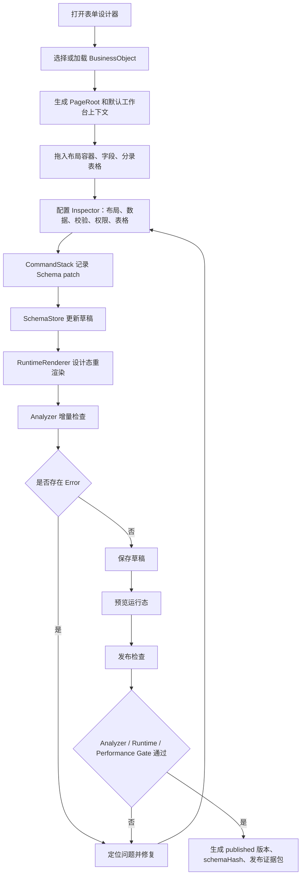
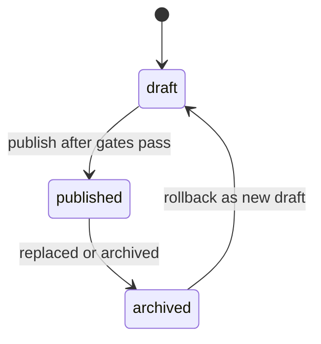

# T-207 全新表单设计器：功能规格文档

> 阶段：阶段 2 功能设计
> 状态：v1.0
> 日期：2026-07-09
> 质量等级：L4
> 流程依据：`D:\mywork\techdoc\00业务文档\系统设计\新方案\00-方法论与流程\AI研发流程规范.md` v2.8.2
> 上游产物：`../01-产品定位与范围/T-207-全新表单设计器-需求规格文档.md`

---

## 1. 功能点映射

### 1.1 需求到功能设计映射

| 需求编号 | 功能设计编号 | 功能设计名称 | 变更类型 | P0/P1/P2 | 关联 PT | 关联 IX | 关联 PS |
|---|---|---|---|---|---|---|---|
| F-001 | FD-001 | 五区 IDE 工作台 | 新增 | P0 | PT-001 | IX-001 | PS-001 |
| F-002 | FD-002 | 左侧组件资产与字段资产体系 | 新增 | P0 | PT-001, PT-019, PT-020, PT-021, PT-022 | IX-002, IX-016, IX-017, IX-018 | PS-002, PS-015, PS-016 |
| F-003 | FD-003 | 真实 Web 画布与 DesignerOverlay | 新增 | P0 | PT-002, PT-003, PT-004 | IX-002, IX-003 | PS-003, PS-004 |
| F-004 | FD-004 | 强 Web 布局容器体系 | 新增 | P0 | PT-005, PT-006 | IX-004 | PS-003, PS-005 |
| F-005 | FD-005 | 字段拖入与自动编辑器选择 | 新增 | P0 | PT-003, PT-004 | IX-002, IX-003 | PS-003, PS-004 |
| F-006 | FD-006 | 字段 Inspector | 新增 | P0 | PT-004 | IX-003 | PS-005, PS-006 |
| F-007 | FD-007 | 单据头体页面结构 | 新增 | P0 | PT-001, PT-003, PT-011 | IX-001, IX-009 | PS-008 |
| F-008 | FD-008 | EntryTable 分录表格 | 新增 | P0 | PT-007, PT-017 | IX-005, IX-014 | PS-004, PS-006, PS-013 |
| F-009 | FD-009 | 表格列设计 | 新增 | P0 | PT-008 | IX-005 | PS-005 |
| F-010 | FD-010 | Level 1 明细 | 新增 | P0 | PT-009 | IX-006 | PS-006 |
| F-011 | FD-011 | 静态规则与校验入口 | 新增 | P0 | PT-010 | IX-007 | PS-006 |
| F-012 | FD-012 | 静态权限入口 | 新增 | P0 | PT-010, PT-011, PT-016 | IX-008 | PS-008, PS-012 |
| F-013 | FD-013 | ActionButton 基础动作 | 新增 | P0 | PT-001, PT-012 | IX-009 | PS-007 |
| F-014 | FD-014 | Analyzer 发布前分析器 | 新增 | P0 | PT-012 | IX-010 | PS-006, PS-007 |
| F-015 | FD-015 | Analyzer 定位与 Quick Fix | 新增 | P0 | PT-012 | IX-010 | PS-006 |
| F-016 | FD-016 | Schema 保存与归一化 | 新增 | P0 | PT-012 | IX-009 | PS-007 |
| F-017 | FD-017 | Schema 发布与版本状态 | 新增 | P0 | PT-012, PT-014 | IX-009, IX-012 | PS-007, PS-010, PS-011 |
| F-018 | FD-018 | 版本历史与回滚入口 | 新增 | P0 | PT-012, PT-015 | IX-009, IX-013 | PS-007, PS-009 |
| F-019 | FD-019 | RuntimeRenderer 同源渲染 | 新增 | P0 | PT-011 | IX-009 | PS-008 |
| F-020 | FD-020 | 自动化测试抓手 | 新增 | P0 | PT-003, PT-005, PT-007, PT-012, PT-016, PT-017 | IX-002, IX-004, IX-005, IX-010, IX-014, IX-015 | PS-003, PS-004, PS-012, PS-013 |
| F-021 | FD-021 | CommandStack 撤销重做 | 新增 | P0 | PT-001 | IX-003, IX-004 | PS-005 |
| F-022 | FD-022 | 性能约束门禁 | 新增 | P0 | PT-012, PT-018 | IX-010, IX-015 | PS-006, PS-007, PS-014 |
| F-023 | FD-023 | 设计器子系统门禁 | 新增 | P0 | PT-001, PT-019, PT-020, PT-021, PT-022, PT-023, PT-024, PT-025 | IX-016, IX-017, IX-018, IX-019 | PS-015, PS-016, PS-017, PS-018 |

### 1.2 P1/P2 功能挂起说明

| 需求编号 | 功能名称 | 阶段 2 处理方式 |
|---|---|---|
| F-024 | 完整 RuleSchema 编辑器 | 在规则 Tab 保留入口和摘要，不在 P0 开放编辑 |
| F-025 | 角色预览与动态权限 | Top Bar 显示入口但置灰；权限差异在 PT-011 中用运行态只读示例表达 |
| F-026 | 多数据源绑定 | P0 仅 BO 字段和静态示例数据；多数据源在数据 Tab 标注 P1 |
| F-027 | Level 2 嵌套表格 | P0 作为 Analyzer 阻断样例，不作为可发布能力 |
| F-028 | 复杂表头与列组 | P0 不在 Inspector 出现，导入时 Analyzer Error |
| F-029 | Excel-like 批量录入 | P0 仅单元格编辑和键盘导航，批量粘贴为 P1 |
| F-030 | 版本 Diff 与破坏性分析 | P0 仅版本历史和回滚入口；Diff 面板为 P1 |
| F-031 | 模板库 | P0 可使用销售订单示例模板，正式模板库为 P1 |

---

## 2. 业务流程图

### 2.1 主流程：从业务对象到发布



### 2.2 异常流程

| 异常编号 | 场景 | 处理 |
|---|---|---|
| EX-001 | 业务对象加载失败 | 左侧资源区显示错误态，画布不可编辑，提供重试 |
| EX-002 | 拖入目标非法 | DropIndicator 显示 invalid，提示原因，不生成 Schema patch |
| EX-003 | 字段绑定缺失 | Analyzer 输出 `FIELD_BINDING_MISSING` Error，阻断发布 |
| EX-004 | EntryTable Level 2 | Analyzer 输出 `TABLE_DETAIL_DEPTH_EXCEEDED` Error，阻断发布 |
| EX-005 | 保存冲突 | 草稿进入 stale 状态，提示重新拉取或另存为草稿 |
| EX-006 | 发布时仍有 Error | 发布按钮阻断，Bottom Analyzer 自动展开发布 Tab |
| EX-007 | RuntimeRenderer 预览失败 | RuntimeGate 阻断发布，记录渲染错误和 schemaPath |
| EX-008 | 性能门禁失败 | PerformanceGate 阻断发布或输出 Warning，取决于阈值类型 |

---

## 3. 业务规则清单

| 规则编号 | 规则内容 | 来源需求 | 阶段 |
|---|---|---|---|
| R-001 | IF PageSchema.root 不存在或不指向 PageRoot THEN Analyzer Error `PAGE_ROOT_REQUIRED` | F-003, F-016 | P0 |
| R-002 | IF FieldNode 缺少 binding 且无 staticValue THEN Analyzer Error `FIELD_BINDING_MISSING` | F-005, F-014 | P0 |
| R-003 | IF Field.state.required=true 且 validation 不含 required THEN 自动补齐 required 校验；导入旧 Schema 时输出 Error `FIELD_REQUIRED_NO_VALIDATION` | F-006, F-011 | P0 |
| R-004 | IF EntryTable 使用 children 表达列 THEN TableNormalizer 尝试迁移为 columns/detail；不可迁移 THEN Analyzer Error | F-008, F-016 | P0 |
| R-005 | IF EntryTable.detail.detailDepth > 1 THEN Analyzer Error `TABLE_DETAIL_DEPTH_EXCEEDED` | F-010 | P0 |
| R-006 | IF Grid 字段 span > columns THEN Analyzer Error `GRID_FIELD_SPAN_OVERFLOW` | F-004 | P0 |
| R-007 | IF Analyzer 存在 Error THEN PublishService 禁止 published 版本生成 | F-014, F-017 | P0 |
| R-008 | IF draft.basePublishedVersion 不等于最新 published version THEN 发布阻断，草稿标记 stale | F-017 | P0 |
| R-009 | IF Schema 发布成功 THEN version 自增为正整数，status 置为 published，生成 schemaHash | F-017, F-018 | P0 |
| R-010 | IF 运行态业务状态需要表达 THEN 使用 bizState，不得复用 PageSchema.status | F-013, F-017 | P0 |
| R-011 | IF 任意关键交互点缺少 data-testid THEN TestIdGate Error，阻断发布 | F-020 | P0 |
| R-012 | IF P0 中启用 P1 动态 RuleSchema THEN Analyzer Error `RULE_P1_NOT_ENABLED` | F-011, F-023 | P0 |
| R-013 | IF hidden+required 或 mask+editable 等静态权限冲突 THEN Analyzer Warning 或 Error，按冲突类型处理 | F-012 | P0 |
| R-014 | IF 自动化测试只能通过坐标定位起点和终点 THEN 测试规格判定无效 | F-020 | P0 |
| R-015 | IF 单页组件数 > 200、Schema size > 500KB、容器嵌套深度 > 8、单表列数 > 40 或首屏实际渲染行数 > 200 THEN PerformanceGate Error `PUBLISH_PERFORMANCE_GATE_FAILED` 阻断发布，并在底部面板展示指标、阈值和优化建议 | F-022 | P0 |
| R-016 | IF PageSchema 中存在 ColumnGroup 且当前能力阶段为 P0 THEN Analyzer Error `TABLE_COMPLEX_HEADER_NOT_ENABLED`，提示复杂表头与列组属于 P1 | F-027 | P0 阻断 P1 能力 |
| R-017 | IF EntryTable 估算行数 > 100 且未配置 pagination 或 virtualScroll THEN Analyzer Error `TABLE_VIRTUALIZATION_REQUIRED`；IF 列数 > 20 且未配置横向滚动和冻结关键列 THEN Analyzer Warning `TABLE_COLUMN_DENSITY_RISK` | F-008, F-022 | P0 |
| R-018 | IF PageSchema 中存在动态 PermissionSchema、roleCondition 或 dataCondition 权限表达式且当前能力阶段为 P0 THEN Analyzer Error `PERMISSION_DYNAMIC_NOT_ENABLED` | F-024 | P0 阻断 P1 能力 |
| R-019 | IF ComponentSchema 绑定第二数据源、REST 绑定、服务动作数据源或关联数据源且当前能力阶段为 P0 THEN Analyzer Error `DATASOURCE_MULTI_NOT_ENABLED` | F-025 | P0 阻断 P1 能力 |
| R-020 | IF PreviewState 启用 roleId 切换、动态角色预览或流程状态驱动差异且当前能力阶段为 P0 THEN Analyzer Error `PREVIEW_ROLE_NOT_ENABLED`；设计器入口必须置灰并显示 P1 提示 | F-024 | P0 阻断 P1 能力 |
| R-021 | IF EntryTable 启用 Excel-like 多单元格选区、批量粘贴、批量填充或跨行公式填充且当前能力阶段为 P0 THEN Analyzer Error `EXCEL_LIKE_EDIT_NOT_ENABLED` | F-028 | P0 阻断 P1 能力 |
| R-022 | IF 启用 draft/published 版本 Diff、破坏性分析面板或 Diff 导出且当前能力阶段为 P0 THEN Analyzer Error `VERSION_DIFF_NOT_ENABLED`；版本历史与回滚入口不受影响 | F-029 | P0 阻断 P1 能力 |
| R-023 | IF 启用正式模板库浏览、模板发布、模板分类或租户模板市场且当前能力阶段为 P0 THEN Analyzer Error `TEMPLATE_LIBRARY_NOT_ENABLED`；销售订单示例模板仅作为验收 fixture 允许 | F-030 | P0 阻断 P1 能力 |
| R-024 | IF 09 原型中任一设计器主工作区只有能力名称但缺少对象模型、状态机、操作入口、非法操作反馈或自动化抓手 THEN 阶段 2/09 必须回退，不能进入测试规格 | F-023 | P0 流程门禁 |
| R-025 | IF 左侧组件资产、BO 字段资产、页面大纲混用同一树列表且无法通过 Activity Bar 区分模式 THEN 原型不通过，必须重画左侧工作区 | F-002, F-023 | P0 UI 门禁 |
| R-026 | IF Component Palette 未按布局容器、基础表单、展示与状态、操作命令、业务套件、表格明细、模板片段七组中文组件展示，或出现收藏/最近/业务域筛选 chip，或字段资产混入组件库，或组件项缺少三列紧凑图标卡、tooltip/详情说明和拖拽抓手 THEN 原型不通过 | F-002, F-020, F-023 | P0 可测性门禁 |
| R-028 | IF 复杂 UI 原型只经过通用文档一致性评审，未经过专业前端/UX 专项评审并记录视觉密度、信息层级、交互效率、竞品吸收和可测试性结论 THEN 阶段 2/09 不得通过 | F-002, F-023 | P0 专业评审门禁 |
| R-027 | IF 拖拽过程没有 drag ghost、legal/illegal dropzone、reject reason 和投放完成信号 THEN 自动化测试抓手不通过 | F-020, F-023 | P0 可测性门禁 |

---

## 4. 状态机设计

### 4.1 Schema 版本状态



| 状态 | 含义 | 可执行操作 |
|---|---|---|
| draft | 草稿，可编辑 | 保存、校验、预览、发布 |
| published | 已发布，运行态默认加载 | 查看、归档、回滚为新草稿 |
| archived | 历史归档，不作为默认运行态 | 查看、基于此版本创建草稿 |

### 4.2 设计器页面状态

| 页面状态 | 状态标识 | 说明 |
|---|---|---|
| 加载中 | PS-001 | 业务对象、Schema 或资源区加载中 |
| 空画布 | PS-002 | 新页面尚未放置任何业务组件 |
| 拖拽中 | PS-003 | GhostPreview、DropIndicator、合法/非法目标显示 |
| 选中态 | PS-004 | 字段、容器、表格、列被选中 |
| 编辑中/未保存 | PS-005 | Inspector 修改导致草稿 dirty，CommandStack 可撤销 |
| 校验错误 | PS-006 | Analyzer Error/Warning 展示并可定位 |
| 保存/发布中及失败 | PS-007 | 保存中、保存成功、保存失败、发布阻断、发布成功 |
| 预览/只读/权限受限 | PS-008 | 隐藏 DesignerOverlay，按静态权限或预览状态展示 |
| stale draft | PS-009 | 草稿基于旧 published version，发布前必须处理冲突 |
| 发布阻断 | PS-010 | Analyzer、RuntimeGate、PerformanceGate 或 P1 能力阻断发布 |
| 发布成功 | PS-011 | published 版本生成，schemaHash、version、证据包可见 |
| 权限差异预览 | PS-012 | visible/readonly/disabled/mask/sectionReadonly 的独立视觉结果 |
| 表格大数据态 | PS-013 | 分页、虚拟滚动、冻结列、横向滚动和汇总行同时可观察 |
| 性能门禁态 | PS-014 | 指标采样、阈值、失败原因和优化建议可见 |

### 4.3 业务状态边界

P0 可在页面中显示 `bizState=draft/submitted/approved/archived` 示例，但不通过完整动态规则引擎驱动字段最终状态。字段只读、隐藏和按钮可用性在 P0 由静态状态和静态权限表达；角色、流程、数据驱动的动态差异归 P1。

---

## 5. 数据流设计

### 5.1 关键实体

| 实体 | 生命周期 | 说明 |
|---|---|---|
| BusinessObject | 设计前置输入 | 提供字段、分录、状态、动作元数据 |
| PageSchema | 设计态、发布态、运行态 | 设计器的核心产物，保存、发布、运行均依赖它 |
| ComponentSchema | PageSchema 子结构 | PageRoot、布局、字段、表格、按钮等 |
| RuntimeState | 运行时状态 | 用户输入值、表格行、校验错误、finalState |
| AnalyzerIssue | 设计态质量问题 | Error/Warning/Suggestion，可定位到 schemaPath |
| Command | 设计操作记录 | AddNode、UpdateProp、ResizeField、ResizeColumn 等 |
| PublishEvidence | 发布证据包 | schemaHash、Analyzer report、Runtime smoke、测试报告 |

### 5.2 数据生命周期


### 5.3 设计态修改与运行态输入边界

| 用户行为 | 写入对象 | 示例 |
|---|---|---|
| 拖入字段 | PageSchema | 新增 `components.field_customer` |
| 调整字段 span | PageSchema | `components.field_customer.layout.span=2` |
| 编辑表格单元格 | RuntimeState | `tableRows[rowKey].qty=10` |
| 展开表格明细 | RuntimeState | `rowStates[rowKey].expanded=true` |
| 修改列宽 | PageSchema | `components.entry.columns[n].layout.width=260` |
| 切换预览角色 | PreviewState(P1) | `previewRole=sales_manager` |

---

## 6. 与既有功能的边界

| 既有模块 | 调用关系 | 边界 |
|---|---|---|
| 业务对象元数据服务 | 设计器读取 BO、Field、EntryModel | T-207 不定义 BO 元模型维护界面 |
| 权限系统 | P0 保存静态权限入口，P1 接入动态权限求值 | P0 不实现完整角色权限引擎 |
| 流程/状态机服务 | P0 保存状态和动作入口 | P0 不实现完整审批流程设计器 |
| 运行态页面框架 | RuntimeRenderer 加载 published PageSchema | 运行态业务提交服务另行设计 |
| 附件服务 | AttachmentUploader 使用临时附件 ID | P0 不做复杂附件生命周期和版本管理 |
| 自动化测试平台 | 通过 data-testid 模拟真实用户操作 | 不允许直接调用内部 store 绕过设计器交互 |

---

## 7. 页面原型与交互说明

### 7.1 页面清单

| 页面编号 | 页面名称 | 对应功能点 | 说明 |
|---|---|---|---|
| PG-001 | 表单设计器主工作台 | F-001 至 F-023 | 五区 IDE 主页面 |
| PG-002 | 销售订单画布页面 | F-003、F-007、F-008 | 中央画布中的运行态页面 |
| PG-003 | 属性 Inspector 面板 | F-006、F-009、F-011、F-012 | 右侧动态属性面板 |
| PG-004 | Analyzer 底部面板 | F-014、F-015、F-022 | 错误、警告、发布门禁 |
| PG-005 | 保存/发布/版本弹窗 | F-016、F-017、F-018 | 保存、发布、版本历史和回滚入口 |
| PG-006 | 预览态页面 | F-019 | 预览/运行态同源展示 |
| PG-007 | 左侧组件资产与字段资产工作区 | F-002、F-020、F-023 | Activity Bar、Component Palette、BO Field Tree、Outline Tree |

### 7.2 页面原型图清单（PT）

> 复杂 UI 工作台强制门槛：P0 至少 12 张 PT。T-207 命中“表单设计器”强制对象名，同时具备画布编辑、组件/字段拖拽、发布/回滚、设计态/预览态/运行态一致性校验，因此不得使用简单 UI 豁免。

| 原型编号 | 页面 | 覆盖场景 | 必须展示 |
|---|---|---|---|
| PT-001 | PG-001 | 工作台整体布局 | Top、Left、Center、Right、Bottom 五区；企业灰白 IDE 风格 |
| PT-002 | PG-001/PG-002 | 空画布/初始态 | 空 PageRoot、业务对象选择、空状态提示、资源区 |
| PT-003 | PG-002 | 字段拖入后的布局态 | 字段出现在 GridLayout，DropIndicator 消失，Schema dirty |
| PT-004 | PG-003 | 字段选中态与属性面板 | SelectionBox、字段 Inspector、绑定/校验/权限/状态 Tab |
| PT-005 | PG-002/PG-003 | Grid/Flex/Section 布局编辑态 | 容器边界、span 抓手、gap/columns 属性 |
| PT-006 | PG-002/PG-003 | Tabs/Split/Scroll/Sticky 布局编辑态 | Split 抓手、Sticky 固定区、局部滚动和 Tab 内容 |
| PT-007 | PG-002 | EntryTable 分录基础态 | 表格列、行操作、冻结列、汇总行、行内编辑入口 |
| PT-008 | PG-003 | TableColumn 选中与列属性态 | 列头选中、列宽抓手、编辑器、校验、权限、汇总 |
| PT-009 | PG-002 | Level 1 DetailPanel/DetailTable 态 | 明细展开抓手、一层明细设计区、Level 2 阻断提示 |
| PT-010 | PG-003 | 规则/权限/状态配置入口 | 静态权限、静态状态、规则入口占位和 P1 边界 |
| PT-011 | PG-006 | 预览/运行态 | DesignerOverlay 隐藏，字段只读/权限受限、真实页面效果 |
| PT-012 | PG-004/PG-005 | Analyzer 与保存发布态 | Error/Warning/Suggestion、发布阻断、版本状态、schemaHash |
| PT-013 | PG-005 | stale draft 冲突态 | basePublishedVersion 与最新 published 不一致、冲突原因、重新拉取/另存草稿入口 |
| PT-014 | PG-004/PG-005 | 发布阻断与发布成功分屏 | 左侧发布阻断 Error/Gate；右侧发布成功 version、status、schemaHash、证据包 |
| PT-015 | PG-005 | 版本历史与回滚态 | published/archived 列表、schemaHash、回滚为新 draft、回滚确认 |
| PT-016 | PG-006 | 静态权限差异预览态 | visible=false、readonly=true、enabled=false、mask=true、Section readonly 五种结果同时出现 |
| PT-017 | PG-002 | EntryTable 大数据设计态 | 分页、虚拟滚动、冻结列、横向滚动、汇总行、列密度 Warning |
| PT-018 | PG-004 | PerformanceGate 指标面板 | 组件数、Schema size、容器深度、表格列数、首屏渲染行数、fps 采样和阈值 |
| PT-019 | PG-007 | Component Palette 默认态 | Activity Bar、搜索、布局容器/基础表单/展示与状态/操作命令/业务套件/表格明细/模板片段七组中文组件卡片；默认 304px Dock Panel 内每行 3 个组件；说明进入 tooltip/详情；字段资产不混入组件库 |
| PT-020 | PG-007 | Component Palette 搜索与空结果态 | 搜索结果按分组展示；无结果时显示空态和清除条件入口 |
| PT-021 | PG-007 | Component Palette 不可投放/无权限态 | disabled、unavailable、no-permission 卡片和不可投放原因 |
| PT-022 | PG-007 | BO Field Tree 独立态 | 单据头字段、分录字段、系统字段、计算字段、关联字段与字段资产；与 Component Palette 分离 |
| PT-023 | PG-001/PG-007/PG-002 | 端到端组件建模主路径 | 从组件库拖入网格布局/分录表格，从字段工作栏的 BO Field Tree 拖入业务字段和分录字段生成字段控件与表格列，Inspector 指向 schemaPath，Analyzer 无 P0 Error |
| PT-024 | PG-007/PG-002 | Outline Tree 独立态 | PageRoot、Section、Field、EntryTable、Column、DetailPanel 层级；选中同步、展开折叠、empty、readonly、no-permission、invalid-move |
| PT-025 | PG-007 | 左侧工具栏详细原型 | Activity Bar、组件入口、字段入口、结构入口、问题入口、版本入口、数据入口；组件库七组中文分组、三列紧凑图标卡、tooltip/详情说明、拖拽抓手、字段不混入组件库、禁止收藏/最近/业务域筛选 chip |

#### N/A 替代图件映射

本阶段无 N/A 替代图件。所有表单设计器强制 PT 项均直接覆盖，覆盖缺口为空。

### 7.3 交互流清单（IX）

| 交互编号 | 入口 | 点击/拖拽动作 | 目标 | 结果 |
|---|---|---|---|---|
| IX-001 | 设计器入口 | 打开页面并加载 BO | PG-001 | 五区显示，状态 PS-001 -> 默认工作台 |
| IX-002 | 左侧业务对象字段树 | 拖拽字段到 Grid 投放点 | PG-002 | 新增 FieldNode，显示 PT-003 |
| IX-003 | 画布字段 | 点击字段并修改属性 | PG-003 | 选中 FieldNode，Inspector 更新 Schema patch |
| IX-004 | 布局容器 | 拖动字段 span、Split 抓手、Sticky 高度 | PG-002 | LayoutSchema 更新，Analyzer 增量检查 |
| IX-005 | EntryTable | 点击表格和列，调整列宽 | PG-002/PG-003 | 选中 EntryTable/TableColumn，更新 columns[n] |
| IX-006 | 表格行 | 展开 Level 1 明细 | PG-002 | DetailPanel 可见；尝试 Level 2 时 Analyzer Error |
| IX-007 | 字段 Inspector | 配置 required/readonly/disabled/hidden | PG-003 | FieldNode.state/validation 更新，字段状态变化 |
| IX-008 | 权限 Tab | 配置字段/表格/按钮静态权限 | PG-003 | permission 更新，冲突时 Analyzer Warning |
| IX-009 | Top Command | 保存、预览、发布、回滚入口 | PG-005/PG-006 | 保存草稿、预览页面、发布或阻断 |
| IX-010 | Bottom Analyzer | 点击问题、Quick Fix、重新校验 | PG-004 | 定位节点、打开 Inspector、修复后问题消失 |
| IX-011 | 发布按钮 | stale draft 时点击发布 | PG-005 | 阻断发布，展示冲突版本、重新拉取和另存草稿 |
| IX-012 | 发布按钮 | Gate 全部通过后点击发布 | PG-005 | 生成 published 版本、schemaHash 和发布证据包 |
| IX-013 | 版本历史 | 选择 archived 版本并回滚 | PG-005 | 基于历史版本创建新 draft，不直接覆盖 published |
| IX-014 | EntryTable | 切换分页、滚动大表、冻结列、拖动列宽 | PG-002/PG-003 | 表格设计态和预览态均保持可操作，Analyzer 输出列密度风险 |
| IX-015 | PerformanceGate | 点击性能指标和优化建议 | PG-004 | 定位风险节点，打开对应布局/表格 Inspector |
| IX-016 | Component Palette | 展开组件分组并拖入 GridLayout | PG-002 | `designer-node-grid` 出现并选中，Inspector 指向新 Grid |
| IX-017 | BO Field Tree / 字段资产 | 拖入客户字段或分录字段到合法容器 | PG-002/PG-003 | 生成业务字段节点或表格列，binding 与 schemaPath 回显 |
| IX-018 | Component Palette | 将组件拖到非法目标 | PG-002 | 显示 illegal dropzone 和 reject reason，释放后不生成节点 |
| IX-019 | Outline Tree | 点击、展开折叠、选择节点并尝试非法移动 | PG-002/PG-007 | 画布选中同步，合法移动生成 MoveNode 命令，非法移动显示 invalid-move reason |

### 7.4 页面状态说明（PS）

| 状态编号 | 页面 | 触发条件 | 显示要求 | 退出条件 |
|---|---|---|---|---|
| PS-001 | PG-001 | 加载业务对象或 Schema | 主画布骨架、资源区 loading、禁用发布 | 加载成功或失败 |
| PS-002 | PG-002 | 新页面无组件 | 空 PageRoot、拖入提示、业务对象字段树 | 拖入第一个容器或字段 |
| PS-003 | PG-002 | 拖拽中 | GhostPreview、合法/非法投放点、原因提示 | drop 或 cancel |
| PS-004 | PG-002/PG-003 | 选中节点 | SelectionBox、抓手、父级选择、Inspector 切换 | 选中其他节点或 Esc |
| PS-005 | PG-003 | 属性编辑/未保存 | 顶部 dirty 标识、撤销/重做可用 | 保存成功或撤销 |
| PS-006 | PG-004 | Analyzer 有问题 | Error/Warning/Suggestion 列表、schemaPath、Quick Fix | 问题修复并重新校验 |
| PS-007 | PG-005 | 保存/发布中或失败 | 保存中、发布中、失败原因、stale draft 提示 | 成功、取消或返回修复 |
| PS-008 | PG-006 | 预览/只读/权限受限 | 隐藏 Overlay，只显示运行态页面和权限结果 | 返回设计态 |
| PS-009 | PG-005 | draft.basePublishedVersion 落后 | stale draft 标识、冲突版本、重新拉取/另存入口 | 处理冲突或放弃发布 |
| PS-010 | PG-004/PG-005 | 发布 Gate 失败 | Gate 名称、Error code、schemaPath、修复建议 | 修复后重新发布 |
| PS-011 | PG-005 | 发布成功 | version、status、schemaHash、发布时间、证据包入口 | 关闭弹窗或进入预览 |
| PS-012 | PG-006 | 静态权限预览 | hidden、readonly、disabled、mask、Section readonly 的差异结果 | 返回设计态或切换示例 |
| PS-013 | PG-002 | 表格大数据设计/预览 | pagination、virtualScroll、sticky/frozen columns、横向滚动、汇总行 | 调整表格配置 |
| PS-014 | PG-004 | 性能门禁检查 | 指标值、阈值、Error/Warning、优化建议 | 修复并重新采样 |
| PS-015 | PG-007 | 组件资产面板状态 | normal、hover、selected、dragging、disabled、unavailable、no-permission、empty | 选择组件、搜索、清空条件或切换 Activity |
| PS-016 | PG-007/PG-002 | 合法/非法投放状态 | drag ghost、legal dropzone、illegal dropzone、reject reason、投放完成或取消 | drop、cancel 或修正目标 |
| PS-017 | PG-007 | BO Field Tree 状态 | loading、ready、empty、readonly、no-permission、dragging | BO 加载完成、切换业务对象或权限变化 |
| PS-018 | PG-007/PG-002 | Outline Tree 状态 | synced、selected、expanded/collapsed、empty、readonly、no-permission、dragging、invalid-move | 选中节点、展开折叠、取消拖拽或合法移动 |

### 7.5 表单与控件交互

| 控件/区域 | 交互 | P0 规则 |
|---|---|---|
| Activity Item | 切换左侧模式 | 必须有 `data-testid="activity-item-{mode}"`，mode 包括 components、fields、outline、issues、versions、data |
| Component Palette Root | 组件资产面板 | 必须有 `data-testid="palette-root"`，并显示搜索、中文组件分组和三列紧凑图标卡；说明文字默认不常驻，hover/focus 以 tooltip 或右侧详情显示；P0 不显示收藏、最近、业务域筛选 chip |
| Palette Group | 组件分组展开/收起 | 必须有 `data-testid="palette-group-{groupCode}"`、`palette-group-{groupCode}-toggle`、`palette-group-{groupCode}-count` |
| Palette Item | 鼠标拖拽组件 | 必须有 `data-testid="palette-item-{assetId}"` 与 `data-testid="drag-source-palette-item-{assetId}"` |
| Field Asset Item | 字段资产拖拽源 | 必须有 `data-testid="binding-asset-field-{fieldPath}"` |
| Drag Ghost | 拖拽中影子 | 必须有 `data-testid="drag-ghost"` 和 `data-testid="drag-ghost-kind-{kind}"` |
| Drop State | 投放点状态 | 正式合同使用目标级状态：`data-testid="dropzone-state-{containerId}-{slot}-legal"` 或 `data-testid="dropzone-state-{containerId}-{slot}-illegal"`；`dropzone-state-legal/illegal` 仅用于单一投放点的兼容示意 |
| Drop Reject Reason | 非法投放原因 | 正式合同使用目标级原因：`data-testid="drop-reject-reason-{containerId}-{slot}-{reasonCode}"`，释放后不得生成新节点；`drop-reject-reason-{reasonCode}` 仅用于单一投放点的兼容示意 |
| Target Drop State | 目标级投放状态 | 所有实际设计器投放点必须有 `data-testid="dropzone-state-{containerId}-{slot}-legal"` 或 `data-testid="dropzone-state-{containerId}-{slot}-illegal"` |
| Target Reject Reason | 目标级非法原因 | 所有实际设计器非法投放必须有 `data-testid="drop-reject-reason-{containerId}-{slot}-{reasonCode}"` |
| EntryTable Column Drop Zone | 表格列投放 | 必须使用目标级投放合同 `data-testid="designer-dropzone-{tableId}-columns"`，并配套 `dropzone-state-{tableId}-columns-{legal|illegal}` |
| EntryTable Detail Drop Zone | 表格明细投放 | 必须使用目标级投放合同 `data-testid="designer-dropzone-{tableId}-detail"`，并配套 `dropzone-state-{tableId}-detail-{legal|illegal}` |
| BO Field Tree Item | 字段拖拽源 | 必须有 `data-testid="bo-field-{boId}-{fieldPath}"`，`fieldPath` 使用稳定业务字段路径 |
| Canvas Node | 点击选中 | 必须有 `data-testid="designer-node-{nodeId}"` |
| Field Resize Handle | 拖拽调整 span | 必须有 `data-testid="designer-handle-{nodeId}-resize-east"` |
| Grid Drop Cell | 字段投放 | 必须有 `data-testid="designer-grid-cell-{gridId}-{row}-{column}"` |
| Flex/Section/Tab Drop Zone | 非 Grid 容器投放 | 必须有 `data-testid="designer-dropzone-{containerId}-{slot}"` |
| Split Handle | 拖拽调整左右区 | 必须有 `data-testid="designer-handle-{nodeId}-resize-split"` |
| Sticky/Scroll Handle | 调整固定区或滚动容器 | 必须有 `data-testid="designer-handle-{nodeId}-sticky-height"` 或 `data-testid="designer-scroll-{nodeId}"` |
| Detail Expand Handle | 展开 Level 1 明细 | 必须有 `data-testid="table-detail-toggle-{tableId}-{rowKey}"` |
| Table Column Resize | 拖拽调整列宽 | 必须有 `data-testid="table-column-resize-{tableId}-{columnId}"` |
| Table Pagination | 切换分页 | 必须有 `data-testid="table-pagination-{tableId}"` |
| Table Virtual Scroll | 大表滚动 | 必须有 `data-testid="table-virtual-scroll-{tableId}"` |
| Top Command | 保存/预览/发布/撤销/重做 | 必须有 `data-testid="top-command-{commandName}"` |
| Workbench Region | 五区工作台 | 必须有 `data-testid="workbench-region-{top|left|center|right|bottom}"` |
| Draft Stale Banner | stale draft 冲突提示 | 必须有 `data-testid="draft-stale-banner"` |
| Version Status Badge | draft/published/archived/stale 状态 | 必须有 `data-testid="version-status-badge-{status}"` |
| Publish Gate Panel | 发布阻断面板 | 必须有 `data-testid="publish-gate-panel"` |
| Publish Evidence Link | 发布证据包入口 | 必须有 `data-testid="publish-evidence-link"` |
| Schema Hash Value | schemaHash 展示 | 必须有 `data-testid="schema-hash-value"` |
| Publish Dialog Action | 发布弹窗操作 | 必须有 `data-testid="publish-dialog-{actionName}"` |
| Rollback Dialog | 回滚确认弹窗 | 必须有 `data-testid="rollback-dialog"`、`data-testid="rollback-dialog-confirm"`、`data-testid="rollback-source-version"` |
| Version Row | 版本历史选择 | 必须有 `data-testid="version-row-{version}"` |
| Analyzer Issue | 点击定位 | 必须有 `data-testid="analyzer-issue-{issueId}"` |
| Analyzer Quick Fix | 一键修复 | 必须有 `data-testid="analyzer-quickfix-{issueId}-{fixCode}"` |
| Performance Metric | 性能指标定位 | 必须有 `data-testid="performance-metric-{metricCode}"` |
| Inspector Prop | 修改属性 | 必须有 `data-testid="inspector-prop-{nodeId}-{propName}"` |
| Permission Preview Toggle | 权限预览切换 | 必须有 `data-testid="permission-preview-{permissionCase}"` |
| Permission Result Node | 权限预览结果 | 必须有 `data-testid="permission-result-{permissionCase}-{nodeId}"` |
| Table Frozen Column | 冻结列结果 | 必须有 `data-testid="table-frozen-column-{tableId}-{columnId}"` |
| Table Virtual Window | 虚拟滚动窗口 | 必须有 `data-testid="table-virtual-window-{tableId}"` |
| Inspector Current Path | 当前属性路径 | 必须有 `data-testid="inspector-current-schema-path"` |
| Inspector Current Node | 当前选中节点 | 必须有 `data-testid="inspector-current-node-{nodeId}"` |
| Inspector Active Tab | 当前属性页 | 必须有 `data-testid="inspector-tab-{tabId}"` 和 `data-testid="inspector-tab-{tabId}-active"` |
| Analyzer Run State | Analyzer 执行状态 | 必须有 `data-testid="analyzer-run"`、`data-testid="analyzer-status-running"`、`data-testid="analyzer-status-idle"` |
| Outline Item | 页面结构树节点 | 必须有 `data-testid="outline-item-{nodeId}"` |
| Outline Move State | 大纲拖动状态 | 必须有 `data-testid="outline-move-{nodeId}-{state}"`，state 包括 dragging、legal、invalid |

抓手稳定性规则：

| 稳定对象 | 生成规则 | 稳定性要求 |
|---|---|---|
| `nodeId` | 由组件类型、业务字段路径和创建序号生成；保存后固化到 Schema | 保存、撤销/重做、重新渲染后不变化 |
| `gridId/containerId/tableId` | 来自对应 ComponentSchema.id | 不使用运行时随机 ID |
| `columnId` | 来自 TableColumn.id；旧 Schema 导入时由 binding path 派生 | 调整列宽、冻结、排序后不变化 |
| `rowKey` | 设计态示例行使用 fixture key；运行态使用业务行主键或稳定临时 key | 分页、滚动和展开后不变化 |
| `issueId` | `ruleCode + schemaPath + severity` 哈希生成 | 同一问题修复前保持稳定 |
| `fieldPath` | 使用 BO 元数据路径，如 `salesOrder.entries.materialId` | 不受显示名称变化影响 |

交互完成信号：

| 交互 | 完成信号 |
|---|---|
| 字段拖入 | 新节点 `designer-node-{nodeId}` 出现，Inspector 当前 schemaPath 指向该节点，dirty 标识可见 |
| span 调整 | 选中节点的 layout span 文案、Inspector span 输入值和画布列宽同步变化 |
| Split/Sticky 调整 | 对应容器尺寸值在 Inspector 回显，Analyzer 无布局溢出 Error |
| 列宽调整 | 列头宽度样式、Inspector width 值和 `columns[n].layout.width` 回显一致 |
| Analyzer 定位 | `analyzer-issue-{issueId}` 标为 active，画布选中对应 node，Inspector 打开对应 Tab |
| Quick Fix | CommandStack 新增 fix command，问题列表中对应 issue 消失或 severity 降级 |
| 撤销/重做 | 顶部 dirty/undo/redo 状态、画布节点状态和 Inspector 当前值同步回放 |
| 发布成功 | `version` 自增、`status=published`、`schemaHash` 和证据包入口同时可见 |
| stale draft 发布阻断 | `draft-stale-banner` 可见，冲突版本号可见，`publish-gate-panel` 显示 stale 原因，发布确认按钮保持禁用 |
| 版本回滚 | `rollback-dialog` 确认后生成新 draft，`rollback-source-version` 与新 draft 的 `basePublishedVersion` 可见，active published 不变 |
| 权限差异预览 | 切换 `permission-preview-{permissionCase}` 后，对应 `permission-result-{permissionCase}-{nodeId}` 呈现 hidden/readonly/disabled/mask/sectionReadonly 结果 |
| 大表分页 | `table-pagination-{tableId}` 页码变化，当前页行数据变化，冻结列仍通过 `table-frozen-column-*` 可见 |
| 大表虚拟滚动 | `table-virtual-window-{tableId}` 的起止行号变化，非可视区行不会被误判为丢失 |
| 性能指标定位 | 点击 `performance-metric-{metricCode}` 后，相关 `schemaPath` 高亮，`inspector-current-schema-path` 指向风险节点 |

### 7.6 角色、权限、数据状态界面差异

| 维度 | P0 处理 | ND 标识 |
|---|---|---|
| 业务顾问 vs 实施顾问 | 主工作台 P0 不区分角色 UI，权限差异为 P1 角色预览 | 无差异-ND-001：P0 只验证默认设计者视角 |
| 设计态 vs 预览态 | 设计态显示 Overlay，预览态隐藏 Overlay | 有差异，见 PT-011 |
| draft/published/archived | Top Bar 显示 Schema status，发布弹窗显示版本状态 | 有差异，见 PT-012 |
| bizState | P0 仅显示业务状态示例，不驱动动态字段差异 | 无差异-ND-002：动态业务状态差异为 P1 |
| 静态权限 | 字段/按钮/表格可见、只读、禁用静态差异 | 有差异，见 PT-010、PT-011 |

#### 7.6.1 ND 标识与阶段 1 对齐

| ND 标识 | 阶段 2 结论 | 阶段 1 对齐位置 | 对齐说明 |
|---|---|---|---|
| 无差异-ND-001 | P0 主工作台只验证默认设计者视角，不为业务顾问、实施顾问分别生成差异 UI | 阶段 1 §7 角色-场景-目标矩阵；阶段 1 §10 F-001、F-004、F-006、F-020 验收断言 | 阶段 1 将实施顾问定义为主要设计者，业务顾问参与语义验收；P0 权限差异不改变主工作台结构 |
| 无差异-ND-002 | P0 仅展示 `bizState` 示例，不用动态业务状态驱动字段最终状态差异 | 阶段 1 §2.2 F-024；阶段 1 §4 C-006、C-007；阶段 1 §10 F-024 | 阶段 1 已将角色预览、动态权限和动态业务状态差异归入 P1；P0 只保留静态状态/权限入口 |

阶段 5 生成测试规格时，引用 `无差异-ND-001`、`无差异-ND-002` 的维度不得再生成角色差异或动态业务状态差异用例；但必须保留静态权限、设计态/预览态、Schema 版本状态的差异测试。

---

## 8. P0 功能交互规格

| 功能编号 | 关联 PT/IX/PS | 入口 | 前置条件 | UI 行为 | 状态变化 | 权限影响 | 保存/发布影响 | 异常提示 | 可测试断言 |
|---|---|---|---|---|---|---|---|---|---|
| FD-001 | PT-001 / IX-001 / PS-001 | 设计器 URL | 用户有设计权限 | 加载 Top、Left、Center、Right、Bottom 五区工作台 | PS-001 -> 默认工作台 | 无设计权限则只读或拒绝进入 | 无 | 加载失败显示重试 | 五区 data-testid 可见且不重叠 |
| FD-002 | PT-001, PT-019, PT-020, PT-021, PT-022 / IX-002, IX-016, IX-017, IX-018 / PS-002, PS-015, PS-016, PS-017 | 左侧 Activity Bar / Component Palette / BO Field Tree | BO 元数据和 ComponentAsset 注册表可用 | Activity Bar 区分组件、字段、结构、问题、版本、数据；Component Palette 按布局容器、基础表单、展示与状态、操作命令、业务套件、表格明细、模板片段七组展示三列紧凑图标卡，顶部仅保留搜索框，说明进入 tooltip/详情；BO Field Tree 独立展示字段资产 | 左侧模式 active，组件资产 ready，字段资产 ready | 无权限组件或字段置灰且不可拖拽 | 无 | BO 加载失败、组件不可投放、无权限、空搜索结果 | palette 分组、组件卡片、字段资产、合法/非法投放状态和 reject reason 均可通过 data-testid 断言 |
| FD-003 | PT-002, PT-003, PT-004 / IX-002, IX-003 / PS-003, PS-004 | 中央画布 | PageSchema 可解析 | RuntimeRenderer 渲染真实 Web 页面，DesignerOverlay 叠加选区和投放点 | 拖拽中、选中态切换 | 设计态默认可编辑 | 发布前同源渲染校验 | 渲染失败阻断 | Overlay 不写 RuntimeState，不污染 Schema |
| FD-004 | PT-005, PT-006 / IX-004 / PS-003, PS-005 | Component Palette 布局分组 | 目标容器合法 | 拖入 Grid、Flex、Section、Tabs、Split、Scroll、Sticky 布局并显示抓手 | LayoutSchema dirty | 无 | Analyzer 重新检查布局合法性 | 非法投放显示原因 | span、gap、columns、splitSize 更新到 schemaPath |
| FD-005 | PT-003, PT-004 / IX-002, IX-003 / PS-003, PS-004 | BO 字段拖入 | Grid/Section 合法 | 根据字段类型生成 ReferencePicker、DatePicker、NumberInput 等 FieldNode | Field selected | 字段静态权限默认继承 | binding 必须存在 | target invalid | FieldNode editor 类型和 binding 正确 |
| FD-006 | PT-004 / IX-003 / PS-005, PS-006 | 右侧字段 Inspector | 画布存在选中 FieldNode | 展示基础、布局、数据、校验、权限、状态 Tab 并支持属性修改 | Schema patch 进入 CommandStack，dirty=true | 可配置 visible、readonly、disabled、mask 等静态权限 | 保存前运行字段校验和 Analyzer | hidden+required、required 无校验等冲突提示 | title、span、required、readonly 修改精确命中 schemaPath |
| FD-007 | PT-001, PT-003, PT-011 / IX-001, IX-009 / PS-008 | Component Palette 业务组件/模板分组 | BO 已加载 | 创建单据头、分录、汇总、操作区、右侧辅助区的页面骨架 | PageRoot children 更新 | 运行态可按静态权限隐藏区块 | 结构缺失时 Analyzer 阻断 | PageRoot 缺失或入口区块缺失 | 页面包含单据头体和操作区，预览态结构一致 |
| FD-008 | PT-007, PT-017 / IX-005, IX-014 / PS-004, PS-006, PS-013 | 表格资源或 Entries 字段 | BO Entry 存在 | 生成 EntryTable，展示列、行操作、冻结列、汇总行、分页、虚拟滚动、横向滚动、行内编辑入口 | Table selected | 表格静态权限入口可见 | columns/detail 归一化；大表缺分页或虚拟滚动时阻断 | rowKey 缺失、虚拟滚动缺失 Error | EntryTable 使用 columns/detail；大表具备 pagination/virtualScroll |
| FD-009 | PT-008 / IX-005 / PS-005 | 表格列头或列 Inspector | EntryTable 存在且列被选中 | 支持列宽抓手、列标题、编辑器、校验、权限、汇总、冻结配置 | columns[n] dirty | TableColumn 可配置 visible/readonly/mask | 保存前校验列 schema | 列宽非法、绑定缺失、权限冲突提示 | 拖列宽后 columns[n].layout.width 更新 |
| FD-010 | PT-009 / IX-006 / PS-006 | 明细配置入口 | EntryTable 存在 | 展开 Level 1 DetailPanel/DetailTable 设计区 | row expanded 或 detail panel selected | P0 静态权限 | detailDepth=1 可发布 | Level 2 输出 Error | `TABLE_DETAIL_DEPTH_EXCEEDED` 可定位并阻断发布 |
| FD-011 | PT-010 / IX-007 / PS-006 | Inspector 规则/校验 Tab | 字段或表格列被选中 | 配置 required、min/max、format、readonly 等静态校验入口；动态 RuleSchema 入口置灰 | validation/state 更新 | 静态状态影响设计态和预览态 | 保存前补齐 required 校验 | 启用 P1 动态规则时报 `RULE_P1_NOT_ENABLED` | required 同步 validation，动态规则不可发布 |
| FD-012 | PT-010, PT-011, PT-016 / IX-008 / PS-008, PS-012 | Inspector 权限 Tab | 字段、表格、列、按钮或区块被选中 | 配置 visible、readonly、editable、enabled、mask 静态权限；Section readonly 在 P0 级联为区块内字段和列只读 | permission 更新 | 影响预览态隐藏/只读/禁用/脱敏 | 保存前检测权限冲突 | hidden+required、mask+editable 冲突 | hidden、readonly、disabled、mask、Section readonly 均有黑盒可观察差异 |
| FD-013 | PT-001, PT-012 / IX-009 / PS-007 | Component Palette 基础表单分组或页面操作区 | PageRoot 存在 | 添加保存、提交、审核、返回等基础按钮，支持二次确认摘要 | Action selected | 按钮可配置 visible/enabled | 发布时校验 actionId/transition | action 目标缺失提示 | ActionButton schema 包含 actionId、confirm、testId |
| FD-014 | PT-012 / IX-010 / PS-006, PS-007 | Analyzer Tab 或发布前 Gate | Schema dirty 或发布前 | 显示 Error、Warning、Suggestion 列表、schemaPath 和修复入口 | PS-006 | Error 不可忽略 | Error 阻断发布 | 无法定位时报 Error | 点击 issue 选中节点并打开对应 Inspector |
| FD-015 | PT-012 / IX-010 / PS-006 | Analyzer Issue 行 | 存在可定位 issue | 点击问题定位画布节点；支持 Quick Fix 修复部分规则 | issue selected -> fixed 或 unresolved | 无 | 修复后重新 Analyzer | Quick Fix 不适用时说明原因 | Quick Fix 后对应 issue 消失且产生 Command |
| FD-016 | PT-012 / IX-009 / PS-007 | 保存按钮 | Draft PageSchema 可归一化 | 保存前执行 SchemaNormalizer，展示保存进度和结果 | dirty=false 或 stale | 无保存权限则禁用 | 写入 DraftStore | 保存冲突、归一化失败提示 | 保存后的 Schema 使用 root + components、columns/detail |
| FD-017 | PT-012, PT-014 / IX-009, IX-012 / PS-007, PS-010, PS-011 | 发布按钮 | draft 存在且用户有发布权限 | 执行 Analyzer、RuntimeGate、PerformanceGate，并由 PublishService 原子切换 active published | PS-007/PS-010/PS-011 | 无权限则按钮禁用 | 生成 published、归档旧 active、写审计和证据包 | stale draft/Analyzer/Runtime/Performance Error | version 正整数、status=published、schemaHash 正确，RuntimeSchemaLoader 读取新 active |
| FD-018 | PT-012, PT-015 / IX-009, IX-013 / PS-007, PS-009 | 版本历史入口 | 存在 published 或 archived 版本 | 展示版本列表、schemaHash、发布时间、回滚入口和确认弹窗 | selected version | 回滚权限控制入口 | 回滚生成新 draft，不直接覆盖 active published | 版本缺失或冲突提示 | archived 可基于历史版本创建新 draft，schemaHash 重新计算 |
| FD-019 | PT-011 / IX-009 / PS-008 | 预览按钮或运行态入口 | draft/published PageSchema 可渲染 | 隐藏 DesignerOverlay，使用 RuntimeRenderer 同源渲染运行态页面 | PS-008 | 静态权限影响只读/隐藏/禁用 | 发布前 Runtime smoke | RuntimeRenderer 预览失败阻断 | 设计态和预览态 DOM 主结构一致，Overlay 不可见 |
| FD-020 | PT-003, PT-005, PT-007, PT-012, PT-016, PT-017, PT-019, PT-020, PT-021, PT-022, PT-023 / IX-002, IX-004, IX-005, IX-010, IX-014, IX-015, IX-016, IX-017, IX-018 / PS-003, PS-004, PS-012, PS-013, PS-015, PS-016, PS-017 | 自动化测试平台 | 设计器渲染完成 | 测试通过稳定 `data-testid` 抓手模拟 Activity 切换、组件分组展开、组件拖拽、字段绑定、非法投放、列宽调整、分页滚动、Analyzer 定位和发布弹窗操作 | 对应 UI 状态变化 | 无 | 测试证据入报告 | testId 缺失 Gate Error | Playwright 不直改 store，不依赖纯坐标定位；从组件库拖入网格布局/分录表格，从字段工作栏的 BO Field Tree 拖字段和分录字段生成字段控件与表格列，再配置 Inspector 的主路径可黑盒回放 |
| FD-021 | PT-001 / IX-003, IX-004 / PS-005 | 顶部撤销/重做按钮或快捷键 | CommandStack 存在可撤销命令 | 撤销/重做 AddNode、UpdateProp、ResizeField、ResizeColumn、BatchQuickFix 等用户命令；保存/发布不入撤销栈 | dirty、selection、Inspector 值同步回放 | 按权限禁用不可编辑命令 | 保存不清空历史但形成 save checkpoint；发布后当前 draft 栈冻结 | 无可撤销命令时禁用 | 撤销后 Schema、画布选中态、Inspector 回显均恢复到前一版本 |
| FD-022 | PT-012, PT-018 / IX-010, IX-015 / PS-006, PS-007, PS-014 | PerformanceGate 或发布前 Gate | Schema 已归一化 | 检查静态 Schema 指标、运行态 smoke 指标和观测指标，并展示指标面板 | PS-006/PS-007/PS-014 | 无 | Error 阈值阻断，Warning 阈值允许带说明发布 | 性能阈值失败提示优化建议 | 组件数、Schema size、容器深度、表格列数、首屏行数、fps 采样均有明确 verdict |
| FD-023 | PT-001, PT-019, PT-020, PT-021, PT-022, PT-023, PT-024, PT-025 / IX-016, IX-017, IX-018, IX-019 / PS-015, PS-016, PS-017, PS-018 | 阶段 2 子系统门禁 | 进入 09 原型前 | Top、Left、Component Palette、BO Field Tree、Outline、Canvas、Inspector、Analyzer、Table Designer、Publish/Version 均具备对象模型、状态机、交互抓手、非法操作反馈和验收项 | 09 原型需求 ready；09 图件已补齐后进入人工检查 | 无 | 未通过不得进入测试规格生成 | 任一主工作区只有能力名没有操作模型时，阶段回退 | 原型必须覆盖组件资产面板默认态、搜索/空态、不可投放态、字段树独立态、Outline 独立态、端到端建模主路径和左侧工具栏专项图 |

---

## 9. 矩阵化设计

### 9.1 角色 × 功能矩阵

| 角色 | FD-001 | FD-004 | FD-008 | FD-014 | FD-017 | FD-020 |
|---|---|---|---|---|---|---|
| 业务顾问 | 查看 | 参与验收 | 参与验收 | 查看问题 | 参与确认 | 查看报告 |
| 实施顾问 | 主用 | 主用 | 主用 | 主用 | 主用 | 协助验证 |
| 前端开发 | 调试 | 扩展 | 扩展 | 调试 | 支持 | 主用 |
| 后端开发 | 支持 | 支持 | 支持 | 支持 | 主用 API | 支持 |
| 测试工程师 | 验证 | 验证 | 验证 | 主用 | 验证 | 主用 |
| 运维/管理员 | 查看 | 查看 | 查看 | 查看 | 主用 | 查看 |

### 9.2 状态 × 操作矩阵

| 状态 | 保存 | 预览 | 发布 | 回滚 | 编辑 Schema | 运行态输入 |
|---|---|---|---|---|---|---|
| draft | 允许 | 允许 | Gate 通过后允许 | 不适用 | 允许 | 预览态使用样例数据 |
| published | 不直接编辑 | 允许 | 不适用 | 允许生成新 draft | 不允许直接改 | 允许 |
| archived | 不允许 | 可查看 | 不允许 | 允许生成新 draft | 不允许 | 只读查看 |
| stale draft | 允许另存 | 允许 | 阻断 | 不适用 | 允许但需处理冲突 | 不适用 |

### 9.3 权限 × 字段/操作矩阵

| 对象 | visible=false | readonly=true | editable=false | enabled=false | mask=true |
|---|---|---|---|---|---|
| Field | 不显示或占位隐藏 | 只读 renderer | 只读 renderer | 禁用输入 | 脱敏显示 |
| EntryTable | 隐藏表格 | 表格只读 | 不可编辑 | 不适用 | 不适用 |
| TableColumn | 隐藏列 | 单元格只读 | 单元格只读 | 不适用 | 脱敏显示 |
| ActionButton | 隐藏按钮 | 不适用 | 不适用 | 按钮禁用 | 不适用 |
| Section | 隐藏区块 | 区块内字段和列级联只读(P0) | 不适用 | 不适用 | 不适用 |

### 9.4 规则 × 触发时机矩阵

| 规则 | 触发时机 | P0/P1 | 失败处理 |
|---|---|---|---|
| Field binding missing | 保存、发布、Analyzer 手动校验 | P0 | Error 阻断 |
| Grid span overflow | 属性变更、发布 | P0 | Error 阻断 |
| Level 2 detail | 配置明细、发布 | P0 | Error 阻断 |
| P1 rule enabled | 导入/发布 | P0 检查 | Error 阻断 |
| Dynamic visibleWhen | 导入/发布 | P1 | P0 Error `RULE_P1_NOT_ENABLED` |
| Role permission | 导入/角色预览入口/发布 | P1 | P0 Error `PERMISSION_DYNAMIC_NOT_ENABLED` 或入口置灰 |
| Multi datasource | 绑定配置/导入/发布 | P1 | P0 Error `DATASOURCE_MULTI_NOT_ENABLED` |
| Role preview | 预览入口/发布 | P1 | P0 Error `PREVIEW_ROLE_NOT_ENABLED` 或入口置灰 |
| Excel-like edit | 表格配置/导入/发布 | P1 | P0 Error `EXCEL_LIKE_EDIT_NOT_ENABLED` |
| Version Diff | 版本入口/导入/发布 | P1 | P0 Error `VERSION_DIFF_NOT_ENABLED` |
| Template library | 模板入口/导入 | P1 | P0 Error `TEMPLATE_LIBRARY_NOT_ENABLED` |

### 9.5 异常 × 处理策略矩阵

| 异常 | 严重级别 | 是否阻断发布 | Quick Fix |
|---|---|---|---|
| FIELD_BINDING_MISSING | Error | 是 | 绑定回原 BO 字段 |
| TABLE_DETAIL_DEPTH_EXCEEDED | Error | 是 | 移除 Level 2+ 明细 |
| TABLE_VIRTUALIZATION_REQUIRED | Error | 是 | 开启 pagination 或 virtualScroll |
| TABLE_COMPLEX_HEADER_NOT_ENABLED | Error | 是 | 移除 ColumnGroup 或等待 P1 |
| PERMISSION_DYNAMIC_NOT_ENABLED | Error | 是 | 移除动态权限表达式或等待 P1 |
| DATASOURCE_MULTI_NOT_ENABLED | Error | 是 | 改回 BO 字段绑定或等待 P1 |
| PREVIEW_ROLE_NOT_ENABLED | Error | 是 | 关闭角色预览或等待 P1 |
| PAGE_ROOT_REQUIRED | Error | 是 | 创建 PageRoot |
| PUBLISH_PERFORMANCE_GATE_FAILED | Error | 是 | 按指标建议降低复杂度 |
| GRID_LABEL_OVERFLOW | Warning | 否 | 调整 labelWidth |
| TABLE_COLUMN_DENSITY_RISK | Warning | 否 | 开启虚拟滚动、冻结关键列或拆分表 |
| SECTION_EMPTY | Suggestion | 否 | 删除空 Section |

### 9.6 性能指标分层矩阵

| 指标 | 类型 | 阈值 | 失败处理 | 可观察位置 |
|---|---|---|---|---|
| 单页组件数 | static schema gate | > 200 | Error 阻断发布 | PT-018 / PS-014 |
| Schema size | static schema gate | > 500KB | Error 阻断发布 | PT-018 / PS-014 |
| 容器嵌套深度 | static schema gate | > 8 | Error 阻断发布 | PT-018 / PS-014 |
| 单表列数 | static schema gate | > 40 | Error 阻断发布；> 20 Warning | PT-017 / PT-018 |
| 首屏实际渲染行数 | runtime smoke gate | > 200 | Error，要求启用 pagination 或 virtualScroll | PT-017 / PS-013 |
| 设计态拖拽帧率 | runtime smoke gate | < 45 fps | Warning，进入性能报告，不阻断草稿保存 | PT-018 |
| 运行态首屏加载 | runtime smoke gate | > 2s | Warning；超过 5s Error | PT-018 |
| 属性修改热更新 | observability-only metric | > 300ms | Warning 记录，不阻断发布 | PT-018 |

### 9.7 Stage 3 输入合同

以下合同不是详细设计实现方案，但必须作为阶段 3 ADR、兼容策略、迁移策略、威胁建模和回滚策略的输入，不得在阶段 3 中重新发散。

#### 9.7.1 发布/回滚原子语义

| 合同项 | P0 决策 |
|---|---|
| publish transaction | Analyzer、RuntimeGate、PerformanceGate 均通过后，PublishService 在单个事务中写入新 published 版本、归档旧 active published、写入审计和发布证据包 |
| active version selection | RuntimeSchemaLoader 只读取当前 active published；draft 和 archived 不会被运行态默认加载 |
| archive policy | 新 published 成功后，旧 active published 自动变为 archived；保留 version、schemaHash、发布时间、发布人和证据包引用 |
| rollback transaction | 回滚不直接覆盖 active published；只能基于 published/archived 创建新 draft，重新校验、预览、发布后才成为 active |
| schemaHash | draft、published、rollback draft 均重新计算 schemaHash；回滚 draft 不复用旧 hash 作为当前 hash |
| audit/evidence retention | 发布、归档、回滚建草稿、重新发布都写审计；证据包至少包含 Analyzer report、Runtime smoke、PerformanceGate、schemaHash |
| stale draft policy | draft.basePublishedVersion 落后于当前 active published 时，发布阻断，用户需重新拉取或另存草稿 |

#### 9.7.2 兼容/迁移合同

| 合同项 | P0 决策 |
|---|---|
| schema era detection | SchemaNormalizer 先识别 `schemaVersion`；缺失时根据 `layout.children`、`EntryTable.children`、`root/components`、`columns/detail` 形态推断旧版本 |
| migration order | 先迁移 PageRoot/root+components，再迁移布局容器，再迁移 EntryTable columns/detail，最后补齐 stable id 和权限默认值 |
| idempotent guarantee | 同一 Schema 重复执行 normalizer 不应产生新的结构差异；只允许更新 `normalizedAt` 这类非结构性证据字段 |
| non-migratable policy | 无法迁移的旧结构进入 Analyzer Error，不允许静默丢弃；错误必须包含旧路径、新目标路径和建议修复 |
| draft save | 保存草稿前执行 normalize；normalize 失败则不得写入 DraftStore |
| publish | 发布前重新 normalize + analyze，确保保存后人工编辑或并发变更没有绕过迁移 |
| migration evidence | 迁移报告进入发布证据包，包含迁移规则编号、输入形态、输出形态和失败项 |

#### 9.7.3 Gate Ownership

| 模块 | 负责事项 | 不负责事项 |
|---|---|---|
| SchemaNormalizer | 结构迁移、默认值补齐、稳定 ID 补齐、幂等输出 | 不判断业务可发布性 |
| AnalyzerPipeline | 产生结构、规则、权限、P1 能力、布局、表格问题列表 | 不写版本、不切换 active published |
| RuntimeGate | 使用 RuntimeRenderer 做预览/运行态 smoke，捕获渲染异常 | 不修改 Schema |
| PerformanceGate | 采集静态指标和 smoke 指标，输出性能 verdict | 不执行迁移 |
| PublishService | 编排 Gate、聚合证据包、事务写版本、归档旧 active | 不自行产生 Analyzer 规则 |
| RuntimeSchemaLoader | 按 active published 加载运行态 Schema | 不读取 draft 作为正式运行态 |

#### 9.7.4 CommandStack 边界

| 命令类型 | 是否入栈 | 示例 | 回放要求 |
|---|---|---|---|
| user command | 是 | AddNode、UpdateProp、ResizeField、ResizeColumn、MoveNode | 回放 Schema、selection、Inspector 当前路径 |
| batch quick-fix command | 是，作为一个命令组 | Analyzer Quick Fix 补 required validation、移除 Level 2 明细 | 一次撤销恢复 quick fix 前状态 |
| system normalize command | 否，但保存迁移证据 | 保存/发布前补 stable id、迁移旧结构 | 不作为用户可撤销命令 |
| save action | 否 | 保存 draft | 形成 save checkpoint，不清空历史 |
| publish action | 否 | 发布 active published | 发布后当前 draft 命令栈冻结；新 draft 重新建栈 |
| selection-only command | 否 | 单纯点击节点 | 不进入 Schema command；selection 可随上一条 user command 恢复 |

#### 9.7.5 设计态资产与运行态 Schema 边界

| 后续阶段 | 必须承接的合同 |
|---|---|
| 03 Web 布局引擎 | `ComponentAsset / FieldAsset / EntryAsset` 必须先经过 Asset -> Schema Translation Contract；`allowedTargets / blockedTargets / defaultSchemaFactory` 由 DropRuleEngine 消费，不能在 02 和 03 形成两套投放真源 |
| 07 Schema 与运行时架构 | `ComponentAsset / PaletteGroup / ComponentCard / FieldAsset / EntryAsset` 是设计态对象，不得整体写入运行态 `PageSchema`；运行态只持久化 `PageSchema / ComponentSchema / LayoutSchema / TableColumn / detail`，可选保存 `sourceAssetId/sourceFieldPath` 作为 provenance |
| 08 测试验收 | 测试规格必须消费 `palette-*`、`binding-asset-*`、`target-level dropzone state`、`drop-reject-reason-*`、`inspector-current-node-*`、`inspector-tab-*-active`、`analyzer-status-*`，不得继续使用旧 `toolbox-item-*` 合同 |
| 09 交互原型 | 必须产出 Component Palette 默认/搜索/不可投放态、BO Field Tree 独立态、Outline Tree 独立态、合法/非法投放态、端到端建模主路径，并保持原型 `data-testid` 与 02/03/08 合同一致 |

---

## 10. 端到端业务闭环

### 10.1 销售订单设计闭环

```text
选择 SalesOrder BO
  -> Activity Bar 进入 Component Palette
  -> 展开布局组件并拖入 Grid/Section
  -> 切换到字段工作栏的 BO Field Tree
  -> 拖入客户、日期、币别、销售组织
  -> 从表格明细组件拖入分录表格
  -> 拖入 Entries 字段生成表格列
  -> 配置物料列、数量列、金额列、冻结列、汇总行
  -> 添加 Level 1 批次明细
  -> 配置金额字段只读、提交按钮二次确认
  -> Analyzer 校验并修复 Error
  -> 保存 draft
  -> 预览运行态
  -> 发布 published 版本
  -> RuntimeRenderer 加载运行态页面
```

| 验收输出 | 说明 |
|---|---|
| PageSchema | 使用 `root + components`，EntryTable 使用 `columns/detail` |
| Analyzer report | Error=0，Warning 有说明 |
| Published version | version 正整数，status=published，schemaHash 存在 |
| 自动化证据 | Activity 切换、组件分组展开、组件拖拽、字段绑定、非法投放、span 调整、列宽调整、Analyzer 定位均通过真实 DOM |

---

## 11. 功能规格可执行性检查

| 检查项 | 结果 | 说明 |
|---|---|---|
| 需求功能点覆盖率 100% | 通过 | F-001 至 F-023 均映射 FD-001 至 FD-023 |
| P0 页面原型不少于 12 张 | 通过 | PT-001 至 PT-025，共 25 张；新增 Component Palette、BO Field Tree、Outline Tree、不可投放、端到端建模主路径、左侧工具栏专项图 |
| P0 交互流不少于 10 条 | 通过 | IX-001 至 IX-019，共 19 条；新增组件分组、字段绑定、非法投放、Outline 同步交互 |
| P0 页面状态不少于 8 组 | 通过 | PS-001 至 PS-018，共 18 组；新增组件资产面板、合法/非法投放、BO Field Tree、Outline Tree 状态 |
| 命中复杂 UI 工作台强制门槛 | 通过 | 表单设计器 + 画布编辑 + 字段拖拽 + 发布/回滚 |
| N/A 替代图件 | 通过 | 无 N/A，所有强制项直接覆盖 |
| P0 规则、权限、状态、发布边界明确 | 通过 | 第3、4、8、9章；R-016 至 R-027 明确 P0 阻断 P1 能力和子系统门禁 |
| P0 功能交互规格完整性 | 通过 | 第8章覆盖 FD-001 至 FD-023，并逐行引用 PT/IX/PS |
| ND 与阶段 1 一致性 | 通过 | 第7.6.1 对齐无差异-ND-001、无差异-ND-002 |
| 自动化抓手可测试性 | 通过 | 第7.5 定义 data-testid、稳定 ID、交互完成信号；新增 palette、activity、drag ghost、illegal dropzone 和 reject reason 合同 |
| 设计器子系统门禁 | 文档门禁通过 / 原型已补齐，待人工检查 | 新增《设计器子系统拆解与组件资产体系》；Top、Left、Palette、Field Tree、Outline、Canvas、Inspector、Analyzer、Table Designer、Publish/Version 必须逐项建模；09 原型已补齐 PT-019 至 PT-025、IX-016 至 IX-019、PS-015 至 PS-018 |
| Stage 3 输入合同 | 通过 | 第9.7 固定发布/回滚、迁移、Gate ownership、CommandStack 边界 |
| 开发可拆任务 | 通过 | 功能按工作台、布局、字段、表格、Analyzer、发布、测试抓手拆分 |
| 测试可直接写用例 | 通过 | PT/IX/PS、规则、矩阵和断言均可追踪 |
| 产品可验收 | 待人工检查 | 09 原型已按 PT-019 至 PT-025、IX-016 至 IX-019、PS-015 至 PS-018 补齐左侧组件资产体系、BO Field Tree、Outline Tree、合法/非法投放、端到端建模主路径和左侧工具栏专项图；必须由用户人工检查通过后才能视为可验收 |

---

## 12. 原型与交互图人工检查门禁

本阶段已定义 PT-001 至 PT-025、IX-001 至 IX-019、PS-001 至 PS-018 的覆盖范围。09 原型预评审发现的左侧组件资产体系、Outline Tree 独立态、左侧工具栏专项图和设计器子系统门禁不足已回退补齐。所有原型图和交互图必须进入人工检查节点，由用户逐项确认后才能视为阶段 2 UI 图件通过。

| 检查对象 | 人工检查要求 | 通过条件 |
|---|---|---|
| 25 张原型图 | 检查是否符合企业级 PC Web 设计器、五区 IDE、强 Web 布局、强表格、组件资产面板、左侧工具栏专项图、Outline Tree 和克制视觉风格 | 用户确认通过或提出修改意见并修复 |
| 19 条交互图 / 交互流 | 检查 Activity 切换、组件分组、组件拖拽、字段绑定、非法投放、Outline 同步、选中、Inspector、表格列、明细、Analyzer、保存发布、版本回滚和性能定位等交互是否完整 | 用户确认每条交互流可理解、可实现、可测试 |
| 18 组页面状态 | 检查加载、空画布、拖拽、选中、编辑、错误、stale draft、发布阻断/成功、预览只读、权限差异、大表、性能门禁、组件资产面板、BO Field Tree 和 Outline Tree 状态是否覆盖 | 用户确认无关键状态遗漏 |
| 自动化抓手 | 检查抓手位置、命名、命中区域是否便于自动测试平台模拟点击和拖拽；特别检查 palette、activity、drag ghost、目标级 legal/illegal dropzone、reject reason、Inspector active tab 和 Analyzer status | 用户确认满足自动化测试目标 |
| 子系统完整性 | 检查 Top、Left、Palette、Field Tree、Outline、Canvas、Inspector、Analyzer、Table Designer、Publish/Version 是否都有对象模型、状态机和验收项 | 用户确认没有“只有能力名，没有操作模型”的区域 |

人工检查状态必须记录到 `.ai-workflow/state.json`。未完成用户人工检查前，原型和交互图不得标记为最终通过。
