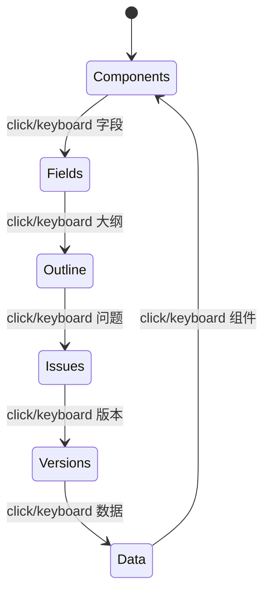
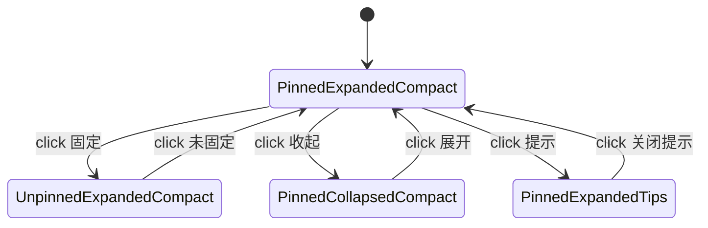
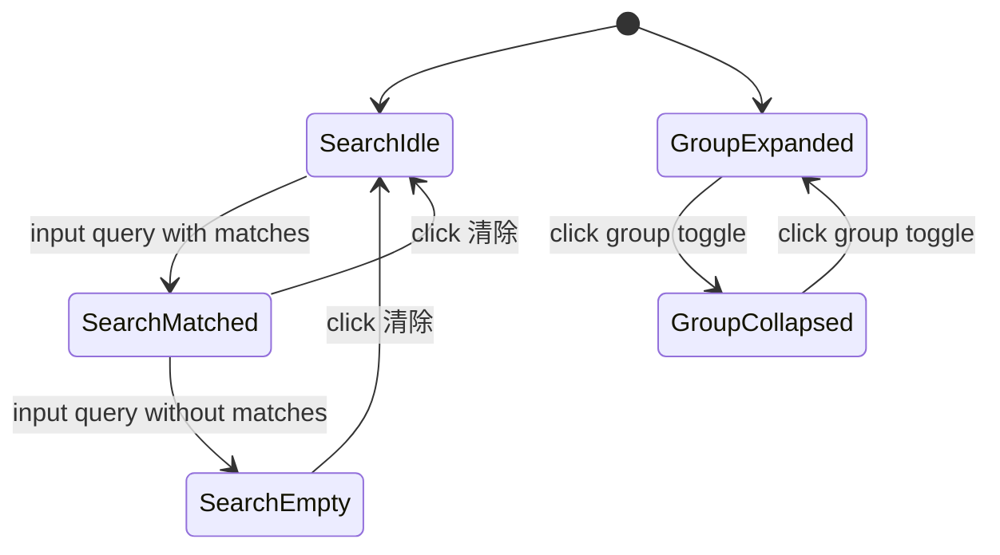
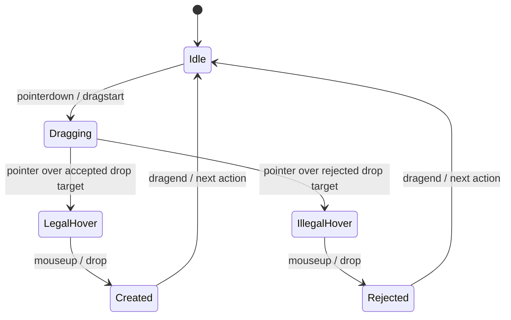

# PT-025 工具栏：04-Model-状态机与状态矩阵

版本：v1.2  
日期：2026-07-10  
范围：左侧工具栏、组件入口、字段入口、投放落点。

## 1. 工具栏模式状态机

## 2. 模式状态矩阵

| 状态 | 激活入口 | 可见面板 | 必须隐藏面板 | 自动化断言 |
|---|---|---|---|---|
| Components | `pt025-activity-item-components` | `toolbox-panel-components` | fields / outline / issues / versions / data | selected 仅 components；面板 `hidden=false` |
| Fields | `pt025-activity-item-fields` | `toolbox-panel-fields` | components / outline / issues / versions / data | selected 仅 fields；字段树可见 |
| Outline | `pt025-activity-item-outline` | `toolbox-panel-outline` | components / fields / issues / versions / data | 大纲树可见 |
| Issues | `pt025-activity-item-issues` | `toolbox-panel-issues` | components / fields / outline / versions / data | 问题列表可见 |
| Versions | `pt025-activity-item-versions` | `toolbox-panel-versions` | components / fields / outline / issues / data | 版本列表可见 |
| Data | `pt025-activity-item-data` | `toolbox-panel-data` | components / fields / outline / issues / versions | 数据源列表可见 |

## 3. 拖拽状态机

## 3. Dock 命令状态机

| 命令 | 初始状态 | 第一次点击结果 | 第二次点击结果 | 自动化断言 |
|---|---|---|---|---|
| 固定 | `data-dock-pinned=true` | `false`，按钮文本 `未固定` | `true`，按钮文本 `固定` | `aria-pressed` 同步 |
| 收起 | `data-dock-state=expanded` | `collapsed`，左侧明细宽度 `0`，按钮文本 `展开` | `expanded`，左侧明细宽度 `264`，按钮文本 `收起` | `data-command-state` 同步 |
| 提示 | `data-help-state=off` | `on`，按钮文本 `关闭提示` | `off`，按钮文本 `提示` | 说明仍以 hover/focus tooltip 展示，不常驻挤占卡片 |

## 4. 组件库搜索与分组状态机

| 场景 | 操作 | 期望状态 | 自动化断言 |
|---|---|---|---|
| 搜索命中 | 输入 `表格` | `data-palette-search-state=matched` | visibleGroups > 0，empty hidden |
| 搜索空态 | 输入不存在组件 | `data-palette-search-state=empty` | visibleGroups=0，empty visible |
| 清除搜索 | 点击 `pt025-palette-search-clear` | `data-palette-search-state=idle` | visibleGroups=7，empty hidden |
| 折叠分组 | 点击 `pt025-palette-group-layout-toggle` | `data-state=collapsed` | `aria-expanded=false`，分组高度约 33 |
| 展开分组 | 再次点击 toggle | `data-state=expanded` | `aria-expanded=true`，分组高度约 255 |

## 5. 拖拽状态机

## 6. 拖拽状态矩阵

| 场景 | 拖拽源 | 落点 | 期望结果 | Schema 变化 | 自动化断言 |
|---|---|---|---|---|---|
| 组件合法投放 | `palette-item-grid-layout` | `toolbox-preview-dropzone-section-main` | `toolbox-drop-result` 显示 created | true | `data-created-kind=component`、`data-created-type=GridLayout` |
| 字段合法投放 | `binding-asset-field-salesOrder-customerId` | `toolbox-preview-dropzone-field-customer` | `toolbox-drop-result` 显示 created | true | `data-created-kind=field`、`data-created-type=binding-asset-field-salesOrder-customerId` |
| 非法投放 | `palette-item-grid-layout` | `toolbox-preview-dropzone-field-customer` | `toolbox-drop-reject` 显示 rejected | false | `data-schema-mutated=false`、result 隐藏且无 created 属性 |

## 7. 状态覆盖结论

PT-025 已覆盖工具栏本轮 P0 状态：

- 默认态
- 选中态
- 六入口切换态
- 组件拖拽中
- 字段拖拽中
- 合法投放
- 非法投放
- 禁用组件
- tooltip 说明层
- Dock 固定 / 收起 / 提示命令
- 组件库搜索命中 / 空态 / 清除恢复
- 分组折叠 / 展开
- 自动化抓手状态

仍未纳入本轮合格范围：

- 工具栏搜索过滤空态的完整交互
- 分组折叠/展开交互回放
- 自动隐藏 Dock / hover reveal 的完整状态机
- 竞品截图级密度对比
