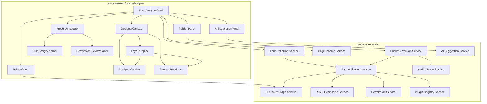
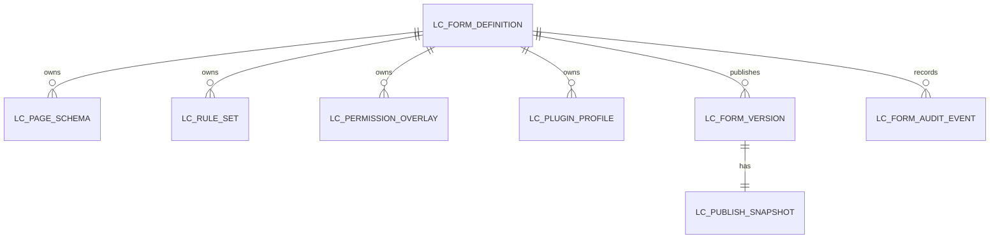

# T-207 表单设计器 · 技术设计文档

> 阶段：AI 研发流程阶段 3（详细设计）  
> 流程版本：`AI研发流程规范.md` v2.1  
> 质量档位：L3-strict，局部 L4  
> 版本：v2.0  
> 日期：2026-07-08  
> 上游：`../03-需求/T-207-表单设计器-功能规格文档.md`

---

## 1. 系统架构

### 1.1 架构目标

T-207 技术架构必须满足：

1. FormDefinition 和 PageSchema 分离，页面布局不修改 BO 实体。
2. 设计器定位为 PC Web 可视化布局设计器，能够还原复杂企业业务页面。
3. 设计态复用 Runtime Renderer，编辑能力以 overlay 实现。
4. LayoutEngine 负责 Grid、Flex、嵌套容器、局部滚动、Sticky 和 schema-to-CSS 映射。
5. 保存校验和发布校验服务端权威执行。
6. 权限、规则、插件、发布、审计均可追踪到版本。
7. AI 只生成建议 patch，不直接改发布版本。

### 1.2 模块图



### 1.3 模块职责

| 模块 | 职责 | 不负责 |
|---|---|---|
| FormDesignerShell | 五区布局、路由、全局状态、dirty/revision 管理 | 字段业务计算。 |
| PalettePanel | 组件、BO 字段、大纲入口，搜索和拖拽源 | 生成服务端规则。 |
| DesignerCanvas | 承载 RuntimeRenderer、LayoutEngine 和编辑 overlay，呈现真实 PC Web 页面 | 自己实现运行态字段控件，或用绝对定位堆业务页面。 |
| DesignerOverlay | selected、hover、drop target、invalid drop、吸附线、尺寸标注、快捷操作 | 改变运行态数据。 |
| LayoutEngine | Grid/Flex/嵌套容器/滚动/Sticky 布局计算、合法投放、schema-to-CSS、DOM-to-overlay 坐标映射 | 执行业务规则或绕过 Renderer。 |
| PropertyInspector | 业务/样式/布局/规则/权限/操作/插件属性编辑 | 绕过保存/发布校验。 |
| RuleDesignerPanel | UI/业务规则配置，表达式编辑，影响字段展示 | 执行服务端规则。 |
| PermissionPreviewPanel | 角色模拟、字段/操作权限状态解释 | 放宽后端权限。 |
| PublishPanel | 发布校验报告、影响分析、快照确认 | 跳过 P0 blocker。 |
| AI Suggestion | 生成 patch、解释风险、可撤销应用 | 直接发布或修改权限权威。 |
| FormValidation Service | 保存/发布校验、依赖图、权限放宽、插件边界 | UI 渲染。 |
| Publish Service | 事务发布、版本快照、回滚边界、影响分析 | 业务规则计算。 |

---

## 2. 元数据模型

### 2.1 FormDefinition

```json
{
  "formId": "fd_sales_order",
  "tenantId": "t_001",
  "appId": "sales",
  "boId": "bo_sales_order",
  "pageType": "bill",
  "name": "销售订单",
  "status": "draft",
  "schemaVersion": "1.0",
  "draftRevision": 12,
  "publishedVersionId": "fd_sales_order_v1",
  "createdBy": "u_001",
  "updatedAt": "2026-07-08T20:00:00+08:00"
}
```

| 字段 | 类型 | 必填 | 约束 |
|---|---|---|---|
| formId | string | 是 | 租户内唯一。 |
| tenantId | string | 是 | 所有查询必须带租户条件。 |
| appId | string | 是 | 所属应用。 |
| boId | string | 是 | 必须存在且当前用户有设计权限。 |
| pageType | enum | 是 | dynamicForm、bill、masterData、list、detail、filter、dialog。 |
| status | enum | 是 | draft、validating、published、deprecated。 |
| schemaVersion | string | 是 | 元数据协议版本。 |
| draftRevision | number | 是 | 乐观锁。 |

### 2.2 PageSchema

```json
{
  "pageId": "page_sales_order_form",
  "formId": "fd_sales_order",
  "viewType": "form",
  "rootNodeId": "root",
  "layout": {
    "mode": "grid",
    "columns": 24,
    "density": "compact",
    "labelPosition": "left"
  },
  "nodes": [
    {
      "nodeId": "field_customer",
      "type": "field",
      "component": "ReferenceSelect",
      "fieldRef": "customerId",
      "parentId": "root",
      "layout": { "span": 12, "order": 1 },
      "business": {
        "required": true,
        "readonly": false,
        "submit": true
      },
      "style": { "variant": "underline" },
      "permissionRef": "perm_customer"
    }
  ]
}
```

PC Web 复杂页面布局必须在 PageSchema 中表达为结构化 layout，而不是在画布中堆叠绝对坐标。示例：

```json
{
  "layout": {
    "display": "grid",
    "templateAreas": [
      "toolbar toolbar",
      "status status",
      "main aside",
      "footer footer"
    ],
    "templateColumns": "minmax(0, 1fr) 320px",
    "templateRows": "52px 40px minmax(0, 1fr) 48px",
    "height": "100vh"
  }
}
```

### 2.3 RuleSet

```json
{
  "ruleSetId": "rule_sales_order",
  "rules": [
    {
      "ruleId": "rule_amount_calc",
      "type": "business",
      "trigger": ["line.qty.change", "line.price.change", "save"],
      "condition": "line.qty != null && line.price != null",
      "actions": [
        {
          "type": "setFieldValue",
          "target": "line.amount",
          "expression": "line.qty * line.price"
        }
      ],
      "serverRequired": true
    }
  ]
}
```

### 2.4 PermissionOverlay

```json
{
  "profileId": "perm_sales_order",
  "fieldPolicies": [
    {
      "roleId": "clerk",
      "fieldRef": "amount",
      "state": "masked",
      "reason": "FINANCIAL_FIELD"
    }
  ],
  "actionPolicies": [
    {
      "roleId": "manager",
      "actionKey": "approve",
      "state": "enabled",
      "condition": "document.status == 'submitted'"
    }
  ]
}
```

---

## 3. 接口设计

### 3.1 设计器初始化

`GET /api/lowcode/forms/{formId}/designer-bootstrap`

| 参数 | 类型 | 必填 | 说明 |
|---|---|---|---|
| formId | string | 是 | 表单 id。 |
| pageId | string | 否 | 指定视图。 |
| versionId | string | 否 | 不传读取草稿。 |
| roleId | string | 否 | 权限模拟角色。 |

响应包含：

| 字段 | 类型 | 说明 |
|---|---|---|
| form | FormDefinition | 表单定义。 |
| pages | PageSchema[] | 当前表单所有视图。 |
| activePageId | string | 当前视图。 |
| businessObject | object | BO 字段、子表、关系摘要。 |
| componentRegistry | array | 可用组件及属性定义。 |
| permissionOverlay | object | 权限模拟结果。 |
| draftLock | object | 编辑锁。 |

### 3.2 保存草稿

`POST /api/lowcode/forms/{formId}/draft`

请求：

```json
{
  "baseRevision": 12,
  "form": {},
  "pages": [],
  "ruleSet": {},
  "permissionOverlay": {},
  "pluginProfile": {},
  "changeSummary": "添加客户字段和明细子表"
}
```

响应：

| 字段 | 类型 | 说明 |
|---|---|---|
| saved | boolean | 是否保存成功。 |
| revision | number | 新 revision。 |
| validation | ValidationReport | 保存校验报告。 |
| traceId | string | 审计链路。 |

错误码：

| code | 说明 |
|---|---|
| FD_403_DESIGN_DENIED | 无设计权限。 |
| FD_409_REVISION_CONFLICT | 草稿 revision 冲突。 |
| FD_422_SCHEMA_INVALID | schema 结构错误。 |

### 3.3 保存校验

`POST /api/lowcode/forms/{formId}/validate-draft`

校验项：

| code | severity | 定位 | 说明 |
|---|---|---|---|
| FD_NODE_DUPLICATED | error | nodeId | 节点 id 重复。 |
| FD_FIELD_MISSING | error/blocker | fieldRef | 字段不存在。 |
| FD_COMPONENT_MISSING | blocker | component | 组件未注册。 |
| FD_LAYOUT_INVALID | error | nodeId | 栅格或容器约束非法。 |
| FD_EXPR_SYNTAX | error | ruleId | 表达式语法错误。 |

### 3.4 发布

`POST /api/lowcode/forms/{formId}/publish`

请求：

```json
{
  "baseRevision": 13,
  "publishNote": "销售订单表单 v1",
  "confirmImpactHash": "sha256:abc"
}
```

响应：

| 字段 | 类型 | 说明 |
|---|---|---|
| published | boolean | 是否发布成功。 |
| versionId | string | 成功时返回。 |
| snapshotId | string | 成功时返回。 |
| validation | ValidationReport | 发布校验报告。 |
| impact | ImpactReport | 影响分析。 |
| rollbackBoundary | object | 回滚边界。 |
| traceId | string | 审计链路。 |

### 3.5 权限模拟

`POST /api/lowcode/forms/{formId}/permission-preview`

请求：

```json
{
  "roleId": "clerk",
  "pageId": "page_sales_order_form",
  "draftRevision": 13
}
```

响应：

```json
{
  "roleId": "clerk",
  "fieldStates": {
    "amount": {
      "state": "masked",
      "reason": "FINANCIAL_FIELD",
      "source": "backend-field-permission"
    }
  },
  "actionStates": {
    "approve": {
      "state": "hidden",
      "reason": "ROLE_DENIED"
    }
  }
}
```

### 3.6 AI 建议

`POST /api/lowcode/forms/ai-suggestions`

响应必须是 patch 建议：

```json
{
  "suggestionId": "ai_001",
  "patches": [
    {
      "op": "add",
      "path": "/pages/0/nodes/-",
      "value": {}
    }
  ],
  "explanation": "建议添加客户和明细子表。",
  "riskNotes": ["金额规则需要发布校验确认无循环依赖"],
  "requiresManualApply": true
}
```

---

## 4. 数据库设计



| 表 | 关键字段 | 说明 |
|---|---|---|
| LC_FORM_DEFINITION | id、tenant_id、app_id、bo_id、page_type、status、schema_version、draft_revision | 表单定义。 |
| LC_PAGE_SCHEMA | id、form_id、view_type、revision、schema_json、checksum | 视图 schema。 |
| LC_RULE_SET | id、form_id、revision、rules_json、dependency_hash | 规则集合。 |
| LC_PERMISSION_OVERLAY | id、form_id、revision、permission_json、backend_permission_version | 页面权限覆盖和模拟。 |
| LC_PLUGIN_PROFILE | id、form_id、revision、plugin_json、registry_version | 插件注册声明。 |
| LC_FORM_VERSION | id、form_id、version_no、snapshot_id、status、published_by、published_at | 发布版本。 |
| LC_PUBLISH_SNAPSHOT | id、form_id、version_id、snapshot_json、validation_json、impact_json、rollback_json | 不可变快照。 |
| LC_FORM_AUDIT_EVENT | id、tenant_id、form_id、version_id、event_type、actor_id、trace_id、payload_json、created_at | 审计事件。 |

索引要求：

| 表 | 索引 |
|---|---|
| LC_FORM_DEFINITION | tenant_id + app_id、tenant_id + bo_id |
| LC_PAGE_SCHEMA | form_id + view_type、form_id + revision |
| LC_FORM_VERSION | form_id + status、form_id + version_no |
| LC_FORM_AUDIT_EVENT | tenant_id + form_id + created_at、trace_id |

---

## 5. 核心逻辑

### 5.1 字段拖入

```text
addBoField(fieldId, targetNodeId, position):
  require design permission
  boField = metaGraph.getField(fieldId)
  assert boField belongs to bound boId
  target = pageSchema.getNode(targetNodeId)
  assert componentRegistry.allowsChild(target.component, "field")
  if field already used:
    return duplicate warning with locateExisting action
  component = componentRegistry.defaultFor(boField.type)
  node = create FieldNode(fieldRef=fieldId, component=component)
  apply default business/layout/style
  insert node
  mark draft dirty
  run local validation
```

### 5.2 保存校验

```text
validateForSave(draft):
  check unique nodeId
  check parent references
  check field references
  check component registry
  check layout constraints
  check pageType capability boundary
  check expression syntax
  check permission overlay shape
  return report
```

### 5.3 发布校验

```text
validateForPublish(draft, backendPermissionVersion, pluginRegistryVersion):
  report = validateForSave(draft)
  report += check backend permission is not widened
  report += build rule dependency graph and detect cycles
  report += check server-executable business rules
  report += check plugin event whitelist and context boundary
  report += renderer compatibility dry-run
  report += generate impact diff
  if any blocker:
    abort without version
  return report
```

### 5.4 发布事务

```text
publish(formId, baseRevision):
  begin transaction
  load draft FOR UPDATE
  assert draft.revision == baseRevision
  validation = validateForPublish(draft)
  if validation.hasBlocker:
    audit publish_rejected
    rollback transaction
    return rejected
  snapshot = create immutable snapshot
  oldVersion = mark active version deprecated
  newVersion = create active version
  update form publishedVersionId
  audit publish_success
  commit
```

事务要求：不能出现 snapshot 写入成功但 version 不存在、version 可见但 snapshot 缺失、旧版本下架但新版本失败的半发布状态。

---

## 6. 并发与一致性

| 场景 | 策略 |
|---|---|
| 多人编辑草稿 | draftRevision 乐观锁；可选短租约编辑锁。 |
| 保存与发布并发 | 发布携带 baseRevision；revision 变化则要求重新确认影响分析。 |
| 权限变更与发布并发 | 发布校验记录 backendPermissionVersion，提交前复核。 |
| 插件注册变更与发布并发 | 发布校验记录 pluginRegistryVersion，提交前复核。 |
| AI patch 与人工编辑冲突 | patch 基于 baseRevision 应用，冲突时提示人工选择。 |
| 回滚 | 只回滚到完整 snapshot；不回滚到草稿中间态。 |

---

## 7. 安全与权限边界

| 风险 | 设计约束 |
|---|---|
| PageSchema 放宽权限 | 发布校验和运行态均以后端权限为准。 |
| 前端隐藏字段泄露 | API、导出、打印统一走权限服务过滤/脱敏。 |
| 表达式注入 | 表达式引擎白名单语法，不执行任意 JS。 |
| 插件越权 | 插件通过受限上下文访问 ViewModel/DataModel，不能直接 DOM 或越权数据。 |
| AI 越权建议 | AI patch 应用前校验字段和权限，建议本身不修改发布版本。 |
| XSS | 标签、提示、富文本展示统一转义或白名单清洗。 |

---

## 8. 技术选型

| 领域 | 选择 | 说明 |
|---|---|---|
| 前端 | 复用现有 lowcode-web 技术栈 | 不另起孤立工程。 |
| Renderer | 复用 Runtime Renderer | 设计运行一致性的关键。 |
| 拖拽 | 优先使用仓库既有拖拽方案；无则评估 dnd-kit/React DnD | 新依赖需 ADR。 |
| 状态管理 | 复用现有前端状态方案 | 必须支持 selectedNode、dirty、revision、undo/redo。 |
| 表达式 | 复用平台表达式引擎 | 不新增私有语法。 |
| 权限 | 复用权限判定链 | 页面权限不做权威。 |
| 发布 | 复用版本发布服务 | 保证事务、审计、回滚一致。 |

---

## 9. 企业级 UI 与元素注册表设计

### 9.1 UI 架构约束

表单设计器 UI 必须按企业级后台工具重画。详细规范见：

| 文档 | 说明 |
|---|---|
| `T-207-表单设计器-企业级UI重设计规范.md` | UI 视觉、布局、色彩、Figma 重画验收标准。 |
| `T-207-表单设计器-全量表单元素设计规范.md` | 全量元素分类、状态、属性、权限和测试契约。 |
| `T-207-PC-Web可视化布局设计器规范.md` | PC Web 布局能力、LayoutEngine、复杂单据页面和 Figma 布局验收标准。 |

技术约束：

| 约束 | 实现要求 |
|---|---|
| 三栏结构 | Shell 固定左侧字段/控件/大纲，中间 RuntimeRenderer，右侧 PropertyInspector。 |
| PC Web 画布 | 中央画布必须呈现真实 Web 页面布局，包括 Toolbar、StatusBar、FormGrid、Subtable、SummaryBar、SidePanel、BottomActionBar。 |
| 强布局引擎 | LayoutEngine 必须支持 Grid、Flex、嵌套容器、局部滚动、横向滚动、Sticky、尺寸约束和布局校验。 |
| 企业低饱和风格 | 主题 token 限制主色、状态色和风险色使用范围。 |
| 控件库列表化 | PalettePanel 使用树/列表，不使用展示型彩色卡片。 |
| 属性面板表格化 | PropertyInspector 使用页签、属性分组、属性行。 |
| 治理能力面板化 | 权限、规则、发布影响、AI Patch 进入页签/抽屉/底部报告，不侵占主画布。 |
| 截图验收 | 每个主画板必须通过无重叠、无截断、无错乱换行、无底部裁切、低饱和企业风格检查。 |

### 9.2 PC Web 布局引擎

LayoutEngine 是表单设计器超过普通竞品的关键模块。它不只处理拖拽，而是把 PageSchema 的布局声明映射为可运行的 Web 布局，并把真实 DOM 布局结果反向提供给设计态 overlay。

| 能力 | 技术要求 |
|---|---|
| CSS Grid | 支持 12/24 列、自定义列、span、gap、named area、嵌套、minmax。 |
| Flex | 支持 row/column、align、justify、wrap、grow、shrink、basis、order。 |
| 尺寸系统 | 支持 fixed、fill、hug、min/max width/height，避免组件挤压和文本错乱。 |
| 滚动系统 | 支持页面滚动、局部滚动、表格横向滚动、滚动容器识别和 overlay 坐标同步。 |
| Sticky | 支持顶部命令栏、表格表头、汇总区、底部操作栏、侧边面板局部固定。 |
| 复杂容器 | 支持 Section、FieldGroup、Tabs、SplitPane、Collapse、Subtable、ActionBar、SummaryBar。 |
| 合法投放 | 根据父容器能力、子节点类型、PageType 和 BO 关系计算 DropTarget。 |
| 吸附与标注 | 拖拽/resize 时显示列线、边距、gap、span、px、百分比。 |
| schema-to-CSS | 将 PageSchema layout 编译为稳定 CSS Grid/Flex 样式。 |
| DOM-to-overlay | 从 RuntimeRenderer DOM 读取真实坐标，绘制选中框、控制点、吸附线。 |

绝对定位不得作为普通页面布局方案。它只允许用于选中框、吸附线、浮层、下拉、Tooltip 和套打模板。

### 9.3 ComponentRegistry

所有表单元素必须通过组件注册表进入设计器和运行态。

```json
{
  "componentKey": "Money",
  "category": "basic-input",
  "dataTypes": ["decimal"],
  "pageTypes": ["dynamicForm", "bill", "masterData"],
  "designer": {
    "paletteName": "金额",
    "icon": "number",
    "defaultSpan": 12,
    "defaultVariant": "underline"
  },
  "propsSchema": {
    "data": ["fieldRef", "defaultValue", "formatter"],
    "display": ["label", "placeholder", "helpText"],
    "validation": ["required", "min", "max", "precision"],
    "permission": ["readPolicy", "writePolicy", "maskPolicy"]
  },
  "states": [
    "default",
    "hover",
    "focus",
    "selected",
    "readonly",
    "disabled",
    "masked",
    "error",
    "permission-denied"
  ],
  "testContract": {
    "snapshotStates": ["default", "focus", "error", "masked"],
    "coverageTags": ["input", "money", "permission"]
  }
}
```

### 9.4 元素分类

| 分类 | 组件 |
|---|---|
| 基础输入 | Text、Password、Number、Money、Percent、Date、Time、DateTime、DateRange、Textarea、RichText、Code |
| 选择引用 | Select、MultiSelect、Radio、Checkbox、Switch、Reference、TreeSelect、Cascader、UserPicker、OrgPicker、TagPicker |
| 上传展示 | Attachment、ImageUpload、DisplayText、FormulaText、QRCode、Barcode、Divider、Alert |
| 业务语义 | BillNo、BillStatus、OrgField、UserField、AuditField、ApprovalComment、WorkflowNode、LinkBill |
| 布局容器 | Section、FieldGroup、Tabs、Grid、Flex、SplitPane、Subtable、CardList、Collapse、Stepper、ActionBar、SummaryBar、SidePanel、StickyRegion、Container |
| 操作命令 | Save、Submit、Approve、Reject、Delete、Close、Print、Import、Export、Copy、Convert、BatchAction、CustomAction、ApplyPatch |

### 9.5 单据设计器边界

单据设计器复用表单设计器 Shell，但 pageType 为 `bill` 时启用专用能力：

| 能力 | 技术要求 |
|---|---|
| 单据头 | 主表字段区，支持编号、状态、组织、客户、日期。 |
| 分录 | Subtable 组件增强，支持列配置、行级权限、批量录入、库存/财务影响。 |
| 尾部汇总 | Summary 区域，支持合计、税额、折扣、审批摘要。 |
| Web 布局 | 支持顶部 Sticky 命令栏、左右 SplitPane、局部滚动分录、底部 Sticky 操作栏。 |
| 状态流 | 绑定 T-104 状态机动作规则。 |
| 操作流 | 操作按钮由状态机和权限共同决定。 |
| 发布影响 | 必须输出审批、打印、接口、报表、数据迁移影响。 |

---

## 10. 风险与应对

| 风险 | 等级 | 应对 |
|---|---|---|
| Renderer 不完整导致设计态补实现 | 高 | Renderer 作为前置任务，设计器只做 overlay。 |
| 权限不一致造成越权 | 高 | 权限矩阵测试 + 服务端运行态二次校验。 |
| 规则循环或性能差 | 高 | 依赖图检测 + 增量计算 + 最大执行深度。 |
| 大表单卡顿 | 中 | 局部渲染、虚拟化大纲、规则依赖增量。 |
| 插件破坏事务 | 高 | 事件点白名单、上下文受限、统一异常策略。 |
| AI 产生错误 schema | 中 | patch 审查、撤销、保存/发布校验。 |
| 闭源竞品误用 | 中 | 只使用公开证据和自研抽象，保留证据边界。 |
| UI 展示化、花哨化 | 高 | 按企业级 UI 重设计规范验收，主界面禁止彩色展示卡片墙。 |
| 表单元素范围不完整 | 高 | ComponentRegistry 必须覆盖全量元素规范，缺失元素不得进入发布基线。 |
| 布局能力退化成简单表单 | 高 | 以 PC Web 布局设计器规范验收，复杂单据页面样例不通过则不得进入 Phase1 完成。 |
| 设计态与运行态布局不一致 | 高 | RuntimeRenderer 作为唯一主体渲染，LayoutEngine 只做 schema-to-CSS 和 overlay 坐标。 |
| 文本换行、截断、重叠、底部裁切 | 高 | Figma 和前端截图必须做布局缺陷检查，发现即阻断交付。 |

---

## 11. 阶段 3 自检

| 检查项 | 结论 | 说明 |
|---|---|---|
| 架构模块职责是否清晰 | 通过 | 前端、服务端、校验、发布、权限、插件、AI 分离。 |
| 接口字段是否完整 | 通过 | 初始化、保存、校验、发布、权限模拟、AI 建议已定义。 |
| 表结构是否覆盖必要字段 | 通过 | 定义、schema、规则、权限、插件、版本、快照、审计均覆盖。 |
| 核心逻辑是否有伪代码 | 通过 | 字段拖入、保存校验、发布校验、发布事务均有。 |
| 事务边界是否明确 | 通过 | 发布事务和半发布防护已定义。 |
| 并发控制是否合理 | 通过 | revision、权限版本、插件版本、AI patch 冲突均覆盖。 |
| 风险是否有应对 | 通过 | 第 10 章逐项应对。 |
| 企业级 UI 约束是否明确 | 通过 | 第 9 章补充 UI 架构约束和重画规范引用。 |
| 全量表单元素是否可注册和测试 | 通过 | 第 9.3-9.4 定义 ComponentRegistry 和元素分类。 |
| 强 Web 布局能力是否成为核心架构 | 通过 | 第 9.2 定义 LayoutEngine 和 PC Web 布局能力。 |
