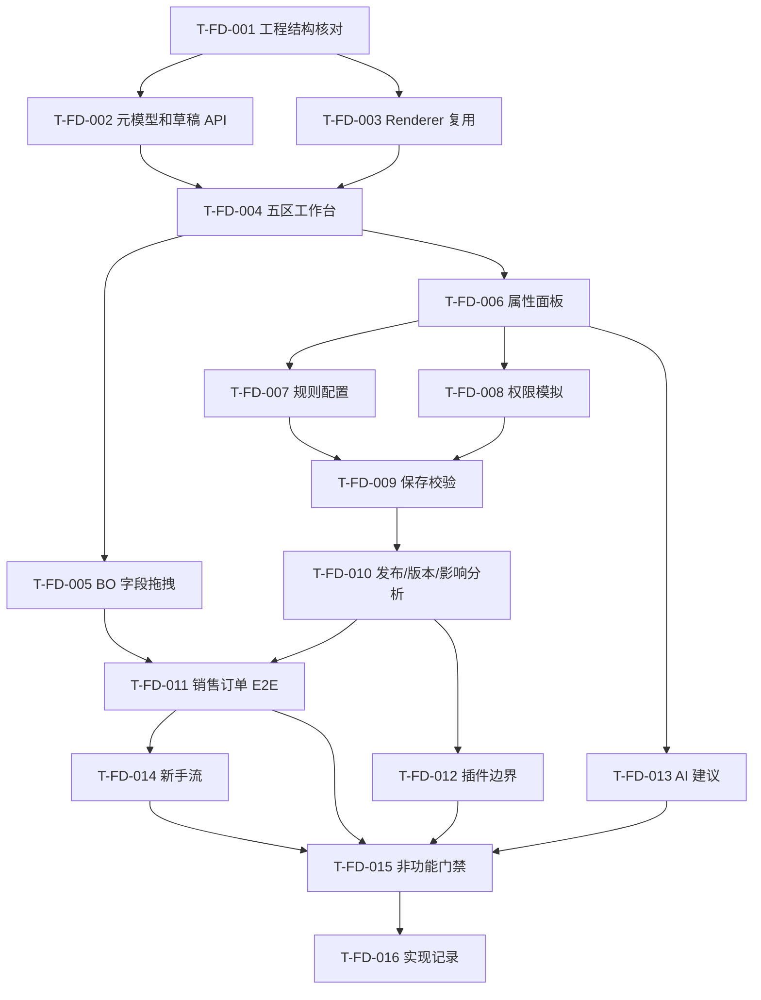

# T-207 表单设计器 · 开发任务列表

> 阶段：AI 研发流程阶段 6（任务分解）  
> 流程版本：`AI研发流程规范.md` v2.1  
> 质量档位：L3-strict  
> 版本：v2.0  
> 日期：2026-07-08  
> 上游：需求规格、功能规格、技术设计、自我评审、测试规格  
> 状态：开发计划；未开始编码实现

---

## 1. 任务基本信息

| 任务编号 | 关联功能 | 任务描述 | 预计工时 | 优先级 | 关联测试 |
|---|---|---|---:|---|---|
| T-FD-001 | 全部 | 工程结构核对：确认 lowcode-web、BO、Renderer、权限、表达式、发布、插件、审计真实路径和可复用接口 | 0.5d | P0 | 准备任务 |
| T-FD-002 | REQ-FD-001~004 | 实现 FormDefinition/PageSchema/RuleSet/PermissionOverlay 草稿模型和 API contract | 2d | P0 | TC-FD-001-N、TC-FD-002-E、TC-FD-003-E、TC-FD-004-N |
| T-FD-003 | REQ-FD-012、REQ-FD-015、REQ-FD-053 | 打通 RuntimeRenderer 设计态/预览态/运行态复用和一致性报告基础 | 2d | P0 | TC-FD-012-N、TC-FD-015-U、E2E-FD-003 |
| T-FD-004 | REQ-FD-010~014 | 实现五区工作台、顶部命令、左侧三态面板、底部路径和 selectedNode 同步 | 2d | P0 | TC-FD-010-U、TC-FD-011-N、TC-FD-013-N、TC-FD-014-S |
| T-FD-005 | REQ-FD-050、REQ-FD-011 | 实现 BO 字段优先拖拽、默认控件绑定、重复字段处理、invalid drop | 1.5d | P0 | TC-FD-050-N、TC-FD-011-N |
| T-FD-006 | REQ-FD-020~022、REQ-FD-051 | 实现属性面板分层、业务/样式/布局属性、属性搜索与解释 | 2d | P0 | TC-FD-020-N、TC-FD-020-U、TC-FD-021-E、TC-FD-022-B |
| T-FD-007 | REQ-FD-023~024 | 实现 UI/业务规则配置、表达式校验、规则依赖图和循环检测 | 2d | P0 | TC-FD-023-N、TC-FD-024-E |
| T-FD-008 | REQ-FD-025~026、REQ-FD-052 | 实现字段权限、操作权限、角色模拟、权限不放宽校验 | 2d | P0 | TC-FD-025-P、TC-FD-026-S、TC-FD-032-P、E2E-FD-004 |
| T-FD-009 | REQ-FD-030 | 实现保存校验服务：node、field、component、layout、expression 定位 | 1.5d | P0 | TC-FD-030-N、TC-FD-030-E |
| T-FD-010 | REQ-FD-031~034 | 实现发布校验、影响分析、版本快照、半发布防护和回放 | 2.5d | P0 | TC-FD-031-E、TC-FD-031-B、TC-FD-033-S、TC-FD-034-N |
| T-FD-011 | E2E | 实现销售订单 P0 端到端闭环样例和验收脚手架 | 1.5d | P0 | E2E-FD-001、E2E-FD-002 |
| T-FD-012 | REQ-FD-040~042 | 实现插件注册声明、事件点白名单、上下文边界校验和插件审计 | 1.5d | P1 | TC-FD-040-N、TC-FD-041-S、TC-FD-042-SEC |
| T-FD-013 | REQ-FD-043~044 | 实现 AI patch 建议、人工应用、撤销、风险解释和审计 | 1.5d | P1 | TC-FD-043-N、TC-FD-044-E、NFT-FD-AI-001 |
| T-FD-014 | REQ-FD-054 | 实现新手任务流：BO 选择、拖字段、配属性、预览、发布 | 1d | P2 | TC-FD-054-B |
| T-FD-015 | NFR-FD-* | 实现非功能测试门禁：性能、安全、权限、兼容、UI 截图、审计 | 2d | P0/P1 | NFT-FD-PERF-001~NFT-FD-AI-001 |
| T-FD-016 | 阶段 7 | 生成代码实现记录：功能/规则到文件、类、方法、测试的映射 | 0.5d | P0 | 阶段 7 交付物 |

---

## 2. 任务依赖关系

| 任务 | 前置任务 | 阻塞任务 |
|---|---|---|
| T-FD-001 | 无 | T-FD-002~016 |
| T-FD-002 | T-FD-001 | T-FD-004、T-FD-009、T-FD-010 |
| T-FD-003 | T-FD-001 | T-FD-004、T-FD-011、T-FD-015 |
| T-FD-004 | T-FD-002、T-FD-003 | T-FD-005、T-FD-006 |
| T-FD-005 | T-FD-004 | T-FD-009、T-FD-011 |
| T-FD-006 | T-FD-004、T-FD-005 | T-FD-007、T-FD-008 |
| T-FD-007 | T-FD-006 | T-FD-009、T-FD-010 |
| T-FD-008 | T-FD-006 | T-FD-009、T-FD-010、T-FD-011 |
| T-FD-009 | T-FD-002、T-FD-007、T-FD-008 | T-FD-010 |
| T-FD-010 | T-FD-009 | T-FD-011、T-FD-015 |
| T-FD-011 | T-FD-003、T-FD-005、T-FD-010 | T-FD-015 |
| T-FD-012 | T-FD-010 | T-FD-015 |
| T-FD-013 | T-FD-006、T-FD-009 | T-FD-015 |
| T-FD-014 | T-FD-011 | T-FD-015 |
| T-FD-015 | T-FD-002~014 | T-FD-016 |
| T-FD-016 | T-FD-015 | 阶段 8 |

循环依赖检查：未发现循环依赖。

---

## 3. 执行顺序

---

## 4. 验收标准

| 任务 | 验收标准 |
|---|---|
| T-FD-001 | 输出真实工程结构和可复用模块清单；后续任务路径按真实结构修正。 |
| T-FD-002 | 草稿模型可创建、读取、保存；revision 冲突被拒绝；PageSchema 不改 BO。 |
| T-FD-003 | 同一 schema 可在设计、预览、运行三态渲染；差异报告可归因。 |
| T-FD-004 | 五区工作台在三种视口不重叠；selectedNode 同步属性、大纲、路径。 |
| T-FD-005 | BO 字段拖入自动绑定默认控件；重复字段和非法 drop 有明确提示。 |
| T-FD-006 | 属性按业务/样式/布局/规则/权限分层；搜索可按业务含义定位。 |
| T-FD-007 | 规则可配置、可保存、可校验；循环依赖发布阻断。 |
| T-FD-008 | 权限在设计、预览、运行、API、导出、打印一致；权限放宽发布阻断。 |
| T-FD-009 | 保存校验可定位 nodeId、fieldRef、component、layout、expression。 |
| T-FD-010 | P0 blocker 阻断发布；发布成功生成不可变快照；超时无半发布。 |
| T-FD-011 | E2E-FD-001~004 均可执行；销售订单样例闭环。 |
| T-FD-012 | 插件未知事件点和上下文越界被阻断并审计。 |
| T-FD-013 | AI patch 可人工应用、撤销、审计；不能隐藏 blocker。 |
| T-FD-014 | 新手流完成销售订单从 BO 到发布的路径。 |
| T-FD-015 | 非功能门禁具备测试命令、截图、日志、审计或报告输出。 |
| T-FD-016 | 代码实现记录覆盖功能、规则、文件、类、方法、测试和差异说明。 |

---

## 5. 里程碑

| 里程碑 | 任务 | 完成定义 |
|---|---|---|
| M1 元模型与壳层 | T-FD-001~004 | 能打开设计器、加载草稿、渲染五区和空画布。 |
| M2 拖拽与属性 | T-FD-005~006 | 能拖 BO 字段并配置业务/样式/布局属性。 |
| M3 规则权限校验 | T-FD-007~010 | 能保存、发布校验、阻断风险并生成快照。 |
| M4 P0 闭环 | T-FD-011 | 销售订单 E2E 可执行。 |
| M5 增强能力 | T-FD-012~014 | 插件、AI、新手流达到 P1/P2 验收。 |
| M6 质量门禁 | T-FD-015~016 | 非功能门禁和实现记录完成。 |

---

## 6. 阶段 7 启动条件

阶段 7 编码前必须满足：

1. 阶段 1-6 文档均为 v2.1 / L3-strict 版本。
2. 人工确认 P0 范围：动态表单、五区工作台、属性、规则、权限、保存/发布、销售订单 E2E。
3. T-FD-001 先执行，确认真实仓库路径。
4. Renderer、BO、权限、表达式、发布服务不可用时必须提供 mock 和 contract test。
5. 不得先实现 AI/新手流而跳过 P0 闭环。

---

## 7. 阶段 6 自检

| 检查项 | 结论 | 说明 |
|---|---|---|
| 每个功能点是否都有对应任务 | 通过 | REQ-FD-001~054 均映射到 T-FD-002~014。 |
| 每个任务是否有关联测试用例 | 通过 | T-FD-002~015 均映射测试，T-FD-001/016 为准备/记录任务。 |
| 依赖关系是否有循环 | 通过 | 未发现循环。 |
| 优先级是否与功能点一致 | 通过 | P0 闭环优先，插件/AI P1，新手流 P2。 |
| 执行顺序是否正确 | 通过 | 工程核对 -> 元模型/Renderer -> UI -> 属性/规则/权限 -> 发布 -> E2E。 |
| 是否满足 L3 反形式主义门禁 | 通过 | 每个任务有验收标准和测试映射。 |

