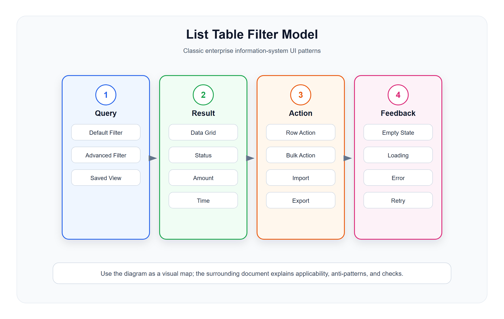

# 列表、表格与筛选模型

<!-- ui-model-diagram:start -->



> 图源文件：[`assets/02-list-table-filter-model.svg`](assets/02-list-table-filter-model.svg)

<!-- ui-model-diagram:end -->

## 1. 列表页的本质

信息系统列表页不是“数据显示容器”，而是用户发现对象、缩小范围、比较对象、执行动作的工作界面。

优秀列表页必须回答：

- 当前列表是什么对象？
- 默认展示的是哪些对象？
- 用户如何快速缩小范围？
- 每一行如何识别对象身份？
- 用户能对一行或多行做什么？
- 操作后如何确认结果？

## 2. 查询筛选模型

### 2.1 基础筛选

基础筛选只放高频条件。

常见字段：

- 关键字：编号、名称、手机号、条码。
- 状态：订单状态、支付状态、审核状态。
- 时间：创建时间、业务时间、完成时间。
- 组织：门店、仓库、部门、租户。
- 责任人：操作人、销售员、审核人。

设计要求：

- 高频条件默认展开。
- 低频条件放高级筛选。
- 时间条件必须明确默认范围。
- 状态筛选优先用业务文案，不直接暴露 code。
- 查询和重置位置固定。

### 2.2 高级筛选

高级筛选适合低频、组合、精确条件。

适用字段：

- 金额区间。
- 数量区间。
- 多状态组合。
- 渠道。
- 标签。
- 业务来源。
- 异常类型。

设计要求：

- 展开后不应破坏列表布局。
- 用户应用筛选后，应能看到当前已生效条件。
- 多条件筛选要支持一键清空。
- 筛选项很多时，用筛选抽屉或筛选面板。

### 2.3 保存视图

当用户经常使用固定筛选组合时，应支持保存视图。

适用场景：

- “今日待发货订单”。
- “本月大额退款”。
- “库存低于安全值商品”。
- “我负责的高价值客户”。

设计要求：

- 保存筛选条件、排序、列设置。
- 区分个人视图和公共视图。
- 默认视图要可控，不能被普通用户随意影响所有人。

## 3. 表格信息模型

### 3.1 字段优先级

表格字段按用户判断顺序排序，而不是按数据库字段排序。

推荐顺序：

1. 对象识别字段：编号、名称、头像、条码。
2. 关键状态字段：业务状态、支付状态、审核状态。
3. 决策字段：金额、数量、库存、等级、风险。
4. 时间字段：创建时间、更新时间、业务时间。
5. 责任字段：门店、员工、客户、供应商。
6. 操作字段。

### 3.2 状态展示

状态字段必须表达业务含义。

推荐结构：

```text
主状态：待支付
辅助状态：已锁库存
风险提示：即将超时
```

设计要求：

- 状态颜色必须少而稳定。
- 同一业务域内状态文案和颜色要一致。
- 异常状态优先级高于普通状态。
- 不要用红色表示所有“非正常”状态，需要区分警告、失败、危险、禁用。

### 3.3 数值展示

金额、库存、积分、数量等字段必须展示单位和精度。

设计要求：

- 金额带币种或默认币种说明。
- 数量带单位。
- 比例带百分号。
- 负数、冲正、退款要有明确视觉区分。
- 合计值要说明是否受筛选条件影响。

## 4. 表格操作模型

### 4.1 行操作

行操作只放用户最常用、与当前行强相关的动作。

常见动作：

- 查看。
- 编辑。
- 审核。
- 发货。
- 作废。
- 退款。
- 复制。

设计要求：

- 操作受状态控制，不可用时说明原因。
- 危险操作放更多菜单或二次确认。
- 同一行不要展示过多按钮。
- 主操作放在最容易点击的位置。

### 4.2 批量操作

批量操作用于一次处理多个对象，必须比单行操作更谨慎。

设计要求：

- 明确显示已选数量。
- 明确哪些对象可操作、哪些不可操作。
- 高风险批量动作需要确认摘要。
- 批量处理后要提供成功、失败、跳过明细。

推荐反馈：

```text
本次选择 120 条，成功处理 116 条，失败 4 条。
失败原因：
- 2 条状态不允许审核
- 1 条权限不足
- 1 条已被其他人处理
```

### 4.3 导入导出

导入导出是企业系统高风险能力，不只是一个按钮。

导出设计要求：

- 受权限控制。
- 受当前筛选条件控制。
- 大数据量异步导出。
- 导出文件记录可追踪。
- 敏感字段脱敏或二次授权。

导入设计要求：

- 提供模板。
- 预校验。
- 展示错误行和错误字段。
- 支持部分成功或全部回滚策略。
- 导入结果可下载。

## 5. 空状态、加载与错误

### 5.1 空状态

空状态分三类：

| 类型 | 说明 | 推荐处理 |
|---|---|---|
| 初始无数据 | 系统还没有对象 | 引导创建 |
| 筛选无结果 | 当前条件过窄 | 提供清空筛选 |
| 权限无数据 | 用户无权查看 | 解释权限边界 |

不要只显示“暂无数据”。

### 5.2 加载状态

设计要求：

- 查询时按钮进入 loading。
- 表格保留已有数据或显示骨架屏。
- 长时间任务给进度或异步结果入口。
- 防止重复提交。

### 5.3 错误状态

错误要可恢复。

设计要求：

- 网络错误提供重试。
- 权限错误说明申请路径。
- 业务错误说明原因和下一步。
- 系统错误提供错误码和追踪 ID。

## 6. 列表页检查清单

- 是否有明确默认筛选？
- 第一屏是否能识别对象、状态、金额/数量和时间？
- 高频筛选和低频筛选是否分离？
- 是否支持保存常用视图？
- 行操作是否受状态和权限约束？
- 批量操作是否有数量、失败明细和确认机制？
- 导入导出是否受权限、筛选和审计约束？
- 空状态是否区分初始无数据、筛选无结果和权限无数据？
- 表格列是否可配置且默认合理？
- 操作后是否能刷新并解释结果？