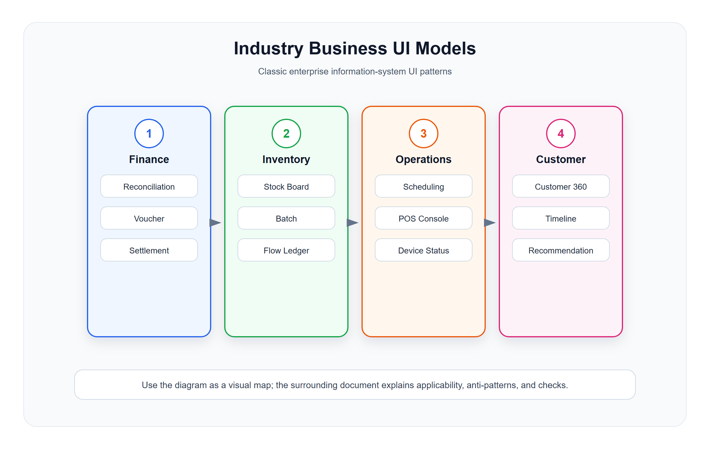

# 行业业务专用 UI 模型

<!-- ui-model-diagram:start -->



> 图源文件：[`assets/10-industry-business-models.svg`](assets/10-industry-business-models.svg)

<!-- ui-model-diagram:end -->

## 1. Reconciliation Workbench 对账工作台

### 适用场景

- 支付对账。
- 订单对账。
- 库存对账。
- 财务结算。
- 平台和第三方渠道对账。

### 标准结构

```text
对账批次
对账范围
汇总差异
差异分类
明细列表
匹配建议
处理动作
处理结果
```

### 设计要求

- 汇总差异必须能钻取到明细。
- 差异类型要分类：缺单、金额不一致、状态不一致、重复、时间差。
- 支持人工匹配和系统建议。
- 每个差异要有处理结果。
- 处理后能重新对账。

## 2. Inventory Board 库存作业板

### 适用场景

- 库存查询。
- 盘点。
- 调拨。
- 补货。
- 批次追踪。

### 标准结构

```text
仓库 / 门店范围
商品 / 批次 / 库位
可用库存
锁定库存
在途库存
预警状态
出入库流水
操作入口
```

### 设计要求

- 区分账面库存、可用库存、锁定库存、在途库存。
- 库存变化必须能追到流水。
- 负库存、超卖、过期批次要突出。
- 批次和库位维度要可切换。

## 3. Scheduling Board 排班调度板

### 适用场景

- 员工排班。
- 配送调度。
- 预约管理。
- 生产排程。
- 设备维护计划。

### 展示方式

| 方式 | 适用场景 |
|---|---|
| 日历视图 | 按日期安排 |
| 时间轴视图 | 按小时或班次安排 |
| 看板视图 | 按状态推进 |
| 甘特视图 | 长周期任务计划 |

### 设计要求

- 时间粒度明确。
- 冲突和重叠要可见。
- 支持拖拽但必须有确认和校验。
- 支持复制上一周期排班。
- 支持人员、资源、地点约束。

## 4. POS Operation Console 门店操作台模型

### 适用场景

- 门店后台。
- POS 设备管理。
- 营业状态监控。
- 同步状态排查。

### 标准结构

```text
门店状态
设备状态
营业数据
同步状态
异常提醒
常用操作
日志入口
```

### 设计要求

- 设备在线、离线、异常状态要清晰。
- 云端和门店数据同步状态要可解释。
- 异常要绑定设备、门店和时间。
- 常用操作要短路径，例如重试同步、查看日志、远程配置。

## 5. Customer 360 客户全景模型

### 适用场景

- CRM 客户详情。
- 会员运营。
- 客服工作台。
- 私域运营。

### 标准结构

```text
客户身份
价值摘要
标签画像
交易记录
权益余额
互动时间线
风险和投诉
推荐动作
```

### 设计要求

- 客户身份要合并多渠道标识。
- 交易、权益、互动要有时间线。
- 标签要区分系统标签和人工标签。
- 推荐动作要解释原因。

## 6. Financial Voucher 财务凭证模型

### 适用场景

- 收款单。
- 付款单。
- 退款单。
- 结算单。
- 发票。

### 标准结构

```text
单据头
  单号、状态、主体、期间
金额摘要
分录明细
关联业务单据
审批和记账状态
附件
审计日志
```

### 设计要求

- 金额必须展示币种、方向和精度。
- 借贷或收支方向要清晰。
- 单据必须能追溯到业务来源。
- 作废、冲正、红冲等操作要高风险确认。

## 7. Map / Location Operations 地图作业模型

### 适用场景

- 门店分布。
- 配送范围。
- 设备位置。
- 外勤人员。
- 区域经营分析。

### 设计要求

- 地图只在空间关系重要时使用。
- 地图点位要支持列表联动。
- 支持区域筛选和范围圈选。
- 不要用地图替代表格明细。

## 8. 行业模型检查清单

- 业务对象是否有行业特有状态？
- 是否需要流水、时间线或对账？
- 是否需要空间、时间、批次、设备维度？
- 是否有强审计要求？
- 是否需要异常闭环？
- 页面是否能从汇总追到原始业务事实？