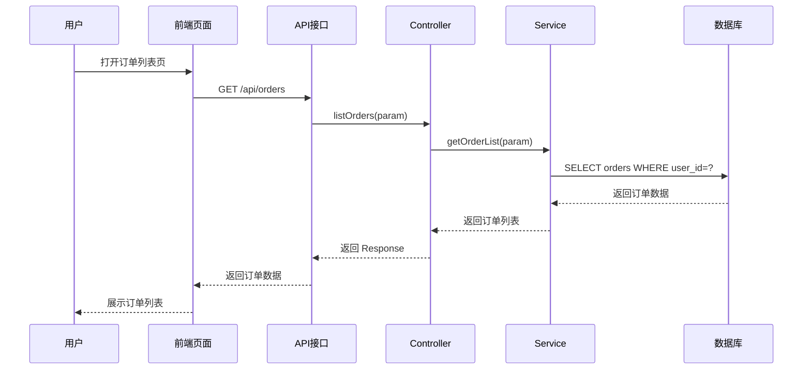

# SOP-03: 核心业务流程分析

> 版本：v3.1
> 上位约束：`SOP-00-业务系统分析SOP总览.md` v3.11
> 兼容编排契约：`SYS-ANALYSIS-CONTRACT-v3.0`
> 上位认知真源：`研发方法/业务系统分析-认知真源.md` v2.0（冲突定义以 L1 为准）
> 主流程回填：文档 20 的 DA1、DA3、DA4、DA6；对应验证为 V1、V2、V3、V5

本 SOP 是主流程中的业务协作专项取证，不拥有独立的 G5 通过权。输出必须使用 `SC/BC/REL/BR/INV/SM/IX` 稳定 ID，回填文档 20，并由文档 21 验证。

> 编写/修订规范：`研发方法/元规范-业务系统分析SOP编写规范.md`（修订前必须过自查卡）

---

---

## 0. 执行前置（AI 必须遵守）

> **本节为硬性指令，AI 执行本 SOP 时必须全部遵守，每条对应可验证产物。**
> 上位要求：执行前**先读取 SOP-00 §0 执行前置**并遵守其全部指令（含 §12.1 提示词模板自动生效）。

### 0.1 门禁检查（生成前必填，未全部通过 → 停止生成，先补齐）

- [ ] 已从业务价值选择流程（非菜单/接口），入选/排除依据有证据？
- [ ] 已建立业务结果族样本框，再选代表切片？
- [ ] 已确认范围/版本/环境/时间窗口/租户渠道基线？
- [ ] 已确认角色责任（发起/批准/执行/复核/异常）？

**未全部通过 → 停止生成，先补齐**

### 0.2 执行痕迹要求

| 要求 | AI 必须产出的可验证物 |
|------|------------------------|
| 执行前读 SOP-00 §0 | 文档开头输出"模板加载记录"（引用 SOP-00 §0 + 本 SOP） |
| 门禁先通过再生成 | 门禁检查结果（✅/❌） |
| 不遗漏本 SOP 分析维度 | 文档末尾输出"分析维度对照表"（本 SOP 要求维度 vs 实际输出，缺失必须补齐或登记 U-*） |
| 断言必须与源码核对 | 关键断言含 E-SRC 证据，禁止无证据打 ✅ |

### 0.3 独立验证声明

本 SOP 产物（专项报告/取证记录）必须由**未参与生成的独立 agent 执行验证**（文档 21，禁止自检）；本 SOP 不拥有独立 G5 通过权。

---

## 读者引导

### 目标读者

| 读者角色 | 阅读建议 |
|---|---|
| 业务分析人员 | 重点阅读 §1 流程识别、§2 流程梳理、§0.3 流程选择 |
| 开发/测试人员 | 重点阅读 §3 业务规则、§4 异常流程、§0.6 端到端追踪 |
| 架构师 | 重点阅读 §0.5 四类模型职责、§0.7 规则不变量契约 |
| AI 执行者 | 完整阅读，特别关注 §0.10 完成判据和 §0.11 AI 约束 |

### 前置知识

- BPMN 或泳道图基本概念
- 状态机与状态转换
- 业务规则、不变量、补偿等概念
- 前后端分离架构基本理解

### 阅读时长

- 快速定位（查特定场景检查项）：约 5 分钟
- 理解流程选择与分析维度：约 20 分钟
- 掌握输出模板与台账格式：约 15 分钟

### TL;DR

**一句话**：从角色、业务意图和可判定结果出发，还原跨前端、后端、数据和外部系统的完整协作流程。

**核心输入**：分析对象、触发/完成事件、角色责任、业务目标

**核心输出**：业务流程图、状态机、决策表、技术时序图、业务切片卡

**质量门槛**：删除所有技术名称（类名、方法名、表名）后，叙事仍能独立表达业务因果

**关键约束**：
- 业务流程 ≠ 代码调用链
- 失败路径与正常路径同等重要
- 现状事实 ≠ 合理设计

---

## 术语表

| 术语 | 定义 |
|---|---|
| 业务切片（SC） | 角色在特定条件下完成业务结果的场景 |
| 概念卡（CONCEPT-*） | 核心概念的定义、作用和关系 |
| 业务流程图 | 表达角色协作、业务活动、等待、分支、异常/补偿和价值结果 |
| 状态机（SM） | 核心业务对象的状态定义、合法转换和前置条件 |
| 决策表/决策树 | 多条件组合的命中策略、优先级和结果 |
| 技术时序图 | 页面/API/MQ/服务/数据库之间的实际交互 |
| 业务规则（BR） | 条件下允许、禁止、计算或触发某结果 |
| 不变量（INV） | 所有合法路径在观察点都必须保持的业务事实 |
| 因果叙事 | 删除技术标识后仍能独立表达业务过程的连贯文字 |
| 补偿/撤销 | 业务操作失败后的逆向操作或冲正 |
| 幂等 | 同一操作重复执行产生相同结果 |

## 目的

从角色、业务意图和可判定结果出发，还原跨前端、后端、数据、外部系统和人工流程的完整协作，建立场景、概念关系、规则、不变量、状态、交互以及失败恢复模型，为文档 20 的领域反向分析提供事实输入。

## 适用范围

- 核心业务场景（如：下单流程、支付流程、用户注册流程）
- 高频业务场景（如：商品查询、订单列表）
- 复杂业务场景（如：多步骤表单、审批流程）
- 异常业务场景（如：退款、取消、售后）

## 分析策略

**前后端结合，从端到端分析**

```
分析思路：
1. 从用户视角出发（前端页面 → 操作 → 响应）
2. 追踪数据流向（前端 → API → 后端逻辑 → 数据库）
3. 识别关键节点（业务决策点、状态变更点）
4. 评估业务合理性（规则是否完整、流程是否合理）
```

## 分析维度

```
核心业务流程分析
├── 1. 流程识别（为何选、服务谁、产生什么结果）
├── 2. 流程梳理（业务协作与技术实现分别建模）
├── 3. 业务规则分析（规则、状态机、不变量、指标口径）
├── 4. 异常流程分析（失败、补偿、撤销/冲正与人工介入）
├── 5. 端到端追踪（页面/API/MQ/任务/服务/数据/副作用/审计）
└── 6. 流程评估（证据、契约、问题闭环与完成判据）
```

## 0. 执行基线（强制）

> 本 SOP 以 `SOP-00` v3.7、`研发方法/业务系统分析-认知真源.md` v2.0、文档 20 和文档 21 为上位规则。以下要求优先于后文的简化示例；后文已有的前端、后端、规则（BR）、不变量（INV）、状态机（SM）、契约（CON）与异常分析方法继续保留，但不得脱离主流程单独执行。

### 0.1 基本原则与禁止事项

1. **业务语义先于技术结构**：先回答业务目标、用户任务、角色责任和价值结果，再定位页面、接口与代码。
2. **业务流程不等于代码调用链**：Controller → Service → Mapper 只能说明技术实现，不能替代角色协作、业务决策、等待、异常和价值结果。
3. **失败路径与正常路径同等重要**：P0/P1 流程只画 Happy Path 视为未完成。
4. **现状事实不等于合理设计**：分别记录现状、评价依据和目标建议，不因“代码就是这样”判定合理，也不因行业常见做法直接判定必须重构。
5. **证据不足不得补猜**：空白进入未知项、假设或矛盾台账；“未找到”不得写成“不存在”。
6. **图的职责不得混用**：业务流程图、状态机、决策表、技术时序图分别回答不同问题，不把所有信息塞入一张图。
7. **分析必须绑定基线**：所有关键图、表和结论均标注范围、版本、环境、时间窗口和证据 ID。

### 0.2 流程分析任务书与范围基线

开始追踪前先填写；未明确基线时，只能输出探索性结果或推断，不得声称已还原生产事实。

| 字段 | 必须说明 |
|---|---|
| 任务模式与分析/决策问题 | 认知重建说明要理解什么；只有决策支持或变更实施才填写要决定或改变什么。AI 不得自行升级任务模式 |
| 分析对象业务位置 | 核心业务域/支撑业务能力/技术平台能力/混合类型；它拥有与不拥有什么事实 |
| 业务目标与价值结果 | 流程为何存在，谁获得什么可观察结果，失败造成什么损失 |
| 用户任务 | 用户在何种情境下要完成什么任务，现有绕行方案是什么 |
| 角色与责任 | 谁发起、批准、执行、复核、知会、承担损失、处理异常并接受审计 |
| 系统与组织边界 | 范围内系统、模块、租户/商户/门店、渠道、上下游、外部机构和人工岗位 |
| 版本基线 | 仓库、分支/提交、部署版本、数据库版本、配置版本、接口/消息版本 |
| 环境与时间窗口 | 开发/测试/预发/生产环境，运行证据和数据样本的采集时段 |
| 范围内/范围外 | 本轮覆盖和不覆盖的流程、角色、渠道、地域、历史周期及原因 |
| 权限与安全边界 | 可访问证据、只读限制、脱敏要求、禁止执行的动作 |
| 停止条件 | 哪些证据足以支持当前决策，哪些未知项必须关闭 |

### 0.3 从业务价值选择流程，而不是从菜单选择

| 选择维度 | 关键问题 | 典型证据 |
|---|---|---|
| 业务目标 | 是否直接支撑营收、履约、资金、库存、客户权益、合规或关键经营决策 | KPI/OKR、制度、经营报表、事故影响 |
| 用户任务 | 是否是用户完成目标不可缺少的端到端任务，而非单个页面动作 | 用户观察、客服工单、操作手册、访谈 |
| 角色责任 | 是否跨角色/组织，是否涉及审批、复核、职责分离或损失承担 | RACI、权限配置、操作审计 |
| 价值结果 | 是否产生可确认的业务事实或价值交换，如入账、履约、权益生效 | 对账、状态、凭证、业务指标 |
| 风险暴露 | 失败是否导致资金/数据损坏、越权、合规问题或大面积中断 | 事故、告警、异常数据、审计发现 |
| 运行与变化 | 调用频率、金额/数据量、变更频率和历史缺陷是否较高 | 指标、Trace、发布记录、缺陷库 |
| 证据缺口 | 当前未知是否可能推翻高影响决策 | 未知项、矛盾项、假设台账 |

**优先级规则**：核心营收、资金、库存、权限、租户、不可逆数据操作及曾发生重大事故的流程优先；高频不必然核心，低频的关账、恢复、冲正、密钥轮换等也可能是 P0/P1。每个入选或排除的流程都要记录理由和证据。

**符号声明**：本文件中的 P0/P1（流程选择优先级）和 P0-P3（问题严重度，等同 SEV-P0~P3）均与 L1 的 SC-P* 切片深度分级无关。SC-P* 是分析深度配额（SC-P0 需过深度八关），由 SOP-00 §3.4/§3.5 定义并统一执行；本 SOP 的切片选取应优先按 SOP-00 候选分公式（不可替代性 0-5 + 失败冲击 0-5 + 频率变更率 0-3 + 跨边界耦合 0-3）排序，禁止把"缺陷严重度"或"流程优先级"直接写作"SC-P0"。

选择深挖流程前必须先建立业务结果族样本框，避免从少量菜单、接口或代码入口直接代表整个分析对象：

| 业务结果族/能力 | 上游触发事实 | 交付物/输出 | 接收角色 | 成功义务 | 失败后果 | 入口证据 | 覆盖状态 |
|---|---|---|---|---|---|---|---|
|  |  |  |  |  |  |  | 已覆盖/部分覆盖/未覆盖 |

**业务切片卡**：

| 字段 | 内容 |
|---|---|
| 切片 ID/名称 | `SC-xxx`（前缀 SC-，与 L1 及 SOP-00 §6.4 稳定 ID 一致）/ 使用业务语言命名 |
| 业务目标、用户任务、价值结果 | 不引用类名或接口名代替 |
| 发起/批准/执行/复核/异常责任 | 角色及职责分离 |
| 触发与完成事件 | 从什么业务事实开始，到什么可验证结果结束 |
| 上游事实与交付义务 | 权威来源、需交付的产物/结果、接收角色、有效时点和成功判据 |
| 失败业务后果 | 遗漏、错误、重复、延迟和结果未知分别影响谁的后续动作 |
| 范围与基线 | 版本、环境、租户/渠道、时间窗口、范围外项 |
| 业务对象与权威源 | 核心对象、主标识、状态与权威数据源 |
| 事实所有权边界 | 本流程/能力拥有、不拥有以及只保存快照或执行状态的事实 |
| 优先级及依据 | 价值、风险、频率、变化、事故、合规、证据缺口 |
| 验收与停止条件 | 必须覆盖的场景、证据和待关闭问题 |

### 0.4 场景覆盖矩阵

每条 P0/P1 业务切片逐项分析以下场景；不适用项必须写明业务理由，不得留空或统一填“无”。

| 场景 | 必须回答 |
|---|---|
| 正常 | 前置条件、主路径、完成事件、最终业务结果和审计凭证是什么 |
| 边界 | 0/最大值、空值、临界时刻、额度/库存边界、权限边界如何处理 |
| 失败/部分失败 | 哪一步失败，已发生的写入和外部副作用如何处理，用户看到什么 |
| 重复 | 重复点击、回调、消息重投、任务重跑如何识别；幂等键、作用域和有效期是什么 |
| 并发 | 多角色、多设备或多请求竞争时，冲突裁决、锁/条件更新和不变量是什么 |
| 超时/未知结果 | 客户端超时不等于服务端失败；谁查询最终态，何时重试、对账或转人工 |
| 撤销/冲正 | 使用删除、反向分录、补偿单还是新状态；原事实和关联关系能否审计 |
| 跨日/时区 | 自然日、营业日、账期、时区、夏令时、关账截点及迟到数据如何定义 |
| 历史数据 | 旧状态、旧字段、旧规则和迁移前数据如何解释，是否允许重放或重算 |
| 人工补偿 | 谁可补单、调账、改状态或重放，授权、双人复核、操作留痕和事后对账如何保证 |

记录最小反例和恢复路径。对于跨服务、跨库、MQ 或外部副作用，还必须标明事务边界、一致性模型、重试归属、补偿动作、对账与死信处理。

### 0.5 四类模型的职责边界

| 模型 | 回答的问题 | 必须包含 | 不应承载 |
|---|---|---|---|
| 业务流程图（BPMN/服务蓝图/泳道图） | 谁为完成什么业务目标，在何时与谁协作，经过哪些业务活动、等待、分支和人工处理 | 角色泳道、触发/完成事件、业务活动、决策点、等待、异常/补偿、价值结果 | Controller、私有方法、SQL 等全部代码调用细节 |
| 状态机 | 核心业务对象处于什么状态，哪些转换合法 | 状态定义、命令/事件、前置条件、执行角色、目标状态、副作用、失败态、终态和非法转换 | 多条件组合的复杂裁决、完整跨角色协作流程 |
| 决策表/DMN | 多条件组合按何优先级得到何种业务结果 | 条件、命中策略、优先级、结果、缺省行为、冲突/无匹配处理、适用版本 | 对象生命周期、网络调用先后顺序 |
| 技术时序图 | 某场景在页面/API/MQ/任务/服务/数据库/外部系统之间实际如何交互 | 同步/异步、调用顺序、事务边界、超时、重试、消息、读写和副作用 | 业务价值、完整规则集；不得冒充业务流程图 |

一个切片通常至少需要“业务流程图 + 状态转换表 + 规则/决策表 + 关键场景技术时序图”。简单流程可合并产物，但必须仍能分别回答四类问题。

### 0.6 端到端追踪链与步骤账本

#### 0.6.1 概念语义与作用分析（强制）

**目的**：每个核心概念必须从"是什么"升级到"在业务设计中起什么作用"，确保分析者不只描述代码结构，而是让读者理解概念的业务意义。

**核心概念定义卡**：

| 字段 | 必须回答 |
|---|---|
| 概念 ID | `CONCEPT-xxx`，与切片/规则/不变量 ID 同级编号 |
| 概念名称 | 源码中的枚举/字段/类/变量名，或业务术语 |
| 概念来源 | 源码出处（如 `PrnJobPurposeEnum`）或纯业务定义 |
| 业务语义 | 这个概念解决什么问题，表达什么业务事实 |
| 在业务设计中的作用 | 在业务流程/状态机/决策树中处于什么位置，触发什么动作或决策 |
| 与其他概念的关系 | 正交/依赖/组合？谁能替代它？去掉会怎样？ |
| 语义三角校验 | 声明语义（文档/注释）、实现语义（代码）、运行语义（实际行为）是否一致 |
| 证据与确定性 | 证据 ID；直接事实/交叉验证结论/推断/假设 |

**概念关系矩阵**：所有关系必须判定相对交易角色、建立/变更时机与变更影响；禁止把配置型关系写成“运行时不可改变”：

- **配置型（相对交易）**：关系实例通常作为业务交易的前置资料/规则被读取，而不是在每次交易中临时计算；实例仍可在配置维护期经授权入口变更，不得写成“运行时不可改变”
- **交易型**：在业务交易执行过程中创建、变更或解除
- **派生型**：由其他已证实事实计算得出，无独立维护入口或仅有只读投影
- **混合型**：同时包含配置部分与交易/派生部分时，必须分别说明边界、变更权限和历史影响

**字段名真实性门禁**：概念关系中引用的所有字段名必须与源码（Entity/POJO/DTO/VO/枚举/数据库Schema）中的实际字段名逐字段核对；跨层允许 API/DTO/DB/前端命名差异，但必须有可解析映射证据；禁止无映射猜测名。核对须记录层别、符号、出处和版本基线

**维护入口证据链（条件适用）**：先判定维护入口类型；仅当入口包含 UI 时启用下列清单，其他入口用对应链路，不适用段填“无/不适用”+理由。**UI 配置关系取证清单**（仅 UI 入口适用；适用项须有源码或契约证据）：
1. **配置入口路径**：哪个菜单/页面 → 哪个功能模块 → 哪个具体操作触发关系建立/变更/解除
2. **配置数据结构**：配置数据存储的具体表名、字段名；关联关系在哪个字段体现（外键/JSON/关联表/M2M）
3. **配置写入链路**：前端请求 → DTO/VO 字段映射 → Service 校验 → 持久化表和字段
4. **配置约束与校验**：唯一性约束、基数约束、业务规则校验
5. **配置生效读取链路**：业务操作时从哪个表/字段读取配置；是否有缓存延迟
6. **配置变更与解除语义**：修改后是否影响已产生的业务数据；解除关系时历史数据如何处理
7. **配置审计与历史**：变更记录（谁/何时/何操作/变更前后值）
8. **边界情况处理**：未配置时的默认行为；配置冲突时的优先级规则

| 概念A | 概念B | 关系类型 | 建立时机 | 说明 |
|---|---|---|---|---|
| CONCEPT-001 | CONCEPT-002 | 正交/依赖/组合 | 配置型/交易型/派生型/混合型 | 说明业务意义与变更影响 |

**概念一致性检查**：

- [ ] 同名不同义：不同模块中相同名称的概念是否表达不同的业务含义？
- [ ] 同义不同名：不同名称的概念是否实际表达相同的业务含义？
- [ ] 概念混淆：源码中的实现类名/枚举名是否被误当成业务概念？
- [ ] 隐式概念：是否存在读者需要自行推断才能理解的概念？

**示例（订单模块概念混淆问题）**：

| 概念ID | 概念名称 | 源码来源 | 业务语义 | 在业务设计中的作用 | 与其他概念关系 |
|---|---|---|---|---|---|
| CONCEPT-001 | `OrderStatusEnum` | 枚举类 | 订单当前的处理阶段（状态维度） | 决定用户可执行的操作，触发"能做什么"的决策 | 与支付状态枚举正交，共同决定订单完整性 |
| CONCEPT-002 | `PayStatusEnum` | 枚举类 | 订单的付款阶段（支付维度） | 决定资金流转和安全边界，触发"付没付"的决策 | 与订单状态枚举正交 |
| CONCEPT-003 | "已支付" | 文档/业务术语 | ~~已完成订单~~ → 模糊理解 | 文档混用了状态和支付状态 | 应映射到 OrderStatusEnum=已完成 且 PayStatusEnum=已支付 |
| CONCEPT-004 | "待处理" | 文档/业务术语 | ~~未付款待处理~~ → 模糊理解 | 文档未区分不同类型的待处理状态 | 应映射到 OrderStatusEnum=待处理 且 PayStatusEnum 可能为多种值 |

**输出要求**：每个业务切片至少定义其涉及的核心概念，不得出现"概念未定义"或"读者需自行推断"的情况。

每个关键切片至少贯通：

```text
业务目标 → 用户/角色任务 → 场景与触发条件
         → 页面/API/MQ/定时任务/批处理/脚本/人工入口
         → 应用服务与领域规则 → 状态机与不变量
         → 数据读写、缓存与权威源 → 外部副作用
         → 事务、一致性、幂等、重试、补偿与对账
         → 指标、日志、Trace、告警、审计
         → 测试、运行样本和证据 ID
```

**端到端追踪矩阵**（允许留空，但空白必须登记未知项）：

| 切片/场景 | 核心概念 | 页面/人工入口 | API/契约 | MQ/事件 | 任务/脚本 | 服务/规则/状态 | 数据/缓存/权威源 | 外部副作用 | 指标/审计/对账 | 测试与证据 | 未知项 |
|---|---|---|---|---|---|---|---|---|---|---|---|---|
| SC-xxx/... | CONCEPT-xxx | ... | ... | ... | ... | BR/SM/INV-... | ... | ... | ... | T-/E-... | U-... |

**步骤账本**用于记录每个关键节点：

| 步骤 | 执行者/系统 | 输入与前置条件 | 规则/决策 | 状态变化 | 数据读写 | 副作用 | 事务/一致性 | 失败与恢复 | 观测/审计 | 证据 |
|---|---|---|---|---|---|---|---|---|---|---|
| 1 | ... | ... | BR-... | SM-... | ... | MQ/支付/... | ... | ... | ... | E-... |

### 0.7 规则、不变量、指标口径与兼容契约

#### 0.7.1 业务规则

规则不只存在于 `if/validate`。还要检查前端校验、服务、SQL 条件、数据库约束/默认值/触发器、配置中心、规则表、脚本、任务、报表 SQL、人工制度和外部系统。

| 字段 | 必须记录 |
|---|---|
| 规则 ID 与业务表述 | `BR-xxx`，不得直接复制代码作为规则描述 |
| 触发与适用范围 | 角色、租户/门店、渠道、产品、时间、版本和历史数据 |
| 输入/输出/优先级 | 缺省行为、冲突裁决和无匹配行为 |
| 所有者与依据 | 批准人、制度/合同/经营策略、变更生效方式 |
| 实现与强制点 | 前端/服务/SQL/配置/任务/人工/外部系统；服务端是否可防绕过 |
| 例外与反例 | 正例、边界例、反例和历史兼容 |
| 证据与测试 | 证据 ID、测试 ID、确定性和验证状态 |

#### 0.7.2 业务不变量

不变量是任何合法路径都必须成立的业务事实，不等于单字段校验。记录 `INV-xxx`、业务表述、维护者、强制点、并发策略、破坏后果、检测信号、修复/对账机制、验证用例和证据。例如“一笔支付只产生一次有效入账，但可存在多次支付尝试和回调”。

#### 0.7.3 指标口径

对营收、订单、库存、会员、履约、结算等关键指标记录：业务定义与限制、事实粒度、公式与过滤、去重键、状态范围、事件时间/入库时间/营业日/账期/时区/截点、权威源与数据血缘、迟到数据/退款/冲正/历史重算、口径所有者、审批人与对账容忍度。同名异义、异名同义及在线/离线差异进入口径冲突台账。

#### 0.7.4 兼容契约

不能只核对前后端字段。须识别并分级：

- API：字段、类型、必填、枚举、错误码、分页/排序、幂等键、超时及版本策略；
- MQ/事件：Topic、Schema、Key/分区、顺序、重复、重投、消费确认和演进策略；
- 任务/文件：调度时刻、时区、文件路径/命名/编码、全量/增量、重跑语义和下游消费者；
- 数据：外部直连表/视图、字段语义、历史状态、默认值、唯一性和统计口径；
- 配置与缓存：配置 Key/默认值/动态刷新，缓存 Key/TTL/版本字段；
- 可观察行为：响应时机、状态可见性、错误语义、通知顺序和人工操作约定。

按“显式、隐式、灰色地带、已废弃”登记契约及调用方证据。未搜到调用方时仍要检查反射、配置、消息、任务、脚本、报表和数据库直连；无法确认则登记未知项，不得断言无人使用。

### 0.8 证据互证与结论规则

证据类型沿用 SOP-00，详见 `SOP-00 §5.1`。

| 证据 | 在流程分析中重点验证 | 不能单独证明 |
|---|---|---|
| SRC | 可能路径、规则实现、事务与错误处理 | 当前环境实际执行、业务语义正确 |
| DAT | 状态可达性、历史分布、异常与对账差异 | 产生原因和未来规则 |
| RUN | 特定环境/时段的实际链路、耗时、错误和调用方 | 未观测窗口中绝不存在其他路径 |
| CFG | 实际启用的开关、路由、超时、重试和部署拓扑 | 所有环境均相同 |
| CON | 外部依赖的请求/响应/消息/任务/数据行为 | 未登记调用方不存在 |
| DOC | 设计意图、制度和历史决策 | 当前实现与运行事实 |
| HUM | 某角色的认知、绕行和人工流程 | 系统实际行为或契约本身 |

关键结论使用稳定 ID：`C-xxx（直接事实/交叉验证结论/经验判断/推断/假设）← E-...`。关键流程至少用两类独立证据互证；静态调用图关键边尽量使用 RUN、DAT、CFG 或 CON 验证。无法动态验证时降低确定性并说明影响，不得把源码可能路径写成生产事实。

每份关键证据记录：版本/环境、采集时间、查询或复现步骤、直接性、时效性、覆盖度、可复现性、独立性、脱敏状态和适用范围。生产环境默认只读；测试、日志和样本不得包含凭据或未脱敏敏感数据。

### 0.9 未知项、假设与矛盾台账

| 字段 | 说明 |
|---|---|
| ID/类型 | `U-xxx` 未知、`H-xxx` 假设、`X-xxx` 矛盾 |
| 原始观察 | 只写观察到的事实，不混入解释 |
| 当前解释/候选解释 | 明确标注推断或假设 |
| 支持与反对证据 | 证据 ID，保留强反证 |
| 最小区分性验证 | 能以最低风险区分候选解释的动作 |
| 负责人/期限/状态 | 未验证、部分验证、交叉验证、已反证、已关闭 |
| 决策影响 | 不关闭是否会改变范围、风险、建议或上线决策 |

源码、配置、文档、数据和运行行为不一致时先登记矛盾，不得自行挑选一份覆盖其他证据。优先核对部署版本、灰度范围、功能开关、旁路入口、历史数据和采样时间。已反证假设保留反证原因，避免重复调查。

### 0.10 问题闭环与完成判据

问题必须区分缺陷、风险、技术债、改进机会和未知项。每条记录至少包含：现象与触发条件、期望行为或被破坏的规则/不变量/契约、范围与基线、证据与确定性、影响对象和半径、发生可能性/暴露频率/可检测性/可逆性、根因层级、临时缓解、候选方案（含不处理）、兼容/迁移/数据影响、验证标准、回滚方案、负责人、状态和复查日期。P0-P3 仅表示业务严重度（等同 SEV-P0~P3），不直接等于修复时限，也不以主观总分代替判断，且与 L1 的 SC-P* 切片深度分级无关。

**SOP-03 完成判据**：

- [ ] 入选流程可追溯到业务目标、用户任务、角色责任和价值结果；入选/排除依据有证据
- [ ] 已先建立业务结果族样本框，再选择代表切片；未覆盖结果族及影响已披露
- [ ] 分析对象业务位置、上游事实、交付义务和事实所有权边界可判定
- [ ] 范围、版本、环境、时间窗口、租户/渠道和范围外项已明确
- [ ] P0/P1 切片已覆盖正常、边界、失败、重复、并发、超时、撤销/冲正、跨日/时区、历史数据和人工补偿；不适用项有理由
- [ ] 业务流程图、状态机、决策表和技术时序图职责清楚，未把代码调用链冒充业务流程
- [ ] 每个 P0/P1 切片有连贯因果叙事，删除类名、方法名、接口名和表名后仍能解释业务
- [ ] 关键规则、状态机、不变量、指标口径和兼容契约已登记并关联证据
- [ ] 页面/API/MQ/任务/脚本/人工入口、服务、数据、缓存、外部副作用、指标、审计、对账和告警已端到端贯通
- [ ] 关键结论已由源码、数据、运行、配置、契约、文档、人员中的适当独立证据互证；证据质量和适用范围已说明
- [ ] 事务边界、一致性、幂等、重试、补偿、对账、死信和人工恢复已按适用性检查
- [ ] 未知、假设、矛盾和口径冲突已入账；影响当前决策的强反证为零
- [ ] 问题均有证据、影响、根因层级、负责人、验证标准、兼容影响和回滚/关闭条件
- [ ] 关键产物可由另一名分析者按证据索引和复现步骤复核
- [ ] 分析已足以支持任务书中的决策，继续投入的预期信息价值低于成本
- [ ] 本 SOP 产物已作为 L1 主文档的直接输入：SC-P0 切片将由主文档按 L1 深度八关（价值/叙事/轨迹/规则/失败/影响/证据/反例）验收；任一 SC-P0 未过关则整体分析未完成，不得以本 SOP 自检清单替代八关验收

### 0.11 AI 辅助分析约束

1. 不以类名、表名、字段名、枚举名、注释或接口名直接推断业务语义；必须标注推断并寻找数据、运行、契约或人员证据。
2. 不因代码搜索不到入口就断言流程不存在或无人使用；检查反射、配置、路由、MQ、任务、脚本、报表、数据库直连和人工入口。
3. 不把前端隐藏页面、菜单或按钮当作后端授权成立的证据；前端权限只用于导航和交互体验，不能证明服务端授权安全。
4. 不把测试通过等同生产成立，不把单条日志/单个样本外推为全量，不把文档意图写成现状事实。
5. 不只生成 Happy Path；主动构造边界、反例、重复、并发、超时、部分失败、跨日、历史数据和人工补偿问题。
6. 不混淆业务流程图与技术时序图；代码调用关系只能作为实现证据。
7. 不机械生成大而全的流程清单；优先高价值、高风险、高变化和高证据缺口切片。
8. 不直接建议重写或大规模重构；先识别兼容契约、调用方、历史数据、迁移、并行验证、功能开关、观测和回滚。
9. 输出必须区分现状事实、推断模型和目标建议，并同时给出范围、确定性、证据和关键未知项。
10. 证据冲突时不得擅自“选边”；建立矛盾项并提出最小区分性验证。
10. 无权访问生产或敏感数据时明确限制，优先使用只读、脱敏、可逆的验证方式，不伪装为已验证。

---

## 1. 流程识别

### 1.1 识别核心流程

**分析内容**：

```text
分析步骤：
1. 先从业务目标、用户任务、角色责任和价值结果建立候选流程
2. 再用功能模块、页面菜单、API、MQ、任务、数据与人工操作补全入口
3. 按业务价值、风险暴露、频率、变化、事故、合规和证据缺口排序
4. 记录入选/排除理由、范围基线和完成事件

识别方法：
├── 问：谁在什么情境下要完成什么业务任务？
├── 问：谁发起、批准、执行、复核、承担损失和处理异常？
├── 问：流程产生什么可核验价值结果，失败会破坏什么不变量？
├── 看：经营指标、事故、客服工单、审计与人工绕行
├── 看：数据库高频/高影响操作、核心 API、MQ、任务和脚本
└── 验：用运行、数据、配置、契约和人员证据确认候选流程
```

> 功能模块、菜单、表和代码调用仅用于发现与验证流程，不得直接作为业务流程边界。

**核心流程识别矩阵**：

| 维度 | 高频 | 低频 |
|------|------|------|
| **核心业务** | ⭐⭐⭐ 优先分析 | ⭐⭐ 重点分析 |
| **边缘业务** | ⭐⭐ 重点分析 | ⭐ 按需分析 |

**优先分析的场景**：

```
必须分析的核心流程：
├── 用户相关：注册、登录、修改密码、找回密码
├── 交易相关：下单、支付、退款、取消
├── 数据相关：增删改查（核心数据）
└── 财务相关：结算、对账、提现

按需分析的场景：
├── 管理相关：配置管理、权限管理
├── 统计相关：报表、数据导出
└── 辅助相关：消息通知、系统设置
```

#### 1.1.1 同一业务多实现与流程变体识别

流程识别不能按菜单、接口或客户分别结束。对具有相同业务目标、价值结果或核心业务事实的候选流程进行聚类，主动查找：

- 不同客户、渠道、区域、时期和软件版本是否存在不同流程；
- 同一事件是否进入不同规则集、审批链、状态机或异常恢复路径；
- 新旧流程是否同时处理新业务对象，或一个只处理历史/存量对象；
- 表面不同流程是否只是术语、界面或集成差异；表面相同流程是否已经发生语义分叉；
- 正向流程升级后，退款、撤销、冲正、补偿和对账是否仍由旧实现处理。

输出流程实现簇，而不是只输出一条“标准流程”：

| 业务能力/结果 | 实现/流程 ID | 适用域与路由条件 | 角色/规则/状态差异 | 数据与副作用 | 关系判断 | 证据/未知 |
|---|---|---|---|---|---|---|
| ___ | IMPL-/FLOW-___ | 客户/渠道/区域/版本/时间/历史状态 | BR/SM-___ | ___ | 等价/变体/分叉/兼容/替代/未知 | E-/U-___ |

存在多个实现时，先保留各自事实模型，再由 SOP-10 完成语义对齐、适用域交集、冲突和目标归一分析；不得过早画成一条合并流程。

### 1.2 流程分类

```
业务流程分类：

┌─────────────────────────────────────────────────────────────┐
│                      业务流程类型                           │
├─────────────────┬───────────────────┬─────────────────────┤
│    主流程        │    辅助流程        │    异常流程          │
├─────────────────┼───────────────────┼─────────────────────┤
│ 正常的业务操作    │ 辅助完成的操作      │ 非正常情况处理        │
│ 成功路径          │ 如：发送通知       │ 如：超时、失败、退款  │
│ 执行频率高        │ 执行频率低          │ 执行频率低但重要      │
└─────────────────┴───────────────────┴─────────────────────┘
```

---

## 2. 流程梳理

### 2.1 前端流程梳理

**分析方法**：

```
步骤1：找到对应的页面
步骤2：分析页面的组件结构
步骤3：追踪用户的操作路径
步骤4：识别 API 调用时机
步骤5：分析状态变化
```

**分析模板**：

```
## 前端流程分析

**页面/组件**：___
**路由**：___

### 页面结构
├── 包含哪些子组件
├── 数据展示组件
└── 操作组件

### 用户操作路径
1. 用户打开页面 → 触发 ___ API
2. 用户点击 ___ → 触发 ___ API
3. 用户提交 ___ → 触发 ___ API
...

### API 调用时序
┌────────┐     ┌────────┐     ┌────────┐
│  页面   │────→│  API   │────→│  响应   │
│  加载   │     │  请求   │     │  处理   │
└────────┘     └────────┘     └────────┘
     ↓
┌────────┐     ┌────────┐     ┌────────┐
│  状态   │────→│  渲染   │────→│  展示   │
│  更新   │     │  更新   │     │  结果   │
└────────┘     └────────┘     └────────┘
```

### 2.2 后端流程梳理

**分析方法**：

```
步骤1：找到对应的 Controller
步骤2：追踪请求处理链路
步骤3：识别 Service 层逻辑
步骤4：追踪数据操作
步骤5：识别事务边界
```

**分析模板**：

```
## 后端流程分析

**接口**：___
**Controller**：___

### 请求处理链路
Controller: ___ → Service: ___ → Mapper: ___

### 核心业务逻辑
1. 参数校验（校验规则：___）
2. 业务校验（校验规则：___）
3. 数据操作（读：___ / 写：___）
4. 状态变更（___ → ___）
5. 后续处理（发消息/发通知/___）

### 事务边界
├── 事务开始：___
├── 事务结束：___
├── 事务内操作：___
└── 事务外操作：___

### 数据库操作
├── 读操作：
│   ├── 表1：___（查询条件：___）
│   └── 表2：___（查询条件：___）
└── 写操作：
    ├── 表1：___（操作：插入/更新/删除）
    └── 表2：___（操作：插入/更新/删除）
```

### 2.3 技术时序图（用于解释实现，不替代业务流程图）

**绘制方法**：

```text
使用 Mermaid sequenceDiagram 绘制关键场景的技术交互：

用户/人工岗位 → 前端页面 → API → 应用服务 → 数据库/缓存/MQ/外部系统

必须标注同步/异步、事务边界、状态变化、超时、重试、失败返回和外部副作用。
业务目标、角色协作、业务等待、人工补偿和价值结果应在业务流程图/服务蓝图中表达。
```

**示例（仅为正常场景的技术时序，正式分析还须补失败与恢复场景）**：



---

## 3. 业务规则分析

### 3.1 规则识别

**分析方法**：

```
规则在哪里：
├── 前端：表单校验、按钮显隐逻辑
├── 后端：参数校验、业务校验
└── 数据库：约束、触发器

如何找规则：
├── 搜索关键字：validate, check, assert
├── 搜索关键字：if, when, where (业务判断)
├── 搜索关键字：status, state, type (状态枚举)
└── 看注释：TODO, FIXME, NOTE (说明业务逻辑)
```

**常见业务规则类型**：

```
┌─────────────────────────────────────────────────────────────┐
│                     业务规则类型                              │
├─────────────────┬───────────────────┬───────────────────────┤
│    准入规则      │    流转规则        │    校验规则            │
├─────────────────┼───────────────────┼───────────────────────┤
│ 谁能做这个操作    │ 状态如何流转        │ 操作需要满足什么条件    │
│ 如：余额 >= 0   │ 如：待支付→已支付   │ 如：金额 > 0         │
├─────────────────┼───────────────────┼───────────────────────┤
│    数量规则      │    权限规则        │    时间规则            │
├─────────────────┼───────────────────┼───────────────────────┤
│ 数量限制         │ 谁能看到/操作       │ 什么时候能做           │
│ 如：每人限购1件  │ 如：只能看自己的订单  │ 如：24小时内可退款    │
└─────────────────┴───────────────────┴───────────────────────┘
```

### 3.2 规则完整性检查

**检查清单**：

```
□ 前端校验了，后端也校验了吗？
□ 后端校验了，前端能友好提示吗？
□ 边界值校验了吗？（0、最大值、负数、空）
□ 并发情况下规则还成立吗？
□ 规则变更时，历史数据如何处理？
□ 规则有明确的状态定义吗？
□ 规则有明确的生效时间吗？
```

**规则冲突检查**：

```
常见规则冲突：

场景：订单取消
├── 规则A：用户可以取消未支付的订单
├── 规则B：超过5分钟未支付自动取消
├── 冲突：如果刚好在第5分钟，用户点击取消？
└── 检查：这两个规则是否互斥？如何处理？

场景：库存扣减
├── 规则A：库存不足不能下单
├── 规则B：下单成功立即扣减库存
├── 风险：并发超卖
└── 检查：是否有并发控制？
```

---

## 4. 异常流程分析

### 4.1 异常场景识别

**分析方法**：

```
识别异常场景：
├── 问：这个操作可能会失败吗？
├── 问：失败的原因可能有哪些？
├── 看：代码中的 try-catch
├── 看：异常日志
└── 看：后端接口的异常响应
```

**常见异常场景**：

```
┌─────────────────────────────────────────────────────────────┐
│                     异常场景分类                              │
├─────────────────┬───────────────────┬───────────────────────┤
│    数据异常      │    状态异常        │    业务异常            │
├─────────────────┼───────────────────┼───────────────────────┤
│ 数据不存在       │ 状态不对          │ 不满足业务条件           │
│ 如：订单不存在    │ 如：订单已取消还操作 │ 如：库存不足           │
├─────────────────┼───────────────────┼───────────────────────┤
│    权限异常      │    外部依赖异常     │    并发异常            │
├─────────────────┼───────────────────┼───────────────────────┤
│ 无权限操作       │ 第三方服务不可用     │ 多线程同时操作          │
│ 如：看别人的订单  │ 如：支付超时        │ 如：库存超卖           │
└─────────────────┴───────────────────┴───────────────────────┘
```

### 4.2 异常处理分析

**分析方法**：

```
异常处理检查：
├── 前端：异常时用户体验如何？
├── 后端：异常是否有日志？
├── 事务：异常时是否回滚？
└── 补偿：异常后是否有补偿机制？
```

**异常处理检查清单**：

```
□ 网络异常时前端如何提示？（友好提示 vs 报500错误）
□ 接口超时后前端如何处理？（重试 vs 放弃）
□ 后端异常时日志是否记录？
□ 事务失败时是否正确回滚？
□ 异常后是否有补偿/重试机制？
□ 异常信息是否泄露敏感信息？
□ 异常堆栈是否记录？
```

### 4.3 幂等性分析

**分析方法**：

```
幂等场景：
├── 支付回调（同一支付单号多次回调）
├── 订单创建（用户重复点击提交）
├── 消息消费（消息重复投递）
└── 重试机制（失败重试）

如何保证幂等：
├── 唯一键约束（数据库唯一索引）
├── 状态机检查（只有某状态才能变更）
├── 分布式锁（并发控制）
└── 请求ID去重（接口幂等token）
```

**幂等检查清单**：

```
□ 是否存在重复提交的可能？
□ 接口是否有幂等处理？
□ 数据库是否有唯一约束防止脏数据？
□ 状态变更是否有前置状态检查？
□ 消息消费是否有幂等处理？
```

---

## 5. 前后端对接分析

### 5.1 数据契约

**分析方法**：

```
对接分析步骤：
1. 查看前端调用的 API
2. 查看后端接口定义
3. 核对请求参数
4. 核对响应数据
5. 识别不一致
```

**数据契约检查**：

```
检查维度：

1. 字段名一致性
   ├── 前端：userId
   ├── 后端：user_id
   └── 问题：JSON序列化后字段名不同 ❌

2. 字段类型一致性
   ├── 前端：string
   ├── 后端：integer
   └── 问题：类型不匹配 ❌

3. 枚举值一致性
   ├── 前端：status = 'pending'
   ├── 后端：status = 0
   └── 问题：值不匹配 ❌

4. 必填/可选一致性
   ├── 前端：可不填
   ├── 后端：必填
   └── 问题：前端不填后端报错 ❌
```

### 5.2 状态同步

**分析方法**：

```
状态同步检查：
├── 后端状态变了，前端状态更新了吗？
├── 页面刷新后状态正确吗？
├── 多标签页/多设备状态一致吗？
└── 轮询/长连接实时性如何？
```

**状态同步检查清单**：

```
□ 操作成功后前端状态是否更新？
□ 是否有页面刷新后状态丢失的问题？
□ 是否有 WebSocket/长轮询实时更新？
□ 多设备登录时状态如何同步？
□ 浏览器返回时状态如何处理？
```

---

## 6. 流程评估

### 6.1 流程合理性评估

```
评估维度：

1. 完整性
   ├── 是否覆盖了所有业务场景？
   ├── 是否有遗漏的流程？
   └── 异常流程是否都有处理？

2. 合理性
   ├── 流程步骤是否必要？
   ├── 步骤顺序是否合理？
   ├── 是否有冗余操作？
   └── 用户体验是否友好？

3. 一致性
   ├── 同类操作流程是否一致？
   ├── 规则是否前后一致？
   └── 术语是否统一？

4. 可扩展性
   ├── 新增流程是否困难？
   ├── 规则变更是否复杂？
   └── 是否预留了扩展点？
```

### 6.2 问题识别

```
常见流程问题：

1. 流程断裂
   ├── 用户做完一步不知道下一步
   └── 后端缺少某个环节

2. 规则漏洞
   ├── 存在绕过的可能
   └── 边界情况未处理

3. 状态混乱
   ├── 状态定义不清
   ├── 状态流转错误
   └── 状态死锁

4. 性能问题
   ├── 流程步骤过多
   ├── 接口响应过慢
   └── 页面加载过慢

5. 安全问题
   ├── 权限校验缺失
   ├── 越权操作可能
   └── 数据泄露风险
```

---

## 输出模板

````markdown
# 核心业务流程分析报告

## 0. 报告基线

| 字段 | 内容 |
|---|---|
| 切片 ID / 流程名称 | SC-___ / ___ |
| 决策问题与负责人 | ___ |
| 业务目标 / 用户任务 / 价值结果 | ___ |
| 发起 / 批准 / 执行 / 复核 / 异常责任 | ___ |
| 版本基线 | 仓库提交：___；部署：___；数据库：___；配置：___；契约：___ |
| 环境与时间窗口 | ___ |
| 范围内 / 范围外 | ___ / ___ |
| 租户、渠道、地域等适用范围 | ___ |
| 分析人 / 复核人 / 日期 | ___ |
| 停止条件 | ___ |

## 1. 流程选择与业务定义

### 1.1 选择依据

| 维度 | 结论 | 证据 ID |
|---|---|---|
| 业务价值与结果 | ___ | E-___ |
| 用户任务与不可替代性 | ___ | E-___ |
| 角色责任与控制要求 | ___ | E-___ |
| 金额/数据/合规/事故风险 | ___ | E-___ |
| 频率、变化与证据缺口 | ___ | E-___ |

### 1.2 触发、完成与业务边界

- 触发业务事实：___
- 完成业务事实与验收结果：___
- 失败/待定结果：___
- 核心业务对象、标识与权威源：___
- 上下游、外部机构和人工岗位：___

## 2. 业务流程与角色协作

### 2.1 业务流程图/服务蓝图

```mermaid
flowchart LR
  %% 只表达角色协作、业务活动、等待、分支、异常/补偿和价值结果
```

### 2.2 业务步骤账本

| 步骤 | 角色/系统 | 输入与前置 | 业务活动/决策 | 状态变化 | 等待/时限 | 副作用 | 失败与恢复 | 指标/审计 | 证据 |
|---|---|---|---|---|---|---|---|---|---|
| 1 | ___ | ___ | BR-___ | SM-___ | ___ | ___ | ___ | ___ | E-___ |

## 3. 状态机、规则与不变量

### 3.1 状态转换表

| 状态机 ID/对象 | 当前状态 | 命令/事件 | 前置条件 | 执行角色 | 目标状态 | 副作用 | 失败后状态 | 非法转换处理 | 证据 |
|---|---|---|---|---|---|---|---|---|---|
| SM-___ | ___ | ___ | ___ | ___ | ___ | ___ | ___ | ___ | E-___ |

### 3.2 决策表

| 规则 ID | 条件组合 | 优先级/命中策略 | 结果 | 缺省/冲突/无匹配处理 | 适用范围与版本 | 实现位置 | 证据/测试 |
|---|---|---|---|---|---|---|---|
| BR-___ | ___ | ___ | ___ | ___ | ___ | ___ | E-___ / T-___ |

### 3.3 不变量目录

| 不变量 ID/业务表述 | 维护者/强制点 | 并发策略 | 破坏后果 | 检测信号 | 修复/对账 | 验证用例 | 证据 |
|---|---|---|---|---|---|---|---|
| INV-___ | ___ | ___ | ___ | ___ | ___ | T-___ | E-___ |

## 4. 场景覆盖与技术时序

### 4.1 场景覆盖矩阵

| 场景 | 场景 ID/样本 | 预期结果 | 实际机制与结果 | 恢复/补偿 | 证据 | 状态/不适用理由 |
|---|---|---|---|---|---|---|
| 正常 | SC-___ | ___ | ___ | ___ | E-___ | ___ |
| 边界 | SC-___ | ___ | ___ | ___ | E-___ | ___ |
| 失败/部分失败 | SC-___ | ___ | ___ | ___ | E-___ | ___ |
| 重复 | SC-___ | ___ | ___ | ___ | E-___ | ___ |
| 并发 | SC-___ | ___ | ___ | ___ | E-___ | ___ |
| 超时/未知结果 | SC-___ | ___ | ___ | ___ | E-___ | ___ |
| 撤销/冲正 | SC-___ | ___ | ___ | ___ | E-___ | ___ |
| 跨日/时区 | SC-___ | ___ | ___ | ___ | E-___ | ___ |
| 历史数据 | SC-___ | ___ | ___ | ___ | E-___ | ___ |
| 人工补偿 | SC-___ | ___ | ___ | ___ | E-___ | ___ |

### 4.2 关键场景技术时序图

```mermaid
sequenceDiagram
  %% 标注页面/API/MQ/任务/服务/数据/外部系统、同步/异步、事务、超时、重试和副作用
```

### 4.3 事务、一致性与恢复

| 节点 | 事务边界 | 一致性模型 | 幂等键/作用域/有效期 | 超时与重试归属 | 补偿/对账/DLQ/人工恢复 | 风险 | 证据 |
|---|---|---|---|---|---|---|---|
| ___ | ___ | ___ | ___ | ___ | ___ | ___ | E-___ |

## 5. 端到端业务到实现追踪

| 场景 | 核心概念 | 页面/人工入口 | API/契约 | MQ/事件 | 任务/脚本 | 服务/规则/状态 | 数据/缓存/权威源 | 外部副作用 | 指标/审计/对账 | 测试/证据 | 未知项 |
|---|---|---|---|---|---|---|---|---|---|---|---|---|
| SC-___ | CONCEPT-___ | ___ | ___ | ___ | ___ | BR/SM/INV-___ | ___ | ___ | ___ | T-/E-___ | U-___ |

## 6. 指标口径与兼容契约

### 6.1 指标口径卡

| 指标 | 定义/限制 | 事实粒度 | 公式/过滤/去重 | 时间语义/截点 | 权威源/血缘 | 退款/冲正/迟到/重算 | 所有者/对账 | 证据 |
|---|---|---|---|---|---|---|---|---|
| MET-___ | ___ | ___ | ___ | ___ | ___ | ___ | ___ | E-___ |

### 6.2 兼容契约清单

| 契约 ID/类型 | 生产者/消费者 | 可观察行为与版本 | 显式/隐式/灰色/废弃 | 历史数据依赖 | 变更影响/兼容期 | 证据/确定性 |
|---|---|---|---|---|---|---|
| CON-___ / API、MQ、任务、数据、配置、缓存 | ___ | ___ | ___ | ___ | ___ | E-___ / ___ |

## 7. 证据、结论与台账

### 7.1 关键结论与证据

| 结论 ID/结论 | 确定性 | 证据 ID | 版本/环境/时间 | 质量与覆盖缺口 | 验证状态 |
|---|---|---|---|---|---|
| C-___ | 直接事实/交叉验证结论/经验判断/推断/假设 | E-___ | ___ | ___ | ___ |

### 7.2 未知、假设、矛盾和口径冲突

| ID/类型 | 原始观察 | 当前/候选解释 | 支持/反对证据 | 最小区分性验证 | 决策影响 | 负责人/期限/状态 |
|---|---|---|---|---|---|---|
| U/H/X/MET-X-___ | ___ | ___ | E-___ | ___ | ___ | ___ |

## 8. 问题闭环

| 问题 ID/类型/严重度 | 现象与触发 | 被破坏规则/不变量/契约 | 范围/证据/确定性 | 影响/可能性/可检测性/可逆性 | 根因层级 | 缓解与候选方案（含不处理） | 兼容/迁移/数据影响 | 验证/回滚/关闭条件 | 负责人/状态 |
|---|---|---|---|---|---|---|---|---|---|
| P-___ | ___ | BR/INV/CON-___ | ___ | ___ | ___ | ___ | ___ | ___ | ___ |

## 9. 业务设计初评与 SOP-09 输入

| 维度 | 现状事实 | 评价依据 | 结论与确定性 | 关键风险/未知 | 建议及替代方案 |
|---|---|---|---|---|---|
| 价值与责任 | ___ | ___ | ___ | ___ | ___ |
| 流程完整性与效率 | ___ | ___ | ___ | ___ | ___ |
| 规则/状态/不变量 | ___ | ___ | ___ | ___ | ___ |
| 失败恢复与运营 | ___ | ___ | ___ | ___ | ___ |
| 一致性/安全/兼容 | ___ | ___ | ___ | ___ | ___ |

本节只形成流程级初评和证据输入。若结论将用于选择、改造或批准业务设计，必须执行 `SOP-09-业务设计合理性评审.md`，完成红线门槛、候选方案、反事实、成本与条件化结论。输出至少关联设计 ID `BD-___`、不变量、阻断门槛、候选方案和关键未知项。

> 不计算缺乏统计依据的综合总分。建议不得仅写“优化/重构”，必须给出证据、替代方案、兼容影响、验证标准和回滚方案。

## 10. 完成判据与复核

- [ ] 流程选择、范围基线、十类场景、四类模型、端到端追踪均满足 0.10 节
- [ ] 影响当前决策的未知项已有关闭、隔离或验证计划，未解释强反证为零
- [ ] 另一名分析者可按证据索引和复现步骤复核关键结论
- [ ] 未覆盖范围、剩余风险和需要人类确认的事项已明确
- [ ] 业务结果族、代表故事、失败后果和事实所有权可作为理解层主文档的直接输入

**完成状态**：通过 / 有条件通过 / 未通过  
**未通过项与下一步**：___  
**业务/技术/运维/数据复核人**：___
````

---

## 关联文档

- SOP-00: 业务系统分析 SOP 总览
- SOP-01: 前端整体分析
- SOP-02: 后端整体分析
- SOP-04: 功能点深度分析
- SOP-05: 前后端对接分析
- SOP-06: 数据模型分析
- SOP-07: 综合评估与报告
- SOP-09: 业务设计合理性评审
- SOP-10: 业务演进多实现归一与重构迁移
- 主方法论: `10-方法论-复杂既有系统拆解与架构分析.md`

## 文档修订记录

| 版本 | 日期 | 修改内容 | 修改人 |
|------|------|---------|-------|
| v1.0 | 2026-07-31 | 初稿创建 | - |
| v1.1 | 2026-07-31 | 对齐 SOP-00 v1.2 与主方法论：补充业务价值驱动的流程选择、范围基线、全场景覆盖、四类模型职责、规则/不变量/指标/契约、端到端追踪、证据互证、未知与矛盾台账、问题闭环、完成判据和 AI 约束；升级报告模板 | AI |
| v1.2 | 2026-07-31 | 将合理性章节定位为流程级初评，并把正式业务设计门槛和候选方案比较转交 SOP-09 | AI |
| v1.3 | 2026-08-01 | 对齐 SOP-00 v1.9 术语规范，明确规则（BR）、不变量（INV）、状态机（SM）、契约（CON）在各章节的标注 | AI |
| v1.4 | 2026-08-01 | 接入编排契约 v2.1，定位为 DA1/DA3/DA4/DA6 业务协作专项取证，并强制回填 V1/V2/V3/V5 | AI |
| v1.5 | 2026-08-01 | 接入编排契约 v2.3；增加任务模式锁定、分析对象业务位置、业务结果族样本框、业务交付义务和删除技术标识后的因果叙事门禁 | AI |
| v1.6 | 2026-08-01 | 对齐 SOP-00 v2.4：兼容编排契约 v2.3→v2.4，上位约束 v2.2→v2.4；AI 约束补充前端隐藏不等于后端授权 | AI |
| v1.7 | 2026-08-03 | 修正文件头与修订记录不一致；对齐 SOP-00/编排契约 v2.9 | AI |
| v1.8 | 2026-08-03 | 对齐 SOP-00/编排契约 v2.9；概念关系矩阵增加建立时机分类和字段名真实性门禁；补充 UI 配置关系完整取证清单（8项） | AI |
| v1.9 | 2026-08-03 | 纠正静态关系定义；UI 清单改为条件适用；字段门禁允许有证据跨层映射；对齐 SOP-00 v2.9.1 | AI |
| v2.7 | 2026-08-03 | 新增读者引导（目标读者、前置知识、阅读时长）、TL;DR 摘要、术语表 | AI |
| v3.0 | 2026-08-03 | 对齐 SOP-00 v3.0 及 L1 认知理论：更新上位约束、编排契约，增加上位认知真源声明；切片 ID 统一为 SC-*；P0/P1 流程级与严重度含义声明与 SC-P* 深度分级无关 | AI |
| v3.1 | 2026-08-05 | 新增 §0 执行前置（门禁/执行痕迹/独立验证），对齐元规范 v3.0 | AI |
