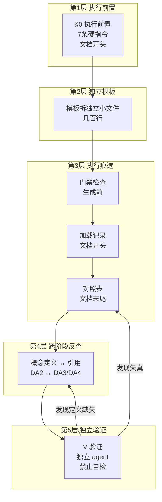

# 元规范-业务系统分析SOP编写规范

> **定位**：指导"如何编写/修订业务系统分析类 SOP"的元规范
> **读者对象**：编写/修订 SOP-00 及下位 SOP（SOP-01~10）、文档 20/21 的 AI 与人工
> **使用场景**：① 新建 SOP 按本规范起草；② 修订 SOP 先过附录自查卡；③ 评审 SOP 按 §5.4 判废信号检查
> **优先级**：本规范为**机制性**要求（执行痕迹/独立验证/配额）。与 SOP-00 等执行文档冲突时——机制性要求以本规范为准，领域性内容以对应执行文档为准
> **版本**：v3.1 | **日期**：2026-08-05

---

## 1. 定位与边界

SOP 是业务系统分析的**执行契约**（任务准入/执行流程/质量门禁/交付产物），不是领域分析教程。

### 1.1 三条硬边界（违反即废稿）

| 边界 | 说明 | 反例 |
|------|------|------|
| 不写领域概念 | 领域对象由分析时决定 | ❌ "必须覆盖顾客联设置" |
| 不写项目事实 | 不写类名/表名/参数值 | ❌ "重试 2000ms、超时 45 分钟" |
| 不写实现细节 | 不把某次分析发现当通用规律 | ❌ "系统有 8 种处理器" |

**判定标准**：换一个领域（订单/库存/会员/支付）后是否仍成立？成立则通用，不成立则领域污染。

### 1.2 可以写什么

| 类别 | 示例 |
|------|------|
| 机制 | 反查、追溯、门禁、对照表、独立验证、分次执行 |
| 原则 | 按业务语义分组、证据纪律、深度配额 |
| 格式要求 | 全景卡字段、对照表结构、叙事比重 |
| 判定标准 | 未定义引用→U-* 或回填；无加载记录→视为未执行 |

---

## 2. 四个核心原则（来自实践验证）

### 原则 1：要求必须配套可验证的执行痕迹

**"要求写进 SOP 文档" ≠ "AI 执行时会遵守"**——这是经过多轮迭代验证的核心事实。SOP 中的每条关键要求，必须配套 AI 必须产出的**可验证物**：

| 要求 | 执行痕迹（AI 必须产出） |
|------|------------------------|
| "生成 DA 前读模板" | DA 文档开头输出"模板加载记录" |
| "先过门禁再生成" | 门禁检查结果 |
| "不遗漏模板字段" | DA 文档末尾输出"模板字段对照表" |
| "间接关系写为什么经过中间对象" | 契约含该章节（V 验证核对） |

**无痕迹的要求等于没写。**

### 原则 2：AI 自检必然失真，独立验证兜底

生成者自检自己的虚构会得到"通过"（实证：V1 验证对不存在的枚举打 ✅）。因此：
- 任何由生成者自己执行的检查不能作为验收依据
- V 验证必须由**未参与生成的独立 agent 执行**，禁止自检
- 验证发现的问题必须记录在案（严重度 + 修正动作），不能口头"已修正"

### 原则 3：范例比要求有效

占位符模板教不会"深度"（AI 不知道"3 跳路径契约"长什么样）。因此：
- 关键质量门槛必须**内嵌合格范例**（正例 + 反例对比）
- 范例用占位符表达形式（`{分析对象}`、`{A} ↔ {B}`），**内容必须由真实证据填充**
- 禁止把范例中的具体类名/字段/参数当模板复制（防虚构污染）

### 原则 4：约束要精不要多

- 用**深度配额**（"至少 1 条 3 跳路径"）替代**覆盖清单**（"覆盖所有路径"）——AI 会浅写全部而不是深写少数
- 模板拆**独立小文件**（几百行），关键指令放**文档开头**——92KB 大文档后部内容必被上下文压缩遗忘（实证）
- 一份模板的核心强制项 ≤ 5-7 条，其余为参考

---

## 3. 编写结构规范

### 3.1 标准骨架

```markdown
# {SOP 名称}
> 版本 / 上位约束 / 定位 / 读者对象 / 优先级

## 0. 执行前置（AI 必须遵守）        ← 放最前，硬性指令，每条对应可验证产物
## 1. 定位与边界
## 2. 执行流程
## 3. 模板（或引用独立模板文件）
## 4. 质量门禁与判定标准
## 5. 交付产物清单
## 修订记录
```

### 3.2 执行前置写法

- 位置：文档信息之后、正文之前（第 0 章）
- 语气：**"AI 必须遵守"**，禁止"建议""最好"
- 每条必须对应**可验证产物**（加载记录/门禁结果/对照表/验证报告），禁止纯口号
- 引用独立模板文件时写清文件名

### 3.3 模板写法

- 模板**独立成文件**（几百行），SOP 正文只留引用声明
- 模板开头：**门禁检查**（生成前必填，未通过→停止）
- 模板正文：字段占位符（`{分析对象}`、`{关系A}`）
- 模板末尾：**生成后必填**（加载记录 + 对照表）
- 关键质量点：内嵌合格范例（正反例）

### 3.4 门禁写法

```markdown
## 门禁检查（生成前必填，未全部通过 → 停止生成，先补齐）

- [ ] {判定项 1}（可验证：{验证方法}）
- [ ] {判定项 2}

**未全部通过 → 停止生成，先补齐**
```

- 判定项必须**可验证**（"是否包含 3 跳路径"可查证；"是否深入分析"不可查证）
- 数量 3-5 条，聚焦核心，不堆砌

### 3.5 对照表写法

```markdown
## 模板字段对照表
| 模板要求字段 | 实际输出位置 | 状态 |
|-------------|-------------|------|
| {字段} | {位置} | ✅ / ⚠️（说明）/ ❌（登记 U-*） |
```

- 必须与正文一致（禁止虚假声称——独立验证会核对）
- 缺失字段必须补齐或登记 U-*，不允许打勾绕过

---

## 4. 执行机制体系（五层）



| 层 | 机制 | 解决什么 |
|----|------|---------|
| 1 | §0 执行前置（文档开头） | AI 读 SOP 就一定会看到 |
| 2 | 模板拆独立小文件 | 生成 DA{n} 只读几百行，完整记住 |
| 3 | 门禁 + 加载记录 + 对照表 | 先查、留痕、自核 |
| 4 | 跨阶段反查追溯 | 下游用到的上游必须有定义 |
| 5 | V 验证独立 agent | 第 3 层可能失真（AI 自填），第 5 层保证失真被发现 |

**第 1-4 层 = 防呆，第 5 层 = 抓错（最终兜底）。任何 SOP 修订必须检查五层是否完整。**

---

## 5. 修订与验证流程

### 5.1 修订五动作

1. **定位修改层**：内容改模板文件（独立文件为准），机制改 §0 执行前置，验证改文档 21
2. **检查五层完整**：本次修改是否影响执行机制链条？缺层必须补
3. **防领域污染自查**：新增内容换领域是否仍成立？
4. **同步修订记录**：版本号 + 日期 + 修改内容 + 修改人
5. **修订痕迹（可验证，V 验证检查）**：
   - 修订后头部版本号**必须变更**（未变更 → P1）；
   - 修订记录**必须新增一行**（未新增 → P1）；
   - 子 SOP 上位约束版本必须与 SOP-00 当前版本一致（滞后 → P1）；
   - 文档 20/21 引用 SOP-00 版本不得滞后超过 1 个大版本；
   - 模板文件随主文档升级，模板修订记录同步（模板版本衔接规则）。

### 5.2 版本一致性门禁（V 验证强制检查）

| 检查项 | 判定 |
|--------|------|
| 子 SOP 上位约束版本 = SOP-00 当前版本 | 不一致 → P1 |
| 文档 20/21 引用 SOP-00 版本 ≤ 滞后 1 个大版本 | 超过 → P1 |
| 独立模板文件版本与主文档版本同步 | 不同步 → P2 |
| 修订后版本号已变更 + 修订记录已新增 | 未做 → P1 |

### 5.3 修订后的 A/B 实验（强制）

修订后必须验证"修改是否生效"：

1. 用修订后的 SOP 重新生成一份分析文档
2. 检查执行痕迹：加载记录（证明读了）、门禁结果（证明先查了）、对照表（证明没漏）
3. 检查核心配额：修订的目标内容是否真的出现在产物中
4. 独立 agent 执行 V 验证：跨文档一致性与证据真实性
5. 对比修订前后产物：目标质量是否提升

**判定**：目标内容未出现在产物中 → 修改未生效 → 回到 5.1 检查执行机制，**而不是继续加内容**。

### 5.4 判废信号（命中任一 → 修订版判废）

| # | 信号 | 说明 |
|---|------|------|
| 1 | 新要求无对应执行痕迹 | 写进文档但 AI 无需产出任何可验证物 |
| 2 | 门禁项不可验证 | "是否深入分析"类无法查证的判定 |
| 3 | 验证仍由生成者执行 | 自检自己的虚构会得到"通过" |
| 4 | 范例含真实类名/枚举/参数 | 虚构污染源 |
| 5 | 新增领域概念 | 换领域即失效 |

---

## 6. 多 agent 执行工作流（生成者 + 独立评审者）

### 6.1 为什么需要多 agent

单 agent 自检必然失真（实证：生成者自填对照表"虚假声称"、对虚构枚举打 ✅）。**评审必须由未参与生成的独立 agent 执行**——这是唯一可靠的验收兜底。

### 6.2 角色分工（全流程自动，无人工介入）

```
┌─────────────┐    ┌──────────────┐    ┌─────────────┐    ┌──────────────┐
│ Writer agent│    │ Reviewer     │    │ Fixer agent │    │ Referee      │
│ （生成者）   │───▶│ agent（评审） │───▶│ （修正者）   │───▶│ （复审者）    │
│ 读模板+门禁  │    │ 读产物+模板   │    │ 按问题清单   │    │ 确认 P0/P1   │
│ +对照表输出  │    │ +强制核对源码 │    │ 修正文档     │    │ 关闭 + G5    │
└─────────────┘    └──────────────┘    └─────────────┘    └──────────────┘
     全流程自动：Writer/Reviewer/Fixer/Referee 均为 AI/脚本
     最终验收（G5）也由 Referee agent 按 G5 标准自动执行，无人工介入
```

### 6.2a 人工角色边界（强制）

1. **全流程零人工**：生成、机械校验、语义评审、修正、复审、最终验收（G5）全部由 AI/脚本自动完成，人工不参与流程内任何环节——不需要等待、不需要抽审、不需要签署
2. **人工在流程外**：人工仅作为**任务发起者**（发起"按 SOP 分析 {对象}"）和**结果接收者**（接收产物 + 自动验证报告）。评审动作不属于人工职责
3. **人工异议处理**：人工对结果不满意 → 在流程外发起新一轮任务（携带异议作为输入），不进入流程内直接改产物；流程本身不因人工缺席而阻塞

### 6.3 强制约束

| 约束 | 说明 |
|------|------|
| **信息隔离** | Reviewer 不读 Writer 的对话上下文，只读产物 + 独立模板文件 + 源码 |
| **强制核对源码** | Reviewer 必须逐符号核对（类名/字段/枚举/行号可解析），禁止只看文档打勾 |
| **共用标准** | Reviewer 与 Writer 共用同一份独立模板文件（SOP-00-DA{n}-模板.md）作为唯一标准 |
| **往返控制** | 最多 2 轮（初评 → 修正 → 复审）；P0/P1 全部关闭即止，P2/P3 记录在案不阻塞 |
| **问题记录** | 评审输出必须含：问题清单（严重度 P0-P3 + 修正动作 + 文档位置），禁止口头"已修正" |

### 6.4 Reviewer prompt 强制要素

1. 声明"未参与生成"（身份隔离）
2. 逐符号核对源码（类名/字段/行号必须可解析，虚构即 P1）
3. 跨文档一致性检查（REL/BO/DQ/U- 编号、对照表与正文一致性——抓"虚假声称"）
4. 核心配额检查（修订目标内容是否真实出现在产物中）
5. 输出问题清单（P0-P3 + 修正动作）

### 6.5 评审范围控制（成本约束）

| 文档 | 评审策略 |
|------|---------|
| 核心文档（DA3 关系/DA7 实现/理解层 00-02） | 全量评审（逐符号核对） |
| 次要文档（DA0/DA1/DA5 等） | 抽评（关键断言 + 对照表一致性） |
| 修订类改动 | 只评修订影响范围 |

---

## 附录：快速自查卡（修订前逐项打勾，任一未过 → 禁止发布）

**A. 内容边界**
- [ ] 换领域测试：新增内容换另一领域（订单/库存/会员）仍成立？
- [ ] 无类名/表名/字段名/参数值混入？
- [ ] 无某次分析发现被写成通用规律？

**B. 执行机制（五层）**
- [ ] 第 1 层：§0 执行前置存在且在文档开头？
- [ ] 第 2 层：模板独立成文件（几百行）？
- [ ] 第 3 层：门禁 + 加载记录 + 对照表三件套齐全？
- [ ] 第 4 层：跨阶段反查机制存在？
- [ ] 第 5 层：V 验证明确"独立 agent，禁止自检"？

**C. 门禁质量**
- [ ] 每个判定项可验证（能查证"有/没有"）？
- [ ] 数量 3-5 条，有"未通过→停止"阻断语义？

**D. 范例质量**
- [ ] 关键质量点内嵌合格范例（正反例）？
- [ ] 范例用占位符，无真实类名/参数？
- [ ] 有"形式可参照，内容必须真实"声明？

**E. 修订闭环**
- [ ] 更新了修订记录？
- [ ] 执行了 A/B 实验验证修改生效？
- [ ] 目标未出现 → 已回到 5.1 检查执行机制（而非继续加内容）？

**F. 多 agent 工作流**
- [ ] 评审 agent 未参与生成（信息隔离）？
- [ ] 评审 agent 强制核对源码（非只看文档）？
- [ ] 评审输出含问题清单（P0-P3 + 修正动作）？
- [ ] 往返控制 ≤ 2 轮，P0/P1 全关即止？
- [ ] 全流程零人工（生成/校验/评审/修正/复审/最终验收全自动，人工仅在流程外发起任务与接收结果）？

---

## 修订记录

| 版本 | 日期 | 修改内容 | 修改人 |
|------|------|---------|-------|
| v1.0 | 2026-08-05 | 初始版本：基于多轮 SOP 迭代实践提炼 | AI |
| v2.0 | 2026-08-05 | 优化：错误清单并入判废信号与自查卡（去重）；删除 ASCII 图（保留 mermaid）；原则 5 条压至 4 条；补充读者对象与优先级声明；重命名去"00-"前缀 | AI |
| v2.1 | 2026-08-05 | 新增 §6 多 agent 执行工作流（Writer/Reviewer/Fixer/Referee 四角色、信息隔离、强制核对源码、往返控制、评审 prompt 强制要素、评审范围控制）；自查卡新增 F 组 | AI |
| v2.2 | 2026-08-05 | 明确人工评审时机：过程中零人工（全自动往返）；人工仅在全部产物生成且自动评审通过后执行一次性 G5 最终验收；验收退回走自动流程，人工不直接改文档 | AI |
| v2.3 | 2026-08-05 | 全流程零人工：人工不参与任何环节（含最终验收）；最终验收（G5）由 Referee agent 按 G5 标准自动执行；人工仅在流程外作为任务发起者与结果接收者，异议通过发起新一轮任务处理 | AI |
| v3.0 | 2026-08-05 | 自我证伪修复：将"同步修订记录"等无痕迹要求门禁化（修订五动作第 5 条）；新增 §5.2 版本一致性门禁（子 SOP 上位约束=总览版本、文档引用滞后 ≤1 大版本、模板版本同步）；修订后版本号/修订记录为 V 验证 P1 检查项 | AI |
| v3.1 | 2026-08-05 | 一致性修复：同步头部版本号（v2.0→v3.1）；§5.2 小节重编号（A/B 实验→§5.3、判废信号→§5.4）并同步头部使用场景引用；修订记录表补"修改人"列；§4 mermaid 第 1 层"6 条硬指令"更正为"7 条"（SOP-00 §0 实际 7 条） | AI |
