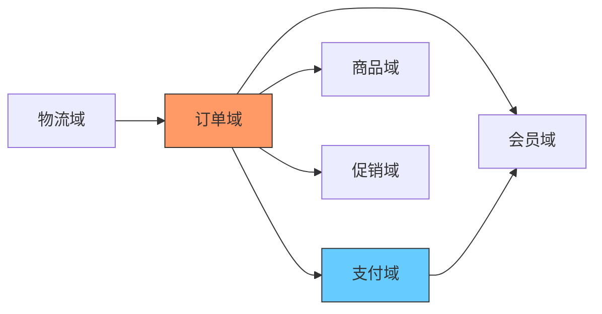
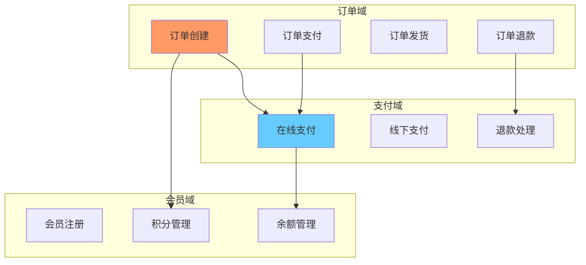
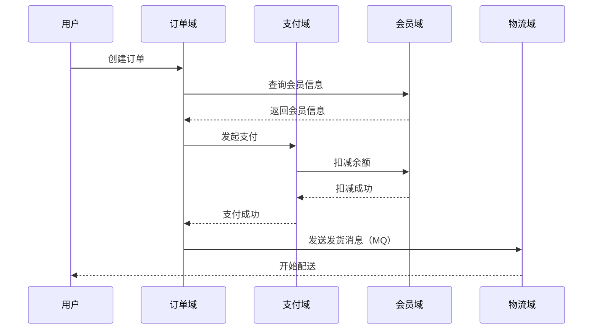
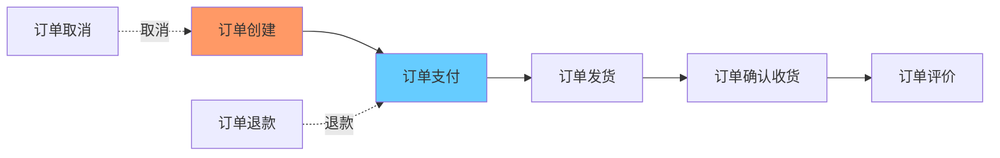

# 大型系统分析输出内容结构（v1.0）

> **版本**: v1.0
> **基于**: 既有系统深度分析方法论-卓越标准.md
> **目的**: 明确每个Phase要输出哪些文件、每个文件包含什么内容

---

## 总体结构（三层树形）

```
系统分析产出/
├── Level 0: 系统总览层（4个文件）
├── Level 1: 业务域层（N个域 × 3个文件）
└── Level 2: 上下文层（M个上下文 × 10个文件）
```

**规模示例**（中型系统）：
- Level 0: 4个文件
- Level 1: 10个域 × 3 = 30个文件
- Level 2: 50个上下文 × 10 = 500个文件
- **总计**: 534个文件

---

## Level 0: 系统总览层（4个文件）

### 文件清单

| 序号 | 文件名 | 内容摘要 | 字数要求 |
|------|--------|---------|---------|
| 00 | 00-执行总结.md | ROI评估、团队、范围、结论 | 1500-2000字 |
| 01 | 01-系统规模.md | 代码量、模块数、表数 | 800-1200字 |
| 02 | 02-业务域划分.md | 业务域清单（骨架来源） | 1000-1500字 |
| 03 | 03-上下文关系图.md | 域间依赖Mermaid图 | 500-800字 |

### 00-执行总结.md

**内容要求**：

```markdown
# 执行总结

## 1. ROI评估

### 1.1 投入成本
- 人力成本: [X]人月 × [Y]万/月 = [Z]万
- 工具成本: [具体工具费用]
- 时间成本: [工期]天

**总投入**: [数字]万元

### 1.2 预期收益
1. 避免重构失败: [计算过程] = [数字]万
2. 提升开发效率: [计算过程] = [数字]万/年
3. 降低故障率: [计算过程] = [数字]万/年
4. [其他收益项]

**总收益（首年）**: [数字]万元

### 1.3 ROI计算
ROI = (收益 - 投入) / 投入 = [数字]%

**结论**: ✅满足/❌不满足 >200%阈值

## 2. 执行范围

### 2.1 系统边界
- 包含: [模块列表]
- 排除: [排除项]
- 关键依赖: [外部系统]

### 2.2 分析深度
- Level 0: ✅完成
- Level 1: ✅完成 [N]个业务域
- Level 2: ✅完成 [M]个上下文 / ⚠️部分完成 / ❌未开始

## 3. 执行团队
- 执行主体: [AI Agent / 人工团队]
- 技术专家: [姓名、角色]
- 业务专家: [姓名、角色]
- 审核人: [姓名]

## 4. 关键发现

### 4.1 核心业务对象（Top 10）
| 对象 | 所属域 | 复杂度 | 风险 |
|------|--------|--------|------|
| Order | 订单 | 高 | P0 |
| ... | ... | ... | ... |

### 4.2 高风险点（Top 5）
1. [风险描述] - 置信度[L4] - 影响[P0]
2. ...

### 4.3 技术债务（Top 5）
1. [债务描述] - 成本[高] - 优先级[P1]
2. ...

## 5. 后续建议
1. [建议1]
2. [建议2]
...

---

**置信度**: L5（基于完整分析）
**生成时间**: YYYY-MM-DD
**审核状态**: ✅已审核 / ⚠️待审核
```

### 01-系统规模.md

**内容要求**：

```markdown
# 系统规模

## 1. 代码规模

### 1.1 总体规模
| 指标 | 数量 | 统计方式 |
|------|------|---------|
| 总代码行数 | [数字] | cloc统计 |
| 业务代码 | [数字] | 排除test/generated |
| 测试代码 | [数字] | test目录 |
| 注释率 | [数字]% | 注释行/总行数 |

**统计命令**:
```bash
cloc src/ --exclude-dir=test,generated --json
```

### 1.2 语言分布
| 语言 | 代码行数 | 占比 |
|------|---------|------|
| Java | [数字] | [数字]% |
| JavaScript | [数字] | [数字]% |
| SQL | [数字] | [数字]% |
| ... | ... | ... |

## 2. 模块规模

### 2.1 构建模块
| 类型 | 数量 | 说明 |
|------|------|------|
| Maven模块 | [数字] | pom.xml统计 |
| npm包 | [数字] | package.json统计 |
| 微服务 | [数字] | 独立部署单元 |

### 2.2 代码模块
| 类型 | 数量 | 统计方式 |
|------|------|---------|
| Java包 | [数字] | 顶层包统计 |
| 类文件 | [数字] | .java文件数 |
| 接口数 | [数字] | @RestController数量 |
| 定时任务 | [数字] | @Scheduled数量 |
| MQ消费者 | [数字] | @RabbitListener等 |

## 3. 数据规模

### 3.1 数据库规模
| 指标 | 数量 | 统计方式 |
|------|------|---------|
| 数据库实例 | [数字] | 配置文件统计 |
| 总表数 | [数字] | information_schema查询 |
| 核心表 | [数字] | 业务表（排除日志/临时） |
| 总字段数 | [数字] | 所有表字段总和 |
| 索引数 | [数字] | 索引统计 |

### 3.2 核心表分布
| 业务域 | 表数 | 字段数 | 说明 |
|--------|------|--------|------|
| 订单域 | [数字] | [数字] | t_order_* |
| 支付域 | [数字] | [数字] | t_payment_* |
| ... | ... | ... | ... |

## 4. 集成规模

### 4.1 外部集成
| 类型 | 数量 | 示例 |
|------|------|------|
| HTTP调用 | [数字] | RestTemplate/Feign |
| MQ消息 | [数字] | RabbitMQ/Kafka |
| 定时任务 | [数字] | @Scheduled |
| 缓存 | [数字] | Redis/Memcached |
| 文件存储 | [数字] | OSS/MinIO |

## 5. 复杂度评估

### 5.1 圈复杂度（Top 10方法）
| 方法 | 文件 | 圈复杂度 | 风险 |
|------|------|---------|------|
| [方法名] | [文件路径] | [数字] | 高/中/低 |
| ... | ... | ... | ... |

**统计工具**: SonarQube / PMD

### 5.2 依赖复杂度
| 指标 | 数量 | 说明 |
|------|------|------|
| Maven依赖 | [数字] | pom.xml统计 |
| npm依赖 | [数字] | package.json统计 |
| 循环依赖 | [数字] | 需要打破的依赖 |

---

**置信度**: L5（直接统计工具输出）
**生成时间**: YYYY-MM-DD
**统计脚本**: [脚本路径]
```

### 02-业务域划分.md

**内容要求（关键：这是Level 1骨架的唯一来源）**：

```markdown
# 业务域划分

## 1. 划分标准

本系统采用以下标准划分业务域：

### 1.1 技术边界
- ✅ Maven模块边界
- ✅ 包名顶层分组（com.example.[domain]）
- ✅ 数据库schema分组（[domain]_db）
- ⚠️ 微服务边界（部分域跨多个服务）

### 1.2 业务边界
- ✅ 业务语义聚合（订单、支付、会员等）
- ✅ 团队组织结构（订单团队、支付团队等）
- ⚠️ 数据归属（部分表归属不明确）

## 2. 业务域清单

**说明**：本清单是Level 1骨架的唯一来源，任何新增/删除/修改都必须更新本表格。

| 域编号 | 域标识 | 中文名 | 英文全称 | 包名前缀 | 表前缀 | 预估上下文数 | 优先级 | 负责人 |
|-------|-------|--------|---------|---------|--------|-------------|--------|--------|
| 01 | order | 订单 | Order Domain | com.example.order | t_order_ | 8 | P0 | 张三 |
| 02 | payment | 支付 | Payment Domain | com.example.payment | t_payment_ | 5 | P0 | 李四 |
| 03 | member | 会员 | Member Domain | com.example.member | t_member_ | 6 | P1 | 王五 |
| 04 | product | 商品 | Product Domain | com.example.product | t_product_ | 7 | P1 | 赵六 |
| 05 | promotion | 促销 | Promotion Domain | com.example.promotion | t_promotion_ | 4 | P2 | 孙七 |
| 06 | logistics | 物流 | Logistics Domain | com.example.logistics | t_logistics_ | 3 | P2 | 周八 |

**总计**: 6个业务域，预估33个上下文

**骨架生成规则**：
- 目录名格式: `业务域{域编号}-{中文名}({域标识})`
- 示例: `业务域01-订单(order)`
- 三份骨架文件: `01-业务域概览.md`, `02-上下文清单.md`, `03-业务域总结.md`

## 3. 域间依赖

### 3.1 依赖关系图



### 3.2 依赖清单

| 依赖方 | 被依赖方 | 依赖类型 | 代码证据 | 置信度 |
|--------|---------|---------|---------|--------|
| 订单域 | 支付域 | 接口调用 | OrderService.createOrder() → PaymentService.pay() | L5 |
| 订单域 | 会员域 | 数据查询 | OrderService查询t_member表 | L5 |
| 订单域 | 商品域 | 数据查询 | OrderService查询t_product表 | L5 |
| 订单域 | 促销域 | 接口调用 | OrderService → PromotionService.calculate() | L4 |
| 支付域 | 会员域 | 余额扣减 | PaymentService扣减会员余额 | L5 |
| 物流域 | 订单域 | 消息订阅 | LogisticsListener订阅OrderCreatedEvent | L5 |

### 3.3 循环依赖检测

❌ **发现循环依赖**: 无

✅ **依赖健康**: 所有依赖单向，无循环

## 4. 域规模对比

| 域 | 包数 | 类数 | 表数 | 接口数 | 代码行数 | 复杂度 |
|----|------|------|------|--------|---------|--------|
| 订单域 | 12 | 156 | 23 | 45 | 45,678 | 高 |
| 支付域 | 8 | 98 | 15 | 28 | 28,456 | 高 |
| 会员域 | 10 | 123 | 18 | 32 | 34,567 | 中 |
| 商品域 | 11 | 145 | 21 | 38 | 38,901 | 中 |
| 促销域 | 6 | 76 | 10 | 18 | 18,234 | 中 |
| 物流域 | 4 | 45 | 7 | 12 | 10,123 | 低 |

## 5. 特殊说明

### 5.1 跨域对象
以下对象被多个域共享，需要特别注意：

| 对象 | 归属域 | 被引用域 | 处理方式 |
|------|--------|---------|---------|
| Member | 会员域 | 订单、支付、促销 | 接口调用，不跨库 |
| Product | 商品域 | 订单、促销 | 数据快照，订单表冗余 |

### 5.2 技术公共组件
以下不算业务域，属于技术基础设施：

- common-utils: 工具类
- common-dto: 通用DTO
- common-exception: 异常定义
- common-mq: MQ基础组件

---

**置信度**: L4（包名+表名+代码import三源验证）
**生成时间**: YYYY-MM-DD
**审核状态**: ✅已审核
```

### 03-上下文关系图.md

**内容要求**：

```markdown
# 上下文关系图

## 1. 全局上下文地图

### 1.1 核心上下文（按域分组）



### 1.2 上下文依赖矩阵

| 上下文 | 依赖的上下文 | 依赖关系 | 置信度 |
|--------|-------------|---------|--------|
| 订单创建 | 会员注册、商品管理、库存管理 | 数据查询 | L5 |
| 订单支付 | 在线支付、余额管理 | 接口调用 | L5 |
| 订单退款 | 退款处理、余额管理 | 接口调用 | L4 |
| ... | ... | ... | ... |

## 2. 关键集成点

### 2.1 同步调用

| 调用方 | 被调用方 | 接口 | 超时设置 | 重试策略 | 置信度 |
|--------|---------|------|---------|---------|--------|
| 订单创建 | 库存扣减 | POST /inventory/deduct | 3s | 3次指数退避 | L5 |
| 订单支付 | 支付网关 | POST /payment/pay | 30s | 1次（支付幂等） | L5 |
| ... | ... | ... | ... | ... | ... |

### 2.2 异步消息

| 发送方 | 接收方 | 消息主题 | 消息格式 | 置信度 |
|--------|--------|---------|---------|--------|
| 订单创建 | 物流域 | order.created | JSON | L5 |
| 支付完成 | 订单域 | payment.completed | JSON | L5 |
| ... | ... | ... | ... | ... |

### 2.3 定时任务

| 任务名 | 触发频率 | 关联上下文 | 置信度 |
|--------|---------|-----------|--------|
| 订单自动取消 | 每分钟 | 订单创建、订单支付 | L5 |
| 退款自动处理 | 每10分钟 | 订单退款、退款处理 | L4 |
| ... | ... | ... | ... |

## 3. 数据流向

### 3.1 核心数据流



---

**置信度**: L4（基于代码调用链和MQ配置）
**生成时间**: YYYY-MM-DD
```

---

## Level 1: 业务域层（N个域 × 3个文件）

### 文件清单（每个域3个文件）

| 序号 | 文件名 | 内容摘要 | 字数要求 |
|------|--------|---------|---------|
| 01 | 01-业务域概览.md | 域职责、核心对象、关键流程 | 1200-1800字 |
| 02 | 02-上下文清单.md | 该域所有上下文（Level 2来源） | 800-1200字 |
| 03 | 03-业务域总结.md | 域级风险、依赖、技术债务 | 1000-1500字 |

### 目录命名规则

```
Level 1-业务域层/
├── 业务域01-订单(order)/
│   ├── 01-业务域概览.md
│   ├── 02-上下文清单.md
│   └── 03-业务域总结.md
├── 业务域02-支付(payment)/
│   └── ...
└── ...
```

**命名格式**: `业务域{编号}-{中文名}({域标识})`
**来源**: Level 0/02-业务域划分.md的表格

### 01-业务域概览.md

**内容要求**：

```markdown
# 业务域概览

> **业务域**: 订单 (order)
> **编号**: 01
> **优先级**: P0
> **负责人**: 张三

## 1. 域职责

### 1.1 核心职责
本域负责：
1. 订单全生命周期管理（创建→支付→发货→完成→售后）
2. 订单状态流转控制
3. 订单数据持久化和查询

### 1.2 边界
**包含**:
- 订单创建、修改、取消
- 订单状态管理
- 订单查询和统计

**不包含**:
- 支付处理（归支付域）
- 物流配送（归物流域）
- 库存扣减（归商品域）

## 2. 核心对象

### 2.1 聚合根
| 对象 | 说明 | 生命周期 | 关键状态 |
|------|------|---------|---------|
| Order | 订单主对象 | 用户下单→订单完成/取消 | 待支付、已支付、已发货、已完成、已取消 |

### 2.2 实体
| 对象 | 说明 | 从属于 | 关键属性 |
|------|------|--------|---------|
| OrderItem | 订单明细 | Order | 商品ID、数量、价格 |
| OrderAddress | 收货地址 | Order | 省市区、详细地址、联系人 |

### 2.3 值对象
| 对象 | 说明 | 使用场景 |
|------|------|---------|
| OrderAmount | 订单金额 | 商品金额、优惠金额、实付金额 |
| OrderSnapshot | 订单快照 | 记录下单时的商品信息 |

## 3. 关键流程

### 3.1 核心流程（Top 3）
1. **订单创建流程**: 验证商品→计算金额→扣减库存→创建订单
2. **订单支付流程**: 调用支付→更新状态→发送MQ消息
3. **订单取消流程**: 校验状态→退款→回滚库存→更新状态

### 3.2 流程复杂度
| 流程 | 步骤数 | 外部依赖数 | 异常场景数 | 复杂度 |
|------|--------|-----------|-----------|--------|
| 订单创建 | 8 | 3（会员、商品、库存） | 5 | 高 |
| 订单支付 | 5 | 2（支付、会员） | 3 | 中 |
| 订单取消 | 6 | 2（支付、库存） | 4 | 中 |

## 4. 技术实现

### 4.1 模块结构
```
order/
├── order-api/        # 对外接口定义
├── order-app/        # Controller、启动类
├── order-service/    # 业务逻辑
└── order-dao/        # 数据持久化
```

### 4.2 核心类
| 类 | 类型 | 说明 | 代码行数 |
|---|------|------|---------|
| OrderController | Controller | 订单接口 | 245 |
| OrderService | Service | 订单业务逻辑 | 1,234 |
| OrderMapper | Mapper | 订单数据访问 | 156 |
| Order | Entity | 订单实体 | 189 |

### 4.3 数据表
| 表名 | 说明 | 字段数 | 索引数 | 行数（预估） |
|------|------|--------|--------|------------|
| t_order | 订单主表 | 32 | 8 | 500万 |
| t_order_item | 订单明细表 | 18 | 5 | 1500万 |
| t_order_log | 订单日志表 | 12 | 3 | 2000万 |

## 5. 对外接口

### 5.1 REST接口
| 接口 | 方法 | 说明 | QPS（预估） |
|------|------|------|-----------|
| /order/create | POST | 创建订单 | 500 |
| /order/pay | POST | 订单支付 | 300 |
| /order/cancel | POST | 取消订单 | 100 |
| /order/query | GET | 查询订单 | 2000 |

### 5.2 MQ消息
| 主题 | 类型 | 说明 | 消费方 |
|------|------|------|--------|
| order.created | 发送 | 订单已创建 | 物流域、数据域 |
| payment.completed | 接收 | 支付完成 | 支付域 |

## 6. 外部依赖

### 6.1 依赖的域
| 被依赖域 | 依赖方式 | 说明 | 风险 |
|---------|---------|------|------|
| 支付域 | Feign接口 | 调用支付 | 高（支付超时会阻塞） |
| 会员域 | 数据库查询 | 查会员信息 | 低（只读查询） |
| 商品域 | Feign接口 | 查商品、扣库存 | 中（库存不足会拒单） |

### 6.2 依赖的外部系统
| 系统 | 用途 | 超时设置 | 降级策略 |
|------|------|---------|---------|
| Redis | 订单缓存 | 1s | 降级到数据库 |
| RabbitMQ | 消息发送 | 3s | 失败重试3次 |

---

**置信度**: L4（代码+表结构验证）
**生成时间**: YYYY-MM-DD
**预估上下文数**: 8个（见02-上下文清单.md）
```

### 02-上下文清单.md

**内容要求（关键：这是Level 2骨架的唯一来源）**：

```markdown
# 上下文清单

> **业务域**: 订单 (order)
> **说明**: 本清单是Level 2骨架的唯一来源，任何新增/删除/修改都必须更新本表格

## 1. 上下文划分标准

本域采用以下标准划分上下文：
- ✅ 业务用例边界（一个用例=一个上下文）
- ✅ 事务边界（一个事务=一个上下文）
- ⚠️ 服务边界（部分Service跨多个上下文）

## 2. 上下文清单

| 上下文编号 | 上下文标识 | 中文名 | 核心对象 | 核心流程 | 关键接口 | 复杂度 | 优先级 |
|-----------|-----------|--------|---------|---------|---------|--------|--------|
| 01 | order-create | 订单创建 | Order, OrderItem | 创建订单 | POST /order/create | 高 | P0 |
| 02 | order-pay | 订单支付 | Order | 订单支付 | POST /order/pay | 中 | P0 |
| 03 | order-cancel | 订单取消 | Order | 取消订单 | POST /order/cancel | 中 | P0 |
| 04 | order-query | 订单查询 | Order | 查询订单 | GET /order/query | 低 | P1 |
| 05 | order-refund | 订单退款 | Order, Refund | 退款处理 | POST /order/refund | 高 | P0 |
| 06 | order-ship | 订单发货 | Order | 订单发货 | POST /order/ship | 低 | P1 |
| 07 | order-confirm | 订单确认收货 | Order | 确认收货 | POST /order/confirm | 低 | P2 |
| 08 | order-evaluate | 订单评价 | Order, Evaluation | 订单评价 | POST /order/evaluate | 低 | P2 |

**总计**: 8个上下文

**骨架生成规则**:
- 目录名格式: `上下文{所属域}-{中文名}`
- 示例: `上下文order-订单创建`
- 10份骨架文件: 01-上下文概览.md ~ 10-扩展性评估.md

## 3. 上下文关系

### 3.1 调用关系



### 3.2 依赖矩阵

| 上下文 | 依赖的上下文（本域内） | 依赖的上下文（跨域） |
|--------|---------------------|-------------------|
| 订单创建 | - | payment-支付, product-商品, member-会员 |
| 订单支付 | 订单创建 | payment-在线支付 |
| 订单取消 | 订单创建 | payment-退款, product-库存回滚 |
| 订单退款 | 订单支付 | payment-退款处理 |
| 订单发货 | 订单支付 | logistics-物流 |
| 订单确认收货 | 订单发货 | - |
| 订单评价 | 订单确认收货 | - |

## 4. 特殊说明

### 4.1 跨上下文事务
以下场景涉及跨上下文事务，需要特别注意：

| 场景 | 涉及上下文 | 事务处理方式 | 风险 |
|------|-----------|-------------|------|
| 下单扣库存 | 订单创建 + 商品域库存扣减 | 分布式事务（Seata） | 高 |
| 支付回滚 | 订单支付 + 支付域退款 | 补偿事务（手动回滚） | 中 |

### 4.2 上下文复杂度说明

**高复杂度（3个）**:
- 订单创建: 8个步骤，3个外部依赖，5个异常场景
- 订单退款: 补偿流程复杂，涉及多个域

**中复杂度（3个）**:
- 订单支付: 调用支付域，状态流转
- 订单取消: 需要回滚库存

**低复杂度（2个）**:
- 订单查询: 纯查询
- 订单评价: 独立功能

---

**置信度**: L4（代码+接口文档验证）
**生成时间**: YYYY-MM-DD
**审核状态**: ✅已审核
```

### 03-业务域总结.md

**内容要求**：

```markdown
# 业务域总结

> **业务域**: 订单 (order)

## 1. 域级风险

### 1.1 技术风险（Top 5）

| 风险项 | 严重程度 | 可能性 | 影响面 | 缓解措施 | 置信度 |
|--------|---------|--------|--------|---------|--------|
| 支付调用超时导致订单阻塞 | 高 | 中 | P0核心流程 | 增加超时控制+异步化 | L5 |
| 库存扣减失败但订单已创建 | 高 | 低 | P0核心流程 | 分布式事务Seata | L4 |
| 订单表数据量过大查询慢 | 中 | 高 | P1查询场景 | 分库分表 | L5 |
| Redis故障订单缓存失效 | 中 | 低 | P1性能 | 降级到数据库 | L4 |
| MQ消息丢失导致物流未通知 | 中 | 低 | P1业务连贯性 | 消息持久化+重试 | L5 |

### 1.2 业务风险（Top 3）

| 风险项 | 严重程度 | 影响 | 缓解措施 | 置信度 |
|--------|---------|------|---------|--------|
| 恶意下单占用库存 | 高 | 正常用户买不到 | 风控系统+未支付自动取消 | L3 |
| 刷单导致促销规则被滥用 | 中 | 营销成本增加 | 风控+人工审核 | L3 |
| 大促期间订单积压 | 中 | 用户体验差 | 限流+排队 | L4 |

## 2. 技术债务

### 2.1 架构债务

| 债务项 | 严重程度 | 成本（人天） | 优先级 | 说明 |
|--------|---------|------------|--------|------|
| 订单Service过于臃肿 | 高 | 20 | P1 | OrderService 1200+行，需拆分 |
| 订单状态机未显式建模 | 中 | 10 | P2 | 状态流转逻辑散落各处 |
| 缺少订单领域事件 | 中 | 15 | P2 | 当前用MQ替代，耦合度高 |

### 2.2 代码债务

| 债务项 | 严重程度 | 成本（人天） | 优先级 | 代码位置 |
|--------|---------|------------|--------|---------|
| 订单创建方法圈复杂度28 | 高 | 5 | P1 | OrderService.createOrder() |
| 大量if-else判断订单类型 | 中 | 8 | P2 | OrderService多个方法 |
| 异常处理不规范 | 中 | 3 | P2 | 全域 |

### 2.3 数据债务

| 债务项 | 严重程度 | 成本（人天） | 优先级 | 说明 |
|--------|---------|------------|--------|------|
| t_order表数据量500万，无分表 | 高 | 30 | P0 | 查询慢，需分库分表 |
| 订单状态字段用数字，无枚举 | 中 | 5 | P2 | 可读性差 |
| 缺少订单归档机制 | 中 | 10 | P2 | 历史订单占用空间 |

## 3. 依赖分析

### 3.1 对外依赖

| 被依赖方 | 依赖强度 | 风险 | 降级策略 | 置信度 |
|---------|---------|------|---------|--------|
| 支付域 | 强（同步调用） | 高 | 异步化改造 | L5 |
| 商品域 | 强（同步调用） | 中 | 库存预扣+异步确认 | L4 |
| 会员域 | 弱（数据查询） | 低 | 缓存会员信息 | L5 |
| 促销域 | 中（同步调用） | 中 | 降级不参与促销 | L4 |

### 3.2 被依赖情况

| 依赖方 | 依赖内容 | 影响 | 置信度 |
|--------|---------|------|--------|
| 物流域 | 订单信息查询 | 中（物流需要订单号） | L5 |
| 数据域 | 订单数据统计 | 低（离线计算） | L5 |
| CRM域 | 订单历史查询 | 低（客服查询） | L4 |

## 4. 性能分析

### 4.1 性能指标

| 接口 | 当前QPS | 目标QPS | 当前P99延迟 | 目标P99延迟 | 差距 |
|------|---------|---------|------------|------------|------|
| 创建订单 | 200 | 500 | 500ms | 200ms | ❌ 需优化 |
| 订单支付 | 150 | 300 | 300ms | 150ms | ❌ 需优化 |
| 查询订单 | 1500 | 2000 | 50ms | 30ms | ✅ 接近 |
| 取消订单 | 50 | 100 | 200ms | 100ms | ✅ 接近 |

### 4.2 性能瓶颈

| 瓶颈点 | 原因 | 优化方案 | 预期提升 | 成本 |
|--------|------|---------|---------|------|
| 订单创建慢 | 同步调用支付、商品、会员 | 异步化+缓存 | 60% | 15人天 |
| 订单查询慢 | 大表扫描 | 分库分表+ES | 80% | 30人天 |
| 支付回调慢 | 单线程处理 | 多线程+队列 | 50% | 5人天 |

## 5. 扩展性评估

### 5.1 可扩展性

| 维度 | 评分（1-5） | 说明 | 改进建议 |
|------|-----------|------|---------|
| 水平扩展 | 3 | 可加机器，但有单点（数据库） | 分库分表 |
| 功能扩展 | 2 | Service耦合度高 | 领域模型重构 |
| 集成扩展 | 4 | Feign接口清晰 | 继续保持 |
| 数据扩展 | 2 | 大表无分表策略 | 分库分表 |

### 5.2 未来演进方向

1. **短期（3个月）**:
   - 订单Service拆分
   - 增加订单缓存层
   - 优化订单查询索引

2. **中期（6个月）**:
   - 订单分库分表
   - 异步化支付调用
   - 引入订单领域事件

3. **长期（12个月）**:
   - 订单域微服务化
   - 引入CQRS（读写分离）
   - 订单状态机显式建模

---

**置信度**: L4（基于代码+运行数据）
**生成时间**: YYYY-MM-DD
**审核人**: [姓名]
**审核状态**: ✅已审核
```

---

## Level 2: 上下文层（M个上下文 × 10个文件）

### 文件清单（每个上下文10个文件）

| 序号 | 文件名 | 内容摘要 | 字数要求 | 置信度要求 |
|------|--------|---------|---------|-----------|
| 01 | 01-上下文概览.md | 七要素+业务概述 | 1500-2000字 | L4-L5 |
| 02 | 02-对象建模.md | 对象树（到叶子节点） | 2000-3000字 | L4-L5 |
| 03 | 03-流程分析.md | 主流程+异常流+补偿流 | 2500-3500字 | L4-L5 |
| 04 | 04-状态机.md | 状态+转换+触发条件 | 1500-2000字 | L4-L5 |
| 05 | 05-规则分析.md | Scope+ValidTime+Priority | 2000-2500字 | L4-L5 |
| 06 | 06-规则冲突.md | 冲突检测+解决策略 | 1000-1500字 | L3-L4 |
| 07 | 07-混沌测试.md | 故障场景+韧性测试 | 1500-2000字 | L3-L4 |
| 08 | 08-集成分析.md | 外部依赖+超时+重试 | 1500-2000字 | L4-L5 |
| 09 | 09-置信度评估.md | L1-L5统计+证据链 | 800-1200字 | L5 |
| 10 | 10-扩展性评估.md | 未来演进+扩展点 | 1000-1500字 | L3-L4 |

### 目录命名规则

```
Level 2-上下文层/
├── 上下文order-订单创建/
│   ├── 01-上下文概览.md
│   ├── 02-对象建模.md
│   ├── ...
│   └── 10-扩展性评估.md
├── 上下文payment-在线支付/
│   └── ...
└── ...
```

**命名格式**: `上下文{所属域标识}-{中文名}`
**来源**: Level 1各域的`02-上下文清单.md`表格

---

## 总结：输出文件完整清单

**假设中型系统**（6个域，平均每域6个上下文，共36个上下文）：

| Level | 文件数 | 总字数 | Token预估 |
|-------|--------|--------|-----------|
| Level 0 | 4 | 5,000字 | 7K |
| Level 1 | 6域 × 3 = 18 | 24,000字 | 36K |
| Level 2 | 36上下文 × 10 = 360 | 648,000字 | 972K |
| **总计** | **382个文件** | **677,000字** | **1,015K tokens** |

**批次执行必要性**：
- ❌ 全量一次生成：1,015K tokens 远超200K上下文
- ✅ 批次执行：
  - Level 0: 7K tokens ✅
  - Level 1单域: 6K tokens × 6批次 ✅
  - Level 2单上下文: 28K tokens × 36批次 ✅

---

**文档版本**: v1.0
**生成时间**: 2026-09-05
**下一步**: 基于本结构编写SOP执行步骤
