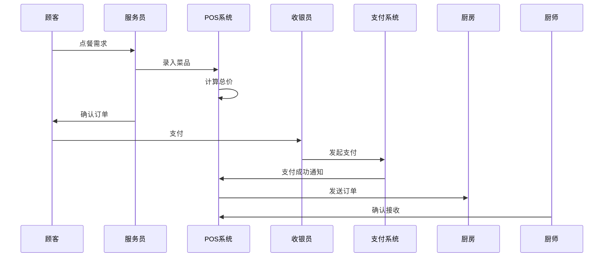

# 七要素提取实战案例：POS点餐系统

## 原始需求描述

"顾客在餐厅通过服务员点餐，服务员在POS机上录入菜品，系统计算总价，顾客可使用会员卡支付，支付成功后订单送到厨房。"

## 错误提取示例（反面教材）

### ❌ 常见错误1：要素混杂

```markdown
主体：顾客、服务员、POS机（错：POS机是工具不是主体）
目标：点餐、录入菜品（错：录入是操作不是目的）
规则：使用会员卡（错：这是方式不是规则）
```

### ❌ 常见错误2：缺失业务本质

```markdown
主体：用户（错：太抽象，没有角色区分）
目标：操作系统（错：这是技术视角）
规则：数据库有外键约束（错：这是技术实现）
```

## 正确提取示例

### ✓ 主体（Who）- 谁使用系统

| 角色 | 业务职责 | 代码证据 |
|------|---------|---------|
| 顾客 | 消费者，选择菜品 | Customer实体 |
| 服务员 | 操作员，录入订单 | Waiter实体，Controller层 |
| 收银员 | 结算员，处理支付 | Cashier实体 |
| 厨师 | 生产者，接收订单 | KDS模块 |
| 店长 | 管理者，查看报表 | Manager角色 |

**互斥边界**：
- POS机、打印机、数据库不是主体（是技术资源）
- "点餐"不是主体（是目标）

### ✓ 目标（What）- 想达成什么

| 目标ID | 主体 | 目标描述 | 代码证据 |
|--------|------|---------|---------|
| G001 | 顾客 | 用餐并结账 | OrderController.create() |
| G002 | 服务员 | 完成点餐流程 | OrderService.addItem() |
| G003 | 收银员 | 完成收款 | PaymentService.pay() |
| G004 | 厨师 | 按时出餐 | KDSService.receiveOrder() |
| G005 | 店长 | 了解营业情况 | ReportService.dailySales() |

**互斥边界**：
- "录入菜品"不是目标（是实现目标的手段，属于协作）
- "计算总价"不是目标（是规则执行的结果）

### ✓ 规则（Rules）- 必须遵守什么

| 规则ID | 规则描述 | 触发条件 | 代码位置 | 置信度 |
|--------|---------|---------|---------|--------|
| R001 | 订单总价 = Σ(菜品单价 × 数量) | 添加菜品时 | OrderService:120 | 高 |
| R002 | 会员卡余额≥订单总价才能支付 | 选择会员卡支付 | PaymentService:85 | 高 |
| R003 | 订单必须有至少1个菜品 | 提交订单时 | OrderValidator:45 | 高 |
| R004 | 同一桌台不能同时有多个未结账订单 | 创建订单时 | TableService:200 | 中 |
| R005 | 退菜必须填写原因 | 退菜操作 | RefundService:150 | 高 |

**互斥边界**：
- "使用会员卡"不是规则（是支付方式，属于资源）
- "数据库外键约束"不是业务规则（是技术约束）

### ✓ 协作（Collaboration）- 如何配合

#### 4.1 直接协作

| 协作ID | 发起方 | 接收方 | 协作内容 | 协作方式 |
|--------|-------|-------|---------|---------|
| C001 | 顾客 | 服务员 | 口述点餐需求 | 同步 |
| C002 | 服务员 | 系统 | 录入订单 | 同步 |
| C003 | 系统 | 厨房 | 发送订单 | 异步（打印/KDS）|
| C004 | 收银员 | 支付系统 | 发起支付 | 同步 |
| C005 | 厨师 | 系统 | 确认出餐 | 同步 |

#### 4.2 时序图



**互斥边界**：
- "录入订单"本身不是协作（是协作中的动作）
- 协作不包含"谁主导"（主导者属于主体）

### ✓ 时序（Timing）- 何时/多久

| 时序ID | 时序描述 | 时间约束 | 代码证据 |
|--------|---------|---------|---------|
| T001 | 营业时间段 | 每日10:00-22:00 | ConfigService |
| T002 | 早中晚班次 | 早班8-14点，中班14-20点，晚班20-2点 | ShiftService |
| T003 | 订单超时取消 | 未支付订单30分钟后自动取消 | OrderScheduler |
| T004 | 会员积分有效期 | 积分1年内有效 | MemberService |
| T005 | 日结时间点 | 每日凌晨2点执行日结 | DailySettleJob |

**互斥边界**：
- "点餐流程的先后"不属于时序（属于协作）
- "规则何时生效"不属于时序（属于规则的一部分）

### ✓ 资源（Resource）- 被操作的对象

#### 6.1 消耗型资源

| 资源 | 生命周期 | 状态 | 代码证据 |
|------|---------|------|---------|
| 库存 | 进货创建 → 消耗减少 → 耗尽 | 充足/不足/缺货 | InventoryService |
| 原材料 | 采购入库 → 制作消耗 → 报废 | 新鲜/临期/过期 | MaterialService |

#### 6.2 转移型资源

| 资源 | 转移路径 | 代码证据 |
|------|---------|---------|
| 桌台 | 空闲 → 占用 → 清理 → 空闲 | TableService |
| 打印机 | 待机 → 打印中 → 完成 → 待机 | PrintService |
| 会员余额 | 充值增加 → 支付减少 | MemberBalanceService |

**互斥边界**：
- "菜品"既可以是资源（库存视角）也可以是信息（订单视角），必须明确上下文
- "资源的归属"不属于资源要素（属于主体）

### ✓ 信息（Information）- 传递的数据

#### 7.1 数据实体

| 实体 | 主键 | 核心字段 | 代码证据 |
|------|------|---------|---------|
| 订单 | billNo | 桌台号、总价、状态、创建时间 | OrderEntity |
| 订单明细 | detailId | 菜品、数量、单价、小计 | OrderDetailEntity |
| 支付记录 | payId | 支付方式、金额、状态 | PaymentEntity |
| 会员信息 | memberId | 姓名、手机号、余额、积分 | MemberEntity |

#### 7.2 信息流

| 信息 | 来源 | 去向 | 传递方式 |
|------|------|------|---------|
| 订单数据 | POS系统 | 厨房显示系统 | MQ异步 |
| 支付结果 | 支付平台 | POS系统 | 回调 |
| 会员余额 | 会员系统 | POS系统 | API同步 |
| 日报数据 | POS系统 | 报表系统 | 定时任务 |

**互斥边界**：
- "信息的存储位置"不属于信息要素（属于技术实现）
- "信息的生产者"不属于信息要素（属于主体）

## 提取后的自检清单

### 完整性检查

- [ ] 每个主体都有对应的目标
- [ ] 每个目标都有支撑的规则
- [ ] 每个规则都有协作体现
- [ ] 每个协作都有时序约束
- [ ] 每个时序都涉及资源或信息

### 互斥性检查

- [ ] 同一事实没有出现在多个要素中
- [ ] 技术实现（Handler、数据库约束）没有混入业务要素
- [ ] 操作手段（录入、计算）没有混入目标

### 证据性检查

- [ ] 每条提取都有代码位置或访谈记录
- [ ] 高置信度条目占比 ≥ 60%
- [ ] 低置信度条目都有待确认计划

## 常见陷阱及避坑指南

### 陷阱1：用技术视角替代业务视角

```text
❌ 错误："主体是UserController"
✓ 正确："主体是收银员，UserController是技术入口"

避坑方法：问自己"如果没有系统，这个角色还存在吗？"
```

### 陷阱2：把过程当结果

```text
❌ 错误："目标是录入订单"
✓ 正确："目标是完成点餐流程，录入是手段"

避坑方法：问自己"为什么要做这件事？"追到业务目的为止
```

### 陷阱3：规则与约束混淆

```text
❌ 错误："规则是数据库有NOT NULL约束"
✓ 正确："规则是订单必须有顾客信息，NOT NULL是技术保障"

避坑方法：问自己"这条规则是业务人员说的，还是程序员加的？"
```

## 提取质量评分

```text
质量分 = (要素完整度×0.3 + 互斥性×0.3 + 证据强度×0.2 + 可验证性×0.2) × 100

通过标准：≥ 75分
```

## 下一步

七要素提取完成后，进入：
- **业务对象建模**（静态）：从资源和信息中提取实体
- **业务逻辑分析**（动态）：从协作和时序中提取流程
- **业务规则清单**：从规则中提取规则依赖图
