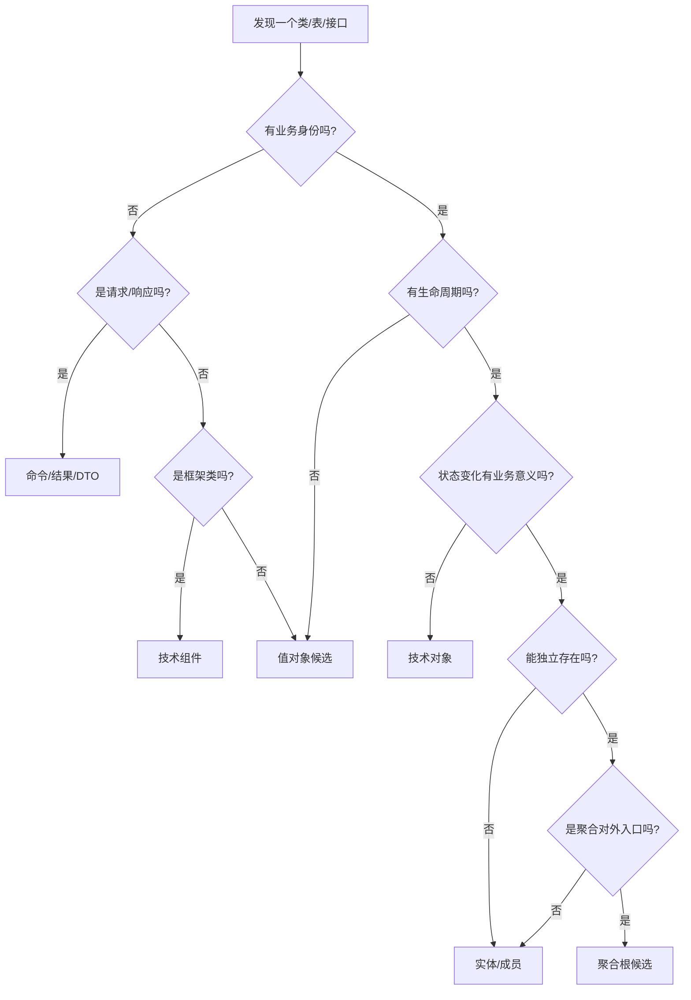
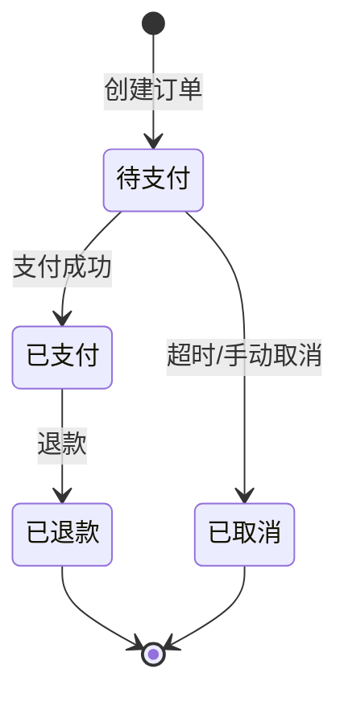

# 深度展开2：对象分类契约的执行细则

## 为什么对象分类是最大的坑

### 典型错误现场

```text
场景1：把DTO当实体
❌ "OrderDTO是订单实体"
分析：DTO是数据传输对象，没有业务行为，不能算实体

场景2：把Service方法当实体方法
❌ "OrderService.calculate()说明Order有计算方法"
分析：Service是应用编排，不能直接证明实体有该业务行为

场景3：由类名直接推断聚合根
❌ "OrderAggregate类名有Aggregate，所以是聚合根"
分析：类名只是程序员的意图，必须验证是否符合聚合根5个判定条件
```

## 对象分类决策树



## 实战判定：Order对象

### 步骤1：收集所有"Order"相关对象

```java
// 发现的对象清单
OrderDTO              // 数据传输
OrderVO               // 视图对象
OrderEntity           // 实体类
OrderDO               // 数据对象
OrderAggregate        // 聚合类
OrderService          // 服务类
OrderController       // 控制器
OrderMapper           // 持久化
OrderRequest          // 请求
OrderResponse         // 响应
OrderCreatedEvent     // 事件
```

### 步骤2：逐个分类（严格证据）

#### OrderDTO - 命令/请求

```text
判定过程：
1. 有业务身份吗？ → 否（只是数据容器）
2. 是请求/响应吗？ → 是（从前端传来）
3. 结论：命令/请求

分类：命令
用途：前端→后端的数据传输
是否业务实体：否
```

#### OrderVO - 结果/视图

```text
判定过程：
1. 有业务身份吗？ → 否
2. 是请求/响应吗？ → 是（返回给前端）
3. 结论：结果/视图

分类：结果
用途：后端→前端的数据展示
是否业务实体：否
```

#### OrderEntity - 实体候选

```text
判定过程：
1. 有业务身份吗？ → 是（billNo）
2. 有生命周期吗？ → 是（创建→支付→完成）
3. 状态变化有业务意义吗？ → 是（待支付→已支付）
4. 能独立存在吗？ → 是（不依赖其他聚合）
5. 是聚合对外入口吗？ → 需验证

必须回答的5个问题：
Q1: 业务身份是什么？
A1: billNo（订单号），与主键id不同

Q2: 生命周期谁控制？
A2: OrderService控制创建，PaymentService触发状态变更

Q3: 哪些业务动作会读写它？
A3: 
- 读：查询订单、打印小票
- 写：创建订单、添加菜品、支付、退款

Q4: 哪些状态变化有证据？
A4: 
- 待支付 → 已支付（PaymentService:85行）
- 已支付 → 已退款（RefundService:120行）
- 待支付 → 已取消（OrderService:200行）

Q5: 与其他概念的关系？
A5:
- has-many OrderDetail（一对多）
- has-one Payment（一对一）
- references Table（引用）
- references Member（引用）

初步结论：实体（待判定是否为聚合根）
```

#### OrderEntity - 聚合根判定

```text
聚合根5大判定条件（必须全部满足）：

条件1：是否为聚合对外的唯一身份入口？
验证：
- 外部通过billNo引用Order ✓
- 外部不直接引用OrderDetail ✓
- OrderDetail只能通过Order访问 ✓
结论：是 ✓

条件2：是否控制聚合内对象的生命周期？
验证：
- Order创建时创建OrderDetail ✓
- Order删除时删除OrderDetail ✓
- OrderDetail不能独立存在 ✓
代码证据：OrderService.create()方法
结论：是 ✓

条件3：是否维护聚合不变式？
验证：
- 订单总价 = Σ明细小计（代码：Order.calculateTotal()）✓
- 退款金额≤已支付金额（代码：Order.validateRefund()）✓
- 订单明细≥1（代码：Order.validate()）✓
结论：是 ✓

条件4：聚合内修改是否在一个事务内？
验证：
- Order和OrderDetail在同一个@Transactional中 ✓
- 跨聚合操作使用领域事件异步 ✓
代码证据：OrderService上的@Transactional注解
结论：是 ✓

条件5：是否发布领域事件？
验证：
- OrderCreatedEvent（订单创建）✓
- OrderPaidEvent（订单支付）✓
- OrderCancelledEvent（订单取消）✓
代码证据：Order.publishEvent()方法
结论：是 ✓

最终结论：Order是聚合根 ✓
置信度：高（5个条件全部有代码证据）
```

#### OrderService - 应用服务

```text
判定过程：
1. 有业务身份吗？ → 否（服务无身份）
2. 结论：服务

分类：应用服务
职责：编排用例，协调多个聚合
是否业务实体：否

关键区分：
- OrderService.calculate() 不能证明 Order有calculate()方法
- Service方法默认是应用编排
- 只有当方法体内调用了Order.calculate()，才能证明Order有该方法
```

#### OrderMapper - 技术组件

```text
判定过程：
1. 有业务身份吗？ → 否
2. 是框架类吗？ → 是（MyBatis Mapper）
3. 结论：技术组件

分类：技术组件
用途：持久化
是否业务实体：否
```

#### OrderCreatedEvent - 领域事件

```text
判定过程：
1. 表达已发生的事实吗？ → 是
2. 有业务意义吗？ → 是（订单已创建）
3. 结论：领域事件

分类：领域事件
触发者：Order聚合根
订阅者：KDS系统、报表系统
是否业务实体：否（事件是不可变的消息）
```

### 步骤3：输出对象分类表

| 对象名 | 分类 | 是否业务实体 | 证据 | 置信度 |
|--------|------|-------------|------|--------|
| OrderDTO | 命令 | 否 | Controller参数 | 高 |
| OrderVO | 结果 | 否 | Controller返回值 | 高 |
| OrderEntity | 聚合根 | 是 | 5条判定全满足 | 高 |
| OrderDetail | 实体成员 | 是 | 归属于Order | 高 |
| OrderService | 应用服务 | 否 | @Service注解 | 高 |
| OrderMapper | 技术组件 | 否 | MyBatis框架 | 高 |
| OrderCreatedEvent | 领域事件 | 否 | 事件发布代码 | 高 |

## 常见陷阱及避坑指南

### 陷阱1：类名欺诈

```java
// 代码示例
@Entity
public class OrderAggregate {
    // 但实际上：
    // - 没有控制OrderDetail的生命周期
    // - 没有维护不变式
    // - OrderDetail可以被外部直接修改
}
```

**避坑方法**：类名只是意图，必须验证5个判定条件

### 陷阱2：Service方法伪装

```java
// 错误推断
public class OrderService {
    public void calculate(Order order) {
        // 计算逻辑在Service里
        order.setTotal(sum);
    }
}

// 错误结论：Order有calculate()方法
// 正确结论：这是应用服务的计算，不是实体方法
```

**避坑方法**：只有Order.calculate()内部实现，才算实体方法

### 陷阱3：一对多关系 = 聚合

```text
❌ 错误："Order和OrderDetail是一对多，所以是聚合"
✓ 正确：一对多只是关系，还需验证生命周期和不变式

必须验证：
1. 子对象能否独立存在？
2. 父对象删除时子对象是否删除？
3. 是否有聚合级不变式需要维护？
```

### 陷阱4：没有事件 = 不是聚合根

```text
❌ 错误："Order没有发布事件，所以不是聚合根"
✓ 正确：事件是加分项，不是必须项

聚合根的核心是：
1. 对外唯一入口（必须）
2. 控制生命周期（必须）
3. 维护不变式（必须）
4. 事务边界（必须）
5. 发布事件（可选，但现代DDD强烈建议）
```

## 实体识别卡模板

```markdown
# 实体识别卡：Order

## 基本信息
- 实体名称：Order（订单）
- 业务身份：billNo（订单号）
- 技术标识：id（主键）
- 聚合角色：聚合根

## 生命周期
- 创建：用户点餐时，由OrderService.create()创建
- 使用：添加菜品、支付、退款、查询
- 结束：日结后归档，或180天后逻辑删除
- 控制者：OrderService（应用层）

## 读写动作
### 读操作
- 查询订单详情：OrderService.getById()
- 打印小票：PrintService.print(Order)
- 日报统计：ReportService.dailySales()

### 写操作
- 创建订单：OrderService.create()
- 添加菜品：OrderService.addItem()
- 支付订单：PaymentService.pay() → Order状态变更
- 退款：RefundService.refund() → Order状态变更
- 取消订单：OrderService.cancel()

## 状态机


## 不变式/约束
| 不变式 | 表达式 | 维护者 |
|--------|--------|--------|
| 总价正确 | total = Σ(item.price × item.qty) | Order.calculateTotal() |
| 明细非空 | items.size() ≥ 1 | Order.validate() |
| 退款不超额 | refundAmount ≤ paidAmount | Order.validateRefund() |
| 桌台唯一性 | 同一桌台只有一个未结账订单 | OrderService.create() |

## 关系
| 关系类型 | 目标对象 | 数量 | 一致性/时序 | 证据 |
|---------|---------|------|-------------|------|
| 归属 | OrderDetail | 1:N | 同事务强一致 | Order创建时创建Detail |
| 关联 | Payment | 1:1 | 最终一致 | 支付成功后更新Order |
| 引用 | Table | N:1 | 弱引用 | Order.tableId |
| 引用 | Member | N:1 | 弱引用 | Order.memberId |

## 证据与确定性
- 业务身份：代码（OrderEntity.billNo）+ 访谈（业务说"订单号"）→ L5
- 生命周期：代码追踪 → L5
- 状态转换：代码（3条转换路径）→ L5
- 不变式：代码（Order.calculateTotal()）→ L5
- 聚合根判定：5个条件全部有代码证据 → L5

## 待确认项
1. 是否支持订单拆单？（当前代码未发现，待业务确认）
2. 订单取消后是否可恢复？（当前代码未实现，待产品确认）
3. 跨天订单如何处理？（边界情况，待业务确认）
```

## 分类完成后的验收标准

### 必须回答的问题

- [ ] 所有候选对象都已分类（实体/值对象/命令/结果/事件/服务/技术组件）
- [ ] 技术对象与业务实体已分离
- [ ] 每个实体都有实体识别卡
- [ ] 聚合根候选都已逐一判定（5个条件）
- [ ] 关系类型已明确（归属/引用/生命周期/流程/技术）
- [ ] 每个结论都有证据位置

### 质量评分

```text
分类质量 = (对象覆盖率×0.3 + 分类准确率×0.3 + 证据完整率×0.2 + 聚合判定率×0.2) × 100

通过标准：≥ 80分

对象覆盖率 = 已分类对象数 / 扫描范围内候选对象总数
分类准确率 = 正确分类数 / 已分类对象数
证据完整率 = 有证据的结论数 / 总结论数
聚合判定率 = 已判定的聚合根候选数 / 聚合根候选总数
```

## 下一步

对象分类完成后，进入：
- **关系建模**：区分实体关系、调用链、信息流和状态转换
- **聚合划分**：确定聚合边界和事务边界
- **领域事件设计**：识别状态变化触发的领域事件
