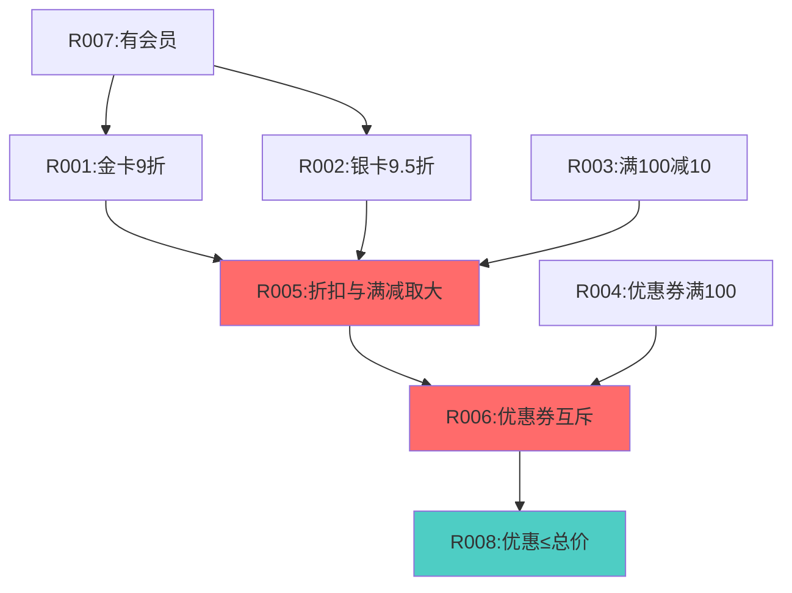
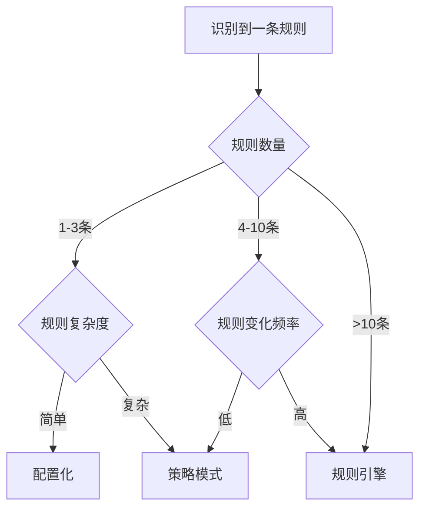

# 深度展开3：业务规则到规则引擎的映射

## 为什么规则分析最容易翻车

### 常见失败模式

```text
模式1：只记录显性规则，忽略隐性规则
结果：重构后发现漏了一堆"潜规则"，业务方说"这是常识啊"

模式2：把技术约束当业务规则
结果：设计时过度设计，为了"规则"引入不必要的复杂度

模式3：规则没有依赖图，无法判断执行顺序
结果：规则引擎里规则乱序，结果错误

模式4：规则与代码无法双向追溯
结果：代码改了，规则文档没更新；或规则改了，不知道改哪段代码
```

## 规则提取的三层模型

```text
L1: 代码规则（最底层）
    ├─ 显性规则：代码中明确的if/else、switch
    └─ 隐性规则：代码中暗含的判断逻辑

L2: 业务规则（中间层）
    ├─ 业务不变式：必须始终为真
    ├─ 决策规则：多分支判断
    ├─ 校验规则：准入条件
    └─ 计算规则：数值计算

L3: 规则模式（最高层）
    ├─ 规则组：多条规则的组合
    ├─ 规则链：规则的依赖序列
    └─ 规则冲突：互斥规则集
```

## 实战案例：优惠计算规则

### 原始代码

```java
public class DiscountService {
    
    public BigDecimal calculate(Order order, Member member) {
        BigDecimal total = order.getTotal();
        BigDecimal discount = BigDecimal.ZERO;
        
        // 规则1：会员折扣
        if (member != null) {
            if (member.getLevel() == MemberLevel.GOLD) {
                discount = total.multiply(new BigDecimal("0.1")); // 9折
            } else if (member.getLevel() == MemberLevel.SILVER) {
                discount = total.multiply(new BigDecimal("0.05")); // 9.5折
            }
        }
        
        // 规则2：满减
        if (total.compareTo(new BigDecimal("100")) >= 0) {
            BigDecimal manjian = new BigDecimal("10");
            // 隐性规则：满减和会员折扣取大
            if (manjian.compareTo(discount) > 0) {
                discount = manjian;
            }
        }
        
        // 规则3：优惠券（如果有）
        if (order.getCoupon() != null) {
            Coupon coupon = order.getCoupon();
            // 隐性规则：优惠券需要满100才能用
            if (total.compareTo(new BigDecimal("100")) >= 0) {
                // 隐性规则：优惠券和其他优惠互斥
                discount = coupon.getAmount();
            }
        }
        
        return discount;
    }
}
```

### 步骤1：提取显性规则

| 规则ID | 规则描述 | 代码位置 | 触发条件 | 规则类型 |
|--------|---------|---------|---------|---------|
| R001 | 金卡会员享9折 | DiscountService:9 | member.level==GOLD | 决策规则 |
| R002 | 银卡会员享9.5折 | DiscountService:11 | member.level==SILVER | 决策规则 |
| R003 | 满100减10 | DiscountService:16 | total>=100 | 决策规则 |
| R004 | 优惠券满100可用 | DiscountService:25 | total>=100 && hasCoupon | 决策规则 |

### 步骤2：提取隐性规则（最难）

| 规则ID | 规则描述 | 代码证据 | 如何发现 | 规则类型 |
|--------|---------|---------|---------|---------|
| R005 | 满减与会员折扣取大值 | DiscountService:18-20 | 代码有比较逻辑 | 冲突解决规则 |
| R006 | 优惠券与其他优惠互斥 | DiscountService:27 | 优惠券直接覆盖discount | 互斥规则 |
| R007 | 无会员时不享受折扣 | DiscountService:6 | if (member != null) | 前置规则 |
| R008 | 优惠金额不能超过订单总价 | 未在代码体现 | 业务访谈发现 | 业务不变式 |

**隐性规则发现方法**：

```text
方法1：代码追踪法
- 看每个变量的赋值逻辑
- 看变量之间的依赖关系
- 看return前的最后处理

方法2：异常场景法
- 问：如果没有会员怎么办？
- 问：如果优惠超过订单总价怎么办？
- 问：如果多个优惠同时满足怎么办？

方法3：业务访谈法
- 给业务方看代码，问"这样对吗？"
- 列出边界场景，问"这些情况怎么处理？"
```

### 步骤3：建立规则依赖图



**依赖类型标注**：
- 实线：强依赖（必须先执行）
- 虚线：弱依赖（顺序无关）
- 红色：冲突解决规则
- 蓝色：不变式规则

### 步骤4：规则依赖矩阵

| 规则 | R001 | R002 | R003 | R004 | R005 | R006 | R007 | R008 |
|------|------|------|------|------|------|------|------|------|
| R001 | - | 互斥 | 组合 | 互斥 | 输入 | - | 依赖 | 输出 |
| R002 | 互斥 | - | 组合 | 互斥 | 输入 | - | 依赖 | 输出 |
| R003 | 组合 | 组合 | - | 互斥 | 输入 | - | - | 输出 |
| R004 | 互斥 | 互斥 | 互斥 | - | - | 输入 | - | 输出 |
| R005 | 输出 | 输出 | 输出 | - | - | 输入 | - | 输出 |
| R006 | - | - | - | 输出 | 输出 | - | - | 输出 |
| R007 | 前置 | 前置 | - | - | - | - | - | - |
| R008 | 约束 | 约束 | 约束 | 约束 | 约束 | 约束 | - | - |

**依赖关系说明**：
- 依赖：A依赖B，B必须先执行
- 互斥：A和B不能同时生效
- 组合：A和B的结果需要组合
- 输入：A的输出是B的输入
- 输出：A产生B需要的数据
- 前置：A是B的前置条件
- 约束：A是B的约束条件

### 步骤5：规则执行顺序推导

```text
从依赖图推导执行顺序（拓扑排序）：

层级1（前置条件）：
  R007: 检查是否有会员

层级2（并行计算）：
  R001: 金卡折扣
  R002: 银卡折扣
  R003: 满减
  R004: 优惠券

层级3（冲突解决）：
  R005: 折扣与满减取大
  R006: 优惠券互斥

层级4（不变式校验）：
  R008: 优惠不超总价
```

### 步骤6：映射到规则引擎（Drools示例）

```drools
// R007: 前置规则
rule "R007-Check-Member"
    salience 100  // 最高优先级
    when
        $order: Order()
        not Member()
    then
        $order.setMemberDiscount(BigDecimal.ZERO);
end

// R001: 金卡折扣
rule "R001-Gold-Member-Discount"
    salience 90
    when
        $order: Order()
        $member: Member(level == MemberLevel.GOLD)
    then
        BigDecimal discount = $order.getTotal().multiply(new BigDecimal("0.1"));
        $order.addCandidateDiscount("GOLD", discount);
end

// R002: 银卡折扣
rule "R002-Silver-Member-Discount"
    salience 90
    when
        $order: Order()
        $member: Member(level == MemberLevel.SILVER)
    then
        BigDecimal discount = $order.getTotal().multiply(new BigDecimal("0.05"));
        $order.addCandidateDiscount("SILVER", discount);
end

// R003: 满减
rule "R003-Full-Reduction"
    salience 90
    when
        $order: Order(total >= 100)
    then
        $order.addCandidateDiscount("MANJIAN", new BigDecimal("10"));
end

// R004: 优惠券
rule "R004-Coupon"
    salience 90
    when
        $order: Order(total >= 100, coupon != null)
    then
        $order.addCandidateDiscount("COUPON", $order.getCoupon().getAmount());
end

// R005: 折扣与满减取大
rule "R005-Max-Of-Member-And-Manjian"
    salience 80
    when
        $order: Order()
    then
        // 从候选优惠中取会员折扣和满减的最大值
        BigDecimal memberDiscount = $order.getCandidateDiscount("GOLD", "SILVER");
        BigDecimal manjianDiscount = $order.getCandidateDiscount("MANJIAN");
        BigDecimal maxDiscount = memberDiscount.max(manjianDiscount);
        $order.setSelectedDiscount("BEST", maxDiscount);
end

// R006: 优惠券互斥
rule "R006-Coupon-Exclusive"
    salience 70
    when
        $order: Order()
        $coupon: BigDecimal() from $order.getCandidateDiscount("COUPON")
    then
        // 优惠券覆盖其他优惠
        $order.setFinalDiscount($coupon);
end

// R008: 不变式校验
rule "R008-Discount-Not-Exceed-Total"
    salience 60
    when
        $order: Order()
        $discount: BigDecimal(this.compareTo($order.getTotal()) > 0) from $order.getFinalDiscount()
    then
        // 优惠超过总价，修正为总价
        $order.setFinalDiscount($order.getTotal());
end
```

## 规则分类与设计模式映射

### 规则分类决策树



### 映射表：规则特征 → 技术方案

| 规则特征 | 推荐方案 | 实现工具 | 适用场景 |
|---------|---------|---------|---------|
| 1-3条简单规则 | 配置化 | Apollo/Nacos | 满减门槛、会员折扣率 |
| 4-10条固定规则 | 策略模式 | 工厂+策略 | 多渠道支付、多打印模板 |
| >10条规则 | 规则引擎 | Drools/Easy Rules | 促销规则、风控规则 |
| 规则需动态组合 | 规则引擎 | Drools | 复杂促销叠加 |
| 规则有依赖关系 | 规则引擎 | Drools | 优惠计算、审批流 |
| 规则频繁变化 | 规则引擎 | Drools | 活动规则、定价规则 |

### 反模式识别

| 反模式 | 表现 | 后果 | 重构方向 |
|--------|------|------|---------|
| if-else地狱 | 嵌套>3层 | 难维护 | 策略模式 |
| 硬编码魔法值 | 100/0.1散落代码中 | 难修改 | 配置化 |
| 规则散落 | 规则在多个类中 | 不一致 | 规则集中管理 |
| 无执行顺序 | 规则顺序不明确 | 结果错误 | 依赖图+优先级 |

## 规则双向追溯机制

### 正向追溯：规则 → 代码

```markdown
## 规则R001：金卡会员享9折

### 代码位置
- 主逻辑：DiscountService.calculate():9-11
- 测试用例：DiscountServiceTest.testGoldDiscount()
- 配置文件：discount.yml (goldRate: 0.9)

### 调用链
Controller → Service → Rule Engine → Discount Calculator

### 影响范围
- 订单结算流程
- 会员中心（显示可用优惠）
- 报表统计（优惠金额统计）
```

### 反向追溯：代码 → 规则

```java
// 代码位置：DiscountService.java:9
if (member.getLevel() == MemberLevel.GOLD) {
    discount = total.multiply(new BigDecimal("0.1")); // 9折
}

// 追溯到规则：
// - 规则ID：R001
// - 规则名称：金卡会员享9折
// - 规则文档：docs/business-rules/discount-rules.md#R001
// - 规则决策记录：ADR-005-会员等级优惠设计
```

### 双向追溯验收标准

- [ ] 每条P0规则都能追溯到代码位置
- [ ] 每个关键判断都能追溯到规则
- [ ] 规则变更时能定位所有影响代码
- [ ] 代码变更时能识别影响的规则

## 规则分析完成后的交付物

### 1. 规则清单

```markdown
# 业务规则清单

| 规则ID | 规则名称 | 规则类型 | 优先级 | 置信度 | 代码位置 |
|--------|---------|---------|--------|--------|---------|
| R001 | 金卡9折 | 决策规则 | P0 | 高 | DiscountService:9 |
| R002 | 银卡9.5折 | 决策规则 | P0 | 高 | DiscountService:11 |
| R003 | 满100减10 | 决策规则 | P0 | 高 | DiscountService:16 |
| R004 | 优惠券满100 | 决策规则 | P1 | 高 | DiscountService:25 |
| R005 | 取大值 | 冲突解决 | P0 | 中 | DiscountService:18 |
| R006 | 优惠券互斥 | 互斥规则 | P0 | 中 | DiscountService:27 |
| R007 | 会员前置 | 前置规则 | P0 | 高 | DiscountService:6 |
| R008 | 优惠≤总价 | 不变式 | P0 | 低 | 业务访谈 |
```

### 2. 规则依赖图

（见步骤3的Mermaid图）

### 3. 规则执行顺序

（见步骤5的层级结构）

### 4. 技术方案建议

```markdown
## 优惠计算规则技术方案

### 当前问题
- 规则散落在Service中
- 规则依赖关系不清晰
- 规则变更需要改代码
- 规则冲突隐性处理

### 推荐方案：Drools规则引擎

#### 理由
1. 规则数量：8条规则，且会继续增加
2. 规则复杂度：有依赖、冲突、互斥关系
3. 变化频率：促销活动频繁，规则常变
4. 业务诉求：运营希望自己配置规则

#### 改造步骤
Phase 1: 规则引擎基础（2周）
- 引入Drools
- 编写规则文件
- 建立规则测试框架

Phase 2: 规则迁移（2周）
- 将8条规则迁移到Drools
- 保留原代码作为备份
- 双轨并行验证

Phase 3: 规则平台（4周）
- 开发规则管理界面
- 支持规则在线配置
- 建立规则审批流程

#### 风险
- 学习成本：团队需要学习Drools
- 性能风险：规则引擎性能需要验证
- 运维风险：规则配置错误影响业务

#### 降险措施
- 提前培训Drools
- 压力测试验证性能
- 规则配置需要审批和灰度发布
```

## 下一步

规则分析完成后，进入：
- **扩展性评价**：评估规则的可扩展性
- **适应性评价**：评估规则的可配置性
- **架构设计**：设计规则引擎架构
