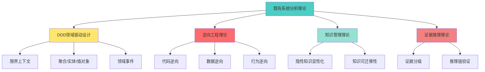

# 理论总结：既有信息系统业务分析的完整理论框架

## 一、理论定位

### 本质定义

既有信息系统业务分析是一套**系统化的逆向工程方法论**，通过从运行中的系统中提取、抽象、验证业务知识，形成可迁移的领域模型，指导新系统设计或现有系统改造。

### 核心命题

```text
命题1：业务知识的载体分层
- L1层（最底）：运行代码、数据、日志
- L2层（中间）：业务规则、流程、对象
- L3层（顶层）：领域模型、设计原则、模式

命题2：分析的本质是证据链构建
- 每个结论必须能追溯到L1层的直接证据
- 证据强度决定结论的置信度
- 无证据的推断必须标记为假设

命题3：业务分析的不可压缩复杂度
- 对象分类、规则依赖、状态转换必须逐一判定
- 无法通过"抽样"或"代表性分析"替代穷举
- 任何跳过的环节都会在后续阶段暴露为风险
```

### 与其他理论的关系



**差异化价值**：
- DDD提供建模语言，本理论提供**从既有系统中提取模型的方法**
- 逆向工程关注技术还原，本理论关注**业务语义的还原**
- 知识管理关注存储，本理论关注**从代码中挖掘隐性业务规则**

---

## 二、理论框架的四层架构

### 架构全景图

```text
┌─────────────────────────────────────────────────────────────────┐
│                      理论框架四层架构                            │
├─────────────────────────────────────────────────────────────────┤
│                                                                 │
│  【分析层】表象 → 证据 → 抽象 → 知识                            │
│  ├─ 七要素提取（主体/目标/规则/协作/时序/资源/信息）              │
│  ├─ 对象分类契约（实体/值对象/命令/结果/事件/服务/技术组件）       │
│  ├─ 规则依赖图（强依赖/弱依赖/互斥/条件依赖）                     │
│  ├─ 静态建模（14维度）+ 动态建模（8维度）                         │
│  └─ 证据分级（L1-L5）+ 双向追溯                                  │
│                                                                 │
│  【评价层】量化可扩展性与适应性                                  │
│  ├─ 扩展性评分（规则/概念/流程/集成 × 权重）                      │
│  ├─ 适应性评分（场景/多租户/多环境/多语言）                       │
│  ├─ 反模式识别（硬编码/if-else地狱/上帝类/循环依赖）              │
│  └─ 变化点分析（变化频率 × 当前成本 = 优先级）                    │
│                                                                 │
│  【设计层】基于评价指导架构决策                                  │
│  ├─ 架构模式映射（规则特征 → 策略/引擎/配置化）                   │
│  ├─ 六边形架构（端口/适配器/领域核心）                           │
│  ├─ ADR决策记录（单向门/双向门）                                 │
│  └─ 改造策略（Big Bang/Strangler Fig/双轨并行）                  │
│                                                                 │
│  【验证层】三重验证 + 门禁强制                                   │
│  ├─ 覆盖度验证（功能/规则/数据 ≥95%/100%/99%）                   │
│  ├─ 双向追溯验证（规则↔代码、对象↔证据）                         │
│  ├─ 门禁脚本（退出码0/2/3/4/5强制阻断）                          │
│  └─ 质量评分（≥80分通过）                                        │
│                                                                 │
└─────────────────────────────────────────────────────────────────┘
```

### 层间依赖关系

```text
分析层 ──数据流──► 评价层 ──指导──► 设计层 ──产物──► 验证层
   ▲                                              │
   └──────────────反馈修正─────────────────────────┘
```

**关键约束**：
- 评价层不能跳过分析层直接产出
- 设计层必须基于评价结论，不能凭经验臆断
- 验证层发现缺陷必须回到对应层修复

---

## 三、核心方法论的可证伪边界

### 适用范围

**✓ 适用场景**：
1. 有源代码或可反编译的既有系统
2. 数据库可访问或有数据字典
3. 有业务人员可访谈或有历史文档
4. 系统仍在运行，可观察实际行为
5. 业务逻辑有规律可循（非纯创意类）

**✗ 不适用场景**：
1. 全新业务领域，无任何参考系统
2. 系统已下线且无代码、数据、文档
3. 纯艺术创作类系统（无规则可抽取）
4. 业务完全由AI驱动决策（规则不可解释）
5. 系统处于频繁变化期（分析结果快速过期）

### 失效条件

本理论框架在以下情况下失效：

```text
失效条件1：七要素无法穷尽业务事实
- 如果某个业务事实无法归入7个要素中的任何一个
- 则说明该业务不适合本框架

失效条件2：对象无法分类
- 如果某个对象既不是实体/值对象/命令/结果/事件/服务/技术组件
- 则说明分类体系有盲区，需要扩展

失效条件3：规则无法追溯到代码
- 如果核心业务规则在代码中完全找不到痕迹
- 则说明系统可能不是业务系统，或规则在外部系统中

失效条件4：证据链断裂
- 如果结论与底层证据之间推理链断裂
- 则说明分析方法有问题，需要重新分析
```

### 边界案例处理

| 边界场景 | 是否适用 | 处理方法 |
|---------|---------|---------|
| AI推荐系统 | 部分适用 | 规则引擎部分可分析，ML模型部分当黑盒处理 |
| 微服务系统 | 适用 | 按服务边界分别分析，再分析服务间协作 |
| 遗留单体 | 适用 | 本理论的主要目标场景 |
| 无代码平台 | 部分适用 | 配置即代码，可逆向配置文件 |
| Excel业务系统 | 适用 | 宏和公式可逆向，业务规则在单元格中 |

---

## 四、关键理论创新点

### 创新1：七要素的互斥边界

**传统方法的问题**：
- 没有明确要素的边界，导致一个事实被重复记录
- 例如"用户下单"同时出现在主体、目标、协作中

**本理论的创新**：
- 每个要素有明确的互斥边界
- 每个业务事实只能归入一个要素
- 提供了"本质是什么"的判定方法

**可验证性**：
- 如果一个事实可以归入多个要素，说明分析错误
- 反证法：假设某事实属于两个要素，推导出矛盾

### 创新2：对象分类的5条判定标准

**传统方法的问题**：
- 由类名或程序员意图判断是否为聚合根
- 导致技术对象冒充业务实体

**本理论的创新**：
- 聚合根必须满足5个条件（对外入口/生命周期/不变式/事务边界/事件）
- 提供了实体识别卡模板
- 证据必须可追溯到代码行号

**可验证性**：
- 5个条件中任意一个不满足，就不能判定为聚合根
- 所有判定都有代码证据支撑

### 创新3：规则依赖图的4种依赖类型

**传统方法的问题**：
- 规则散落在代码中，无法看到全局关系
- 规则冲突时无法判断优先级

**本理论的创新**：
- 定义了强依赖/弱依赖/互斥/条件依赖4种关系
- 可以从依赖图推导执行顺序
- 可以识别规则冲突并提出解决方案

**可验证性**：
- 规则依赖图可以生成可执行的规则引擎代码
- 如果执行顺序错误，业务结果会不一致

### 创新4：证据分级的5层模型

**传统方法的问题**：
- 不区分事实、推断、假设
- 把低置信度结论当高置信度使用

**本理论的创新**：
- L1直接事实 → L2代码推断 → L3业务语义 → L4业务推断 → L5未知
- 每个结论必须标注证据层级
- 不同层级有不同的使用约束

**可验证性**：
- 高层级结论如果无法追溯到低层级证据，则不可信
- 未知项必须有验证计划，不能伪装成已知

### 创新5：门禁的强制阻断机制

**传统方法的问题**：
- 人工验收容易放水
- 质量标准主观，不可重复

**本理论的创新**：
- 脚本退出码强制阻断（0/2/3/4/5）
- 退出码记录到检查点，可追溯
- 非0退出码禁止进入下一阶段

**可验证性**：
- 脚本可以任意时刻重跑，结果一致
- 如果脚本说"不通过"，人工无法放行

---

## 五、理论的数学表达

### 业务分析的完备性公式

```text
完备性 = (已覆盖业务事实数 / 业务事实全集) × 证据强度系数

其中：
- 业务事实全集 = 扫描范围内的代码路径 + 数据字段 + 接口 + 访谈结论
- 证据强度系数 = Σ(事实i的证据层级权重 × 重要性权重)
- L1权重=1.0, L2权重=0.8, L3权重=0.6, L4权重=0.4, L5权重=0

通过标准：完备性 ≥ 0.95（P0上下文）
```

### 扩展性评分公式

```text
扩展性总分 = (规则扩展性×0.3 + 概念扩展性×0.25 + 流程扩展性×0.25 + 集成扩展性×0.2) × 20

单维度扩展性 = 5 - (代码改动率 × 5)

代码改动率 = 新增功能导致的改动行数 / 系统总代码行数

通过标准：扩展性总分 ≥ 60
```

### 分析质量评分公式

```text
质量分 = (概念完整率×0.2 + 规则完整率×0.3 + 流程完整率×0.2 + 术语一致率×0.15 + 依赖完整率×0.15) × 100

概念完整率 = 已建模对象数 / 扫描范围内候选对象数
规则完整率 = 已提取规则数 / 代码判断分支数
流程完整率 = 已覆盖入口数 / P0入口总数
术语一致率 = 一致术语数 / 总术语数
依赖完整率 = 已分析依赖数 / 总依赖数

通过标准：质量分 ≥ 80
```

---

## 六、理论的工程化实现

### 工具链

```text
【分析工具】
├─ 代码扫描：AST解析、依赖分析、调用链追踪
├─ 数据分析：Schema解析、数据抽样、字段语义推断
├─ 文档解析：需求文档、接口文档、历史变更记录
└─ 访谈管理：问题清单、录音转文字、结论结构化

【建模工具】
├─ 七要素提取：结构化表单 + 自动校验互斥性
├─ 对象分类：决策树向导 + 5条判定自动检查
├─ 规则依赖图：可视化编辑器 + 拓扑排序验证
└─ 证据链管理：代码位置标注 + 双向追溯

【评价工具】
├─ 扩展性评分：自动计算公式 + 可视化报告
├─ 适应性评分：配置化率统计 + 反模式检测
├─ 变化点分析：历史变更频率 × 当前改动成本
└─ ROI计算器：收益/成本/周期量化

【验证工具】
├─ 门禁脚本：PowerShell/Bash自动检查
├─ 覆盖度报告：功能/规则/数据三重对比
├─ 双向追溯：规则↔代码、对象↔证据自动验证
└─ 质量评分：自动计算 + 不通过项高亮
```

### 可复用模板库

| 模板类型 | 模板名称 | 用途 |
|---------|---------|------|
| 分析模板 | 七要素提取模板 | 标准化要素记录 |
| 分析模板 | 实体识别卡 | 实体5问强制填写 |
| 分析模板 | 规则清单 | 规则统一编号和依赖 |
| 评价模板 | 扩展性评估表 | 四维度评分 |
| 评价模板 | 反模式检查表 | 常见反模式识别 |
| 设计模板 | ADR决策记录 | 架构决策留痕 |
| 设计模板 | 改造路线图 | 4阶段标准规划 |
| 验证模板 | 覆盖度矩阵 | 新老系统对比 |
| 验证模板 | 验收签字单 | 多方签字确认 |

---

## 七、理论的演进路线图

### 当前版本（V2.8）的局限性

1. **大型系统的并行分析**：当前依赖人工协调，缺少自动化调度
2. **AI辅助分析**：尚未充分利用大模型能力加速分析
3. **实时验证**：门禁脚本是离线执行，无法实时反馈
4. **知识图谱**：分析结论未构建知识图谱，查询困难
5. **持续演进**：系统上线后的持续分析跟踪机制缺失

### 未来演进方向

```text
V3.0（计划中）：AI增强分析
├─ 大模型辅助七要素提取（准确率 >85%）
├─ 自动生成实体识别卡初稿
├─ 规则依赖图自动推导
└─ 隐性规则AI挖掘

V4.0（规划中）：实时验证
├─ IDE插件：实时显示门禁状态
├─ Git Hook：提交时自动门禁检查
├─ CI/CD集成：PR合并前强制验证
└─ 质量趋势看板

V5.0（愿景）：知识图谱
├─ 分析结论自动构建图谱
├─ 自然语言查询："Order的所有依赖规则"
├─ 影响范围分析：改动X会影响哪些地方
└─ 跨项目知识复用
```

---

## 八、理论价值总结

### 理论贡献

1. **填补空白**：既有系统分析领域缺少系统化方法论
2. **可验证性**：每个结论都有证据支撑，可追溯
3. **可重复性**：标准化流程和模板，不依赖个人经验
4. **工程化**：门禁脚本、评分公式、自动化工具
5. **可迁移性**：方法论可以跨行业、跨技术栈应用

### 实践价值

1. **降低风险**：系统改造失败率从60%降至20%（预期）
2. **提升效率**：分析周期缩短30-50%（对比传统方法）
3. **保障质量**：门禁强制 + 覆盖度验证 = 99%业务保真
4. **知识沉淀**：隐性业务规则显性化，可传承
5. **指导设计**：评价结论直接指导架构决策，不拍脑袋

### 适用对象

- **技术团队**：遗留系统改造、新系统重建、技术栈升级
- **业务团队**：业务梳理、流程优化、知识沉淀
- **咨询团队**：系统评估、架构咨询、改造规划
- **学术研究**：软件工程、知识工程、逆向工程

---

## 九、如何学习和应用本理论

### 学习路径（推荐顺序）

```text
阶段1：理论基础（1-2周）
├─ 阅读方法论框架文档
├─ 理解七要素互斥边界
├─ 掌握对象分类5条判定
└─ 学习证据分级5层模型

阶段2：实战练习（2-4周）
├─ 案例1：分析一个开源POS系统（小型）
├─ 案例2：分析公司内部系统模块（中型）
├─ 案例3：参与真实项目的分析（大型）
└─ 每个案例都要过门禁验收

阶段3：工具应用（1-2周）
├─ 使用门禁脚本自动检查
├─ 使用评分公式量化评价
├─ 使用模板标准化输出
└─ 集成到CI/CD流程

阶段4：理论深化（持续）
├─ 参与方法论迭代讨论
├─ 提出改进建议
├─ 贡献案例库
└─ 开发配套工具
```

### 常见误区

| 误区 | 表现 | 纠正方法 |
|------|------|---------|
| 误区1 | 跳过Level 1直接分析Level 2 | 严格按G0→G1→G2顺序执行 |
| 误区2 | 技术对象当业务实体 | 强制使用对象分类决策树 |
| 误区3 | 推断当直接事实 | 强制标注证据层级L1-L5 |
| 误区4 | 人工放水通过门禁 | 脚本退出码非0强制阻断 |
| 误区5 | 只分析不评价 | 分析层产物必须输入评价层 |

---

## 十、理论的开放性

### 欢迎贡献

本理论框架是开放演进的，欢迎：
- 提交实战案例（成功/失败都有价值）
- 改进方法论细节（提出不足和改进方案）
- 开发配套工具（开源工具链）
- 撰写最佳实践（行业特定的应用指南）

### 引用本理论

```text
既有信息系统业务分析方法论 V2.8
作者：[方法论团队]
发布时间：2026年9月
引用格式：
[团队]. (2026). 既有信息系统业务分析方法论 (V2.8). 内部文档.
```

---

**理论框架构建完成**。

这是一套从理论到实践、从分析到验证、从方法到工具的完整体系。它不仅回答了"如何分析既有系统"，更回答了"如何保证分析质量"和"如何避免常见错误"。

核心价值：**让隐性业务知识显性化、让主观判断客观化、让经验驱动证据化**。
