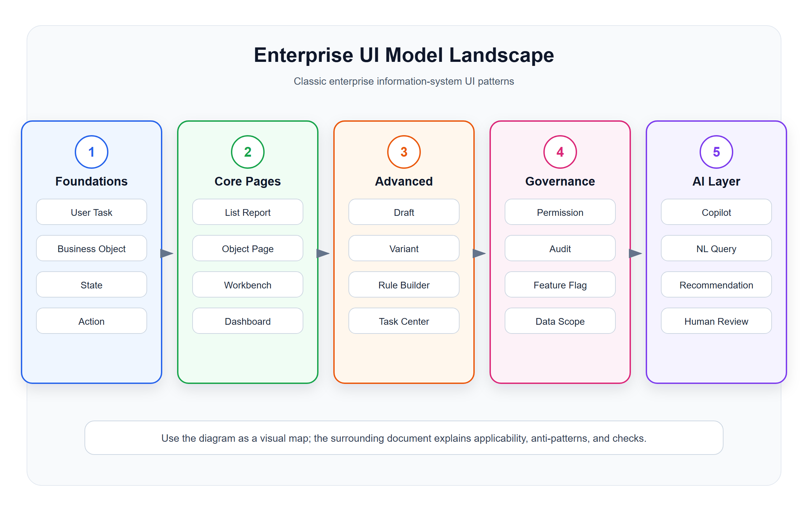

# 信息系统与 ERP 经典 UI 模型总览

<!-- ui-model-diagram:start -->

> 图源文件：[`assets/00-ui-model-landscape.svg`](assets/00-ui-model-landscape.svg)

<!-- ui-model-diagram:end -->

## 0. 结论

成熟的信息系统 UI 不是某一种视觉风格，而是一组在企业软件、行业实践与人机交互研究中长期积累的页面模式、任务模式和信息组织模式。具体产品名称只说明模式来源，不等于对所有业务都适用；选型仍要经过任务、对象、风险和验证约束。

在 ERP、CRM、POS、WMS、财务、供应链、报表、BOSS 后台等系统中，最稳定、最值得复用的 UI 模型主要来自这些体系：

| 来源 | 代表价值 | 对信息系统最有用的模式 |
|---|---|---|
| SAP Fiori | 企业级 ERP 页面范式最完整 | List Report、Object Page、Overview Page、Worklist、Wizard、Flexible Column Layout |
| Microsoft Fluent | 复杂生产力工具和后台系统经验 | Command Bar、Master-Detail、Navigation、Data Grid、Dialog、Panel |
| IBM Carbon | 数据密集型企业系统组件和模式 | Data Table、Filtering、Form、Modal、Progressive Disclosure |
| Google Material | 通用组件、移动和响应式规则 | Navigation Drawer、Data Table、Cards、Dialogs、Steppers |
| Salesforce Lightning | CRM 对象页和销售流程页面范式 | Record Page、Related Lists、Activity Timeline、Kanban、Path |
| Ant Design / Ant Design Pro | 国内外中后台工程落地成熟 | ProTable、Query Form、CRUD、Dashboard、Steps Form、Drawer Form |
| Nielsen Norman Group | 可用性原则和企业 UX 研究 | Recognition、Feedback、Consistency、Error Prevention、Dashboard UX |
| W3C ARIA APG | 可访问性和键盘交互标准 | Grid、Treegrid、Dialog、Tabs、Combobox、Toolbar |

一句话：

> 成熟的信息系统 UI = 业务对象模型 + 用户任务模型 + 页面模式 + 状态与风险约束 + 交互与可访问性规范。

## 1. 经典 UI 模型清单

### 1.1 导航与系统骨架

| 模型 | 适用场景 | 典型系统 |
|---|---|---|
| 全局导航 Shell | 多模块后台、SaaS、ERP | 运营后台、商户后台 |
| 模块导航 + 二级菜单 | 功能树稳定、权限复杂 | ERP、财务、供应链 |
| 工作台门户 | 用户每天先处理待办、异常、指标 | 店长工作台、财务工作台 |
| 角色首页 | 不同岗位看到不同入口 | 收银、仓管、运营、老板 |
| 面包屑导航 | 层级对象、复杂详情跳转 | 商品分类、组织架构、订单详情 |
| 多标签页工作区 | 高频多任务并行处理 | ERP 客户端、财务系统、客服系统 |

### 1.2 列表与对象发现

| 模型 | 适用场景 | 典型页面 |
|---|---|---|
| List Report | 按条件查询业务对象并执行操作 | 订单列表、会员列表、库存流水 |
| Worklist | 只处理一批待办对象 | 待审核单据、待发货订单 |
| Data Grid | 数据密集、字段多、需要排序筛选 | 商品档案、库存台账 |
| Kanban | 对象按阶段流转 | 商机、任务、工单 |
| Calendar / Timeline List | 时间驱动任务 | 排班、预约、活动计划 |
| Tree List / Tree Grid | 层级对象管理 | 菜单、组织、类目、权限 |

### 1.3 详情与业务对象理解

| 模型 | 适用场景 | 典型页面 |
|---|---|---|
| Object Page | 一个核心对象的完整上下文 | 订单详情、会员详情、商品详情 |
| Master-Detail | 左侧选择对象，右侧查看详情 | 客户列表 + 客户资料 |
| Flexible Column Layout | 列表、详情、子详情并列 | 订单 -> 支付单 -> 流水 |
| Record Page | CRM 类对象资料页 | 客户、商机、合同 |
| Timeline / Activity Feed | 解释历史过程 | 审批记录、操作日志、客户跟进 |
| Related Lists | 展示对象关联集合 | 客户订单、商品库存、会员券 |

### 1.4 表单与流程录入

| 模型 | 适用场景 | 典型页面 |
|---|---|---|
| Simple Form | 字段少、一次性提交 | 新增品牌、编辑备注 |
| Sectioned Form | 字段多但仍可一次提交 | 商品资料、门店资料 |
| Wizard / Steps Form | 多步骤、强顺序、需要分段校验 | 开店配置、营销活动创建 |
| Drawer Form | 列表上下文内快速编辑 | 修改会员标签、编辑商品价格 |
| Modal Form | 短任务、临时确认 | 改状态、填写原因 |
| Inline Edit | 表格中少量字段快速修改 | 库存预警值、排序号 |
| Bulk Edit | 批量修改多个对象 | 批量上架、批量改价 |

### 1.5 决策、报表与监控

| 模型 | 适用场景 | 典型页面 |
|---|---|---|
| Dashboard | 指标概览、异常入口、趋势判断 | 经营概览、门店看板 |
| Overview Page | 多张业务卡片聚合入口 | 老板首页、财务概览 |
| Analytical List Page | 指标 + 明细联动分析 | 销售分析、库存分析 |
| Drill-down Report | 从总览钻取到明细 | 营收 -> 门店 -> 订单 |
| Exception Dashboard | 只突出异常、风险和待处理项 | 支付异常、库存异常 |
| Comparison View | 多对象横向对比 | 门店对比、商品对比 |

### 1.6 操作、反馈与异常处理

| 模型 | 适用场景 | 典型页面 |
|---|---|---|
| Command Bar | 页面主操作和次操作集中管理 | 新增、导出、批量操作 |
| Action Menu | 操作很多但低频 | 更多操作、批量动作 |
| Confirmation Dialog | 高风险动作确认 | 删除、作废、退款 |
| Side Panel | 不离开当前任务查看补充信息 | 规则说明、客户画像 |
| Toast / Message | 短反馈 | 保存成功、复制成功 |
| Alert / Inline Error | 用户必须处理的问题 | 表单错误、接口失败 |
| Empty State | 无数据时引导下一步 | 首次创建、筛选无结果 |

## 2. ERP 信息系统最推荐的 12 个核心页面模型

| 优先级 | 模型 | 为什么重要 |
|---|---|---|
| 1 | 查询列表 + 高级筛选 + 表格操作 | 几乎所有后台系统的入口 |
| 2 | 对象详情页 Object Page | 承载业务对象、状态、历史、关联数据 |
| 3 | 工作台 Workbench | 让不同岗位先处理待办和异常 |
| 4 | 分段表单 Sectioned Form | 支撑复杂主数据维护 |
| 5 | 向导 Wizard | 支撑配置型、流程型业务 |
| 6 | 主从详情 Master-Detail | 提升对象浏览和连续处理效率 |
| 7 | 三栏详情 Flexible Column Layout | 支撑复杂对象链路追踪 |
| 8 | 树表 Tree Grid | 支撑组织、权限、类目、菜单 |
| 9 | 报表钻取 Drill-down Report | 从指标追到业务明细 |
| 10 | 时间线 Timeline | 解释状态变化和责任过程 |
| 11 | 批量操作 Bulk Operation | 支撑后台高效率处理 |
| 12 | 异常处理中心 Exception Center | 把隐藏错误变成可处理任务 |

## 3. 选型原则

### 3.1 先问业务任务，不先选组件

不要先问“这个页面用表格还是卡片”，而要先问：

- 用户进来是为了查找、判断、录入、审批、配置、分析，还是处理异常？
- 页面核心对象是什么？
- 用户需要先看到结果、原因、趋势、状态，还是可操作项？
- 高频动作是什么，低频动作是什么？
- 错误操作的代价是什么？

### 3.2 页面模型和业务对象要匹配

| 业务对象特征 | 推荐 UI 模型 |
|---|---|
| 对象数量多、需要筛选 | List Report / Data Grid |
| 对象状态复杂、关联数据多 | Object Page |
| 对象有父子层级 | Tree / Tree Grid |
| 对象按阶段推进 | Kanban / Path / Steps |
| 对象需要连续处理 | Worklist / Master-Detail |
| 对象需要配置多个维度 | Wizard / Sectioned Form |
| 对象用于分析决策 | Dashboard / Analytical List Page |

### 3.3 ERP 系统不要滥用卡片

卡片适合摘要、入口和少量对象，不适合高密度明细维护。ERP 中更稳定的基础模型仍然是：

- 表格。
- 筛选区。
- 分组表单。
- 详情分区。
- 关联列表。
- 操作日志。
- 钻取报表。

## 4. 分册说明

本目录按信息系统常见问题拆成以下文档：

| 文件 | 用途 |
|---|---|
| `01-核心页面模型.md` | 解释 List Report、Object Page、Worklist、Dashboard 等经典页面模型 |
| `02-列表表格筛选模型.md` | 专讲查询列表、筛选、表格、批量操作 |
| `03-对象详情与主从模型.md` | 专讲详情页、关联列表、时间线、主从布局 |
| `04-表单配置与流程模型.md` | 专讲表单、向导、配置、审批、批量录入 |
| `05-工作台报表与分析模型.md` | 专讲工作台、看板、报表、钻取、异常中心 |
| `06-模式选择矩阵与反模式.md` | 给出选型矩阵、常见错误和检查清单 |
| `07-权威体系参考索引.md` | 汇总可继续学习的权威设计体系 |
| `08-高级企业交互模型.md` | 补充视图变体、草稿、长任务、冲突解决、命令面板等高级交互 |
| `09-企业治理与权限配置模型.md` | 专讲权限矩阵、角色设计器、数据范围、审批流、规则配置器、功能开关 |
| `10-行业业务专用UI模型.md` | 专讲对账、库存、排班、POS、客户 360、财务凭证、地图作业等行业模式 |
| `11-AI辅助与智能化界面模型.md` | 专讲 AI Copilot、自然语言查询、智能填表、异常解释和人工确认 |
| `12-更多经典模式速查表.md` | 用速查表补充更多输入、反馈、协作、搜索、安全、性能、多端模式 |
| `13-界面模型模式详解.md` | 以模式卡形式说明 Context、Problem、Forces、Solution、边界和验证 |
| `13-界面模型深层逻辑与模式体系.md` | 解释认知、状态、风险、信任、协作、数据真实性等上位理论和推导关系 |

目录层级不是“编号越大越高级”：`01–12` 负责按问题域落地，`13-界面模型模式详解.md` 负责逐模式使用，`13-界面模型深层逻辑与模式体系.md` 负责解释为什么这样选择。每个案例 HTML 都会在页头标明“静态结构示例”或“交互示例”：静态示例只验证信息结构，交互示例还可演示局部状态变化；两者都不连接真实后端，也不能替代业务、权限、数据量和辅助技术验收。

## 5. 使用方式

设计一个新页面时，按下面顺序套用：

1. 确认用户角色和任务。
2. 确认核心业务对象。
3. 判断是查询、详情、录入、流程、分析还是异常处理。
4. 从本目录选择对应页面模型。
5. 按模型检查信息层级、操作区、状态反馈、错误处理和可访问性。
6. 再决定组件和视觉样式。
7. 用真实角色、真实数据规模和异常路径验证；如果模式不能降低判断成本或错误风险，就回退重新选型。

最终目标：

> 让每个页面都能解释“用户为什么来、对象是什么、状态如何形成、下一步能做什么、出错后如何恢复”。
