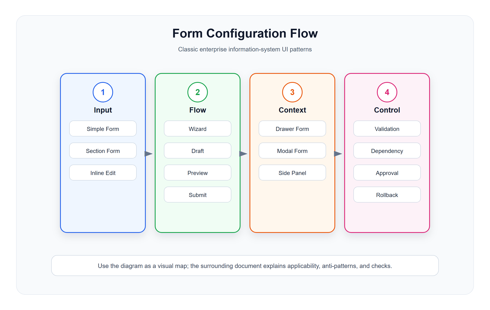

# 表单、配置与流程模型

<!-- ui-model-diagram:start -->



> 图源文件：[`assets/04-form-flow-model.svg`](assets/04-form-flow-model.svg)

<!-- ui-model-diagram:end -->

表单模式的选择依据是任务承诺、依赖、风险和可恢复性，不是字段数量本身。更完整的认知成本、风险门禁和承诺闭环见 [`13-界面模型深层逻辑与模式体系.md`](13-界面模型深层逻辑与模式体系.md)。

## 1. 表单的本质

表单不是字段录入容器，而是业务决策和数据承诺的界面。用户填写表单时，本质上是在创建、修改或确认一个业务事实。

优秀表单必须回答：

- 用户正在创建或修改什么对象？
- 哪些字段是必填，为什么必填？
- 字段之间有什么依赖？
- 当前输入会影响哪些后续状态？
- 错误如何发现和修正？
- 提交后发生什么？

## 2. Simple Form 简单表单

### 适用场景

- 新增分类。
- 编辑备注。
- 修改标签。
- 新增简单字典项。

### 设计要求

- 字段和依赖足够少，用户能在一个上下文中理解并完成；“7 个以内”只能作为早期审视信号，不是硬标准。
- 只包含一个明确任务。
- 提交按钮文案表达业务动作，例如“保存分类”，不要泛化为“确定”。
- 校验失败直接定位到字段。

### 反模式

- 简单表单里混入复杂配置。
- 字段含义依赖外部文档，页面没有说明。
- 错误只在顶部提示，用户不知道改哪里。

### 中文设计案例

#### 案例：零售门店新增分类表单

**交互示例**：[查看 Simple Form 案例](cases/04-表单配置与流程模型/04-1-simple-form-category.html)

**场景**：运营人员新增商品二级分类

**表单设计**：
```
┌─────────────────────────────────────────────────────────────────────┐
│ 新增分类                                                               │
├─────────────────────────────────────────────────────────────────────┤
│                                                                      │
│  分类名称 *                                                           │
│  ┌───────────────────────────────────────────────────────────────┐  │
│  │ 进口零食                                                        │  │
│  └───────────────────────────────────────────────────────────────┘  │
│                                                                      │
│  上级分类                                                             │
│  ┌───────────────────────────────────────────────────────────────┐  │
│  │ 零食饮料 ▼                                                     │  │
│  └───────────────────────────────────────────────────────────────┘  │
│                                                                      │
│  分类编码 *                                                           │
│  ┌───────────────────────────────────────────────────────────────┐  │
│  │ SNACK_IMPORT                                                   │  │
│  └───────────────────────────────────────────────────────────────┘  │
│  自动生成，或手动填写（编码唯一）                                     │
│                                                                      │
│  排序号                                                               │
│  ┌───────────────────────────────────────────────────────────────┐  │
│  │ 5                                                              │  │
│  └───────────────────────────────────────────────────────────────┘  │
│                                                                      │
│  备注                                                                 │
│  ┌───────────────────────────────────────────────────────────────┐  │
│  │                                                              │  │
│  │                                                              │  │
│  └───────────────────────────────────────────────────────────────┘  │
│                                                                      │
│                              [取消]  [保存分类]                     │
│                                                                      │
└─────────────────────────────────────────────────────────────────────┘

错误提示设计：
┌─────────────────────────────────────────────────────────────────────┐
│  ⚠️ 请修正以下问题：                                                │
│                                                                      │
│  • 分类名称：已存在同名分类，请检查或使用其他名称                   │
│                                                                      │
│  • 分类编码：格式不正确，只能包含字母和下划线                       │
└─────────────────────────────────────────────────────────────────────┘
```

**设计要点**：
1. 任务单一、依赖简单；本例字段数量较少，但不把“7 个”作为通用门槛
2. 按钮文案表达业务动作："保存分类"而非"确定"
3. 错误提示紧贴对应字段
4. 提示信息内嵌在表单中，不依赖外部文档

## 3. Sectioned Form 分段表单

### 适用场景

- 商品资料。
- 门店资料。
- 会员规则。
- 供应商资料。
- 结算配置。

### 标准结构

```text
基础信息
  名称、编码、类型、状态

业务配置
  价格、库存、渠道、规则

扩展信息
  标签、备注、附件

审计信息
  创建人、更新时间
```

### 设计要求

- 分区按业务含义，而不是按字段来源。
- 每个分区有清晰标题。
- 必填字段集中靠前。
- 互斥字段按当前模式动态显示或禁用。
- 长表单要有锚点导航。

### 反模式

- 把所有字段铺成一列。
- 字段分组只反映数据库表。
- 隐藏字段仍参与校验，导致用户无法提交。

### 中文设计案例

#### 案例：零售商品资料编辑表单

**场景**：运营人员编辑商品完整资料

**HTML 效果示例**：[查看设计案例](cases/04-表单配置与流程模型/04-2-sectioned-form-product.html)

**设计要点**：
1. 按业务含义分组，不按数据库表结构
2. 每个分区有清晰标题和锚点导航
3. 必填字段集中在前两个分区
4. 审计信息只读，放在最后

## 4. Wizard / Steps Form 向导模型

### 适用场景

- 创建营销活动。
- 初始化门店。
- 配置支付渠道。
- 导入商品。
- 创建复杂审批流。

### 标准步骤

```text
1. 基础信息
2. 规则配置
3. 范围选择
4. 预览确认
5. 完成结果
```

### 设计要求

- 一步只解决一个问题。
- 每一步提交前做局部校验。
- 跨步骤依赖要可见。
- 支持保存草稿。
- 最后一步提供总览和风险提示。
- 完成页给出下一步入口。
- 只有步骤间存在顺序依赖、阶段校验、不同责任人或阶段承诺时才拆成 Wizard；仅因字段多而拆步会增加导航和记忆成本。

### 反模式

- 简单任务强行拆步骤。
- 用户无法回到上一步修改。
- 最后一步直接提交，没有预览。
- 中途关闭页面全部丢失。

### 中文设计案例

#### 案例：零售门店开通向导

**交互示例**：[查看门店开通 Wizard 案例](cases/06-模式选择矩阵与反模式/06-2-store-setup-wizard.html)

案例重点是跨步依赖、草稿和提交前总览。真实开通还需补权限、幂等、失败恢复和初始化结果回执。

## 5. Drawer Form 抽屉表单

### 适用场景

- 从列表快速编辑对象。
- 查看并处理详情摘要。
- 不离开当前上下文完成小任务。

常见例子：

- 编辑会员标签。
- 修改商品库存预警值。
- 审核单据。
- 查看订单摘要并备注。

### 设计要求

- 抽屉任务必须足够轻。
- 抽屉宽度匹配内容复杂度。
- 保存后刷新原列表行。
- 关闭前对未保存内容做提醒。

### 反模式

- 把完整复杂详情页塞进抽屉。
- 抽屉内再打开多层抽屉。
- 保存后列表不刷新。

## 6. Modal Form 弹窗表单

### 适用场景

- 短确认。
- 填写原因。
- 选择少量参数。
- 危险动作二次确认。

### 设计要求

- 字段少。
- 文案明确说明后果。
- 危险操作按钮使用危险样式。
- 不要在弹窗中承载长流程。

### 反模式

- 弹窗里放大表单。
- 弹窗嵌套弹窗。
- 关闭行为不明确。

### 中文设计案例

#### 案例：零售订单退款原因确认

**场景**：客服处理顾客退款申请，需要填写退款原因

**HTML 效果示例**：[查看设计案例](cases/04-表单配置与流程模型/04-3-modal-form-refund.html)

**设计要点**：
1. 弹窗内容简洁，只包含退款确认必要信息
2. 退款金额醒目显示
3. 危险操作按钮使用危险样式
4. 关闭行为明确，有取消按钮

## 7. Inline Edit 行内编辑

### 适用场景

- 排序号。
- 备注。
- 单价。
- 预警库存。
- 启停状态。

### 设计要求

- 适合单字段或少量字段。
- 保存和取消状态明确。
- 校验错误贴近字段。
- 高风险字段不建议行内编辑。

### 反模式

- 表格里所有字段都可编辑。
- 用户不知道是否已经保存。
- 批量行内编辑没有冲突处理。

## 8. 配置页模型

配置页和普通编辑页不同，它改变的是系统规则。

### 常见类型

| 类型 | 示例 | 设计重点 |
|---|---|---|
| 开关配置 | 是否启用积分 | 说明影响范围 |
| 阈值配置 | 库存预警值 | 说明单位和默认值 |
| 规则配置 | 满减、积分倍率 | 说明命中条件 |
| 映射配置 | 支付渠道、门店关系 | 说明依赖和冲突 |
| 权限配置 | 角色菜单权限 | 说明继承和覆盖关系 |

### 设计要求

- 配置变更要有预览。
- 高风险配置要有生效时间。
- 配置变更要记录操作日志。
- 支持恢复默认值或回滚。
- 展示当前配置影响范围。
- 展示规则依赖、冲突、引用方和旧版本差异；高影响配置提供样本模拟或 Shadow Mode，再决定发布。
- 区分草稿、已验证、待审批、已发布、已回滚等生命周期，不能把“已保存”写成“已生效”。

配置型页面可以按认知困难选择模式：

| 困难 | 推荐模式 |
|---|---|
| 不知道规则影响谁 | Dependency Map、影响对象列表 |
| 规则冲突或不可达 | Rule Lint、冲突检测 |
| 后果要发布后才知道 | Simulation、样本回放、即时预览 |
| 新旧版本难比较 | Version Diff、语义差异、回滚点 |
| 发布风险高 | 分阶段发布、审批门禁、Shadow Mode |

## 9. 审批与状态流转模型

### 标准结构

```text
当前状态
流程进度
审批节点
审批人
操作区
审批意见
历史记录
```

### 设计要求

- 当前节点和下一节点要明确。
- 用户要知道自己是否有处理权限。
- 驳回、撤回、转交、加签等动作要说明后果。
- 审批意见和附件要进入时间线。
- 区分请求、接受、处理、交付和验收；转交必须有接收回执，不能只改负责人就视为完成交接。
- 高风险审批根据职责分离要求限制自提自批、自建自审，并展示有效权限和例外授权来源。

### 中文设计案例：受控配置审批

```text
规则草稿
  -> 样本模拟通过
  -> 制单人提交
  -> 审批人接受任务
  -> 审批通过并设定生效时间
  -> 发布结果回执
  -> 业务负责人验收 / 回滚
```

页面应同时展示规则版本、影响范围、模拟证据、制单人与审批人、计划生效时间、发布结果和回滚点。

## 10. 表单检查清单

- 表单是否只服务一个明确业务任务？
- 字段顺序是否符合用户填写顺序？
- 必填字段是否有业务理由？
- 互斥字段是否不会同时校验？
- 错误是否贴近字段并可修正？
- 提交后是否解释下一步？
- 长流程是否支持草稿？
- 配置变更是否有预览、日志和回滚？
- 高风险操作是否采用与风险、可逆性相称的硬约束、影响预览、职责分离、补偿或确认？
- 模式是否按依赖、阶段承诺、风险和可恢复性选择，而不是只按字段数？
- 配置是否显示依赖、冲突、版本差异、生效时间和回滚点？
- 并发更新时是否能保留草稿并比较版本？
- 审批和交接是否有接受、结果回执和验收，而不只记录“已提交”？
- 对话框、抽屉、步骤器和错误提示是否具备键盘、焦点和屏幕阅读器语义？

> 案例说明：本地 HTML 可演示字段输入、草稿状态和 Modal 开关等局部交互。Simple Form 主要验证单一任务；Sectioned Form 和 Modal Form 用于检查分区与短任务边界，正式实现仍需校验真实业务后果、权限、并发和辅助技术。
