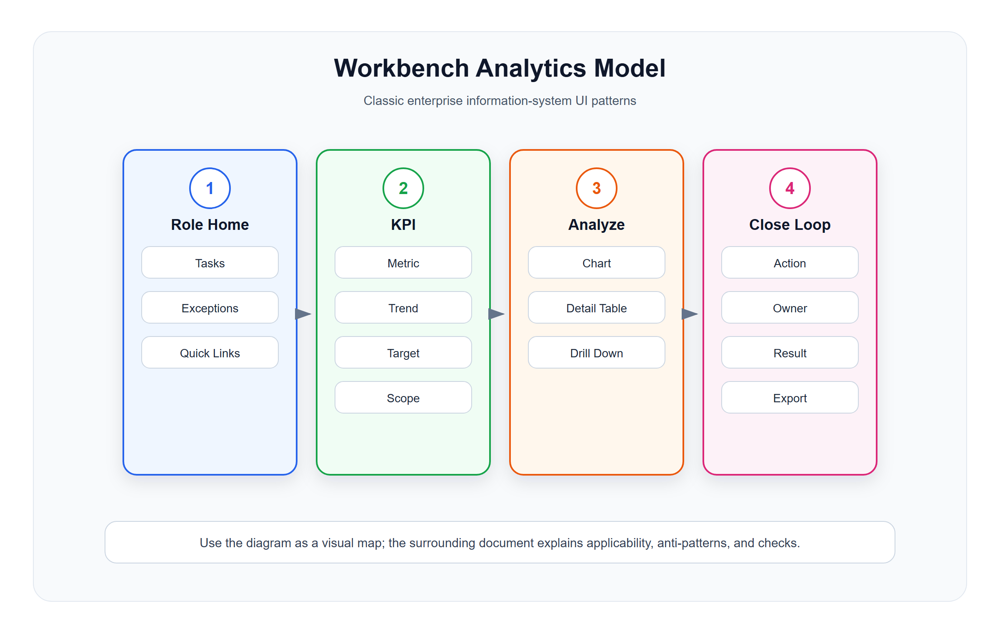

# 工作台、报表与分析模型

<!-- ui-model-diagram:start -->



> 图源文件：[`assets/05-workbench-analytics-model.svg`](assets/05-workbench-analytics-model.svg)

<!-- ui-model-diagram:end -->

工作台和报表首先是决策界面，其次才是可视化界面。表征必须匹配查值、比较、趋势、异常或因果判断任务；指标真实性与不确定性的上位说明见 [`13-界面模型深层逻辑与模式体系.md`](13-界面模型深层逻辑与模式体系.md)。

## 1. 工作台的本质

工作台不是入口集合，而是某个角色每天开始工作的任务驾驶舱。

它必须帮助用户回答：

- 今天最重要的事情是什么？
- 哪些业务异常需要马上处理？
- 当前指标是否正常？
- 我应该进入哪个明细页处理？
- 处理后结果是否改善？

## 2. Role Dashboard 角色工作台

### 适用场景

- 店长工作台。
- 财务工作台。
- 仓库工作台。
- 运营工作台。
- 客服工作台。
- 老板工作台。

### 标准结构

```text
角色问候 / 当前组织范围
今日关键指标
待办任务
异常提醒
常用入口
趋势和排行
最近操作 / 通知
```

### 设计要求

- 不同角色看到不同任务，不要所有人一套首页。
- 待办和异常优先于普通入口。
- 指标必须能钻取到明细。
- 常用入口基于频率，不基于菜单层级。

### 反模式

- 首页只是菜单快捷入口。
- 图表很多但没有待办。
- 指标不能解释口径。
- 所有角色首页完全一样。

## 3. Overview Page 概览页

### 定义

Overview Page 用卡片聚合多个业务域摘要，每张卡片是一个业务入口。

### 适用场景

- 经营总览。
- 门店总览。
- 会员总览。
- 商品总览。
- 财务总览。

### 卡片类型

| 卡片类型 | 用途 |
|---|---|
| 指标卡 | 展示关键数字、趋势、同比环比 |
| 列表卡 | 展示待办、异常、最近记录 |
| 图表卡 | 展示趋势、分布、排行 |
| 状态卡 | 展示系统、渠道、设备状态 |
| 入口卡 | 进入高频任务 |

### 设计要求

- 每张卡片回答一个问题。
- 卡片必须有点击后的落点。
- 卡片数量要克制，优先展示高价值内容。
- 时间范围和组织范围必须统一或清晰标注。

## 4. KPI Dashboard 指标看板

### 适用场景

- 销售额。
- 订单数。
- 客单价。
- 毛利。
- 库存周转。
- 会员增长。
- 复购率。

### 指标卡标准字段

```text
指标名称
当前值
单位
时间范围
同比 / 环比
目标值 / 阈值
状态判断
口径说明入口
```

关键 KPI 建议建立 **KPI Contract（指标契约）**：

```text
业务目的 / 指标负责人
业务定义 / 分子 / 分母
统计粒度 / 时间窗 / 时区
组织、权限和过滤范围
数据来源 / 最后更新时间 / 质量状态
是否可加、可拆、可对账
回补与修订规则 / 版本
护栏指标 / 可操纵风险 / 复核周期
```

### 设计要求

- 指标必须有口径。
- 指标必须有时间范围。
- 指标要能解释变好还是变差。
- 多指标之间要避免口径冲突。
- 数据延迟、来源不可用或口径修订时，要显式展示数据状态和受影响结论。
- 排名、奖惩或资源分配使用的 KPI 要配护栏指标和分布，定期检查是否出现“赢得指标但没有改善业务”的 Goodhart / Campbell 风险。

### 反模式

- 只显示大数字，没有变化和目标。
- 同一指标在不同页面口径不一致。
- 看板数据和报表数据对不上。

### 中文设计案例

#### 案例：连锁零售门店店长经营看板

**HTML 效果示例**：[查看设计案例](cases/05-工作台报表与分析模型/05-1-store-manager-dashboard.html)

**设计要点**：
1. 指标卡片显示数值 + 趋势 + 目标完成度
2. 待办事项优先级高于图表
3. 每个指标都可钻取到明细
4. 口径统一：数据时间范围明确标注

案例重点应是指标契约、异常优先和钻取链路；底部若出现与店长决策无关的通用订单操作，应从正式案例中移除，避免把看板退化为拼装首页。

## 5. Analytical List Page 分析列表模型

### 定义

分析列表把图表、筛选和明细表放在同一页面，支持从指标分析直接下钻到业务明细。

### 适用场景

- 销售分析。
- 商品分析。
- 会员分析。
- 库存分析。
- 财务流水分析。

### 标准结构

```text
筛选条件
指标摘要
图表分析
明细表格
钻取和导出
```

### 设计要求

- 图表和明细使用同一筛选条件。
- 点击图表某一部分能过滤明细。
- 明细数据能解释指标来源。
- 导出要明确导出汇总还是明细。

### 反模式

- 图表和明细查询口径不一致。
- 图表只能看，不能钻取。
- 明细字段不足以解释指标。

## 6. Drill-down Report 钻取报表模型

### 定义

钻取报表从汇总指标逐层进入维度明细，直到可解释的业务对象。

### 常见路径

```text
销售额
  -> 门店销售额
    -> 收银员销售额
      -> 订单明细
        -> 订单详情
```

```text
库存差异
  -> 仓库
    -> 商品
      -> 批次
        -> 出入库流水
```

### 设计要求

- 每层都显示当前维度和筛选条件。
- 支持返回上一级并保留上下文。
- 汇总值和下级合计要能对账。
- 最后一层必须落到业务明细或流水。

钻取只能直接回答“数字由什么构成”。同期变化、分群差异和 AI 摘要不自动构成因果解释；界面应区分构成、相关、干预和反事实证据，证据不足时使用“相关”或“待验证假设”，不要写成“原因”或“贡献了”。

## 7. Exception Center 异常中心

### 定义

异常中心集中展示系统中需要处理的错误、风险、超时和冲突。

### 适用场景

- 支付回调失败。
- 库存扣减失败。
- 订单超时未处理。
- 同步失败。
- 发票开具失败。
- 数据对账差异。

### 标准结构

```text
异常分类
严重程度
影响对象
发生时间
原因摘要
处理建议
处理动作
处理结果
```

### 设计要求

- 异常要有等级。
- 异常要绑定业务对象。
- 异常要有处理动作，不只是日志。
- 处理过程要留痕。
- 重复异常要合并或聚合。

### 反模式

- 异常只在日志里，业务人员看不到。
- 页面只显示错误码，不说明影响。
- 处理后没有状态变化和记录。

## 8. Comparison View 对比模型

### 适用场景

- 门店对比。
- 商品对比。
- 员工绩效对比。
- 活动效果对比。
- 供应商对比。

### 设计要求

- 对比对象数量要有限。
- 对比维度要稳定。
- 高低差异要突出。
- 支持切换时间范围和指标。
- 不同量纲不要直接混在一个图里。

## 9. 预测、场景与不确定性

预测、预算、风险评分和 AI 建议不是已发生事实。根据真实可用证据展示：

| 内容 | 界面要求 |
|---|---|
| 点估计 | 明确单位、预测时点和适用对象 |
| 区间/情景范围 | 展示合理范围，不用虚假小数精度制造确定感 |
| 数据覆盖 | 训练/计算所用时间范围、缺失和延迟 |
| 模型与口径版本 | 便于复现、比较和审计 |
| 主要假设 | 说明结论成立的前提 |
| 敏感性 | 展示哪些输入变化会让结论翻转 |

适合使用 Scenario Compare、Sensitivity Analysis 或 Evidence Card；如果只有一个无法解释的分数，不应让它直接替代人的高影响决策。

## 10. 工作台和报表检查清单

- 当前页面是给哪个角色使用？
- 首页优先展示待办、异常还是指标？
- 指标是否有口径、时间范围和组织范围？
- 图表是否能钻取到明细？
- 明细是否能解释指标来源？
- 异常是否绑定业务对象和处理动作？
- 报表汇总和下级合计是否可对账？
- 导出是否区分汇总和明细？
- 用户看完页面后是否知道下一步做什么？
- 每个关键 KPI 是否有负责人、口径、来源、更新时间、版本、护栏和修订规则？
- 页面是在表达构成、相关还是因果；文案强度是否与证据匹配？
- 预测是否展示范围、数据覆盖、假设、模型版本和结论翻转条件？
- 指标用于考核后，是否检查操纵、副作用和长期价值被牺牲的风险？
- 数据延迟或依赖故障时，是否显式进入降级状态并说明还能做什么？

> 案例说明：本地 Dashboard HTML 是静态结构示例，用于检查异常优先级、指标口径提示和钻取出口。正式实现仍需接入真实口径、数据时效、钻取联动、权限和辅助技术验证。
