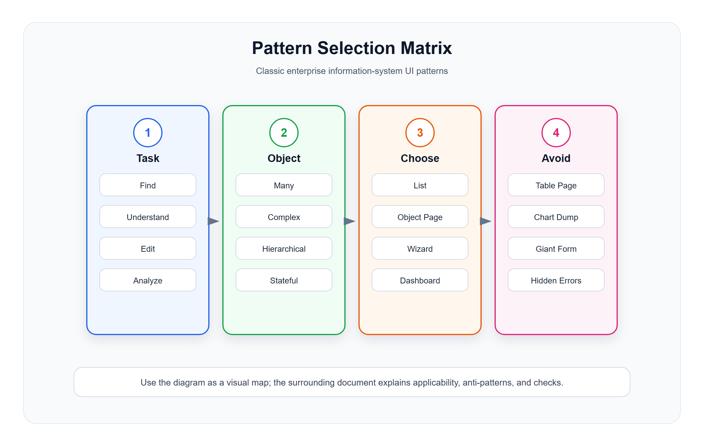

# UI 模式选择矩阵与反模式

<!-- ui-model-diagram:start -->



> 图源文件：[`assets/06-pattern-selection-matrix.svg`](assets/06-pattern-selection-matrix.svg)

<!-- ui-model-diagram:end -->

模式选择不是“页面类型查表”，而是在任务、对象、表征、风险、可逆性和环境约束之间做取舍。以下矩阵用于缩小候选范围，不替代用户研究和任务验证；理论依据见 [`13-界面模型深层逻辑与模式体系.md`](13-界面模型深层逻辑与模式体系.md)。

## 1. 按用户任务选择

| 用户任务 | 推荐模型 | 不推荐 |
|---|---|---|
| 查找一个对象 | List Report、Search、Data Grid | Dashboard |
| 连续处理待办 | Worklist、Master-Detail | 普通全量列表 |
| 理解一个对象 | Object Page、Record Page | 弹窗展示全部字段 |
| 编辑少量字段 | Drawer Form、Inline Edit | 跳转复杂编辑页 |
| 创建复杂配置 | Wizard、Steps Form | 单页巨型表单 |
| 查看经营状态 | Dashboard、Overview Page | 明细表格首页 |
| 分析指标来源 | Analytical List Page、Drill-down Report | 静态图表 |
| 处理异常 | Exception Center、Worklist | 日志页面 |
| 管理层级数据 | Tree、Tree Grid | 平铺列表 |
| 管理阶段流转 | Kanban、Path、Timeline | 普通状态下拉 |

## 2. 按业务对象特征选择

| 对象特征 | 推荐模型 | 例子 |
|---|---|---|
| 数量多、筛选多 | List Report | 订单、会员 |
| 状态复杂 | Object Page + Timeline | 订单、售后 |
| 层级结构 | Tree Grid | 组织、类目 |
| 多关联对象 | Object Page + Related Lists | 客户、商品 |
| 强流程 | Wizard / Approval Flow | 开店、审批 |
| 高风险配置 | Sectioned Form + Preview + Audit | 支付配置、积分规则 |
| 高频批量处理 | Data Grid + Bulk Operation | 商品上架、库存调整 |
| 指标驱动 | Dashboard + Drill-down | 销售分析 |

## 3. 按复杂性、风险和交互约束选择

字段数量只能提示“需要重新检查”，不能单独决定容器。优先看任务是否可一次理解、依赖是否跨阶段、后果是否可逆、是否需要同时比较，以及上下文能否安全中断。

| 约束 | 推荐承载方式 | 边界 |
|---|---|---|
| 单一、短时、低风险且可逆 | Modal Form / Simple Form | 需要查证大量上下文或填写时间长时不要用 Modal |
| 需保留列表上下文的轻任务 | Drawer Form | 抽屉内再套复杂流程或多层抽屉时改独立页 |
| 信息多但可一次理解、分区独立 | Sectioned Form | 分区之间有强顺序承诺时改 Wizard |
| 多步骤且有顺序依赖、阶段校验或不同责任人 | Wizard | 仅因字段多不要拆步 |
| 多对象关联且需保留上下文 | Master-Detail / Flexible Column Layout | 窄屏或每层详情很复杂时跳独立页 |
| 精确查值、比较和批量维护 | Data Grid | 趋势判断、空间关系或方案权衡需要其他表征 |
| 指标和明细联动 | Analytical List Page | 不能对账或不能下钻时不应声称可解释 |
| 高风险且难以撤销 | Preview + Maker-Checker + Audit / Compensation | 确认弹窗不能替代硬约束和恢复机制 |
| 依赖故障时仍要继续关键任务 | Degraded Mode + Recovery Point + Control Handoff | 不得把旧数据和受限能力伪装为正常 |

## 4. ERP 常见反模式

这些问题可归为任务失配、表征失配、状态失配、风险失配、反馈失配、时间/版本失配和协作责任失配；修正时应先找到失配类型，而不是只换组件。

### 4.1 一张表一个页面

问题：

- 页面字段按数据库结构排列。
- 用户任务不清。
- 关联数据割裂。
- 业务状态难解释。

修正：

- 先识别业务对象和用户任务。
- 列表用于发现对象。
- 详情用于解释对象。
- 表单用于创建或修改业务事实。

### 4.2 首页堆图表

问题：

- 图表很多但没有行动入口。
- 指标没有口径。
- 用户不知道异常在哪里。

修正：

- 按角色设计工作台。
- 待办和异常优先。
- 指标必须能钻取。

### 4.3 表格按钮过多

问题：

- 每行按钮过多，扫描困难。
- 操作优先级不清。
- 高风险动作太容易误点。

修正：

- 高频动作外露。
- 低频动作放更多菜单。
- 危险动作二次确认。
- 不可用动作说明原因。

### 4.4 巨型表单

问题：

- 字段多、分组弱、校验晚。
- 用户不知道哪些字段影响业务。
- 隐藏字段仍校验。

修正：

- 分区表单。
- 互斥字段动态处理。
- 长流程用向导。
- 支持草稿和预览。

### 4.5 详情页没有历史

问题：

- 只看到当前状态，不知道状态如何形成。
- 出问题时无法追责。

修正：

- 增加 Timeline。
- 记录前后状态、操作人、时间、原因。
- 系统事件和人工事件分开。

### 4.6 报表不能钻取

问题：

- 只能看到指标，无法解释指标。
- 业务方无法对账。

修正：

- 汇总 -> 维度 -> 明细 -> 业务对象。
- 每层保留筛选上下文。
- 明细合计能回到汇总。

### 4.7 异常只在日志

问题：

- 技术知道失败，业务不知道处理。
- 异常无法闭环。

修正：

- 建异常中心。
- 异常绑定业务对象。
- 提供处理动作和处理记录。

## 5. 页面设计决策卡

设计页面前填写：

```text
页面名称：
用户角色：
核心任务：
核心业务对象：
对象状态：
高频操作：
低频操作：
风险操作：
关联对象：
需要解释的历史：
推荐 UI 模型：
不用某模型的原因：
验证方式：
```

示例：

```text
页面名称：订单详情
用户角色：店长、客服、财务
核心任务：确认订单状态、处理发货或退款、追踪支付和优惠
核心业务对象：订单
对象状态：订单状态、支付状态、履约状态、售后状态
高频操作：发货、打印、退款、备注
低频操作：复制订单号、导出、查看原始报文
风险操作：取消、退款、强制完成
关联对象：会员、支付单、优惠券、库存流水、售后单
需要解释的历史：状态流转、支付回调、人工操作
推荐 UI 模型：Object Page + Timeline + Related Lists
不用某模型的原因：不使用 Modal，因为信息量大且操作风险高
验证方式：用户能在 30 秒内判断订单是否可发货，并能追踪支付来源
```

“30 秒”是待用目标用户和真实数据校准的可用性假设，不是通用行业阈值。验证还应记录任务成功率、误操作、状态解释正确率和恢复能力。

## 6. 设计质量检查清单

### 6.1 信息结构

- 页面是否围绕一个核心任务？
- 是否有清晰主对象？
- 信息顺序是否符合用户判断顺序？
- 状态、金额、数量、时间是否解释清楚？

### 6.2 操作设计

- 主操作是否突出？
- 次操作是否收敛？
- 危险操作是否确认？
- 不可用操作是否解释原因？
- 操作后是否反馈结果？

### 6.3 数据和状态

- 当前数据范围是否清楚？
- 筛选条件是否可见？
- 指标口径是否明确？
- 历史变化是否可追踪？
- 异常是否可处理？

### 6.4 工程和可测试性

- 页面模型是否能映射到稳定接口？
- 关键状态是否有测试用例？
- 表单校验是否前后端一致？
- 列表筛选是否可自动化测试？
- 高风险操作是否有审计记录？

## 7. 最小可行选择规则

当不确定用哪个模型时，按以下保守规则：

1. 对象很多，先用 List Report。
2. 对象复杂，补 Object Page。
3. 需要连续处理，改 Worklist 或 Master-Detail。
4. 配置复杂，改 Wizard。
5. 指标需要解释，做 Drill-down。
6. 异常需要闭环，做 Exception Center。
7. 不要为了视觉丰富把表格改成卡片。

### 7.1 多轴决策树

```text
1. 用户的首要任务是什么？
   查值/比较 -> 表格或列表
   趋势/异常 -> 图表 + 明细
   理解对象 -> Object Page
   连续处理 -> Worklist / Master-Detail

2. 用户是否需要同时看多个证据做比较？
   是 -> 保持关键证据同屏，避免把它们逐层折叠

3. 动作的风险和可逆性如何？
   低风险可逆 -> 即时反馈 / Undo
   高风险可补偿 -> 影响预览 + 补偿路径
   高风险不可逆 -> 硬约束 + 职责分离 + 审计

4. 是否有顺序依赖或阶段承诺？
   是 -> Wizard / Workflow；否则优先单页完成

5. 数据、权限或依赖是否可能不新鲜？
   是 -> 来源、时间、版本、质量和 Degraded Mode

6. 失败后从哪里继续？
   明确 Recovery Point、草稿、重试边界和控制者
```

## 8. 中文设计案例汇总

本章节汇总了前6个章节的设计案例，点击可直接查看完整效果：

| 案例 | 模型类型 | 链接 |
|---|---|---|
| 案例1：零售订单列表页 | List Report | [查看](cases/06-模式选择矩阵与反模式/06-1-list-report.html) |
| 案例2：零售订单详情页 | Object Page | [查看](cases/03-对象详情与主从模型/03-1-order-detail-related-lists.html) |
| 案例3：零售门店工作台 | Dashboard | [查看](cases/05-工作台报表与分析模型/05-1-store-manager-dashboard.html) |
| 案例4：零售商品资料编辑 | Sectioned Form | [查看](cases/04-表单配置与流程模型/04-2-sectioned-form-product.html) |
| 案例5：零售门店开通向导 | Wizard | [查看](cases/06-模式选择矩阵与反模式/06-2-store-setup-wizard.html) |
| 案例6：零售商品批量导入 | Import Flow / Wizard | [查看](cases/02-列表表格筛选模型/02-5-import-flow.html) |

### 案例1：零售订单列表页（List Report）

**场景**：门店收银员查询和处理今日订单

**HTML 效果示例**：[查看设计案例](cases/06-模式选择矩阵与反模式/06-1-list-report.html)

### 案例2：零售订单详情页（Object Page）

**场景**：客服查看并处理订单问题

**关键设计要素**：
1. **对象头部**：订单号 + 状态徽章 + 金额 + 主操作
2. **状态解释**：为什么待发货？因为已支付且库存已锁定
3. **关联列表**：会员、支付单、优惠券
4. **时间线**：展示状态流转全过程
5. **操作日志**：记录人工操作和备注

### 案例3：零售门店工作台（Dashboard）

**场景**：店长每天早上查看门店经营状态

**关键设计要素**：
1. **核心指标**：销售额、订单数、客单价、完成率
2. **待办优先**：待发货、库存预警、退款申请
3. **可钻取**：每个指标点击可跳转明细
4. **门店对比**：横向对比各门店销售数据

### 案例4：零售商品资料编辑（Sectioned Form）

**场景**：运营人员维护商品完整资料

**分区结构**：
1. 基础信息（名称、编码、类目、品牌）
2. 价格库存（零售价、会员价、库存）
3. 渠道管理（销售渠道、上下架）
4. 扩展信息（标签、图片、备注）

### 案例5：零售门店开通（Wizard）

**场景**：新加盟门店完成系统初始化

**步骤结构**：
1. 基础信息（名称、编码、区域）
2. 业务配置（类目、功能、权限）
3. 硬件配置（收银设备、打印机）
4. 预览确认（展示全部配置 + 风险提示）

### 案例6：零售商品批量导入

**场景**：运营人员批量导入新商品

**流程设计**：
1. 下载模板（说明必填项和格式）
2. 上传文件（预校验）
3. 错误修正（展示错误行和原因）
4. 导入完成（成功、跳过、执行失败统计）

**HTML 效果示例**：[查看批量导入案例](cases/02-列表表格筛选模型/02-5-import-flow.html)

案例结果必须使用互斥口径：`成功 + 跳过（未执行）+ 执行失败 = 本次尝试总数`，避免同一条预校验失败同时计入“跳过”和“失败”。

> 案例说明：本章链接的 HTML 会在页头分别标注静态或交互示例，用于验证模式辨识、信息结构和局部状态变化；它们不接真实后端，不能据此宣称具备完整业务、权限或生产可访问性。
