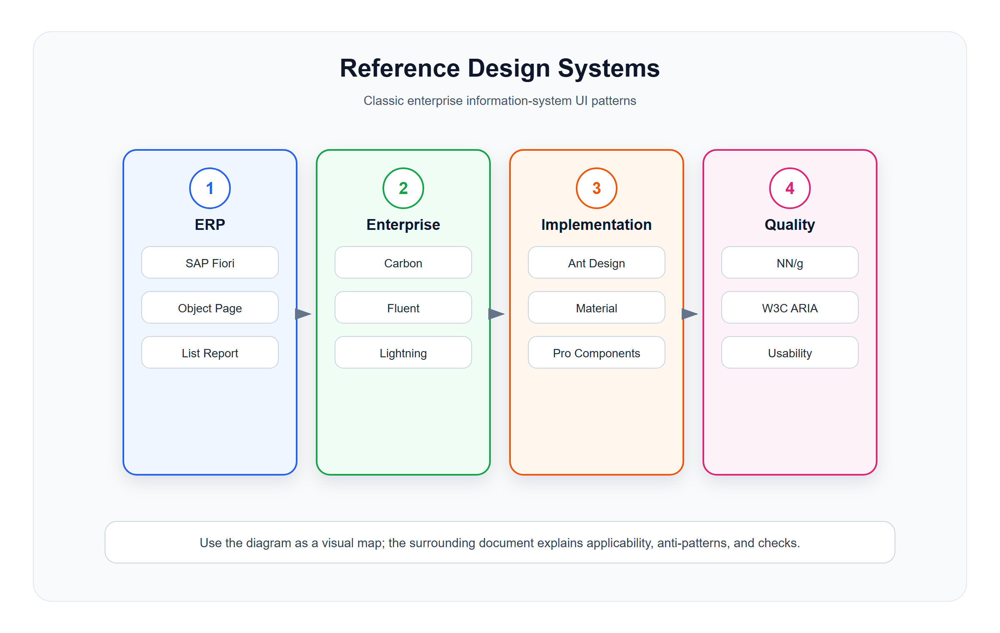

# 权威体系参考索引

<!-- ui-model-diagram:start -->

> 图源文件：[`assets/07-authority-reference-map.svg`](assets/07-authority-reference-map.svg)

<!-- ui-model-diagram:end -->

> **理论定位**：本篇只说明外部资料的证据层级与选用规则；认知、控制、治理和时序等理论推导统一以[界面模型深层逻辑与模式体系](13-界面模型深层逻辑与模式体系.md)为基线。

本索引用于回答“某类问题应优先查哪套一手资料”，不是设计系统排行榜。所谓“权威”，是指资料由标准组织、原厂设计团队或长期研究机构持续维护；它仍然不能替代本系统的业务约束、用户研究和可用性验证。

使用时保留三层证据：

1. **规范原文**：组件、模式、可访问性或研究结论的原始页面与版本。
2. **业务映射**：为什么该模式适合当前任务、对象、风险和终端。
3. **本地验证**：真实数据、权限、异常状态、键盘和响应式测试结果。

## 1. SAP Fiori

SAP Fiori 是企业级 ERP UI 模式最值得优先学习的体系之一，尤其适合订单、库存、财务、审批、报表、主数据等复杂业务。

重点学习：

- List Report。
- Object Page。
- Worklist。
- Overview Page。
- Wizard。
- Dynamic Page。
- Flexible Column Layout。
- Analytical List Page。

适合借鉴：

- 业务对象页如何组织头部、分区和关联列表。
- 列表页如何和详情页衔接。
- 宽屏后台如何用多栏布局减少跳转。
- ERP 复杂流程如何做分步配置和确认。

参考入口：

- https://experience.sap.com/fiori-design-web/

## 2. Microsoft Fluent

Microsoft Fluent 适合学习生产力工具和复杂后台中的命令、导航、面板、表格和对话框模式。

重点学习：

- Navigation。
- Command Bar。
- Data Grid。
- Dialog。
- Drawer / Panel。
- Toolbar。
- Selection。

适合借鉴：

- 操作区如何组织主操作和次操作。
- 复杂工具型页面如何保持命令一致。
- 多任务界面如何处理导航和上下文。

参考入口：

- https://fluent2.microsoft.design/

## 3. IBM Carbon

IBM Carbon 适合学习数据密集型企业系统，尤其是表格、筛选、表单、空状态、错误状态和可访问性。

重点学习：

- Data table。
- Filtering。
- Forms。
- Modals。
- Notifications。
- Empty states。
- Progress indicators。

适合借鉴：

- 高密度数据表如何设计。
- 错误、提示、通知如何分层。
- 表单和校验如何组织。

参考入口：

- https://carbondesignsystem.com/

## 4. Google Material Design

Material Design 适合学习通用组件规则、移动端适配、导航、弹窗、表单和状态反馈。

重点学习：

- Navigation drawer。
- Data tables。
- Dialogs。
- Cards。
- Tabs。
- Text fields。
- Progress indicators。

适合借鉴：

- 移动端和响应式页面。
- 组件状态和反馈规则。
- 通用交互一致性。

参考入口：

- https://m3.material.io/

## 5. Salesforce Lightning Design System

Salesforce Lightning 适合学习 CRM 类对象页面、客户资料页、销售流程和活动时间线。

重点学习：

- Record Page。
- Related Lists。
- Activity Timeline。
- Path。
- Data Tables。
- Page Header。
- Global Actions。

适合借鉴：

- 客户、商机、合同等对象如何组织详情。
- 对象关联列表和活动历史如何放置。
- 销售流程阶段如何可视化。

参考入口：

- https://www.lightningdesignsystem.com/

## 6. Ant Design / Ant Design Pro

Ant Design 和 Ant Design Pro 对国内中后台工程落地非常实用，尤其适合 React 技术栈。

重点学习：

- ProTable。
- Query Filter。
- ProForm。
- StepsForm。
- DrawerForm。
- ModalForm。
- PageContainer。
- Dashboard。

适合借鉴：

- 查询表格的工程化实现。
- 表单、抽屉、弹窗的后台常用组合。
- 权限、菜单、布局和 CRUD 的快速落地。

参考入口：

- https://ant.design/
- https://procomponents.ant.design/

## 7. Nielsen Norman Group

Nielsen Norman Group 不是组件库，而是可用性和企业 UX 原则的重要来源。

重点学习：

- Visibility of system status。
- Match between system and real world。
- User control and freedom。
- Consistency and standards。
- Error prevention。
- Recognition rather than recall。
- Dashboard usability。
- Enterprise UX。

适合借鉴：

- 为什么某些页面难用。
- 如何减少认知负担。
- 如何设计错误预防和反馈。

参考入口：

- https://www.nngroup.com/

## 8. W3C ARIA Authoring Practices Guide

W3C ARIA APG 是可访问性和键盘交互的重要标准。企业后台系统如果有表格、树、弹窗、菜单和复杂控件，必须参考。

重点学习：

- Grid。
- Treegrid。
- Dialog。
- Tabs。
- Combobox。
- Menu button。
- Toolbar。
- Accordion。

适合借鉴：

- 键盘如何操作复杂表格。
- 弹窗焦点如何管理。
- Tree 和 Treegrid 如何表达层级。
- 自动化测试如何依赖稳定语义。

参考入口：

- https://www.w3.org/WAI/ARIA/apg/

## 9. W3C Web Content Accessibility Guidelines

WCAG 是可访问性结果要求，不是组件外观规范。ARIA APG 主要回答复杂控件应如何表达角色、状态和键盘行为，WCAG 则用于判断最终页面是否达到可感知、可操作、可理解和稳健的要求。

重点学习：

- 键盘可操作与焦点可见。
- 文本与非文本内容替代。
- 颜色对比和非颜色信息通道。
- 错误识别、说明和修正建议。
- 状态消息与动态内容可感知。
- 认证、超时和重复输入的可用性。

参考入口：

- https://www.w3.org/WAI/standards-guidelines/wcag/

## 10. 体系选择矩阵

| 当前问题 | 优先参考 | 需要同时补充 |
|---|---|---|
| ERP 对象页、列表报表、复杂流程 | SAP Fiori | 本地业务状态、审计和权限模型 |
| 国内 React 中后台快速落地 | Ant Design / Pro Components | 可访问性、业务不变量、异常恢复 |
| 数据密集表格和状态反馈 | IBM Carbon | 服务端数据能力与数据新鲜度 |
| CRM 对象关系和活动历史 | Salesforce Lightning | 本地客户身份、隐私和流程语义 |
| 生产力工具、命令和多任务 | Microsoft Fluent | 权限过滤、上下文保持和误操作防护 |
| 移动端和跨端组件行为 | Material Design | 行业终端、离线和扫码作业约束 |
| 复杂控件语义与键盘行为 | W3C ARIA APG | WCAG 结果验证和真实辅助技术测试 |
| 可用性诊断和认知负担 | Nielsen Norman Group | 任务观察、业务数据和可测指标 |

同一页面可以借鉴多套体系，但每个决策都应能回答：借鉴了什么、为何适用、哪些部分没有照搬、如何验证。

## 11. 学习顺序建议

如果目标是设计 ERP / 信息系统页面，推荐顺序：

1. SAP Fiori：先学企业软件页面模型。
2. Ant Design Pro：学习中后台工程落地。
3. IBM Carbon：补足表格、筛选、状态和可访问性。
4. Salesforce Lightning：学习 CRM 对象页和客户活动模型。
5. Microsoft Fluent：学习命令区、导航和生产力工具模式。
6. W3C ARIA APG 与 WCAG：补齐键盘、语义、结果要求和可测试性。
7. Nielsen Norman Group：用可用性原则反查设计质量。

## 12. 引用与落地规则

- 不要直接照搬某个设计系统的视觉风格。
- 先借鉴页面模型和交互逻辑，再适配本系统业务对象。
- ERP 系统优先关注信息密度、状态解释、错误恢复和可追溯性。
- 卡片、动效、插画不是企业系统 UI 的核心。
- 最终判断标准是用户能否更快、更少出错地完成业务任务。
- 记录查阅日期或版本；设计系统升级后，旧截图和旧组件名称不能继续当作当前规范。
- 区分“遵循官方模式”“受其启发”和“仅做概念映射”，不要把本地示例表述为厂商官方实践。
- 组件存在不代表场景适用；仍需验证数据量、角色、终端、异常路径和可访问性。
- 厂商示例可以作为设计证据之一，不能作为业务规则、权限规则或合规结论的来源。

## 13. 中文设计案例

以下案例用于演示“从权威体系提取结构原则，再映射到零售业务”的方法，并非厂商官方页面复刻或合规认证。案例应同时标注借鉴点、本地化改动和未覆盖能力。

### 案例1：零售订单页设计 - SAP Fiori Object Page 概念映射

**场景**：团队参考 SAP Fiori 设计门店订单管理模块

**设计分析**：根据 SAP Fiori 的 Object Page 模型，设计零售订单详情页，包含对象头部、面包屑导航、分区结构、行项目和关联对象。

[查看设计案例](cases/07-权威体系参考索引/07-1-sap-fiori-order-detail.html)

### 案例2：零售订单列表 - Ant Design Pro 查询表格概念映射

**场景**：借鉴 Ant Design Pro 的查询表格组合实现订单查询列表

[查看设计案例](cases/07-权威体系参考索引/07-2-ant-design-order-list.html)

### 案例3：零售审批流 - Salesforce Path 阶段引导概念映射

**场景**：借鉴 Salesforce Path 的阶段引导设计门店开通审批流程

[查看设计案例](cases/07-权威体系参考索引/07-3-salesforce-path-approval.html)

**设计要点**：
1. SAP Fiori 模型强调对象头部、分区结构、关联对象和稳定的对象语义。
2. Ant Design Pro 提供查询表格的工程化组合，但数据状态、权限和可访问性仍需自行设计。
3. Salesforce Path 强调阶段可视化与阶段指引，不等同于完整审批引擎。
4. 选择设计系统时要学习其页面模型和交互逻辑，而非复制视觉风格。
5. 最终适配需结合业务对象、用户任务、风险和终端条件，并用真实场景验证。
