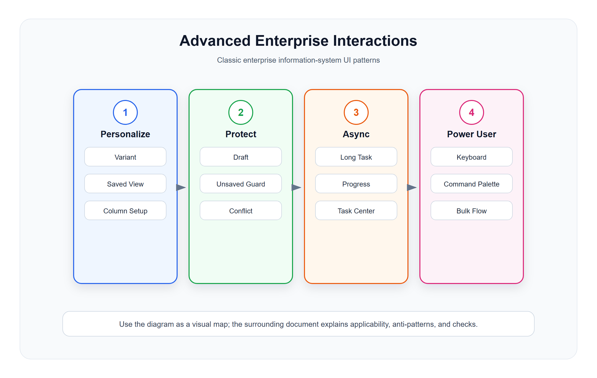

# 高级企业交互模型

<!-- ui-model-diagram:start -->



> 图源文件：[`assets/08-advanced-enterprise-interactions.svg`](assets/08-advanced-enterprise-interactions.svg)

<!-- ui-model-diagram:end -->

> **理论定位**：本篇只给出高级交互的落地规则；韧性、控制权交接、队列与一致性等理论推导统一以[界面模型深层逻辑与模式体系](13-界面模型深层逻辑与模式体系.md)为基线。

## 1. Variant Management 视图变体模型

### 定义

视图变体用于保存用户对列表、报表或工作台的筛选、排序、列设置、分组和展示密度。

### 适用场景

- 订单列表保存“今日待发货”“异常订单”“大额订单”。
- 报表保存“本月门店销售”“昨日渠道销售”。
- 库存列表保存“低库存”“滞销商品”“负库存”。

### 设计要求

- 区分系统默认视图、个人视图、共享视图。
- 视图名称要可编辑。
- 当前生效视图要明显。
- 视图保存范围必须明确：筛选、列、排序、分组是否都保存。
- 公共视图需要权限控制。
- 保存数据口径版本、时区和相对时间语义；“最近 7 天”不能在恢复时悄悄变成另一种范围。
- 共享视图变更要说明所有者、受影响用户和默认视图回退方式。

### 反模式

- 只保存筛选，不保存列和排序，导致用户误解。
- 普通用户可随意改全局默认视图。
- 视图太多没有搜索和整理能力。

## 2. Draft Handling 草稿模型

### 定义

草稿模型用于复杂表单、配置和流程，允许用户暂存未完成内容，并在之后继续编辑。

### 适用场景

- 营销活动创建。
- 门店开通配置。
- 商品资料维护。
- 合同录入。
- 导入任务配置。

### 设计要求

- 明确显示草稿状态。
- 自动保存和手动保存要区分。
- 用户离开页面前提示未保存内容。
- 草稿恢复时说明保存时间和保存人。
- 提交前要重新校验最新业务规则。
- 显示最近一次保存成功的恢复点；自动保存失败时保留本地内容并显著提示。
- 草稿恢复前比较正式版本，发现基线已变化时进入冲突处理，而不是直接覆盖。

### 反模式

- 自动保存失败但用户不知道。
- 草稿和正式数据混在一起无法区分。
- 草稿恢复覆盖别人已修改的正式数据。

## 3. Unsaved Changes Guard 未保存保护模型

### 定义

当用户修改内容但未保存时，系统阻止误离开或提供明确选择。

### 适用场景

- 编辑表单。
- 配置页。
- 流程设计器。
- 报表设计器。
- 批量编辑。

### 标准提示

```text
你有未保存的修改。
离开后这些修改会丢失。

继续编辑 / 放弃修改 / 保存并离开
```

### 设计要求

- 只在确实有变更时提示。
- 保存并离开要处理保存失败。
- 多标签页编辑同一对象时要有冲突提示。
- 显示哪些分区或字段尚未保存，避免只有笼统警告。
- 浏览器崩溃、断网或会话超时后，应从最近恢复点继续并说明可能丢失的范围。

## 4. Optimistic Update 乐观更新模型

### 定义

用户操作后页面先展示成功状态，再在后台确认结果。失败时回滚并提示。

### 适用场景

- 开关启停。
- 收藏、标记。
- 轻量状态修改。
- 列表排序。

### 设计要求

- 只用于失败成本低、可回滚的动作。
- 失败时恢复原状态。
- 高风险业务动作不要乐观更新，例如退款、结算、库存扣减。
- 页面必须区分“本地待确认”和“服务端已确认”，避免把动画完成当成业务成功。
- 重试要携带幂等标识；超时但结果未知时进入查询/核验状态，不直接再次执行。

## 5. Long-running Task 长任务模型

### 定义

长任务模型用于导入、导出、批处理、报表生成、数据同步等无法即时完成的操作。

### 标准结构

```text
任务名称
任务参数
发起人
开始时间
进度
当前状态
成功数量
失败数量
结果文件
错误明细
```

### 设计要求

- 前台发起后进入任务中心。
- 支持刷新、取消、重试。
- 失败要提供错误明细。
- 完成后通知用户。
- 大任务不要阻塞页面。
- 将总状态拆为成功、失败、跳过、待处理和结果未知，说明统计口径。
- 取消要区分“停止后续处理”和“撤销已完成结果”；不能承诺无法实现的回滚。
- 重试默认只处理可安全重试的失败项，并保留原任务、重试任务和幂等键关系。
- 显示最后心跳、数据时间和依赖状态，避免任务卡住时仍展示假进度。

## 6. Conflict Resolution 冲突解决模型

### 定义

当多人或多个系统同时修改同一对象时，界面帮助用户理解冲突并选择处理方式。

### 适用场景

- 商品资料多人编辑。
- 配置被后台任务更新。
- 审批状态已被他人处理。
- 导入数据覆盖现有数据。

### 设计要求

- 展示本地修改、远端最新值、冲突字段。
- 提供重新加载、覆盖、合并、放弃。
- 高风险字段禁止静默覆盖。
- 同时展示共同基线、本地版本和远端版本，字段级差异要带修改人、修改时间和来源。
- 自动合并只用于能够证明互不冲突的字段；金额、权限、状态等关键字段必须重新确认。
- 解决冲突后生成新修订并保留 Revision Diff，不能改写既有历史。

## 7. Keyboard-first Power User 模型

### 定义

面向高频操作人员，支持键盘快捷键、快速搜索、连续处理和批量动作。

### 适用场景

- 客服工单。
- 财务审核。
- 仓库拣货复核。
- POS 后台录单。
- 数据录入。

### 设计要求

- 支持全局搜索或命令面板。
- 支持表格键盘导航。
- 支持 Enter 提交、Esc 取消。
- 快捷键不能破坏浏览器和输入法习惯。
- 关键动作仍需确认。

## 8. Command Palette 命令面板模型

### 定义

命令面板让熟练用户通过搜索快速打开页面、执行动作或切换对象。

### 适用场景

- 大型 SaaS 后台。
- ERP 多模块系统。
- 开发者平台。
- 客服和运营工具。

### 设计要求

- 支持页面搜索、对象搜索、动作搜索。
- 搜索结果按权限过滤。
- 高风险动作只跳转到确认页，不直接执行。
- 记录最近使用命令。

## 9. Degraded Mode 显式降级模型

### 定义

当依赖故障、数据过期、网络中断或容量不足时，页面明确展示当前仍可用和不可用的能力，使用户能够安全继续、转人工或停止。

### 标准结构

```text
降级原因与开始时间
受影响能力和业务范围
数据最后更新时间
当前可执行动作
被禁止或排队的动作
依赖健康状态
恢复条件与通知方式
```

### 设计要求

- 降级状态必须持续可见，不能只显示一次 Toast。
- 旧数据必须标注时间，不能继续伪装为实时数据。
- 只读、排队、人工兜底和安全停止要分别表达。
- 恢复后重新校验排队动作，避免基于旧前提自动执行。

## 10. Control Handoff 控制权交接模型

### 定义

当自动化不能可靠继续或人工必须介入时，界面明确谁在控制、为何接管、从哪个恢复点继续，以及怎样恢复自动化。

### 适用场景

- AI 或规则引擎低置信度。
- POS 离线转人工记账。
- 调度、同步或批处理异常。
- 自动审批触发风险护栏。

### 设计要求

- 同一时刻只有一个明确控制者，避免人工和自动化同时写入。
- 接管前展示未决动作、最后确认状态和可能重复的操作。
- 记录接管人、原因、时间、范围和后续复核责任。
- 恢复自动化前重新建立输入、状态和权限条件，不沿用过期判断。

## 11. Interruption Recovery 中断恢复模型

中断恢复不仅是保存草稿，还要降低用户回忆成本。恢复页面至少提供：任务目标、上次完成步骤、未提交修改、待处理异常、下一建议动作、关键上下文变化和最近恢复点。高频审核、客服、仓储、交接班场景应支持“带回执的交接”，由接收方明确接受未决任务。

## 12. 高级交互检查清单

- 是否需要保存用户视图偏好？
- 是否存在长流程，需要草稿？
- 是否可能误离开丢失内容？
- 是否存在后台长任务？
- 是否存在多人编辑冲突？
- 是否有高频熟练用户需要键盘效率？
- 是否需要全局命令面板？
- 依赖故障、数据过期或离线时，是否有显式降级而非伪成功？
- 是否展示最近恢复点、未决动作和上下文变化？
- 自动化与人工之间的控制者、接管和恢复条件是否明确？
- 长任务的部分成功、结果未知、取消和重试语义是否准确？

## 13. 中文设计案例

### 案例1：零售订单保存视图

**场景**：门店店长和客服人员各自保存常用的订单筛选视图

[查看设计案例](cases/08-高级企业交互模型/08-1-view-management.html)

### 案例2：零售商品资料草稿

**场景**：运营人员编辑复杂商品资料，因临时有事需保存草稿稍后继续

[查看设计案例](cases/08-高级企业交互模型/08-2-draft-handling.html)

### 案例3：零售订单批量导入

**场景**：运营人员批量导入会员数据，后台异步处理

**必须覆盖**：成功、失败、跳过、待处理和结果未知；取消影响；失败项安全重试；原任务与重试任务关联。

[查看设计案例](cases/08-高级企业交互模型/08-3-import-task-center.html)

### 案例4：零售门店权限配置

**场景**：管理员为新店员配置收银权限

> 本案例仅用于演示复杂矩阵、影响预览和冲突保护；权限继承、有效权限和职责分离的完整模型见 `09-企业治理与权限配置模型.md`。

[查看设计案例](cases/08-高级企业交互模型/08-4-permission-matrix.html)

**设计要点**：
1. 权限矩阵清晰展示查看、新增、编辑、删除、特殊权限
2. 半选状态和继承关系要说明来源
3. 保存前预览影响范围和涉及人员
4. 权限变更自动进入审计日志
