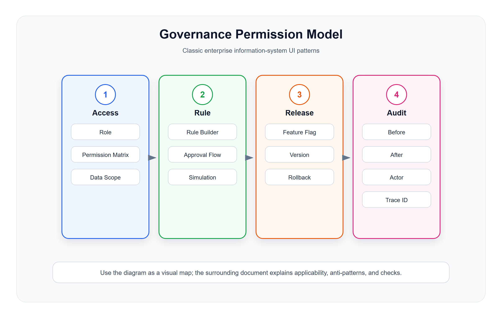

# 企业治理与权限配置模型

<!-- ui-model-diagram:start -->



> 图源文件：[`assets/09-governance-permission-model.svg`](assets/09-governance-permission-model.svg)

<!-- ui-model-diagram:end -->

> **理论定位**：本篇只给出治理与权限页面的落地规则；职责分离、完整性、隐私和双时态审计等理论推导统一以[界面模型深层逻辑与模式体系](13-界面模型深层逻辑与模式体系.md)为基线。

## 1. Permission Matrix 权限矩阵模型

### 定义

权限矩阵用于展示和配置角色、资源、动作之间的授权关系。

### 适用场景

- 菜单权限。
- 按钮权限。
- 数据权限。
- 字段权限。
- API 权限。
- 多角色授权。

### 标准结构

```text
角色 / 用户组
资源树
动作列
  查看
  新增
  编辑
  删除
  导出
  审核
数据范围
字段权限
```

### 设计要求

- 资源必须支持层级。
- 父子权限继承关系要可解释。
- 半选状态要清晰。
- 权限变更要预览影响范围。
- 高风险权限变更要记录审计日志。
- 分开显示直接授权、角色授权、组织继承、临时委派和显式拒绝，不能只给一个勾选结果。
- 预览最终生效权限（Effective Access），包括数据范围、字段范围、条件和到期时间。
- 权限解释只展示操作者有权看到的策略和对象，避免为了说明拒绝原因泄露敏感资源。

### 反模式

- 权限项平铺成几百个复选框。
- 看不到继承来源。
- 用户保存后才发现影响了大量人员。

## 2. Role Designer 角色设计器模型

### 定义

角色设计器用于创建、复制、调整和审计业务角色。

### 适用场景

- 店长。
- 收银员。
- 仓管。
- 财务。
- 运营。
- 总部管理员。

### 设计要求

- 支持从模板角色复制。
- 展示角色下已有用户数量。
- 展示角色权限摘要。
- 支持权限差异对比。
- 禁止直接删除仍被使用的关键角色。
- 展示与其他角色组合后产生的职责冲突，不能只校验单个角色。
- 角色变更要区分“修改定义”和“迁移已有成员”，并预览生效时间和受影响会话。

## 3. Data Scope 数据范围配置模型

### 定义

数据范围配置用于限定用户可以看到哪些组织、门店、仓库、部门、客户或业务范围。

### 常见范围

| 类型 | 示例 |
|---|---|
| 全部数据 | 总部管理员 |
| 本组织及下级 | 区域经理 |
| 本组织 | 门店店长 |
| 本人数据 | 销售员 |
| 自定义范围 | 指定门店、指定仓库 |

### 设计要求

- 数据范围要和功能权限分开表达。
- 自定义范围必须可搜索和批量选择。
- 页面预览应显示实际可见范围。
- 数据范围变更需要审计。
- 范围必须绑定租户/主体边界，禁止用“全部”绕过所属租户。
- 预览应使用代表性对象或计数验证，而不是只回显配置表达式。
- 范围冲突时说明最终合并规则，例如并集、交集、显式拒绝优先或最小权限优先。

## 4. Approval Flow Designer 审批流设计器模型

### 定义

审批流设计器用于配置节点、条件、审批人、抄送人和异常路径。

### 适用场景

- 采购审批。
- 退款审批。
- 调价审批。
- 合同审批。
- 费用报销。

### 标准结构

```text
触发条件
节点列表 / 流程图
节点审批人
条件分支
超时规则
抄送规则
预览测试
发布版本
```

### 设计要求

- 简单流程用步骤配置，不必强制画复杂流程图。
- 条件分支要支持模拟测试。
- 发布前检查是否存在断点、无人审批、死循环。
- 流程修改应版本化，不能影响已发起流程的历史解释。
- 明确禁止申请人自批、同一人兼任不相容节点等职责分离约束。
- 测试覆盖边界值、缺失审批人、超时、撤回、重复回调和组织变更。
- 发布时生成不可变版本；运行实例固定引用其启动版本，除非执行显式迁移。

## 5. Rule Builder 规则配置器模型

### 定义

规则配置器用于让业务人员配置条件和动作。

### 适用场景

- 满减活动。
- 积分规则。
- 会员等级升级。
- 库存预警。
- 自动派单。
- 风控规则。

### 标准结构

```text
规则名称
适用范围
条件
  如果：订单金额 >= 100
  并且：会员等级 = 金卡
动作
  则：赠送积分 100
优先级
生效时间
冲突检测
预览测试
```

### 设计要求

- 条件字段用业务语言，不暴露数据库字段。
- 支持预览命中结果。
- 支持冲突检测。
- 支持生效时间和停用。
- 规则变更要版本化。
- 显示字段依赖、规则依赖、执行顺序和短路逻辑，避免局部规则形成不可见整体行为。
- 模拟需同时给出命中证据、未命中原因、动作结果和受影响样本。
- 发布前验证边界值、缺失值、时区、历史数据和与其他规则的组合冲突。

## 6. Feature Flag 功能开关模型

### 定义

功能开关用于灰度发布、租户差异、门店差异和风险回滚。

### 适用场景

- 新版收银流程。
- 新积分规则。
- 新报表口径。
- 新支付渠道。
- AI 辅助能力。

### 设计要求

- 开关名称、说明、负责人、默认值明确。
- 支持租户、门店、角色、比例灰度。
- 支持立即关闭。
- 展示当前命中范围。
- 记录每次变更。
- 显示优先级和覆盖关系，说明租户、门店、角色、比例规则最终如何决策。
- 支持到期时间、负责人和自动清理提醒，避免长期遗留开关。
- 高风险开关采用 Maker-Checker 或审批门禁，并提供一键安全回退和回退验证。

## 7. Audit Log 审计日志模型

### 定义

审计日志展示关键对象、权限、配置、资金、库存等高风险操作的历史。

### 标准字段

```text
操作时间
操作人
操作对象
操作类型
操作前
操作后
原因
来源 IP / 设备
追踪 ID
```

### 设计要求

- 高风险字段展示前后值。
- 支持按对象、人员、时间、操作类型筛选。
- 审计日志不可被普通编辑删除。
- 适合导出给审计或问题排查。
- 记录业务有效时间与系统记录时间；追溯更正不能覆盖当时所知事实。
- 记录来源系统、代理操作者、AI/自动化参与、请求或幂等标识和结果状态。
- 日志查看本身受最小权限和脱敏控制，导出需记录原因和范围。

## 8. Effective Access 有效权限视图

权限配置回答“规则写了什么”，有效权限视图回答“某人在某时、某范围内实际上能做什么，以及为什么”。标准内容包括：主体、租户、资源、动作、数据和字段范围、允许/拒绝结果、每条来源、优先级、到期时间和策略版本。

有效权限视图应支持从用户反查规则、从规则反查受影响用户，以及在不真正执行敏感动作的情况下进行授权模拟。拒绝解释必须遵循最小披露：说明用户可采取的下一步，但不暴露其无权获知的资源名称、策略细节或其他主体信息。

## 9. Maker-Checker 与职责分离

当资金、权限、敏感主数据或关键配置的错误代价足够高时，采用“制作者提交、复核者批准”的闭环：

```text
草稿 -> 提交复核 -> 复核中 -> 批准 / 驳回 -> 生效 -> 事后审计
```

设计要求：

- 制作者不能批准自己的变更；代理、共享账号和角色组合也要纳入校验。
- 复核页面突出前后差异、影响范围、证据、原因和回滚方式。
- 驳回保留原提案与意见，不通过覆盖历史来“退回”。
- 低风险批量变更可按风险分级抽检，避免对所有动作机械增加审批。

## 10. Time-bound Delegation / Break-glass 临时委派与应急授权

- 临时委派必须限时、限对象、限动作，并显示委派者、接收者和责任归属。
- Break-glass 只用于常规权限无法满足的紧急处置，要求强理由、二次认证、显著标识和事后复核。
- 应急权限到期自动撤销；会话和缓存也必须同步失效。
- 页面持续提示当前处于临时高权限状态，避免用户误把应急能力当作日常权限。

## 11. 治理类页面检查清单

- 权限和数据范围是否分离？
- 继承、覆盖、半选是否解释清楚？
- 高风险变更是否有预览和审计？
- 规则是否可模拟测试？
- 流程和规则是否版本化？
- 功能开关是否可快速回滚？
- 是否能解释最终有效权限及每一条来源？
- 是否检查跨角色、代理和共享账号形成的职责冲突？
- 高风险变更是否采用与风险相称的 Maker-Checker？
- 临时委派和应急授权是否限时、显著、可撤销并事后复核？
- 权限解释、审计查看和导出是否遵守最小披露与脱敏？
- 历史查看是否区分业务有效时间和系统记录时间？

## 12. 中文设计案例

### 案例1：零售门店数据权限配置

**场景**：区域经理配置各门店店长的数据可见范围

[查看设计案例](cases/09-企业治理与权限配置模型/09-1-data-scope-config.html)

**必须覆盖**：租户边界、直接和继承来源、最终有效范围、到期时间、代表性对象验证和最小披露解释。

### 案例2：零售会员积分规则配置

**场景**：运营人员配置会员积分获取规则

[查看设计案例](cases/09-企业治理与权限配置模型/09-2-rule-builder.html)

**必须覆盖**：规则依赖、边界样本、冲突检测、命中证据、版本发布和回滚入口。

### 案例3：零售系统审计日志

**场景**：财务人员查询近期的金额和权限变更记录

[查看设计案例](cases/09-企业治理与权限配置模型/09-3-audit-log.html)

**必须覆盖**：业务有效时间、系统记录时间、前后值、来源系统、代理/自动化参与、追踪标识和导出审计。

**设计要点**：
1. 数据范围配置支持多种类型并提供预览
2. 规则配置支持条件组合、优先级、冲突检测
3. 审计日志记录高风险操作的完整前后值
4. 所有治理配置变更进入审计日志
