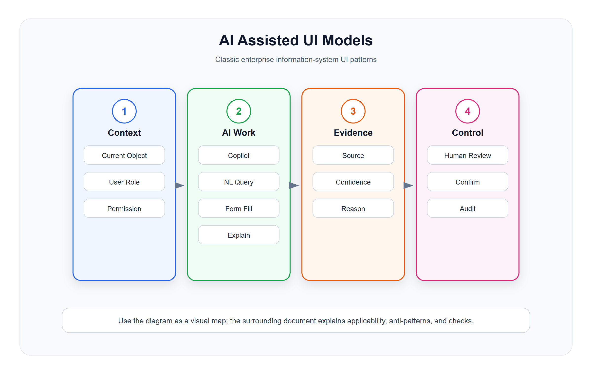

# AI 辅助与智能化界面模型

<!-- ui-model-diagram:start -->



> 图源文件：[`assets/11-ai-assisted-ui-models.svg`](assets/11-ai-assisted-ui-models.svg)

<!-- ui-model-diagram:end -->

> **理论定位**：本篇只给出 AI 辅助界面的证据、信任与人工接管规则；自动化分配、共同态势和因果证据等理论推导统一以[界面模型深层逻辑与模式体系](13-界面模型深层逻辑与模式体系.md)为基线。

AI 界面的核心不是“放一个聊天框”，而是校准用户对自动化能力的信任。界面必须让用户知道：模型使用了什么上下文、证据覆盖到哪里、结论有多不确定、当前由谁控制、失败后如何申诉或接管。AI 输出默认是候选信息，只有经过业务校验和受控动作才成为系统事实。

## 1. AI Copilot 辅助面板模型

### 定义

AI Copilot 是嵌入业务系统的辅助面板，帮助用户查询、总结、生成、解释或推荐操作。

### 适用场景

- 解释订单异常。
- 总结客户历史。
- 生成营销文案。
- 推荐库存补货。
- 查询报表口径。
- 帮助配置规则。

### 标准结构

```text
当前业务上下文
用户问题
AI 回答
证据引用
推荐动作
风险提示
人工确认
```

### 设计要求

- AI 必须知道当前对象上下文。
- 回答要引用数据来源。
- 高风险动作不能自动执行。
- 推荐动作必须由用户确认。
- AI 不确定时要表达不确定，而不是编造。
- 展示上下文范围、数据截止时间、模型/策略版本和未读取的数据类型。
- 引用要能打开到具体证据片段，并区分系统事实、模型推断和用户输入。
- 用户能够纠正上下文、撤销 AI 产生的草稿并反馈错误，不能只能接受或关闭。
- 涉及敏感信息时按当前用户权限最小检索和最小展示，不把无权信息泄露进回答或日志。

## 2. Explainable Recommendation 可解释推荐模型

### 定义

系统给出推荐时，同时解释推荐依据、影响范围和可选替代方案。

### 适用场景

- 推荐补货数量。
- 推荐会员营销人群。
- 推荐商品调价。
- 推荐异常处理方式。
- 推荐审批路径。

### 标准结构

```text
推荐结论
推荐理由
使用的数据
影响范围
风险
替代方案
确认 / 调整 / 忽略
```

### 设计要求

- 推荐不能只给结论。
- 用户可以修改推荐参数。
- 推荐采纳结果要记录，便于后续评估。
- 高风险推荐要提供模拟结果。
- 不确定性应与任务相匹配：分类概率、区间、情景范围或“证据不足”，不要统一伪装成精确百分比。
- 显示替代方案、关键假设和对结果最敏感的变量，避免把单一推荐包装成唯一答案。
- 记录采纳、修改、拒绝和最终业务结果，用于校准而不是只统计点击率。

## 3. Natural Language Query 自然语言查询模型

### 定义

用户用自然语言查询业务数据，系统转换为筛选条件、报表或 SQL 风格查询。

### 适用场景

- “查昨天销售额最高的 10 个商品”。
- “找出本周退款异常的订单”。
- “最近 30 天没有消费的金卡会员”。

### 设计要求

- 系统要展示解析后的条件。
- 用户确认后再执行高成本查询。
- 查询结果要能转成普通筛选视图。
- 敏感数据仍受权限控制。
- 展示字段、口径、时间范围、时区、排序、聚合和权限裁剪，允许用户在执行前修正歧义。
- 高成本或大范围查询先估算范围并限制导出，避免自然语言成为绕过查询治理的入口。
- 保存原问题、解析计划、执行版本和结果时间，使查询可复现和审计。

### 反模式

- 直接执行用户看不懂的查询。
- 查询结果没有口径说明。
- AI 绕过权限。

## 4. Assisted Form Filling 智能填表模型

### 定义

AI 根据历史数据、上下文或上传文件预填表单，用户审核后提交。

### 适用场景

- 发票识别。
- 合同信息录入。
- 商品资料补全。
- 客户资料补全。
- 导入错误修正。

### 设计要求

- AI 填写字段要有标记。
- 低置信度字段要突出。
- 用户必须能逐项确认或修改。
- 提交后记录来源。
- 区分“提取自原文”“根据上下文推断”“使用默认值”三类来源。
- 上传材料中的提示性文本不能改变系统指令、权限或审批要求。
- 关键标识、金额、日期和主体字段需要格式校验及跨字段一致性检查。

## 5. Anomaly Explanation 异常解释模型

### 定义

系统发现异常后，AI 帮助解释可能原因、证据和建议处理动作。

### 适用场景

- 支付对账差异。
- 库存异常。
- 销售额突降。
- 订单失败。
- 同步失败。

### 标准结构

```text
异常摘要
影响范围
证据
可能原因
建议动作
置信度
人工处理记录
```

### 设计要求

- 区分事实、推断和建议。
- 必须链接到原始数据。
- 建议动作不能覆盖人工判断。
- 处理结果要反哺异常模型。
- 原因按证据强度排序，明确哪些是已确认事实、待验证假设和未排除因素。
- 展示基线、阈值、数据缺口和检测时间，避免把模型告警当成已经确认的根因。
- 用户可以标记误报、补充真正原因、升级处理或发起申诉。

## 6. Human-in-the-loop 人工确认模型

### 定义

AI 参与但不独立完成高风险业务动作，人工负责最终确认。

### 高风险动作

- 退款。
- 调价。
- 改库存。
- 改权限。
- 发券。
- 删除数据。
- 提交审批。

### 设计要求

- AI 只能准备草稿、建议和解释。
- 最终提交按钮由人工触发。
- 提交前展示影响范围。
- 审计日志记录 AI 参与情况。
- 人工确认不是机械点击：复核页必须展示差异、证据、风险、替代方案和可逆性。
- 防止自动化偏见，不能把 AI 建议预选为高风险动作的默认答案。
- 明确人工接管、停止自动执行、回退和恢复自动化的条件。

## 7. Automation Level 自动化等级模型

不要笼统决定“用 AI 还是人工”，而应分别分配信息获取、分析、方案生成、选择、执行和复核：

| 等级 | AI/自动化职责 | 人保留的控制 | 适用边界 |
|---|---|---|---|
| 建议 | 搜集、总结、生成候选 | 选择并执行 | 证据不完整或判断依赖经验 |
| 草稿 | 填充表单、准备配置或沟通内容 | 逐项复核后提交 | 可编辑、可逆的低中风险任务 |
| 批准后执行 | 生成动作计划并等待批准 | 核对影响范围并批准 | 规则稳定、执行可审计 |
| 护栏内自动 | 在明确范围自动执行，异常转人工 | 设置护栏、抽检和接管 | 高频、可监测、可停止的任务 |
| 自动执行后复核 | 先执行再进入复核队列 | 纠错、申诉和策略调整 | 延迟代价高且错误可补偿 |

界面持续显示当前等级、控制者、护栏、最近一次接管和恢复条件。资金、权限、库存、身份合并等高风险动作不得仅因模型置信度高就升级自动化等级。

## 8. Prediction Uncertainty 预测不确定性模型

- 点预测同时展示合理区间、关键假设、样本覆盖和数据截止时间。
- 分类结果展示备选类别及差距；差距很小时进入人工判断而非强行给唯一标签。
- 情景预测使用乐观、基准、保守方案并提供敏感性分析。
- 置信度需要经过真实结果校准；未经校准的语言模型自评不能当作可靠概率。
- 分布漂移、样本外输入或关键字段缺失时，界面降级为“证据不足”。

## 9. AI 治理与隐私

- 记录模型/提示/知识库版本、输入来源、工具调用、输出、人工修改和最终动作，但日志按敏感级别脱敏与授权。
- 显示数据用途、保留期限和外部模型边界；敏感内容不因进入提示词就失去原有访问控制。
- 为受影响用户提供纠正、申诉、人工复核和退出自动化决策的通道。
- 评估准确率之外，还要监测覆盖率、校准、误报/漏报、群体差异、人工接管率和业务伤害。
- AI 参与的 KPI 不以“采纳率最大化”为唯一目标，防止系统通过强默认或隐藏替代方案操纵用户。

## 10. AI 界面检查清单

- AI 是否知道当前业务上下文？
- 回答是否有证据引用？
- 是否区分事实、推断和建议？
- 是否受权限控制？
- 高风险动作是否人工确认？
- 低置信度结果是否标记？
- AI 参与是否进入审计？
- 用户是否能回退或忽略 AI 建议？
- 是否显示数据截止时间、证据覆盖、模型/策略版本和关键缺口？
- 当前自动化等级、控制者、护栏和接管方式是否明确？
- 置信度是否经过校准，并采用与任务匹配的表达方式？
- 是否提供替代方案、申诉、纠正和停止自动化的入口？
- AI 检索、回答和日志是否遵守最小权限、目的限定和保留期限？
- 是否监测真实业务结果与伤害，而不只监测采纳率和点击率？

## 11. 中文设计案例

### 案例1：零售订单异常 AI 解释

**场景**：客服人员处理订单异常时，AI 辅助解释异常原因并推荐处理方式

[查看设计案例](cases/11-AI辅助与智能化界面模型/11-1-order-exception-ai.html)

**必须覆盖**：事实/假设/建议分层、证据片段、数据截止时间、备选原因、误报反馈、申诉和人工接管。

### 案例2：零售商品智能补货推荐

**场景**：AI 根据历史销售数据推荐库存补货数量

[查看设计案例](cases/11-AI辅助与智能化界面模型/11-2-restock-recommendation.html)

**必须覆盖**：预测区间、关键假设、情景对比、敏感性分析、约束护栏、调整后影响和最终人工确认。

### 案例3：零售客户画像 AI 总结

**场景**：客服人员在 Customer 360 页面使用 AI 快速了解客户特征

[查看设计案例](cases/11-AI辅助与智能化界面模型/11-3-customer-insight-ai.html)

**必须覆盖**：可见数据范围、来源/时间、敏感信息最小披露、证据引用、纠错入口和 AI 参与审计。

**设计要点**：
1. AI 面板明确展示当前业务上下文（订单号、会员信息）
2. 异常分析区分事实、推断、建议三级
3. 推荐动作提供置信度和替代方案
4. 高风险动作由人工最终确认
5. 低置信度结果同时使用文字、图标和视觉层级提示，不只依赖颜色
6. AI 参与记录进入审计日志
