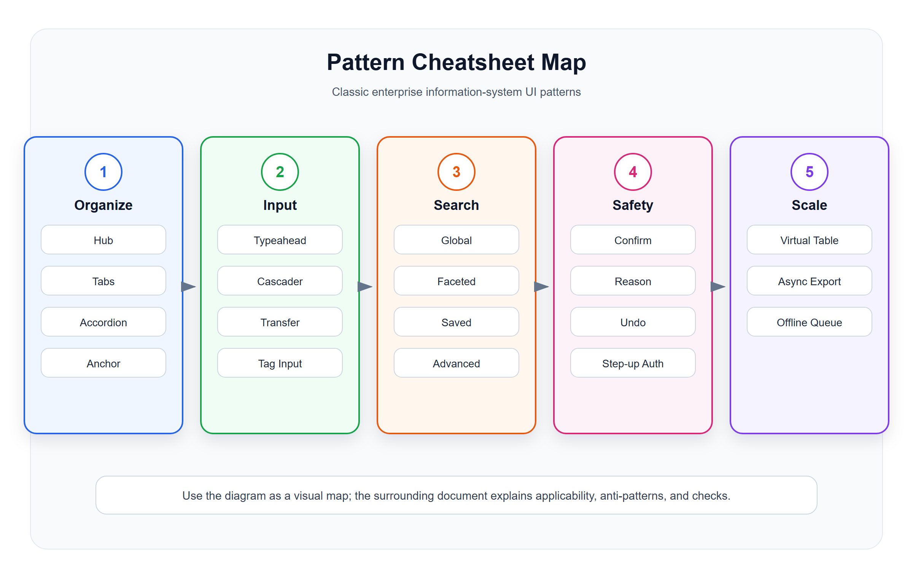

# 更多经典 UI 模式速查表

<!-- ui-model-diagram:start -->

> 图源文件：[`assets/12-pattern-cheatsheet-map.svg`](assets/12-pattern-cheatsheet-map.svg)

<!-- ui-model-diagram:end -->

> **理论定位**：本篇只用于模式检索和组合，不重复解释理论；各模式背后的认知、控制、协作、治理与时序逻辑统一参见[界面模型深层逻辑与模式体系](13-界面模型深层逻辑与模式体系.md)。

本表用于模式检索，不用于按名称机械套用。选择前至少判断：用户任务、数据规模、风险与可逆性、在线/离线条件、协作关系和可访问性。多个模式可以组合，但每个模式都应有明确的适用边界、失败状态和退出路径。

## 1. 信息组织模式

| 模式 | 说明 | 适用场景 | 禁用或失败边界 |
|---|---|---|---|
| Hub and Spoke | 中心页进入多个子任务，完成后返回中心 | 设置中心、工作台 | 强顺序流程会导致反复返回 |
| Progressive Disclosure | 先展示关键内容，再逐步展开复杂选项 | 高级筛选、复杂配置 | 不能隐藏提交所必需的关键约束 |
| Drill-in Navigation | 从列表逐层进入详情 | 移动端对象浏览 | 频繁横向比较时层层跳转成本高 |
| Split View | 列表和详情并列 | 邮件、工单、客户 | 窄屏或详情复杂时空间不足 |
| Tabbed Sections | 同一对象下多个分区 | 商品详情、门店详情 | 不适合必须连续阅读或跨分区比较的内容 |
| Accordion | 分区折叠展开 | 长表单、帮助文档 | 错误和关键状态不能藏在折叠区 |
| Anchor Navigation | 页面内锚点跳转 | 超长详情页、配置页 | 动态加载需保持锚点和焦点一致 |

## 2. 数据输入模式

| 模式 | 说明 | 适用场景 |
|---|---|---|
| Typeahead | 输入时搜索建议 | 商品、客户、门店选择 |
| Combobox | 输入和选择结合 | 大量选项 |
| Value Help | 弹出选择器选择业务对象 | SAP 类业务对象选择 |
| Cascader | 层级选择 | 地区、类目、组织 |
| Transfer List | 左右穿梭选择 | 角色授权、人员选择 |
| Tag Input | 多标签输入 | 会员标签、商品标签 |
| Range Picker | 范围选择 | 时间、金额、数量 |
| Batch Import | 批量导入 | 商品、会员、库存 |

边界提示：业务对象选择必须保留稳定标识和上下文，不能只保存显示名称；批量导入必须包含预检、字段映射、部分成功口径、错误文件、幂等重试和结果追踪。Transfer List 不适合数万条对象，超大范围改用搜索、分面筛选和规则化选择。

## 3. 反馈与状态模式

| 模式 | 说明 | 适用场景 |
|---|---|---|
| Toast | 短反馈 | 保存成功 |
| Inline Validation | 字段旁校验 | 表单 |
| Banner Alert | 页面级提醒 | 系统维护、权限问题 |
| Empty State | 无数据引导 | 首次使用、筛选无结果 |
| Skeleton | 加载占位 | 首屏数据加载 |
| Progress Tracker | 进度跟踪 | 导入、审批、任务 |
| Result Page | 完成结果 | 支付、提交、导入完成 |

边界提示：Toast 不能承载需要持续关注、高风险或包含恢复动作的信息；Skeleton 只表达结构等待，不应伪造业务内容；进度未知时使用阶段、心跳和已处理量，不能用假百分比。

## 4. 选择与比较模式

| 模式 | 说明 | 适用场景 |
|---|---|---|
| Compare Table | 多对象横向对比 | 门店、商品、方案 |
| Side-by-side Diff | 前后版本对比 | 配置、合同、规则 |
| Preview Before Submit | 提交前预览 | 营销活动、导入 |
| Simulation | 模拟执行结果 | 规则、调价、补货 |
| What-if Analysis | 参数变化影响分析 | 库存、定价、经营预测 |
| Scenario Compare | 并列比较基准、乐观、保守或不同方案 | 预测、预算、排程 |
| Sensitivity Analysis | 显示哪些输入最影响结论 | 定价、补货、风险决策 |

边界提示：Simulation 和 What-if 必须标注数据截止时间、模型/规则版本、关键假设及未覆盖约束；结果是决策证据，不是执行承诺。

## 5. 协作模式

| 模式 | 说明 | 适用场景 |
|---|---|---|
| Comment Thread | 对象评论 | 审批、工单 |
| Mention | 提及人员 | 协作处理 |
| Assignment | 指派任务 | 工单、异常 |
| Watch / Follow | 关注对象变化 | 重点客户、异常订单 |
| Activity Feed | 活动动态 | CRM、项目管理 |
| Shared View | 共享筛选视图 | 团队报表、列表 |
| Commitment / Acceptance | 区分请求、认领、交付和验收 | 工单、对账、跨部门协作 |
| Handoff with Acknowledgement | 交接目标、事实、未决项并由接收方回执 | 交接班、升级处理 |

边界提示：评论和动态不能替代责任、截止时间和验收；“已发送”“已处理”与“业务结果已被接收/验收”是不同事实。

## 6. 搜索模式

| 模式 | 说明 | 适用场景 |
|---|---|---|
| Global Search | 全局搜对象和页面 | 大型后台 |
| Faceted Search | 分面筛选 | 商品、知识库 |
| Saved Search | 保存查询 | 高频筛选 |
| Recent Search | 最近搜索 | 高频用户 |
| Search Result Grouping | 结果分组 | 跨对象搜索 |
| Advanced Query Builder | 高级查询构造器 | 报表、审计 |

## 7. 安全与确认模式

| 模式 | 说明 | 适用场景 |
|---|---|---|
| Confirm Dialog | 二次确认 | 删除、作废 |
| Reason Required | 必填原因 | 退款、驳回、作废 |
| Step-up Authentication | 高风险二次认证 | 改权限、付款 |
| Approval Gate | 审批门禁 | 大额退款、调价 |
| Undo Snackbar | 可撤销操作 | 低风险删除、移动 |
| Soft Delete | 软删除恢复 | 主数据 |
| Maker-Checker | 制作者提交、复核者批准 | 资金、权限、敏感主数据 |
| Effective Access View | 解释最终权限及来源 | 复杂角色、继承和临时授权 |
| Break-glass | 限时应急高权限并事后复核 | 故障处置、紧急运营 |

边界提示：Confirm Dialog 不能弥补糟糕的默认值或不可理解的影响范围；Maker-Checker 仅在错误代价或合规要求足够高时启用；Break-glass 不能成为日常绕过权限的捷径。

## 8. 性能与大数据模式

| 模式 | 说明 | 适用场景 |
|---|---|---|
| Virtualized Table | 虚拟滚动表格 | 大量行 |
| Server-side Filtering | 服务端筛选 | 大数据列表 |
| Infinite Scroll | 无限滚动 | 消息流、日志 |
| Pagination | 分页 | 后台列表 |
| Async Export | 异步导出 | 大报表 |
| Aggregation Cache | 汇总缓存 | Dashboard |

边界提示：虚拟滚动不等于一次把全部数据传到浏览器；服务端筛选必须保持排序、统计和导出同一口径；缓存和异步结果显示数据时间、版本及刷新方式。

## 9. 移动和多端模式

| 模式 | 说明 | 适用场景 |
|---|---|---|
| Bottom Navigation | 底部主导航 | 移动端核心模块 |
| Bottom Sheet | 底部弹层 | 移动端选择和操作 |
| Swipe Action | 滑动操作 | 移动列表 |
| Scan-first Flow | 扫码优先流程 | POS、仓库 |
| Offline Queue | 离线队列 | 门店、外勤 |
| Sync Status | 同步状态 | 小程序、POS |
| Degraded Mode Banner | 持续说明受限能力、旧数据和恢复条件 | 依赖故障、离线、容量不足 |
| Dependency Health Panel | 解释受影响依赖和业务范围 | POS、同步、实时控制台 |
| Recovery Point | 说明中断后从哪里继续 | 草稿、长任务、交接班 |
| Control Handoff | 显示人工/自动化控制者及接管条件 | AI、调度、自动审批 |

边界提示：离线队列需定义本地/云端权威关系、容量、过期、冲突和幂等；恢复联网后先校验或对账，不能盲目重放所有动作。

## 10. 最容易被忽略但很重要的模式

- 口径说明入口：用于指标、报表、金额、库存。
- 字段级权限提示：用户看不到或不能改时要解释。
- 失败重试队列：用于同步、回调、批处理。
- 操作原因采集：用于驳回、作废、退款、调账。
- 影响范围预览：用于配置、权限、规则、批量操作。
- 版本发布记录：用于规则、流程、配置。
- 只读模式：用于已归档、已结算、无权限、历史版本。
- 模拟运行：用于规则、报表口径、补货、调价。
- As-of View：查看“截至当时系统所知”的事实，而非用今天修订后的数据伪装历史。
- Effective Timeline：区分业务发生/生效时间与系统记录时间。
- Revision Diff：展示更正前后及更正原因，不覆盖历史。
- KPI Contract：记录指标目的、口径、适用范围、负责人、护栏和修订规则。
- Evidence Workspace：把证据、假设、备选方案和决策理由放在同一决策空间。
- Interruption Recovery：恢复任务目标、上次进度、上下文变化和下一动作。
- Minimum Disclosure：解释权限、隐私和异常时只展示完成任务所必需的信息。

## 11. 模式组合速查

| 任务 | 推荐组合 | 关键门禁 |
|---|---|---|
| 高风险规则发布 | Rule Builder + Simulation + Revision Diff + Maker-Checker | 边界样本、影响范围、版本与回滚 |
| 大批量导入 | Preview + Long-running Task + Result Page + Retry Queue | 部分成功口径、幂等和错误明细 |
| 离线门店作业 | Offline Queue + Sync Status + Degraded Mode + Recovery Point | 权威来源、容量、冲突和恢复对账 |
| AI 业务建议 | Evidence Workspace + Scenario Compare + Human-in-the-loop + Control Handoff | 证据、校准、替代方案和接管 |
| 权限变更 | Effective Access + Impact Preview + Maker-Checker + Audit Log | 租户边界、职责冲突和最小披露 |
| 历史审计 | As-of View + Effective Timeline + Revision Diff + Audit Log | 两条时间轴、来源与不可变历史 |

## 12. 中文设计案例

### 案例1：零售促销规则模拟运行

**场景**：运营人员在发布满减促销前，模拟计算活动效果

[查看设计案例](cases/12-更多经典模式速查表/12-1-promotion-rule-simulator.html)

**必须覆盖**：规则版本、样本范围、基准/方案对比、边界样本、未覆盖约束、影响范围和发布门禁。

### 案例2：零售系统只读历史版本

**场景**：财务人员查看已结算月份的订单详情（历史版本）

[查看设计案例](cases/12-更多经典模式速查表/12-2-version-history.html)

**必须覆盖**：业务有效时间、系统记录时间、As-of View、后续修订提示和 Revision Diff。

### 案例3：零售门店设备离线重试队列

**场景**：仓库管理员查看设备同步失败的重试队列

[查看设计案例](cases/12-更多经典模式速查表/12-3-retry-queue.html)

**必须覆盖**：离线能力边界、队列容量、幂等键、失败原因、结果未知、依赖健康、人工接管和恢复对账。

**设计要点**：
1. 模拟运行让用户在发布前预知规则效果
2. What-If 对比支持参数调整和结果对比
3. 只读模式明确告知用户数据状态和不可修改原因
4. 重试队列展示失败原因、重试次数和下次重试时间
5. 支持批量操作和立即重试
6. 系统状态说明队列处理机制
