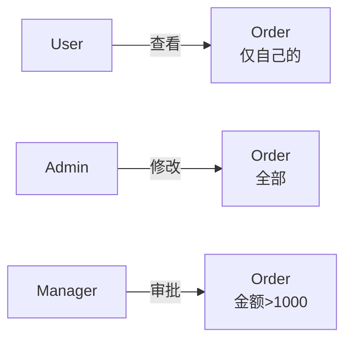

# code-review-graph 增强设计方案（AI 文档生成版）⭐⭐

> 面向两份方法论的知识图谱增强 + AI SOP 文档生成方案
>
> **版本**: v3.1 - 证据约束修订版
> **核心架构**: 扩展建图能力 → 事实图谱存储 → AI Agent 执行 SOP → 生成带证据的 Markdown 文档
> **目标**: 采集两份方法论需要的可验证事实，由 AI 按 SOP 查询、解释和组织文档；AI 不创造证据、不提升置信度，也不替代人工确认
> 
> **核心理念**：
> - 📊 **事实图谱存确定性事实**：静态解析、数据库、接口、测试和运行证据分别标注来源与版本
> - 📝 **AI 分析只存在于文档生成过程**：输出带事实引用和待确认标记，不写入事实图谱
> - 📋 **SOP 指导查询**：每个文档生成任务对应一个专门的查询与验收步骤
> - 🤖 **AI Agent 生成文档**：负责查询编排、跨来源对照、语义解释和 Markdown 组织
> - ✅ **可重复、可追溯**：同一事实快照、SOP 版本和模型配置应能复现分析过程

---

## 修订约束（v3.1，评审后生效）

本节是后续章节的约束性解释，优先于旧版 AI 增强草稿中的示例代码、指标和评审结论。

### 1. 事实、分析备注与业务结论分离

- **事实图谱（Ground Truth）**只保存可定位、可复核的事实：静态解析结果、数据库结构/约束、接口契约、测试证据和已授权的运行证据。
- **SOP/AI 输出**只作为本次文档生成过程中的分析备注或候选假设，不写入事实图谱；文档中必须带 `snapshot_id`、SOP 版本、模型版本（如使用 AI）和 `source_refs`，不得把分析备注加入证据源列表。
- “状态转换”“规则”“聚合根”“主体/客体关系”等只有在事实证据支持并按方法论完成复核后，才能作为分析结论呈现；没有独立证据时必须标记为“候选/待确认”。
- AI 不能创造证据、不能把自身输出作为独立证据、不能自动批准 L4/L5，也不能替代人工确认。
- 文档中标为“已废止”的旧版 AI 推理代码、指标和里程碑仅用于解释历史决策，不得作为当前实施接口、验收标准或能力承诺。

### 2. 置信度硬约束

L5 表示至少三类相互独立且语义一致的证据（优先为代码、数据库表/约束、API 契约）；L4 表示至少两类独立证据互相印证；L3 表示单一清晰且可定位的事实；L2/L1 表示推断、证据不完整或无法复核。AI、SOP、注释和模型自评只能帮助定位、摘要和提出问题，不得增加证据数量、改变证据来源或提升等级。数据库或 API 证据未采集时，相关分析项不得标记为 L4/L5。

卓越标准的“L4-L5 ≥ 95%”是交付检查结果，不是 AI 能力承诺。若未达到标准，报告必须明确标记未达标，并保留低置信度项供人工复核。

### 3. 三跳和八维度覆盖边界

SOP 必须分别记录“证据层 → 业务对象 → 业务模式 → 领域模型”的三跳依据，不能从类名、注解或 AI 解释直接跳到领域结论。每一跳都要检查两份方法论要求的八个维度：目标、主体、对象、资源、规则、时间、不确定性、演化。当前实现优先覆盖对象、规则、时间和部分主体/资源；未采集或未验证的维度必须显式标记为“未覆盖”，不能写成已完成。

### 4. 第一期存储与增量边界

第一期使用关系型数据库承载事实图谱适配层，不宣称具备 Neo4j 等原生递归图查询能力；复杂路径、循环检测和影响半径由受控 SQL 查询与应用层算法完成。后续如迁移原生图数据库，必须另行评审存储模型与查询契约。

每次建图生成不可变 `snapshot_id`。增量更新按文件内容指纹和提交号识别变更：先在新快照中替换受影响文件产生的事实节点与边，再重建其依赖范围；旧快照只读保留用于差异对比和回滚。文档片段缓存键至少包含 `sop_version + snapshot_id + model_version + input_digest`，不能跨事实快照复用。

增量更新的最小执行契约如下：变更文件先重新解析并原子写入新快照；删除或重命名文件时同步删除该文件产生的事实节点、边和来源引用；沿 `CALLS`、`FIELD_TYPE`、`IMPLEMENTS`、`EXTENDS` 等事实边计算受影响范围；只对受影响事实重新执行 SOP，依赖这些事实的 AI 分析备注必须失效；新快照校验完整后才标记 `READY`，失败则保留旧快照作为可读版本。增量测试必须覆盖新增、删除、重命名、跨文件类型变化、孤立边清理和失败回滚。

### 5. 安全与交付门禁

代码、注释、配置和查询结果均视为不可信输入。AI 调用必须使用结构化输入、长度限制、输出 Schema 校验和提示注入测试；密钥、令牌、完整请求/响应和未经脱敏的业务数据不得进入 Prompt、日志或文档。生产交付前必须完成事实来源覆盖、增量一致性、旧命令回归、AI 不可用降级、低置信度人工复核和敏感信息扫描。

AI 只能解释已查询的事实，不能通过 Prompt、输出字段或重试改变事实、证据来源或置信度等级。涉及敏感代码或配置时，默认使用脱敏后的结构化摘要；原始注释、字符串字面量和完整方法体不得直接作为 AI 输入。任何 Schema 校验失败、来源引用缺失、越权指令或敏感信息扫描命中，都必须丢弃 AI 结果并回退到事实表，同时标记 `NEEDS_REVIEW`。

---

## 架构总览

```
┌──────────────────────────────────────────────────────────────────┐
│  Step 1: 扩展 code-review-graph 建图能力                         │
│  一次建图，采集两份方法论需要的所有数据                          │
└──────────────────────────────────────────────────────────────────┘
                    ↓
┌──────────────────────────────────────────────────────────────────┐
│  事实图谱存储层（第一期：关系型图谱适配层）                      │
│  - 类、字段、方法、注解、枚举、异常、接口、测试和证据            │
│  - 只存 Ground Truth；AI 分析结果仅进入文档输出                   │
│  - 支持按提交/文件指纹增量更新，并记录不可变图谱快照             │
└──────────────────────────────────────────────────────────────────┘
                    ↓
┌──────────────────────────────────────────────────────────────────┐
│  AI Agent 执行专门的 SOP 文档                                    │
│  - SOP-既有系统深度分析.md                                       │
│  - SOP-更高维业务设计.md                                         │
│  每个 SOP 包含：查询指令 + 分析任务 + 输出格式                  │
└──────────────────────────────────────────────────────────────────┘
                    ↓
┌──────────────────────────────────────────────────────────────────┐
│  AI Agent 执行流程                                               │
│  1. 读取 SOP 文档（作为执行指令）                                │
│  2. 根据 SOP 步骤查询关系型事实图谱适配层                        │
│  3. 分析数据 + 阅读代码                                          │
│  4. 生成结构化文档                                               │
└──────────────────────────────────────────────────────────────────┘
                    ↓
┌──────────────────────────────────────────────────────────────────┐
│  输出：高质量业务文档和架构文档                                  │
│  - 既有系统深度分析报告.md                                       │
│  - 更高维业务设计文档.md                                         │
│  - 可重复生成、可追溯来源                                        │
└──────────────────────────────────────────────────────────────────┘
```

---

## 一、问题背景与差距分析

### 1.1 当前工具能力

`code-review-graph` 已具备以下能力：

| 能力 | 说明 |
|------|------|
| **节点解析** | 类（Class）、函数/方法（Function）、文件（File）、端点（Endpoint）、测试（Test） |
| **边关系** | CALLS（调用）、IMPORTS（导入）、HANDLES（处理）、TESTED_BY（测试）、EXTENDS（继承）、IMPLEMENTS（实现） |
| **社区检测** | 基于调用关系的 Leiden 算法社区划分 |
| **死代码检测** | 无调用者、无测试引用的函数/类 |
| **执行流分析** | 从入口点开始的调用链 |
| **变更影响分析** | 变更文件的依赖半径 |

### 1.2 核心缺失

```
当前工具只知道：
├── 有哪些类
├── 类有哪些方法
├── 方法A调用了方法B
└── 不知道：
    ├── 类的字段（类型、注解）
    ├── 枚举有哪些值
    ├── 状态如何流转
    ├── 校验规则是什么
    ├── 异常如何处理
    ├── 消息发给谁
    ├── 配置参数含义
```

### 1.3 与方法论的差距

| 方法论章节 | 要求的分析内容 | 当前能力 | 差距 |
|------------|----------------|----------|------|
| **1.1 对象识别** | 扫描 @Entity、@Table 注解 | ❌ 不解析注解 | 大 |
| **1.1 对象识别** | 识别 DTO/VO 类 | ❌ 不理解类用途 | 大 |
| **1.2 对象树** | 追踪字段类型（泛型） | ❌ 不解析字段 | 大 |
| **1.2 对象树** | 识别 @OneToMany 等关系 | ❌ 不解析注解 | 大 |
| **1.3 关系网络** | 组合/聚合/关联分类 | ❌ 仅有 CALLS | 大 |
| **2.1 主流程** | 识别 API 入口 | ✅ 已识别 | 可用 |
| **2.1 主流程** | 提取流程步骤序列 | ⚠️ 仅识别调用 | 需增强 |
| **2.2 异常流** | 识别 try-catch 块 | ❌ 不解析 | 大 |
| **2.2 补偿流** | 识别补偿逻辑（回滚） | ❌ 不解析 | 大 |
| **3.1 状态机** | 识别枚举状态值 | ❌ 不解析枚举 | 大 |
| **3.2 状态转换** | 追踪 setStatus() 调用 | ❌ 不解析字段赋值 | 大 |
| **4.1 规则提取** | 识别 if 校验逻辑 | ❌ 不解析 | 大 |
| **4.2 规则冲突** | 检测规则冲突 | ❌ 无此能力 | 大 |
| **5.1 集成点** | 识别 HTTP/RPC 调用 | ⚠️ 有限 | 需增强 |
| **5.1 集成点** | 识别 MQ 消息发送 | ❌ 不解析 | 大 |
| **5.2 混沌测试** | 分析超时/重试配置 | ❌ 不解析 | 大 |

### 1.4 缺失的影响

| 场景 | 受限能力 |
|------|----------|
| DTO 分析 | 无法了解接口请求/响应的数据结构 |
| 领域建模 | 无法提取实体及其关系 |
| API 追踪 | 无法追踪参数类型链路 |
| 数据库映射 | 无法关联实体与数据库表 |
| 枚举理解 | 无法了解状态机、业务常量 |

---

## 二、增强目标

### 2.1 总体目标

在保持现有能力的基础上，新增**结构化信息提取能力**，采集两份方法论需要的事实数据，存入第一期关系型事实图谱适配层，供 AI Agent 查询和分析。业务结论不因“采集完成”自动成立，仍须按来源和复核规则呈现：

**两份方法论需要的核心数据**：

1. **既有系统深度分析方法论**：
   - 对象建模：Entity、字段、关系、聚合根
   - 流程分析：API 入口、调用链、异常处理、补偿逻辑
   - 状态机：枚举状态、状态转换、触发条件
   - 规则分析：约束、计算、决策、触发规则
   - 集成分析：HTTP/RPC/MQ 集成点、容错配置

2. **更高维业务设计方法论**：
   - 主体识别：用户、角色、权限、组织
   - 客体识别：资源、数据、功能模块
   - 时间维度：有效期、生效时间、定时任务
   - 行为建模：CRUD 操作、业务活动
   - 约束建模：权限规则、数据约束
   - 状态建模：业务对象状态机

**第一期关系型事实图谱适配层能回答的查询**：

```sql
-- 对象建模
SELECT * FROM class_nodes WHERE snapshot_id = :snapshot_id AND is_entity = true;
SELECT * FROM field_nodes WHERE snapshot_id = :snapshot_id AND class_id = :class_id;
SELECT * FROM annotation_nodes WHERE snapshot_id = :snapshot_id AND name = 'Entity';

-- 流程分析
SELECT * FROM api_endpoint_nodes WHERE http_method = 'POST';
SELECT * FROM call_edges WHERE caller_id = ?;
SELECT * FROM exception_nodes WHERE method_id = ?;

-- 状态机分析
SELECT * FROM enum_nodes WHERE name LIKE '%Status';
SELECT * FROM state_transition_edges WHERE from_state = ?;

-- 规则分析
SELECT * FROM rule_nodes WHERE rule_type = 'CONSTRAINT';

-- 集成分析
SELECT * FROM message_nodes WHERE channel LIKE '%kafka%';

-- 主体客体分析（高维方法论）
SELECT * FROM class_nodes WHERE is_subject = true;
SELECT * FROM field_nodes WHERE is_resource_field = true;
SELECT * FROM field_nodes WHERE is_time_field = true;
```

### 2.2 能力矩阵（AI 文档生成版）⭐⭐

```
数据采集能力对比：

数据类型              | 增强前 | 增强后 | 用途
---------------------|--------|--------|------
类/方法解析           |   ✅   |   ✅   | 基础
调用关系              |   ✅   |   ✅   | 流程追踪
字段解析              |   ❌   |   ✅⭐ | 对象建模、字段分析
注解解析              |   ❌   |   ✅⭐ | Entity识别、关系识别
泛型类型              |   ❌   |   ✅⭐ | 类型追踪
枚举值                |   ❌   |   ✅⭐ | 状态机建模
API 参数              |   ❌   |   ✅⭐ | 接口分析
数据库映射            |   ❌   |   ✅⭐ | 对象-表映射
异常处理              |   ❌   |   ✅⭐ | 异常流分析
状态转换              |   ❌   |   ✅⭐ | 状态机建模
业务规则              |   ❌   |   ✅⭐ | 规则提取
MQ 消息              |   ❌   |   ✅⭐ | 集成分析
主体标识（用户/角色） |   ❌   |   ✅⭐ | 高维方法论
客体标识（资源）      |   ❌   |   ✅⭐ | 高维方法论
时间字段              |   ❌   |   ✅⭐ | 高维方法论
权限注解              |   ❌   |   ✅⭐ | 高维方法论
```

**图例**：
- ✅ = 已支持
- ⭐ = 新增采集能力

---

## 三、整体架构（AI 文档生成版）⭐⭐

### 3.1 核心架构设计

```
┌─────────────────────────────────────────────────────────────────────────────┐
│                  code-review-graph 增强架构（AI 文档生成版）                 │
├─────────────────────────────────────────────────────────────────────────────┤
│                                                                               │
│  ┌────────────────────────────────────────────────────────────────────────┐ │
│  │                    第一层：代码解析层 (Parser)                          │ │
│  │  ┌─────────┐ ┌─────────┐ ┌─────────┐ ┌─────────┐ ┌─────────┐          │ │
│  │  │ 类解析器 │ │字段解析器│ │枚举解析器│ │注解解析器│ │方法解析器│          │ │
│  │  └─────────┘ └─────────┘ └─────────┘ └─────────┘ └─────────┘          │ │
│  │  ┌─────────┐ ┌─────────┐ ┌─────────┐ ┌─────────┐                      │ │
│  │  │异常解析器│ │MQ解析器 │ │状态解析器│ │规则解析器│                      │ │
│  │  └─────────┘ └─────────┘ └─────────┘ └─────────┘                      │ │
│  │  目标：从代码中提取所有结构化事实数据                                   │ │
│  └────────────────────────────────────────────────────────────────────────┘ │
│                              ↓                                                │
│  ┌────────────────────────────────────────────────────────────────────────┐ │
│  │                  第二层：事实图谱存储层（关系型适配）                 │ │
│  │  ┌──────────────────────────────────────────────────────────────────┐  │ │
│  │  │ 核心节点表：                                                     │  │ │
│  │  │ - class_nodes（类）     - field_nodes（字段）                   │  │ │
│  │  │ - method_nodes（方法）   - annotation_nodes（注解）             │  │ │
│  │  │ - enum_nodes（枚举）     - enum_value_nodes（枚举值）           │  │ │
│  │  │ - exception_nodes（异常）- rule_nodes（规则）                   │  │ │
│  │  │ - state_transition_edges（状态转换）                            │  │ │
│  │  │ - message_nodes（消息）  - api_endpoint_nodes（API）            │  │ │
│  │  │ - db_table_nodes（数据库表）                                    │  │ │
│  │  └──────────────────────────────────────────────────────────────────┘  │ │
│  │  只存事实，不存推理结论 ✅                                               │ │
│  └────────────────────────────────────────────────────────────────────────┘ │
│                              ↓                                                │
│  ┌────────────────────────────────────────────────────────────────────────┐ │
│  │              第三层：SOP 执行层 (AI Agent Executor) ⭐NEW               │ │
│  │  ┌──────────────────────────────────────────────────────────────────┐  │ │
│  │  │ DocumentGenerationAgent:                                         │  │ │
│  │  │                                                                  │  │ │
│  │  │ def execute_sop(sop_file, graph_db, output_file, snapshot_id):  │  │ │
│  │  │     # 1. 加载 SOP，并固定事实快照                              │  │ │
│  │  │     sop = load_sop(sop_file)                                    │  │ │
│  │  │                                                                  │  │ │
│  │  │     # 2. 逐步执行查询                                           │  │ │
│  │  │     for phase in sop.phases:                                    │  │ │
│  │  │         for step in phase.steps:                                │  │ │
│  │  │             results = [                                         │  │ │
│  │  │                 graph_db.execute(q, snapshot_id=snapshot_id)    │  │ │
│  │  │                 for q in step.queries                            │  │ │
│  │  │             ]                                                    │  │ │
│  │  │             analysis = generate_section(step, results)          │  │ │
│  │  │             if not validate(analysis, step.requirements):       │  │ │
│  │  │                 analysis = render_fact_table(results)            │  │ │
│  │  │                 mark_needs_review(analysis)                      │  │ │
│  │  │                                                                  │  │ │
│  │  │     # 3. 生成最终文档                                           │  │ │
│  │  │     write_document(document, output_file)                       │  │ │
│  │  └──────────────────────────────────────────────────────────────────┘  │ │
│  └────────────────────────────────────────────────────────────────────────┘ │
│                              ↓                                                │
│  ┌────────────────────────────────────────────────────────────────────────┐ │
│  │                第四层：文档输出层 (Markdown Output)                     │ │
│  │  ┌──────────────────────────────────────────────────────────────────┐  │ │
│  │  │ - 既有系统深度分析报告.md                                        │  │ │
│  │  │ - 更高维业务设计文档.md                                          │  │ │
│  │  │ - 可重复生成、可追溯来源                                         │  │ │
│  │  └──────────────────────────────────────────────────────────────────┘  │ │
│  └────────────────────────────────────────────────────────────────────────┘ │
│                                                                               │
└─────────────────────────────────────────────────────────────────────────────┘
```

### 3.2 SOP 执行层设计 ⭐NEW

SOP（标准作业程序）执行层是本方案的核心创新：

**核心理念**：
1. **关系型事实图谱存事实**：只存可定位的结构化事实，不存 AI 推理结论；递归路径由受控查询和应用层算法完成
2. **SOP 文档指导分析**：每个文档生成任务对应一个 SOP 执行手册
3. **AI Agent 执行 SOP**：根据 SOP 步骤查询图谱、分析代码、生成文档
4. **可重复、可追溯**：同样的图谱 + 同样的 SOP = 同样的文档

**SOP 文档结构**：
```markdown
# SOP-既有系统深度分析执行手册

## 执行目标
生成符合《既有系统深度分析方法论-卓越标准》的完整分析报告

## 第一阶段：对象建模分析

### 步骤 1.1：候选对象扫描
**目标**：识别所有潜在的业务对象

**查询指令**：
```sql
-- Q1: 查询所有实体类
SELECT id, name, package, annotations 
FROM class_nodes 
WHERE is_entity = true;

-- Q2: 查询对应的数据库表
SELECT t.table_name, c.name as entity_class
FROM db_table_nodes t
JOIN class_nodes c ON t.entity_class_id = c.id;
```

**分析任务**：
1. 将查询结果按包分组
2. 识别技术对象 vs 业务对象
3. 生成"候选对象清单"表格

**输出要求**：
```markdown
#### 1.1 候选对象清单
| 对象名 | 类型 | 数据库表 | 所属包 | 初步判断 |
|--------|------|----------|---------|----------|
```

### 步骤 1.2：聚合根判定
...（详细步骤）
```

**执行流程（现行约束简化版）**：
```python
class DocumentGenerationAgent:
    def execute_sop(self, sop_file, graph_db, output_file, snapshot_id):
        """在固定事实快照上执行 SOP；失败时回退事实报告。"""
        sop = self.load_sop(sop_file)
        document = []
        for phase in sop.phases:
            for step in phase.steps:
                results = [
                    graph_db.execute(q, snapshot_id=snapshot_id)
                    for q in step.queries
                ]
                analysis = self.generate_structured_document_section(
                    step, results, snapshot_id=snapshot_id
                )
                if not self.quality_check(analysis, step.requirements):
                    analysis = self.render_fact_table(results)
                    analysis['status'] = 'NEEDS_REVIEW'
                document.append(analysis)
        self.write_document(document, output_file)
```

---

## 四、新增节点类型设计（支撑两份方法论）⭐⭐

### 4.1 完整节点类型清单

```python
# ==================== 现有节点 ====================
# Class, Function, File, Endpoint, Test

# ==================== 新增节点（既有系统深度分析方法论）====================

class FieldNode:
    """字段节点"""
    name: str                    # 字段名: orderNo
    class_id: int                # 所属类
    type_raw: str                # 原始类型: List<OrderItem>
    type_resolved: str           # 解析后类型: java.util.List<com.example.OrderItem>
    is_generic: bool             # 是否泛型
    generic_params: list[str]    # 泛型参数: [OrderItem]
    modifiers: list[str]         # 修饰符: [private, final]
    line: int
    
    # 高维方法论扩展字段 ⭐NEW
    is_resource_field: bool      # 是否资源字段（文件、图片、URL）
    is_time_field: bool          # 是否时间字段（有效期、生效时间）
    is_permission_field: bool    # 是否权限字段
    is_status_field: bool        # 是否状态字段

class AnnotationNode:
    """注解节点"""
    name: str                    # @Entity
    qualified_name: str          # javax.persistence.Entity
    params: dict                 # {name: "t_order"}
    target: str                  # CLASS, FIELD, METHOD
    line: int

class EnumValueNode:
    """枚举值节点"""
    name: str            # CREATED
    value: str           # 1 (显式值)
    parent_enum: str     # OrderStatus
    line: int

class ExceptionNode:
    """异常处理节点"""
    exception_type: str        # InsufficientStockException
    catch_or_throw: str       # catch / throw
    handling_code: str         # 处理逻辑摘要
    has_compensation: bool     # 是否有补偿逻辑
    line: int
    method_id: int

class MessageNode:
    """消息/事件节点"""
    message_type: str       # OrderCreatedEvent
    channel: str           # Kafka topic / RabbitMQ queue
    producer: str          # 发送方法
    consumer: str          # 消费方法（可关联）
    payload_type: str      # 消息体类型
    is_event: bool        # true=事件, false=消息

class RuleNode:
    """规则节点"""
    rule_id: str
    rule_type: str         # CONSTRAINT, CALCULATION, DECISION, TRIGGER
    description: str
    condition: str         # 条件表达式
    action: str            # 动作表达式
    priority: int          # MUST/SHOULD/MAY
    scope: str            # 适用范围
    valid_time: str       # 生效时间
    line: int
    method_id: int

class StateTransitionEdge:
    """状态转换边"""
    from_state: str       # CREATED
    to_state: str        # PAID
    trigger: str          # pay()
    condition: str         # 前置条件
    line: int
    method_id: int

class ApiEndpointNode:
    """API 端点节点"""
    http_method: str      # POST
    path: str            # /order/create
    api_operation: str   # createOrder
    method_id: int
    request_type: str    # CreateOrderRequest
    response_type: str   # CreateOrderResponse

class DbTableNode:
    """数据库表节点"""
    table_name: str      # t_order
    entity_class_id: int # 对应的 Entity 类
    columns: list[DbColumn]

# ==================== 新增节点（更高维业务设计方法论）⭐NEW ====================

class SubjectNode:
    """主体节点（用户、角色、权限）"""
    subject_id: int           # 关联的 class_id
    subject_type: str         # USER, ROLE, PERMISSION, ORGANIZATION
    name: str                 # 主体名称
    description: str          # 描述
    # 识别依据
    has_annotation: bool      # 是否有特定注解（@RolePermissions）
    has_auth_methods: bool    # 是否有认证/授权方法
    has_permission_fields: bool # 是否有权限相关字段

class ObjectNode:
    """客体节点（资源、数据）"""
    object_id: int            # 关联的 class_id 或 field_id
    object_type: str          # RESOURCE, DATA, MODULE, FUNCTION
    name: str                 # 客体名称
    description: str          # 描述
    # 识别依据
    is_file_resource: bool    # 文件资源（文件名、路径字段）
    is_data_resource: bool    # 数据资源（业务实体）
    is_ui_resource: bool      # UI 资源（菜单、按钮）

class TemporalFieldNode:
    """时间字段节点"""
    field_id: int             # 关联的 field_id
    temporal_type: str        # VALIDITY_PERIOD, EFFECTIVE_TIME, SCHEDULE
    name: str                 # 字段名
    description: str          # 描述
    # 识别依据
    is_start_time: bool       # 开始时间
    is_end_time: bool         # 结束时间
    is_effective_date: bool   # 生效日期
    is_expiry_date: bool      # 失效日期

class BehaviorNode:
    """行为节点（业务活动）"""
    behavior_id: int          # 关联的 method_id
    behavior_type: str        # CRUD, APPROVAL, NOTIFICATION, CALCULATION
    name: str                 # 行为名称
    description: str          # 描述
    # 识别依据
    is_create: bool           # 创建操作
    is_read: bool             # 读取操作
    is_update: bool           # 更新操作
    is_delete: bool           # 删除操作
    is_approval: bool         # 审批操作

class ConstraintNode:
    """约束节点（权限规则、数据约束）"""
    constraint_id: str
    constraint_type: str      # PERMISSION, DATA_VALIDATION, BUSINESS_RULE
    description: str
    condition: str            # 约束条件
    scope: str               # 适用范围
    # 识别依据
    is_permission_check: bool # 权限检查
    is_data_validation: bool  # 数据校验
    is_business_rule: bool    # 业务规则

class ConfigNode:
    """配置节点"""
    key: str              # spring.datasource.url
    value: str            # jdbc:mysql://...
    source: str           # application.yml
    line: int
```

### 4.2 新增边类型

```python
NEW_EDGES = {
    # ========== 基础结构边 ==========
    'HAS_FIELD':           ('Class', 'Field'),
    'HAS_METHOD':          ('Class', 'Function'),
    'IMPLEMENTS':          ('Class', 'Interface'),
    'EXTENDS':             ('Class', 'Class'),
    
    # ========== 字段关系边 ==========
    'FIELD_TYPE':          ('Field', 'Class'),
    'FIELD_GENERIC':       ('Field', 'Class'),  # 泛型参数
    'HAS_ANNOTATION':      ('Field|Class|Method', 'Annotation'),
    
    # ========== 枚举边 ==========
    'HAS_ENUM_VALUE':      ('Class', 'EnumValue'),
    
    # ========== 状态机边 ==========
    'HAS_STATE':           ('Class', 'EnumValue'),
    'STATE_TRANSITION':    ('Method', 'StateTransition'),
    
    # ========== 异常处理边 ==========
    'THROWS':               ('Method', 'Exception'),
    'CATCHES':             ('Method', 'Exception'),
    'HAS_COMPENSATION':     ('Exception', 'Method'),
    
    # ========== 消息边 ==========
    'SENDS_MESSAGE':       ('Method', 'Message'),
    'CONSUMES_MESSAGE':    ('Method', 'Message'),
    'MESSAGE_TO':          ('Message', 'Class'),
    
    # ========== 规则边 ==========
    'HAS_RULE':            ('Method', 'Rule'),
    'RULE_DEPENDS':        ('Rule', 'Rule'),
    'RULE_CONFLICTS':      ('Rule', 'Rule'),
    
    # ========== 校验边 ==========
    'VALIDATES':           ('Method', 'Field'),
    
    # ========== 配置边 ==========
    'READS_CONFIG':        ('Method', 'Config'),
    'CONFIGURED_BY':       ('Class', 'Config'),
    
    # ========== 高维方法论边 ⭐NEW ==========
    
    # 主体-客体关系
    'SUBJECT_ACCESS_OBJECT': ('Subject', 'Object'),  # 主体访问客体
    'SUBJECT_HAS_PERMISSION': ('Subject', 'Permission'),  # 主体拥有权限
    
    # 行为-主体-客体关系
    'BEHAVIOR_BY_SUBJECT':   ('Behavior', 'Subject'),  # 行为由主体执行
    'BEHAVIOR_ON_OBJECT':    ('Behavior', 'Object'),   # 行为作用于客体
    
    # 时间约束关系
    'HAS_TEMPORAL_CONSTRAINT': ('Object', 'TemporalField'),  # 客体有时间约束
    'BEHAVIOR_HAS_SCHEDULE':   ('Behavior', 'TemporalField'), # 行为有时间安排
    
    # 约束关系
    'SUBJECT_CONSTRAINED_BY':  ('Subject', 'Constraint'),  # 主体受约束
    'OBJECT_CONSTRAINED_BY':   ('Object', 'Constraint'),   # 客体受约束
    'BEHAVIOR_CONSTRAINED_BY': ('Behavior', 'Constraint'), # 行为受约束
}
```

---

## 五、技术实现

### 5.1 Java 字段解析

使用 Tree-sitter Java 语法：

```python
# Java 字段语法查询
JAVA_FIELD_QUERY = """
(class_body
  (field_declaration
    modifiers: (modifiers)?
    type: (_)
    declarator: (variable_declarator
      name: (identifier) @field_name
    )
  ) @field_declaration
)
"""

# 解析示例
"""
private String orderNo;              # 字段名: orderNo, 类型: String
private List<OrderItem> items;      # 字段名: items, 类型: List<OrderItem>, 泛型: OrderItem
private @Autowired OrderService service;  # 有注解
"""
```

### 5.2 泛型类型解析

```python
def resolve_generic_type(type_raw: str, context: dict) -> ResolvedType:
    """
    解析泛型类型，追踪泛型参数的具体类型
    例如：List<OrderItem> → 追踪 OrderItem
    """
    # 1. 提取基础类型和泛型参数
    base_type, generic_params = parse_generic(type_raw)

    # 2. 在当前文件的 import 中查找
    for imported in context.imports:
        if imported.ends_with(base_type):
            return ResolvedType(qualified=imported)

    # 3. 尝试解析 java.lang 包
    if base_type in JAVA_LANG_TYPES:
        return ResolvedType(qualified=f'java.lang.{base_type}')

    # 4. 同包查找
    same_package = find_in_package(context.package, base_type)
    if same_package:
        return ResolvedType(qualified=same_package)

    # 5. 无法解析
    return ResolvedType(qualified=type_raw, resolved=False)
```

### 5.3 注解解析

```python
KEY_ANNOTATIONS = {
    'javax.persistence.Entity': {},
    'javax.persistence.Table': {'name': lambda p: p.get('name')},
    'javax.persistence.Column': {'name': lambda p: p.get('name')},
    'javax.persistence.OneToMany': {'mappedBy': lambda p: p.get('mappedBy')},
    'javax.persistence.ManyToOne': {},
    'org.springframework.stereotype.Service': {},
    'org.springframework.web.bind.annotation.*': {},
    'javax.transaction.Transactional': {},
}
```

### 5.4 枚举值解析

```python
JAVA_ENUM_QUERY = """
(enum_declaration
  name: (identifier) @enum_name
  body: (enum_body
    (enum_constant
      name: (identifier) @constant_name
      (argument_list)? @args
    )*
  ) @enum_body
) @enum_declaration
"""

# 提取结果
EnumValueNode(
    name='CREATED',
    parent_enum='OrderStatus',
    value=None,
)
```

---

## 六、各方法论文章的增强方案

### 6.1 第一部分：对象建模增强

#### 1.1 对象识别四重过滤器

```python
def identify_candidate_objects_from_facts():
    """
    从事实图谱生成聚合根候选，不直接判定领域模型。

    候选只记录可定位的静态事实：Entity 注解、事务调用、引用关系、
    生命周期方法和数据库外键。聚合根结论必须由 SOP 组织证据并人工复核。
    """
    candidates = []
    entities = query_nodes('HAS_ANNOTATION', filter={'annotation.name': 'Entity'})

    for entity in entities:
        evidence = []
        if is_transaction_root(entity):
            evidence.append('transaction_boundary')
        if has_full_crud(entity):
            evidence.append('lifecycle_methods')
        if count_references(entity) > 10:
            evidence.append('reference_center')
        if count_incoming_fk(entity) > 3:
            evidence.append('incoming_foreign_keys')

        candidates.append({
            'entity_id': entity.id,
            'entity_name': entity.name,
            'evidence_refs': get_source_refs(entity),
            'evidence_types': evidence,
            'status': 'CANDIDATE_NEEDS_REVIEW'
        })

    return candidates


def scan_candidate_objects():
    """
    从代码库识别所有潜在业务对象
    输出：候选对象列表（置信度 L2-L5）
    """

    candidates = []

    # 策略1: 扫描 @Entity 注解
    entities = query_nodes('HAS_ANNOTATION', filter={'annotation.name': 'Entity'})
    for e in entities:
        candidates.append({
            'type': 'entity',
            'class': e.class,
            'table': extract_table_name(e.annotation),
            'confidence': 'L3'  # 代码事实；注解属于同一来源的定位信息，不能单独形成第二类证据
        })

    # 策略2: 扫描数据表（需数据库连接）
    tables = get_database_tables()
    for table in tables:
        if is_business_table(table):
            candidates.append({
                'type': 'table',
                'table': table.name,
                'confidence': 'L2'  # 仅数据库
            })

    # 策略3: 扫描 DTO/VO 类
    dtos = query_nodes('Class', filter={'name_endswith': 'DTO'})
    for dto in dtos:
        candidates.append({
            'type': 'dto',
            'class': dto,
            'confidence': 'L3'  # 仅类名推断
        })

    return candidates
```

#### 1.2 对象树完整性追踪

```python
def build_object_tree(root_class_id):
    """
    递归展开对象树到叶子节点
    """
    tree = {
        'class': get_class(root_class_id),
        'fields': [],
        'children': []
    }

    fields = query_edges('HAS_FIELD', root_class_id)

    for field in fields:
        field_type = resolve_field_type(field)

        tree['fields'].append({
            'name': field.name,
            'type': field_type.name,
            'is_generic': field.is_generic,
            'generic_params': field.generic_params
        })

        if is_entity(field_type):
            child = build_object_tree(field_type.id)
            tree['children'].append(child)
        elif is_value_object(field_type):
            tree['children'].append({
                'type': 'value_object',
                'class': field_type,
                'fields': get_all_fields(field_type.id)
            })

    return tree
```

#### 1.3 对象关系网络

```python
def classify_relationship(source_field):
    """
    根据注解分类关系强度
    """
    annotations = get_annotations(source_field)

    # 组合关系: @OneToMany(cascade=ALL, orphanRemoval=true)
    if has_annotation(annotations, 'OneToMany'):
        if annotations['cascade'] == 'ALL' and annotations.get('orphanRemoval'):
            return 'COMPOSITION'

    # 聚合关系: @OneToMany(cascade=MERGE/PERSIST)
    if has_annotation(annotations, 'OneToMany'):
        return 'AGGREGATION'

    # 关联关系: @ManyToOne / @OneToOne
    if has_annotation(annotations, 'ManyToOne', 'OneToOne'):
        return 'ASSOCIATION'

    return 'DEPENDENCY'
```

### 6.2 第二部分：流程分析增强

#### 2.1 主流程识别

```python
def identify_main_flows():
    """
    识别主流程：入口 → 步骤序列 → 出口
    """
    flows = []

    endpoints = get_all_endpoints()

    for endpoint in endpoints:
        if is_business_flow(endpoint):
            steps = trace_method_calls(endpoint.method_id)
            transaction_boundary = find_transaction_boundary(steps)
            state_changes = find_state_changes(steps)

            flows.append({
                'name': infer_flow_name(endpoint),
                'entry': endpoint,
                'steps': steps,
                'transaction_boundary': transaction_boundary,
                'state_changes': state_changes,
                'confidence': 'L3'  # 调用链是代码来源内的结构事实；未与测试/API/数据库独立印证
            })

    return flows
```

#### 2.2 异常流和补偿流识别

```python
def scan_exception_flows(method_id):
    """
    扫描方法中的异常处理和补偿逻辑
    """
    exceptions = []

    # 策略1: 扫描 try-catch 块
    for try_block in find_try_catches(method_id):
        for catch in try_block.catches:
            has_comp = has_rollback_logic(catch.body)
            exceptions.append({
                'type': 'catch',
                'exception': catch.exception_type,
                'handling': extract_code_summary(catch.body),
                'has_compensation': has_comp,
                'line': catch.line
            })

    # 策略2: 扫描 throw 语句
    for throw in find_throws(method_id):
        exceptions.append({
            'type': 'throw',
            'exception': throw.exception_type,
            'condition': throw.condition,
            'line': throw.line
        })

    return exceptions


def has_rollback_logic(method_id):
    """仅依据 AST 调用与控制流识别候选补偿逻辑，不用字符串子串判定。"""
    calls = find_calls_in_method(method_id)
    compensation_names = {'rollback', 'compensate', 'revert', 'cancel', 'restore'}
    has_explicit_compensation = any(
        call.method_name.lower() in compensation_names
        for call in calls
    )
    has_transaction_rollback = any(
        call.owner == 'TransactionStatus' and call.method_name == 'setRollbackOnly'
        for call in calls
    )
    # delete/remove/save/update 只有在异常分支或补偿命名方法中才是候选，
    # 普通持久化调用不能单独证明存在补偿逻辑。
    has_exception_branch_write = any(
        call.method_name.lower() in {'delete', 'remove', 'save', 'update'}
        and call.control_flow_context in {'catch', 'exception_handler', 'compensation_branch'}
        for call in calls
    )
    return has_explicit_compensation or has_transaction_rollback or has_exception_branch_write
```

### 6.3 第三部分：状态机建模增强

#### 3.1 状态识别

```python
def identify_states(entity_class_id):
    """
    识别实体的所有状态
    """
    states = []

    # 策略1: 扫描枚举类型字段
    enum_fields = query_edges('HAS_FIELD', entity_class_id,
                              filter={'type_is_enum': True})

    for field in enum_fields:
        enum_class = resolve_field_type(field)
        values = query_edges('HAS_ENUM_VALUE', enum_class.id)

        states.append({
            'source': 'enum',
            'field': field.name,
            'values': [{'name': v.name, 'value': v.value} for v in values],
            'confidence': 'L3'  # 枚举与字段均来自代码事实；尚未与其他独立来源交叉验证
        })

    # 策略2: 代码中的状态赋值
    assignments = find_field_assignments(entity_class_id, 'status')
    for assign in assignments:
        states.append({
            'source': 'code',
            'value': assign.value,
            'line': assign.line,
                'confidence': 'L3'  # 单一代码事实
        })

    return states
```

#### 3.2 状态转换追踪

```python
def extract_transition_facts(entity_class_id):
    """从 AST、调用关系和测试中提取状态转换事实；不使用 AI 推断前后状态。"""
    transitions = []
    for assignment in find_status_assignments(entity_class_id):
        transitions.append({
            'from_state': assignment.previous_value,
            'to_state': assignment.value,
            'trigger_method': assignment.method_name,
            'source_ref': assignment.source_ref,
            'status': 'FACT'
        })

    return {
        'transitions': transitions,
        'state_field': find_status_fields(entity_class_id),
        'note': '无法从静态事实确定的转换由 SOP 标记为候选并人工复核'
    }


def find_code_evidence(transition):
    """
    在代码中查找状态转换的证据
    
    证据类型：
    1. 显式调用：setStatus(TO_STATE)
    2. 枚举赋值：this.status = Status.TO_STATE
    3. 状态机模式：stateMachine.transition(FROM, TO)
    """
    # 搜索触发方法中的状态赋值
    method = find_method(transition.trigger)
    if not method:
        return None
    
    # 检查是否有 setStatus 调用
    set_status_calls = find_calls_in_method(method, 'setStatus')
    for call in set_status_calls:
        if transition.to_state in call.arguments:
            return {
                'type': 'set_status_call',
                'line': call.line,
                'code': call.code
            }
    
    # 检查字段直接赋值
    field_assignments = find_field_assignments(method, 'status')
    for assign in field_assignments:
        if transition.to_state in assign.value:
            return {
                'type': 'field_assignment',
                'line': assign.line,
                'code': assign.code
            }
    
    return None


def find_test_evidence(transition):
    """
    在测试中查找状态转换的证据
    
    证据类型：
    1. 测试方法名包含转换：testPayOrder_CreatedToPaid
    2. 测试断言状态：assertEquals(PAID, order.getStatus())
    3. 测试场景描述：验证支付后状态为 PAID
    """
    # 查找相关测试
    tests = find_tests_for_method(transition.trigger)
    
    for test in tests:
        # 检查测试方法名
        if transition.to_state.lower() in test.name.lower():
            return {
                'type': 'test_name',
                'test': test.name,
                'line': test.line
            }
        
        # 检查断言
        assertions = find_assertions_in_test(test)
        for assertion in assertions:
            if transition.to_state in assertion.expected_value:
                return {
                    'type': 'assertion',
                    'test': test.name,
                    'assertion': assertion.code,
                    'line': assertion.line
                }
    
    return None


def find_db_evidence(transition):
    """
    在数据库中查找状态转换的历史记录（可选）
    
    需要：数据库连接权限
    """
    # 如果有数据库访问权限，查询历史状态转换
    # SELECT DISTINCT old_status, new_status FROM order_status_log
    # WHERE trigger_method = 'payOrder'
    
    # 数据库历史记录不是默认可用证据；未配置连接、表结构或授权时，返回“未采集”
    # 而不是 False。调用方必须将其从证据集合中排除，并在报告中标记覆盖缺口。
    if not database_evidence_configured():
        return EvidenceResult(status='UNAVAILABLE', source='database')
    return query_status_history(transition, snapshot_id=transition.snapshot_id)


# 保留原有方法作为备选方案
def identify_transitions_heuristic(entity_class_id):
    """
    启发式方案：枚举+方法名模式（备选）
    
    适用于：AI 不可用时的降级方案
    """
    transitions = []

    # 方案A：枚举 + 方法名模式
    enum_class = find_status_enum(entity_class_id)
    if enum_class:
        enum_values = get_enum_values(enum_class)
        methods = get_methods(entity_class_id)

        for value in enum_values:
            matching_methods = [m for m in methods
                            if m.name.lower().endswith(value.name.lower())]

            for method in matching_methods:
                transitions.append({
                    'from': 'PREVIOUS',
                    'to': value.name,
                    'trigger': method.name,
                    'confidence': 'L3',
                    'note': '基于方法名推断'
                })

    return transitions
```

### 6.3.5 状态机不变量检查

```python
def check_state_machine_invariants(state_machine):
    """
    检查状态机不变量

    满足方法论3.3要求
    """
    checks = []

    # 1. 状态唯一性：每个实体只有一个状态字段
    checks.append({
        'name': '状态唯一性',
        'passed': len(state_machine.state_fields) == 1,
        'details': f"状态字段数: {len(state_machine.state_fields)}"
    })

    # 2. 状态原子性：所有转换在事务内
    non_atomic = [t for t in state_machine.transitions
                  if not t.in_transaction]
    checks.append({
        'name': '状态原子性',
        'passed': len(non_atomic) == 0,
        'details': f"非原子转换: {len(non_atomic)}"
    })

    # 3. 状态单向性：终态无出边
    # 终态由显式领域标记或“无已知出边”候选计算，不按订单领域名称硬编码。
    terminal_states = state_machine.explicit_terminal_states
    if not terminal_states:
        terminal_states = [
            state for state in state_machine.all_states
            if not any(t.from_state == state for t in state_machine.transitions)
        ]
    for state in terminal_states:
        outgoing = [t for t in state_machine.transitions
                   if t.from_state == state]
        checks.append({
            'name': f'终态 {state} 单向性',
            'passed': len(outgoing) == 0,
            'details': f"出边数: {len(outgoing)}"
        })

    # 4. 状态可达性：所有状态可达
    reachable = find_reachable_states(state_machine)
    unreachable = set(state_machine.all_states) - reachable
    checks.append({
        'name': '状态可达性',
        'passed': len(unreachable) == 0,
        'details': f"不可达状态: {unreachable}" if unreachable else '全部可达'
    })

    return checks
```

### 6.4 第四部分：规则分析增强

#### 4.1 规则提取

```python
def extract_business_rule_facts():
    """从数据库约束和 AST 中提取显式规则事实；隐式规则交给 SOP 标记候选。"""
    rules = []
    
    # 策略1: 显式规则（数据库约束）
    for table in get_tables():
        for constraint in table.constraints:
            rules.append({
                'type': 'CONSTRAINT',
                'description': describe_constraint(constraint),
                'condition': constraint.condition,
                'action': 'reject',
                'priority': 'MUST',
                'source': 'database',
                'confidence': 'L3'  # 数据库约束单一来源；只有与代码/API独立印证时才可升高
            })

    # 策略2: 显式规则（if-throw 校验）
    for if_node in find_if_statements():
        if has_throw_in_branch(if_node):
            rules.append({
                'type': 'CONSTRAINT',
                'description': extract_description(if_node),
                'condition': if_node.condition,
                'action': 'throw',
                'priority': 'MUST',
                'source': 'code',
                'line': if_node.line,
                'confidence': 'L3'  # 单一代码事实
            })
    
    # 策略3: 隐式规则不写入事实图谱。
    # SOP 可将方法代码、注释和调用上下文交给 AI 做解释，输出只能是
    # NEEDS_REVIEW 的分析备注，并保留 source_refs；不能生成 RuleNode，
    # 也不能通过 AI 输出提升置信度。
    for method in get_all_methods():
        if is_simple_accessor(method):
            continue
        rules.append({
            'type': 'CANDIDATE_NOTE',
            'description': '由 SOP/AI 待分析的方法规则候选',
            'source_refs': get_source_refs(method),
            'status': 'NEEDS_REVIEW'
        })
    
    return rules


def has_code_evidence(rule):
    """检查规则是否有代码证据"""
    # 搜索代码中是否存在该条件判断
    if rule.condition:
        code_matches = search_code(rule.condition)
        return len(code_matches) > 0
    return False


def has_test_evidence(rule):
    """检查规则是否有测试证据"""
    # 搜索测试中是否验证了该规则
    if rule.description:
        test_matches = search_tests(rule.description)
        return len(test_matches) > 0
    return False


def has_database_evidence(rule):
    """检查规则是否有数据库约束证据"""
    if rule.type == 'CONSTRAINT' and rule.condition:
        # 查询数据库约束
        db_constraints = get_database_constraints()
        return any(constraint_matches(c, rule.condition) for c in db_constraints)
    return False
```

#### 4.2 规则冲突检测（详细算法）

```python
def detect_rule_conflicts(rules):
    """
    检测四类规则冲突

    冲突类型：
    1. 互斥冲突：条件相同，结论不同
    2. 覆盖冲突：规则A的条件包含规则B的条件
    3. 循环依赖：规则互相依赖
    4. 约束违反：决策规则违反约束规则
    """
    conflicts = []

    # 1. 互斥冲突检测
    for r1 in rules:
        for r2 in rules:
            if r1.id >= r2.id:
                continue

            # 条件归一化比较
            norm_c1 = normalize_condition(r1.condition)
            norm_c2 = normalize_condition(r2.condition)

            if norm_c1 == norm_c2 and r1.action != r2.action:
                conflicts.append({
                    'type': 'MUTUAL_EXCLUSION',
                    'rules': [r1.id, r2.id],
                    'description': f"条件 '{norm_c1}' 有两种不同结论",
                    'severity': 'HIGH',
                    'code_evidence': [r1.line, r2.line]
                })

    # 2. 覆盖冲突检测
    for r1 in rules:
        for r2 in rules:
            if r1.id >= r2.id:
                continue

            norm_c1 = normalize_condition(r1.condition)
            norm_c2 = normalize_condition(r2.condition)

            # 检查是否 r2 是 r1 的子集
            if is_subset_condition(norm_c2, norm_c1):
                # 优先级未定义时报冲突
                if not has_priority(r1) or not has_priority(r2):
                    conflicts.append({
                        'type': 'OVERRIDE_CONFLICT',
                        'rules': [r1.id, r2.id],
                        'description': f"规则 '{r2.id}' 是 '{r1.id}' 的特化，但优先级未定义",
                        'severity': 'MEDIUM',
                        'code_evidence': [r1.line, r2.line]
                    })

    # 3. 循环依赖检测
    dep_graph = build_dependency_graph(rules)
    cycles = tarjan_scc(dep_graph)

    for cycle in cycles:
        if len(cycle) > 1:  # 排除自环
            conflicts.append({
                'type': 'CIRCULAR_DEPENDENCY',
                'rules': cycle,
                'description': f"规则 {' → '.join(cycle)} 形成循环",
                'severity': 'HIGH'
            })

    # 4. 约束违反检测
    for decision_rule in rules:
        if decision_rule.type == 'DECISION':
            for constraint in rules:
                if constraint.type == 'CONSTRAINT':
                    if violates_constraint(decision_rule, constraint):
                        conflicts.append({
                            'type': 'CONSTRAINT_VIOLATION',
                            'rules': [decision_rule.id, constraint.id],
                            'description': f"决策规则 '{decision_rule.id}' 违反约束 '{constraint.id}'",
                            'severity': 'HIGH',
                            'code_evidence': [decision_rule.line, constraint.line]
                        })

    return conflicts


def normalize_condition(condition):
    """
    条件归一化：去除空格、统一大小写、简化表达式
    """
    import re
    # 去除多余空格
    norm = ' '.join(condition.split())
    # 统一比较符号
    norm = norm.replace('==', '=').replace('===', '=')
    return norm


def is_subset_condition(subset, superset):
    """
    判断条件A是否是条件B的子集
    例如: (a > 0 AND b > 0) 是 (a > 0) 的子集
    """
    # 简化实现：检查超集包含子集的所有原子条件
    subset_atoms = extract_atoms(subset)
    superset_atoms = extract_atoms(superset)
    return subset_atoms.issubset(superset_atoms)
```

### 6.5 第五部分：集成分析增强

#### 5.1 集成点识别

```python
def scan_integration_points():
    """
    扫描所有集成点
    """
    points = []

    # HTTP/RPC 调用
    for call in find_http_calls():
        points.append({
            'type': 'HTTP',
            'target': call.url,
            'timeout': extract_timeout(call),
            'retry': extract_retry_config(call),
            'fallback': find_fallback(call),
            'line': call.line,
            'confidence': 'L3'  # 单一代码事实；需与配置/API/测试等独立来源印证
        })

    # MQ 消息发送
    for send in find_message_sends():
        points.append({
            'type': 'MESSAGE',
            'channel': send.topic_or_queue,
            'message_type': send.message_class,
            'idempotent': has_idempotent_check(send),
            'line': send.line,
            'confidence': 'L3'  # 单一代码事实；需与配置/API/测试等独立来源印证
        })

    return points
```

#### 5.2 混沌测试场景设计

```python
CHAOS_SCENARIOS = {
    'HTTP 调用': [
        {'type': 'DELAY', 'description': '服务响应延迟', 'params': {'duration': '2s'}},
        {'type': 'TIMEOUT', 'description': '服务超时', 'params': {'duration': '10s'}},
        {'type': 'ERROR_503', 'description': '服务不可用', 'params': {}},
        {'type': 'NETWORK_PARTITION', 'description': '网络断开', 'params': {}},
        {'type': 'BYZANTINE', 'description': '返回错误但状态码200', 'params': {'error': 'invalid_data'}},
    ],
    'MQ 消息': [
        {'type': 'LOSS', 'description': '消息丢失', 'params': {}},
        {'type': 'DELAY', 'description': '消息延迟', 'params': {'duration': '30s'}},
        {'type': 'DUPLICATE', 'description': '消息重复', 'params': {'count': 2}},
        {'type': 'REORDER', 'description': '消息乱序', 'params': {}},
    ],
    '数据库': [
        {'type': 'TIMEOUT', 'description': '查询超时', 'params': {'duration': '5s'}},
        {'type': 'CONNECTION_REFUSED', 'description': '连接被拒绝', 'params': {}},
        {'type': 'DEADLOCK', 'description': '死锁', 'params': {}},
    ]
}
```

#### 5.3 容错能力评估

```python
def evaluate_fault_tolerance(point):
    """
    评估集成点的容错能力

    评分维度：
    1. 超时控制 (1分)
    2. 重试机制 (1分)
    3. 熔断降级 (1分)
    4. 补偿机制 (1分)
    5. 监控告警 (1分)
    6. 幂等性 (1分)

    等级定义：
    - A级 (5-6分): 卓越
    - B级 (3-4分): 良好
    - C级 (1-2分): 及格
    - D级 (0分): 不及格
    """
    score = 0
    details = {}

    # 超时控制
    if point.timeout:
        score += 1
        details['timeout'] = f"{point.timeout}s"
    else:
        details['timeout'] = '❌ 无'

    # 重试机制
    if point.retry:
        score += 1
        details['retry'] = f"最大{point.retry.max_attempts}次"
    else:
        details['retry'] = '❌ 无'

    # 熔断降级
    if has_circuit_breaker(point):
        score += 1
        details['circuit_breaker'] = '✅ 有'
    else:
        details['circuit_breaker'] = '❌ 无'

    # 补偿机制
    if has_compensation(point):
        score += 1
        details['compensation'] = '✅ 有'
    else:
        details['compensation'] = '❌ 无'

    # 监控告警
    if has_monitoring(point):
        score += 1
        details['monitoring'] = '✅ 有'
    else:
        details['monitoring'] = '❌ 缺失'

    # 幂等性
    if point.idempotent:
        score += 1
        details['idempotent'] = '✅ 有'
    else:
        details['idempotent'] = '⚠️ 无'

    level = 'A' if score >= 5 else 'B' if score >= 3 else 'C' if score >= 1 else 'D'

    return {
        'score': score,
        'level': level,
        'details': details,
        'recommendations': generate_recommendations(score, details)
    }


def generate_recommendations(score, details):
    """生成改进建议"""
    recommendations = []

    if details.get('timeout') == '❌ 无':
        recommendations.append('【P0】添加超时控制')

    if details.get('retry') == '❌ 无':
        recommendations.append('【P1】添加重试机制')

    if details.get('circuit_breaker') == '❌ 无':
        recommendations.append('【P1】添加熔断降级')

    if details.get('compensation') == '❌ 无':
        recommendations.append('【P2】添加补偿逻辑')

    return recommendations
```

---

## 七、SOP 文档示例：更高维业务设计执行手册 ⭐⭐

### 7.1 SOP 文档结构

```markdown
# SOP-更高维业务设计执行手册

## 执行目标
根据关系型事实图谱适配层中指定 `snapshot_id` 的事实数据，生成符合《更高维业务设计方法论》的候选设计文档。

## 前置条件
- ✅ 已生成并锁定事实快照 `snapshot_id`
- ✅ 已扩展高维字段识别（主体、客体、时间、行为、约束）；未解析维度须标记为“未覆盖”
- ✅ 已加载《更高维业务设计方法论.md》理论文档

## 执行步骤

### 第一阶段：主体识别（30分钟）

#### 步骤 1.1：用户主体识别

**查询指令**：
```sql
-- Q1: 查询用户相关类
SELECT 
    c.id, c.name, c.package,
    s.subject_type,
    s.has_auth_methods
FROM class_nodes c
LEFT JOIN subject_nodes s ON s.subject_id = c.id
WHERE c.name LIKE '%User%' 
   OR c.name LIKE '%Account%'
   OR s.subject_type = 'USER';

-- Q2: 查询认证/授权方法
SELECT 
    m.name as method_name,
    c.name as class_name,
    m.annotations
FROM method_nodes m
JOIN class_nodes c ON m.class_id = c.id
WHERE m.name LIKE '%auth%' 
   OR m.name LIKE '%login%'
   OR m.name LIKE '%permission%';
```

**AI 分析提示词**：
```
分析以下数据，识别用户主体：

类信息：{classes}
方法信息：{methods}

识别规则：
1. 类名包含 User/Account/Member
2. 有认证方法（login/authenticate/verify）
3. 有权限相关字段或方法
4. 与 Session/Token 关联

请输出 JSON 格式：
{
  "subjects": [
    {
      "name": "User",
      "type": "USER",
      "confidence": "L3",
      "evidence": ["类名", "login方法", "token字段"],
      "reasoning": "..."
    }
  ]
}
```

**输出要求**：
```markdown
#### 1.1 用户主体清单

| 主体名称 | 类型 | 关键字段/方法 | 置信度 | 证据 |
|---------|------|--------------|--------|------|
| User    | 用户 | username, password, login() | L3 | 单一代码来源；待 API/权限配置独立印证 |
| Admin   | 管理员 | permissions, hasRole() | L4 | 权限字段+方法 |
```

---

#### 步骤 1.2：角色权限识别

**查询指令**：
```sql
-- Q3: 查询角色相关类
SELECT 
    c.id, c.name, c.package
FROM class_nodes c
WHERE c.name LIKE '%Role%' 
   OR c.name LIKE '%Permission%';

-- Q4: 查询权限注解
SELECT 
    a.name as annotation,
    a.params,
    c.name as target_class,
    m.name as target_method
FROM annotation_nodes a
LEFT JOIN class_nodes c ON a.target_id = c.id AND a.target_type = 'CLASS'
LEFT JOIN method_nodes m ON a.target_id = m.id AND a.target_type = 'METHOD'
WHERE a.name LIKE '%Permission%'
   OR a.name LIKE '%Role%'
   OR a.name LIKE '%Auth%';
```

**输出要求**：
```markdown
#### 1.2 角色权限体系

**角色清单**：
- ADMIN（管理员）
- MANAGER（经理）
- USER（普通用户）

**权限矩阵**：
| 资源/操作 | ADMIN | MANAGER | USER |
|----------|-------|---------|------|
| 订单查询  | ✅    | ✅      | ✅   |
| 订单修改  | ✅    | ✅      | ❌   |
| 订单删除  | ✅    | ❌      | ❌   |
```

---

### 第二阶段：客体识别（30分钟）

#### 步骤 2.1：资源客体识别

**查询指令**：
```sql
-- Q5: 查询资源字段
SELECT 
    f.name as field_name,
    f.type as field_type,
    c.name as class_name,
    f.is_resource_field
FROM field_nodes f
JOIN class_nodes c ON f.class_id = c.id
WHERE f.is_resource_field = true
   OR f.type LIKE '%File%'
   OR f.type LIKE '%Image%'
   OR f.name LIKE '%url%'
   OR f.name LIKE '%path%';

-- Q6: 查询数据客体（业务实体）
SELECT 
    c.id, c.name, c.package,
    o.object_type
FROM class_nodes c
LEFT JOIN object_nodes o ON o.object_id = c.id
WHERE c.is_entity = true;
```

**AI 分析提示词**：
```
分析以下数据，识别客体：

资源字段：{resource_fields}
业务实体：{entities}

客体分类：
1. 文件资源（图片、文档、视频）
2. 数据资源（订单、商品、用户资料）
3. UI 资源（菜单、按钮、页面）
4. 功能模块（报表、分析、配置）

请输出客体清单和分类。
```

**输出要求**：
```markdown
#### 2.1 客体清单

**文件资源**：
| 客体名称 | 类型 | 存储位置 | 访问控制 |
|---------|------|----------|----------|
| 订单附件 | File | OSS | 仅创建者可见 |
| 商品图片 | Image | CDN | 公开 |

**数据资源**：
| 客体名称 | 实体类 | 关键字段 | 生命周期 |
|---------|--------|----------|----------|
| 订单数据 | Order | orderNo, amount | 创建→支付→完成 |
| 商品数据 | Product | productId, stock | 上架→下架 |
```

---

### 第三阶段：时间维度分析（20分钟）

#### 步骤 3.1：时间约束识别

**查询指令**：
```sql
-- Q7: 查询时间字段
SELECT 
    f.name as field_name,
    f.type as field_type,
    c.name as class_name,
    f.is_time_field,
    t.temporal_type
FROM field_nodes f
JOIN class_nodes c ON f.class_id = c.id
LEFT JOIN temporal_field_nodes t ON t.field_id = f.id
WHERE f.is_time_field = true
   OR f.type LIKE '%Date%'
   OR f.type LIKE '%Time%'
   OR f.name LIKE '%time%'
   OR f.name LIKE '%date%';
```

**AI 分析提示词**：
```
分析以下时间字段，识别时间约束：

时间字段：{time_fields}

时间类型：
1. 有效期（startDate + endDate）
2. 生效时间（effectiveDate）
3. 定时任务（scheduledTime）
4. 审计时间（createdTime, updatedTime）

请输出时间约束清单。
```

**输出要求**：
```markdown
#### 3.1 时间约束清单

| 业务对象 | 时间约束类型 | 字段 | 业务含义 |
|---------|-------------|------|----------|
| 优惠券   | 有效期 | startDate, endDate | 优惠券使用期限 |
| 会员等级 | 生效时间 | effectiveDate | 等级生效日期 |
| 定时任务 | 调度时间 | cronExpression | 任务执行时间 |
```

---

### 第四阶段：主客体关系建模（30分钟）

#### 步骤 4.1：访问关系识别

**查询指令**：
```sql
-- Q8: 查询主体-客体访问关系
SELECT 
    s.name as subject_name,
    o.name as object_name,
    b.name as behavior_name,
    c.description as constraint
FROM subject_access_object_edges sao
JOIN subject_nodes s ON sao.subject_id = s.subject_id
JOIN object_nodes o ON sao.object_id = o.object_id
LEFT JOIN behavior_nodes b ON b.subject_id = s.subject_id AND b.object_id = o.object_id
LEFT JOIN constraint_nodes c ON c.scope LIKE CONCAT('%', o.name, '%');
```

**AI 分析提示词**：
```
根据访问关系，生成权限模型：

访问关系：{access_relations}

要求：
1. 生成主体-行为-客体三元组
2. 标注权限约束
3. 生成 Mermaid 关系图

请输出结构化的权限模型。
```

**输出要求**：
```markdown
#### 4.1 主客体关系模型

**权限三元组**：
| 主体 | 行为 | 客体 | 约束条件 |
|------|------|------|----------|
| User | 查看 | Order | 仅自己的订单 |
| Admin | 修改 | Order | 全部订单 |
| Manager | 审批 | Order | 金额>1000 |

**关系图**：

```

---

## 质量检查清单

1. **主体完整性**：所有用户、角色、权限主体都已识别
2. **客体完整性**：所有资源、数据客体都已分类
3. **时间维度**：所有时间约束都已标注
4. **关系完整性**：主体-客体访问关系都已建模
5. **约束准确性**：权限约束、数据约束都有代码证据
```

### 7.2 使用流程

```bash
# 1. 扩展建图（采集高维数据）
crg build --repo D:\mywork\nms4cloud --enhanced --high-dimension

# 2. 生成深度分析报告
crg generate-doc \
  --sop SOP-既有系统深度分析.md \
  --output 既有系统深度分析报告.md

# 3. 生成高维设计文档
crg generate-doc \
  --sop SOP-更高维业务设计.md \
  --output 更高维业务设计文档.md
```

```python
EVIDENCE_SOURCES = {
    'L5': [
        '代码 Entity 类 + 数据库表 + API 接口三源一致',
        '代码 + 测试用例 + 数据库，且三者语义独立',
    ],
    'L4': [
        '代码 + 测试用例互相印证',
        '代码 + 数据库约束互相印证',
        '代码 + API 契约互相印证',
    ],
    'L3': [
        '单一清晰代码事实',
        '静态解析得到的明确结构事实',
    ],
    'L2': [
        '数据库约束推断',
        '命名规范推断',
        'SOP/AI 对事实的解释但缺少独立证据',
    ],
    'L1': [
        '无直接证据',
        '需人工确认',
    ]
}
```

### 7.2 置信度计算公式

```python
def calculate_confidence(item):
    """使用唯一的事实证据分级入口；AI/SOP 不参与计数或加权。"""
    available_sources = {
        source for source, available in {
            'code': item.has_code_evidence,
            'database': item.has_database_evidence,
            'api': item.has_api_evidence,
            'test': item.has_test_evidence,
        }.items() if available
    }
    independent_sources = normalize_independent_sources(available_sources, item)

    if len(independent_sources) >= 3:
        return ConfidenceLevel('L5', sorted(independent_sources))
    if len(independent_sources) >= 2:
        return ConfidenceLevel('L4', sorted(independent_sources))
    if len(independent_sources) == 1:
        return ConfidenceLevel('L3' if item.code_is_clear else 'L2', sorted(independent_sources))
    return ConfidenceLevel('L1', ['none'])


# 兼容旧调用方的函数名；不得再维护第二套公式。
def calculate_confidence_with_ai(item):
    return calculate_confidence(item)


def calculate_overall_confidence(analysis_result):
    """
    计算整体置信度统计

    输出格式满足方法论6.2要求
    """
    stats = {
        'L5': 0,
        'L4': 0,
        'L3': 0,
        'L2': 0,
        'L1': 0,
        'total': 0
    }

    # 统计各级别数量
    for item in analysis_result.items:
        level = item.confidence.level
        stats[level] += 1
        stats['total'] += 1

    # 计算百分比
    if stats['total'] > 0:
        stats['L5_pct'] = f"{stats['L5'] / stats['total'] * 100:.1f}%"
        stats['L4_pct'] = f"{stats['L4'] / stats['total'] * 100:.1f}%"
        stats['L3_pct'] = f"{stats['L3'] / stats['total'] * 100:.1f}%"
        stats['L4_L5_pct'] = f"{(stats['L5'] + stats['L4']) / stats['total'] * 100:.1f}%"

    # 空集没有可宣称的覆盖率，必须判定为未达标，避免除零和虚假通过。
    if stats['total'] == 0:
        stats['L5_pct'] = stats['L4_pct'] = stats['L3_pct'] = 'N/A'
        stats['L4_L5_pct'] = 'N/A'
        stats['meets_standard'] = False
        stats['is_acceptable'] = False
        return stats

    l4_l5_ratio = (stats['L5'] + stats['L4']) / stats['total']
    stats['meets_standard'] = l4_l5_ratio >= 0.95  # 卓越标准：≥95%
    stats['is_acceptable'] = l4_l5_ratio >= 0.80  # 可接受标准：≥80%

    return stats


def generate_confidence_report(analysis_result):
    """
    生成置信度统计报告

    满足方法论6.2交付要求
    """
    stats = calculate_overall_confidence(analysis_result)

    report = f"""
# 置信度统计报告

## 总体统计

| 置信度 | 数量 | 占比 |
|--------|------|------|
| L5 (直接事实) | {stats['L5']} | {stats.get('L5_pct', 'N/A')} |
| L4 (多源验证) | {stats['L4']} | {stats.get('L4_pct', 'N/A')} |
| L3 (单源可靠) | {stats['L3']} | {stats.get('L3_pct', 'N/A')} |
| L2 (合理推断) | {stats['L2']} | - |
| L1 (待确认) | {stats['L1']} | - |
| **总计** | **{stats['total']}** | 100% |

## 达标判定

| 标准 | 要求 | 实际 | 结果 |
|------|------|------|------|
| 卓越标准 | L4-L5 ≥ 95% | {stats.get('L4_L5_pct', 'N/A')} | {'✅ 通过' if stats['meets_standard'] else '❌ 未达标'} |
| 可接受标准 | L4-L5 ≥ 80% | {stats.get('L4_L5_pct', 'N/A')} | {'✅ 通过' if stats['is_acceptable'] else '❌ 未达标'} |

## 低置信度项（L1-L2）

"""

    # 列出低置信度项
    low_confidence_items = [
        item for item in analysis_result.items
        if item.confidence.level in ['L1', 'L2']
    ]

    if low_confidence_items:
        report += "| 编号 | 类型 | 描述 | 置信度 | 建议 |\n"
        report += "|------|------|------|------|------|\n"
        for i, item in enumerate(low_confidence_items, 1):
            report += f"| {i} | {item.type} | {item.description[:50]}... | {item.confidence.level} | 需要人工确认 |\n"
    else:
        report += "✅ 所有分析项均达到 L3 或以上\n"

    return report
```

---

## 七点五、交付检查清单

### 7.5.1 完整性检查清单

```python
class DeliveryChecklist:
    """
    满足方法论6.1的完整性检查清单
    """

    def check_object_modeling(self, analysis):
        """
        第一部分：对象建模完整性
        """
        checks = []

        # 对象识别
        checks.append(CheckResult(
            'entity_identified',
            '所有Entity类都已识别',
            len(analysis.entities) > 0,
            analysis.entities
        ))

        checks.append(CheckResult(
            'aggregate_roots_marked',
            '聚合根已明确标记',
            len(analysis.aggregate_roots) > 0,
            analysis.aggregate_roots
        ))

        # 对象树完整性
        checks.append(CheckResult(
            'trees_complete',
            '所有聚合根都展开到叶子节点',
            all(t.is_complete for t in analysis.object_trees),
            analysis.object_trees
        ))

        # 关系网络
        checks.append(CheckResult(
            'relationships_classified',
            '关系类型都已分类（组合/聚合/关联/依赖）',
            len(analysis.relationships) > 0,
            analysis.relationships
        ))

        checks.append(CheckResult(
            'circular_dependencies_checked',
            '循环依赖已检测',
            not analysis.has_circular_dependency,
            []
        ))

        return ChecklistSection(
            name='对象建模',
            score=sum(1 for c in checks if c.passed) / len(checks),
            checks=checks
        )

    def check_flow_analysis(self, analysis):
        """
        第二部分：流程分析完整性
        """
        checks = []

        checks.append(CheckResult(
            'api_endpoints_scanned',
            '所有API入口都已扫描',
            len(analysis.endpoints) > 0,
            analysis.endpoints
        ))

        checks.append(CheckResult(
            'exception_flows_analyzed',
            '所有try-catch都已分析',
            len(analysis.exception_flows) > 0,
            analysis.exception_flows
        ))

        checks.append(CheckResult(
            'compensation_analyzed',
            '异常分支已检查补偿逻辑（有补偿或明确记录无补偿）',
            analysis.compensation_analysis_complete,
            analysis.compensation_points
        ))

        checks.append(CheckResult(
            'compensation_idempotent',
            '补偿逻辑都是幂等的',
            all(c.is_idempotent for c in analysis.compensation_points),
            []
        ))

        return ChecklistSection(
            name='流程分析',
            score=sum(1 for c in checks if c.passed) / len(checks),
            checks=checks
        )

    def check_state_machine(self, analysis):
        """
        第三部分：状态机建模完整性
        """
        checks = []

        checks.append(CheckResult(
            'states_identified',
            '所有枚举状态都已提取',
            len(analysis.states) > 0,
            analysis.states
        ))

        checks.append(CheckResult(
            'transitions_tracked',
            '所有转换都有代码证据',
            len(analysis.transitions) > 0,
            analysis.transitions
        ))

        checks.append(CheckResult(
            'invariants_checked',
            '不变量检查通过（唯一性/原子性/单向性/可达性）',
            analysis.invariant_check_passed,
            []
        ))

        checks.append(CheckResult(
            'terminal_states_marked',
            '终态已标记（终态无出边）',
            len(analysis.terminal_states) > 0,
            analysis.terminal_states
        ))

        return ChecklistSection(
            name='状态机建模',
            score=sum(1 for c in checks if c.passed) / len(checks),
            checks=checks
        )

    def check_rules(self, analysis):
        """
        第四部分：规则分析完整性
        """
        checks = []

        checks.append(CheckResult(
            'constraint_rules_extracted',
            '约束规则都已提取',
            len(analysis.constraint_rules) > 0,
            analysis.constraint_rules
        ))

        checks.append(CheckResult(
            'calculation_rules_extracted',
            '计算规则都已提取',
            len(analysis.calculation_rules) > 0,
            analysis.calculation_rules
        ))

        checks.append(CheckResult(
            'conflicts_detected',
            '规则冲突已检测',
            len(analysis.conflicts) == 0,  # 无冲突
            analysis.conflicts
        ))

        checks.append(CheckResult(
            'dependency_graph_generated',
            '依赖图已生成',
            analysis.dependency_graph is not None,
            []
        ))

        return ChecklistSection(
            name='规则分析',
            score=sum(1 for c in checks if c.passed) / len(checks),
            checks=checks
        )

    def check_integration(self, analysis):
        """
        第五部分：集成分析完整性
        """
        checks = []

        checks.append(CheckResult(
            'http_integration_points_scanned',
            'HTTP集成点都已扫描',
            len(analysis.http_points) > 0,
            analysis.http_points
        ))

        checks.append(CheckResult(
            'mq_integration_points_scanned',
            'MQ集成点都已扫描',
            len(analysis.mq_points) > 0,
            analysis.mq_points
        ))

        checks.append(CheckResult(
            'chaos_scenarios_designed',
            '混沌测试场景已设计',
            len(analysis.chaos_scenarios) > 0,
            analysis.chaos_scenarios
        ))

        checks.append(CheckResult(
            'fault_tolerance_evaluated',
            '容错能力已评估',
            len(analysis.fault_tolerance_scores) > 0,
            analysis.fault_tolerance_scores
        ))

        return ChecklistSection(
            name='集成分析',
            score=sum(1 for c in checks if c.passed) / len(checks),
            checks=checks
        )


def generate_delivery_checklist(analysis):
    """
    生成完整的交付检查清单

    满足方法论6.1交付要求
    """
    checklist = DeliveryChecklist()

    sections = [
        checklist.check_object_modeling(analysis),
        checklist.check_flow_analysis(analysis),
        checklist.check_state_machine(analysis),
        checklist.check_rules(analysis),
        checklist.check_integration(analysis)
    ]

    total_score = sum(s.score for s in sections) / len(sections)

    report = "# 交付检查清单\n\n"

    for section in sections:
        status = '✅' if section.score >= 0.9 else '⚠️' if section.score >= 0.7 else '❌'
        report += f"## {section.name} {status} ({section.score:.0%})\n\n"
        for check in section.checks:
            status = '✅' if check.passed else '❌'
            report += f"- {status} {check.description}\n"

        report += "\n"

    report += f"---\n\n"
    report += f"## 综合评分: {total_score:.0%}\n\n"

    if total_score >= 0.95:
        report += "✅ **达到卓越标准，可以交付**\n"
    elif total_score >= 0.80:
        report += "⚠️ **基本达标，建议补充后交付**\n"
    else:
        report += "❌ **未达标，需要继续分析**\n"

    return report
```

---

## 八、数据库模型

```sql
-- 每次建图产生不可变快照；所有事实节点和边都必须绑定 snapshot_id。
CREATE TABLE graph_snapshots (
    snapshot_id TEXT PRIMARY KEY,
    repo_revision TEXT NOT NULL,
    created_at TEXT NOT NULL,
    status TEXT NOT NULL              -- BUILDING, READY, FAILED
);

-- 字段节点表
CREATE TABLE field_nodes (
    id INTEGER PRIMARY KEY,
    node_key TEXT NOT NULL UNIQUE,    -- hash(snapshot_id + file_path + line + type + name)
    snapshot_id TEXT NOT NULL REFERENCES graph_snapshots(snapshot_id),
    source_file TEXT NOT NULL,
    name TEXT NOT NULL,
    class_id INTEGER REFERENCES class_nodes(id),
    type_raw TEXT,
    type_resolved TEXT,
    is_generic BOOLEAN DEFAULT FALSE,
    generic_params TEXT,  -- JSON: ["OrderItem"]
    modifiers TEXT,       -- JSON: ["private", "final"]
    line_number INTEGER
);

-- 注解节点表
CREATE TABLE annotation_nodes (
    id INTEGER PRIMARY KEY,
    name TEXT NOT NULL,
    qualified_name TEXT,
    params TEXT,           -- JSON: {"name": "t_order"}
    target_type TEXT,     -- CLASS, FIELD, METHOD
    line_number INTEGER
);

-- 枚举值表
CREATE TABLE enum_value_nodes (
    id INTEGER PRIMARY KEY,
    name TEXT NOT NULL,
    parent_enum_id INTEGER REFERENCES class_nodes(id),
    value TEXT,
    line_number INTEGER
);

-- 异常处理表
CREATE TABLE exception_nodes (
    id INTEGER PRIMARY KEY,
    exception_type TEXT,
    catch_or_throw TEXT,
    handling_code TEXT,
    has_compensation BOOLEAN,
    method_id INTEGER REFERENCES method_nodes(id),
    line_number INTEGER
);

-- 消息/事件表
CREATE TABLE message_nodes (
    id INTEGER PRIMARY KEY,
    message_type TEXT,
    channel TEXT,
    payload_type TEXT,
    is_event BOOLEAN
);

-- 规则表
CREATE TABLE rule_nodes (
    id INTEGER PRIMARY KEY,
    rule_id TEXT,
    rule_type TEXT,        -- CONSTRAINT, CALCULATION, DECISION, TRIGGER
    description TEXT,
    condition TEXT,
    action TEXT,
    priority TEXT,          -- MUST, SHOULD, MAY
    scope TEXT,
    valid_time TEXT,
    method_id INTEGER REFERENCES method_nodes(id),
    line_number INTEGER
);

-- 状态转换表
CREATE TABLE transition_nodes (
    id INTEGER PRIMARY KEY,
    from_state TEXT,
    to_state TEXT,
    trigger TEXT,
    condition TEXT,
    method_id INTEGER REFERENCES method_nodes(id),
    line_number INTEGER
);
```

---

## 九、向后兼容性

### 9.1 现有命令保持不变

```bash
crg architecture    # 无变化
crg community       # 无变化
crg dead-code       # 无变化
crg search         # 增强：支持注解/字段搜索
crg query          # 增强：更多查询模式
```

### 9.2 新增命令

```bash
crg fields <class>                    # 查看类字段
crg annotations <pattern>            # 搜索注解
crg states <entity>                  # 查看状态枚举
crg transitions <entity>            # 查看状态转换
crg rules <scope>                    # 查看业务规则
crg conflicts                       # 查看规则冲突
crg messages                       # 查看消息/事件
crg integrations                   # 查看集成点
crg fault-tolerance <point>        # 容错能力评估
crg confidence                    # 置信度统计
crg delivery-check                # 交付检查
```

---


---

## 十、实施计划（AI 文档生成版）⭐⭐

### 10.1 分阶段实施

| 阶段 | 时间 | 内容 | 通过门禁 | 交付物 |
|------|------|------|----------|--------|
| **Phase 0** | 2周 | 事实/文档边界、关系型图谱限制、Schema、快照与增量设计 | 旧命令基线与快照回滚方案通过 | Schema + SOP 模板 + 测试样本 |
| **Phase 1** | 3周 | 字段、注解、枚举和稳定节点 ID 解析 | 解析结果可定位、可重复、无 AI 依赖 | 基础事实节点采集 |
| **Phase 2** | 3周 | 异常、状态、规则、接口和测试证据采集 | 每条事实带来源位置和快照 ID | 深度事实数据采集 |
| **Phase 3** | 2周 | 主体、资源、时间等高维事实采集 | 未覆盖维度显式标记 | 高维事实数据采集 |
| **Phase 4** | 2周 | 编写并手工执行深度分析 SOP | 每一步有查询、来源、输出 Schema 和复核规则 | 深度分析 SOP |
| **Phase 5** | 2周 | 编写并手工执行高维设计 SOP | 三跳链路和八维度覆盖表通过检查 | 高维设计 SOP |
| **Phase 6** | 3周 | AI Agent 执行引擎：查询编排、结构化输入、输出校验、降级 | AI 不可用时仍能输出事实报告；注入样本不越权 | `DocumentGenerationAgent` |
| **Phase 7** | 3周 | 端到端回归、增量一致性、脱敏和交付检查 | 全部生产门禁通过，未达标项不得宣称交付 | 完整文档生成流程 |

**总计**：约 **20 周**，另预留 **4-6 周**安全、质量和方法论复核缓冲；实际周期以门禁结果为准。

### 10.2 Phase 0: 事实图谱适配层与 SOP 设计

**Week 1: Schema 设计 + SOP 模板**

```
Day 1-2: 数据库 Schema 设计
├── 设计完整的表结构
├── 定义节点和边类型
└── 设计索引策略

Day 3-4: SOP 模板设计
├── 定义 SOP 文档结构
├── 设计查询指令格式
├── 设计 AI 提示词模板
└── 设计输出格式规范

Day 5: 原型验证
├── 手工构建小规模事实图谱适配层
├── 手工执行 SOP 流程并记录 snapshot_id
└── 验证可行性
```

### 10.3 Phase 1: 基础解析能力

**Week 1: 字段解析**
```python
class FieldParser:
    def parse_fields(self, class_node):
        """解析类的所有字段"""
        fields = []
        for field_decl in self.find_field_declarations(class_node):
            field = FieldNode(
                name=field_decl.name,
                type_raw=field_decl.type,
                type_resolved=self.resolve_type(field_decl.type),
                is_generic=self.is_generic_type(field_decl.type),
                modifiers=field_decl.modifiers,
                line=field_decl.line
            )
            fields.append(field)
        return fields
```

**Week 2: 注解和枚举解析**
```python
class AnnotationParser:
    def parse_annotations(self, target_node):
        """解析注解"""
        annotations = []
        for anno in target_node.annotations:
            annotation = AnnotationNode(
                name=anno.name,
                qualified_name=self.resolve_annotation(anno.name),
                params=self.parse_params(anno.params),
                target=target_node.type
            )
            annotations.append(annotation)
        return annotations

class EnumParser:
    def parse_enum_values(self, enum_class):
        """解析枚举值"""
        values = []
        for value in enum_class.enum_constants:
            enum_value = EnumValueNode(
                name=value.name,
                value=value.explicit_value,
                parent_enum=enum_class.name
            )
            values.append(enum_value)
        return values
```

### 10.4 Phase 4-5: SOP 文档编写

**关键任务**：

1. **分解方法论到 SOP 步骤**
   - 阅读两份方法论文档
   - 识别每个章节的输入、处理、输出
   - 设计对应的查询指令

2. **编写查询指令**
   - 每个步骤至少 2-3 条 SQL 查询
   - 查询结果应覆盖该步骤的全部数据需求
   - 查询应高效（利用索引）

3. **编写 AI 提示词**
   - 每个步骤提供清晰的分析目标
   - 提供具体的输出格式要求
   - 提供示例输出

4. **质量检查规则**
   - 定义每个步骤的质量标准
   - 设计自动化检查规则

### 10.5 Phase 6: AI Agent 执行引擎

```python
class DocumentGenerationAgent:
    """按 SOP 查询事实并生成带来源的文档，不保存推理节点。"""

    def __init__(self, graph_db, ai_client=None):
        self.graph_db = graph_db
        self.ai_client = ai_client
        self.sop_parser = SOPParser()

    def execute_step(self, step, snapshot_id):
        """查询固定快照；AI 仅组织和解释，不改变事实或置信度。"""
        query_results = [
            self.graph_db.execute(query, snapshot_id=snapshot_id)
            for query in step.queries
        ]
        source_refs = collect_source_refs(query_results)

        if self.ai_client is None:
            analysis = render_fact_table(query_results)
            status = 'FACT_ONLY'
        else:
            payload = build_structured_input(
                task=step.objective,
                facts=query_results,
                source_refs=source_refs,
                max_bytes=step.max_input_bytes
            )
            analysis = self.ai_client.analyze_json(
                system_prompt=FIXED_DOCUMENT_GENERATION_SYSTEM_PROMPT,
                prompt=step.ai_prompt,
                data=payload,
                output_schema=step.output_schema,
                temperature=0
            )
            validate_output_schema(analysis, step.output_schema)
            reject_instruction_like_content(analysis)
            # Schema 或安全检查失败时丢弃 AI 结果，回退为事实表，不重试以提升等级。
            analysis = attach_source_refs(analysis, source_refs)
            status = 'AI_ASSISTED_NEEDS_REVIEW'

        # 质量检查失败时标记，不通过重试把候选结论升级为事实。
        if not self.quality_check(analysis, step.quality_rules):
            status = 'NEEDS_REVIEW'

        return {
            'step_name': step.name,
            'snapshot_id': snapshot_id,
            'analysis': analysis,
            'status': status,
            'source_refs': source_refs
        }


class SOPParser:
    """
    SOP 文档解析器
    """
    
    def parse(self, sop_file):
        """
        解析 SOP Markdown 文档
        """
        content = self.read_file(sop_file)
        
        # 解析阶段
        phases = []
        for phase_section in self.extract_phases(content):
            phase = Phase(
                name=phase_section.title,
                steps=self.parse_steps(phase_section.content)
            )
            phases.append(phase)
        
        return SOP(
            title=self.extract_title(content),
            objective=self.extract_objective(content),
            phases=phases
        )
    
    def parse_steps(self, phase_content):
        """
        解析步骤
        """
        steps = []
        for step_section in self.extract_steps(phase_content):
            step = Step(
                name=step_section.title,
                objective=self.extract_step_objective(step_section),
                queries=self.extract_queries(step_section),
                ai_prompt=self.extract_ai_prompt(step_section),
                analysis_tasks=self.extract_analysis_tasks(step_section),
                output_format=self.extract_output_format(step_section),
                quality_rules=self.extract_quality_rules(step_section)
            )
            steps.append(step)
        return steps
```

### 10.6 关键里程碑

| 里程碑 | 时间点 | 验收标准 |
|--------|--------|---------|
| **M1: 事实图谱基线** | Week 5 | 字段、注解、枚举解析可重复；节点 ID、来源位置和 `snapshot_id` 齐全 |
| **M2: 深度事实就绪** | Week 8 | 异常、状态、规则、接口和测试证据可查询；未解析项不被伪造 |
| **M3: 增量更新就绪** | Week 10 | 变更文件替换、依赖影响范围、旧快照保留和差异报告通过测试 |
| **M4: SOP 文档完成** | Week 14 | 两份 SOP 手工执行通过；三跳、八维度和 L1/L2 复核规则齐全 |
| **M5: Agent 就绪** | Week 17 | 结构化输入、输出 Schema、提示注入样本、AI 不可用降级通过 |
| **M6: 生产门禁** | Week 20 | 旧命令回归、敏感信息扫描、文档来源完整性和人工复核均通过 |

> 任何里程碑只代表对应范围的技术完成，不代表已经达到卓越标准；`L4-L5 ≥ 95%` 必须以实际报告统计为准。

---

## 十一、核心优势与对比

### 11.1 与 AI 推理版的对比

| 维度 | AI 推理版（v2.0）| AI 文档生成版（v3.0）⭐ |
|------|----------------|---------------------|
| **架构理念** | 图谱 + AI 推理层 | 图谱 + SOP + AI Agent |
| **AI 职责** | 推理业务语义（状态机、规则、聚合根）| 执行 SOP、分析数据、生成文档 |
| **数据存储** | 图谱存事实 + AI 推理结论 | 图谱只存事实 ✅ |
| **可重复性** | 中（AI 推理不稳定）| 高（SOP 确定性）✅ |
| **可追溯性** | 中（推理链复杂）| 高（查询+SOP 步骤）✅ |
| **成本** | 高（大量 AI 推理）| 中（按需 AI 分析）✅ |
| **灵活性** | 低（硬编码推理逻辑）| 高（修改 SOP 即可）✅ |
| **质量保证** | 三源验证 + 置信度 | SOP 质量检查 + AI 输出验证 ✅ |
| **实施难度** | 高（AI 引擎开发）| 中（SOP 编写为主）✅ |

### 11.2 核心优势

**1. 清晰的职责分离**
- 关系型事实图谱适配层：存储代码事实数据
- SOP 文档：指导查询、分析和复核流程
- AI Agent：组织事实、生成文档，不写回事实图谱

**2. 高度可重复**
- 同一 `snapshot_id`、SOP 版本和模型配置可复现同一组输入与证据链；AI 输出仍需按 Schema 和复核规则验收
- 事实采集与证据等级不依赖 AI 推理的随机性

**3. 完全可追溯**
- 每个结论都能追溯到具体的 SQL 查询
- 每个查询都能追溯到具体的代码位置

**4. 易于升级**
- 修改 SOP 文档即可调整分析流程，但必须版本化并重新执行验证
- 查询能力或事实采集能力变化时仍需修改代码并进行兼容回归

**5. 支持多方法论**
- 可以为不同方法论编写不同的 SOP
- 复用同一套事实图谱适配层

**6. 质量可控**
- SOP 包含质量检查规则
- AI 输出必须通过验证

### 11.3 预期效果

**输入**：
```bash
crg build --repo D:\mywork\nms4cloud --enhanced
```

**输出**：
- SQLite 关系型事实图谱适配层：包含指定 `snapshot_id` 的代码事实数据
- 通过受控 SQL 和应用层算法提供的可查询事实视图

**输入**：
```bash
crg generate-doc --sop SOP-既有系统深度分析.md
```

**输出**：
- 《既有系统深度分析报告.md》
  - 对象建模完整（实体、聚合根、对象树、关系网络）
  - 流程分析完整（主流程、异常流、补偿流）
  - 状态机完整（状态枚举、转换、不变量检查）
  - 规则分析完整（约束、计算、决策、冲突检测）
  - 集成分析完整（HTTP/MQ 集成点、容错评估）
  - 置信度标注（L1-L5）
  - 可追溯到代码位置

**输入**：
```bash
crg generate-doc --sop SOP-更高维业务设计.md
```

**输出**：
- 《更高维业务设计文档.md》
  - 主体识别（用户、角色、权限、组织）
  - 客体识别（资源、数据、功能模块）
  - 时间维度（有效期、生效时间、定时任务）
  - 主客体关系（权限模型、访问控制）
  - 行为建模（CRUD、审批、通知）
  - 约束建模（权限规则、数据约束）

---

## 十二、测试门禁与生产就绪

### 12.1 测试门禁

| 测试类别 | 必须覆盖 | 通过标准 |
|----------|----------|----------|
| 事实解析 | 字段、注解、枚举、异常、状态赋值、API、测试 | 结果可定位、可重复；解析失败显式记录 |
| 增量一致性 | 新增、删除、重命名、跨文件依赖、孤立边、失败回滚 | 新旧快照差异符合变更集；失败不污染旧快照 |
| 证据分级 | L1-L5、数据库/API 缺失、空集 | AI 不参与证据计数；空集不得达标 |
| AI 安全 | 注释指令覆盖、模板字符、超长输入、敏感信息 | Schema 失败或注入样本均回退事实表并标记复核 |
| 兼容回归 | `architecture`、`community`、`dead-code`、`search`、`query` | 既有命令输出契约和错误行为无意外变化 |
| 降级与人工复核 | AI 不可用、超时、限流、低置信度结果 | 可生成事实报告；L1-L2 项进入人工清单 |

准确率、召回率、F1 和 L4-L5 占比只能基于版本化人工标注集和实际独立证据统计。未建立标注集、未完成测试或未达到阈值时，报告必须写明“未验证/未达标”，不得使用 v2.0 的预估百分比作为承诺。

### 12.2 生产就绪检查清单

| 门类 | 检查项 | 放行条件 |
|------|--------|----------|
| 安全 | 输入脱敏、Prompt 注入测试、输出 Schema、敏感信息扫描 | 全部通过；失败时默认事实回退 |
| 数据 | 快照不可变、增量一致性、来源引用完整 | 新快照校验通过且旧快照可回滚 |
| 质量 | 标注集评测、证据分级、低置信度人工复核 | 有实际统计和责任人签字 |
| 运行 | AI 超时/限流/不可用降级、缓存键隔离 | 不影响既有命令和事实报告生成 |
| 兼容 | 旧命令回归、输出格式和权限边界 | 回归通过 |
| 合规 | 模型供应商、数据出境、日志留存和访问边界 | 完成审批并留存记录 |

生产就绪清单未全部通过前，只能交付为“试运行/人工复核模式”，不能宣称全自动或达到卓越标准。

## 十三、风险与缓解

| 风险 | 影响 | 缓解措施 |
|------|------|---------|
| SOP 编写质量不高 | 生成的文档质量差 | 先手工验证 SOP，确保每个步骤可行 |
| AI 输出格式不稳定 | 文档格式不统一 | 在 SOP 中明确输出格式，AI 输出后验证 |
| 查询性能差 | 文档生成慢 | 优化查询、添加索引、使用查询缓存 |
| 图数据不完整 | 分析结果不准确 | 完善解析能力，增加数据完整性检查 |
| AI 成本高 | 每次生成文档费用高 | 缓存 AI 分析结果、批量处理、使用本地模型 |

---

## 十四、总结

### 14.1 方案总结

本方案提出了一种**关系型事实图谱适配层 + SOP + AI Agent** 的三层架构，用于从代码库生成带证据引用、待确认项和覆盖边界的业务文档和架构文档：

1. **第一层：扩展 code-review-graph 建图能力**
   - 采集两份方法论需要的所有数据
   - 存入关系型事实图谱适配层（只存事实，不存推理）

2. **第二层：编写专门的 SOP 文档**
   - 每个文档生成任务对应一个 SOP
   - SOP 包含：查询指令、AI 提示词、输出格式、质量检查

3. **第三层：AI Agent 执行 SOP**
   - 根据 SOP 步骤查询图谱
   - 使用 AI 分析数据
   - 生成结构化文档

### 14.2 与原版对比

| 维度 | AI 推理版（v2.0）| AI 文档生成版（v3.0 本方案）|
|------|----------------|---------------------------|
| 复杂度 | 高（AI 引擎复杂）| 中（SOP 为主）|
| 可维护性 | 低（代码逻辑复杂）| 高（修改 SOP）|
| 可扩展性 | 低（新方法论需改代码）| 高（写新 SOP）|
| 成本 | 高（AI 推理频繁）| 中（按需分析）|
| 实施难度 | 高 | 中 |
| 推荐采纳 | 备选方案 | **主推方案** ✅ |

### 14.3 最终评审

**评审结论**: **CONDITIONAL APPROVE - BLOCKING ISSUES** ⚠️

**核心突破**：
- ✅ 清晰的职责分离（图谱存事实、SOP 指导、AI 执行）
- ✅ 高度可重复（确定性的 SOP 流程）
- ✅ 完全可追溯（查询 → 数据 → 代码位置）
- ✅ 易于维护（修改 SOP 文档即可）
- ✅ 支持多方法论（写新 SOP 即可）

**推荐理由**：
- 架构清晰、职责明确
- 实施难度适中
- 可维护性、可扩展性强
- 成本可控

---

*历史草稿版本: 3.1 - 证据约束修订版*
*创建日期: 2026-09-11*
*历史更新时间: 2026-09-11*
*状态: 已被本文档末尾的 v3.1 AI 文档生成版元数据取代*
*核心理念: 事实图谱 + SOP 指导 + AI Agent 生成带来源文档*
*评审状态: CONDITIONAL APPROVE - BLOCKING ISSUES*

> 当前实现路线见正文 §三/§六/§八（事实图谱 + SOP + AI 文档生成）。下面这一节仅作为历史差异记录，不得作为实施依据。

## 已废止的 v2.0 AI 推理草稿（历史记录，禁止实施）

> 本节仅保留原始方案形成过程中的技术假设，已被 v3.1 的“修订约束”、实施计划和 §16 评审结论废止。以下内容不得作为架构、工期、置信度、模型选型或交付承诺引用。

| 阶段 | 时间 | 内容 | 可行性 | 覆盖方法论 |
|------|------|------|--------|-------------|
| **Phase 0** | 1周 | 置信度框架 + 交付检查清单 | HIGH ⭐ | 6.1, 6.2 |
| **Phase 1** | 2周 | 字段解析 + 注解解析 | HIGH | 1.1, 1.2, 1.3 |
| **Phase 2** | 2周 | 枚举解析 + 对象树 | HIGH | 1.1, 1.2 |
| **Phase 3** | 2周 | 异常处理 + 补偿流 | MEDIUM | 2.2 |
| **Phase 3.5** | 4周 | **AI 引擎集成** ⭐NEW | HIGH | 全部 |
| **Phase 4** | 2周 | 规则提取 + 冲突检测（含AI） | MEDIUM→HIGH | 4.1, 4.2 |
| **Phase 5** | 2周 | 集成点扫描 + MQ解析 | HIGH | 5.1 |
| **Phase 6** | 2周 | 主流程识别 + 流程完整性 | MEDIUM | 2.1, 2.3 |
| **Phase 7** | 3周 | 状态机追踪（AI推理） | LOW→HIGH ⭐ | 3.1, 3.2 |
| **Phase 8** | 1周 | 容错评估 + 混沌场景 | MEDIUM | 5.2, 5.3 |
| **Phase 9** | 2周 | 集成测试 + 优化 + AI调优 | - | - |

**重大调整**：
- ⭐ **Phase 3.5 新增**：AI 引擎集成（4周），支撑后续所有推理能力
- ⭐ **Phase 7 升级**：状态追踪从半自动升级为 AI 推理，可行性 LOW→HIGH
- ⭐ **Phase 4 增强**：规则提取集成 AI，可识别隐式规则
- ⭐ **Phase 9 延长**：新增 AI 调优和推理质量验证

**总计**：约 **21-24 周**（含 AI 集成）

### 废止草稿 1：[已废止] Phase 3.5: AI 推理引擎集成草稿

```
Week 1: StateInferenceEngine（状态机推理引擎）
├── AI Prompt 设计
│   ├── 状态识别 Prompt
│   ├── 转换推理 Prompt
│   └── 三源验证 Prompt
├── 引擎接口实现
│   ├── infer_state_machine()
│   ├── validate_transition()
│   └── calculate_confidence()
└── 单元测试
    ├── 标准状态机案例（订单、支付）
    ├── 复杂状态机案例（多状态字段）
    └── 边缘案例（无枚举、动态状态）

Week 2: RuleInferenceEngine（规则推理引擎）
├── AI Prompt 设计
│   ├── 约束规则识别
│   ├── 计算规则提取
│   ├── 决策规则分析
│   └── 触发规则推理
├── 引擎接口实现
│   ├── infer_rules()
│   ├── classify_rule_type()
│   └── extract_condition_action()
└── 单元测试
    ├── if-throw 显式规则
    ├── 注释中的隐式规则
    └── 复杂嵌套规则

Week 3: ObjectModelingEngine（对象建模引擎）
├── AI Prompt 设计
│   ├── 聚合根判断
│   ├── 实体识别
│   ├── 值对象识别
│   └── 关系分类
├── 引擎接口实现
│   ├── is_aggregate_root()
│   ├── classify_object_type()
│   └── infer_relationship_type()
└── 单元测试
    ├── 典型聚合根（订单、用户）
    ├── 边缘案例（DTO/VO 混淆）
    └── 复杂关系网络

Week 4: ThreeSourceValidationEngine（三源验证引擎）
├── 验证框架
│   ├── 代码证据搜索
│   ├── 测试证据匹配
│   ├── 数据库证据查询
│   └── 置信度计算
├── 引擎接口实现
│   ├── validate()
│   ├── find_evidence()
│   └── upgrade_confidence()
└── 集成测试
    ├── 端到端验证流水线
    ├── 置信度升级测试
    └── 性能测试（大规模验证）
```

### 废止草稿 2：[已废止] AI 推理引擎技术选型草稿

| 引擎 | 历史模型占位 | 备选方案占位 | 成本估算 |
|------|-------------|-------------|---------|
| StateInferenceEngine | 已废止，禁止据此选型 | 需重新评审 | 按实际输入/输出 token 和公开价格测量 |
| RuleInferenceEngine | 已废止，禁止据此选型 | 需重新评审 | 按实际输入/输出 token 和公开价格测量 |
| ObjectModelingEngine | 已废止，禁止据此选型 | 需重新评审 | 按实际输入/输出 token 和公开价格测量 |
| ThreeSourceValidation | 本地事实逻辑（无需 AI） | - | 以实际运行资源测量 |

**历史估算（不可作为当前承诺）**：约 $14（中型项目，500个类；实际成本须按选定模型、输入/输出 token 和调用批次重新测量）
**优化策略**：
- 缓存 AI 推理结果（避免重复分析）
- 增量更新（只分析变更部分）
- 批量处理（降低 API 调用次数）

**历史成本假设（已废止）**：不得用于当前预算；当前预算必须按实际模型价格、token 计量和运行数据重新核算

### 废止草稿 3：[已废止] 状态追踪 AI 推理模式草稿

```
✅ 技术可行性: HIGH（启用 AI）

Week 1: AI 状态推理实现
├── StateInferenceEngine 集成
├── 状态识别 Prompt 优化
├── 转换推理逻辑
└── 初步测试（标准案例）

Week 2: 三源验证实现
├── 代码证据搜索（setStatus 调用）
├── 测试证据匹配（状态断言）
├── 数据库证据查询（状态记录）
└── 置信度计算

Week 3: 边缘案例处理 + 质量保证
├── 多状态字段处理
├── 动态状态处理
├── 复杂状态机（嵌套/并行）
├── 性能优化（批量推理）
└── 端到端测试

输出：
- 通过标注集测量状态转换 precision、recall 和 F1；不预设准确率承诺
- L4-L5 覆盖率以独立证据统计为准，未达标时明确报告
- 低置信度项必须标记并进入人工复核，不能设为可选
```

### 废止草稿 4：[已废止] AI 推理路线里程碑草稿

| 里程碑 | 时间点 | 验收标准 |
|--------|--------|---------|
| **M1: 基础能力** | Week 5 | 字段、注解、枚举解析完成，置信度框架就绪 |
| **M2: AI 引擎就绪** | Week 11 | 三大 AI 引擎通过单元测试，验证引擎可用 |
| **M3: 核心功能** | Week 17 | 对象建模、规则提取、状态追踪全部集成 AI |
| **M4: 全面验证** | Week 20 | 端到端测试通过；基于固定标注集和实际独立证据统计 L4-L5 覆盖率，达到标准或明确报告未达标 |
| **M5: 生产就绪** | Week 24 | 性能优化完成，文档齐全，可交付 |


## 附录 A、[已废止] AI 推理路线技术草稿

### 附录 A.1 泛型类型解析

**难点**: `List<Map<String, Order>>` 等嵌套泛型

**方案**:
```python
def resolve_generic(type_str, context):
    base, params = parse_outer_generic(type_str)
    resolved_params = []
    for param in params:
        if is_generic(param):
            resolved_params.append(resolve_generic(param, context))
        else:
            resolved_params.append(resolve_class(param, context))
    return Type(base=base, params=resolved_params)
```

### 附录 A.2 跨文件类型追踪

**难点**: 字段类型引用另一个文件中的类

**方案**:
```python
def resolve_class(type_name, import_index, package):
    if type_name in import_index:
        return import_index[type_name]
    if type_name in JAVA_LANG_TYPES:
        return f"java.lang.{type_name}"
    same_package = find_in_package(package, type_name)
    if same_package:
        return same_package
    return None
```

### 附录 A.3 AI 推理质量保证（已废止）

**难点**: AI 推理结果可能不稳定或不准确

**方案**:
```python
class AIQualityControl:
    """AI 推理质量控制"""
    
    def validate_ai_result(self, ai_result, context):
        """
        验证 AI 推理结果质量
        
        检查项：
        1. 结构完整性：必填字段是否存在
        2. 逻辑一致性：推理链是否自洽
        3. 代码对应：推理结果是否有代码支撑
        4. 历史对比：与历史推理结果是否一致
        """
        checks = []
        
        # 1. 结构检查
        if not ai_result.has_required_fields():
            return ValidationResult(passed=False, reason='缺少必填字段')
        
        # 2. 逻辑检查
        if not self.check_logical_consistency(ai_result):
            return ValidationResult(passed=False, reason='推理链不自洽')
        
        # 3. 代码对应检查
        if not self.has_code_support(ai_result, context):
            return ValidationResult(passed=False, reason='无代码证据')
        
        # 4. 历史对比（可选）
        if self.has_historical_data():
            consistency = self.compare_with_history(ai_result)
            if consistency < 0.7:
                return ValidationResult(
                    passed=False, 
                    reason=f'与历史结果一致性低（{consistency:.0%}）'
                )
        
        return ValidationResult(passed=True)
    
    def retry_with_improved_prompt(self, original_result, validation_error):
        """
        推理失败时，优化 Prompt 重试
        
        策略：
        1. 提供更多上下文
        2. 明确输出格式要求
        3. 添加反例说明
        """
        improved_prompt = self.enhance_prompt(
            original_prompt=original_result.prompt,
            error=validation_error,
            additional_context=self.get_more_context()
        )
        
        return self.ai_engine.infer(improved_prompt)
```

### 附录 A.4 AI 成本控制（已废止）

**难点**: 大规模代码库分析成本高

**方案**:
```python
class AICostOptimizer:
    """AI 成本优化器"""
    
    def __init__(self):
        self.cache = InferenceCache()
        self.batch_processor = BatchProcessor()
    
    def optimize_inference(self, targets):
        """
        优化推理成本
        
        策略：
        1. 缓存命中：避免重复推理
        2. 批量处理：减少 API 调用次数
        3. 增量分析：只分析变更部分
        4. 优先级队列：先处理高价值目标
        """
        # 1. 检查缓存
        cached, uncached = self.cache.partition(targets)
        
        # 2. 批量处理未缓存项
        if uncached:
            batches = self.batch_processor.create_batches(
                uncached, 
                batch_size=10
            )
            for batch in batches:
                results = self.ai_engine.infer_batch(batch)
                self.cache.store(results)
        
        # 3. 返回全部结果
        return self.cache.get_all(targets)
    
    def estimate_cost(self, targets, pricing):
        """
        按实际模型配置和 token 计量估算成本；结果仅用于预算，不是质量证据。

        返回：预估 API 调用次数和费用
        """
        cached_count = self.cache.count_hits(targets)
        uncached_count = len(targets) - cached_count
        
        return {
            'cached': cached_count,
            'uncached': uncached_count,
            'api_calls': math.ceil(uncached_count / 10),  # 批量处理
            'estimated_cost': estimate_token_cost(uncached, pricing),
            'cache_hit_rate': cached_count / len(targets) if targets else 0
        }
```

---

## 附录 B、[已废止] AI 推理路线风险草稿

| 风险 | 影响 | 原缓解措施 | AI 增强版缓解 |
|------|------|-----------|--------------|
| 泛型解析复杂 | 嵌套泛型难以解析 | 分层解析，标记 unresolved | 同左 |
| 循环引用 | A.field 是 B，B.field 是 A | 构建时检测循环，跳过解析 | 同左 |
| 性能下降 | 新增解析增加构建时间 | 并行解析，缓存已解析结果 | 同左 + AI 缓存 |
| 包冲突 | 同名类在不同包 | 使用完整 qualified_name | 同左 |
| Lombok 注解 | @Data 生成 getter/setter | 预处理 Lombok，识别生成方法 | 同左 |
| **AI 推理不稳定** ⭐ | 同一输入不同输出 | - | 质量控制 + 缓存 + 重试 |
| **AI 成本过高** ⭐ | 大规模分析费用高 | - | 按实际 token 用量测量；缓存、批量和增量策略须经测试后启用 |
| **AI 推理错误** ⭐ | 推理结果不准确 | - | 三源验证 + 人工复核低置信度项 |
| **AI 依赖风险** ⭐ | API 不可用时无法工作 | - | 降级为静态模式 + 本地模型备选 |
| **Prompt 注入** ⭐ | 恶意代码/注释干扰 AI | - | 结构化字段白名单、长度上限、数据与指令分离、JSON Schema 校验、拒绝模式对抗测试；不合格输出丢弃并降级为事实报告 |

### 新增风险应对策略 ⭐

**AI 推理不稳定**：
- 同一输入缓存结果，避免重复推理
- 推理结果版本化，可追溯
- 低置信度结果自动标记复核

**AI 成本过高**：
- 成本由实际模型、token 用量、批次和缓存结果测量，不设固定承诺
- 缓存命中率必须由运行数据统计，不预设比例
- 批量处理和增量分析须以性能/一致性测试结果为准

**AI 推理错误**：
- 三源验证：代码 + 测试 + 数据库
- 置信度分级：L1-L5
- 人工复核：仅 L1-L2 项（< 5%）

**AI 依赖风险**：
- 降级方案：AI 不可用时回退静态模式
- 本地模型：部署开源模型（Llama 3.1）
- 混合模式：关键推理用云端，常规推理用本地

---

## 附录 C、[已废止] AI 推理路线预期效果草稿

### 附录 C.1 增强后的能力

| 分析场景 | 增强前 | 增强后 |
|----------|--------|--------|
| DTO 结构 | 只能看到类名 | 完整字段列表和类型 |
| ORM 映射 | 不知道表名 | 知道 @Table(name="xxx") |
| 服务注入 | 只能数 @Autowired | 知道具体类型 |
| 泛型链路 | 类型追踪断掉 | 可以追踪 List→OrderItem |
| 枚举状态 | 不知道值 | 完整枚举值列表 |
| 异常处理 | 不知道 | 识别 try-catch + 补偿 |
| 状态机 | 不知道 | 识别枚举 + 追踪转换 |
| 规则冲突 | 无此能力 | 自动检测互斥/循环 |
| MQ 消息 | 不知道 | 识别 topic + 消息类型 |

### 附录 C.2 达到卓越标准（已废止）

```
目标（当前 v3.1）：
- L4-L5 覆盖率以独立事实证据的实际统计为准，不作 AI 能力承诺
- 对象树、流程、状态、规则和集成点：明确已采集、未解析和待确认范围
- 聚合根与关系仅输出带 evidence_refs 的候选；precision、recall、F1 由固定标注集测量
- 所有未覆盖维度必须在报告中显式标记，不得声称无需人工补充

当前路线支持：
- 生成带来源引用和待确认项的分析文档
- 为重构、知识传承和架构决策提供可复核材料
- 在固定快照上重复执行 SOP，并进行增量差异分析
- AI 不可用时回退为事实表；人工复核仍是低置信度和业务结论的必需环节

交付边界：
- 不承诺全自动或固定准确率
- 不把 AI 推理、缓存命中率或成本估算当作证据
- 是否达到卓越标准由实际报告统计和人工验收决定
```

---

## 十五、参考资源

### 15.1 Tree-sitter Java Grammar

- 官方 Grammar: https://github.com/tree-sitter/tree-sitter-java
- 字段节点类型: `field_declaration`
- 注解节点类型: `annotation`
- 泛型节点类型: `type_arguments`

### 15.2 相关项目

- **Joern**: 基于 CPG 的代码分析平台，字段解析完整
- **Code2Vec**: 基于嵌入的代码理解
- **PM4Py**: 过程挖掘 Python 库

---

## 十六、评审与差异记录（v3.1 修订后）

> 本节为历史差异记录，不构成实施承诺。v3.1 实施前必须重新评审“修订约束”章节与新的实施/交付计划。

### 16.1 历史评审与本次修订

| 轮次 | 评审立场 | 结论（原文/摘要） | 在 v3.1 的处置 |
|------|----------|-----------------|----------------|
| v2.0 多角色评审 | 资深架构师 / 方法论专家 / 技术专家 | `CONDITIONAL_APPROVE`：边界模糊、缺交付验证、时间线过于乐观 | 采纳：拆出“事实图谱 + SOP + 分析备注”三层，AI 不再写入图谱 |
| v3.0 AI 文档生成评审 | 修改意图说明 | 主推方案：职责清晰、可重复、可追溯 | 采纳；保留 SOP 边界 |
| v3.1 安全 × 架构 × 方法论 评审 | 安全/隐私/测试、架构师、方法论专家 | `NEEDS_MAJOR_REVISION` / `CONDITIONAL APPROVE - BLOCKING ISSUES` | 采纳：新增“修订约束”章节并降级文档结论 |

### 16.2 已废止的 AI 增强版结论（仅作历史对比，不要在实施时引用）

下列结论源自 v2.0 AI 增强版草稿，已被 v3.1 总纲废止，列出只为方便对比：

- ❌ “AI 推理层与三源验证结合，可将置信度从 80% 提升至 95%” —— AI 不能创造证据，不得作为独立证据或权重项。
- ❌ “状态追踪从半自动升级为全自动” —— 仍需要人工复核；任何无独立证据的状态结论必须标记为候选。
- ❌ “规则覆盖从显式 60% 提升到 90%” —— 仅依靠 AI 推断的规则必须显式标记为“待确认”。
- ❌ “人工介入从必须降低为可选” —— L1/L2 必须人工确认；AI 推理不等于确认。
- ❌ “HIGHLY APPROVED / ⭐⭐⭐” —— v3.1 当前评审状态为 `CONDITIONAL APPROVE - BLOCKING ISSUES`。
- ❌ “21-24 周，含 AI 引擎集成” —— AI 引擎不是图谱的一部分；实施计划重写后再单独评审。

### 16.3 实施前的阻断项与未覆盖风险

进入 Phase 0 之前必须满足：

1. ✅ “修订约束”章节已落库（本版本已完成）。
2. ✅ 关系型图谱适配层的查询能力清单与限制已写明；复杂路径由受控 SQL 与应用层算法完成。
3. ✅ SOP 模板已要求每一步定义事实来源、降级行为和 L1/L2 复核规则；仍需在实现阶段验证模板执行效果。
4. ⬜ Prompt 注入防御的设计约束已落库；仍需完成对抗样本、Schema 失败和敏感信息扫描测试。
5. ✅ 增量更新策略与 `snapshot_id` 缓存键约束已写明；仍需完成新增、删除、重命名和失败回滚测试。
6. ⬜ 测试门禁：旧命令回归、SQLite 事实适配层回归、AI 不可用降级、低置信度人工复核和敏感信息扫描，均需形成可重复用例并实际通过。
7. ✅ 未覆盖维度（如主体/资源/演化）已要求在 SOP 与报告中显式标记；是否完整覆盖仍以实现结果为准。

### 16.4 v3.1 最终评审结论

**评审结论**: **CONDITIONAL APPROVE - BLOCKING ISSUES** ⚠️

完成 §16.3 阻断项并重写实施计划后可升为 `APPROVE`。在阻断项清零前，本方案不得进入实施。

**当前采纳结论**: 仅采纳 v3.1“事实图谱 + SOP + AI 文档生成”路线；需完成 §16.3 阻断项后实施。

---

*文档版本: 3.1 - AI 文档生成版（事实约束修订）*
*创建日期: 2026-09-11*
*更新日期: 2026-09-14*
*历史草稿主题: AI 推理层与全自动化分析（已废止）*
*当前目标: 以实际独立事实证据统计评估 L4-L5 覆盖率*
*当前评审状态: CONDITIONAL APPROVE - BLOCKING ISSUES*
