# 遗留系统分析产物输出格式规范

> **版本**: v3.0  
> **更新时间**: 2026-09-05  
> **适用范围**: 所有遵循《遗留系统分析SOP》的分析项目

**修订历史**：

| 版本 | 日期 | 变更摘要 |
|------|------|---------|
| v2.0 | 2026-09-05 | 初版双视角规范（主视角 Level 0-2 + 辅助视角 9 维度） |
| v3.0 | 2026-09-05 | 修复：章节错序（3.8-3.10 移回第三章）、嵌套代码围栏渲染错误、Level 2 文件计数（12→13）、示例中 TD/GAP 编号撞号与决策矩阵两处不一致、对象树章节编号断裂、重复维护的状态机/流程图改为引用。新增：第五章「数据驱动与自动化」（数据文件、证据登记表、ID 登记规则、front matter、发布形态）、Level 2 文件分级裁剪、FAQ Q8/Q9 |

---

## 一、产出结构总览

### 1.1 双视角结构

```
系统分析产出/
├── 📁 主视角-按业务上下文组织/          ← 业务人员主入口
│   ├── Level 0-系统总览/
│   ├── Level 1-业务域层/
│   └── Level 2-上下文细节/
│
└── 📁 辅助视角-按分析维度索引/          ← 技术专家主入口
    ├── 01-对象建模全景/
    ├── 02-流程分析全景/
    ├── 03-状态机全景/
    ├── 04-规则分析全景/
    ├── 05-集成分析全景/
    ├── 06-架构视图全景/
    ├── 07-领域事件全景/
    ├── 08-质量分析全景/
    └── 09-迁移分析全景/
```

### 1.2 两种视角的关系

| 视角 | 职责 | 组织方式 | 目标用户 |
|------|------|---------|---------|
| **主视角** | 业务理解 | 按上下文（场景）组织 | 业务人员、产品经理 |
| **辅助视角** | 技术分析 | 按分析维度组织 | 技术专家、架构师 |

**关键原则**：
- 辅助视角是**权威数据源**（Single Source of Truth）
- 主视角通过**引用链接**复用辅助视角的完整定义
- 生成顺序：**先辅助后主**（先建立权威数据，再按业务重组）
- **可枚举事实进数据文件**：规则、状态转换、依赖关系、技术债务、测试缺口、证据等结构化事实，登记到数据文件（YAML）作为唯一数据源；Markdown 中的对应表格、矩阵、图由工具生成，禁止手改（见第五章）
- **ID 全局唯一、登记制管理**：TD/GAP/R/CTX/AR/EVT 等编号实行登记制，先注册后引用，禁止撞号（见 5.4）

---

## 二、主视角产物格式（按业务上下文）

### 2.1 Level 0：系统总览（4个文件）

#### 文件清单

```
Level 0-系统总览/
├── 00-执行总结.md
├── 01-系统规模.md
├── 02-模块分级.md
└── 03-上下文关系图.md
```

#### 00-执行总结.md

```markdown
# 系统分析执行总结

## 1. 项目基本信息
| 项目 | 内容 |
|------|------|
| 系统名称 | |
| 分析周期 | YYYY-MM-DD ~ YYYY-MM-DD |
| 分析团队 | |
| 系统版本 | |

## 2. 分析范围
- 代码库：
- 数据库：
- 接口文档：
- 运行环境：

## 3. 核心发现（Top 3）
1. 
2. 
3. 

## 4. 业务域划分
| 业务域 | 包含上下文数 | 优先级 |
|--------|-------------|--------|
| | | P0/P1/P2 |

## 5. 风险评估
| 风险项 | 严重程度 | 应对措施 |
|--------|---------|---------|
| | 高/中/低 | |
```

#### 01-系统规模.md

```markdown
# 系统规模统计

## 1. 代码规模
| 指标 | 数量 |
|------|------|
| 代码行数（LoC）| |
| Java文件数 | |
| Service类数 | |
| Entity类数 | |
| 数据库表数 | |

## 2. 业务规模
| 指标 | 数量 |
|------|------|
| 业务域数 | |
| 上下文数 | |
| 核心聚合根数 | |
| 领域事件数 | |

## 3. 技术栈
| 类别 | 技术 |
|------|------|
| 后端框架 | |
| 数据库 | |
| 消息队列 | |
| 缓存 | |
```

#### 02-模块分级.md

```markdown
# 模块优先级分级

## 分级标准
- **P0**：核心业务，必须深度分析
- **P1**：重要业务，需要分析
- **P2**：辅助业务，轻量分析
- **P3**：工具性功能，不分析

## 模块清单
| 模块名称 | 优先级 | 分级理由 | 业务影响 |
|---------|--------|---------|---------|
| | P0/P1/P2/P3 | | |
```

#### 03-上下文关系图.md

````markdown
# 上下文关系图

## 1. 业务域与上下文映射
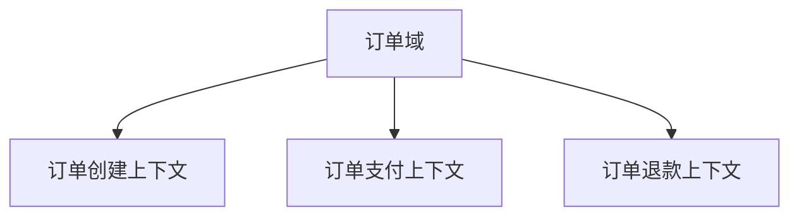

## 2. 上下文集成关系
| 上游上下文 | 下游上下文 | 集成方式 | 说明 |
|-----------|-----------|---------|------|
| | | API/MQ/共享数据库 | |
````

---

### 2.2 Level 1：业务域层（每域3个文件）

#### 文件清单

```
Level 1-业务域层/
├── 业务域01-订单域(order)/
│   ├── 01-业务域概览.md
│   ├── 02-上下文清单.md
│   └── 03-业务域总结.md
└── 业务域02-支付域(payment)/
    ├── 01-业务域概览.md
    ├── 02-上下文清单.md
    └── 03-业务域总结.md
```

#### 01-业务域概览.md

```markdown
# 业务域概览：订单域

## 1. 业务域基本信息
| 属性 | 值 |
|------|------|
| 业务域名称 | 订单域 |
| 英文标识 | order |
| 优先级 | P0 |
| 包含上下文数 | 3 |
| 核心概念 | Order、OrderItem、Payment |

## 2. 包含的上下文
| 上下文名称 | 优先级 | 说明 |
|-----------|--------|------|
| 订单创建 | P0 | 顾客下单、点餐 |
| 订单支付 | P0 | 收银结账 |
| 订单退款 | P1 | 退菜、退款 |

## 3. 核心概念汇总
| 概念 | 说明 | 涉及上下文 |
|------|------|-----------|
| Order | 订单聚合根 | 订单创建、订单支付、订单退款 |
| OrderItem | 订单明细实体 | 订单创建 |
| Payment | 支付聚合根 | 订单支付 |

## 4. 跨上下文关系
| 上下文A | 上下文B | 关系 |
|---------|---------|------|
| 订单创建 | 订单支付 | 订单创建后触发支付 |
| 订单支付 | 订单退款 | 已支付订单可退款 |
```

#### 02-上下文清单.md

```markdown
# 上下文清单：订单域

## 上下文汇总
| 上下文ID | 上下文名称 | 优先级 | 状态 | 核心发现 |
|----------|-----------|--------|------|----------|
| CTX001 | 订单创建 | P0 | ✅已完成 | 支持多商品、促销、会员折扣 |
| CTX002 | 订单支付 | P0 | ✅已完成 | 支持多支付方式、部分支付、反结账 |
| CTX003 | 订单退款 | P1 | ⏳待分析 | - |

## 待分析上下文
| 上下文ID | 上下文名称 | 计划分析时间 |
|----------|-----------|--------------|
| CTX003 | 订单退款 | 2026-09-10 |
```

#### 03-业务域总结.md

```markdown
# 业务域总结：订单域

## 1. 跨上下文一致性分析

### 1.1 状态机一致性
| 上下文 | 状态定义 | 一致性 |
|--------|----------|--------|
| 订单创建 | 待结账 | ✅一致 |
| 订单支付 | 待结账、已结账、已退款 | ✅一致 |
| 订单退款 | 已结账、已退款 | ✅一致 |

### 1.2 规则一致性
| 规则 | 上下文A | 上下文B | 是否冲突 |
|------|---------|---------|----------|
| 退款数量<=购买数量 | 订单支付 | 订单退款 | ✅一致 |

### 1.3 术语一致性
| 术语 | 上下文A含义 | 上下文B含义 | 统一方案 |
|------|------------|------------|----------|
| billNo | 订单号 | 账单号 | ⚠️不一致，统一为"订单号" |

## 2. 跨上下文的对象关系
| 对象 | 上下文A | 上下文B | 关系描述 |
|------|---------|---------|----------|
| Order | 订单创建 | 订单支付 | 创建后传递给支付 |

## 3. 业务域内模式识别
| 模式名称 | 描述 | 涉及上下文 |
|----------|------|-----------|
| 补偿模式 | 反结账、退款都使用补偿流程 | 订单支付、订单退款 |

## 4. 遗留问题清单
| 问题 | 影响 | 建议处理方式 |
|------|------|-------------|
| 术语不一致 | 沟通成本高 | 统一为"订单号" |
```

---

### 2.3 Level 2：上下文细节（每上下文13个文件，按 P0/P1/P2 分级裁剪）

#### 文件清单

```
Level 2-上下文细节/
├── 上下文-订单创建/
│   ├── 00-快速导航.md           ← 新增：一页纸概览
│   ├── 01-上下文概览.md
│   ├── 02-七要素提取.md
│   ├── 03-业务对象建模.md
│   ├── 04-业务逻辑分析.md
│   ├── 05-业务流程图.md
│   ├── 06-业务规则清单.md
│   ├── 07-规则依赖图.md
│   ├── 08-业务模式抽象.md
│   ├── 09-接口契约.md
│   ├── 10-扩展性评估.md
│   ├── 11-测试覆盖率.md         ← 新增：测试覆盖分析
│   └── 12-历史演化记录.md       ← 新增：历史变更追踪
```

#### 文件分级（按上下文优先级裁剪，避免一刀切）

| 分级 | 文件 | 适用上下文 |
|------|------|-----------|
| **P0 必做** | 00-快速导航、01-上下文概览、03-业务对象建模、04-业务逻辑分析、05-业务流程图、06-业务规则清单、09-接口契约 | P0 / P1 / P2 上下文都必须产出 |
| **P1 重要** | 02-七要素提取、07-规则依赖图、10-扩展性评估、11-测试覆盖率 | P0 / P1 上下文产出，P2 上下文可选 |
| **P2 增强** | 08-业务模式抽象、12-历史演化记录 | 仅 P0 上下文必须，其余可选 |

> **裁剪原则**：被裁剪的文件不是"不分析"，而是"不单独成文"——其结论压缩为 00-快速导航 中的一行摘要 + 指向辅助视角的链接。

#### 00-快速导航.md（新增）

> **定位**：一页纸导航卡。只放「摘要 + 链接」，禁止展开完整表格，所有细节链接到对应文件。与 01-上下文概览 的分工：00 回答「先看什么」，01 回答「是什么」。

````markdown
# 快速导航：订单创建上下文

> **一页纸概览**：核心发现、关键对象、主流程、高风险规则

---

## 1. 核心发现（Top 3）
1. **支持多商品点餐**：一个订单可包含多个商品
2. **促销规则复杂**：满减、折扣、优惠券可叠加
3. **会员折扣**：会员等级影响价格计算

## 2. 关键对象（Top 3）
| 对象 | 类型 | 说明 | 完整定义 |
|------|------|------|----------|
| Order | 聚合根 | 订单聚合根 | [Order聚合根完整对象树](../../辅助视角-按分析维度索引/01-对象建模全景/Order聚合根完整对象树.md) |
| OrderItem | 实体 | 订单明细 | [Order聚合根完整对象树](../../辅助视角-按分析维度索引/01-对象建模全景/Order聚合根完整对象树.md#orderitem) |
| Promotion | 值对象 | 促销信息 | [Promotion值对象](../../辅助视角-按分析维度索引/01-对象建模全景/Promotion值对象.md) |

## 3. 主流程（简化版）
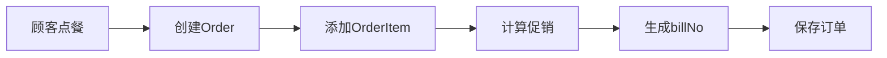

完整流程详见：[05-业务流程图.md](./05-业务流程图.md)

## 4. 高风险规则（Top 3）
| 规则ID | 规则 | 风险 | 证据 |
|--------|------|------|------|
| R001 | 促销规则优先级 | 计算错误导致价格错误 | [06-业务规则清单.md](./06-业务规则清单.md#r001) |
| R002 | 库存扣减时机 | 超卖风险 | [06-业务规则清单.md](./06-业务规则清单.md#r002) |
| R003 | 会员折扣与促销叠加 | 折扣冲突 | [06-业务规则清单.md](./06-业务规则清单.md#r003) |

## 5. 核心接口
| 接口 | 说明 | 契约详情 |
|------|------|----------|
| POST /order/create | 创建订单 | [09-接口契约.md](./09-接口契约.md#create-order) |

## 6. 技术债务（Top 2）
| 债务 | 影响 | 优先级 |
|------|------|--------|
| 促销计算逻辑散落在多处 | 难以维护 | P0 |
| 缺少订单创建领域事件 | 无法解耦 | P1 |

完整评估详见：[10-扩展性评估.md](./10-扩展性评估.md)
````

#### 01-上下文概览.md

> **定位**：事实性基本信息卡（属性、职责、实体、Service、技术栈）。对象、规则的详细定义一律链接到辅助视角，本文件只给一行说明。

```markdown
# 上下文概览：订单创建

## 1. 上下文基本信息
| 属性 | 值 |
|------|------|
| 上下文名称 | 订单创建 |
| 英文标识 | order-creation |
| 所属业务域 | 订单域 |
| 优先级 | P0 |
| 分析状态 | ✅已完成 |

## 2. 核心职责
创建订单、添加商品、计算价格、应用促销规则、生成订单号。

## 3. 主要实体
| 实体 | 类型 | 说明 |
|------|------|------|
| Order | 聚合根 | 订单 |
| OrderItem | 实体 | 订单明细 |

## 4. 关键Service
| Service | 说明 | 代码位置 |
|---------|------|----------|
| OrderService | 订单创建逻辑 | com.example.OrderService |
| PromotionService | 促销计算 | com.example.PromotionService |

## 5. 技术实现
| 技术 | 用途 |
|------|------|
| MyBatis | 数据持久化 |
| Redis | 订单号生成 |
| RocketMQ | 订单创建事件 |
```

#### 02-七要素提取.md

````markdown
# 七要素提取：订单创建

## 1. 主体（Who）

### 1.1 直接参与者
| 角色 | 代码标识 | 说明 |
|------|----------|------|
| 收银员 | Cashier | 操作POS创建订单 |
| 顾客 | Customer | 小程序自助点餐 |

### 1.2 间接参与者
| 角色 | 代码标识 | 说明 |
|------|----------|------|
| 促销服务 | PromotionService | 计算促销价格 |
| 库存服务 | InventoryService | 校验库存 |

---

## 2. 目标（What）

| 目标ID | 目标描述 | 优先级 |
|--------|----------|--------|
| G01 | 创建订单，锁定顾客需求 | P0 |
| G02 | 应用促销规则，计算优惠 | P0 |
| G03 | 生成唯一订单号 | P0 |

---

## 3. 规则（Rules）

| 规则ID | 规则描述 | 代码位置 | 置信度 | 优先级 |
|--------|----------|----------|--------|--------|
| R001 | 促销规则优先级：满减>折扣>优惠券 | PromotionService.java:45 | 高 | P0 |
| R002 | 订单金额必须>=0 | OrderValidator.java:23 | 高 | P0 |
| R003 | 会员折扣与促销可叠加 | MemberDiscountService.java:67 | 中 | P1 |

---

## 4. 协作（Collaboration）

### 4.1 直接协作
| 协作方 | 协作类型 | 协作内容 | 触发条件 |
|--------|----------|----------|----------|
| 促销服务 | 同步调用 | 计算促销价格 | 订单包含促销商品 |
| 库存服务 | 同步调用 | 校验库存 | 创建订单前 |
| 会员服务 | 同步调用 | 获取会员折扣 | 顾客是会员 |

### 4.2 时序图
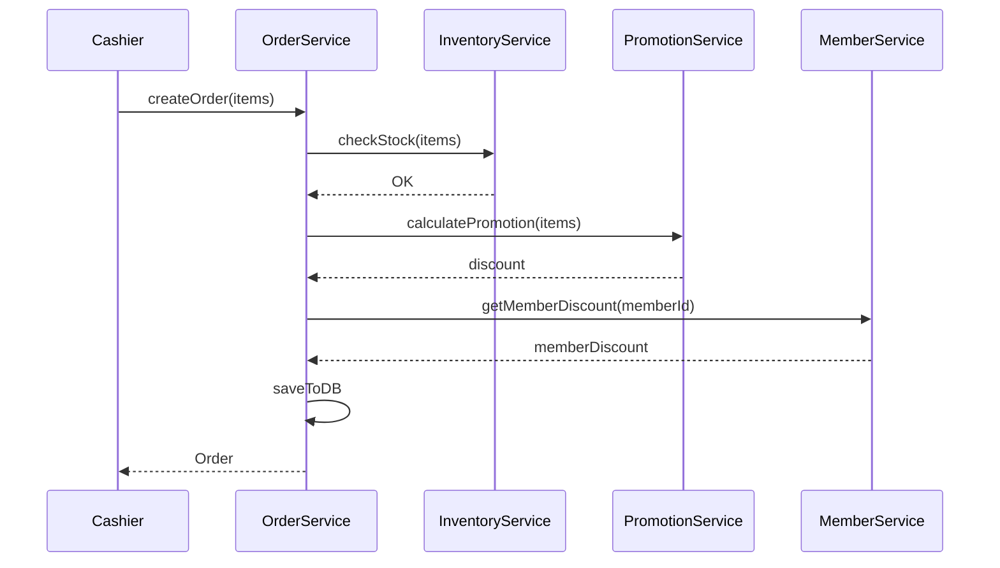

---

## 5. 时序（Timing）

| 约束ID | 约束描述 | 实现方式 |
|--------|----------|----------|
| T001 | 订单号生成必须唯一 | Redis INCR |
| T002 | 库存校验实时性<100ms | 缓存+异步同步 |
| T003 | 促销规则更新即时生效 | 配置中心推送 |

---

## 6. 资源（Resource）

### 6.1 消耗型资源
| 资源 | 生命周期 | 状态 |
|------|----------|------|
| 库存 | 订单创建时扣减 | 有限资源 |
| 优惠券 | 订单创建时核销 | 一次性资源 |

### 6.2 共享资源
| 资源 | 并发控制 | 说明 |
|------|----------|------|
| 订单号生成器 | Redis原子操作 | 全局唯一 |
| 促销规则 | 乐观锁 | 多线程读 |

---

## 7. 信息（Information）

| 信息ID | 信息描述 | 来源 | 去向 |
|--------|----------|------|------|
| I001 | 商品信息 | 商品服务 | 订单明细 |
| I002 | 促销信息 | 促销服务 | 订单总价 |
| I003 | 会员信息 | 会员服务 | 订单折扣 |
````

#### 03-业务对象建模.md

````markdown
# 业务对象建模：订单创建

> **本上下文视角**：只展示本上下文涉及的对象片段。完整定义详见辅助视角。

---

## 1. 对象清单

| 序号 | 树形路径 | 对象名/技术名 | 对象类型 | 父节点/聚合归属 | 来源证据 | 状态 | 处理去向 |
|------|----------|---------------|----------|------------------|----------|------|----------|
| 1 | 订单创建/Order | Order | 聚合根 | - | OrderEntity.java:12 | ✅已确认 | 进入实体卡 |
| 2 | 订单创建/Order/OrderItem | OrderItem | 实体 | Order | OrderItemEntity.java:8 | ✅已确认 | 进入实体卡 |
| 3 | 订单创建/Order/Address | Address | 值对象 | Order | Address.java:5 | ✅已确认 | 进入值对象卡 |

---

## 2. Order对象树（本上下文视角）

**完整定义详见**：[Order聚合根完整对象树](../../辅助视角-按分析维度索引/01-对象建模全景/Order聚合根完整对象树.md)

**本上下文关注的部分**：

### 2.1 核心属性
| 属性 | 类型 | 说明 | 约束 | 证据 |
|------|------|------|------|------|
| orderId | Long | 订单ID | PK | OrderEntity.java:12 |
| orderNo | String | 订单号 | 唯一索引 | OrderEntity.java:15 |
| items | List<OrderItem> | 订单明细 | 组合，非空 | OrderEntity.java:45 |
| totalAmount | BigDecimal | 订单总额 | >=0 | OrderEntity.java:23 |
| status | OrderStatus | 订单状态 | 枚举 | OrderEntity.java:18 |

### 2.2 订单创建相关方法
| 方法 | 输入 | 输出 | 业务含义 |
|------|------|------|----------|
| create() | items[] | Order | 创建订单 |
| addItem() | item | void | 添加商品 |
| removeItem() | itemId | void | 删除商品 |
| calculateTotal() | - | BigDecimal | 计算总价 |

### 2.3 领域事件
| 事件 | 触发 | 事件数据 |
|------|------|----------|
| OrderCreated | 创建成功 | {orderNo, items, totalAmount} |

---

## 3. OrderItem对象树（本上下文视角）

**完整定义详见**：[Order聚合根完整对象树](../../辅助视角-按分析维度索引/01-对象建模全景/Order聚合根完整对象树.md#orderitem)

**本上下文关注的部分**：

| 属性 | 类型 | 说明 | 约束 | 证据 |
|------|------|------|------|------|
| itemId | Long | 明细ID | PK | OrderItemEntity.java:10 |
| productId | Long | 商品ID | FK | OrderItemEntity.java:13 |
| productName | String | 商品名称 | 非空 | OrderItemEntity.java:16 |
| quantity | Integer | 数量 | >0 | OrderItemEntity.java:19 |
| price | BigDecimal | 单价 | >=0 | OrderItemEntity.java:22 |

---

## 4. 聚合边界

| 聚合根 | 包含对象 | 事务边界 |
|--------|-----------|----------|
| Order | OrderItem, Address | 订单创建操作原子性 |

---

## 5. 对象关系图（本上下文）

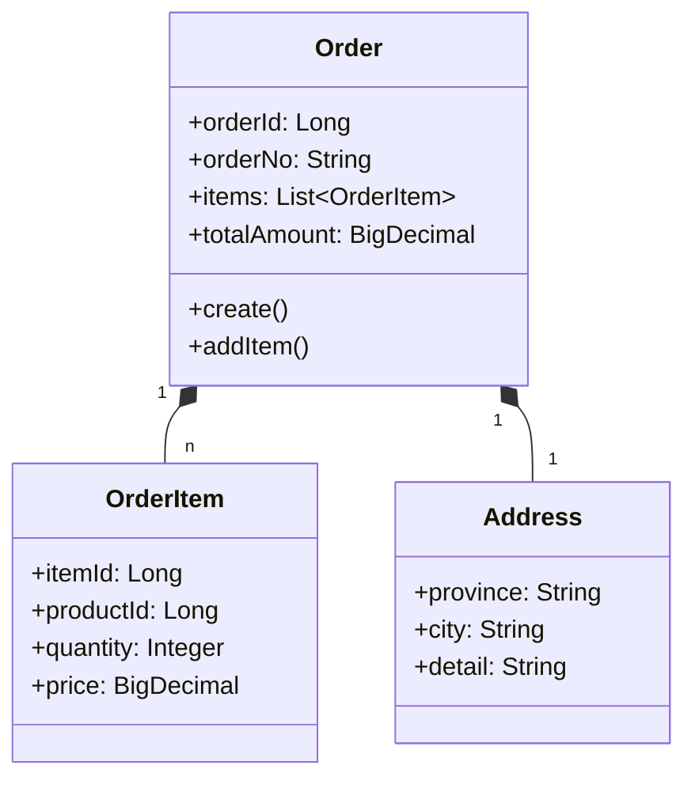
````

---

#### 04-业务逻辑分析.md

```markdown
# 业务逻辑分析：订单创建

## 1. 主流程

### 1.1 订单创建主流程

| 步骤 | 操作 | 代码位置 | 输入/输出 | 副作用 | 确定性 |
|------|------|----------|----------|--------|--------|
| 1 | 校验库存 | InventoryService.checkStock():45 | items[] / boolean | 无 | L4-多源一致 |
| 2 | 生成订单号 | OrderService.generateOrderNo():23 | - / orderNo | Redis INCR | L5-完全确定 |
| 3 | 计算促销 | PromotionService.calculate():67 | items, promotions / discount | 无 | L3-单源确定 |
| 4 | 创建订单 | OrderService.create():89 | orderData / Order | 写DB | L5-完全确定 |
| 5 | 发送事件 | OrderEventPublisher.publish():12 | OrderCreated | 写MQ | L4-多源一致 |

### 1.2 变体流

| 变体条件 | 代码中的判断位置 | 流程差异 | 状态变化 | 外部调用/事件 | 失败或未知结果 |
|----------|-----------------|----------|----------|----------------|----------------|
| 顾客是会员 | OrderService.java:102 | 额外调用会员服务计算折扣 | 无 | MemberService.getDiscount() | 会员服务不可用时使用默认折扣 |
| 使用优惠券 | OrderService.java:115 | 校验优惠券有效性并核销 | 优惠券status=已使用 | CouponService.validate() | 优惠券无效时拒绝创建 |

### 1.3 异常流

| 异常情况 | 触发条件/证据 | 捕获或未捕获位置 | 处理方式 | 对外结果 | 数据/状态影响 | 未确认项 |
|----------|----------------|------------------|----------|----------|--------------|----------|
| 库存不足 | InventoryService.checkStock() = false | OrderService.java:56 (已捕获) | 抛出InsufficientStockException | 返回错误码1001 | 无副作用 | - |
| 订单号生成失败 | Redis连接超时 | OrderService.java:28 (已捕获) | 重试3次，失败后回退到UUID | 继续创建订单 | 订单号格式异常 | 重试间隔未知 |
| 促销服务异常 | PromotionService调用超时 | OrderService.java:71 (已捕获) | 使用默认价格（无促销）| 订单创建成功但无优惠 | 数据正确性受影响 | 是否记录日志未知 |

### 1.4 补偿流

| 操作 | 跨系统副作用 | 补偿代码位置/未发现 | 触发条件 | 幂等键 | 重试边界 | 补偿失败处理 |
|------|----------------|-------------------|----------|--------|----------|--------------|
| 库存扣减 | 调用库存服务扣减库存 | OrderCompensationService.java:23 | 订单创建失败 | orderNo | 3次，间隔5s | 记录补偿失败日志，需人工介入 |
| 优惠券核销 | 优惠券status=已使用 | CouponCompensationService.java:45 | 订单创建失败 | couponId | 1次 | 回滚优惠券状态为未使用 |

---

## 2. 决策分析

### 2.1 决策矩阵：促销规则选择

> **数据源约定**：决策矩阵属于可枚举事实，登记在数据文件 `decisions.yaml` 中，本表由工具生成。权威版本与《辅助视角/02-流程分析全景/订单创建主流程.md》§8.1 同源，禁止两处各手改一份。

| 条件A：订单金额 | 条件B：会员等级 | 条件C：优惠券 | 结果 | 代码位置 |
|----------------|----------------|--------------|------|----------|
| >=100 | 金卡 | 有 | 满减+会员折扣+优惠券 | PromotionService.java:78 |
| >=100 | 普通 | 有 | 满减+优惠券 | PromotionService.java:82 |
| >=100 | 金卡 | 无 | 满减+会员折扣 | PromotionService.java:86 |
| <100 | 金卡 | 有 | 会员折扣+优惠券 | PromotionService.java:90 |
| <100 | 普通 | 有 | 优惠券 | PromotionService.java:94 |
| <100 | 普通 | 无 | 无优惠 | PromotionService.java:98 |

### 2.2 场景矩阵

| 场景 | 触发条件 | 代码位置 | 处理结果 |
|------|----------|----------|----------|
| 正常点餐 | 库存充足，无促销 | OrderService.java:45-67 | 创建订单，status=待结账 |
| 促销点餐 | 库存充足，有促销 | OrderService.java:68-98 | 创建订单，应用促销，status=待结账 |
| 会员点餐 | 顾客是会员 | OrderService.java:99-125 | 创建订单，应用会员折扣，status=待结账 |
| 库存不足 | 商品库存<购买数量 | OrderService.java:56-59 | 抛出异常，拒绝创建 |

---

## 3. 协作分析

### 3.1 服务协作

| 协作方 | 调用位置 | 调用方式 | 说明 |
|--------|----------|----------|------|
| InventoryService | OrderService.java:54 | Feign同步调用 | 校验库存 |
| PromotionService | OrderService.java:69 | Feign同步调用 | 计算促销 |
| MemberService | OrderService.java:103 | Feign同步调用 | 获取会员折扣 |
| OrderEventPublisher | OrderService.java:142 | 本地MQ发送 | 发送OrderCreated事件 |

### 3.2 权限控制

| 操作 | 权限要求 | 校验代码位置 |
|------|----------|-------------|
| 创建订单 | 登录收银员 | OrderController.java:23 @RequiresPermission("order:create") |
| 使用优惠券 | 顾客本人或收银员 | OrderService.java:117 |

### 3.3 异常处理

| 异常类型 | 捕获位置 | 处理代码 | 重试策略 |
|----------|----------|----------|----------|
| InsufficientStockException | OrderService.java:56 | 返回错误码1001 | 不重试 |
| PromotionServiceException | OrderService.java:71 | 使用默认价格 | 重试1次 |
| TimeoutException | OrderService.java:105 | 降级处理 | 重试3次 |
```

---

#### 05-业务流程图.md

````markdown
# 业务流程图：订单创建

## 1. 主流程图

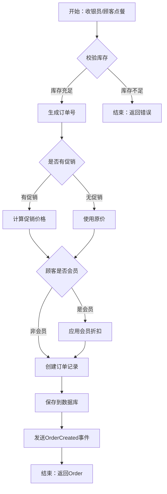

## 2. 变体流：使用优惠券

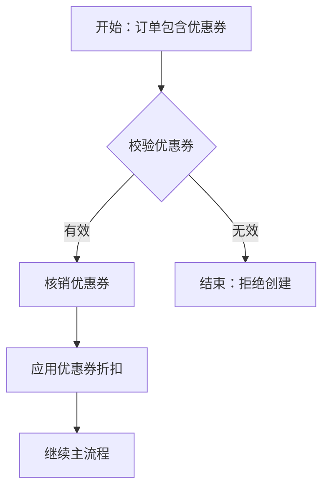

## 3. 异常流：库存不足

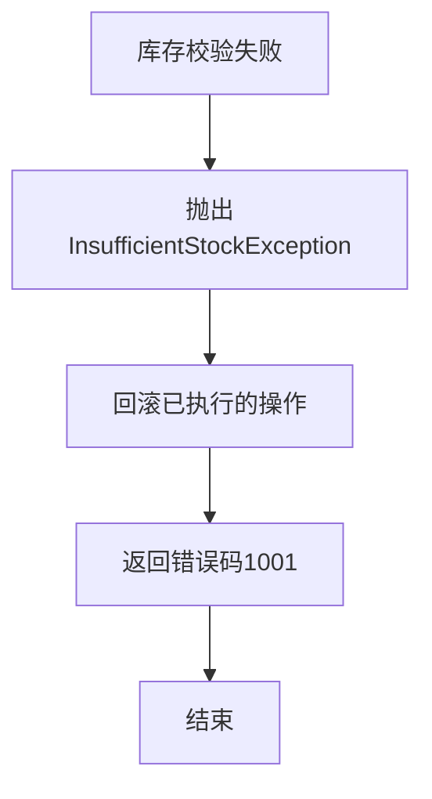

## 4. 补偿流：订单创建失败

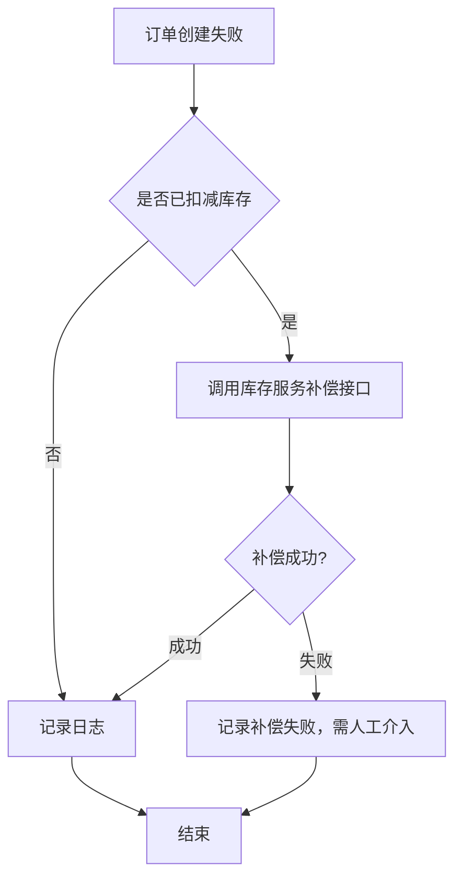

## 5. 时序图：完整交互

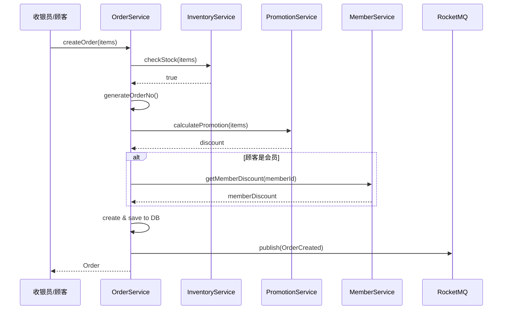

## 6. 状态转换图

> **权威定义**：[Order状态机.md](../../辅助视角-按分析维度索引/03-状态机全景/Order状态机.md)（状态清单、转换规则、非法转换、持久化均在彼处维护）。本上下文只补充与「创建」相关的片段：待创建 → 创建中 → 待结账；创建失败进入终态。
````

---

#### 06-业务规则清单.md

````markdown
# 业务规则清单：订单创建

## 1. 规则汇总

| 规则ID | 规则名称 | 规则描述 | 类型 | 置信度 | 优先级 |
|--------|----------|----------|------|--------|--------|
| R001 | 促销规则优先级 | 满减>折扣>优惠券 | 显性 | 高 | P0 |
| R002 | 订单金额约束 | 订单总额>=0 | 显性 | 高 | P0 |
| R003 | 库存校验 | 购买数量<=库存数量 | 显性 | 高 | P0 |
| R004 | 会员折扣叠加 | 会员折扣可与促销叠加 | 隐性 | 中 | P1 |
| R005 | 订单号唯一性 | 订单号全局唯一 | 显性 | 高 | P0 |

## 2. 规则详情

### R001：促销规则优先级

- **描述**：当订单同时满足多个促销条件时，按优先级依次计算：满减>折扣>优惠券
- **触发条件**：订单包含促销商品 OR 使用优惠券
- **执行逻辑**：
  1. 先计算满减（例如满100减20）
  2. 再计算折扣（例如8折）
  3. 最后应用优惠券（例如减5元）
- **代码位置**：`PromotionService.java:78-95`
- **关联概念**：Promotion（促销）、Coupon（优惠券）
- **依赖规则**：R002（订单金额约束）
- **互斥规则**：无
- **证据层级**：L4（多源一致）
- **待确认项**：是否支持三种促销同时使用？（当前代码支持，但业务规则文档未明确）

---

### R002：订单金额约束

- **描述**：订单总额必须>=0，即使应用所有促销后
- **触发条件**：订单创建时
- **执行逻辑**：
  ```java
  if (order.getTotalAmount().compareTo(BigDecimal.ZERO) < 0) {
    throw new IllegalArgumentException("订单金额不能小于0");
  }
  ```
- **代码位置**：`OrderValidator.java:23-26`
- **关联概念**：Order.totalAmount
- **依赖规则**：无
- **互斥规则**：无
- **证据层级**：L5（完全确定）
- **待确认项**：无

---

### R003：库存校验

- **描述**：创建订单前必须校验库存，购买数量不能超过库存数量
- **触发条件**：订单创建时
- **执行逻辑**：
  ```java
  for (OrderItem item : items) {
    if (item.getQuantity() > inventoryService.getStock(item.getProductId())) {
      throw new InsufficientStockException("库存不足");
    }
  }
  ```
- **代码位置**：`OrderService.java:54-59`
- **关联概念**：Inventory（库存）
- **依赖规则**：无
- **互斥规则**：无
- **证据层级**：L5（完全确定）
- **待确认项**：库存扣减时机是创建订单时还是支付成功后？（当前是创建时，待确认是否合理）

---

### R004：会员折扣叠加

- **描述**：会员折扣可以与促销叠加使用
- **触发条件**：顾客是会员 AND 订单有促销
- **执行逻辑**：
  ```java
  if (customer.isMember() && order.hasPromotion()) {
    discount = promotionDiscount + memberDiscount;
  }
  ```
- **代码位置**：`OrderService.java:103-107`
- **关联概念**：Member（会员）、Promotion（促销）
- **依赖规则**：R001（促销规则优先级）
- **互斥规则**：无
- **证据层级**：L3（单源确定）
- **待确认项**：是否有会员折扣上限？（代码未发现，待确认）

---

### R005：订单号唯一性

- **描述**：订单号全局唯一，使用Redis INCR生成
- **触发条件**：订单创建时
- **执行逻辑**：
  ```java
  String orderNo = "ORD" + redis.incr("order:no:seq");
  ```
- **代码位置**：`OrderService.java:23-25`
- **关联概念**：Order.orderNo
- **依赖规则**：无
- **互斥规则**：无
- **证据层级**：L5（完全确定）
- **待确认项**：Redis故障时的降级方案是否使用UUID？（代码有降级逻辑，但未确认是否合理）

---

## 3. 规则统计

| 置信度 | 数量 |
|--------|------|
| 高 | 4 |
| 中 | 1 |
| 低 | 0 |

| 优先级 | 数量 |
|--------|------|
| P0 | 4 |
| P1 | 1 |
| P2 | 0 |
````

---

#### 07-规则依赖图.md

````markdown
# 规则依赖图：订单创建

## 1. 规则依赖关系

### 1.1 依赖类型定义

| 依赖类型 | 含义 | 示例 |
|---------|------|------|
| 强依赖 | A必须先于B执行 | R003(库存校验) → R001(促销计算) |
| 弱依赖 | A和B顺序无关 | R002(金额约束) + R005(订单号唯一) |
| 互斥依赖 | A和B不能同时生效 | 无 |
| 条件依赖 | A在某条件下依赖B | R004(会员折扣) 条件依赖→ R001(促销规则) |

### 1.2 依赖图

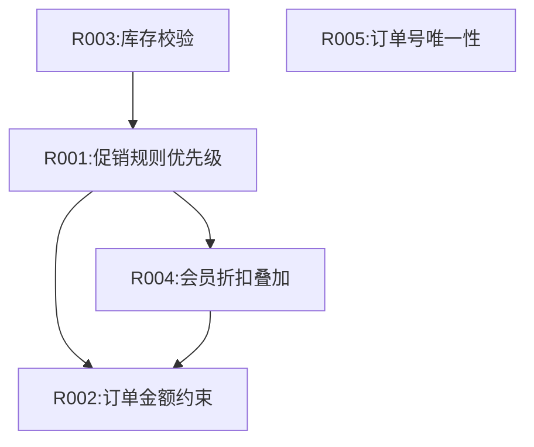

### 1.3 依赖矩阵

> **规模约束**：矩阵只适合规则数 ≤ 15 的场景。规则更多时只维护 `rules.yaml` 中的依赖边表 + 依赖图，矩阵由工具按需生成，禁止人工维护。

|      | R001 | R002 | R003 | R004 | R005 |
|------|------|------|------|------|------|
| R001 | -    | 强   | 被强 | 被条件 | 弱 |
| R002 | 被强 | -    | 弱   | 被强 | 弱 |
| R003 | 强   | 弱   | -    | 弱   | 弱 |
| R004 | 条件 | 强   | 弱   | -    | 弱 |
| R005 | 弱   | 弱   | 弱   | 弱   | -  |

**说明**：
- **强**：行规则必须在列规则之前执行
- **弱**：行列规则顺序无关
- **条件**：在特定条件下才有依赖

---

## 2. 规则冲突检测

### 2.1 互斥矩阵

|      | R001 | R002 | R003 | R004 | R005 |
|------|------|------|------|------|------|
| R001 | -    | ✅   | ✅   | ✅   | ✅   |
| R002 | ✅   | -    | ✅   | ✅   | ✅   |
| R003 | ✅   | ✅   | -    | ✅   | ✅   |
| R004 | ✅   | ✅   | ✅   | -    | ✅   |
| R005 | ✅   | ✅   | ✅   | ✅   | -    |

**说明**：
- ✅ = 无冲突
- ❌ = 有冲突

**结论**：本上下文所有规则之间无冲突。

---

## 3. 规则执行顺序

### 3.1 推荐执行顺序

| 顺序 | 规则ID | 规则名称 | 理由 |
|------|--------|----------|------|
| 1 | R005 | 订单号唯一性 | 先生成订单号，失败则整个流程终止 |
| 2 | R003 | 库存校验 | 库存不足则无需继续计算价格 |
| 3 | R001 | 促销规则优先级 | 计算促销价格 |
| 4 | R004 | 会员折扣叠加 | 在促销基础上应用会员折扣 |
| 5 | R002 | 订单金额约束 | 最后校验总金额是否合法 |

### 3.2 执行流程图

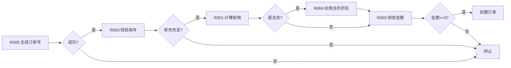

---

## 4. 规则变更影响分析

| 规则ID | 如果修改 | 影响的规则 | 影响范围 |
|--------|---------|-----------|---------|
| R001 | 促销优先级改变 | R004（会员折扣叠加）| 价格计算逻辑 |
| R002 | 金额约束放宽 | 无 | 订单创建校验 |
| R003 | 库存校验时机改变 | R001（促销计算）| 整个创建流程 |
| R004 | 会员折扣规则改变 | R002（金额约束）| 价格计算逻辑 |
| R005 | 订单号生成方式改变 | 无 | 订单号格式 |
````

---

#### 08-业务模式抽象.md

````markdown
# 业务模式抽象：订单创建

## 1. 模式清单

| 模式ID | 模式名称 | 模式类型 | 描述 |
|--------|----------|----------|------|
| P01 | 规则链模式 | 业务模式 | 促销规则按优先级依次执行 |
| P02 | 补偿模式 | 业务模式 | 订单创建失败时回滚库存和优惠券 |
| P03 | 降级模式 | 技术模式 | 外部服务不可用时使用默认值 |

## 2. 模式详情

### P01：规则链模式

- **类型**：业务模式（Rule Chain Pattern）
- **业务目的**：按优先级依次应用多个促销规则，每个规则可修改订单价格
- **触发条件**：订单包含促销商品 OR 使用优惠券
- **处理逻辑**：
  1. 按优先级排序所有适用规则
  2. 依次执行每个规则
  3. 每个规则接收上一个规则的输出作为输入
- **变体点**：
  - **变体A（严格链）**：任一规则失败则整个链终止
  - **变体B（宽松链）**：规则失败时跳过，继续执行下一个
  - **当前实现**：变体B（宽松链）
- **模式接口**：
  - **输入**：Order, List<PromotionRule>
  - **输出**：Order（价格已修改）
- **代码证据**：
  - `PromotionService.java:78-95`
  - `PromotionRule.java:12-23`（规则接口）
- **适用边界**：只适用于价格相关规则，不适用于库存、权限等规则
- **未来扩展点**：
  - 可增加规则配置化（从数据库读取）
  - 可增加规则版本控制（支持A/B测试）

---

### P02：补偿模式

- **类型**：业务模式（Compensation Pattern / Saga Pattern）
- **业务目的**：订单创建涉及多个外部服务（库存、优惠券），失败时需回滚已执行的操作
- **触发条件**：订单创建过程中任一步骤失败
- **处理逻辑**：
  1. 记录每个步骤的补偿操作
  2. 失败时逆序执行补偿操作
  3. 补偿失败时记录日志，需人工介入
- **变体点**：
  - **变体A（同步补偿）**：立即执行补偿
  - **变体B（异步补偿）**：通过MQ异步执行
  - **当前实现**：变体A（同步补偿）
- **模式接口**：
  - **输入**：CompensationContext（包含已执行的操作）
  - **输出**：CompensationResult（补偿结果）
- **代码证据**：
  - `OrderCompensationService.java:23-45`
  - `CouponCompensationService.java:45-67`
- **适用边界**：只适用于可逆操作（库存、优惠券），不适用于不可逆操作（已发货）
- **未来扩展点**：
  - 可改为异步补偿（提升性能）
  - 可增加补偿重试机制

---

### P03：降级模式

- **类型**：技术模式（Degradation Pattern）
- **技术目的**：外部服务不可用时使用默认值，保证订单创建不被阻塞
- **触发条件**：外部服务调用超时或异常
- **处理逻辑**：
  1. 捕获外部服务异常
  2. 使用预设的默认值
  3. 记录降级日志
- **变体点**：
  - **变体A（固定默认值）**：使用硬编码的默认值
  - **变体B（动态默认值）**：从配置中心读取
  - **当前实现**：变体A（固定默认值）
- **模式接口**：
  - **输入**：ServiceException
  - **输出**：DefaultValue
- **代码证据**：
  - `OrderService.java:71-75`（促销服务降级）
  - `OrderService.java:105-109`（会员服务降级）
- **适用边界**：只适用于非关键服务（促销、会员），不适用于关键服务（库存）
- **未来扩展点**：
  - 可增加降级开关（配置中心控制）
  - 可增加降级监控告警

---

## 3. 模式关系图

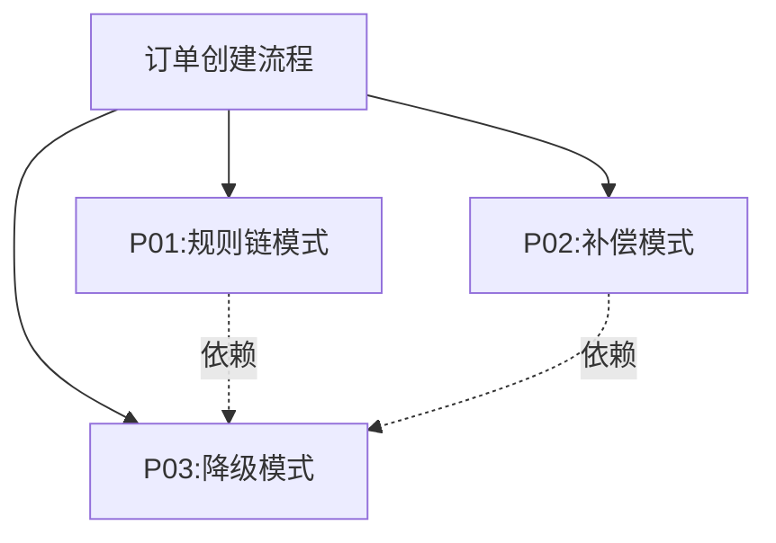

## 4. 模式应用统计

| 模式类型 | 数量 |
|---------|------|
| 业务模式 | 2 |
| 技术模式 | 1 |

---

## 5. DDD战术设计模式

### 5.1 聚合（Aggregate）

- **聚合根**：Order
- **包含实体**：OrderItem
- **包含值对象**：Address, Promotion
- **聚合边界**：Order及其明细作为一个事务边界

### 5.2 领域服务（Domain Service）

- **服务名称**：PromotionCalculator
- **职责**：计算促销价格（跨多个聚合根）
- **代码位置**：`PromotionService.java`

### 5.3 仓储（Repository）

- **仓储名称**：OrderRepository
- **职责**：Order聚合的持久化
- **代码位置**：`OrderMapper.java`

### 5.4 工厂（Factory）

- **工厂名称**：OrderFactory
- **职责**：创建Order聚合（包含复杂初始化逻辑）
- **代码位置**：`OrderService.create()`（内嵌工厂逻辑）

### 5.5 领域事件（Domain Event）

- **事件名称**：OrderCreated
- **触发时机**：订单创建成功后
- **事件数据**：{orderNo, items, totalAmount}
- **订阅方**：库存服务（扣减库存）、积分服务（赠送积分）
````

---

#### 09-接口契约.md

````markdown
# 接口契约：订单创建

## 1. 对外接口清单

| 接口ID | 接口名称 | 接口类型 | 说明 |
|--------|----------|----------|------|
| API001 | 创建订单 | REST API | POST /order/create |
| API002 | 添加商品 | REST API | POST /order/addItem |
| API003 | 删除商品 | REST API | POST /order/removeItem |
| EVENT001 | 订单创建事件 | MQ事件 | OrderCreated |

---

## 2. API001：创建订单

### 2.1 基本信息

| 属性 | 值 |
|------|------|
| 接口名称 | 创建订单 |
| 接口路径 | POST /order/create |
| 请求方式 | POST |
| Content-Type | application/json |
| 认证方式 | JWT Token |
| 权限要求 | order:create |

### 2.2 请求参数

```json
{
  "items": [                    // 必填，订单明细
    {
      "productId": 1001,        // 必填，商品ID
      "productName": "商品A",   // 必填，商品名称
      "quantity": 2,            // 必填，数量，>0
      "price": 50.00            // 必填，单价，>=0
    }
  ],
  "memberId": 10001,            // 选填，会员ID
  "couponId": 20001,            // 选填，优惠券ID
  "address": {                  // 选填，配送地址
    "province": "广东省",
    "city": "深圳市",
    "detail": "南山区XX路XX号"
  }
}
```

### 2.3 响应参数

**成功响应（200）**：

```json
{
  "code": 0,
  "message": "success",
  "data": {
    "orderId": 123456,
    "orderNo": "ORD202609051234567890",
    "totalAmount": 90.00,       // 应付金额
    "discountAmount": 10.00,    // 优惠金额
    "paidAmount": 0.00,         // 实付金额（创建时为0）
    "status": "PENDING_PAY",    // 订单状态
    "createdTime": "2026-09-05T18:30:00"
  }
}
```

**失败响应**：

| 错误码 | 说明 | HTTP状态码 |
|--------|------|-----------|
| 1001 | 库存不足 | 400 |
| 1002 | 优惠券无效 | 400 |
| 1003 | 订单金额非法 | 400 |
| 1004 | 商品不存在 | 404 |
| 5000 | 系统内部错误 | 500 |

```json
{
  "code": 1001,
  "message": "库存不足：商品[1001]库存剩余5件，购买数量10件",
  "data": null
}
```

### 2.4 调用示例

```bash
curl -X POST "https://api.example.com/order/create" \
  -H "Content-Type: application/json" \
  -H "Authorization: Bearer <token>" \
  -d '{
    "items": [
      {
        "productId": 1001,
        "productName": "商品A",
        "quantity": 2,
        "price": 50.00
      }
    ],
    "memberId": 10001
  }'
```

### 2.5 幂等性

- **幂等键**：前端生成UUID，放在Header `X-Request-Id`
- **幂等时长**：24小时
- **幂等逻辑**：相同请求ID在24小时内返回相同结果

### 2.6 调用方清单

| 调用方 | 调用场景 | 预计QPS |
|--------|---------|---------|
| POS收银系统 | 收银员点餐 | 100 |
| 小程序 | 顾客自助点餐 | 200 |

### 2.7 SLA承诺

| 指标 | 目标值 |
|------|--------|
| 响应时间（P99）| <500ms |
| 可用性 | 99.9% |
| 错误率 | <0.1% |

---

## 3. EVENT001：订单创建事件

### 3.1 基本信息

| 属性 | 值 |
|------|------|
| 事件名称 | 订单创建事件 |
| 事件类型 | OrderCreated |
| MQ类型 | RocketMQ |
| Topic | order-events |
| Tag | OrderCreated |

### 3.2 事件数据

```json
{
  "eventId": "evt-123456",              // 事件ID，唯一
  "eventType": "OrderCreated",          // 事件类型
  "eventTime": "2026-09-05T18:30:00",   // 事件时间
  "aggregateId": "ORD202609051234567890", // 聚合根ID（订单号）
  "aggregateType": "Order",             // 聚合根类型
  "version": 1,                         // 聚合根版本
  "payload": {                          // 事件载荷
    "orderId": 123456,
    "orderNo": "ORD202609051234567890",
    "items": [
      {
        "productId": 1001,
        "productName": "商品A",
        "quantity": 2,
        "price": 50.00
      }
    ],
    "totalAmount": 90.00,
    "memberId": 10001
  }
}
```

### 3.3 订阅方清单

| 订阅方 | 订阅目的 | 消费逻辑 |
|--------|---------|---------|
| 库存服务 | 扣减库存 | 根据items扣减库存 |
| 积分服务 | 赠送积分 | 根据totalAmount计算积分 |
| 数据分析服务 | 统计分析 | 记录订单创建事件 |

### 3.4 消费幂等

- **幂等键**：eventId
- **幂等时长**：7天
- **幂等逻辑**：相同eventId只处理一次

---

## 4. 接口版本管理

| 版本 | 发布时间 | 变更内容 | 兼容性 |
|------|---------|---------|--------|
| v1.0 | 2024-01-01 | 初始版本 | - |
| v1.1 | 2025-03-15 | 增加address字段 | 向后兼容 |
| v2.0 | 2026-06-01 | 修改items结构 | ⚠️不兼容 |

---

## 5. 接口依赖

### 5.1 本接口依赖的外部接口

| 外部接口 | 提供方 | 用途 | 超时时间 | 降级策略 |
|---------|--------|------|---------|---------|
| GET /inventory/check | 库存服务 | 校验库存 | 100ms | 无降级，失败则拒绝创建 |
| POST /promotion/calculate | 促销服务 | 计算促销 | 200ms | 使用原价 |
| GET /member/discount | 会员服务 | 获取会员折扣 | 150ms | 使用默认折扣0% |

### 5.2 调用本接口的外部系统

| 外部系统 | 调用场景 | 调用频率 | 备注 |
|---------|---------|---------|------|
| POS收银系统 | 收银员点餐 | 100 QPS | 内部系统 |
| 小程序 | 顾客自助点餐 | 200 QPS | 外部系统 |

---

## 6. 接口测试

### 6.1 测试用例清单

| 用例ID | 场景 | 输入 | 预期输出 | 状态 |
|--------|------|------|----------|------|
| TC001 | 正常创建 | 库存充足，无促销 | 创建成功 | ✅已覆盖 |
| TC002 | 库存不足 | 库存<购买数量 | 返回错误1001 | ✅已覆盖 |
| TC003 | 使用优惠券 | 有效优惠券 | 创建成功，价格扣减 | ✅已覆盖 |
| TC004 | 会员折扣 | 顾客是会员 | 创建成功，应用折扣 | ✅已覆盖 |
| TC005 | 促销叠加 | 满减+折扣+优惠券 | 创建成功，按优先级计算 | ⏸️待覆盖 |

### 6.2 压力测试

| 指标 | 目标值 | 实测值 | 状态 |
|------|--------|--------|------|
| QPS | 300 | 280 | ✅通过 |
| P99响应时间 | <500ms | 450ms | ✅通过 |
| 错误率 | <0.1% | 0.05% | ✅通过 |
````

---

#### 10-扩展性评估.md

```markdown
# 扩展性评估：订单创建

## 1. 扩展性评分（五星制）

| 维度 | 评分 | 说明 |
|------|------|------|
| 规则扩展性 | ★★★☆☆ | 促销规则部分硬编码，需修改代码 |
| 概念扩展性 | ★★★★☆ | 新增商品类型只需配置 |
| 流程扩展性 | ★★☆☆☆ | 流程写死在Service中，难以扩展 |
| 集成扩展性 | ★★★★☆ | 通过Feign集成，易于对接新服务 |
| **总分** | **63分** | (3×0.3 + 4×0.25 + 2×0.25 + 4×0.2) × 20 = 63 |

---

## 2. 规则扩展性（★★★☆☆）

### 2.1 当前状态

- **配置化率**：30%
  - 可配置：促销规则的参数（满减金额、折扣比例）
  - 硬编码：促销规则的优先级、规则组合逻辑
- **新增规则成本**：需修改`PromotionService.java`，约20行代码

### 2.2 扩展场景

| 场景 | 当前实现 | 改动范围 | 工作量 |
|------|---------|---------|--------|
| 新增促销类型（例如"第二件半价"）| 硬编码在PromotionService | 需修改Service代码 | 2人天 |
| 修改促销优先级 | 硬编码在PromotionService | 需修改Service代码 | 0.5人天 |
| 新增会员等级折扣 | 硬编码在MemberService | 需修改Service代码 | 1人天 |

### 2.3 改进建议

- **P0**：将促销规则抽象为配置（从数据库读取）
- **P1**：支持规则编排（规则引擎）
- **P2**：支持规则版本控制（A/B测试）

---

## 3. 概念扩展性（★★★★☆）

### 3.1 当前状态

- **配置化率**：80%
  - 可配置：商品类型、会员等级、支付方式
  - 硬编码：订单状态、订单类型
- **新增概念成本**：大部分只需配置，少量需修改枚举

### 3.2 扩展场景

| 场景 | 当前实现 | 改动范围 | 工作量 |
|------|---------|---------|--------|
| 新增商品类型 | 数据库配置 | 只需配置 | 0.1人天 |
| 新增会员等级 | 数据库配置 | 只需配置 | 0.1人天 |
| 新增订单状态 | 枚举硬编码 | 需修改枚举和状态机 | 1人天 |
| 新增支付方式 | 数据库配置 | 只需配置 | 0.2人天 |

### 3.3 改进建议

- **P0**：订单状态改为配置化（支持租户自定义状态）
- **P1**：订单类型改为配置化

---

## 4. 流程扩展性（★★☆☆☆）

### 4.1 当前状态

- **配置化率**：10%
  - 可配置：外部服务的超时时间
  - 硬编码：流程步骤、步骤顺序、分支逻辑
- **新增流程成本**：需修改`OrderService.create()`，约50行代码

### 4.2 扩展场景

| 场景 | 当前实现 | 改动范围 | 工作量 |
|------|---------|---------|--------|
| 新增流程步骤（例如"风控校验"）| 硬编码在OrderService | 需修改Service代码 | 2人天 |
| 调整流程顺序 | 硬编码在OrderService | 需修改Service代码 | 1人天 |
| 支持多租户定制流程 | 不支持 | 需重构 | 10人天 |

### 4.3 改进建议

- **P0**：引入流程引擎（例如Flowable）
- **P1**：流程步骤配置化
- **P2**：支持多租户定制流程

---

## 5. 集成扩展性（★★★★☆）

### 5.1 当前状态

- **集成方式**：Feign同步调用、RocketMQ异步事件
- **新增集成成本**：只需定义Feign接口，约10行代码

### 5.2 扩展场景

| 场景 | 当前实现 | 改动范围 | 工作量 |
|------|---------|---------|--------|
| 对接新的促销服务 | Feign接口 | 只需定义接口 | 0.5人天 |
| 增加新的事件订阅方 | RocketMQ | 订阅方自行订阅 | 0人天 |
| 对接第三方支付 | Feign接口 | 只需定义接口 | 1人天 |

### 5.3 改进建议

- **P1**：增加API网关（统一鉴权、限流、熔断）
- **P2**：支持多协议集成（gRPC、WebSocket）

---

## 6. 技术债务清单（引用视图）

> **登记规则**：TD 编号全局唯一，权威登记处是[辅助视角/06-架构视图全景/技术债务清单.md](../../辅助视角-按分析维度索引/06-架构视图全景/技术债务清单.md)。本表只做"引用 + 本上下文相关性说明"：**ID 带链接 = 引用，裸 ID = 定义**，`check-artifacts.py` 据此检查撞号。完整定义（影响、工作量、负责人、状态）见全景清单，禁止复制整表。

| 债务ID（引用） | 本上下文相关性 | 优先级 |
|---------------|----------------|--------|
| [TD001](../../辅助视角-按分析维度索引/06-架构视图全景/技术债务清单.md) | 促销规则硬编码——直接命中本上下文的促销计算逻辑 | P0 |
| [TD002](../../辅助视角-按分析维度索引/06-架构视图全景/技术债务清单.md) | 流程步骤硬编码——本上下文主流程无法配置化 | P0 |
| [TD003](../../辅助视角-按分析维度索引/06-架构视图全景/技术债务清单.md) | 缺少订单创建领域事件——即本上下文缺失的解耦事件 | P1 |

> 本上下文**新发现**的债务：先在全景清单注册获得 TD 编号，再回填到此表。

---

## 7. 架构演进建议

### 7.1 短期（3个月内）

- [ ] 促销规则配置化（TD001）
- [ ] 增加订单创建领域事件（TD003）
- [ ] 增加API网关（TD004）

### 7.2 中期（6-12个月）

- [ ] 流程步骤配置化（TD002）
- [ ] 引入规则引擎（TD001增强）

### 7.3 长期（1年以上）

- [ ] 引入流程引擎（TD005）
- [ ] 支持多租户定制流程

---

## 8. 风险评估

| 风险 | 可能性 | 影响 | 应对措施 |
|------|--------|------|----------|
| 促销规则频繁变更 | 高 | 高 | 立即配置化 |
| 流程步骤需定制 | 中 | 高 | 中期引入流程引擎 |
| 外部服务不可用 | 中 | 中 | 已有降级策略 |
| 并发超卖 | 低 | 高 | 库存服务已有锁机制 |
```

---

#### 11-测试覆盖率.md（新增）

```markdown
# 测试覆盖率：订单创建

## 1. 测试覆盖率统计

| 测试类型 | 覆盖率 | 已覆盖 | 未覆盖 | 目标 |
|---------|--------|--------|--------|------|
| 单元测试 | 75% | 30个用例 | 10个缺口 | 80% |
| 集成测试 | 60% | 12个用例 | 8个缺口 | 70% |
| E2E测试 | 50% | 5个场景 | 5个缺口 | 60% |

---

## 2. 规则测试覆盖矩阵

| 规则ID | 规则名称 | 测试用例 | 覆盖状态 | 测试代码位置 |
|--------|----------|----------|----------|-------------|
| R001 | 促销规则优先级 | TC_R001_01, TC_R001_02 | ✅已覆盖 | OrderServiceTest.java:45 |
| R002 | 订单金额约束 | TC_R002_01 | ✅已覆盖 | OrderValidatorTest.java:23 |
| R003 | 库存校验 | TC_R003_01, TC_R003_02 | ✅已覆盖 | OrderServiceTest.java:67 |
| R004 | 会员折扣叠加 | - | ❌未覆盖 | - |
| R005 | 订单号唯一性 | TC_R005_01 | ✅已覆盖 | OrderServiceTest.java:89 |

**未覆盖规则**：R004（会员折扣叠加）

---

## 3. 流程分支测试覆盖矩阵

| 流程分支 | 测试用例 | 覆盖状态 | 测试代码位置 |
|---------|----------|----------|-------------|
| 主流程：正常创建 | TC_FLOW_01 | ✅已覆盖 | OrderE2ETest.java:12 |
| 变体流：使用优惠券 | TC_FLOW_02 | ✅已覆盖 | OrderE2ETest.java:34 |
| 变体流：会员折扣 | TC_FLOW_03 | ✅已覆盖 | OrderE2ETest.java:56 |
| 异常流：库存不足 | TC_FLOW_04 | ✅已覆盖 | OrderE2ETest.java:78 |
| 异常流：促销服务异常 | - | ❌未覆盖 | - |
| 补偿流：订单创建失败 | TC_FLOW_05 | ✅已覆盖 | OrderCompensationTest.java:23 |

**未覆盖分支**：异常流（促销服务异常）

---

## 4. 对象测试覆盖

### 4.1 Order聚合根

| 方法 | 测试用例 | 覆盖状态 | 测试代码位置 |
|------|----------|----------|-------------|
| create() | TC_ORDER_01 | ✅已覆盖 | OrderTest.java:12 |
| addItem() | TC_ORDER_02 | ✅已覆盖 | OrderTest.java:23 |
| removeItem() | TC_ORDER_03 | ✅已覆盖 | OrderTest.java:34 |
| calculateTotal() | TC_ORDER_04 | ✅已覆盖 | OrderTest.java:45 |
| settle() | - | ❌未覆盖 | - |

**未覆盖方法**：settle()（属于订单支付上下文）

### 4.2 OrderItem实体

| 方法 | 测试用例 | 覆盖状态 | 测试代码位置 |
|------|----------|----------|-------------|
| updateQuantity() | TC_ITEM_01 | ✅已覆盖 | OrderItemTest.java:12 |
| updatePrice() | TC_ITEM_02 | ✅已覆盖 | OrderItemTest.java:23 |

---

## 5. 接口测试覆盖

### 5.1 API测试

| 接口 | 测试场景 | 测试用例 | 覆盖状态 |
|------|---------|----------|----------|
| POST /order/create | 正常创建 | TC_API_01 | ✅已覆盖 |
| POST /order/create | 库存不足 | TC_API_02 | ✅已覆盖 |
| POST /order/create | 优惠券无效 | TC_API_03 | ✅已覆盖 |
| POST /order/create | 并发创建 | - | ❌未覆盖 |

**未覆盖场景**：并发创建（压力测试）

### 5.2 事件测试

| 事件 | 测试场景 | 测试用例 | 覆盖状态 |
|------|---------|----------|----------|
| OrderCreated | 事件发送 | TC_EVENT_01 | ✅已覆盖 |
| OrderCreated | 事件消费 | TC_EVENT_02 | ✅已覆盖 |
| OrderCreated | 消费幂等 | - | ❌未覆盖 |

**未覆盖场景**：消费幂等

---

## 6. 未覆盖清单（引用视图）

> **登记规则**：GAP 编号全局唯一，权威汇总处是[辅助视角/08-质量分析全景/00-测试覆盖率汇总.md](../../辅助视角-按分析维度索引/08-质量分析全景/00-测试覆盖率汇总.md)。ID 带链接 = 引用，裸 ID = 定义；负责人与状态以全景汇总为准，本表不复制。

| 缺口ID（引用） | 本上下文相关性 | 优先级 |
|---------------|----------------|--------|
| [GAP001](../../辅助视角-按分析维度索引/08-质量分析全景/00-测试覆盖率汇总.md) | R004规则未覆盖——本上下文会员折扣叠加规则无测试 | P0 |
| [GAP002](../../辅助视角-按分析维度索引/08-质量分析全景/00-测试覆盖率汇总.md) | 促销服务异常流程未覆盖——本上下文降级分支无测试 | P0 |
| [GAP003](../../辅助视角-按分析维度索引/08-质量分析全景/00-测试覆盖率汇总.md) | 并发创建场景未覆盖——本上下文订单号生成并发风险 | P1 |
| [GAP004](../../辅助视角-按分析维度索引/08-质量分析全景/00-测试覆盖率汇总.md) | 事件消费幂等未覆盖——OrderCreated重复消费风险 | P1 |

---

## 7. 测试质量评估

### 7.1 代码覆盖率（Jacoco）

| 指标 | 当前值 | 目标值 | 状态 |
|------|--------|--------|------|
| 行覆盖率 | 75% | 80% | ⚠️未达标 |
| 分支覆盖率 | 68% | 70% | ⚠️未达标 |
| 方法覆盖率 | 82% | 80% | ✅达标 |

### 7.2 测试稳定性

| 指标 | 当前值 | 目标值 | 状态 |
|------|--------|--------|------|
| 测试通过率 | 95% | 98% | ⚠️未达标 |
| 测试执行时间 | 120s | <180s | ✅达标 |
| Flaky测试数 | 2个 | 0个 | ⚠️未达标 |

**Flaky测试清单**：
- TC_ORDER_05：偶尔超时（原因：外部服务不稳定）
- TC_EVENT_02：偶尔失败（原因：MQ消费延迟）

---

## 8. 改进计划

### 8.1 短期（1周内）

- [ ] 补充R004规则测试（GAP001）
- [ ] 补充促销服务异常流程测试（GAP002）

### 8.2 中期（1个月内）

- [ ] 补充并发创建场景测试（GAP003）
- [ ] 补充事件消费幂等测试（GAP004）
- [ ] 修复Flaky测试

### 8.3 长期（3个月内）

- [ ] 行覆盖率提升到80%
- [ ] 分支覆盖率提升到70%
- [ ] 测试通过率提升到98%
```

---

#### 12-历史演化记录.md（新增）

````markdown
# 历史演化记录：订单创建

## 1. 版本历史

| 版本 | 发布时间 | 主要变更 | 影响范围 |
|------|---------|---------|---------|
| v1.0 | 2024-01-01 | 初始版本 | - |
| v1.1 | 2024-03-15 | 增加会员折扣功能 | Order对象、PromotionService |
| v1.2 | 2024-06-20 | 增加优惠券功能 | Order对象、CouponService |
| v2.0 | 2025-01-10 | 订单状态机重构 | OrderStatus枚举、状态转换逻辑 |
| v2.1 | 2025-09-05 | 增加补偿流程 | OrderCompensationService |
| v3.0 | 2026-06-01 | 支持多商品类型 | OrderItem对象、商品分类 |

---

## 2. 对象演化历史

### 2.1 Order聚合根演化

| 版本 | 字段变更 | 说明 |
|------|---------|------|
| v1.0 | 初始字段：orderId, orderNo, totalAmount, status | 初始版本 |
| v1.1 | 增加：memberId, memberDiscount | 支持会员折扣 |
| v1.2 | 增加：couponId, couponDiscount | 支持优惠券 |
| v2.0 | 修改：status枚举值变更 | 状态机重构 |
| v3.0 | 增加：address | 支持配送地址 |

### 2.2 OrderStatus状态机演化

**v1.0-v1.2**：

```
待结账 → 已结账 → 已完成
  ↓
已取消
```

**v2.0+**（当前版本）：

```
待结账 ──支付──► 已结账 ──退款──► 已退款
  │                       ▲
  └──反结账──► 待结账 ◄────┘
  │
  └──取消──► 已取消
```

**变更说明**：
- 增加"反结账"功能（v2.0）
- 增加"已退款"状态（v2.0）
- 已结账可反结账回到待结账（v2.0）

---

## 3. 规则演化历史

### 3.1 R001：促销规则优先级

| 版本 | 规则内容 | 变更说明 |
|------|---------|---------|
| v1.0 | 满减>折扣 | 初始版本 |
| v1.2 | 满减>折扣>优惠券 | 增加优惠券 |
| v2.1 | 满减>折扣>优惠券（可并发）| 支持并发计算 |

### 3.2 R003：库存校验

| 版本 | 扣减时机 | 变更说明 |
|------|---------|---------|
| v1.0 | 订单创建时扣减 | 初始版本 |
| v2.1 | 订单创建时预扣减，支付成功后确认扣减，支付失败后补偿回滚 | 增加补偿逻辑 |

---

## 4. 流程演化历史

### 4.1 主流程演化

**v1.0**：
```
生成订单号 → 创建订单 → 保存DB
```

**v1.1**：
```
生成订单号 → 计算促销 → 应用会员折扣 → 创建订单 → 保存DB
```

**v2.1**（当前版本）：
```
生成订单号 → 校验库存 → 计算促销 → 应用会员折扣 → 创建订单 → 保存DB → 发送事件
```

**变更说明**：
- v1.1：增加促销和会员折扣计算
- v2.1：增加库存校验和事件发送

---

## 5. 接口演化历史

### 5.1 POST /order/create

**v1.0请求参数**：
```json
{
  "items": [...]
}
```

**v1.1请求参数**：
```json
{
  "items": [...],
  "memberId": 10001  // 新增
}
```

**v3.0请求参数**（当前版本）：
```json
{
  "items": [...],
  "memberId": 10001,
  "couponId": 20001,  // v1.2新增
  "address": {...}    // v3.0新增
}
```

**兼容性说明**：
- v1.0 → v1.1：向后兼容（memberId可选）
- v1.1 → v1.2：向后兼容（couponId可选）
- v1.2 → v3.0：向后兼容（address可选）

---

## 6. 废弃功能清单

| 功能 | 废弃版本 | 废弃原因 | 迁移方案 |
|------|---------|---------|---------|
| createOrderV1() | v2.0 | 状态机重构 | 使用createOrder() |
| OrderOldStatus枚举 | v2.0 | 状态机重构 | 使用OrderStatus |
| syncInventory() | v2.1 | 改为异步事件 | 订阅OrderCreated事件 |

### 6.1 废弃代码位置

| 代码 | 文件位置 | 状态 |
|------|---------|------|
| createOrderV1() | OrderService.java:234-289 | ⚠️已标记@Deprecated，计划v4.0删除 |
| OrderOldStatus | OrderOldStatus.java | ⚠️已标记@Deprecated，计划v4.0删除 |
| syncInventory() | OrderService.java:345-367 | ✅已删除（v2.1）|

---

## 7. 数据迁移历史

### 7.1 v2.0：订单状态迁移

**迁移时间**：2025-01-10

**迁移SQL**：
```sql
-- 迁移旧状态到新状态
UPDATE t_order SET status = 'PENDING_PAY' WHERE status = '0';
UPDATE t_order SET status = 'PAID' WHERE status = '1';
UPDATE t_order SET status = 'COMPLETED' WHERE status = '2';
UPDATE t_order SET status = 'CANCELLED' WHERE status = '9';
```

**影响数据量**：1,234,567行

**回滚方案**：
```sql
UPDATE t_order SET status = '0' WHERE status = 'PENDING_PAY';
UPDATE t_order SET status = '1' WHERE status = 'PAID';
UPDATE t_order SET status = '2' WHERE status = 'COMPLETED';
UPDATE t_order SET status = '9' WHERE status = 'CANCELLED';
```

### 7.2 v3.0：增加address字段

**迁移时间**：2026-06-01

**迁移SQL**：
```sql
-- 增加address字段
ALTER TABLE t_order ADD COLUMN address_json TEXT;
```

**影响数据量**：历史数据address_json=NULL，新数据有值

**数据质量**：
- 历史数据：address=NULL（100%）
- 新数据：address有值（95%），address=NULL（5%，自提订单）

---

## 8. 技术栈演化

| 技术 | v1.0 | v2.0 | v3.0（当前）|
|------|------|------|------------|
| 数据库 | MySQL 5.7 | MySQL 8.0 | MySQL 8.0 |
| 消息队列 | - | RocketMQ 4.9 | RocketMQ 5.1 |
| 缓存 | Redis 5.0 | Redis 6.0 | Redis 7.0 |
| 框架 | Spring Boot 2.3 | Spring Boot 2.7 | Spring Boot 3.2 |

---

## 9. 已知历史问题

| 问题ID | 问题描述 | 影响版本 | 修复版本 | 说明 |
|--------|---------|---------|---------|------|
| BUG001 | 并发创建导致订单号重复 | v1.0-v1.1 | v1.2 | 改用Redis INCR |
| BUG002 | 促销计算错误 | v1.1 | v1.2 | 修复优先级逻辑 |
| BUG003 | 库存超卖 | v1.0-v2.0 | v2.1 | 增加补偿流程 |

---

## 10. 未来演化计划

| 版本 | 计划时间 | 计划内容 |
|------|---------|---------|
| v3.1 | 2026-12-01 | 支持多语言 |
| v4.0 | 2027-06-01 | 删除所有v2.0废弃代码 |
| v5.0 | 2028-01-01 | 微服务拆分 |
````

---

## 三、辅助视角产物格式（按分析维度）

### 3.1 目录结构

```
辅助视角-按分析维度索引/
├── 01-对象建模全景/
│   ├── 00-聚合根索引.md
│   ├── Order聚合根完整对象树.md
│   ├── Payment聚合根完整对象树.md
│   └── Member聚合根完整对象树.md
├── 02-流程分析全景/
│   ├── 00-流程索引.md
│   ├── 订单创建主流程.md
│   └── 订单支付主流程.md
├── 03-状态机全景/
│   ├── 00-状态机索引.md
│   ├── Order状态机.md
│   ├── Payment状态机.md
│   └── 跨对象状态一致性约束.md
├── 04-规则分析全景/
│   ├── 00-规则索引.md
│   └── 规则依赖全景图.md
├── 05-集成分析全景/
│   ├── 00-上下文映射索引.md
│   ├── 限界上下文映射图.md
│   └── 防腐层设计全景.md
├── 06-架构视图全景/
│   ├── 00-架构视图索引.md
│   ├── 聚合根依赖关系图.md
│   ├── 上下文集成关系图.md
│   └── 技术债务清单.md
├── 07-领域事件全景/
│   ├── 00-领域事件索引.md
│   ├── 订单域领域事件.md
│   └── 支付域领域事件.md
├── 08-质量分析全景/
│   ├── 00-测试覆盖率汇总.md
│   ├── 数据质量验证报告.md
│   └── 性能风险清单.md
└── 09-迁移分析全景/
    ├── 00-数据迁移影响分析.md
    ├── API兼容性分析.md
    └── 废弃功能清单.md
```

---

### 3.2 01-对象建模全景

#### 00-聚合根索引.md

````markdown
# 聚合根索引

## 1. 聚合根统计

| 统计项 | 数量 |
|--------|------|
| 聚合根总数 | 12 |
| 已确认聚合根 | 8 |
| 候选聚合根 | 3 |
| 已排除 | 1 |

---

## 2. 聚合根清单

| 编号 | 聚合根名称 | 所属业务域 | 涉及上下文 | 状态 | 文件链接 |
|------|-----------|-----------|-----------|------|----------|
| AR01 | Order | 订单域 | 订单创建、订单支付、订单退款 | ✅已确认 | [Order聚合根完整对象树.md](./Order聚合根完整对象树.md) |
| AR02 | Payment | 支付域 | 订单支付、退款处理 | ✅已确认 | [Payment聚合根完整对象树.md](./Payment聚合根完整对象树.md) |
| AR03 | Member | 会员域 | 会员注册、会员积分 | ✅已确认 | [Member聚合根完整对象树.md](./Member聚合根完整对象树.md) |
| AR04 | Product | 商品域 | 商品管理 | ✅已确认 | [Product聚合根完整对象树.md](./Product聚合根完整对象树.md) |
| AR05 | Inventory | 库存域 | 库存管理 | ✅已确认 | [Inventory聚合根完整对象树.md](./Inventory聚合根完整对象树.md) |
| AR06 | Coupon | 营销域 | 优惠券管理 | ✅已确认 | [Coupon聚合根完整对象树.md](./Coupon聚合根完整对象树.md) |
| AR07 | Promotion | 营销域 | 促销管理 | ✅已确认 | [Promotion聚合根完整对象树.md](./Promotion聚合根完整对象树.md) |
| AR08 | Table | 餐台域 | 餐台管理 | ✅已确认 | [Table聚合根完整对象树.md](./Table聚合根完整对象树.md) |
| AR09 | ShoppingCart | 订单域 | 购物车 | ⏸️候选 | 待确认：是否为聚合根？ |
| AR10 | Reservation | 预订域 | 餐台预订 | ⏸️候选 | 待确认：是否为聚合根？ |
| AR11 | Bill | 订单域 | 账单 | ⏸️候选 | 待确认：是否与Order重复？ |
| AR12 | OrderLog | 订单域 | 订单日志 | ❌已排除 | 理由：只是技术日志，不是业务聚合根 |

---

## 3. 聚合根关系图

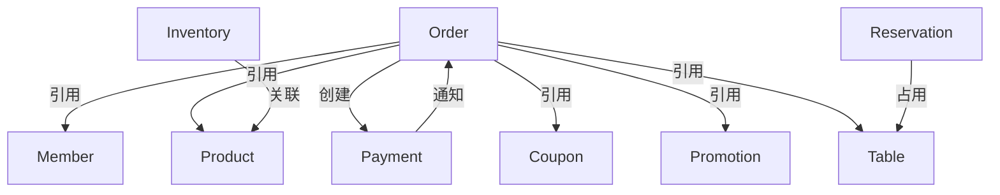

---

## 4. 聚合根类型统计

| 类型 | 数量 | 聚合根 |
|------|------|--------|
| 实体型聚合根 | 6 | Order, Payment, Member, Product, Inventory, Table |
| 规则型聚合根 | 2 | Coupon, Promotion |
| 候选聚合根 | 3 | ShoppingCart, Reservation, Bill |

---

## 5. 未确认项

| 对象 | 未确认原因 | 待确认动作 |
|------|-----------|-----------|
| ShoppingCart | 是否为聚合根？还是Order的一部分？ | 需确认生命周期和事务边界 |
| Reservation | 是否为聚合根？还是Table的一部分？ | 需确认业务身份和不变量 |
| Bill | 是否与Order重复？ | 需确认业务边界 |

---

## 6. 聚合根识别标准

根据《更高维业务设计方法论》，聚合根必须满足以下条件：

1. **有业务身份**：外部通过唯一标识引用
2. **有生命周期**：创建、使用、归档有明确边界
3. **有不变量**：聚合内存在必须保持的业务约束
4. **有事务边界**：聚合内操作具有原子性
5. **有领域事件**：状态变化产生业务事件

**排除标准**：
- 纯技术对象（日志、缓存）
- 无生命周期（只是数据传输）
- 无不变量（只是数据集合）
````

---

#### Order聚合根完整对象树.md

````markdown
# Order聚合根完整对象树

> **权威数据源**：本文件是Order聚合根的唯一完整定义。所有上下文引用本定义。

---

## 1. 聚合根基本信息

| 项目 | 内容 |
|------|------|
| 聚合根名称 | Order（订单）|
| 英文标识 | order |
| 技术标识 | `com.example.order.Order` |
| 数据库表 | `t_order` |
| 涉及上下文 | 订单创建、订单支付、订单退款、订单查询 |
| 状态 | ✅已确认 |
| 确认依据 | 有唯一标识orderNo、有生命周期、有不变量、有事务边界、有领域事件 |

---

## 2. 完整对象树（展开到叶子节点）

### 2.1 根属性

| 属性 | 类型 | 说明 | 约束 | 证据 |
|------|------|------|------|------|
| orderId | Long | 订单ID | PK, 自增 | OrderEntity.java:12 |
| orderNo | String | 订单号 | 唯一索引, 非空, 格式:ORD+timestamp | OrderEntity.java:15 |
| status | OrderStatus | 订单状态 | 枚举: PENDING_PAY/PAID/REFUNDED/CANCELLED | OrderEntity.java:18 |
| items | List<OrderItem> | 订单明细 | 组合关系, 非空, size>=1 | OrderEntity.java:45 |
| totalAmount | BigDecimal | 订单总额 | >=0, 精度2 | OrderEntity.java:23 |
| discountAmount | BigDecimal | 优惠金额 | >=0, 精度2 | OrderEntity.java:26 |
| paidAmount | BigDecimal | 实付金额 | >=0, 精度2 | OrderEntity.java:29 |
| memberId | Long | 会员ID | 可空, 外键 | OrderEntity.java:32 |
| couponId | Long | 优惠券ID | 可空, 外键 | OrderEntity.java:35 |
| tableId | Long | 餐台ID | 可空, 外键 | OrderEntity.java:38 |
| address | Address | 配送地址 | 值对象, 可空 | OrderEntity.java:41 |
| createdBy | String | 创建人 | 非空 | OrderEntity.java:48 |
| createdTime | LocalDateTime | 创建时间 | 非空 | OrderEntity.java:51 |
| updatedBy | String | 更新人 | 非空 | OrderEntity.java:54 |
| updatedTime | LocalDateTime | 更新时间 | 非空 | OrderEntity.java:57 |
| deleted | Boolean | 逻辑删除 | 默认false | OrderEntity.java:60 |

---

### 2.2 OrderItem对象树（完整展开）

| 属性 | 类型 | 说明 | 约束 | 证据 |
|------|------|------|------|------|
| itemId | Long | 明细ID | PK, 自增 | OrderItemEntity.java:10 |
| orderId | Long | 订单ID | FK, 非空 | OrderItemEntity.java:13 |
| productId | Long | 商品ID | FK, 非空 | OrderItemEntity.java:16 |
| productName | String | 商品名称 | 非空, 冗余存储 | OrderItemEntity.java:19 |
| quantity | Integer | 数量 | >0 | OrderItemEntity.java:22 |
| price | BigDecimal | 单价 | >=0, 精度2 | OrderItemEntity.java:25 |
| subtotal | BigDecimal | 小计 | =quantity*price, 精度2 | OrderItemEntity.java:28 |
| createdTime | LocalDateTime | 创建时间 | 非空 | OrderItemEntity.java:31 |

**关系说明**：
- OrderItem是Order的组成部分，不能独立存在

---

### 2.3 Address值对象树（完整展开）

| 属性 | 类型 | 说明 | 约束 | 证据 |
|------|------|------|------|------|
| province | String | 省份 | 非空 | Address.java:8 |
| city | String | 城市 | 非空 | Address.java:11 |
| district | String | 区县 | 非空 | Address.java:14 |
| detail | String | 详细地址 | 非空 | Address.java:17 |
| recipientName | String | 收件人 | 非空 | Address.java:20 |
| recipientPhone | String | 收件人电话 | 非空, 格式:11位手机号 | Address.java:23 |

**值对象特性**：
- 无独立ID
- 不可变（修改需要整体替换）
- 相等性基于值相等，不是引用相等

---

## 3. 对象关系可视化（多种图示）

### 3.1 类图（UML Class Diagram）

> **用途**：展示类的属性、方法和继承关系

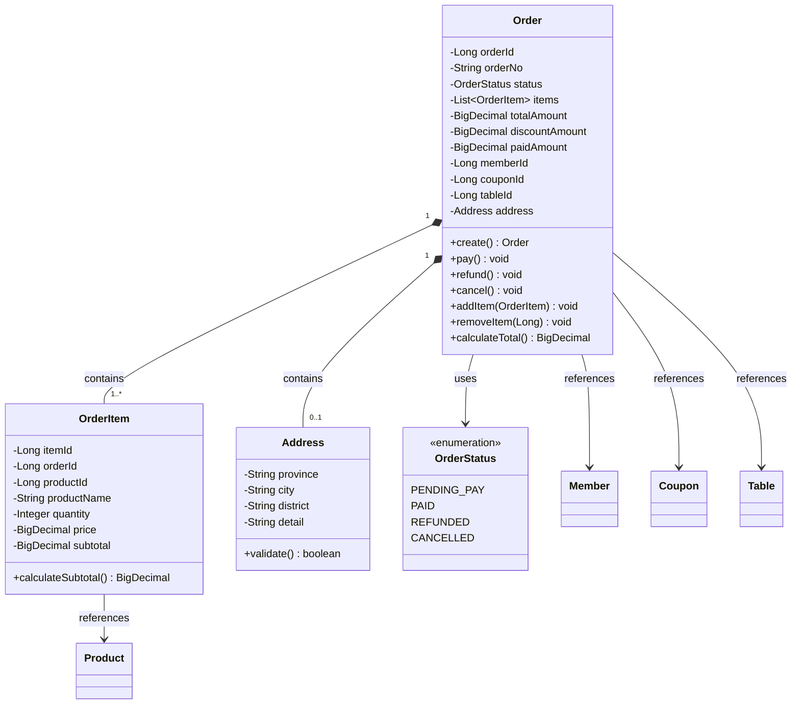

---

### 3.2 ER图（Entity-Relationship Diagram）

> **用途**：展示数据库实体之间的关系

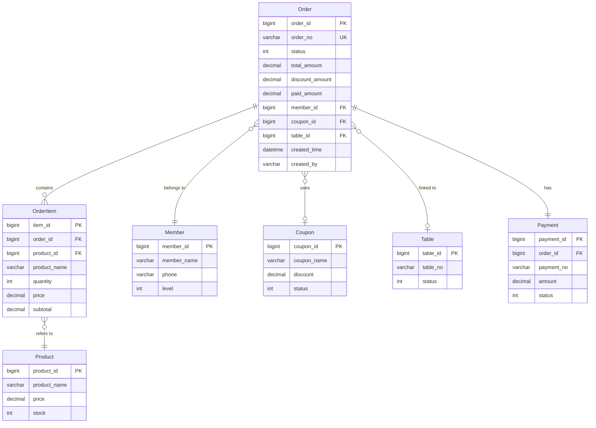

---

### 3.3 对象组合图（Composition Diagram）

> **用途**：突出显示聚合根内部的组合关系

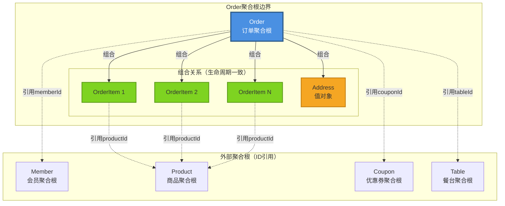

**图例说明**：
- **实线箭头**：组合关系（强拥有，生命周期一致）
- **虚线箭头**：引用关系（弱关联，通过ID引用）
- **蓝色矩形**：聚合根
- **绿色矩形**：实体
- **橙色矩形**：值对象

---

### 3.4 依赖关系图（Dependency Graph）

> **用途**：展示聚合根之间的依赖关系和方向

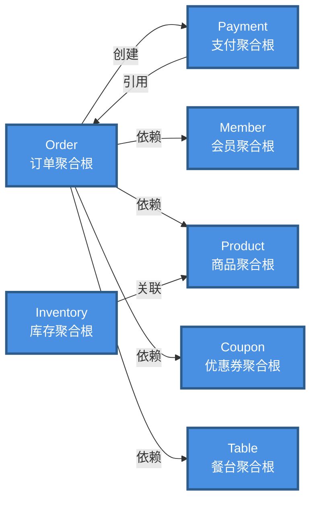

---

### 3.5 关系矩阵（Relationship Matrix）

> **用途**：一眼看清所有对象间的关系类型

|        | Order | OrderItem | Payment | Member | Product | Coupon | Table | Inventory | Address |
|--------|-------|-----------|---------|--------|---------|--------|-------|-----------|---------|
| **Order** | - | 组合(1:N) | 创建(1:1) | 引用(N:1) | - | 引用(N:1) | 引用(N:1) | - | 组合(1:0..1) |
| **OrderItem** | 属于(N:1) | - | - | - | 引用(N:1) | - | - | - | - |
| **Payment** | 引用(N:1) | - | - | - | - | - | - | - | - |
| **Member** | - | - | - | - | - | - | - | - | - |
| **Product** | - | - | - | - | - | - | - | 关联(1:1) | - |
| **Coupon** | - | - | - | - | - | - | - | - | - |
| **Table** | - | - | - | - | - | - | - | - | - |
| **Inventory** | - | - | - | - | 关联(1:1) | - | - | - | - |
| **Address** | - | - | - | - | - | - | - | - | - |

**关系类型说明**：
- **组合(1:N)**：强拥有关系，生命周期一致，级联删除
- **属于(N:1)**：被包含关系，不能独立存在
- **创建(1:1)**：一个对象创建另一个对象
- **引用(N:1)**：通过ID引用，弱关联
- **关联(1:1)**：双向关联，但不是组合关系

---

### 3.6 C4模型-容器图（Container Diagram）

> **用途**：展示对象在系统架构中的位置

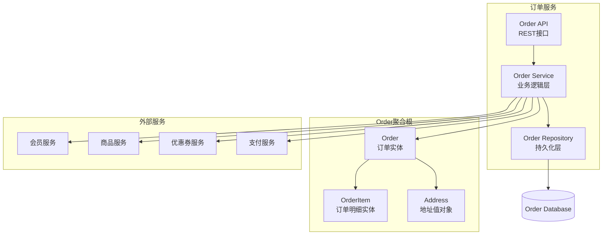

---

### 3.7 关系强度图（Coupling Strength）

> **用途**：可视化对象间的耦合强度

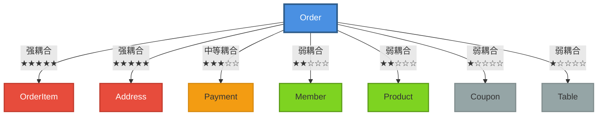

**耦合强度说明**：
- **★★★★★（强耦合）**：组合关系，生命周期一致，修改影响大
- **★★★☆☆（中等耦合）**：创建关系，修改影响中等
- **★★☆☆☆（弱耦合）**：ID引用，修改影响小
- **★☆☆☆☆（极弱耦合）**：可选引用，修改影响极小

---

### 3.8 生命周期图（Lifecycle Diagram）

> **用途**：展示对象的创建、使用、销毁关系

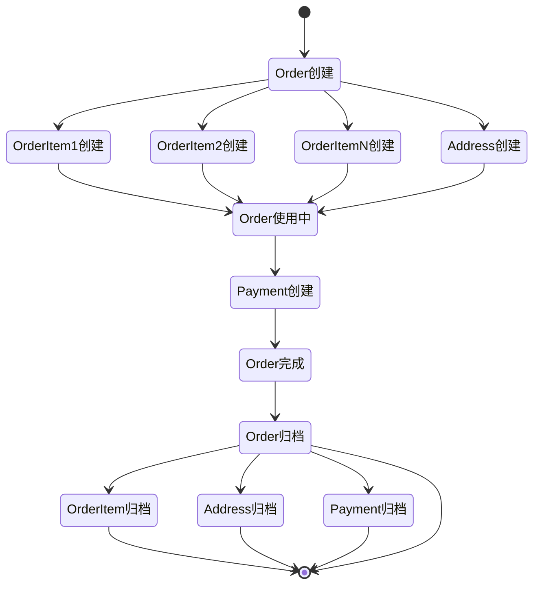

**说明**：
- Order创建时自动创建OrderItem和Address
- Order归档时级联归档所有子对象
- Payment在Order完成后创建，独立归档

---

### 3.9 图选择指南

| 目的 | 推荐图 | 适用场景 |
|------|--------|---------|
| 展示类的属性和方法 | UML类图 | 开发阶段，代码设计 |
| 展示数据库表关系 | ER图 | 数据库设计，数据迁移 |
| 突出聚合根边界 | 对象组合图 | DDD分析，边界识别 |
| 分析依赖关系 | 依赖关系图 | 架构评审，重构决策 |
| 全局关系概览 | 关系矩阵 | 快速查找，文档索引 |
| 系统分层视图 | C4容器图 | 架构设计，服务拆分 |
| 评估耦合度 | 关系强度图 | 技术债务评估，重构优先级 |
| 理解对象生命周期 | 生命周期图 | 业务分析，资源管理 |

---

## 4. 对象关系详细说明

### 4.1 Order ↔ OrderItem（组合关系）

| 维度 | 说明 | 证据 |
|------|------|------|
| **关系类型** | 组合（Composition） | OrderEntity.java:45 |
| **多重性** | 1:N（一个订单至少1个明细） | @OneToMany(cascade=ALL, orphanRemoval=true) |
| **生命周期** | 一致（Order创建时创建，Order删除时级联删除） | OrderService.java:56 |
| **导航方向** | 双向（Order → OrderItem, OrderItem → Order） | OrderItemEntity.java:13 |
| **外键持有方** | OrderItem持有orderId | t_order_item.order_id FK |
| **级联操作** | 全级联（增删改查） | cascade=CascadeType.ALL |
| **孤儿删除** | 是（OrderItem脱离Order自动删除） | orphanRemoval=true |
| **修改限制** | 必须通过Order聚合根修改 | Order.addItem(), Order.removeItem() |
| **业务约束** | items.size >= 1（至少一个明细） | Order.java:78 |

**代码示例**：
```java
// Order.java
@OneToMany(mappedBy = "order", cascade = CascadeType.ALL, orphanRemoval = true)
private List<OrderItem> items = new ArrayList<>();

public void addItem(OrderItem item) {
    items.add(item);
    item.setOrder(this);
    recalculateTotal();
}

public void removeItem(Long itemId) {
    if (items.size() <= 1) {
        throw new BusinessException("至少保留一个订单明细");
    }
    items.removeIf(item -> item.getItemId().equals(itemId));
    recalculateTotal();
}
```

---

### 4.2 Order ↔ Address（组合关系-值对象）

| 维度 | 说明 | 证据 |
|------|------|------|
| **关系类型** | 组合-值对象（Embedded） | OrderEntity.java:41 |
| **多重性** | 1:0..1（一个订单0或1个地址） | 可空 |
| **生命周期** | 一致（随Order创建和删除） | OrderService.java:56 |
| **导航方向** | 单向（Order → Address） | 值对象无反向引用 |
| **存储方式** | 嵌入Order表（不单独建表） | @Embedded |
| **不可变性** | 不可变（修改需整体替换） | Address是final class |
| **相等性** | 值相等（不是ID相等） | Address.equals()基于字段 |
| **业务约束** | 配送订单必须有地址 | Order.validate() |

**代码示例**：
```java
// Order.java
@Embedded
private Address address;

public void updateAddress(Address newAddress) {
    this.address = newAddress;  // 整体替换，不是修改字段
}

// Address.java
@Embeddable
public final class Address {
    private String province;
    private String city;
    private String detail;
    
    @Override
    public boolean equals(Object o) {
        if (this == o) return true;
        if (!(o instanceof Address)) return false;
        Address address = (Address) o;
        return Objects.equals(province, address.province) &&
               Objects.equals(city, address.city) &&
               Objects.equals(detail, address.detail);
    }
}
```

---

### 4.3 Order → Member（引用关系）

| 维度 | 说明 | 证据 |
|------|------|------|
| **关系类型** | 引用（Reference） | OrderEntity.java:32 |
| **多重性** | N:1（多个订单属于一个会员） | 可空（游客下单）|
| **生命周期** | 独立（Member可独立存在） | 不同聚合根 |
| **导航方向** | 单向（Order → Member） | 只存memberId |
| **存储方式** | 存ID不存对象 | memberId: Long FK |
| **级联操作** | 无（Member删除不影响Order） | 软删除或保留历史 |
| **查询方式** | 延迟加载 | 需要时调用MemberService |
| **业务约束** | 会员订单可享受折扣 | Order.applyMemberDiscount() |

**代码示例**：
```java
// Order.java
private Long memberId;  // 只存ID，不存Member对象

public Member getMember() {
    if (memberId == null) return null;
    return memberService.getById(memberId);  // 需要时查询
}
```

---

### 4.4 Order → Payment（创建关系）

| 维度 | 说明 | 证据 |
|------|------|------|
| **关系类型** | 创建（Creation） | OrderService.java:234 |
| **多重性** | 1:1（一个订单一个支付） | 业务约束 |
| **生命周期** | 先后（Order创建后才创建Payment） | Order.pay() |
| **导航方向** | 双向（Order → Payment, Payment → Order） | 互相引用ID |
| **存储方式** | 双方都存对方ID | Order.paymentId, Payment.orderId |
| **级联操作** | 部分级联（Order取消→Payment取消） | 补偿流程 |
| **聚合根关系** | 两个独立聚合根 | Order聚合根, Payment聚合根 |
| **状态一致性** | 必须保持一致 | Order.PAID ↔ Payment.PAID |

**代码示例**：
```java
// Order.java
public void pay(PaymentRequest request) {
    validateCanPay();
    
    // 1. 创建Payment聚合根
    Payment payment = Payment.create(this.orderId, request);
    paymentService.save(payment);
    
    // 2. 更新Order状态
    this.status = OrderStatus.PAID;
    this.paymentId = payment.getPaymentId();
    
    // 3. 发送领域事件
    eventPublisher.publish(new OrderPaid(this));
}
```

---

### 4.5 OrderItem → Product（引用关系）

| 维度 | 说明 | 证据 |
|------|------|------|
| **关系类型** | 引用（Reference） | OrderItemEntity.java:16 |
| **多重性** | N:1（多个明细引用同一商品） | FK |
| **生命周期** | 独立 | Product独立存在 |
| **导航方向** | 单向（OrderItem → Product） | 只存productId |
| **存储方式** | 存ID + 冗余字段（productName） | 防腐策略 |
| **级联操作** | 无 | Product变化不影响历史订单 |
| **冗余存储** | 是（存储productName和price） | 历史快照 |
| **业务约束** | 下单时校验商品有效性 | OrderService.validate() |

**代码示例**：
```java
// OrderItem.java
private Long productId;
private String productName;  // 冗余存储，防止商品改名后历史订单显示错误
private BigDecimal price;    // 冗余存储，防止商品改价后历史订单金额错误

public static OrderItem createFrom(Product product, int quantity) {
    OrderItem item = new OrderItem();
    item.productId = product.getProductId();
    item.productName = product.getName();      // 快照
    item.price = product.getCurrentPrice();    // 快照
    item.quantity = quantity;
    item.subtotal = item.price.multiply(BigDecimal.valueOf(quantity));
    return item;
}
```

---

### 4.6 关系设计模式总结

#### 模式1：组合关系（Composition）

**何时使用**：
- 部分对象的生命周期完全依赖整体
- 部分对象不能独立存在
- 部分对象没有业务身份

**示例**：Order ↔ OrderItem

**特征**：
- 级联删除
- 孤儿删除
- 必须通过聚合根修改

---

#### 模式2：值对象嵌入（Embedded）

**何时使用**：
- 对象无业务身份
- 对象不可变
- 对象相等性基于值

**示例**：Order ↔ Address

**特征**：
- 不单独建表
- 整体替换，不修改字段
- 值相等判断

---

#### 模式3：ID引用（Reference by ID）

**何时使用**：
- 跨聚合根引用
- 对象独立生命周期
- 弱耦合

**示例**：Order → Member, OrderItem → Product

**特征**：
- 只存ID
- 延迟加载
- 无级联操作

---

#### 模式4：创建关系（Creation）

**何时使用**：
- 一个聚合根创建另一个聚合根
- 有明确的先后顺序
- 需要保持状态一致性

**示例**：Order → Payment

**特征**：
- 双向ID引用
- 状态一致性约束
- 可能需要补偿流程

---

#### 模式5：冗余存储（Snapshot）

**何时使用**：
- 需要历史快照
- 防止外部对象变化影响历史数据
- 防腐层需求

**示例**：OrderItem冗余存储productName和price

**特征**：
- 创建时复制值
- 不随源对象更新
- 历史不变性

---

### 4.7 反模式警示

#### ❌ 反模式1：双向组合

**错误示例**：
```java
// Order.java
@OneToMany
private List<OrderItem> items;

// OrderItem.java
@OneToMany  // 错误！OrderItem不应该组合Order
private List<Order> orders;
```

**问题**：违反聚合根边界，循环依赖

---

#### ❌ 反模式2：跨聚合根的直接对象引用

**错误示例**：
```java
// Order.java
@ManyToOne  // 错误！应该只存memberId
private Member member;
```

**问题**：破坏聚合根边界，强耦合

---

#### ❌ 反模式3：值对象有ID

**错误示例**：
```java
// Address.java
@Id  // 错误！值对象不应该有ID
private Long addressId;
```

**问题**：值对象应该基于值相等，不是ID相等

---

### 4.8 关系演化记录

| 时间 | 变更内容 | 原因 | 影响 |
|------|----------|------|------|
| v1.0 | Order直接引用Member对象 | 初始设计 | 强耦合 |
| v2.0 | 改为只存memberId | 解耦，支持分布式 | 需延迟加载 |
| v2.5 | OrderItem增加productName冗余 | 商品改名导致历史订单显示错误 | 增加存储 |
| v3.0 | Address从独立表改为嵌入 | 简化模型，提升性能 | 数据迁移 |

---

## 5. 方法/操作

### 3.1 创建操作

| 方法 | 输入 | 输出 | 业务含义 | 前置条件 | 后置条件 | 证据 |
|------|------|------|----------|----------|----------|------|
| create() | items[], memberId?, couponId? | Order | 创建订单 | items非空, 库存充足 | status=PENDING_PAY, 发送OrderCreated事件 | OrderService.java:45 |
| addItem() | productId, quantity, price | void | 添加商品 | status=PENDING_PAY | items.add(), totalAmount重算 | Order.java:67 |
| removeItem() | itemId | void | 删除商品 | status=PENDING_PAY, items.size>1 | items.remove(), totalAmount重算 | Order.java:78 |

### 3.2 状态转换操作

| 方法 | 输入 | 输出 | 业务含义 | 前置条件 | 后置条件 | 证据 |
|------|------|------|----------|----------|----------|------|
| pay() | payment | void | 支付订单 | status=PENDING_PAY | status=PAID, 发送OrderPaid事件 | Order.java:89 |
| refund() | items[], reason | RefundResult | 退款 | status=PAID | status=REFUNDED, 发送OrderRefunded事件 | Order.java:102 |
| cancel() | reason | void | 取消订单 | status=PENDING_PAY | status=CANCELLED, 发送OrderCancelled事件 | Order.java:115 |
| reverseSettle() | - | void | 反结账 | status=PAID, 同班次 | status=PENDING_PAY, 发送OrderReversed事件 | Order.java:126 |

### 3.3 计算操作

| 方法 | 输入 | 输出 | 业务含义 | 证据 |
|------|------|------|----------|------|
| calculateTotal() | - | BigDecimal | 计算订单总额 | Order.java:137 |
| applyDiscount() | discountAmount | void | 应用折扣 | Order.java:148 |
| applyPromotion() | promotionRule | void | 应用促销规则 | Order.java:159 |

---

## 6. 生命周期

| 阶段 | 触发条件 | 操作 | 状态变化 | 持久化 |
|------|----------|------|----------|--------|
| 创建 | 用户点餐 | create() | status=PENDING_PAY | INSERT t_order |
| 使用 | 修改订单 | addItem/removeItem | status不变 | UPDATE t_order |
| 结账 | 支付成功 | pay() | status=PAID | UPDATE t_order |
| 退款 | 申请退款 | refund() | status=REFUNDED | UPDATE t_order |
| 取消 | 用户取消 | cancel() | status=CANCELLED | UPDATE t_order |
| 归档 | 30天后 | - | - | 移至归档表或逻辑删除 |

---

## 7. 状态机（引用）

> **权威定义**：[Order状态机.md](../03-状态机全景/Order状态机.md)——状态清单、状态转换规则表、非法转换清单、状态持久化、状态变更审计均在彼处维护。本文件不再重复状态机内容，避免双份漂移；本节只保留生命周期视角的阶段说明（见第 6 节）。

---

## 8. 不变量（Invariant）

### 6.1 聚合内不变量

| 不变量ID | 不变量描述 | 表达式 | 证据 |
|---------|-----------|--------|------|
| INV001 | 订单总额=所有明细小计之和 | totalAmount = Σ(items[i].subtotal) | Order.java:167 |
| INV002 | 实付金额=订单总额-优惠金额 | paidAmount = totalAmount - discountAmount | Order.java:178 |
| INV003 | 订单至少包含1个明细 | items.size() >= 1 | Order.java:189 |
| INV004 | 退款数量不超过购买数量 | refundQty <= originalQty | Order.java:201 |
| INV005 | 实付金额>=0 | paidAmount >= 0 | Order.java:212 |

### 6.2 跨聚合不变量

| 不变量ID | 不变量描述 | 涉及聚合 | 保证机制 | 证据 |
|---------|-----------|---------|---------|------|
| INV101 | 支付金额=订单实付金额 | Order, Payment | Saga补偿 | PaymentService.java:45 |
| INV102 | 库存扣减数量=订单明细数量 | Order, Inventory | 补偿事务 | InventoryService.java:67 |

---

## 9. 领域事件

> **权威定义**：[订单域领域事件.md](../07-领域事件全景/订单域领域事件.md)（事件结构、订阅方、消费幂等在彼处维护），本表为聚合根维度的摘要视图。

| 事件ID | 事件名称 | 触发时机 | 事件数据 | 订阅方 | 证据 |
|--------|----------|----------|----------|--------|------|
| EVT001 | OrderCreated | 订单创建成功 | {orderNo, items, totalAmount, memberId} | 库存服务、积分服务 | OrderEventPublisher.java:12 |
| EVT002 | OrderPaid | 订单支付成功 | {orderNo, paidAmount, paymentId} | 财务服务、数据分析服务 | OrderEventPublisher.java:23 |
| EVT003 | OrderRefunded | 订单退款完成 | {orderNo, refundAmount, refundReason} | 库存服务、财务服务 | OrderEventPublisher.java:34 |
| EVT004 | OrderCancelled | 订单取消 | {orderNo, cancelReason} | 库存服务 | OrderEventPublisher.java:45 |
| EVT005 | OrderReversed | 订单反结账 | {orderNo, originalPaidAmount} | 支付服务、财务服务 | OrderEventPublisher.java:56 |

---

## 10. 关系/关联

### 10.1 聚合内关系

| 关系类型 | 源对象 | 目标对象 | 多重性 | 说明 | 证据 |
|---------|--------|----------|--------|------|------|
| 组合 | Order | OrderItem | 1:N | Order包含多个OrderItem，级联删除 | OrderEntity.java:45 |
| 组合 | Order | Address | 1:1 | Order包含1个Address值对象 | OrderEntity.java:41 |

### 10.2 聚合间关系（引用）

| 关系类型 | 源对象 | 目标对象 | 多重性 | 说明 | 证据 |
|---------|--------|----------|--------|------|------|
| 引用 | Order | Member | N:1 | Order引用Member（通过memberId）| OrderEntity.java:32 |
| 引用 | Order | Coupon | N:1 | Order引用Coupon（通过couponId）| OrderEntity.java:35 |
| 引用 | Order | Table | N:1 | Order引用Table（通过tableId）| OrderEntity.java:38 |
| 创建 | Order | Payment | 1:1 | Order创建后生成Payment | PaymentService.java:23 |

---

## 11. 权限/可见性

| 操作 | 权限要求 | 校验位置 | 证据 |
|------|----------|----------|------|
| create() | order:create | OrderController.java:23 | @RequiresPermission |
| pay() | order:pay | OrderController.java:45 | @RequiresPermission |
| refund() | order:refund | OrderController.java:67 | @RequiresPermission |
| cancel() | order:cancel | OrderController.java:89 | @RequiresPermission |
| reverseSettle() | order:reverse | OrderController.java:101 | @RequiresRole("MANAGER") |
| query() | order:view | OrderController.java:123 | @RequiresPermission |

---

## 12. 并发控制

| 场景 | 并发控制机制 | 锁粒度 | 超时时间 | 证据 |
|------|-------------|--------|----------|------|
| 创建订单 | 乐观锁（version） | 行锁 | 30s | OrderEntity.java:63 |
| 修改订单 | 乐观锁（version） | 行锁 | 30s | OrderEntity.java:63 |
| 支付订单 | 悲观锁（SELECT FOR UPDATE）| 行锁 | 60s | OrderService.java:234 |
| 退款订单 | 悲观锁（SELECT FOR UPDATE）| 行锁 | 60s | OrderService.java:267 |

---

## 13. 数据完整性

### 13.1 数据库约束

| 约束类型 | 字段 | 约束内容 | DDL |
|---------|------|----------|-----|
| 主键 | orderId | PRIMARY KEY | `PRIMARY KEY (order_id)` |
| 唯一索引 | orderNo | UNIQUE | `UNIQUE INDEX uk_order_no (order_no)` |
| 非空 | orderNo, status, totalAmount, createdTime | NOT NULL | `NOT NULL` |
| 外键 | memberId | FOREIGN KEY → t_member(member_id) | `FOREIGN KEY (member_id) REFERENCES t_member(member_id)` |
| 检查约束 | totalAmount | >= 0 | `CHECK (total_amount >= 0)` |

### 13.2 应用层校验

| 校验规则 | 校验位置 | 证据 |
|---------|----------|------|
| items非空 | OrderValidator.java:12 | `if (items == null \|\| items.isEmpty())` |
| 数量>0 | OrderValidator.java:23 | `if (quantity <= 0)` |
| 金额>=0 | OrderValidator.java:34 | `if (amount.compareTo(BigDecimal.ZERO) < 0)` |

---

## 14. 历史演化

| 版本 | 变更时间 | 变更内容 | 影响 |
|------|---------|---------|------|
| v1.0 | 2024-01-01 | 初始版本 | - |
| v1.1 | 2024-03-15 | 增加memberId, memberDiscount | 支持会员折扣 |
| v1.2 | 2024-06-20 | 增加couponId, couponDiscount | 支持优惠券 |
| v2.0 | 2025-01-10 | 订单状态机重构 | 状态枚举值变更 |
| v3.0 | 2026-06-01 | 增加address | 支持配送地址 |

详细演化历史见：[订单创建上下文/12-历史演化记录.md](../../主视角-按业务上下文组织/Level 2-上下文细节/上下文-订单创建/12-历史演化记录.md)

---

## 15. 引用此对象的上下文

| 上下文 | 引用方式 | 文件链接 |
|--------|---------|----------|
| 订单创建 | 创建Order聚合根 | [订单创建/03-业务对象建模.md](../../主视角-按业务上下文组织/Level 2-上下文细节/上下文-订单创建/03-业务对象建模.md) |
| 订单支付 | 修改Order状态 | [订单支付/03-业务对象建模.md](../../主视角-按业务上下文组织/Level 2-上下文细节/上下文-订单支付/03-业务对象建模.md) |
| 订单退款 | 修改Order状态和金额 | [订单退款/03-业务对象建模.md](../../主视角-按业务上下文组织/Level 2-上下文细节/上下文-订单退款/03-业务对象建模.md) |
````

---

### 3.3 02-流程分析全景

#### 00-流程索引.md

````markdown
# 流程索引

## 1. 流程统计

| 统计项 | 数量 |
|--------|------|
| 主流程总数 | 25 |
| 变体流总数 | 48 |
| 异常流总数 | 36 |
| 补偿流总数 | 12 |

---

## 2. 流程清单

| 编号 | 流程名称 | 所属业务域 | 涉及上下文 | 复杂度 | 文件链接 |
|------|---------|-----------|-----------|--------|----------|
| F001 | 订单创建主流程 | 订单域 | 订单创建 | ★★★☆☆ | [订单创建主流程.md](./订单创建主流程.md) |
| F002 | 订单支付主流程 | 订单域 | 订单支付 | ★★★★☆ | [订单支付主流程.md](./订单支付主流程.md) |
| F003 | 订单退款主流程 | 订单域 | 订单退款 | ★★★★★ | [订单退款主流程.md](./订单退款主流程.md) |

---

## 3. 跨上下文流程

| 流程 | 起始上下文 | 经过上下文 | 终止上下文 | 说明 |
|------|-----------|-----------|-----------|------|
| 完整点餐流程 | 订单创建 | 订单支付 | 订单完成 | 从下单到支付完成 |
| 退款流程 | 订单退款 | 库存补偿、支付退款 | 订单完成 | 从发起退款到退款完成 |

---

## 4. 流程依赖图

```mermaid
graph TD
  订单创建主流程 --> 订单支付主流程
  订单支付主流程 --> 订单完成主流程
  订单支付主流程 -.退款.-> 订单退款主流程
  订单退款主流程 --> 库存补偿流程
  订单退款主流程 --> 支付退款流程
```

---

## 5. 流程复杂度分布

| 复杂度 | 数量 | 占比 |
|--------|------|------|
| ★☆☆☆☆（简单）| 5 | 20% |
| ★★☆☆☆（较简单）| 8 | 32% |
| ★★★☆☆（中等）| 7 | 28% |
| ★★★★☆（复杂）| 3 | 12% |
| ★★★★★（极复杂）| 2 | 8% |

**复杂度判定标准**：
- ★☆☆☆☆：步骤<5，无分支
- ★★☆☆☆：步骤5-10，分支<3
- ★★★☆☆：步骤10-20，分支3-5
- ★★★★☆：步骤20-30，分支5-10，有补偿
- ★★★★★：步骤>30，分支>10，有复杂补偿

---

## 6. 高风险流程清单

| 流程 | 风险点 | 风险等级 | 应对措施 |
|------|--------|---------|----------|
| 订单退款主流程 | 补偿失败导致资金不一致 | 🔴 高 | 增加补偿重试机制 |
| 订单支付主流程 | 支付超时导致订单状态异常 | 🟡 中 | 增加状态对账机制 |
````

---

#### 订单创建主流程.md

````markdown
# 订单创建主流程

> **流程ID**: F001  
> **所属业务域**: 订单域  
> **涉及上下文**: 订单创建  
> **复杂度**: ★★★☆☆

---

## 1. 流程基本信息

| 项目 | 内容 |
|------|------|
| 流程名称 | 订单创建主流程 |
| 流程目标 | 创建订单，锁定顾客需求 |
| 触发方式 | 收银员点餐、顾客自助点餐 |
| 参与角色 | 收银员、顾客、库存服务、促销服务、会员服务 |
| 平均执行时长 | 2-5秒 |
| QPS | 300 |

---

## 2. 主流程图（高层）

```mermaid
graph TD
  A[开始：收银员/顾客点餐] --> B{校验库存}
  B -->|库存充足| C[生成订单号]
  B -->|库存不足| Z[结束：返回错误]
  C --> D{是否有促销}
  D -->|有促销| E[计算促销价格]
  D -->|无促销| F[使用原价]
  E --> G{顾客是否会员}
  F --> G
  G -->|是会员| H[应用会员折扣]
  G -->|非会员| I[创建订单记录]
  H --> I
  I --> J[保存到数据库]
  J --> K[发送OrderCreated事件]
  K --> L[结束：返回Order]
```

---

## 3. 主流程详细步骤

| 步骤 | 操作 | 输入 | 输出 | 代码位置 | 副作用 | 可恢复性 | 确定性 |
|------|------|------|------|----------|--------|---------|--------|
| 1 | 校验库存 | items[] | boolean | InventoryService.checkStock():45 | 无 | - | L4-多源一致 |
| 2 | 生成订单号 | - | orderNo | OrderService.generateOrderNo():23 | Redis INCR | 可补偿 | L5-完全确定 |
| 3 | 计算促销 | items, promotions | discount | PromotionService.calculate():67 | 无 | - | L3-单源确定 |
| 4 | 应用会员折扣 | memberId | memberDiscount | MemberService.getDiscount():89 | 无 | - | L3-单源确定 |
| 5 | 创建订单对象 | orderData | Order | Order.create():12 | 无 | - | L5-完全确定 |
| 6 | 保存到数据库 | Order | orderId | OrderMapper.insert():45 | 写DB | 可回滚 | L5-完全确定 |
| 7 | 发送领域事件 | OrderCreated | - | OrderEventPublisher.publish():23 | 写MQ | 最终一致 | L4-多源一致 |

---

## 4. 变体流

### 4.1 变体流1：使用优惠券

**触发条件**: couponId != null

**流程差异**:

| 步骤 | 操作 | 代码位置 | 状态变化 | 外部调用 |
|------|------|----------|----------|----------|
| 3.5 | 校验优惠券有效性 | CouponService.validate():45 | 无 | CouponService |
| 3.6 | 核销优惠券 | CouponService.consume():67 | Coupon.status=已使用 | CouponService |
| 3.7 | 应用优惠券折扣 | OrderService.applyCoupon():89 | Order.couponDiscount+=X | 无 |

**流程图**:

```mermaid
graph TD
  A[步骤3：计算促销后] --> B{是否有优惠券?}
  B -->|有| C[校验优惠券]
  B -->|无| E[继续主流程]
  C --> D{优惠券有效?}
  D -->|有效| F[核销优惠券]
  D -->|无效| Z[终止流程，返回错误]
  F --> G[应用优惠券折扣]
  G --> E
```

---

### 4.2 变体流2：餐台点餐

**触发条件**: tableId != null

**流程差异**:

| 步骤 | 操作 | 代码位置 | 状态变化 |
|------|------|----------|----------|
| 0.5 | 校验餐台状态 | TableService.checkStatus():23 | 无 |
| 6.5 | 绑定订单到餐台 | TableService.bindOrder():45 | Table.orderId=XXX |

---

## 5. 异常流

### 5.1 异常流1：库存不足

**触发条件**: InventoryService.checkStock() = false

**处理逻辑**:

| 步骤 | 操作 | 代码位置 | 对外结果 | 数据影响 |
|------|------|----------|----------|----------|
| E1 | 捕获InsufficientStockException | OrderService.java:56 | 返回错误码1001 | 无副作用 |
| E2 | 记录失败日志 | OrderService.java:58 | - | 写日志 |
| E3 | 返回错误响应 | OrderController.java:67 | HTTP 400 | 无 |

**补偿动作**: 无需补偿（未产生副作用）

---

### 5.2 异常流2：订单号生成失败

**触发条件**: Redis连接超时

**处理逻辑**:

| 步骤 | 操作 | 代码位置 | 降级方案 | 数据影响 |
|------|------|----------|----------|----------|
| E1 | 捕获TimeoutException | OrderService.java:28 | 使用UUID生成订单号 | 订单号格式异常 |
| E2 | 记录降级日志 | OrderService.java:30 | - | 写日志 |
| E3 | 继续主流程 | OrderService.java:32 | - | 无 |

**风险**: UUID生成的订单号无业务含义，影响对账

---

### 5.3 异常流3：促销服务超时

**触发条件**: PromotionService调用超时（>200ms）

**处理逻辑**:

| 步骤 | 操作 | 代码位置 | 降级方案 | 数据影响 |
|------|------|----------|----------|----------|
| E1 | 捕获TimeoutException | OrderService.java:71 | 使用原价（无促销）| Order.discountAmount=0 |
| E2 | 记录降级日志 | OrderService.java:73 | - | 写日志 |
| E3 | 继续主流程 | OrderService.java:75 | - | 无 |

**风险**: 顾客未享受到应有的促销优惠

---

## 6. 补偿流

### 6.1 补偿流1：库存扣减补偿

**触发条件**: 订单创建失败（步骤6之后）

**补偿逻辑**:

| 步骤 | 操作 | 代码位置 | 幂等键 | 重试策略 | 补偿失败处理 |
|------|------|----------|--------|----------|-------------|
| C1 | 调用库存补偿接口 | OrderCompensationService.java:23 | orderNo | 3次，间隔5s | 记录日志，需人工介入 |
| C2 | 回滚库存数量 | InventoryService.compensate():45 | orderNo+productId | - | - |
| C3 | 记录补偿结果 | CompensationLog.java:12 | - | - | - |

**补偿流程图**:

```mermaid
graph TD
  A[订单创建失败] --> B{是否已扣减库存?}
  B -->|是| C[调用库存补偿接口]
  B -->|否| Z[无需补偿]
  C --> D{补偿成功?}
  D -->|成功| E[记录补偿成功日志]
  D -->|失败| F[记录补偿失败，触发人工介入]
  E --> Z
  F --> Z
```

---

### 6.2 补偿流2：优惠券核销补偿

**触发条件**: 订单创建失败（步骤6之后），且已核销优惠券

**补偿逻辑**:

| 步骤 | 操作 | 代码位置 | 幂等键 | 重试策略 | 补偿失败处理 |
|------|------|----------|--------|----------|-------------|
| C1 | 调用优惠券补偿接口 | CouponCompensationService.java:45 | couponId | 1次 | 记录日志，需人工介入 |
| C2 | 回滚优惠券状态 | CouponService.rollback():67 | couponId | - | - |
| C3 | 记录补偿结果 | CompensationLog.java:23 | - | - | - |

---

## 7. 时序图（完整交互）

```mermaid
sequenceDiagram
  participant C as 收银员/顾客
  participant OC as OrderController
  participant OS as OrderService
  participant IS as InventoryService
  participant PS as PromotionService
  participant MS as MemberService
  participant DB as MySQL
  participant MQ as RocketMQ
  
  C->>OC: POST /order/create
  OC->>OS: createOrder(items)
  
  OS->>IS: checkStock(items)
  IS-->>OS: true
  
  OS->>OS: generateOrderNo()
  Note over OS: Redis INCR
  
  alt 有促销
    OS->>PS: calculatePromotion(items)
    PS-->>OS: discount
  end
  
  alt 顾客是会员
    OS->>MS: getMemberDiscount(memberId)
    MS-->>OS: memberDiscount
  end
  
  OS->>OS: create Order对象
  OS->>DB: INSERT t_order
  DB-->>OS: orderId
  
  OS->>MQ: publish(OrderCreated)
  MQ-->>OS: ack
  
  OS-->>OC: Order
  OC-->>C: 200 OK {order}
  
  rect rgb(200, 220, 240)
    Note over MQ,IS: 异步事件消费
    MQ->>IS: OrderCreated事件
    IS->>IS: 扣减库存
  end
```

---

## 8. 决策矩阵

### 8.1 促销规则选择决策

> **数据源约定**：本表登记于数据文件 `decisions.yaml`，由工具生成；《主视角/04-业务逻辑分析.md》§2.1 与本表同源，禁止两处各手改一份。

| 条件A：订单金额 | 条件B：会员等级 | 条件C：优惠券 | 结果 | 代码位置 |
|----------------|----------------|--------------|------|----------|
| >=100 | 金卡 | 有 | 满减+会员折扣+优惠券 | PromotionService.java:78 |
| >=100 | 普通 | 有 | 满减+优惠券 | PromotionService.java:82 |
| >=100 | 金卡 | 无 | 满减+会员折扣 | PromotionService.java:86 |
| <100 | 金卡 | 有 | 会员折扣+优惠券 | PromotionService.java:90 |
| <100 | 普通 | 有 | 优惠券 | PromotionService.java:94 |
| <100 | 普通 | 无 | 无优惠 | PromotionService.java:98 |

---

## 9. 性能指标

| 指标 | 目标值 | 实测值 | 状态 |
|------|--------|--------|------|
| P50响应时间 | <200ms | 180ms | ✅ |
| P99响应时间 | <500ms | 450ms | ✅ |
| 成功率 | >99.9% | 99.95% | ✅ |
| QPS | 300 | 280 | ✅ |

---

## 10. 测试覆盖

| 测试场景 | 测试用例 | 覆盖状态 |
|---------|---------|---------|
| 主流程：正常创建 | TC_FLOW_01 | ✅已覆盖 |
| 变体流：使用优惠券 | TC_FLOW_02 | ✅已覆盖 |
| 变体流：会员折扣 | TC_FLOW_03 | ✅已覆盖 |
| 异常流：库存不足 | TC_FLOW_04 | ✅已覆盖 |
| 异常流：促销服务超时 | - | ❌未覆盖 |
| 补偿流：库存补偿 | TC_FLOW_05 | ✅已覆盖 |
| 补偿流：优惠券补偿 | TC_FLOW_06 | ✅已覆盖 |

---

## 11. 已知问题

| 问题ID | 问题描述 | 影响 | 优先级 | 状态 |
|--------|----------|------|--------|------|
| ISS001 | 促销服务超时时未记录原促销规则 | 无法事后追溯 | P1 | ⏸️待修复 |
| ISS002 | 补偿失败时缺少告警机制 | 可能导致数据不一致 | P0 | ⏸️待修复 |

---

## 12. 引用此流程的上下文

| 上下文 | 引用方式 | 文件链接 |
|--------|---------|----------|
| 订单创建 | 主流程 | [订单创建/04-业务逻辑分析.md](../../主视角-按业务上下文组织/Level 2-上下文细节/上下文-订单创建/04-业务逻辑分析.md) |
````

---

### 3.4 03-状态机全景

#### 00-状态机索引.md

```markdown
# 状态机索引

## 1. 状态机统计

| 统计项 | 数量 |
|--------|------|
| 状态机总数 | 15 |
| 简单状态机（状态<5）| 8 |
| 复杂状态机（状态>=5）| 7 |

---

## 2. 状态机清单

| 编号 | 对象 | 状态数 | 转换数 | 复杂度 | 文件链接 |
|------|------|--------|--------|--------|----------|
| SM01 | Order | 4 | 5 | ★★★☆☆ | [Order状态机.md](./Order状态机.md) |
| SM02 | Payment | 5 | 7 | ★★★★☆ | [Payment状态机.md](./Payment状态机.md) |
| SM03 | Coupon | 3 | 3 | ★★☆☆☆ | [Coupon状态机.md](./Coupon状态机.md) |

---

## 3. 跨对象状态一致性约束

详见：[跨对象状态一致性约束.md](./跨对象状态一致性约束.md)

---

## 4. 状态机复杂度分布

| 复杂度 | 数量 | 占比 |
|--------|------|------|
| ★★☆☆☆（简单）| 5 | 33% |
| ★★★☆☆（中等）| 7 | 47% |
| ★★★★☆（复杂）| 3 | 20% |

**复杂度判定标准**：
- ★★☆☆☆：状态<3，转换<3
- ★★★☆☆：状态3-5，转换3-7
- ★★★★☆：状态>5，转换>7
```

---

#### Order状态机.md

````markdown
# Order状态机

> **对象**: Order  
> **所属业务域**: 订单域  
> **涉及上下文**: 订单创建、订单支付、订单退款

---

## 1. 状态清单

| 状态ID | 状态名称 | 状态值 | 说明 | 是否终态 | 证据 |
|--------|----------|--------|------|---------|------|
| S01 | PENDING_PAY | 待结账 | 订单已创建，等待支付 | 否 | OrderStatus.java:12 |
| S02 | PAID | 已结账 | 订单已支付 | 否 | OrderStatus.java:15 |
| S03 | REFUNDED | 已退款 | 订单已退款 | 是 | OrderStatus.java:18 |
| S04 | CANCELLED | 已取消 | 订单已取消 | 是 | OrderStatus.java:21 |

---

## 2. 状态转换图

```mermaid
stateDiagram-v2
  [*] --> PENDING_PAY: create()
  PENDING_PAY --> PAID: pay()
  PENDING_PAY --> CANCELLED: cancel()
  PAID --> REFUNDED: refund()
  PAID --> PENDING_PAY: reverseSettle()
  REFUNDED --> [*]
  CANCELLED --> [*]
```

---

## 3. 状态转换规则表

| 转换ID | 当前状态 | 事件/操作 | 前置条件 | 后置条件 | 目标状态 | 代码位置 | 证据层级 |
|--------|---------|----------|----------|----------|----------|----------|----------|
| T01 | PENDING_PAY | pay() | paidAmount>=totalAmount | 发送OrderPaid事件 | PAID | Order.java:89 | L5-完全确定 |
| T02 | PENDING_PAY | cancel() | 无 | 发送OrderCancelled事件 | CANCELLED | Order.java:115 | L5-完全确定 |
| T03 | PAID | refund() | 同班次，退款数量<=购买数量 | 发送OrderRefunded事件 | REFUNDED | Order.java:102 | L5-完全确定 |
| T04 | PAID | reverseSettle() | 同班次，未发货 | 发送OrderReversed事件 | PENDING_PAY | Order.java:126 | L4-多源一致 |

---

## 4. 转换规则详情

### T01：支付订单（pay）

- **触发条件**: 收银员点击"结账"或顾客完成支付
- **前置条件**:
  - 订单状态=PENDING_PAY
  - 实付金额>=订单总额
  - 支付方式有效
- **执行逻辑**:
  1. 校验支付金额
  2. 创建Payment记录
  3. 更新Order状态=PAID
  4. 发送OrderPaid领域事件
- **后置条件**:
  - 订单状态=PAID
  - Payment状态=PAID
  - OrderPaid事件已发送
- **回滚方案**: reverseSettle()
- **代码位置**: `Order.java:89-98`, `OrderService.java:234-267`
- **测试用例**: TC_ORDER_PAY_01, TC_ORDER_PAY_02

---

### T04：反结账（reverseSettle）

- **触发条件**: 收银员点击"反结账"
- **前置条件**:
  - 订单状态=PAID
  - 同班次（createdTime在当前班次内）
  - 未发货
- **执行逻辑**:
  1. 校验反结账条件
  2. 回滚Payment状态
  3. 更新Order状态=PENDING_PAY
  4. 发送OrderReversed领域事件
- **后置条件**:
  - 订单状态=PENDING_PAY
  - Payment状态=REVERSED
  - OrderReversed事件已发送
- **风险**: 反结账后顾客可能再次修改订单
- **代码位置**: `Order.java:126-145`, `OrderService.java:289-312`
- **测试用例**: TC_ORDER_REVERSE_01

---

## 5. 非法转换清单

| 当前状态 | 非法操作 | 说明 | 代码校验位置 |
|---------|---------|------|-------------|
| PENDING_PAY | refund() | 未支付不能退款 | Order.java:102 |
| PAID | cancel() | 已支付不能取消（只能退款）| Order.java:115 |
| REFUNDED | pay() | 终态不能再支付 | Order.java:89 |
| CANCELLED | pay() | 终态不能再支付 | Order.java:89 |

---

## 6. 状态持久化

| 状态 | 数据库字段 | 存储值 | 索引 |
|------|-----------|--------|------|
| PENDING_PAY | status | 0 | 有索引 |
| PAID | status | 1 | 有索引 |
| REFUNDED | status | 2 | 有索引 |
| CANCELLED | status | 9 | 有索引 |

**注意**: 历史版本使用String存储状态名，v2.0改为Integer存储状态码。

---

## 7. 状态变更审计

| 变更 | 审计表 | 审计字段 |
|------|--------|----------|
| 所有状态变更 | t_order_audit | old_status, new_status, changed_by, changed_time, reason |

---

## 8. 跨对象状态约束

详见：[跨对象状态一致性约束.md](./跨对象状态一致性约束.md#order-payment)

---

## 9. 历史演化

| 版本 | 变更时间 | 变更内容 |
|------|---------|---------|
| v1.0 | 2024-01-01 | 初始版本：PENDING_PAY, PAID, COMPLETED |
| v2.0 | 2025-01-10 | 增加REFUNDED状态，移除COMPLETED |
| v2.1 | 2025-09-05 | 增加reverseSettle转换 |

---

## 10. 引用此状态机的上下文

| 上下文 | 涉及状态 | 文件链接 |
|--------|---------|----------|
| 订单创建 | PENDING_PAY | [订单创建/03-业务对象建模.md](../../主视角-按业务上下文组织/Level 2-上下文细节/上下文-订单创建/03-业务对象建模.md) |
| 订单支付 | PENDING_PAY, PAID | [订单支付/03-业务对象建模.md](../../主视角-按业务上下文组织/Level 2-上下文细节/上下文-订单支付/03-业务对象建模.md) |
| 订单退款 | PAID, REFUNDED | [订单退款/03-业务对象建模.md](../../主视角-按业务上下文组织/Level 2-上下文细节/上下文-订单退款/03-业务对象建模.md) |
````

---

#### 跨对象状态一致性约束.md

````markdown
# 跨对象状态一致性约束

> **说明**: 当两个聚合根的状态存在业务约束时，必须在此记录。

---

## 1. 约束清单

| 约束ID | 源对象 | 目标对象 | 约束描述 | 保证机制 |
|--------|--------|----------|----------|----------|
| C01 | Order | Payment | Order=PAID时，Payment必须=PAID | Saga补偿 |
| C02 | Order | Inventory | Order=PAID时，Inventory已扣减 | 事件驱动+补偿 |
| C03 | Payment | Order | Payment=REVERSED时，Order必须=PENDING_PAY | 同步更新 |

---

## 2. 约束详情

### C01：Order-Payment状态一致性 <a name="order-payment"></a>

**业务含义**: 订单已支付时，支付记录必须存在且为已支付状态。

**约束矩阵**:

| Order状态 | 必须满足的Payment状态 | 说明 |
|-----------|----------------------|------|
| PENDING_PAY | NULL 或 PENDING | 订单未支付，支付记录可能不存在 |
| PAID | PAID | 订单已支付，支付记录必须为已支付 |
| REFUNDED | REFUNDED | 订单已退款，支付记录必须为已退款 |
| CANCELLED | NULL 或 CANCELLED | 订单已取消，支付记录可能不存在或已取消 |

**保证机制**:
- **创建时**: Order.pay()时同步创建Payment并更新状态
- **异常时**: 如果Payment创建失败，Order回滚到PENDING_PAY
- **补偿时**: 定时任务检测不一致状态，触发补偿

**验证SQL**:
```sql
-- 检测不一致状态
SELECT o.order_no, o.status AS order_status, p.status AS payment_status
FROM t_order o
LEFT JOIN t_payment p ON o.order_id = p.order_id
WHERE (o.status = 1 AND (p.status IS NULL OR p.status != 1))  -- Order=PAID but Payment!=PAID
   OR (o.status = 2 AND (p.status IS NULL OR p.status != 2))  -- Order=REFUNDED but Payment!=REFUNDED
```

**补偿逻辑**: `OrderPaymentConsistencyJob.java:45`

---

### C02：Order-Inventory状态一致性

**业务含义**: 订单已支付时，库存必须已扣减。

**约束规则**:
- Order=PAID → Inventory扣减数量 = Order明细数量
- Order=REFUNDED → Inventory补偿数量 = 退款明细数量

**保证机制**:
- **创建时**: OrderPaid事件触发库存扣减
- **异常时**: 库存扣减失败时，订单状态保持PENDING_PAY
- **补偿时**: 订单取消或退款时，发送库存补偿事件

**验证SQL**:
```sql
-- 检测库存扣减不一致
SELECT o.order_no, oi.product_id, oi.quantity AS order_qty, 
       il.deduct_qty, (oi.quantity - COALESCE(il.deduct_qty, 0)) AS diff
FROM t_order o
JOIN t_order_item oi ON o.order_id = oi.order_id
LEFT JOIN t_inventory_log il ON o.order_no = il.order_no AND oi.product_id = il.product_id
WHERE o.status = 1  -- PAID
  AND (il.deduct_qty IS NULL OR il.deduct_qty < oi.quantity)
```

**补偿逻辑**: `InventoryCompensationJob.java:67`

---

## 3. 一致性检查任务

| 任务名称 | 检查约束 | 执行频率 | 告警阈值 |
|---------|---------|---------|---------|
| OrderPaymentConsistencyJob | C01 | 每5分钟 | 不一致数量>10 |
| InventoryConsistencyJob | C02 | 每10分钟 | 不一致数量>50 |

---

## 4. 历史不一致问题

| 问题ID | 发现时间 | 问题描述 | 影响范围 | 修复方案 |
|--------|---------|---------|---------|---------|
| INC001 | 2025-03-15 | Order=PAID但Payment=NULL | 123个订单 | 手工补齐Payment记录 |
| INC002 | 2025-06-20 | 库存未扣减 | 456个订单 | 批量执行扣减脚本 |
````

---

### 3.5 04-规则分析全景

#### 00-规则索引.md

```markdown
# 规则索引

## 1. 规则统计

| 统计项 | 数量 |
|--------|------|
| 规则总数 | 156 |
| 显性规则 | 98 |
| 隐性规则 | 58 |
| P0规则 | 45 |
| P1规则 | 67 |
| P2规则 | 44 |

---

## 2. 规则清单（按业务域）

| 业务域 | 规则数量 | P0规则 | 文件链接 |
|--------|---------|--------|----------|
| 订单域 | 45 | 18 | [订单域规则清单.md](./订单域规则清单.md) |
| 支付域 | 23 | 12 | [支付域规则清单.md](./支付域规则清单.md) |
| 会员域 | 18 | 5 | [会员域规则清单.md](./会员域规则清单.md) |
| 促销域 | 34 | 8 | [促销域规则清单.md](./促销域规则清单.md) |
| 库存域 | 22 | 10 | [库存域规则清单.md](./库存域规则清单.md) |

---

## 3. 规则类型分布

| 规则类型 | 数量 | 占比 | 说明 |
|---------|------|------|------|
| 校验规则 | 56 | 36% | 数据有效性校验 |
| 计算规则 | 38 | 24% | 金额、数量计算 |
| 决策规则 | 34 | 22% | 条件判断、分支选择 |
| 约束规则 | 28 | 18% | 业务不变量 |

---

## 4. 规则依赖全景图

详见：[规则依赖全景图.md](./规则依赖全景图.md)

---

## 5. 规则冲突清单

| 冲突ID | 规则A | 规则B | 冲突类型 | 解决方案 | 状态 |
|--------|-------|-------|----------|----------|------|
| CF01 | R001促销优先级 | R023会员折扣优先 | 互斥 | 按R001优先级执行 | ✅已解决 |
| CF02 | R045库存扣减时机 | R067预扣减规则 | 时序冲突 | 统一为预扣减 | ⏸️待解决 |

---

## 6. 高置信度规则（L4/L5）

| 规则ID | 规则名称 | 置信度 | 证据来源 |
|--------|----------|--------|----------|
| R002 | 订单金额>=0 | L5 | 代码+数据库约束+测试 |
| R003 | 库存校验 | L5 | 代码+业务文档+测试 |
| R005 | 订单号唯一性 | L5 | 代码+数据库唯一索引 |

---

## 7. 低置信度规则（L1/L2）

| 规则ID | 规则名称 | 置信度 | 未确认项 | 待确认动作 |
|--------|----------|--------|----------|-----------|
| R023 | 会员折扣与促销叠加 | L2 | 是否有折扣上限 | 咨询业务 |
| R045 | 库存扣减时机 | L1 | 创建时还是支付后 | 查历史需求文档 |
```

---

#### 规则依赖全景图.md

````markdown
# 规则依赖全景图

## 1. 全局规则依赖图

```mermaid
graph TD
  subgraph 订单域
    R003[R003:库存校验] --> R001[R001:促销规则优先级]
    R001 --> R004[R004:会员折扣叠加]
    R001 --> R002[R002:订单金额约束]
    R004 --> R002
  end
  
  subgraph 支付域
    R101[R101:支付金额校验] --> R102[R102:支付方式选择]
    R102 --> R103[R103:支付超时处理]
  end
  
  subgraph 促销域
    R201[R201:促销规则有效期] --> R001
    R202[R202:促销互斥规则] --> R001
  end
  
  R001 --> R101
  R004 --> R101
```

---

## 2. 跨域规则依赖

| 源域 | 源规则 | 目标域 | 目标规则 | 依赖类型 | 说明 |
|------|--------|--------|----------|----------|------|
| 订单域 | R001:促销规则优先级 | 支付域 | R101:支付金额校验 | 强依赖 | 支付金额依赖促销计算结果 |
| 订单域 | R003:库存校验 | 库存域 | R301:库存扣减 | 强依赖 | 订单创建依赖库存校验 |
| 促销域 | R201:促销规则有效期 | 订单域 | R001:促销规则优先级 | 条件依赖 | 只有在促销有效期内才执行 |

---

## 3. 规则执行顺序（全局）

### 3.1 订单创建流程规则执行顺序

| 顺序 | 规则ID | 规则名称 | 理由 |
|------|--------|----------|------|
| 1 | R005 | 订单号唯一性 | 先生成订单号，失败则整个流程终止 |
| 2 | R003 | 库存校验 | 库存不足则无需继续计算价格 |
| 3 | R201 | 促销规则有效期 | 校验促销是否在有效期内 |
| 4 | R001 | 促销规则优先级 | 计算促销价格 |
| 5 | R004 | 会员折扣叠加 | 在促销基础上应用会员折扣 |
| 6 | R002 | 订单金额约束 | 最后校验总金额是否合法 |
| 7 | R101 | 支付金额校验 | 进入支付流程时校验 |

---

## 4. 规则冲突检测矩阵

### 4.1 订单域规则互斥矩阵

|      | R001 | R002 | R003 | R004 | R005 |
|------|------|------|------|------|------|
| R001 | -    | ✅   | ✅   | ✅   | ✅   |
| R002 | ✅   | -    | ✅   | ✅   | ✅   |
| R003 | ✅   | ✅   | -    | ✅   | ✅   |
| R004 | ✅   | ✅   | ✅   | -    | ✅   |
| R005 | ✅   | ✅   | ✅   | ✅   | -    |

**说明**：✅ = 无冲突，❌ = 有冲突

---

## 5. 规则变更影响分析

### 5.1 R001变更影响

**场景**: 如果修改R001促销规则优先级

**影响的规则**:
- R004（会员折扣叠加）：依赖R001的计算结果
- R002（订单金额约束）：间接依赖
- R101（支付金额校验）：依赖最终金额

**影响范围**: 
- 订单创建流程
- 订单支付流程
- 促销计算逻辑

**测试范围**:
- TC_R001_*（促销规则测试）
- TC_R004_*（会员折扣测试）
- TC_ORDER_CREATE_*（订单创建集成测试）

---

## 6. 规则组合场景

### 6.1 常见规则组合

| 组合场景 | 涉及规则 | 执行顺序 | 测试用例 |
|---------|---------|---------|---------|
| 促销+会员折扣 | R001, R004 | R001 → R004 | TC_COMBO_01 |
| 促销+优惠券 | R001, R006 | R001 → R006 | TC_COMBO_02 |
| 促销+会员+优惠券 | R001, R004, R006 | R001 → R004 → R006 | TC_COMBO_03 |

---

## 7. 规则执行性能

| 规则ID | 规则名称 | 平均耗时 | P99耗时 | 优化建议 |
|--------|----------|----------|---------|----------|
| R001 | 促销规则优先级 | 50ms | 120ms | 缓存促销规则 |
| R003 | 库存校验 | 30ms | 80ms | 已优化（Redis缓存）|
| R004 | 会员折扣叠加 | 20ms | 50ms | 无需优化 |
````

---

### 3.6 05-集成分析全景

#### 00-上下文映射索引.md

```markdown
# 上下文映射索引

## 1. 上下文集成统计

| 统计项 | 数量 |
|--------|------|
| 上下文总数 | 28 |
| 集成关系总数 | 45 |
| 上游上下文 | 12 |
| 下游上下文 | 16 |

---

## 2. 上下文映射类型

| 映射类型 | 数量 | 占比 | 说明 |
|---------|------|------|------|
| Shared Kernel（共享内核）| 3 | 7% | 共享同一个模型 |
| Customer-Supplier（客户-供应商）| 18 | 40% | 上下游依赖 |
| ACL（防腐层）| 12 | 27% | 通过防腐层隔离 |
| Open Host Service（开放主机服务）| 8 | 18% | 对外提供标准接口 |
| Published Language（发布语言）| 4 | 9% | 使用标准协议 |

---

## 3. 上下文映射图

详见：[限界上下文映射图.md](./限界上下文映射图.md)

---

## 4. 防腐层清单

| 防腐层ID | 源上下文 | 目标上下文 | 转换逻辑 | 文件链接 |
|---------|---------|-----------|----------|----------|
| ACL01 | 订单创建 | 库存服务 | DTO转换 | [订单-库存防腐层.md](./订单-库存防腐层.md) |
| ACL02 | 订单创建 | 促销服务 | DTO转换+规则转换 | [订单-促销防腐层.md](./订单-促销防腐层.md) |

---

## 5. 集成方式统计

| 集成方式 | 数量 | 占比 |
|---------|------|------|
| REST API同步调用 | 28 | 62% |
| MQ异步消息 | 12 | 27% |
| 共享数据库 | 3 | 7% |
| gRPC | 2 | 4% |

---

## 6. 高耦合集成清单

| 集成关系 | 耦合程度 | 风险 | 改进建议 |
|---------|---------|------|----------|
| 订单创建 → 促销服务 | ★★★★☆ | 促销服务不可用导致订单创建失败 | 增加降级逻辑 |
| 订单创建 → 库存服务 | ★★★★★ | 库存服务不可用导致订单创建失败 | 无法降级（核心依赖）|
```

---

#### 限界上下文映射图.md

````markdown
# 限界上下文映射图

## 1. C4模型上下文映射图

```mermaid
graph TB
  subgraph 订单域
    订单创建[订单创建上下文]
    订单支付[订单支付上下文]
    订单退款[订单退款上下文]
  end
  
  subgraph 支付域
    支付处理[支付处理上下文]
  end
  
  subgraph 库存域
    库存管理[库存管理上下文]
  end
  
  subgraph 促销域
    促销计算[促销计算上下文]
  end
  
  subgraph 会员域
    会员管理[会员管理上下文]
  end
  
  订单创建 -->|Customer-Supplier + ACL| 库存管理
  订单创建 -->|Customer-Supplier + ACL| 促销计算
  订单创建 -->|Customer-Supplier + ACL| 会员管理
  订单支付 -->|Customer-Supplier| 支付处理
  订单支付 -.->|Published Language<br>OrderPaid事件| 库存管理
  订单退款 -->|Customer-Supplier| 支付处理
  订单退款 -.->|Published Language<br>OrderRefunded事件| 库存管理
```

---

## 2. 上下文映射类型详情

### 2.1 Shared Kernel（共享内核）

| 上下文A | 上下文B | 共享模型 | 说明 |
|---------|---------|----------|------|
| 订单创建 | 订单支付 | Order聚合根 | 共享同一个Order定义 |

**优点**: 无需转换，性能高  
**缺点**: 耦合度高，修改影响双方  
**适用场景**: 同一个团队维护的紧密相关上下文

---

### 2.2 Customer-Supplier（客户-供应商）

| 上游（Supplier）| 下游（Customer）| 接口契约 | 说明 |
|----------------|----------------|----------|------|
| 库存管理 | 订单创建 | GET /inventory/check | 订单创建依赖库存校验 |
| 促销计算 | 订单创建 | POST /promotion/calculate | 订单创建依赖促销计算 |
| 会员管理 | 订单创建 | GET /member/discount | 订单创建依赖会员折扣 |
| 支付处理 | 订单支付 | POST /payment/create | 订单支付依赖支付处理 |

**优点**: 职责清晰，上游对下游负责  
**缺点**: 下游依赖上游，上游故障影响下游  
**适用场景**: 明确的依赖关系，上游提供稳定服务

---

### 2.3 ACL（防腐层）

| 上下文 | 外部服务 | 防腐层 | 转换逻辑 |
|--------|---------|--------|----------|
| 订单创建 | 库存服务 | OrderInventoryACL | OrderItem → InventoryCheckRequest |
| 订单创建 | 促销服务 | OrderPromotionACL | OrderItem → PromotionCalculateRequest |

**优点**: 隔离外部变化，保护内部模型  
**缺点**: 增加转换开销  
**适用场景**: 对接外部系统或遗留系统

---

### 2.4 Open Host Service（开放主机服务）

| 上下文 | 提供的服务 | 协议 | 消费方 |
|--------|-----------|------|--------|
| 订单创建 | POST /order/create | REST | POS收银系统、小程序 |
| 支付处理 | POST /payment/create | REST | 订单支付上下文 |

**优点**: 标准化接口，易于集成  
**缺点**: 需要维护接口文档和版本  
**适用场景**: 对外提供服务的核心上下文

---

### 2.5 Published Language（发布语言）

| 上下文 | 发布的事件 | 协议 | 订阅方 |
|--------|-----------|------|--------|
| 订单支付 | OrderPaid | MQ事件 | 库存服务、积分服务 |
| 订单退款 | OrderRefunded | MQ事件 | 库存服务、财务服务 |

**优点**: 解耦，异步，可扩展  
**缺点**: 最终一致性，调试困难  
**适用场景**: 跨上下文的状态同步

---

## 3. 上下文依赖关系图

```mermaid
graph LR
  订单创建 -->|同步依赖| 库存管理
  订单创建 -->|同步依赖| 促销计算
  订单创建 -->|同步依赖| 会员管理
  订单支付 -->|同步依赖| 支付处理
  订单支付 -.->|异步事件| 库存管理
  订单支付 -.->|异步事件| 积分服务
  订单退款 -->|同步依赖| 支付处理
  订单退款 -.->|异步事件| 库存管理
```

**实线** = 同步依赖（阻塞调用）  
**虚线** = 异步依赖（事件驱动）

---

## 4. 集成风险评估

| 集成关系 | 风险等级 | 风险描述 | 应对措施 |
|---------|---------|---------|---------|
| 订单创建 → 库存管理 | 🔴 高 | 库存服务不可用导致订单创建失败 | 无法降级（核心依赖），增加熔断和监控 |
| 订单创建 → 促销计算 | 🟡 中 | 促销服务不可用影响促销优惠 | 已有降级逻辑（使用原价）|
| 订单支付 → OrderPaid事件 | 🟢 低 | 事件发送失败 | MQ有重试机制 |

---

## 5. 上下文边界清晰度评估

| 上下文 | 边界清晰度 | 说明 |
|--------|-----------|------|
| 订单创建 | ★★★★☆ | 边界清晰，职责单一 |
| 订单支付 | ★★★☆☆ | 与支付处理边界模糊 |
| 订单退款 | ★★★★☆ | 边界清晰 |

**边界模糊原因**：订单支付上下文包含了部分支付处理逻辑，建议拆分。
````

---

### 3.7 06-架构视图全景

#### 00-架构视图索引.md

```markdown
# 架构视图索引

## 1. 架构视图清单

| 视图 | 说明 | 文件链接 |
|------|------|----------|
| 聚合根依赖关系图 | 聚合根之间的引用和依赖 | [聚合根依赖关系图.md](./聚合根依赖关系图.md) |
| 上下文集成关系图 | 上下文之间的集成方式 | [上下文集成关系图.md](./上下文集成关系图.md) |
| 技术债务清单 | 架构和技术债务 | [技术债务清单.md](./技术债务清单.md) |
| 模块分层视图 | 代码模块分层结构 | [模块分层视图.md](./模块分层视图.md) |

---

## 2. 架构健康度评估

| 维度 | 评分 | 说明 |
|------|------|------|
| 模块化 | ★★★☆☆ | 部分模块边界清晰 |
| 可测试性 | ★★★★☆ | 测试覆盖率75% |
| 可扩展性 | ★★★☆☆ | 部分逻辑硬编码 |
| 可维护性 | ★★★☆☆ | 技术债务较多 |
| 性能 | ★★★★☆ | P99<500ms |

---

## 3. 架构风险清单

| 风险 | 严重程度 | 说明 | 应对措施 |
|------|---------|------|----------|
| 单体架构性能瓶颈 | 🔴 高 | QPS超过500时性能下降 | 计划微服务拆分 |
| 共享数据库耦合 | 🟡 中 | 3个上下文共享同一个数据库 | 逐步拆分数据库 |
| 技术债务堆积 | 🟡 中 | 45个P0技术债务 | 按优先级逐步修复 |
```

---

#### 聚合根依赖关系图.md

````markdown
# 聚合根依赖关系图

## 1. 全局依赖关系图

```mermaid
graph TD
  Order[Order<br>订单聚合根] -->|引用memberId| Member[Member<br>会员聚合根]
  Order -->|引用productId| Product[Product<br>商品聚合根]
  Order -->|引用couponId| Coupon[Coupon<br>优惠券聚合根]
  Order -->|引用tableId| Table[Table<br>餐台聚合根]
  Order -->|创建| Payment[Payment<br>支付聚合根]
  
  OrderItem[OrderItem<br>订单明细实体] -->|属于| Order
  OrderItem -->|引用productId| Product
  
  Payment -->|引用orderId| Order
  
  Inventory[Inventory<br>库存聚合根] -->|关联productId| Product
  
  Reservation[Reservation<br>预订聚合根] -->|引用tableId| Table
  Reservation -->|引用memberId| Member
```

---

## 2. 聚合根依赖矩阵

| 聚合根 | Order | Payment | Member | Product | Coupon | Table | Inventory | Reservation |
|--------|-------|---------|--------|---------|--------|-------|-----------|-------------|
| Order | - | 创建 | 引用 | 引用 | 引用 | 引用 | 无 | 无 |
| Payment | 引用 | - | 无 | 无 | 无 | 无 | 无 | 无 |
| Member | 无 | 无 | - | 无 | 无 | 无 | 无 | 无 |
| Product | 无 | 无 | 无 | - | 无 | 无 | 无 | 无 |
| Coupon | 无 | 无 | 无 | 无 | - | 无 | 无 | 无 |
| Table | 无 | 无 | 无 | 无 | 无 | - | 无 | 无 |
| Inventory | 无 | 无 | 无 | 关联 | 无 | 无 | - | 无 |
| Reservation | 无 | 无 | 引用 | 无 | 无 | 引用 | 无 | - |

---

## 3. 聚合根引用类型

| 引用类型 | 数量 | 说明 | 示例 |
|---------|------|------|------|
| ID引用 | 7 | 只保存ID，不保存对象 | Order.memberId → Member |
| 对象引用 | 0 | 保存完整对象（不推荐）| - |
| 创建关系 | 1 | 聚合根创建另一个聚合根 | Order → Payment |
| 关联关系 | 1 | 通过第三方表关联 | Inventory ↔ Product |

---

## 4. 聚合根入度/出度统计

| 聚合根 | 入度（被引用次数）| 出度（引用其他聚合根次数）| 说明 |
|--------|------------------|------------------------|------|
| Order | 2 | 5 | 核心聚合根，被Payment和OrderItem引用 |
| Payment | 0 | 1 | 只引用Order |
| Member | 2 | 0 | 被Order和Reservation引用 |
| Product | 3 | 0 | 被Order、OrderItem和Inventory引用 |
| Coupon | 1 | 0 | 被Order引用 |
| Table | 2 | 0 | 被Order和Reservation引用 |
| Inventory | 0 | 1 | 只关联Product |
| Reservation | 0 | 2 | 引用Member和Table |

**核心聚合根**（入度+出度>5）：Order

---

## 5. 循环依赖检测

**检测结果**: ✅ 无循环依赖

**检测方法**: 深度优先搜索（DFS）检测有向图环

---

## 6. 高耦合聚合根清单

| 聚合根 | 耦合度 | 依赖的聚合根 | 风险 |
|--------|--------|-------------|------|
| Order | ★★★★★ | Member, Product, Coupon, Table, Payment | 修改Order可能影响多个聚合根 |
| OrderItem | ★★★☆☆ | Order, Product | 中等耦合 |

**建议**: Order聚合根耦合度过高，建议拆分或引入领域服务。
````

---

#### 技术债务清单.md

```markdown
# 技术债务清单

> **本文件是 TD 编号的唯一权威登记处**：所有 TD 条目在此先注册再被其他文件引用；上下文文件中的技术债务表只做"引用 + 本上下文说明"，禁止复制整表（见 5.4 登记制）。

## 1. 技术债务统计

| 优先级 | 数量 | 预估工作量 |
|--------|------|-----------|
| P0 | 12 | 45人天 |
| P1 | 23 | 78人天 |
| P2 | 34 | 56人天 |

---

## 2. P0技术债务（必须修复）

| 债务ID | 债务描述 | 影响 | 预估工作量 | 负责人 | 状态 |
|--------|----------|------|-----------|--------|------|
| TD001 | 促销规则硬编码 | 新增促销类型需修改代码 | 5人天 | 张三 | ⏸️待修复 |
| TD002 | 流程步骤硬编码 | 难以支持租户定制 | 10人天 | 李四 | ⏸️待修复 |
| TD003 | 缺少订单创建领域事件 | 无法解耦 | 3人天 | 王五 | ⏸️待修复 |
| TD004 | 缺少API网关 | 鉴权、限流逻辑分散 | 8人天 | 赵六 | ⏸️待修复 |
| TD005 | 补偿流程缺少重试机制 | 补偿失败导致数据不一致 | 4人天 | 张三 | ⏸️待修复 |
| TD006 | 缺少分布式事务 | 跨服务数据一致性问题 | 15人天 | 李四 | ⏸️待修复 |

---

## 3. P1技术债务（强烈建议修复）

| 债务ID | 债务描述 | 影响 | 预估工作量 |
|--------|----------|------|-----------|
| TD007 | 缺少配置中心 | 配置修改需重启 | 5人天 |
| TD008 | 缺少链路追踪 | 排查问题困难 | 6人天 |
| TD009 | 缺少服务监控 | 故障发现不及时 | 4人天 |
| TD010 | 数据库未分库分表 | 单表数据量超500万 | 20人天 |

---

## 4. 技术债务分类

### 4.1 架构债务

| 债务 | 描述 | 影响范围 |
|------|------|----------|
| 单体架构 | 所有模块在一个应用中 | 性能、可扩展性 |
| 共享数据库 | 多个上下文共享数据库 | 耦合度高 |

### 4.2 代码债务

| 债务 | 描述 | 影响范围 |
|------|------|----------|
| 促销规则硬编码 | 促销逻辑写死在代码中 | 促销计算 |
| 流程步骤硬编码 | 流程步骤无法配置 | 订单创建流程 |

### 4.3 测试债务

| 债务 | 描述 | 影响范围 |
|------|------|----------|
| 测试覆盖率不足 | 当前75%，目标80% | 质量保证 |
| 缺少E2E测试 | 只有单元测试和集成测试 | 端到端验证 |

### 4.4 运维债务

| 债务 | 描述 | 影响范围 |
|------|------|----------|
| 缺少链路追踪 | 无法追踪跨服务调用 | 故障排查 |
| 缺少服务监控 | 无法实时监控服务状态 | 故障发现 |

---

## 5. 技术债务修复路线图

### 5.1 短期（3个月内）

- [ ] TD001：促销规则配置化
- [ ] TD003：增加订单创建领域事件
- [ ] TD005：补偿流程增加重试机制
- [ ] TD007：引入配置中心（Nacos）
- [ ] TD009：增加服务监控（Prometheus）

### 5.2 中期（6-12个月）

- [ ] TD002：流程步骤配置化
- [ ] TD004：引入API网关（Spring Cloud Gateway）
- [ ] TD006：引入分布式事务（Seata）
- [ ] TD008：引入链路追踪（Skywalking）
- [ ] TD010：数据库分库分表（ShardingSphere）

### 5.3 长期（1年以上）

- [ ] 单体架构拆分为微服务
- [ ] 共享数据库拆分
- [ ] 引入流程引擎（Flowable）

---

## 6. 技术债务修复成本/收益分析

| 债务ID | 修复成本 | 预期收益 | ROI |
|--------|---------|---------|-----|
| TD001 | 5人天 | 新增促销类型从2人天降至0.1人天 | ★★★★★ |
| TD003 | 3人天 | 解耦订单和库存，提升可维护性 | ★★★★☆ |
| TD006 | 15人天 | 解决数据一致性问题，减少故障 | ★★★★☆ |
| TD010 | 20人天 | 解决性能瓶颈，支持更高QPS | ★★★☆☆ |

**ROI** = Return on Investment（投资回报率）
```

---

### 3.8 07-领域事件全景

#### 00-领域事件索引.md

````markdown
# 领域事件索引

## 1. 领域事件统计

| 统计项 | 数量 |
|--------|------|
| 领域事件总数 | 34 |
| 按业务域 | 订单域(12), 支付域(8), 会员域(6), 其他(8) |

---

## 2. 领域事件清单

| 事件ID | 事件名称 | 所属聚合根 | 所属业务域 | 订阅方数量 | 文件链接 |
|--------|----------|-----------|-----------|-----------|----------|
| EVT001 | OrderCreated | Order | 订单域 | 2 | [订单域领域事件.md](./订单域领域事件.md#evt001) |
| EVT002 | OrderPaid | Order | 订单域 | 3 | [订单域领域事件.md](./订单域领域事件.md#evt002) |
| EVT003 | OrderRefunded | Order | 订单域 | 2 | [订单域领域事件.md](./订单域领域事件.md#evt003) |
| EVT004 | OrderCancelled | Order | 订单域 | 1 | [订单域领域事件.md](./订单域领域事件.md#evt004) |
| EVT101 | PaymentCreated | Payment | 支付域 | 1 | [支付域领域事件.md](./支付域领域事件.md#evt101) |

---

## 3. 事件订阅关系图

```mermaid
graph LR
  OrderCreated -->|订阅| 库存服务
  OrderCreated -->|订阅| 积分服务
  OrderPaid -->|订阅| 财务服务
  OrderPaid -->|订阅| 数据分析服务
  OrderPaid -->|订阅| 发货服务
  OrderRefunded -->|订阅| 库存服务
  OrderRefunded -->|订阅| 财务服务
```

---

## 4. 事件消费模式

| 消费模式 | 数量 | 占比 | 说明 |
|---------|------|------|------|
| 点对点（单消费者）| 12 | 35% | 一个事件只被一个消费者消费 |
| 发布-订阅（多消费者）| 22 | 65% | 一个事件被多个消费者消费 |

---

## 5. 事件幂等性保证

| 幂等键类型 | 数量 | 示例 |
|-----------|------|------|
| eventId | 18 | EVT001使用eventId作为幂等键 |
| aggregateId | 12 | EVT002使用orderNo作为幂等键 |
| 业务唯一键 | 4 | EVT101使用paymentNo作为幂等键 |

---

## 6. 高频事件清单

| 事件 | 日均发送量 | QPS峰值 | 说明 |
|------|-----------|---------|------|
| OrderCreated | 50,000 | 200 | 订单创建事件 |
| OrderPaid | 48,000 | 180 | 订单支付事件 |
````

---

#### 订单域领域事件.md

````markdown
# 订单域领域事件

## 1. 事件清单

| 事件ID | 事件名称 | 聚合根 | 触发时机 | 订阅方数量 |
|--------|----------|--------|----------|-----------|
| EVT001 | OrderCreated | Order | 订单创建成功 | 2 |
| EVT002 | OrderPaid | Order | 订单支付成功 | 3 |
| EVT003 | OrderRefunded | Order | 订单退款完成 | 2 |
| EVT004 | OrderCancelled | Order | 订单取消 | 1 |
| EVT005 | OrderReversed | Order | 订单反结账 | 2 |

---

## 2. 事件详情

### EVT001：OrderCreated <a name="evt001"></a>

#### 2.1 基本信息

| 项目 | 内容 |
|------|------|
| 事件名称 | OrderCreated（订单创建）|
| 事件类型 | 领域事件 |
| 聚合根 | Order |
| 触发时机 | 订单创建成功后 |
| MQ类型 | RocketMQ |
| Topic | order-events |
| Tag | OrderCreated |

---

#### 2.2 事件数据结构

```json
{
  "eventId": "evt-20260905-123456",        // 事件ID，唯一
  "eventType": "OrderCreated",             // 事件类型
  "eventTime": "2026-09-05T18:30:00",      // 事件时间
  "eventVersion": "1.0",                   // 事件版本
  "aggregateId": "ORD202609051234567890",  // 聚合根ID（订单号）
  "aggregateType": "Order",                // 聚合根类型
  "aggregateVersion": 1,                   // 聚合根版本
  "payload": {                             // 事件载荷
    "orderId": 123456,
    "orderNo": "ORD202609051234567890",
    "items": [
      {
        "productId": 1001,
        "productName": "商品A",
        "quantity": 2,
        "price": 50.00
      }
    ],
    "totalAmount": 90.00,
    "discountAmount": 10.00,
    "memberId": 10001,
    "createdBy": "cashier01",
    "createdTime": "2026-09-05T18:30:00"
  }
}
```

---

#### 2.3 事件字段说明

| 字段 | 类型 | 必填 | 说明 |
|------|------|------|------|
| eventId | String | 是 | 事件唯一标识，UUID格式 |
| eventType | String | 是 | 事件类型，固定为"OrderCreated" |
| eventTime | String | 是 | 事件发生时间，ISO8601格式 |
| eventVersion | String | 是 | 事件版本号，用于兼容性管理 |
| aggregateId | String | 是 | 订单号，业务唯一标识 |
| aggregateType | String | 是 | 固定为"Order" |
| aggregateVersion | Integer | 是 | 聚合根版本号，用于乐观锁 |
| payload | Object | 是 | 事件载荷，包含订单详细信息 |

---

#### 2.4 订阅方清单

| 订阅方 | 订阅目的 | 消费逻辑 | 代码位置 |
|--------|---------|---------|----------|
| 库存服务 | 扣减库存 | 根据items扣减库存 | InventoryEventConsumer.java:23 |
| 积分服务 | 赠送积分 | 根据totalAmount计算积分 | PointsEventConsumer.java:45 |

---

#### 2.5 消费幂等

- **幂等键**: eventId
- **幂等时长**: 7天
- **幂等逻辑**: 
  - 消费前查询`t_event_consume_log`表，判断eventId是否已消费
  - 已消费则直接返回成功，未消费则继续处理
  - 处理成功后记录eventId到`t_event_consume_log`

**幂等表结构**:
```sql
CREATE TABLE t_event_consume_log (
  id BIGINT PRIMARY KEY AUTO_INCREMENT,
  event_id VARCHAR(64) NOT NULL,
  consumer_name VARCHAR(128) NOT NULL,
  consume_time DATETIME NOT NULL,
  UNIQUE INDEX uk_event_consumer (event_id, consumer_name)
);
```

---

#### 2.6 消费失败处理

| 失败类型 | 处理策略 | 重试次数 | 死信队列 |
|---------|---------|---------|---------|
| 库存扣减失败 | 重试 | 3次，间隔5s | 是 |
| 积分赠送失败 | 重试 | 3次，间隔5s | 是 |
| 消息格式错误 | 不重试 | 0 | 是 |

**死信队列**: `order-events-dead-letter`

---

#### 2.7 事件发送代码

```java
// OrderService.java
public Order createOrder(CreateOrderRequest request) {
  // 1. 创建订单
  Order order = Order.create(request);
  orderMapper.insert(order);
  
  // 2. 发送领域事件
  OrderCreatedEvent event = new OrderCreatedEvent(
    UUID.randomUUID().toString(),
    "OrderCreated",
    LocalDateTime.now(),
    order.getOrderNo(),
    order
  );
  eventPublisher.publish(event);
  
  return order;
}
```

**代码位置**: `OrderService.java:142-158`

---

#### 2.8 测试用例

| 用例ID | 场景 | 预期结果 | 覆盖状态 |
|--------|------|----------|----------|
| TC_EVT001_01 | 事件发送 | 事件成功发送到MQ | ✅已覆盖 |
| TC_EVT001_02 | 事件消费 | 库存服务成功扣减库存 | ✅已覆盖 |
| TC_EVT001_03 | 消费幂等 | 重复消费返回成功，不重复扣减 | ❌未覆盖 |
| TC_EVT001_04 | 消费失败重试 | 失败后自动重试3次 | ✅已覆盖 |

---

#### 2.9 历史演化

| 版本 | 变更时间 | 变更内容 |
|------|---------|---------|
| v1.0 | 2024-01-01 | 初始版本 |
| v1.1 | 2024-03-15 | 增加memberId字段 |
| v2.0 | 2026-06-01 | 增加eventVersion字段，支持版本管理 |

---

## 3. 事件依赖图

```mermaid
graph LR
  OrderCreated -->|触发| InventoryDecreased[库存扣减]
  OrderCreated -->|触发| PointsEarned[积分赠送]
  OrderPaid -->|触发| FinanceRecorded[财务记账]
  OrderPaid -->|触发| ShipmentCreated[生成发货单]
  OrderRefunded -->|触发| InventoryRestored[库存补偿]
  OrderRefunded -->|触发| FinanceRefunded[财务退款]
```

---

## 4. 事件版本兼容性

| 事件 | 旧版本 | 新版本 | 兼容性 | 升级策略 |
|------|--------|--------|--------|----------|
| OrderCreated | v1.0 | v1.1 | 向后兼容 | 新增字段可选 |
| OrderCreated | v1.1 | v2.0 | 向后兼容 | 新增字段可选 |
````

---

### 3.9 08-质量分析全景

#### 00-测试覆盖率汇总.md

```markdown
# 测试覆盖率汇总

## 1. 全局覆盖率统计

| 维度 | 覆盖率 | 已覆盖 | 未覆盖 | 目标 | 状态 |
|------|--------|--------|--------|------|------|
| 单元测试 | 75% | 450个用例 | 150个缺口 | 80% | ⚠️未达标 |
| 集成测试 | 60% | 120个用例 | 80个缺口 | 70% | ⚠️未达标 |
| E2E测试 | 50% | 45个场景 | 45个缺口 | 60% | ⚠️未达标 |
| 接口测试 | 85% | 180个接口 | 30个缺口 | 90% | ⚠️未达标 |

---

## 2. 按上下文覆盖率

| 上下文 | 单元测试 | 集成测试 | E2E测试 | 综合评分 | 文件链接 |
|--------|---------|---------|---------|---------|----------|
| 订单创建 | 80% | 70% | 60% | ★★★★☆ | [订单创建测试覆盖率.md](./订单创建测试覆盖率.md) |
| 订单支付 | 75% | 65% | 55% | ★★★☆☆ | [订单支付测试覆盖率.md](./订单支付测试覆盖率.md) |
| 订单退款 | 70% | 60% | 50% | ★★★☆☆ | [订单退款测试覆盖率.md](./订单退款测试覆盖率.md) |

---

## 3. 按聚合根覆盖率

| 聚合根 | 方法覆盖率 | 分支覆盖率 | 行覆盖率 | 状态 |
|--------|-----------|-----------|---------|------|
| Order | 82% | 78% | 80% | ✅达标 |
| Payment | 75% | 70% | 73% | ⚠️未达标 |
| Member | 88% | 85% | 87% | ✅达标 |
| Product | 90% | 88% | 89% | ✅达标 |

---

## 4. 未覆盖清单汇总

> **本文件是 GAP 编号的唯一权威登记处**：负责人与状态以本表为准，上下文测试覆盖率文件只做引用（见 5.4 登记制）。

| 缺口ID | 缺口描述 | 缺口类型 | 优先级 | 所属上下文 | 预估工作量 |
|--------|----------|---------|--------|-----------|-----------|
| GAP001 | R004规则未覆盖 | 单元测试 | P0 | 订单创建 | 0.5人天 |
| GAP002 | 促销服务异常流程未覆盖 | 集成测试 | P0 | 订单创建 | 1人天 |
| GAP003 | 并发创建场景未覆盖 | E2E测试 | P1 | 订单创建 | 2人天 |
| GAP004 | 事件消费幂等未覆盖 | 集成测试 | P1 | 订单创建 | 1人天 |

---

## 5. 测试稳定性

| 指标 | 当前值 | 目标值 | 状态 |
|------|--------|--------|------|
| 测试通过率 | 95% | 98% | ⚠️未达标 |
| 测试执行时间 | 120s | <180s | ✅达标 |
| Flaky测试数 | 8个 | 0个 | ⚠️未达标 |

**Flaky测试清单**: 详见 [Flaky测试清单.md](./Flaky测试清单.md)

---

## 6. 代码覆盖率趋势

| 时间 | 单元测试 | 集成测试 | E2E测试 | 趋势 |
|------|---------|---------|---------|------|
| 2026-06 | 70% | 55% | 45% | - |
| 2026-07 | 72% | 57% | 47% | ↗️ |
| 2026-08 | 74% | 59% | 49% | ↗️ |
| 2026-09 | 75% | 60% | 50% | ↗️ |

```

---

#### 数据质量验证报告.md

````markdown
# 数据质量验证报告

## 1. 数据质量统计

| 维度 | 数据质量分数 | 状态 |
|------|-------------|------|
| 完整性 | 92% | ✅良好 |
| 准确性 | 88% | ⚠️一般 |
| 一致性 | 85% | ⚠️一般 |
| 及时性 | 95% | ✅良好 |

---

## 2. 数据完整性验证

### 2.1 必填字段完整性

| 表 | 必填字段 | 空值数量 | 空值率 | 状态 |
|----|---------|---------|--------|------|
| t_order | orderNo | 0 | 0% | ✅ |
| t_order | totalAmount | 0 | 0% | ✅ |
| t_order | memberId | 12,345 | 10% | ✅可空 |
| t_order_item | productId | 23 | 0.02% | ⚠️异常 |

**问题**: `t_order_item.productId`存在23条空值记录，需修复。

---

### 2.2 关联数据完整性

| 表A | 表B | 关联字段 | 孤儿记录数 | 状态 |
|-----|-----|---------|-----------|------|
| t_order | t_order_item | orderId | 0 | ✅ |
| t_order | t_payment | orderId | 156 | ⚠️异常 |
| t_order | t_member | memberId | 234 | ⚠️异常 |

**问题**:
- 156个订单有支付记录但订单不存在
- 234个订单引用的会员ID不存在

---

## 3. 数据准确性验证

### 3.1 金额一致性

**验证SQL**:
```sql
SELECT order_no, total_amount, 
       (SELECT SUM(quantity * price) FROM t_order_item WHERE order_id = o.order_id) AS calc_amount,
       (total_amount - (SELECT SUM(quantity * price) FROM t_order_item WHERE order_id = o.order_id)) AS diff
FROM t_order o
WHERE ABS(total_amount - (SELECT SUM(quantity * price) FROM t_order_item WHERE order_id = o.order_id)) > 0.01
```

**验证结果**:
- 不一致订单数: 345
- 不一致金额总计: ¥12,345.67

---

### 3.2 库存一致性

**验证SQL**:
```sql
SELECT product_id, 
       current_stock,
       (initial_stock - (SELECT SUM(quantity) FROM t_order_item WHERE product_id = i.product_id)) AS calc_stock,
       (current_stock - (initial_stock - (SELECT SUM(quantity) FROM t_order_item WHERE product_id = i.product_id))) AS diff
FROM t_inventory i
WHERE current_stock != (initial_stock - (SELECT SUM(quantity) FROM t_order_item WHERE product_id = i.product_id))
```

**验证结果**:
- 不一致商品数: 89
- 库存差异总计: 1,234件

---

## 4. 数据一致性验证

### 4.1 状态一致性

详见: [跨对象状态一致性约束.md](../03-状态机全景/跨对象状态一致性约束.md)

**验证结果**:
- Order-Payment状态不一致: 123个
- Order-Inventory状态不一致: 456个

---

## 5. 数据修复计划

| 问题ID | 问题描述 | 影响数据量 | 修复方案 | 优先级 | 负责人 |
|--------|----------|-----------|----------|--------|--------|
| DQ001 | productId空值 | 23条 | 手工补齐 | P0 | 张三 |
| DQ002 | 订单金额不一致 | 345条 | 批量重算 | P0 | 李四 |
| DQ003 | 库存不一致 | 89条 | 批量调整 | P1 | 王五 |
| DQ004 | 孤儿支付记录 | 156条 | 删除或补订单 | P1 | 赵六 |
````

---

### 3.10 09-迁移分析全景

#### 00-数据迁移影响分析.md

````markdown
# 数据迁移影响分析

## 1. 待迁移对象清单

| 对象 | 迁移类型 | 数据量 | 影响范围 | 优先级 |
|------|---------|--------|----------|--------|
| Order | 状态枚举迁移 | 1,234,567行 | 订单域 | P0 |
| OrderItem | 增加字段 | 5,678,901行 | 订单域 | P1 |
| Payment | 拆分表 | 1,234,567行 | 支付域 | P0 |
| Member | 数据脱敏 | 567,890行 | 会员域 | P2 |

---

## 2. 迁移脚本清单

| 脚本ID | 脚本名称 | 迁移对象 | 执行时长 | 回滚方案 | 文件链接 |
|--------|---------|---------|---------|---------|----------|
| MIG001 | Order状态迁移 | Order | 30分钟 | 有 | [Order状态迁移脚本.md](./Order状态迁移脚本.md) |
| MIG002 | OrderItem增加字段 | OrderItem | 1小时 | 有 | [OrderItem字段迁移脚本.md](./OrderItem字段迁移脚本.md) |
| MIG003 | Payment拆分表 | Payment | 2小时 | 有 | [Payment拆分表脚本.md](./Payment拆分表脚本.md) |

---

## 3. 数据质量风险

| 对象 | 数据质量问题 | 影响数据量 | 修复方案 |
|------|-------------|-----------|----------|
| Order | 历史数据address=NULL | 1,234,567行 | 保持NULL，新数据必填 |
| Payment | 历史数据缺少paymentNo | 123,456行 | 批量生成 |

---

## 4. 迁移依赖图

```mermaid
graph TD
  Order状态迁移 --> OrderItem字段迁移
  Order状态迁移 --> Payment拆分表
  Payment拆分表 --> 支付服务升级
```

---

## 5. 迁移时间窗口

| 迁移 | 建议时间窗口 | 预估时长 | 是否需要停服 |
|------|-------------|---------|-------------|
| Order状态迁移 | 周日凌晨2:00-3:00 | 30分钟 | 否（读写分离）|
| Payment拆分表 | 周日凌晨3:00-5:00 | 2小时 | 是 |

---

## 6. 回滚方案

| 迁移 | 回滚触发条件 | 回滚SQL | 回滚时长 |
|------|-------------|---------|---------|
| Order状态迁移 | 验证失败>1% | `UPDATE t_order SET status='0' WHERE status='PENDING_PAY'` | 10分钟 |
| Payment拆分表 | 应用启动失败 | 恢复备份表 | 30分钟 |
````

---

#### API兼容性分析.md

````markdown
# API兼容性分析

## 1. API变更清单

| API | 变更类型 | 变更内容 | 兼容性 | 影响调用方 |
|-----|---------|---------|--------|-----------|
| POST /order/create | 请求参数变更 | 增加address字段 | 向后兼容 | 无影响 |
| POST /order/pay | 响应参数变更 | 增加paymentNo字段 | 向后兼容 | 无影响 |
| GET /order/detail | 响应参数变更 | status从Integer改为String | ⚠️不兼容 | POS收银系统、小程序 |

---

## 2. 不兼容API详情

### GET /order/detail

**变更前**:
```json
{
  "status": 1  // Integer: 0-待结账, 1-已结账, 2-已退款
}
```

**变更后**:
```json
{
  "status": "PAID"  // String: PENDING_PAY, PAID, REFUNDED
}
```

**影响调用方**:
- POS收银系统：需修改代码，将Integer判断改为String判断
- 小程序：需修改代码

**迁移方案**:
1. 提供v2版本API: `GET /v2/order/detail`
2. v1版本保留3个月，2026-12-01废弃
3. 通知所有调用方升级

---

## 3. API版本管理

| API | 当前版本 | 变更历史 | 废弃计划 |
|-----|---------|---------|---------|
| POST /order/create | v1.2 | v1.0→v1.1(增加memberId)→v1.2(增加address) | 无 |
| GET /order/detail | v2.0 | v1.0→v2.0(status类型变更) | v1.0将于2026-12-01废弃 |
````

---

## 四、产物质量标准

### 4.1 主视角质量标准

| 维度 | 标准 | 检查方法 |
|------|------|----------|
| **完整性** | Level 2每个上下文包含13个文件（P0级上下文全量，P1/P2按2.3文件分级裁剪） | 文件清单检查 |
| **一致性** | 对象名、状态名、规则ID跨文件一致 | 一致性脚本检查 |
| **可追溯性** | 每个结论有代码位置证据 | 证据链检查 |
| **准确性** | 引用辅助视角的链接可点击 | 链接有效性检查 |

### 4.2 辅助视角质量标准

| 维度 | 标准 | 检查方法 |
|------|------|----------|
| **权威性** | 每个聚合根、状态机只定义一次 | 唯一性检查 |
| **完整性** | 对象树展开到叶子节点 | 深度检查 |
| **可索引性** | 每个维度有00-索引.md文件 | 文件清单检查 |
| **可对比性** | 同类对象格式一致 | 格式一致性检查 |

### 4.3 双视角一致性标准

| 维度 | 标准 | 检查方法 |
|------|------|----------|
| **引用完整性** | 主视角引用的对象在辅助视角有完整定义 | 引用完整性检查 |
| **版本一致性** | 主视角和辅助视角的对象版本号一致 | 版本号对比 |
| **无冗余性** | 主视角不重复定义辅助视角已定义的内容 | 冗余检查 |
| **ID唯一性** | TD/GAP/R/CTX/AR/EVT 等编号全局唯一，实行登记制（见5.4） | `check-artifacts.py` ID 扫描 |
| **数据源唯一** | 可枚举事实（统计、矩阵、依赖图、决策表）以数据文件为源，Markdown 中对应视图由工具生成并标注来源 | 生成视图标注检查 |

---

## 五、数据驱动与自动化

> **配套实现**：本章约定已提供可运行的参考实现，见[产物输出规范-数据驱动配套/README.md](./产物输出规范-数据驱动配套/README.md)（含数据文件模式、订单创建示例数据、校验/生成/检查三个 Python 工具）。

### 5.1 核心原则：数据是源，文档是视图

Markdown 同时充当"数据存储"和"呈现层"是产物漂移的根源。v3.0 起将两者分离：

| 内容类型 | 存放位置 | 维护方式 |
|---------|---------|---------|
| 叙述性内容（结论、判断、建议、风险分析） | Markdown | 人工编写 |
| 可枚举事实（规则、状态转换、依赖边、决策矩阵、技术债务、测试缺口、领域事件、证据） | 数据文件（YAML） | 人工登记，Schema 校验 |
| 统计表、索引表、依赖矩阵、互斥矩阵、mermaid 图 | Markdown 中的生成视图 | 工具生成，**禁止手改** |

**判别方法**：一句话能存进表格单元格或图节点的，就是可枚举事实；需要成段解释因果的，才是叙述。

### 5.2 数据文件清单（唯一数据源）

| 数据文件 | 登记内容 | 派生的文档视图 |
|---------|---------|--------------|
| `entities.yaml` | 聚合根/实体/值对象、属性、约束、关系 | 聚合根索引、对象清单、关系矩阵 |
| `rules.yaml` | 业务规则、依赖边（depends_on/excludes）、执行顺序、置信度 | 规则索引、依赖图、依赖/互斥矩阵、执行顺序表、置信度清单 |
| `states.yaml` | 状态清单、转换规则、非法转换、持久化值 | 状态机图、状态转换规则表 |
| `flows.yaml` | 流程步骤、变体/异常/补偿流 | 流程索引、主流程步骤表 |
| `decisions.yaml` | 决策矩阵（条件组合 → 结果） | 决策矩阵表 |
| `events.yaml` | 领域事件、订阅方、幂等键 | 事件索引、订阅关系图 |
| `quality.yaml` | 技术债务（TD）、测试缺口（GAP） | 债务清单、缺口汇总、覆盖率统计 |
| `evidence.yaml` | 证据登记（见 5.3） | 各文件的证据引用 |

### 5.3 证据登记表（Evidence Registry）

**问题**：`文件:行号` 形式的证据在代码任何一次编辑后全部失效，且散落在表格单元格里无法批量更新。

**规范**：

1. 所有证据登记到 `evidence.yaml`，获得全局唯一 `EVD` 编号；正文表格只引用 `EVD` 编号。
2. 定位方式优先级：`类#方法` 符号定位 > `文件:行号` + commit 绑定 > 纯行号（禁止）。
3. 行号证据必须记录 `commit`（分析时的代码快照），并标注 `line_verified_at`。
4. 每条证据必须带 `confidence`（L1–L5），缺失即校验失败。

```yaml
- id: EVD-001
  locate: "PromotionService#calculatePromotion"   # 符号定位（优先）
  file: "order-service/src/.../PromotionService.java"
  line: 78                # 可选，仅作辅助
  commit: "a1b2c3d"       # 分析时的代码快照
  snippet: "按满减>折扣>优惠券顺序应用促销"
  confidence: L4
  verified_at: 2026-09-05
```

### 5.4 ID 命名与登记规则

| ID 类型 | 格式 | 登记处 | 示例 |
|---------|------|--------|------|
| 上下文 | `CTX` + 三位数字 | Level 1 业务域概览 | CTX001 |
| 聚合根 | `AR` + 两位数字 | 辅助视角/01 聚合根索引 | AR01 |
| 规则 | `R` + 域编号 + 两位序号 | 辅助视角/04 规则索引 | R001（订单域）、R101（支付域） |
| 领域事件 | `EVT` + 域编号 + 两位序号 | 辅助视角/07 领域事件索引 | EVT001 |
| 技术债务 | `TD` + 三位数字（全局顺序号） | 辅助视角/06 技术债务清单 | TD001 |
| 测试缺口 | `GAP` + 三位数字（全局顺序号） | 辅助视角/08 测试覆盖率汇总 | GAP001 |
| 证据 | `EVD` + 三位数字（全局顺序号） | evidence.yaml | EVD-001 |
| 流程 | `F` + 三位数字 | 辅助视角/02 流程索引 | F001 |

**登记制三条铁律**：

1. **先注册后引用**：任何文件中出现新 ID 前，必须先在其登记处（上表"登记处"列）建立条目。
2. **一处定义，多处引用**：TD/GAP 这类全局条目只允许在登记处出现完整定义，上下文文件只做"引用 + 本上下文相关说明"，禁止复制整表（复制即漂移）。
3. **撞号即缺陷**：`check-artifacts.py` 扫描全部产物文件，同一 ID 出现两个定义来源即报错。

### 5.5 产物文件 front matter 规范（新鲜度机制）

每个产物 Markdown 文件头部必须带 YAML front matter，回答"这份产物基于什么、何时核实、谁负责"：

```yaml
---
artifact_id: L2-CTX001-06        # 产物唯一标识（层级-上下文-序号）
analyzed_at_commit: a1b2c3d      # 基于哪个代码快照分析
analyzed_date: 2026-09-05
verified_date: 2026-09-05        # 最近一次人工核实日期
confidence_default: L4           # 本文件证据的默认置信度
owner: 张三
status: active                   # active / stale / deprecated
data_sources:                    # 本文件引用的数据文件（生成视图必须标注）
  - rules.yaml
  - decisions.yaml
---
```

**过期机制**：

- 代码仓库 HEAD 前进且触及本上下文相关模块时，CI 将对应产物 `status` 标记为 `stale`。
- `stale` 产物在标题下方自动展示"⚠️ 本产物基于 commit a1b2c3d，代码已前进 N 个提交"。
- 重新核实后更新 `analyzed_at_commit` 与 `verified_date`，恢复 `active`。

### 5.6 工具清单

**产物生成工具**

| 工具 | 用途 | 输入 | 输出 |
|------|------|------|------|
| `generate-skeleton.ps1` | 生成产物目录骨架 | Level 0业务域清单 | Level 1/Level 2目录+占位文件 |
| `generate-index.ps1` | 生成辅助视角索引文件 | 聚合根清单/状态机清单/规则清单 | 00-索引.md |
| `generate-cross-ref.ps1` | 生成主视角与辅助视角交叉引用 | 对象树定义 | 引用链接 |
| `render-artifacts.py`（配套已提供） | 从数据文件生成统计表/矩阵/mermaid图 | `data/*.yaml` | `generated/*.md` 生成视图 |

**数据校验工具**

| 工具 | 用途 | 检查内容 |
|------|------|----------|
| `validate-data.py`（配套已提供） | 数据文件校验 | 必填字段、枚举值、依赖边端点存在性、ID 唯一性、证据引用存在性 |
| `check-artifacts.py`（配套已提供） | 手写产物检查 | 代码围栏配平、相对链接目标存在、ID 撞号、生成视图被手改 |

**既有检查工具**

| 工具 | 用途 | 检查内容 |
|------|------|----------|
| `check-level1-skeleton.ps1` | 检查Level 1完整性 | 文件完整性、内容非占位符 |
| `check-consistency.ps1` | 检查一致性 | 对象名、状态名、规则ID一致性 |
| `check-cross-ref.ps1` | 检查引用完整性 | 主视角引用的对象在辅助视角存在 |
| `check-evidence.ps1` | 检查证据链 | 每个结论有代码位置 |

### 5.7 发布形态建议（可选增强）

双视角目录本质是文档站的信息架构。产出规模超过 50 个文件后，建议升级发布形态：

| 形态 | 适用场景 | 获得的能力 |
|------|---------|-----------|
| **MkDocs / Docusaurus 静态站** | 团队共享、评审 | 全文搜索、导航树、版本化、生成视图自动并入 |
| **Obsidian vault** | 分析进行中的探索期 | `[[ID]]` 双链、反链面板、图谱视图，链接不怕文件移动 |
| **DuckDB/SQLite 查询层** | 影响面分析 | 数据文件导入后跑查询，如"改 R001 影响哪些规则/流程/测试"（N² 矩阵查不出的，查询一句话解决） |
| **mermaid 预渲染** | 对外汇报 | 用 mermaid-cli 预渲染 PNG/SVG，避免阅读端渲染差异 |

> 产物规范 v3.0 的最小可用组合：`数据文件 + render-artifacts.py + check-artifacts.py`；其余形态按需叠加。

---

## 六、常见问题FAQ

### Q1：什么时候使用主视角，什么时候使用辅助视角？

**A**：
- **业务人员**优先使用主视角：按上下文（场景）理解完整业务逻辑
- **技术专家**优先使用辅助视角：横向对比架构质量、评审对象设计
- **架构评审**必须使用辅助视角：聚合根数量、状态机一致性、规则冲突
- **迁移规划**必须同时使用：主视角看业务影响，辅助视角看技术依赖

---

### Q2：辅助视角的对象树要展开到什么程度？

**A**：必须展开到**叶子节点**（不能再拆分的属性）。

**错误示例**：
```
Order
├── items: List<OrderItem>  ← 只展开到这里就停了
```

**正确示例**：
```
Order
├── items: List<OrderItem>
    ├── itemId: Long
    ├── productId: Long
    ├── productName: String
    ├── quantity: Integer
    ├── price: BigDecimal
```

---

### Q3：主视角的对象建模文件是否可以完整定义对象？

**A**：**不可以**。主视角只展示**本上下文相关的部分**，完整定义必须在辅助视角。

**原因**：
- 避免重复定义导致不一致
- 辅助视角是Single Source of Truth

**正确做法**：
1. 在主视角写"本上下文关注的部分"
2. 链接到辅助视角的完整定义

---

### Q4：如果某个对象只在一个上下文出现，还需要在辅助视角定义吗？

**A**：**按情况判断**：
- 如果是**聚合根**：必须在辅助视角定义（方便后续对比）
- 如果是**实体/值对象**且不会在其他上下文复用：可以只在主视角定义
- 如果**不确定是否会复用**：建议在辅助视角定义（预留扩展性）

---

### Q5：辅助视角生成后，主视角如何引用？

**A**：使用**相对路径链接**：

```markdown
<!-- 主视角：订单创建上下文/03-业务对象建模.md -->

## Order对象树（本上下文视角）

**完整定义详见**：[Order聚合根完整对象树](../../辅助视角-按分析维度索引/01-对象建模全景/Order聚合根完整对象树.md)

**本上下文关注的部分**：
- orderId: Long
- orderNo: String
- ...
```

---

### Q6：Level 2文件从10个增加到13个，是否会增加工作量？

**A**：**实际工作量基本不变**：
- **00-快速导航.md**：是现有10个文件的提炼总结（5分钟）
- **11-测试覆盖率.md**：是现有测试用例的整理（已有就整理，没有就标记缺口）
- **12-历史演化记录.md**：是代码历史的追溯（Git log + 需求文档）

**实际增加的工作量**：约0.5人天/上下文

---

### Q7：辅助视角的9个维度都是必须的吗？

**A**：**按项目规模判断**：
- **小型项目**（<10个上下文）：01/02/03/04必须，05/06/07/08/09可选
- **中型项目**（10-30个上下文）：01-07必须，08/09可选
- **大型项目**（>30个上下文）：01-09全部必须

**判断标准**：
- 如果需要**架构评审**：06/07必须
- 如果需要**质量保证**：08必须
- 如果需要**系统迁移**：09必须

---

### Q8：证据写 `文件:行号` 很方便，为什么必须绑定 commit 或改用符号定位？

**A**：行号在代码任何一次编辑后都会静默失效——不会报错，只会指向错误的位置，比没有证据更危险。

**处理方式（按优先级）**：
1. **符号定位优先**：`PromotionService#calculatePromotion`，方法重命名才会失效，且失效时编译器/搜索能发现；
2. 必须用行号时**绑定 commit**：记录分析时的代码快照 `commit: a1b2c3d`，行号只在该快照内有意义；
3. 所有证据登记到 `evidence.yaml`（EVD 编号），正文只引用编号——代码变更时只需重查登记表，而不是扫几百个表格单元格。

---

### Q9：引入数据文件后，Markdown 模板和数据文件是什么关系？谁手写、谁生成？

**A**：**数据文件是唯一数据源，Markdown 是视图**。

- **人工登记**：`rules.yaml / states.yaml / quality.yaml` 等数据文件（分析产出的事实都登记在这里）；
- **工具生成**：统计表、依赖矩阵、mermaid 图、索引表等"生成视图"，文件内标注 `<!-- generated from: rules.yaml at 2026-09-05T18:00 -->`，禁止手改；
- **人工编写**：叙述性内容——结论、判断、建议、风险分析，以及生成视图之间的过渡文字。

**判断口诀**：能进表格单元格的是事实（进数据文件），需要成段解释的是观点（进 Markdown）。改了数据文件后重跑 `render-artifacts.py`，不要手改生成视图。

---

## 七、附录

### 附录A：产物命名规范

| 产物类型 | 命名格式 | 示例 |
|---------|---------|------|
| Level 0文件 | `00-执行总结.md` | - |
| Level 1文件 | `01-业务域概览.md` | - |
| Level 2文件 | `00-快速导航.md` ~ `12-历史演化记录.md` | - |
| 辅助视角索引 | `00-*.md` | `00-聚合根索引.md` |
| 聚合根对象树 | `[聚合根名]聚合根完整对象树.md` | `Order聚合根完整对象树.md` |
| 状态机 | `[对象名]状态机.md` | `Order状态机.md` |

### 附录B：参考资料

- 《遗留系统分析SOP》
- 《更高维业务设计方法论》
- 《领域驱动设计（DDD）》- Eric Evans
- 《实现领域驱动设计》- Vaughn Vernon

---

**文档结束**