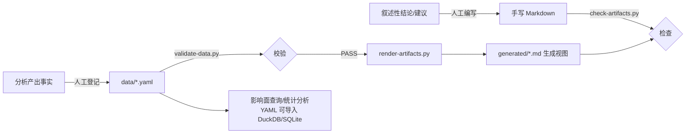

# 产物输出规范 · 数据驱动配套实现

> 《遗留系统分析产物输出格式规范》v3.0 第五章的配套参考实现。核心思想：**数据是源，文档是视图**——可枚举事实登记在 YAML 数据文件（唯一数据源），统计表、索引、矩阵、mermaid 图全部由工具生成，叙述性内容由人编写。

## 目录结构

```
产物输出规范-数据驱动配套/
├── README.md                      ← 本文件
├── schemas/
│   └── artifacts.schema.yaml      ← 数据文件模式（字段、枚举、ID 模式）
├── data/
│   └── 示例-订单创建/              ← 示例：订单创建上下文的全部事实数据
│       ├── entities.yaml          ← 上下文、聚合根、对象树、关系
│       ├── rules.yaml             ← 业务规则 + 依赖边
│       ├── states.yaml            ← 状态机（Order）
│       ├── flows.yaml             ← 主流程步骤、变体/异常/补偿
│       ├── decisions.yaml         ← 决策矩阵（促销规则选择）
│       ├── events.yaml            ← 领域事件（EVT001-005）
│       ├── quality.yaml           ← 技术债务 TD、测试缺口 GAP、覆盖率（权威登记处）
│       └── evidence.yaml          ← 证据登记 EVD（权威登记处）
├── tools/
│   ├── validate-data.py           ← 数据校验：结构/枚举/ID/跨文件引用
│   ├── render-artifacts.py        ← 视图生成：统计表/矩阵/mermaid/索引
│   └── check-artifacts.py         ← 产物检查：围栏/链接/ID 撞号/生成标记
└── generated/
    └── 示例-订单创建/              ← 生成输出（禁止手改）
```

## 快速开始

```bash
cd tools

# 1. 校验数据文件（结构、枚举、ID 模式、证据引用、依赖端点、状态端点）
python validate-data.py

# 2. 生成 Markdown 视图 → ../generated/示例-订单创建/
python render-artifacts.py

# 3. 检查手写产物（围栏配平、相对链接、TD/GAP/EVD 撞号、生成标记完整）
python check-artifacts.py ../README.md ../generated ../schemas
```

指定其他项目：`python validate-data.py ../data/我的项目`、`python render-artifacts.py ../data/我的项目 ../generated/我的项目`。

## 工作流水线



## 手写与生成的边界

| 内容 | 谁写 | 在哪 |
|------|------|------|
| 规则描述、状态转换、依赖边、债务/缺口、证据 | 人登记 | `data/*.yaml` |
| 统计表、索引表、依赖/互斥矩阵、状态机图、决策矩阵表 | 工具生成 | `generated/*.md` |
| 结论、判断、建议、风险分析、过渡文字 | 人编写 | 手写 Markdown（引用生成视图） |

**判断口诀**：能进表格单元格的是事实（进数据文件），需要成段解释的是观点（进 Markdown）。

## ID 登记制（TD/GAP/EVD）

- TD、GAP、EVD 的**唯一权威登记处**分别是 `quality.yaml`（TD、GAP）与 `evidence.yaml`（EVD）。
- 其他文件引用时使用链接形式 `[TD001](./generated/示例-订单创建/质量视图.md)`；**裸 ID = 定义，链接 ID = 引用**，`check-artifacts.py` 据此检查撞号。
- 先注册后引用：新债务/缺口/证据先登记数据文件拿到编号，再在产物中引用。

## 扩展到新项目

1. 复制 `data/示例-订单创建/` 为 `data/<项目名>/`，清空示例条目。
2. 先登记 `contexts`（entities.yaml）与 `evidence`（evidence.yaml），再登记规则/状态机/流程等（校验器按依赖顺序报错）。
3. 新增字段：先改 `schemas/artifacts.schema.yaml`，再改数据文件；校验器会拒绝未登记字段。

## Windows 编码约定

- 全部文件 UTF-8（带 BOM，utf-8-sig）；工具读写均使用 `utf-8-sig`，兼容带/不带 BOM。
- 控制台输出已强制 UTF-8（`sys.stdout.reconfigure`），PowerShell/CMD 下中文不乱码。
