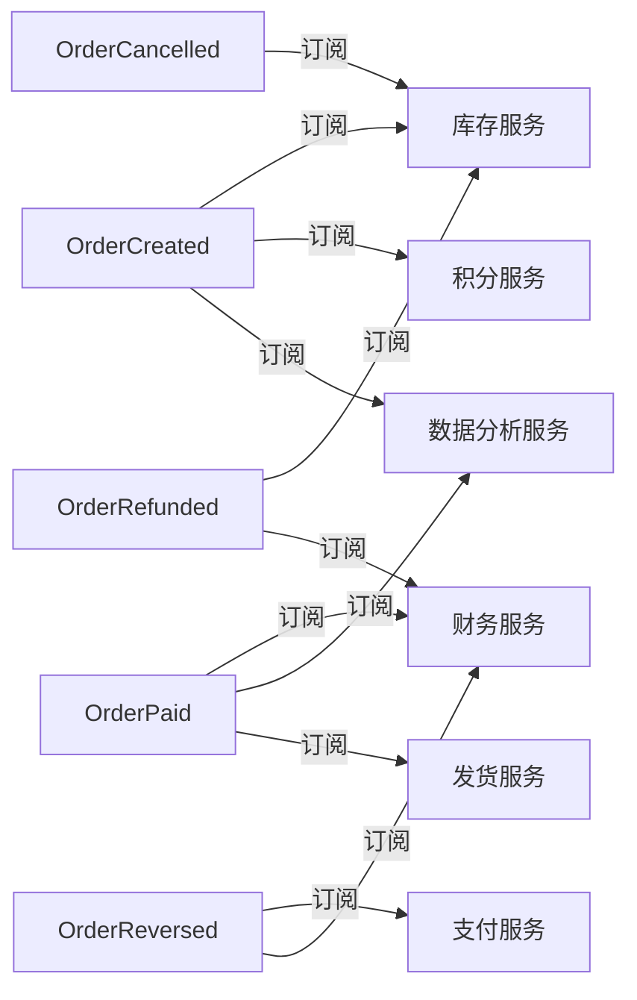

<!-- generated from: events.yaml | generator: render-artifacts.py | at: 2026-09-05 19:56 | 本文件为生成视图，禁止手改；数据变更后重跑本工具 -->
# 领域事件索引视图（生成）

| 事件ID | 事件 | 聚合根 | 触发时机 | Topic/Tag | 幂等键 | 订阅方 |
|------|------|------|------|------|------|------|
| EVT001 | OrderCreated | Order | 订单创建成功 | order-events / OrderCreated | eventId | 库存服务、积分服务、数据分析服务 |
| EVT002 | OrderPaid | Order | 订单支付成功 | order-events / OrderPaid | eventId | 财务服务、数据分析服务、发货服务 |
| EVT003 | OrderRefunded | Order | 订单退款完成 | order-events / OrderRefunded | eventId | 库存服务、财务服务 |
| EVT004 | OrderCancelled | Order | 订单取消 | order-events / OrderCancelled | eventId | 库存服务 |
| EVT005 | OrderReversed | Order | 订单反结账 | order-events / OrderReversed | eventId | 支付服务、财务服务 |

## 事件订阅关系图

