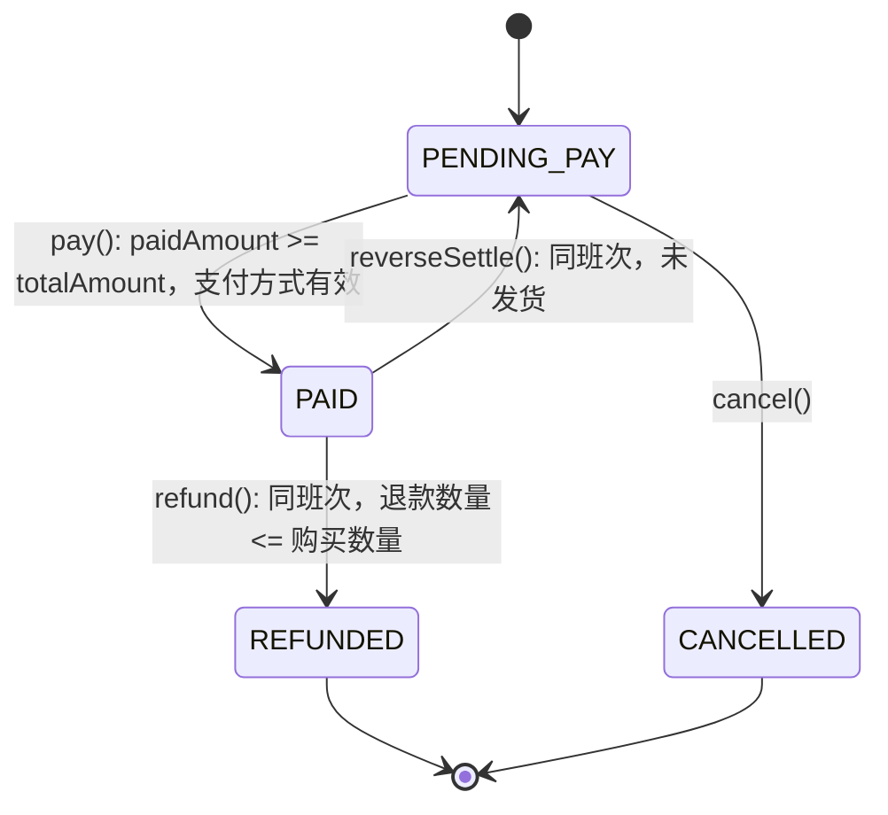

<!-- generated from: states.yaml | generator: render-artifacts.py | at: 2026-09-05 19:56 | 本文件为生成视图，禁止手改；数据变更后重跑本工具 -->
# 状态机视图（生成）

## SM01：Order 状态机

| 转换ID | 当前状态 | 事件/操作 | 前置条件 | 后置条件 | 目标状态 | 回滚 | 置信度 |
|------|------|------|------|------|------|------|------|
| T01 | PENDING_PAY | pay() | paidAmount >= totalAmount，支付方式有效 | 发送 OrderPaid 事件 | PAID | reverseSettle() | L5 |
| T02 | PENDING_PAY | cancel() | 无 | 发送 OrderCancelled 事件 | CANCELLED | - | L5 |
| T03 | PAID | refund() | 同班次，退款数量 <= 购买数量 | 发送 OrderRefunded 事件 | REFUNDED | - | L5 |
| T04 | PAID | reverseSettle() | 同班次，未发货 | 发送 OrderReversed 事件 | PENDING_PAY | - | L4 |

### 非法转换清单

| 当前状态 | 非法操作 | 说明 |
|------|------|------|
| PENDING_PAY | refund() | 未支付不能退款 |
| PAID | cancel() | 已支付不能取消，只能退款 |
| REFUNDED | pay() | 终态不能再支付 |
| CANCELLED | pay() | 终态不能再支付 |

### 状态持久化

| 状态 | 含义 | 存储值 | 是否终态 |
|------|------|------|------|
| PENDING_PAY | 待结账 | 0 | 否 |
| PAID | 已结账 | 1 | 否 |
| REFUNDED | 已退款 | 2 | 是 |
| CANCELLED | 已取消 | 9 | 是 |
