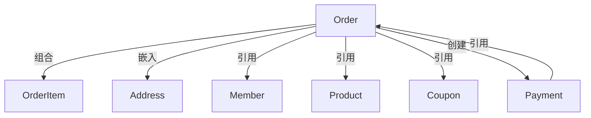

<!-- generated from: entities.yaml | generator: render-artifacts.py | at: 2026-09-05 19:56 | 本文件为生成视图，禁止手改；数据变更后重跑本工具 -->
# 聚合根索引视图（生成）

| 编号 | 聚合根 | 中文名 | 类型 | 状态 | 业务域 | 涉及上下文 | 数据库表 |
|------|------|------|------|------|------|------|------|
| AR01 | Order | 订单 | 聚合根 | 已确认 | 订单域 | CTX001、CTX002、CTX003 | t_order |
| AR02 | Payment | 支付 | 聚合根 | 已确认 | 支付域 | CTX002、CTX003 | - |
| AR03 | Member | 会员 | 聚合根 | 已确认 | 会员域 | CTX001、CTX002 | - |
| AR04 | Product | 商品 | 聚合根 | 已确认 | 商品域 | CTX001 | - |
| AR06 | Coupon | 优惠券 | 聚合根 | 已确认 | 营销域 | CTX001 | - |
| AR08 | Table | 餐台 | 聚合根 | 已确认 | 餐台域 | CTX001 | - |
| AR09 | ShoppingCart | 购物车 | 聚合根 | 候选 | 订单域 | CTX001 | - |

统计：已确认 6，候选 1，已排除 0。

## 上下文清单

| 上下文ID | 名称 | 业务域 | 优先级 |
|------|------|------|------|
| CTX001 | 订单创建 | 订单域 | P0 |
| CTX002 | 订单支付 | 订单域 | P0 |
| CTX003 | 订单退款 | 订单域 | P1 |

## 对象关系边表

| 类型 | 源 | 目标 | 多重性 | 说明 | 证据 |
|------|------|------|------|------|------|
| 组合 | Order | OrderItem | 1:N | 级联删除，必须通过聚合根修改 | EVD-007 |
| 嵌入 | Order | Address | 1:0..1 | 值对象嵌入，整体替换 | EVD-008 |
| 引用 | Order | Member | N:1 | 只存 memberId | EVD-006 |
| 引用 | Order | Product | N:1 | OrderItem 引用 productId | EVD-007 |
| 引用 | Order | Coupon | N:1 | 只存 couponId | EVD-006 |
| 创建 | Order | Payment | 1:1 | 支付成功后创建，状态需一致 | EVD-009 |
| 引用 | Payment | Order | N:1 | 存 orderId | EVD-009 |

## 聚合根依赖图

