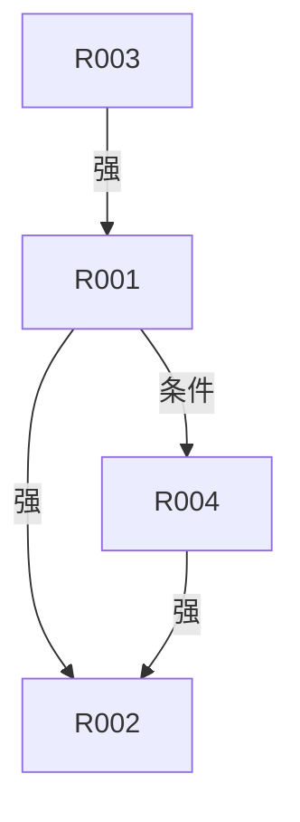

<!-- generated from: rules.yaml | generator: render-artifacts.py | at: 2026-09-05 19:56 | 本文件为生成视图，禁止手改；数据变更后重跑本工具 -->
# 规则视图（生成）

## 1. 规则统计

| 统计项 | 数量 |
|------|------|
| 规则总数 | 5 |
| 显性 | 4 |
| 隐性 | 1 |
| P0 | 4 |
| P1 | 1 |
| P2 | 0 |
| 置信度 L3 | 1 |
| 置信度 L4 | 1 |
| 置信度 L5 | 3 |

## 2. 规则清单

| 规则ID | 名称 | 类型 | 显隐 | 优先级 | 置信度 | 描述 | 证据 |
|------|------|------|------|------|------|------|------|
| R001 | 促销规则优先级 | 计算 | 显性 | P0 | L4 | 同时满足多个促销条件时，按 满减 > 折扣 > 优惠券 依次计算 | EVD-001 |
| R002 | 订单金额约束 | 约束 | 显性 | P0 | L5 | 订单总额必须 >= 0，即使应用所有促销之后 | EVD-002 |
| R003 | 库存校验 | 校验 | 显性 | P0 | L5 | 创建订单前必须校验库存，购买数量不能超过库存数量 | EVD-003 |
| R004 | 会员折扣叠加 | 计算 | 隐性 | P1 | L3 | 会员折扣可以与促销叠加使用 | EVD-004 |
| R005 | 订单号唯一性 | 校验 | 显性 | P0 | L5 | 订单号全局唯一，使用 Redis INCR 生成 | EVD-005 |

## 3. 推荐执行顺序

| 顺序 | 规则ID | 名称 | 理由 |
|------|------|------|------|
| 1 | R005 | 订单号唯一性 | 见规则描述与依赖边 |
| 2 | R003 | 库存校验 | 见规则描述与依赖边 |
| 3 | R001 | 促销规则优先级 | 见规则描述与依赖边 |
| 4 | R004 | 会员折扣叠加 | 见规则描述与依赖边 |
| 5 | R002 | 订单金额约束 | 见规则描述与依赖边 |

## 4. 规则依赖图

## 5. 依赖矩阵

|  | R001 | R002 | R003 | R004 | R005 |
|------|------|------|------|------|------|
| R001 | - | -强- | - | -条件- | - |
| R002 | - | - | - | - | - |
| R003 | -强- | - | - | - | - |
| R004 | - | -强- | - | - | - |
| R005 | - | - | - | - | - |

## 6. 高置信度规则（L4/L5）

| 规则ID | 名称 | 置信度 | 证据 |
|------|------|------|------|
| R001 | 促销规则优先级 | L4 | EVD-001 |
| R002 | 订单金额约束 | L5 | EVD-002 |
| R003 | 库存校验 | L5 | EVD-003 |
| R005 | 订单号唯一性 | L5 | EVD-005 |
