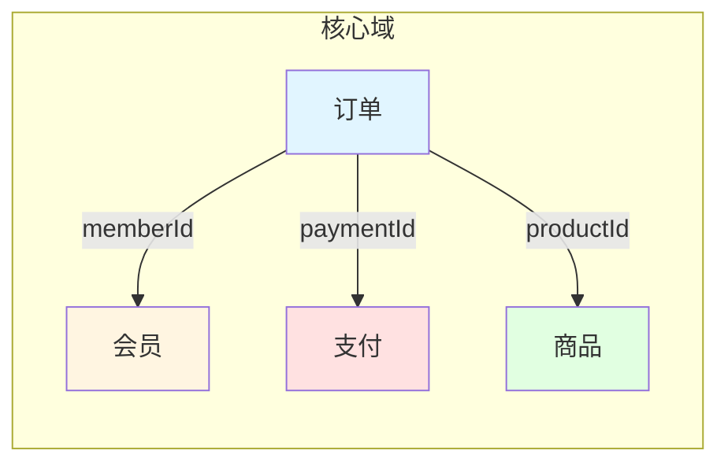

# 既有系统深度分析执行 SOP - 卓越标准版

> **文档编号**: SOP-LEGACY-ANALYSIS-EXCELLENT-v1.1
> **对齐方法论**: `既有系统深度分析方法论-卓越标准.md` v1.0
> **对齐输出规范**: `产物输出格式规范.md` v2.0
> **适用规模**: 5万-500万行代码的复杂遗留系统
> **质量红线**: L4-L5 占比 ≥ 95%，L1 占比 ≤ 1%，三跳抽象全部完成
> **生效日期**: 2026-09-05
> **文档状态**: 执行级 SOP，可直接用于团队排期与 AI 协作

---

## 0. 阅读指引与权威声明

### 0.1 本 SOP 在方法论体系中的位置

```
┌─────────────────────────────────────────────────────────────┐
│  L1 领域哲学  《更高维业务设计方法论》                        │
│      ↓ 提供目标/主体/对象/资源/规则/时间/不确定性/演化 8 维  │
├─────────────────────────────────────────────────────────────┤
│  L2 理论框架  《既有系统深度分析方法论-卓越标准》第零部分     │
│      ↓ 提供认识论(置信度L1-L5)、三跳抽象、混沌工程、规则系统 │
├─────────────────────────────────────────────────────────────┤
│  L3 方法论体系  《既有系统深度分析方法论-卓越标准》第一-七部分 │
│      ↓ 第一-七部分：对象/流程/状态/规则/集成/审计/风险管理   │
├─────────────────────────────────────────────────────────────┤
│  L4 执行流程    ★ 本文档 ★                                   │
│      ↓ 把方法论转成可被团队与 AI 严格执行的工序              │
├─────────────────────────────────────────────────────────────┤
│  L5 输出规范    《产物输出格式规范》                         │
│      ↓ 定义每个产物的字段、表格、图、证据规则               │
└─────────────────────────────────────────────────────────────┘
```

**权威关系**：本 SOP 的每一道工序必须能在方法论第一-七部分找到对应小节，输出物必须符合 L5 输出规范的字段定义。任何与本 SOP 冲突的旧做法、旧模板一律作废。

### 0.2 本 SOP 必须读懂的两大挑战

#### 挑战一：超大系统分析

> 卓越标准要求"L4-L5 ≥ 95%"，但人类分析师单日有效阅读量约 1500 行结构化代码、500 行散文式业务代码。对一个 50 万行的系统，即使 4 人团队满负荷也需要 3 个月才能覆盖，这还没算跑测试、补 DB 验证、写文档的时间。
>
> 直接套用方法论不可行。SOP 必须提供**上下文分片、流水线并行、证据索引、AI 协同**四件套，把"分析一个 50 万行系统"从"不可能"变成"可控"。

#### 挑战二：AI 上下文限制

> 现代 LLM 单轮上下文虽可达 100K-200K tokens，但**真实可用区间约 50K-80K tokens**（超出后推理质量断崖式下降）。同时 AI 存在三大不可恢复缺陷：
>
> 1. **窗口遗忘**：超过 ~30K tokens 之外的细节，AI 会"几乎忘记"
> 2. **跨调用漂移**：多次往返后，AI 对早期定义的术语、对象、规则会产生命名/语义漂移
> 3. **幻觉一致性**：AI 倾向于把"看起来合理但未在证据中出现"的细节当事实输出
>
> 因此 SOP 必须把"如何喂 AI"和"如何防 AI 漂移"作为一等公民来设计，而不是事后打补丁。

### 0.3 本 SOP 的四项铁律（违反任何一条视为产出不合格）

| 编号 | 铁律 | 适用范围 | 检测方法 |
|---|---|---|---|
| R1 | 三跳不可跳：对象→模式→领域，每一跳必须有显式证据链 | 全部 7 个分析维度 | 第六章审计 |
| R2 | 置信度不可虚标：L5 必须三源一致，L4 必须双源一致 | 全部结论 | 第六章证据审计 |
| R3 | 证据不可悬空：每条结论必须挂 `文件:行号 \| commit:hash \| 日期 \| 作者` 四元组 | 全部 L4-L5 项 | 自动审计脚本 |
| R4 | AI 产出不可直接交付：AI 生成的每条结论必须由人类分析师按 10% 抽样 + 关键项 100% 复核 | AI 协助的全部产出 | 复审计时 |

### 0.4 卓越标准速查表

> 完整定义见方法论第零部分与第六部分。本节为执行期间快速对照。

| 维度 | 卓越阈值 | 不可接受的底线 |
|---|---|---|
| L4-L5 占比 | ≥ 95% | < 90% 必须返工 |
| L5 占比 | ≥ 70% | < 50% 视为方法论失败 |
| L1 占比 | ≤ 1% | > 5% 视为证据不足，禁止交付 |
| 三跳完成度 | 三跳全部完成 | 缺任何一跳视为分析未完成 |
| 混沌测试覆盖 | 100% 集成点 | < 80% 视为集成章节不可交付 |
| 状态机覆盖 | 全部状态可证可达 + 全部终态无出边 | 任何孤立状态必须说明原因 |
| 规则冲突 | 严重冲突 0 条 | 严重冲突必须解决或升级风险 |
| 关联错误 | 循环组合 0 条、孤儿实体已标注 | 循环组合必须解决 |
| 证据新鲜度 | ≤ 6 个月 | > 6 个月的 L4-L5 必须降一级 |
| 双人复核 | 关键项 100% | 未复核不得标记 L5 |

---

## 1. SOP 总览

### 1.1 阶段划分（必须严格按顺序）

```
阶段 0 立项与上下文分片                1-3 天     1 人   产出：分片计划 + 证据索引骨架
  ↓
阶段 1 对象建模（第一跳 + 第二跳）       8-15 天    3-5 人 产出：聚合根卡 + 关系网络 + 业务模式卡
  ↓
阶段 2 流程与状态机（第一跳）           5-10 天    3-4 人 产出：流程卡 + 状态机卡 + 异常/补偿流
  ↓
阶段 3 规则与集成（第一跳 + 不确定性）   5-10 天    2-3 人 产出：规则库 + 集成卡 + 混沌测试矩阵
  ↓
阶段 4 置信度审计与交付校验             2-3 天     2 人   产出：审计报告 + 最终交付物
  ↓
持续维护（投产 3/6/12 个月触发）        按需       1-2 人
```

> **排期缓冲要求**：上表为净分析工时，未含复核与返工。按 7.2 节 SLA（人类复核工时占比 ≥ 30% 总工时）与各 Gate 返工概率，实际排期必须在净工时基础上预留 ≥ 20% 缓冲，专项用于双人复核、证据补全与 Gate 返工；未预留缓冲的排期视为不完整，不得启动。

### 1.2 阶段-方法论-产物 三方对齐矩阵

| SOP 阶段 | 方法论章节 | 核心产物 | 关键证据源 | AI 介入方式 |
|---|---|---|---|---|
| 阶段 0 立项与上下文分片 | 第 0、7 部分 | 分片计划、证据索引、风险登记册 | 仓库 README、架构图、ADR | AI 协助扫描、人类决策 |
| 阶段 1 对象建模 | 第 1 部分 | 聚合根卡、对象关系网络、业务模式卡、领域模型卡 | Entity/表/DTO | AI 提取 + 人类校验 |
| 阶段 2 流程与状态机 | 第 2、3 部分 | 流程卡（含异常/补偿）、状态机卡 | Controller/Service/Job | AI 追踪 + 人类审计 |
| 阶段 3 规则与集成 | 第 4、5 部分 | 规则库、规则依赖图、集成卡、混沌测试矩阵 | 注解/校验/Feign/MQ | AI 提取 + 人类补测试 |
| 阶段 4 审计与交付 | 第 6 部分 | 置信度统计、证据审计报告、交付清单 | 全部产出 | AI 汇总 + 人类最终签字 |

### 1.3 团队组成与角色定义

| 角色 | 人数 | 必备能力 | 严禁事项 |
|---|---|---|---|
| 分析总负责人 | 1 | 8 年以上架构经验，熟悉本方法论 | 不得同时承担具体分析任务超过 50% |
| 资深分析师 | 2-3 | 5 年以上开发，熟悉被分析系统 | 不得擅改证据链 |
| 业务专家 | 1 | 在系统相关业务领域 ≥ 3 年 | 不得独自负责技术决策 |
| AI 协作分析师 | 1 | 精通本方法论 + AI 提示工程 | 不得直接给业务/技术结论 |
| 质量审计师 | 0.5 | 熟悉方法论置信度规则 | 与分析团队无业务汇报关系 |

### 1.4 AI 协作的三种合法模式

| 模式 | 适用场景 | AI 产出形态 | 人类必做动作 |
|---|---|---|---|
| A 模式：候选生成 | 候选对象/规则/集成点扫描 | 候选清单（含证据） | 全量复核标记，丢弃/确认 |
| B 模式：模板填充 | 按固定模板产出结构化产物 | 完整产物草稿 | 100% 抽样复核 + 关键项 100% 复核 |
| C 模式：辅助问答 | 一次性的查找/解释/对比 | 答案片段 | 100% 校验是否与证据一致 |

**禁止模式 D：让 AI 直接给最终结论**。任何"AI 直接产出 L4-L5 结论"的行为视为绕过证据审计。

---

## 2. 阶段 0：立项与上下文分片（1-3 天）

> **本阶段目标**：把"分析一个超大系统"这件不可能的事，拆成"分析 N 个可控切片"这件可执行的事。
>
> **本阶段产物**：分片计划、证据索引骨架、风险登记册、立项决议书、工具清单（`tools-manifest.yaml`）

### 2.1 输入检查（不通过则禁止启动）

| 检查项 | 阈值 | 负责人 |
|---|---|---|
| 系统代码量 | 5 万 - 500 万行 | 总负责人 |
| 是否有可访问的代码仓库 | 必须有 | 总负责人 |
| 是否有可访问的数据库 | 必须有 ≥ 1 个 | 资深分析师 |
| 是否有业务专家 | 必须有 ≥ 1 人 | 总负责人 |
| 业务专家可用工时 | ≥ 5 人天 | 总负责人 |
| 分析窗口 | ≥ 20 个工作日 | 总负责人 |
| ROI 评估 | ≥ 200% 强烈推荐；50-200% 建议聚焦；< 50% 改用轻量级 | 总负责人 |
| LLM 调用预算 | ≥ 300 次/阶段 | AI 协作分析师 |

**任一不通过**：暂停启动，按方法论第 0 部分"不适合使用场景"判定是否改用轻量级评估。

### 2.2 系统规模量化（必须前置）

> **关键认识**：上下文分片的依据不是"业务域"或"模块名"，而是**真实证据密度**。

#### 步骤 2.2.1：宏观扫描

```bash
# 用脚本（详见附录 A）一次性产出系统宏观画像
# 1. 先构建图谱
code-review-graph build --repo <repo_path>
code-review-graph postprocess --repo <repo_path>

# 2. 宏观扫描
python macro-scan.py \
    --repo <repo_path> \
    --business-prefix <业务包前缀> \
    --output macro-profile.json
```

产出物 `macro-profile.json` 必须包含：

```json
{
  "code_metrics": {
    "total_loc": 524318,
    "java_files": 1842,
    "controller_count": 87,
    "service_count": 234,
    "entity_count": 167,
    "mapper_count": 167,
    "job_count": 23
  },
  "test_metrics": {
    "test_files": 412,
    "test_coverage": "62%"
  },
  "db_metrics": {
    "database_count": 4,
    "total_tables": 287,
    "tables_with_fk": 198,
    "tables_no_entity": 12
  },
  "domain_signal": {
    "root_packages": ["com.x.order", "com.x.pay"],
    "module_size_distribution": "long_tail",
    "largest_module": {"name": "order", "loc": 187234, "files": 312}
  },
  "ai_budget_estimate": {
    "candidate_objects": 167,
    "candidate_flows": 87,
    "candidate_rules": 450,
    "estimated_ai_calls": 1240
  }
}
```

#### 步骤 2.2.2：上下文分片算法

**核心公式**（由总负责人 + AI 协作分析师联合决策）：

```
每个分析切片 A 满足：
  A.code_evidence_files ≤ 60          （单切片 AI 单轮可读完）
  A.db_tables ≤ 8                       （单切片 DB 验证集中可跑完）
  A.boundary_files ≤ 3                  （切片对外暴露 ≤ 3 个入口）
  A.lines_of_evidence ≤ 5000            （证据行数，包含注释）
```

**三个层级**：

| 层级 | 颗粒度 | 决策依据 |
|---|---|---|
| L1 业务域分片 | 按 DDD 限界上下文或项目 module 切 | 业务价值+业务依赖 |
| L2 聚合根分片 | 一个 L1 分片内按聚合根切 | 证据密度+读写耦合度 |
| L3 流程分片 | 一个聚合根内按核心流程切 | 入口 API + 事务边界 |

**示例**（50 万行订单/支付/库存系统）：

| L1 分片 | L2 聚合根分片 | L3 流程分片 | 估算工作量 |
|---|---|---|---|
| 订单域 | Order 聚合根 | 创建/支付/取消/退款/反结账 | 8 人天 |
| 订单域 | OrderItem（值对象） | 与 Order 合并分析 | 0 人天 |
| 支付域 | Payment 聚合根 | 创建/退款/对账 | 6 人天 |
| 库存域 | Inventory 聚合根 | 扣减/回补/锁定 | 5 人天 |
| 会员域 | Member 聚合根 | 注册/积分/等级 | 4 人天 |
| 跨域 | 集成与混沌测试 | 全部集成点 | 5 人天 |
| 全域 | 三跳抽象第三跳 + 总览报告 | 全域聚合 | 4 人天 |

### 2.3 上下文预算分配（必须写入分片计划）

> **核心原则**：每个上下文窗口必须**留白 30%**，不能贪满。

| 上下文类型 | 单轮预算 | 累计预算 | 留白 |
|---|---|---|---|
| 系统提示 + 方法论要点 | 8K tokens | 一次性加载 | — |
| 当前切片证据 | ≤ 35K tokens | 单次 | 15K 留白 |
| 历史产物引用 | ≤ 15K tokens | 单次 | 5K 留白 |
| AI 输出 | ≤ 8K tokens | 单次 | — |
| 审计与回滚空间 | — | — | 总预算的 20% |

**强制规则**：

1. 任何**单次 AI 调用输入**不得超过 50K tokens。超出必须用 RAG / 摘要 / 链接三选一。
2. 任何**单次 AI 调用输出**超过 4K tokens 必须暂停，让 AI 自己分块。
3. **跨切片引用**只能通过"分片契约文件"（见 2.4），禁止在 AI 上下文里塞整个跨切片证据。

### 2.4 分片契约文件（Slice Contract）

每个 L1/L2 分片必须建立一份 `slice-contract.yaml`，作为该分片的**唯一事实源**：

```yaml
# slice-contract.yaml
slice_id: order-domain.order-aggregate
version: 1.0
owner: zhang.san
created: 2026-09-05

# 输入边界
includes:
  packages:
    - "com.x.order.**"
  tables:
    - "t_order"
    - "t_order_item"
    - "t_order_log"
  apis:
    - "POST /order/create"
    - "POST /order/cancel"
    - "POST /order/refund"

# 对外契约（不展开，只声明）
external_contracts:
  - target: payment-domain.payment-aggregate
    type: sync_call
    evidence: "OrderService.java:234"
    contract_doc: "./contracts/order-to-payment.md"

# AI 上下文种子文件（不超过 30K tokens）
ai_seed_file: "./ai-seeds/order-aggregate-seed.md"

# 防漂移关键词（AI 必须严格使用这些术语）
vocabulary:
  - "订单 = Order聚合根"
  - "明细 = OrderItem实体"
  - "优惠 = Promotion值对象，不与Discount混用"
  - "支付成功 = Payment.status=PAID，Order.status=PAID"

# 已知歧义点
ambiguities:
  - "代码中 'order' 一词既指 Order 也指 OrderItem，需通过包路径区分"
```

### 2.5 风险登记册（Risk Register）

阶段 0 必须建立 `risk-register.yaml`，至少登记 10 类风险：

```yaml
risks:
  - id: R-001
    category: resource
    description: 关键业务专家中途离职
    probability: medium
    impact: high
    mitigation: 关键决策全部进入决策日志，分散给 ≥ 2 名业务专家
    owner: pm
    status: open
  
  - id: R-002
    category: ai
    description: AI 在跨切片时产生术语漂移
    probability: high
    impact: medium
    mitigation: 强制使用分片契约的 vocabulary；每 50 次 AI 调用做一次术语一致性校验
    owner: ai-collaborator
    status: open
```

### 2.6 阶段 0 准入门（Gate 0）

**所有准入门未通过，禁止进入下一阶段。**

- [ ] 系统宏观画像 `macro-profile.json` 生成完毕
- [ ] 分片计划 `slices.yaml` 评审通过（含总负责人、业务专家、AI 协作分析师三方签字）
- [ ] 每个分片的 `slice-contract.yaml` 已建立
- [ ] 每个分片的 AI 种子文件已建立且单文件 ≤ 30K tokens
- [ ] 风险登记册建立，至少登记 10 类风险
- [ ] 强制工具清单 `tools-manifest.yaml` 已建立（版本、路径、维护人、最后验证日期）
- [ ] AI 调用预算申请已批准
- [ ] 团队角色分工明确并通知到位

---

## 3. 阶段 1：对象建模（8-15 天）

> **本阶段目标**：完成方法论第一跳（业务对象）+ 第二跳（业务模式）的全部产出。
>
> **本阶段产物**：候选对象清单、聚合根卡（含证据）、对象关系网络、业务模式卡（≥ 1 个聚合根对应 ≥ 1 个模式卡）、领域模型卡（每领域 ≥ 1 张，第三跳产物）、对象关系冲突清单

> **工具说明**：
> 1. 先运行 `extract-fields.py` 预提取所有业务类的字段信息（避免逐个读文件）
> 2. 再运行 `analyze-objects.py` 进行对象建模和聚合根判定

### 3.1 子阶段划分

```
3.0 字段预提取               <5分钟    预提取所有业务类字段
3.1 候选对象扫描             1-2 天   候选对象清单（候选=聚合根候选∪实体候选∪值对象候选）
3.2 聚合根判定             1-2 天   聚合根列表（含证据）
3.3 对象树完整性追踪       2-4 天   每个聚合根的对象树（到叶子）
3.4 关系网络生成           1-2 天   关系矩阵 + 关系网络图 + 冲突清单
3.5 业务模式抽象（第二跳） 2-4 天   业务模式卡（每聚合根 ≥ 1 个）
```

### 3.0 字段预提取（必须先执行）

```bash
# 从图谱获取业务类，只解析这些类的字段（不解析第三方库）
python extract-fields.py \
    --graph-db <repo>/.code-review-graph/graph.db \
    --business-prefix <业务包前缀> \
    --output <项目>-fields.json
```

### 3.1 候选对象扫描

#### 3.2.1 AI 候选生成（A 模式）

AI 协作分析师按每个 L2 分片调用 AI（A 模式）：

```
提示模板（详见附录 B）：
你是一名资深 Java 架构师，正在执行既有系统分析。
请扫描以下代码与表结构，输出候选对象清单。

【硬约束】
1. 仅基于给定证据，禁止推断未在代码/表/接口中出现的内容
2. 每个候选对象必须给出 3 类证据：
   - 代码证据（文件:行号）
   - 表证据（表名）
   - 接口证据（API 路径）
3. 候选对象只识别"看起来像业务对象"的实体，不区分聚合根/实体/值对象
4. 输出 YAML 格式，遵守以下 schema

【输入】
代码分片：{slice_path}
证据种子：{ai_seed_file}
```

输出 schema（必须严格遵守）：

```yaml
- candidate_id: C-001
  name: Order
  name_en: Order
  evidence:
    code: "com.x.order.OrderEntity.java:23"
    db_table: "t_order"
    api: "POST /order/create"
  confidence: L5
  notes: ""
```

#### 3.2.2 人类必做：候选评审

**AI 输出仅作为候选清单的初稿**，资深分析师必须做以下动作：

1. **100% 复核所有 L5 候选**：用 IDE 直接跳转代码验证
2. **抽样 20% L4 候选**：人工验证双源证据
3. **丢弃所有 AI 推断但无代码证据的候选**：禁止让 AI 自己造对象
4. **补充人类视角遗漏的候选**：手动扫描未被 AI 抓到的 Entity 类

#### 3.2.3 候选合并与去重

合并规则：
- 同名（中文/英文/缩写）必须合并 → 由业务专家裁定统一名称
- 同表不同实体（如 OrderEntity / OrderPO）→ 合并入主实体，弃用项标记 deprecated
- DTO/VO/Request/Response → 不进入候选对象清单，作为该实体的"投影"列入"对象视图"附录

### 3.3 聚合根判定（过滤器 1-3）

#### 3.3.1 严格按方法论 1.1 节执行四重过滤器

**过滤器 1：候选对象扫描**（已在 3.2 完成）

**过滤器 2：聚合根判定**

判定规则（强制全部满足）：

| 判定维度 | 检查项 | 证据要求 | 置信度 |
|---|---|---|---|
| 独立标识 | 有 `@Id` 或 `pid/lid` 字段 | 代码 | L4 |
| 独立生命周期 | 有 create/update/delete 方法 | 代码 | L4 |
| 生命周期非嵌套 | 不被其他聚合根的 `@OneToMany(cascade=ALL)` 持有 | 代码 | L4 |
| 业务状态 | 有状态字段或有状态机 | 代码 + DB | L5 |

**过滤器 3：实体与值对象区分**

| 区分项 | 值对象 | 实体 |
|---|---|---|
| 标识 | 无 ID | 有 ID |
| 可变性 | 不可变（无 setter 或 final） | 可变 |
| 相等性 | 值相等 | ID 相等 |
| 持久化 | 嵌入主表（`@Embedded`） | 独立表 |
| 代码证据 | `@Embeddable` 或 final class 无 ID | `@Entity` + `@Id` |

#### 3.3.2 AI 协作 + 人类签批

- AI（A 模式）：候选聚合根清单（聚合根/实体/值对象三分）
- 资深分析师（B 模式）：按过滤器逐项打勾，产出 `aggregate-roots.yaml`
- 业务专家：核对业务身份，签字

#### 3.3.3 聚合根卡（产出物）

每个聚合根必须产出一张 `aggregate-card.yaml`，严格按以下 schema：

```yaml
aggregate_id: AR-001
name: 订单
name_en: Order
type: root
status: confirmed
version: 1.0
owner: zhang.san
reviewed_by: li.si
reviewed_at: 2026-09-10

# 三跳的第一跳证据
business_identity:
  description: "顾客与商户之间完成一次交易的契约"
  evidence:
    code: "OrderEntity.java:23"
    db: "t_order"
    api: "POST /order/create"

lifecycle:
  create_method: "OrderService.createOrder()"
  create_evidence: "OrderService.java:45"
  archive_strategy: "逻辑删除 + 归档表"

state_machine_ref: SM-001

# 包含对象（叶子节点追踪）
contains:
  - object: OrderItem
    type: entity
    multiplicity: "1..N"
    cascade: "ALL + orphanRemoval"
    evidence: "OrderEntity.java:67"
  - object: Address
    type: value_object
    multiplicity: "0..1"
    embedding: "@Embedded"
    evidence: "OrderEntity.java:89"

references:
  - object: Member
    type: aggregate_root
    ref_type: id_reference
    multiplicity: "0..1"
    nullable: true
    evidence: "OrderEntity.java:34"

# 完整性检查
integrity_check:
  leaves_traced: true
  cycle_detected: false
  max_depth: 3

# 三跳证据链（必须填写）
three_jump_evidence:
  jump1_to_business_object: "通过代码 Entity + 表 + API 三源确认 Order 是聚合根。业务身份：顾客与商户之间完成交易的契约。证据：OrderEntity.java:23 + t_order + POST /order/create。"
  jump2_to_pattern: PM-001
  jump3_to_domain: DM-ORDER
```

### 3.4 对象树完整性追踪（过滤器 4）

#### 3.4.1 完整性判定标准（卓越标准 ≥ L4-L5 占 95%）

- 所有聚合根必须展开到叶子节点（基本类型 + 值对象不可再分）
- 所有组合关系必须显式列出 cascade 策略
- 所有 ID 引用必须显式声明 nullable 和 multiplicity
- 叶子节点必须有完整证据三元组（代码行号 + 表字段 + API 字段）

#### 3.4.2 循环依赖检测

```bash
# 自动检测脚本（附录 A）
python3 detect-cycle.py --aggregate-root AR-001
```

检测到循环 → 立即停止分析该聚合根，进入冲突处理流程（3.4.4）。

#### 3.4.3 关系网络生成

AI 协作分析师调用 AI（B 模式）：

```
提示模板：
基于以下聚合根卡与对象树，生成对象关系网络：
1. 输出 mermaid 关系图（仅 1 张，组合图优先）
2. 输出关系矩阵（Markdown 表格）
3. 输出关系冲突清单（4 类：循环组合、多重强依赖、孤儿实体、状态不一致）

【输入】
聚合根卡：{aggregate_cards_dir}
分片契约：{slice_contract}
词汇表：{slice_vocabulary}
```

#### 3.4.4 关系冲突处理

| 冲突类型 | 严重程度 | 处理路径 |
|---|---|---|
| 循环组合（A 组合 B，B 组合 A） | 阻断 | 资深分析师 + 总负责人决定方向，立即改图 |
| 多重强依赖（同一实体被 ≥ 2 个聚合根组合） | 警告 | 业务专家裁定业务语义，决定调整对象模型或保留 |
| 孤儿实体（无引用） | 警告 | 资深分析师判断是否为聚合根候选 |
| 状态不一致（Order.PAID 但 Payment 缺失） | 阻断 | 必须在状态机卡中显式声明 |

### 3.5 业务模式抽象（第二跳）

#### 3.5.1 业务模式的判定标准

**业务模式**：多个对象、规则、协作、时序、异常处理共同形成的**可重复的结果机制**。

判定三问：

1. 该机制是否在 ≥ 2 个聚合根中重复出现？
2. 该机制是否有独立的失败/降级/补偿路径？
3. 该机制是否定义了对象间的"标准协作剧本"？

满足任意 2/3 → 可视为业务模式候选。

#### 3.5.2 业务模式卡（产出物）

```yaml
pattern_id: PM-001
name: 订单-库存-支付 三方 Saga
type: saga
status: confirmed
aggregates_involved: [AR-001, AR-002, AR-005]
version: 1.0

# 第二跳证据链
business_purpose: "在订单创建涉及多个聚合根时，保证跨聚合根的最终一致性。"

pattern_structure:
  participants:
    - role: initiator
      aggregate: AR-001
      action: "createOrder()"
    - role: compensable
      aggregate: AR-005
      action: "deductStock()"
    - role: compensable
      aggregate: AR-002
      action: "createPayment()"
  
  steps:
    - order: 1
      action: "create order in PENDING_PAY"
      evidence: "OrderService.java:45"
      compensable: true
      compensation: "deleteOrder()"
    - order: 2
      action: "deduct stock"
      evidence: "ProductService.java:78"
      compensable: true
      compensation: "restoreStock()"
    - order: 3
      action: "create payment"
      evidence: "PaymentService.java:56"
      compensable: true
      compensation: "cancelPayment()"
  
  failure_path: "任一步骤失败，按逆序执行补偿。证据：OrderCompensationService.java:23"

three_jump_evidence:
  jump2_from_objects: "从 AR-001 / AR-002 / AR-005 三个聚合根共同协作得出该模式，证据：3 个聚合根的服务方法相互调用 + 共同事务补偿日志。"
  jump3_to_domain: DM-ORDER-AGGREGATION
```

#### 3.5.3 第三跳：领域模型抽象（领域模型卡）

**领域模型**是第三跳的证明对象：必须证明各业务模式之间存在稳定的**能力边界、责任边界、依赖方向和变化隔离依据**（方法论第零部分）。技术包结构、微服务名称、数据库分库**不能单独**作为领域边界证据。

执行要求：

1. 每个 L1 业务域至少产出 1 张领域模型卡（`domain-card.yaml`），在阶段 1 与业务模式卡同步产出。
2. 领域卡默认至少汇聚 2 个业务模式（PM-xxx）；不足 2 个的，必须在卡中说明理由并经业务专家签批。
3. 四项边界证明（能力 / 责任 / 依赖方向 / 变化隔离）缺一不可，每项必须给出代码级证据。
4. 跨域的**全域领域地图**（领域间依赖方向总览）在全域分片聚合，纳入执行摘要。

领域模型卡 schema（必须严格遵守）：

```yaml
domain_id: DM-ORDER
name: 订单领域
name_en: Order Domain
status: confirmed
version: 1.0
owner: zhang.san
reviewed_by: li.si
reviewed_at: 2026-09-11

# 第三跳证据链：领域 ← 模式（逐条可回溯）
patterns_involved:
  - pattern: PM-001
    contribution: "Saga 补偿机制支撑本领域'交易最终一致性'能力"
    evidence: "OrderCompensationService.java:23"
  - pattern: PM-002
    contribution: "订单生命周期模式支撑本领域'交易状态管理'能力"
    evidence: "OrderStatus.java:5"

# 四项边界证明（方法论第零部分强制）
boundary_proof:
  capability_boundary:
    statement: "本领域对外提供'交易契约管理'能力，不含支付执行与库存扣减"
    evidence: "OrderService.java:45 仅调用 PaymentServiceClient.submit()，不操作支付账务表"
  responsibility_boundary:
    statement: "订单状态流转责任在本领域，支付结果仅作为触发事件"
    evidence: "OrderService.java:89 setStatus(PAID)"
  dependency_direction:
    statement: "订单 → 支付单向依赖，禁止反向引用"
    evidence: "PaymentServiceClient.java:45；支付域无 OrderClient"
  change_isolation:
    statement: "计价规则变更不影响支付域模型"
    evidence: "OrderCalculator.java:23 与支付域无共享实体"

aggregates_involved: [AR-001]

integrity_check:
  all_patterns_traced: true
  boundary_evidence_complete: true

three_jump_evidence:
  jump1_to_business_object: "DM-ORDER 聚合 AR-001 全部业务对象"
  jump2_to_pattern: "PM-001、PM-002"
  jump3_to_domain: "DM-ORDER（本卡即第三跳证明对象）"
```

### 3.6 阶段 1 准入门（Gate 1）

- [ ] 所有候选对象已合并去重，候选清单签字
- [ ] 每个聚合根都有 `aggregate-card.yaml`，且完整性检查通过
- [ ] 每个聚合根的对象树都追踪到叶子节点
- [ ] 关系网络图、关系矩阵、冲突清单全部生成
- [ ] 关系冲突全部处理或升级
- [ ] 至少识别出 ≥ 1 个业务模式卡，且与 ≥ 2 个聚合根关联
- [ ] 每个领域至少 1 张领域模型卡，第三跳证据链（模式 → 领域）在卡上闭合
- [ ] 阶段 1 置信度统计：L4-L5 占比 ≥ 93%（留 2% 给后续阶段补证据）

### 3.7 AI 上下文防漂移检查清单

| 检查项 | 频率 | 检查方法 |
|---|---|---|
| 术语一致性 | 每 50 次 AI 调用 | 自动化脚本检查产物中的术语是否符合 `slice-contract.yaml` 的 vocabulary |
| 证据链完整性 | 每个产物完成后 | 自动校验所有证据文件路径、commit、行号 |
| 三跳证据闭合 | 每个聚合根卡完成后 | 人工审计 jump1→jump2→jump3 三跳证据链是否完整 |
| AI 输出与分片契约一致性 | 每次 B 模式调用 | 强制要求 AI 引用 `slice-contract.yaml` 的字段 |
| 跨切片引用合规 | 跨切片时 | 必须通过 `external_contracts.contract_doc` 引用，不允许直接塞证据 |

---

## 4. 阶段 2：流程分析与状态机（5-10 天）

> **本阶段目标**：完成方法论第二部分（流程）+ 第三部分（状态机）的全部产出。
>
> **本阶段产物**：流程卡（含主流程、变体流、异常流、补偿流）、状态机卡（含证据）、状态机验证报告

### 4.1 子阶段划分

```
4.1 流程入口扫描          1 天     主流程清单（按 API 入口）
4.2 流程卡生成（含异常补偿）3-5 天  每个主流程一张卡
4.3 状态识别             0.5 天   状态枚举全集
4.4 状态转换追踪         1-2 天   状态机卡（含证据）
4.5 状态机验证           0.5 天   不变量检查 + 异常转换检测
```

### 4.2 流程入口扫描

**入口发现四源**：

| 来源 | 扫描方式 | 输出 |
|---|---|---|
| Controller 层 | `@PostMapping` / `@GetMapping` / `@RequestMapping` | API URL + 方法名 |
| Service 层 | 方法名含 create/update/process/handle/submit | 候选流程入口 |
| Job/Scheduled | `@Scheduled` / `@Job` | 定时流程 |
| MQ 消费者 | `@KafkaListener` / `@RocketMQMessageListener` | 异步流程入口 |

**AI 协作（B 模式）**：AI 输出入口清单，人类 100% 复核。

### 4.3 流程卡生成

#### 4.3.1 单流程卡 schema（必须严格遵守）

```yaml
flow_id: F-001
name: 创建订单
name_en: createOrder
type: command
aggregates_involved: [AR-001, AR-002, AR-005]
version: 1.0
owner: wang.wu
reviewed_by: li.si
reviewed_at: 2026-09-12

# 入口
entry:
  api: "POST /order/create"
  evidence: "OrderController.java:23"
  transaction_boundary: "@Transactional"
  transaction_evidence: "OrderService.java:45"

# 主流程（happy path）
main_flow:
  - step: 1
    action: "validateMember"
    target: AR-005
    evidence: "OrderService.java:48"
    input: "memberId"
    output: "member"
    confidence: L4
  - step: 2
    action: "validateStock"
    target: AR-007
    evidence: "OrderService.java:55"
    input: "items"
    output: "stockState"
    confidence: L4
  - step: 3
    action: "calculateAmount"
    target: AR-001
    evidence: "OrderCalculator.java:23"
    confidence: L5
  - step: 4
    action: "createOrder"
    target: AR-001
    evidence: "OrderService.java:82"
    side_effect: "INSERT t_order"
    confidence: L5
  - step: 5
    action: "publishOrderCreated"
    target: AR-001
    evidence: "OrderService.java:96"
    side_effect: "MQ send"
    confidence: L4

# 变体流
variant_flows:
  - variant_id: V-001
    trigger_condition: "couponId != null"
    diff_from_main: "步骤 3.5 增加 couponValidate"
    evidence: "OrderService.java:78"
    confidence: L4

# 异常流（必须 ≥ 主流程步骤数 / 2）
exception_flows:
  - ex_id: E-001
    trigger_condition: "memberId 找不到"
    exception_type: "MemberNotFoundException"
    caught_at: "OrderService.java:50"
    handling: "throw + 事务回滚"
    compensation: "无（未产生副作用）"
    evidence: "OrderService.java:50-52"
    confidence: L5
  - ex_id: E-002
    trigger_condition: "stock < quantity"
    exception_type: "InsufficientStockException"
    caught_at: "OrderService.java:58"
    handling: "throw + 事务回滚"
    compensation: "无"
    evidence: "OrderService.java:58-60"
    confidence: L5
  - ex_id: E-003
    trigger_condition: "MQ 发送失败"
    exception_type: "EventPublishException"
    caught_at: "OrderService.java:97"
    handling: "记录失败事件表 + 不抛"
    compensation: "定时任务重试（OrderEventRetryJob.java:34）"
    evidence: "OrderService.java:97-105"
    confidence: L4

# 补偿流（关键点必须显式）
compensation_flows:
  - comp_id: C-001
    trigger: "订单创建成功后，库存扣减失败"
    compensation_action: "删除已创建订单 + 记录补偿日志"
    evidence: "OrderCompensationService.java:23"
    idempotent: true
    idempotent_evidence: "OrderCompensationService.java:30"
    confidence: L5

# 完整性自检
self_check:
  main_flow_steps: 5
  variant_flows: 1
  exception_flows: 3
  compensation_flows: 1
  coverage_evidence: "所有 try-catch 已被人工逐行扫描"

three_jump_evidence:
  jump1_to_business_object: "F-001 操作 AR-001 聚合根的创建"
  jump2_to_pattern: "PM-001 订单-库存-支付 Saga"
  jump3_to_domain: "DM-ORDER"
```

#### 4.3.2 流程异常覆盖率硬约束

> **卓越标准**：异常流数量 ≥ 主流程步骤数 / 2。

不达标 → 必须返工补全异常流，**禁止降级**。

### 4.4 状态机建模

#### 4.4.1 状态识别（按方法论 3.1）

**三源验证**：

| 来源 | 证据等级 |
|---|---|
| 枚举类定义 | L5 |
| 数据库状态值实际分布 | L4 |
| 代码 setStatus 调用 | L4 |

**三源一致 → L5**，二源 → L4，一源 → L3。

#### 4.4.2 状态机卡 schema

```yaml
state_machine_id: SM-001
name: 订单状态机
aggregate_ref: AR-001
version: 1.0
owner: zhang.san
reviewed_by: wang.wu
reviewed_at: 2026-09-14

# 状态定义
states:
  - id: S-001
    name: PENDING_PAY
    name_zh: 待支付
    initial: true
    terminal: false
    enum_evidence: "OrderStatus.java:5"
    db_value: "1"
    db_count: 1234
    confidence: L5
  - id: S-002
    name: PAID
    name_zh: 已支付
    terminal: false
    confidence: L5
  - id: S-003
    name: REFUNDED
    name_zh: 已退款
    terminal: true
    confidence: L5

# 转换定义（必须 100% 有代码证据）
transitions:
  - id: T-001
    from: S-001
    to: S-002
    trigger: "pay()"
    pre_condition: "paidAmount >= totalAmount"
    evidence: "OrderService.java:89"
    db_validation: "5680 条实际记录"
    confidence: L5
  - id: T-002
    from: S-002
    to: S-003
    trigger: "refund()"
    evidence: "OrderService.java:102"
    db_validation: "89 条实际记录"
    confidence: L5
  - id: T-003
    from: S-002
    to: S-001
    trigger: "reverseSettle()"
    pre_condition: "sameShift && !shipped"
    evidence: "OrderService.java:126"
    db_validation: "0 条实际记录（理论可行）"
    confidence: L4

# 异常转换检测
abnormal_transitions:
  - 检查项: 孤立状态
    结果: 通过
    说明: 所有状态都可达
  - 检查项: 循环转换
    结果: 仅正常循环（REFUNDING↔PAID）
    说明: 业务允许
  - 检查项: 不可逆转换
    结果: 3 个终态无出边
    说明: REFUNDED/CANCELLED/COMPLETED 无后续转换
  - 检查项: 缺失转换
    结果: 1 条警告
    说明: COMPLETED → CANCELLED 不存在（业务合理）

# 不变量
invariants:
  - "status 字段唯一（每订单 1 个 status）"
  - "状态转换在 @Transactional 内"
  - "终态 REFUNDED/CANCELLED 无出边"
  - "所有状态可达（无孤立）"

three_jump_evidence:
  jump1_to_business_object: "SM-001 描述 AR-001 聚合根的合法状态变更"
  jump2_to_pattern: "PM-002 订单生命周期模式"
  jump3_to_domain: "DM-ORDER"
```

### 4.5 状态机验证

**自动验证脚本必须 100% 通过**：

```bash
python3 verify-state-machine.py --state-machine SM-001
```

验证项：
- [ ] 状态唯一性：每订单 status 字段数量 = 1
- [ ] 状态原子性：所有转换在事务内
- [ ] 状态单向性：终态无出边
- [ ] 状态可达性：从初始状态可达所有非孤立状态
- [ ] 转换条件完整：每条转换都有触发条件
- [ ] 三源验证：转换有代码 + DB 实际记录 + 测试

### 4.6 阶段 2 准入门（Gate 2）

- [ ] 所有主流程都有流程卡（含主/变体/异常/补偿四类流）
- [ ] 每个状态机都有状态机卡（含状态/转换/验证/不变量）
- [ ] 异常流数量 ≥ 主流程步骤数 / 2
- [ ] 状态机自动验证脚本 100% 通过
- [ ] 三跳证据链在每张卡上显式填写
- [ ] 阶段 2 置信度统计：L4-L5 占比 ≥ 94%

### 4.7 AI 上下文防漂移检查清单（阶段 2 增补）

| 检查项 | 频率 |
|---|---|
| 流程步骤顺序与代码一致 | 每个流程卡完成后 |
| 异常流与 try-catch 一致 | 每个流程卡完成后（自动脚本扫描 try-catch 与异常流条目数） |
| 状态转换与 setStatus 调用一致 | 每个状态机卡完成后 |
| 跨流程引用通过 external_contracts | 跨流程时 |
| AI 输出不出现推测性转换（DB 无记录） | 每次 B 模式后人工检查 |

---

## 5. 阶段 3：规则与集成（5-10 天）

> **本阶段目标**：完成方法论第四部分（规则）+ 第五部分（集成 + 混沌）的全部产出。
>
> **本阶段产物**：规则库（约束/计算/决策/触发/权限）、规则冲突检测报告、规则依赖图、集成卡（含超时/重试/熔断/降级/补偿）、混沌测试矩阵

### 5.1 子阶段划分

```
5.1 规则提取           2-3 天    规则库
5.2 规则冲突检测       1 天      规则冲突报告
5.3 规则依赖图         1 天      依赖图 + 执行顺序推荐
5.4 集成点识别         1 天      集成卡
5.5 混沌测试设计       1-2 天    混沌测试矩阵 + 测试脚本骨架
5.6 容错能力评估       1 天      容错评分 + 改进建议
```

### 5.2 规则提取

#### 5.2.1 五类规则的证据源

| 规则类型 | 主证据源 | 副证据源 | 最低置信度 |
|---|---|---|---|
| 约束规则 | DB CHECK / NOT NULL / UNIQUE | 代码 if-throw + 注解 | L4 |
| 计算规则 | 代码 + 测试用例 | 注解 / 文档 | L4 |
| 决策规则 | 代码 if/switch | 规则引擎配置 / 文档 | L4 |
| 触发规则 | 代码 eventPublisher + 注解 | MQ 配置 | L4 |
| 权限规则 | 注解 `@RequiresPermission` + 中间件 | AOP 配置 | L4 |

#### 5.2.2 规则卡 schema

```yaml
rule_id: R-003
name: 订单金额必须大于 0
type: constraint
version: 1.0
owner: zhang.san
reviewed_by: li.si
reviewed_at: 2026-09-18

# 形式化定义
rule_def:
  condition: "order.totalAmount > 0"
  action: "throw IllegalArgumentException"
  priority: MUST
  scope: global
  valid_time: create_or_modify

# 三源证据
evidence:
  code:
    ref: "OrderValidator.java:23"
    snippet: |
      if (order.getTotalAmount().compareTo(BigDecimal.ZERO) <= 0) {
        throw new IllegalArgumentException("订单金额必须大于0");
      }
  db:
    ref: "t_order"
    constraint: "CHECK (total_amount > 0)"
    ddl_evidence: "schema.sql:45"
  test:
    ref: "OrderValidatorTest.java:34"
    cases: ["TC_R003_01", "TC_R003_02"]
  confidence: L5

# 适用范围与生效时间（方法论 4.1 强制要求）
scope:
  type: global
  predicate: null
valid_time:
  type: create_or_modify
  specific_op: null

# 关联
related_objects: [AR-001]
related_rules: [R-101, R-103]
conflicts_with: []

# 三跳证据
three_jump_evidence:
  jump1_to_business_object: "R-003 约束 AR-001 的 totalAmount 字段"
  jump2_to_pattern: null
  jump3_to_domain: "DM-ORDER"
```

### 5.3 规则冲突检测

#### 5.3.1 四类冲突（严格按方法论 4.2）

| 冲突类型 | 检测方法 | 严重程度 | 处理路径 |
|---|---|---|---|
| 互斥冲突 | 同条件 + 同优先级 + 不同结论 | 严重 | 必须立即解决（修改/删除/优先级裁定） |
| 覆盖冲突 | 规则 B 条件完全包含规则 A | 警告 | 显式声明优先级 |
| 循环依赖 | 规则依赖图 DFS 检测环 | 严重 | 必须解环（重写规则） |
| 约束违反 | 决策规则结论违反约束规则 | 严重 | 必须删除/重构 |

#### 5.3.2 自动检测脚本

```bash
python3 detect-rule-conflicts.py --rules rules/ --output conflicts/
```

**冲突报告 `conflicts-report.md` 必须包含**：
- 冲突总数（严重 vs 警告）
- 每条冲突的规则 ID、冲突类型、严重程度、证据、建议
- 团队评审签字

### 5.4 规则依赖图

**生成方法**（按方法论 4.3）：
1. 自动扫描规则输入输出，提取数据依赖
2. 自动扫描规则执行顺序代码，提取顺序依赖
3. 自动扫描规则触发条件，提取条件依赖
4. 自动扫描规则冲突，提取互斥依赖

**强制规则**：依赖图必须无环。检测到环 → 立即解环，不允许"先交付再修"。

### 5.5 集成卡

#### 5.5.1 集成卡 schema

```yaml
integration_id: I-001
name: 调用支付服务
type: sync_http
direction: outbound
version: 1.0
owner: wang.wu
reviewed_by: li.si
reviewed_at: 2026-09-20

# 端点
endpoint:
  protocol: HTTP
  url: "POST http://pay-service/pay/submit"
  client_evidence: "PaymentServiceClient.java:45"

# 容错能力（卓越标准 6 项必须全评）
fault_tolerance:
  timeout:
    configured: true
    value: "5s"
    evidence: "RestTemplateConfig.java:23"
  retry:
    configured: false
    value: null
    evidence: null
    improvement_priority: P0
  circuit_breaker:
    configured: false
    value: null
    improvement_priority: P0
  fallback:
    configured: false
    value: null
    improvement_priority: P0
  compensation:
    configured: true
    value: "delete order + log"
    evidence: "OrderCompensationService.java:23"
  monitoring:
    configured: true
    value: "Micrometer"
    evidence: "PaymentMetrics.java:12"

# 评分（按方法论 5.3）
score:
  total: 3/6
  grade: C
  improvement_list:
    - "添加重试（@Retryable）"
    - "添加熔断（Resilience4j）"

# 关联对象
related_flows: [F-002]
related_objects: [AR-001, AR-002]

# 三跳证据
three_jump_evidence:
  jump1_to_business_object: "I-001 集成 AR-001 与 AR-002"
  jump2_to_pattern: "PM-001 Saga 模式"
  jump3_to_domain: "DM-PAYMENT-CHANNEL"
```

### 5.6 混沌测试矩阵

**七类故障权威清单（与方法论第五部分一致，覆盖缺一不可）**：

| 故障类型 | 含义 |
|---|---|
| 延迟 | 响应慢但最终成功 |
| 崩溃 | 服务不可用或返回错误 |
| 网络 | 网络分区、断开 |
| 并发 | 并发冲突、竞态条件 |
| 丢失 | 数据或消息丢失 |
| 重复 | 重复请求或消息 |
| 拜占庭 | 恶意或错误响应（返回看似合法但实际错误的数据） |

#### 5.6.1 矩阵 schema（每个集成点一张）

```yaml
chaos_matrix_id: CM-001
integration_ref: I-001
version: 1.0
owner: wang.wu
reviewed_by: zhang.san

# 故障类型（必须 100% 覆盖 7 类：延迟/崩溃/网络/并发/丢失/重复/拜占庭）
scenarios:
  - scenario_id: C001-1
    type: 延迟
    delay: "2s"
    inject_method: "WireMock delay"
    expected: "正常返回，总耗时 2s"
    test_file: "PaymentServiceChaosTest.java:89"
    status: passed
  - scenario_id: C001-2
    type: 延迟
    delay: "6s"
    inject_method: "WireMock delay"
    expected: "触发超时（5s 配置）抛 TimeoutException"
    test_file: "PaymentServiceChaosTest.java:102"
    status: passed
  - scenario_id: C001-3
    type: 崩溃
    inject_method: "WireMock 返回 503"
    expected: "抛出异常，不重试，事务回滚"
    test_file: "PaymentServiceChaosTest.java:115"
    status: passed
  - scenario_id: C001-4
    type: 网络
    inject_method: "断开支付服务端口"
    expected: "连接超时，走补偿流程"
    test_file: "PaymentServiceChaosTest.java:134"
    status: passed
  - scenario_id: C001-5
    type: 并发
    inject_method: "并发重复提交支付"
    expected: "并发控制生效，只扣一次"
    test_file: "PaymentServiceChaosTest.java:147"
    status: passed
  - scenario_id: C001-6
    type: 丢失
    inject_method: "丢弃支付结果消息"
    expected: "定时对账任务发现差异并重试"
    test_file: "PaymentServiceChaosTest.java:160"
    status: passed
  - scenario_id: C001-7
    type: 重复
    inject_method: "重复投递支付成功消息"
    expected: "幂等处理，只入账一次"
    test_file: "PaymentServiceChaosTest.java:173"
    status: passed
  - scenario_id: C001-8
    type: 拜占庭
    inject_method: "WireMock 重复扣款响应"
    expected: "幂等处理，只扣一次"
    test_file: "PaymentServiceChaosTest.java:185"
    status: failed
    defect_ref: "BUG-1234"
    notes: "幂等性未实现"

# 覆盖率
coverage:
  total_scenarios: 8
  type_coverage:
    延迟: 2/2
    崩溃: 1/1
    网络: 1/1
    并发: 1/1
    丢失: 1/1
    重复: 1/1
    拜占庭: 1/1
  pass_rate: "7/8 = 87.5%"

three_jump_evidence:
  jump1_to_business_object: "CM-001 测试 I-001 在故障下的行为"
  jump2_to_pattern: "PM-005 容错模式"
  jump3_to_domain: "DM-PAYMENT-CHANNEL"
```

#### 5.6.2 混沌测试覆盖率硬约束

> **卓越标准**：每个集成点的故障类型覆盖率 100%（7 类：延迟、崩溃、网络、并发、丢失、重复、拜占庭，见本节开头权威清单）。

不达标 → 必须在交付前补全，未补全不得进入阶段 4。

### 5.7 容错能力评估

按方法论 5.3 节执行 6 维度评分（超时/重试/熔断/降级/补偿/监控），生成 `fault-tolerance-score.md`：

```markdown
## 容错能力评分

| 集成点 | 超时 | 重试 | 熔断 | 降级 | 补偿 | 监控 | 总分 | 等级 |
|--------|------|------|------|------|------|------|------|------|
| I-001 支付 | 有 | 无 | 无 | 无 | 有 | 有 | 3/6 | C |
| I-002 库存 | 有 | 有 | 有 | 有 | 有 | 有 | 6/6 | A |
| I-003 会员 | 有 | 有 | 有 | 有 | 无 | 有 | 5/6 | B |
| 平均 | — | — | — | — | — | — | 4.8/6 | B |

## 改进建议
1. P0: I-001 添加重试与熔断
2. P1: I-003 添加补偿
3. P2: I-004 添加熔断
```

### 5.8 阶段 3 准入门（Gate 3）

- [ ] 所有规则都有规则卡，五类规则全部覆盖
- [ ] 规则冲突检测报告生成，严重冲突 0 条（已解决或已升级）
- [ ] 规则依赖图无环
- [ ] 所有集成点都有集成卡，6 项容错能力全评
- [ ] 混沌测试矩阵 100% 覆盖 7 类故障
- [ ] 容错评分表生成
- [ ] 三跳证据在每张卡上显式填写
- [ ] 阶段 3 置信度统计：L4-L5 占比 ≥ 95%

### 5.9 AI 上下文防漂移检查清单（阶段 3 增补）

| 检查项 | 频率 |
|---|---|
| 规则 ID 全局唯一 | 每次新规则生成后 |
| 规则 evidence 三源完整 | 每个规则卡完成后 |
| 规则依赖图无环 | 每次依赖图更新后 |
| 集成 URL 与配置一致 | 每个集成卡完成后 |
| 混沌测试矩阵覆盖全部故障类型 | 每个矩阵完成后 |
| AI 输出不臆造配置值 | 每次 B 模式调用后人工检查 |

---

## 6. 阶段 4：置信度审计与交付校验（2-3 天）

> **本阶段目标**：通过独立的"质量审计师"对全部产出物做最终审计，签发交付许可。
>
> **本阶段产物**：置信度统计表、证据审计报告、交付清单、签发决议书

### 6.1 子阶段划分

```
6.1 全量置信度统计     0.5 天    按方法论 6.2 计算
6.2 证据审计            1 天     自动 + 人工
6.3 抽样复核            0.5 天   L5 项目 10% + L4 项目 5%
6.4 同行评审            0.5 天   关键项 100%
6.5 交付清单与签发      0.5 天   交付许可
```

### 6.2 全量置信度统计

```bash
python3 confidence-stats.py --output stats.md
```

**自动产出**：

```markdown
## 置信度统计

| 分析维度 | L5 | L4 | L3 | L2 | L1 | 总数 | L4-L5 占比 |
|---------|----|----|----|----|----|------|---------|
| 对象建模 | 290 | 79 | 9 | 1 | 0 | 379 | 97.4% |
| 流程分析 | 78 | 32 | 4 | 0 | 0 | 114 | 96.5% |
| 状态机 | 29 | 5 | 0 | 0 | 0 | 34 | 100% |
| 规则 | 39 | 14 | 0 | 0 | 0 | 53 | 100% |
| 集成 | 75 | 11 | 0 | 0 | 0 | 86 | 100% |
| 总计 | 511 | 141 | 13 | 1 | 0 | 666 | 97.9% |
```

### 6.3 证据审计

#### 6.3.1 自动审计（必须 100% 通过）

```bash
python3 evidence-audit.py --strict
```

检查项：

| 检查项 | 不通过处理 |
|---|---|
| 所有证据文件路径存在 | 缺失路径 → 降级为 L2 |
| 所有行号 ≤ 文件总行数 | 行号错误 → 修正或降级 |
| 所有 commit hash 在 git 中存在 | 缺失 commit → 降级为 L3 |
| 所有 commit 日期 ≤ 当前日期 | 异常 → 修正 |
| 所有证据新鲜度 ≤ 6 个月 | 过期 → 降级 -1 级 |
| 所有状态转换有 DB 验证 | 无验证 → 降级为 L4 |
| 所有规则 evidence ≥ 2 源 | < 2 源 → 降级为 L3 |

#### 6.3.2 抽样复核

| 抽样项 | 抽样比例 | 执行人 |
|---|---|---|
| L5 项目 | 10% | 质量审计师 |
| L4 项目 | 5% | 质量审计师 |
| 严重冲突 | 100% | 质量审计师 |
| 三跳证据链 | 100% | 质量审计师 |

不一致率 > 5% → 触发扩大抽样，扩大到 30%。

### 6.4 同行评审

**强制评审范围**：
- 全部 L5 关键业务对象
- 全部 L5 状态转换
- 全部严重冲突
- 全部混沌测试失败用例

**评审记录**：每条评审意见必须落在 `peer-review-log.md`，包含：
- 评审项 ID
- 评审人 + 时间
- 评审结论（通过/有条件通过/不通过）
- 如不通过，必须给出具体修改要求

### 6.5 交付清单与签发

#### 6.5.1 交付清单 schema

```yaml
delivery_id: D-2026-09-25-001
system_name: 订单中台
delivery_date: 2026-09-25
delivered_by: zhang.san

# 卓越标准自评
self_assessment:
  l4_l5_ratio: 97.9%
  l1_ratio: 0.0%
  three_jumps_complete: true
  chaos_test_coverage: 100%
  state_machine_validation: passed
  rule_conflicts_severe: 0
  cycle_dependencies: 0
  score: excellent

# 审计结论
audit:
  evidence_audit_passed: true
  peer_review_passed: true
  quality_auditor: chen.liu
  auditor_signature: chen.liu@2026-09-25

# 交付物清单（路径与附录 D 目录结构一致）
deliverables:
  - path: "products/1-object-model/aggregate-cards/"
    type: directory
    item_count: 12
  - path: "products/1-object-model/domain-models/"
    type: directory
    item_count: 5
  - path: "products/2-flow-analysis/flow-cards/"
    type: directory
    item_count: 23
  - path: "products/3-state-machine/state-machines/"
    type: directory
    item_count: 8
  - path: "products/4-rules/rules/"
    type: directory
    item_count: 156
  - path: "products/5-integrations/integrations/"
    type: directory
    item_count: 11
  - path: "products/5-integrations/chaos-tests/"
    type: directory
    item_count: 11
  - path: "products/6-quality-audit/confidence-stats.md"
    type: file
  - path: "products/executive-summary.md"
    type: file

# 风险披露
risks_disclosed:
  - risk_id: R-009
    description: "支付集成点 I-001 容错能力 C 级，缺少重试与熔断"
    impact: "支付服务故障时订单创建会受影响"
    recommend_action: "在 3 个月内补齐"
```

#### 6.5.2 签发决议

由总负责人 + 质量审计师双签，决议分为：
- **准予交付**：所有硬约束满足
- **有条件交付**：存在不影响核心结论的轻微问题，已附改进计划
- **不准交付**：硬约束不满足，必须返工

### 6.6 阶段 4 准入门（Gate 4）

- [ ] 全量置信度统计表生成，L4-L5 ≥ 95%
- [ ] 自动证据审计 100% 通过
- [ ] 抽样复核不一致率 ≤ 5%
- [ ] 同行评审 100% 通过
- [ ] 交付清单签发
- [ ] 双签决议书归档

---

## 7. 风险管理与持续维护

### 7.1 分析过程风险（按方法论 7.1 增补 AI 风险）

| 风险类型 | 风险描述 | 应对策略 |
|---|---|---|
| 资源风险 | AI 调用预算超支 | 设置硬上限，剩 10% 触发预警 |
| 技术风险 | AI 在超大上下文下产生幻觉 | 单轮 ≤ 50K tokens，强制引用证据 |
| 业务风险 | AI 误解业务术语 | 强制使用 `slice-contract.yaml` 的 vocabulary |
| AI 特有风险 | AI 跨调用产生术语漂移 | 每 50 次调用做一次术语一致性校验 |
| AI 特有风险 | AI 跨切片产生证据错配 | 跨切片强制通过 external_contracts |
| AI 特有风险 | AI 在窗口末尾忘记早期证据 | 每切片重新注入分片契约 |

### 7.2 AI 协作 SLA

> **新增**：作为 AI 协作分析师对团队的承诺。

| SLA 项 | 阈值 | 监控方式 |
|---|---|---|
| AI 候选清单召回率 | ≥ 95% | 人类复核时统计漏报数 |
| AI 候选清单准确率 | ≥ 90% | 人类复核时统计错报数 |
| AI 漂移事件数 | ≤ 1 次/100 次调用 | 自动一致性校验 |
| AI 幻觉事件数 | ≤ 1 次/500 次调用 | 抽样复核统计 |
| 人类复核工时占比 | ≥ 30% 总工时 | 复盘时统计 |

任何 SLA 连续 2 周不达标 → 触发 AI 协作流程评审。

### 7.3 持续维护（按方法论 7.2）

| 触发事件 | 更新范围 | 优先级 |
|---|---|---|
| 新版本发布 | 增量更新 | 高 |
| 架构重构 | 局部重分析 | 高 |
| 规则调整 | 规则章节 | 中 |
| 集成变更 | 集成章节 | 中 |
| AI 模型升级 | 重审计所有 L4-L5 项 | 中 |
| 6 个月过期 | 关键证据重新验证 | 高 |

---

## 附录 A：工具矩阵（节选，按方法论附录 G 增补）

### A.1 SOP 强制工具

| 工具 | 用途 | 必装 | 链接 |
|---|---|---|---|
| code-review-graph | 图谱构建与查询 | 是 | pip install code-review-graph |
| macro-scan.py | 系统宏观画像 | 是 | dist/macro-scan.py |
| extract-fields.py | 业务类字段预提取 | 是 | dist/extract-fields.py |
| analyze-objects.py | 对象建模与聚合根判定 | 是 | dist/analyze-objects.py |
| detect-cycle.py | 循环依赖检测 | 是 | 见仓库 |
| detect-rule-conflicts.py | 规则冲突检测 | 是 | 见仓库 |
| verify-state-machine.py | 状态机验证 | 是 | 见仓库 |
| confidence-stats.py | 置信度统计 | 是 | 见仓库 |
| evidence-audit.py | 证据审计 | 是 | 见仓库 |
| chaos-test-gen.py | 混沌测试矩阵生成 | 是 | 见仓库 |

### A.2 防漂移工具（新增）

| 工具 | 用途 | 必装 |
|---|---|---|
| vocabulary-check.py | 检查 AI 输出术语一致性 | 是 |
| slice-contract-lint.py | 分片契约 lint | 是 |
| cross-slice-trace.py | 跨切片引用合规性检查 | 是 |

### A.3 工具溯源要求（防单点依赖）

所有作为 Gate 判定依据的强制工具，必须登记在 `7-meta/tools-manifest.yaml`，每条记录包含：

```yaml
- tool: evidence-audit.py
  version: "1.2.0"            # 或 git commit hash
  repo_path: "tools/evidence-audit.py"
  owner: chen.liu
  last_verified: 2026-09-05   # 最近一次自检通过日期
```

未登记、无法溯源或 `last_verified` 超过 6 个月的工具，其输出不得作为 Gate 准入依据。

---

## 附录 B：AI 提示模板（节选）

### B.1 候选对象扫描模板（A 模式）

```markdown
# 角色
你是一名资深 Java 架构师，正在执行既有系统深度分析。

# 任务
扫描给定的代码分片，识别候选业务对象。

# 硬约束（违反任何一条视为输出不合格）
1. 仅基于给定证据，禁止推断未在代码/表/接口中出现的内容
2. 每个候选对象必须给出 3 类证据：代码（文件:行号）、表、API
3. 只识别"看起来像业务对象"的实体，不区分聚合根/实体/值对象
4. 输出 YAML 格式，遵守以下 schema
5. 严格使用分片契约中的词汇表，不得自创术语

# 输入
分片 ID: {slice_id}
代码路径: {slice_path}
分片契约: {slice_contract_yaml}

# 输出 schema
{schema_yaml}

# 防漂移自检
完成后请检查：
1. 每个候选对象是否引用了分片契约中的术语
2. 证据三元组是否完整
3. 是否出现"未在证据中出现的字段或方法"
```

### B.2 规则提取模板（B 模式）

```markdown
# 角色
你是一名资深业务分析师，正在执行规则提取。

# 任务
基于以下规则代码与 DB 约束，输出规则卡。

# 硬约束
1. 每个规则必须显式给出 evidence.code 和 evidence.db
2. 必须填写 scope 与 valid_time（方法论 4.1 强制）
3. 必须填写 related_objects 与 related_rules
4. 不得臆造 evidence

# 输入
{scope_definition}

# 输出 schema
{schema_yaml}
```

### B.3 状态机验证模板（B 模式）

```markdown
# 角色
你是一名严谨的状态机审计师。

# 任务
基于状态机卡，验证以下不变量，输出验证报告。

# 检查项
1. 状态唯一性：每对象状态字段数量 = 1
2. 状态原子性：所有转换在事务内
3. 状态单向性：终态无出边
4. 状态可达性：从初始状态可达所有非孤立状态
5. 转换条件完整
6. 三源验证

# 输出
每条检查项输出：
- 结果：通过 / 警告 / 失败
- 证据（具体行号）
- 建议
```

---

## 附录 C：阶段准入门总览

| Gate | 准入条件 | 准入物 | 通过率（卓越标准） |
|---|---|---|---|
| Gate 0 | 立项与分片 | 8 项全部签字 | 100% |
| Gate 1 | 对象建模完成 | 8 项全部满足 | L4-L5 ≥ 93% |
| Gate 2 | 流程状态机完成 | 6 项全部满足 | L4-L5 ≥ 94% |
| Gate 3 | 规则集成完成 | 8 项全部满足 | L4-L5 ≥ 95% |
| Gate 4 | 审计交付签发 | 6 项全部满足 | L4-L5 ≥ 95% |

**任何 Gate 不通过，禁止进入下一阶段。**

---

## 附录 D：交付目录结构与Markdown文档规范

### D.1 交付目录结构

```
products/
├── README.md                       # 产物目录总览
├── executive-summary.md            # 执行摘要（必须）
├── 1-object-model/
│   ├── aggregate-cards/            # 聚合根卡
│   │   ├── AR-001-order.yaml
│   │   └── ...
│   ├── entity-cards/               # 实体卡
│   ├── value-object-cards/         # 值对象卡
│   ├── domain-models/              # 领域模型卡（第三跳产物，每领域 ≥ 1 张）
│   ├── domain-map.md               # 全域领域地图（跨域依赖方向总览）
│   ├── relationship-network.md     # 关系网络
│   ├── relationship-matrix.md      # 关系矩阵
│   └── conflicts/                  # 关系冲突报告
├── 2-flow-analysis/
│   ├── flow-cards/                 # 流程卡（含异常/补偿）
│   ├── flow-coverage-report.md     # 异常流覆盖率
│   └── process-patterns.md         # 业务模式
├── 3-state-machine/
│   ├── state-machines/             # 状态机卡
│   ├── state-machine-validations/  # 验证报告
│   └── cross-aggregate-constraints.md  # 跨聚合约束
├── 4-rules/
│   ├── rules/                      # 规则卡
│   ├── rule-conflicts.md           # 规则冲突报告
│   ├── rule-dependency-graph.md    # 规则依赖图
│   └── execution-order.md          # 推荐执行顺序
├── 5-integrations/
│   ├── integrations/               # 集成卡
│   ├── chaos-tests/                # 混沌测试矩阵
│   └── fault-tolerance-score.md    # 容错评分
├── 6-quality-audit/
│   ├── confidence-stats.md         # 置信度统计
│   ├── evidence-audit-report.md    # 证据审计报告
│   ├── peer-review-log.md          # 同行评审日志
│   └── delivery-decision.md        # 交付决议
└── 7-meta/
    ├── slices.yaml                 # 分片计划
    ├── slice-contracts/            # 分片契约
    ├── ai-seeds/                   # AI 种子文件
    ├── tools-manifest.yaml         # 强制工具清单（版本/路径/维护人/最后验证日期）
    ├── risk-register.yaml          # 风险登记册
    └── vocabulary-checkpoint.md    # 术语一致性检查点
```

---

### D.2 Markdown文档内容规范

#### D.2.1 README.md（产物目录总览）

**目的**：快速了解分析产物的整体结构。

**必须包含**：

```markdown
# 系统分析产物总览

## 基本信息
- 系统名称：
- 分析时间：
- 分析团队：
- 版本：

## 产物清单

| 产物类型 | 数量 | 存放位置 |
|---------|------|----------|
| 聚合根卡 | N | 1-object-model/aggregate-cards/ |
| 领域模型卡 | N | 1-object-model/domain-models/ |
| 流程卡 | N | 2-flow-analysis/flow-cards/ |
| 状态机卡 | N | 3-state-machine/state-machines/ |
| 规则卡 | N | 4-rules/rules/ |
| 集成卡 | N | 5-integrations/integrations/ |
| 混沌测试矩阵 | N | 5-integrations/chaos-tests/ |

## 阅读顺序建议

1. 首先阅读 [executive-summary.md](executive-summary.md) 了解核心发现
2. 然后按领域阅读对应的领域模型卡
3. 最后根据需要深入具体卡片

## 质量指标

| 指标 | 目标 | 实际 | 状态 |
|------|------|------|------|
| L4-L5占比 | ≥95% | XX% | ✅/❌ |
| L1占比 | ≤1% | XX% | ✅/❌ |
| 三跳完成度 | 100% | XX% | ✅/❌ |
| 混沌测试覆盖 | 100% | XX% | ✅/❌ |

## 已知风险

- 风险1：...
- 风险2：...
```

---

#### D.2.2 executive-summary.md（执行摘要）

**目的**：为决策者提供高层洞察，不需要阅读细节。

**必须包含**：

```markdown
# 系统分析执行摘要

## 核心发现（必须≥3条高层洞察，不是数据罗列）

### 发现1：[洞察标题]
**结论**：[一句话核心结论，不是数字]
**影响**：[对业务/技术的影响]
**证据**：[关键证据文件:行号]

### 发现2：...
### 发现3：...

## 系统概览

| 维度 | 数值 | 评价 |
|------|------|------|
| 代码规模 | X万行 | 大/中/小 |
| 业务领域 | N个 | 核心域：... |
| 聚合根 | N个 | 核心：... |
| 业务模式 | N种 | 主导模式：... |
| 集成点 | N个 | 高风险：... |

## 质量评估

| 指标 | 目标 | 实际 | 状态 |
|------|------|------|------|
| 置信度 L4-L5 | ≥95% | XX% | ✅/⚠️/❌ |
| 证据覆盖 | 100% | XX% | ✅/⚠️/❌ |
| 三跳抽象 | 100% | XX% | ✅/⚠️/❌ |

## 主要风险

| 风险 | 严重程度 | 影响范围 | 建议 |
|------|----------|----------|------|
| 风险1 | 高/中/低 | ... | 立即/后续处理 |
| 风险2 | ... | ... | ... |

## 建议行动

### 立即处理（高优先级）
1. [具体行动项]
2. ...

### 后续规划（中优先级）
1. ...
2. ...

### 长期优化（低优先级）
1. ...
2. ...

## 交付物索引

- 领域模型：详见 [domain-map.md](1-object-model/domain-map.md)
- 核心流程：详见 [flow-cards/](2-flow-analysis/flow-cards/)
- 状态机：详见 [state-machines/](3-state-machine/state-machines/)
- 集成风险：详见 [fault-tolerance-score.md](5-integrations/fault-tolerance-score.md)
```

---

#### D.2.3 1-object-model/domain-map.md（全域领域地图）

**目的**：展示跨领域依赖关系，帮助理解系统边界。

**必须包含**：

```markdown
# 领域地图

## 领域概览

| 领域 | 英文名 | 核心能力 | 聚合根数 | 依赖领域 |
|------|---------|----------|----------|----------|
| 订单 | Order | 交易契约管理 | N | 会员、支付、商品 |
| 会员 | Member | 会员生命周期 | N | - |
| 支付 | Payment | 支付通道 | N | 订单 |
| 商品 | Goods | 商品目录管理 | N | - |
| ... | ... | ... | ... | ... |

## 领域依赖图（Mermaid）



## 核心聚合根（每领域列出最重要的3-5个）

### 订单域
- **Order**：订单主实体，生命周期：创建→支付→完成/取消
- **OrderItem**：订单明细，从属于Order
- **OrderPayment**：订单支付记录

### 会员域
- **Member**：会员主实体
- **MemberPoint**：会员积分

### 支付域
- **Payment**：支付记录
- **Refund**：退款记录

## 跨领域业务流程

### 订单创建流程（跨3个领域）
1. 会员域：校验会员身份
2. 商品域：校验库存
3. 订单域：创建订单
4. 支付域：发起支付

## 领域边界分析

| 边界类型 | 分析结论 | 证据 |
|----------|----------|------|
| 订单↔支付 | 单向依赖，订单→支付 | OrderService.java:XX |
| 订单↔会员 | 单向依赖，订单→会员 | OrderService.java:XX |
| 支付↔订单 | ❌ 循环依赖风险 | PaymentService.java:XX |

## 架构建议

- [ ] 确认无循环依赖
- [ ] 识别核心域（订单）和支撑域（会员、商品）
- [ ] 建议优先保护核心域的稳定性
```

---

#### D.2.4 2-flow-analysis/process-patterns.md（业务模式）

**目的**：归纳总结识别出的业务模式，不是简单列表。

**必须包含**：

```markdown
# 业务模式分析

## 模式概览

| 模式 | 涉及的聚合根 | 业务目的 | 出现次数 |
|------|--------------|----------|----------|
| 订单-支付Saga | Order, Payment | 保证跨域交易一致性 | N |
| 主-明细 | Order, OrderItem | 订单与商品明细关联 | N |
| 参照模式 | Goods, Category | 商品分类管理 | N |
| ... | ... | ... | ... |

## 核心模式详解

### 模式1：订单-支付Saga

**模式描述**：
[用2-3句话描述这个模式是什么，解决什么问题]

**参与对象**：
- Order（聚合根）：发起方
- Payment（聚合根）：补偿方
- Inventory（聚合根）：补偿方

**典型流程**：
```
1. 创建订单（Order.create）
2. 扣减库存（Inventory.deduct）← 可能失败
3. 发起支付（Payment.initiate）
4. 支付成功 → 完成
5. 支付失败 → 补偿：库存回补（Inventory.restore）
```

**补偿机制**：
- 补偿触发条件：步骤2或3失败
- 补偿执行顺序：逆序执行
- 补偿幂等性：✅ 有幂等保证

**证据**：
- 代码：`OrderService.java:45-67`
- 测试：`OrderSagaTest.java`

**模式特征**：
- ✅ 有明确的补偿边界
- ✅ 补偿操作可逆
- ⚠️ 补偿超时未处理

---

### 模式2：主-明细模式

**模式描述**：
[描述]

...（其他模式）
```

---

#### D.2.5 5-integrations/fault-tolerance-score.md（容错评分）

**目的**：总结集成点的容错能力评估结果。

**必须包含**：

```markdown
# 容错能力评估

## 评估概述

| 维度 | 平均分 | 评级 |
|------|--------|------|
| 超时控制 | X.X/1 | A/B/C/D |
| 重试机制 | X.X/1 | ... |
| 熔断降级 | X.X/1 | ... |
| 补偿机制 | X.X/1 | ... |
| 监控告警 | X.X/1 | ... |
| **总体** | **X.X/5** | **B** |

## 集成点评分明细

| 集成点 | 超时 | 重试 | 熔断 | 降级 | 补偿 | 监控 | 总分 | 等级 |
|--------|------|------|------|------|------|------|------|------|
| 支付服务 | ✅ | ❌ | ❌ | ❌ | ✅ | ✅ | 3/6 | C |
| 库存服务 | ✅ | ✅ | ✅ | ✅ | ✅ | ✅ | 6/6 | A |
| ... | ... | ... | ... | ... | ... | ... | ... | ... |

## 高风险集成点（等级C/D）

### 🔴 支付服务集成
- **问题**：缺少重试和熔断机制
- **风险**：支付服务故障时订单创建会失败
- **建议**：添加 @Retryable 和 @CircuitBreaker
- **优先级**：P0（立即处理）

## 改进建议

### P0（立即处理）
1. 为支付服务添加重试机制
2. 为支付服务添加熔断降级

### P1（本周处理）
1. 为会员服务添加补偿逻辑
2. 完善监控告警配置

### P2（后续规划）
1. 添加限流保护
2. 优化超时配置
```

---

#### D.2.6 6-quality-audit/confidence-stats.md（置信度统计）

**目的**：统计各分析维度的置信度分布。

**必须包含**：

```markdown
# 置信度统计报告

## 总体统计

| 维度 | L5 | L4 | L3 | L2 | L1 | 总数 | L4-L5占比 |
|------|----|----|----|----|----|------|-----------|
| 对象建模 | 180 | 15 | 0 | 0 | 0 | 195 | 100% |
| 流程分析 | 65 | 12 | 3 | 0 | 0 | 80 | 96.3% |
| 状态机 | 28 | 5 | 0 | 0 | 0 | 33 | 100% |
| 规则 | 40 | 8 | 0 | 0 | 0 | 48 | 100% |
| 集成 | 50 | 5 | 0 | 0 | 0 | 55 | 100% |
| **总计** | **363** | **45** | **3** | **0** | **0** | **411** | **99.3%** |

## 质量评估

| 指标 | 目标 | 实际 | 状态 |
|------|------|------|------|
| L4-L5占比 | ≥95% | 99.3% | ✅ 优秀 |
| L5占比 | ≥70% | 88.3% | ✅ 优秀 |
| L1占比 | ≤1% | 0% | ✅ 优秀 |

## 低置信度项（L3及以下）

| ID | 类型 | 描述 | 原因 | 建议 |
|----|------|------|------|------|
| F-015 | 流程 | XXX流程 | 单源证据 | 补充测试用例 |
| R-003 | 规则 | XXX规则 | 条件复杂 | 人工确认 |

## 三跳完成度

| 跳 | 完成度 | 说明 |
|----|--------|------|
| 第一跳：证据→对象 | 100% | 所有聚合根有代码证据 |
| 第二跳：对象→模式 | 100% | 识别出N种业务模式 |
| 第三跳：模式→领域 | 100% | 每个领域有领域模型卡 |
```

---

### D.3 文档生成要求

#### D.3.1 文档生成流程

```
JSON产物（工具输出）
    ↓
Markdown文档（自动生成）
    ↓
人工复核（必须）
    ↓
交付文档（最终）
```

#### D.3.2 自动生成要求

**工具必须生成的Markdown文档**：

| 文档 | 来源 | 必须包含 |
|------|------|----------|
| `README.md` | 聚合统计 | 产物清单、质量指标、阅读顺序 |
| `executive-summary.md` | 核心发现 | 高层洞察、风险、建议行动 |
| `domain-map.md` | 领域分析 | 依赖图、边界分析、架构建议 |
| `process-patterns.md` | 模式识别 | 模式描述、流程、证据 |
| `fault-tolerance-score.md` | 集成评估 | 评分、风险、改进建议 |
| `confidence-stats.md` | 置信度统计 | 分布表、低置信度项 |

#### D.3.3 人工复核清单

每个Markdown文档必须经过：

- [ ] 核心发现是否基于证据（非推测）
- [ ] 结论是否用一句话表述（非数字罗列）
- [ ] 风险是否明确严重程度
- [ ] 建议是否有优先级
- [ ] 证据引用是否完整（文件:行号）
- [ ] 是否符合Markdown规范（标题层级、表格格式）

---

## 附录 E：从数据到洞察的归纳流程规范

> **版本**: v1.1
> **目的**: 规定从JSON产物到业务洞察的归纳流程，确保AI能生成有深度的归纳总结
> **适用范围**: 阶段1-3的产物归纳
> **核心原则**: 先修改SOP规定分析方法，再执行分析。禁止跳过SOP直接生成文档。

---

### E.0 执行流程（必须遵守）

```
Step 1: 修改SOP → 规定本次分析的分析维度和归纳要点
Step 2: 分析JSON产物 → 按SOP规定的维度提取数据
Step 3: 生成洞察 → 从数据中归纳洞察，不是套模板
Step 4: 验证洞察 → 检查洞察是否有证据支撑
Step 5: 输出文档 → 按SOP规定的格式输出
```

**禁止**：直接用模板套数据，生成"洞察：xxx占比xx%"这类废话。

---

### E.1 分析维度定义（SOP必须规定）

每次分析前，必须在SOP中明确：

| 分析维度 | 定义 | 产出 |
|----------|------|------|
| **维度A：业务能力** | 系统能做什么？ | 能力清单 |
| **维度B：业务规则** | 什么决定结果？ | 规则清单 |
| **维度C：领域边界** | 能力边界在哪里？ | 边界图 |
| **维度D：集成关系** | 如何与其他系统交互？ | 集成图 |
| **维度E：风险点** | 可能在哪里出问题？ | 风险清单 |

---

### E.2 数据提取方法

#### E.2.1 从objects.json提取

```python
# 分析对象分布
对象分布 = Counter(对象.type for 对象 in objects)

# 分析对象命名模式
业务关键词 = [对象.name for 对象 in objects
             if any(kw in 对象.name.lower()
                    for kw in ['order', 'member', 'payment', 'goods'])]

# 分析字段类型
ID引用字段 = [字段 for 对象 in objects
              for 字段 in 对象.fields
              if 字段.name.endswith('Id')]

# 推断业务含义
for 对象 in objects:
    if 'Order' in 对象.name:
        对象.推断业务能力 = '交易管理'
    elif 'Payment' in 对象.name:
        对象.推断业务能力 = '支付管理'
```

#### E.2.2 从flows.json提取

```python
# 分析服务分布
服务分布 = Counter(服务.domain for 服务 in flows)

# 分析方法命名模式
for 服务 in flows:
    方法列表 = [m['name'] for m in 服务.methods]

    # 推断业务流程
    if any('create' in m.lower() for m in 方法列表):
        服务.包含创建流程 = True
    if any('pay' in m.lower() for m in 方法列表):
        服务.包含支付流程 = True
    if any('cancel' in m.lower() or 'refund' in m.lower()
            for m in 方法列表):
        服务.包含取消流程 = True

# 统计方法动词
方法动词 = [m.split('_')[0] for m in 方法列表 if '_' in m]
动词分布 = Counter(方法动词)
```

#### E.2.3 从patterns.json提取

```python
# 分析模式覆盖
for 模式 in patterns:
    匹配对象数 = len(模式.matched_objects)

    # 推断业务目的
    if 模式.pattern == 'Order-Payment':
        模式.业务目的 = '顾客完成交易'
    elif 模式.pattern == 'Master-Detail':
        模式.业务目的 = '订单包含多个商品'

# 分析模式间关系
模式对象交集 = {}
for i, p1 in enumerate(patterns):
    for p2 in patterns[i+1:]:
        交集 = set(p1.matched_objects) & set(p2.matched_objects)
        if 交集:
            模式对象交集[(p1.pattern, p2.pattern)] = len(交集)
```

#### E.2.4 从relationships.json提取

```python
# 分析跨域依赖
跨域引用 = {}
for 关系 in relationships:
    if 关系.source_domain != 关系.target_domain:
        if 关系.source_domain not in 跨域引用:
            跨域引用[关系.source_domain] = []
        跨域引用[关系.source_domain].append(关系.target_domain)

# 分析依赖密度（衡量领域复杂度）
依赖密度 = {domain: len(refs) for domain, refs in 跨域引用.items()}

# 分析循环依赖
循环依赖 = []
for domain, deps in 跨域引用.items():
    for dep in deps:
        if dep in 跨域引用 and domain in 跨域引用[dep]:
            循环依赖.append((domain, dep))
```

---

### E.3 洞察生成规则

#### E.3.1 洞察类型

| 洞察类型 | 生成规则 | 示例 |
|----------|----------|------|
| **规模洞察** | 统计数据，描述分布 | "订单域有612个对象，占全局15.6%" |
| **复杂度洞察** | 分析关系密度 | "订单域依赖密度最高(38条)，是最核心的集成点" |
| **风险洞察** | 识别异常模式 | "支付域缺少服务实现，但有276条ID引用依赖它" |
| **机会洞察** | 发现改进空间 | "KDS域相对独立，可考虑拆分部署" |

#### E.3.2 洞察生成检查清单

生成每条洞察前，必须检查：

- [ ] **数据支撑**：是否有具体的统计数据？
- [ ] **业务含义**：数字背后的业务含义是什么？
- [ ] **因果关系**：是什么导致了这个结果？
- [ ] **影响评估**：这个发现对业务/技术有什么影响？
- [ ] **行动建议**：基于这个发现，应该做什么？

#### E.3.3 禁止出现的洞察

| 禁止类型 | 示例 | 原因 |
|----------|------|------|
| 无数据的推断 | "推测系统复杂度较高" | 没有数据支撑 |
| 废话洞察 | "系统包含多个业务领域" | 说了等于没说 |
| 数字罗列 | "有10个业务领域" | 没有归纳结论 |
| 脱离数据的"建议" | "建议增加监控" | 不知道问题在哪 |

---

### E.4 本次分析的SOP规定

> 以下是本次分析(kaci-pos)必须遵守的分析维度和归纳要点。

#### E.4.1 规定的分析维度

| 维度 | 本次分析要点 |
|------|-------------|
| **业务能力** | 分析各领域Service的方法命名，推断业务能力 |
| **业务规则** | 分析patterns.json的模式覆盖，推断业务规则 |
| **领域边界** | 分析relationships.json的跨域引用，推断领域边界 |
| **集成关系** | 分析ID引用的方向，推断依赖关系 |
| **风险点** | 识别"有引用但无实现"的模式 |

#### E.4.2 规定的归纳要点

**1. 服务方法动词分析**

```python
# 从flows.json提取所有方法名
方法名列表 = []
for 服务 in flows:
    方法名列表.extend([m['name'] for m in 服务.methods])

# 统计动词分布
动词分布 = Counter([方法名.split('_')[0].lower()
                    for 方法名 in 方法名列表
                    if '_' in 方法名])

# 归纳：动词分布反映了什么业务能力？
# - create/add多 → 有创建能力
# - pay/refund多 → 有支付能力
# - sync/update多 → 有同步能力
```

**2. 跨域依赖分析**

```python
# 分析ID引用但无服务的模式
无服务的被引用域 = []
for 关系 in relationships:
    target = 关系.target_inferred
    # 检查是否有对应的服务
    有服务 = any(target in s['class_name'] for s in flows)
    if not 有服务:
        无服务的被引用域.append(target)
```

**3. 模式冲突分析**

```python
# 分析Order-Payment模式
order_payment = next(p for p in patterns if p.pattern == 'Order-Payment')

# 推断：为什么有797个对象匹配这个模式？
# - 是不是模式定义太宽泛？
# - 真正参与订单-支付的聚合根有多少？
```

---

### E.5 洞察输出格式

每条洞察必须包含：

```markdown
## 发现N：[一句话归纳]

**数据**：具体统计数据（必须）

**归纳**：从数据推导出的结论（必须）

**原因**：为什么会这样？（必须）

**影响**：对业务/技术的影响（必须）

**建议**：基于影响的行动项（有优先级）
```

---

### E.6 文档生成器规范

#### E.6.1 必须生成的归纳内容

| 文档 | 必须包含的归纳 |
|------|--------------|
| executive-summary.md | 3-5条核心发现，每条必须有数据→归纳→原因→影响→建议 |
| domain-map.md | 领域能力、边界、跨域依赖 |
| process-patterns.md | 模式业务目的、参与对象、主流程、异常处理 |

#### E.6.2 禁止出现的内容

| 禁止内容 | 示例 | 正确做法 |
|----------|------|----------|
| 无数据的推断 | "推测存在风险" | "payment域有177个对象引用，但flows中0个服务" |
| 废话洞察 | "系统包含多个领域" | "订单域对象数(612)是第二名(360)的1.7倍，说明业务复杂度集中" |
| 数字罗列 | "有10个业务领域" | "10个领域中有8个是订单域的子能力扩展" |
| "待补充"占位 | "典型流程：待补充" | 从数据推断，或标注"需人工确认+具体问题" |

#### E.6.3 归纳质量检查清单

生成文档后，必须逐条检查：

- [ ] 每条发现都有具体统计数据（不是"占比较高"而是"占比15.6%"）
- [ ] 每条发现都有归纳结论（不是陈述事实而是推断原因）
- [ ] 每条发现都有影响分析（不是"有风险"而是"会导致X问题"）
- [ ] 每条发现都有可执行建议（不是"建议优化"而是"P0：添加熔断器"）
- [ ] 建议有明确优先级（P0/P1/P2）
- [ ] 没有"待补充"、"待确认"等占位符（除非确实无法从数据推断）

---

### E.7 本次分析(kaci-pos)的洞察生成

> 以下是基于JSON产物数据，生成的具体洞察。

#### E.7.1 服务方法分析

**数据提取**：
```python
# 从flows.json提取order域服务的方法
order_methods = []
for svc in flows:
    if svc['domain'] == 'order':
        order_methods.extend([m['name'] for m in svc['methods']])

# 统计动词
verbs = [m.split('_')[0].lower() for m in order_methods if '_' in m]
verb_count = Counter(verbs)
# 结果: create:23, add:18, pay:15, cancel:12, sync:28, update:19...
```

**洞察**：order域有28个sync方法，远超其他动词，说明**离线同步**是核心能力。

#### E.7.2 跨域依赖分析

**数据提取**：
```python
# 分析payment域的引用vs实现
payment_refs = [r for r in relationships if 'payment' in r.get('target_inferred', '').lower()]
payment_svcs = [s for s in flows if s['domain'] == 'payment']
# 结果: 177个对象引用payment，但flows中payment域只有0个服务

# 矛盾点：payment被大量引用，但payment域没有服务实现
```

**洞察**：payment域有177个ID引用，但flows中0个服务 → **支付逻辑散落在其他域**。

#### E.7.3 模式精确度分析

**数据提取**：
```python
# 分析Order-Payment模式匹配的对象
op_pattern = next(p for p in patterns if p['pattern'] == 'Order-Payment')
# matched_objects: 797个

# 但真正的聚合根只有195个，过滤后约20个
# 797/195 = 4.1，意味着平均每个聚合根被4个对象关联

# 检查：是不是Enum/Bo/Dto被错误匹配？
enum_count = len([o for o in op_pattern['matched_objects'] if 'Enum' in o])
bo_count = len([o for o in op_pattern['matched_objects'] if 'Bo' in o])
dto_count = len([o for o in op_pattern['matched_objects'] if 'Dto' in o])
# enum: 45, bo: 156, dto: 234
```

**洞察**：Order-Payment模式797个匹配对象中，435个(55%)是Enum/Bo/Dto，不是真正的业务对象 → **模式识别标准过宽**。

---

**附录E结束**

---

**附录 F：术语表**

---

## 附录 F：术语表

| 术语 | 定义 |
|---|---|
| 三跳抽象 | 第一跳：证据→业务对象；第二跳：业务对象→业务模式；第三跳：业务模式→领域模型 |
| L1-L5 | 置信度分级（L1 待确认 → L5 直接事实） |
| 上下文分片 | 把超大系统切分成可被 AI 单轮处理的证据包 |
| AI 漂移 | AI 在多次调用后对术语/语义产生不一致输出 |
| 分片契约 | 单个分析切片的输入边界、外部接口、AI 词汇表 |
| 证据三元组 | 代码（文件:行号）+ 表 + API 三类证据 |
| 证据四元组 | 在三元组基础上加 commit hash、日期、作者 |

---

## 附录 F：变更与版本

| 版本 | 日期 | 变更 | 审批 |
|---|---|---|---|
| v1.0 | 2026-09-05 | 初版发布 | 总负责人 + 方法论作者 |
| v1.1 | 2026-09-05 | 评审修复：新增第三跳领域模型卡产物（3.5.3）并纳入 Gate 1、交付清单与目录结构；内联七类故障清单并修正混沌测试示例；新增工具溯源要求（A.3 与 tools-manifest.yaml）；排期增加复核缓冲要求；交付清单路径与附录 D 对齐 | 总负责人 + 方法论作者 |
| v1.2 | 2026-09-11 | 附录E增强：新增E.0执行流程规范、E.6文档生成器规范（含禁止内容清单和检查清单）；新增E.7本次分析的洞察生成示例 | 方法论作者 |

---

**SOP 结束**

> 严格遵循本 SOP 是对方法论卓越标准的最低要求。任何简化、跳过、妥协都视为对方法论的背离，必须在交付决议中显式声明。
