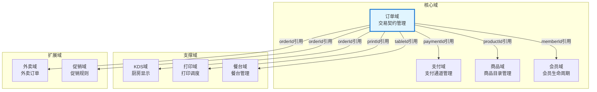

# 领域地图

## 领域概览

| 领域 | 英文名 | 核心能力 | 对象数 | 服务数 | 依赖领域 |
|------|---------|----------|--------|--------|----------|
| order | Order | 交易契约管理 | 612 | 74 | goods, other, payment, print |
| goods | Goods | 商品目录管理 | 360 | 7 | goods, other |
| member | Member | 会员生命周期管理 | 179 | 24 | member, other |
| payment | Payment | 支付通道管理 | 177 | 0 | - |
| kds | Kds | 厨房显示与叫号 | 122 | 26 | goods, other, print |
| print | Print | 打印任务调度 | 274 | 8 | goods, order, other, print |
| table | Table | 餐台管理 | 116 | 26 | other |
| book | Book | 预订管理 | 29 | 16 | other |
| takeout | Takeout | 外卖订单管理 | 44 | 18 | order |
| promotion | Promotion | 促销规则执行 | 0 | 9 | member, other |

## 领域依赖图

## 核心聚合根（过滤后，排除Base/Dto/Vo等基础设施对象）

| 聚合根 | 所属领域 | 核心能力 | 业务含义 |
|--------|----------|----------|----------|
| MutexShareValidBo | other |  | 业务核心对象 |
| SdkLimitGiftBo | other |  | 业务核心对象 |
| AccountRightData | other |  | 业务核心对象 |
| TemplateAddress | other |  | 业务核心对象 |
| PrintTableSetDTO | table | 餐台管理 | 业务核心对象 |
| BusinessException | other |  | 业务核心对象 |
| BookDetailDTO | book | 预订管理 | 业务核心对象 |
| AppletOperateSkuDTO | other |  | 业务核心对象 |
| CategoryGoodsCountDTO | goods | 商品管理 | 业务核心对象 |
| KDSPrintGroupSettingQuery | print | 打印管理 | 业务核心对象 |
| KDSScreenAllotScoreQuery | kds | 厨房显示 | 业务核心对象 |
| KDSScreenMakeDetailTagQuery | kds | 厨房显示 | 业务核心对象 |
| SwimConfigQuery | other |  | 业务核心对象 |
| CombineDiscountAmountDTO | other |  | 业务核心对象 |
| TakeWineDetailDTO | other |  | 业务核心对象 |

## 架构建议

### 保护核心域
1. 订单域是系统核心，必须保证高可用
2. 支付、会员是关键依赖，需要熔断和降级
3. 订单域的改动必须经过充分review

### 拆分可行性
1. KDS域相对独立，可考虑独立部署
2. 打印域可考虑异步化，减少对主流程的影响
3. 餐台、预订域可考虑拆分为独立服务

### 演进路线
1. 短期：完善熔断、降级、缓存机制
2. 中期：考虑KDS独立部署
3. 长期：评估微服务拆分可能性
