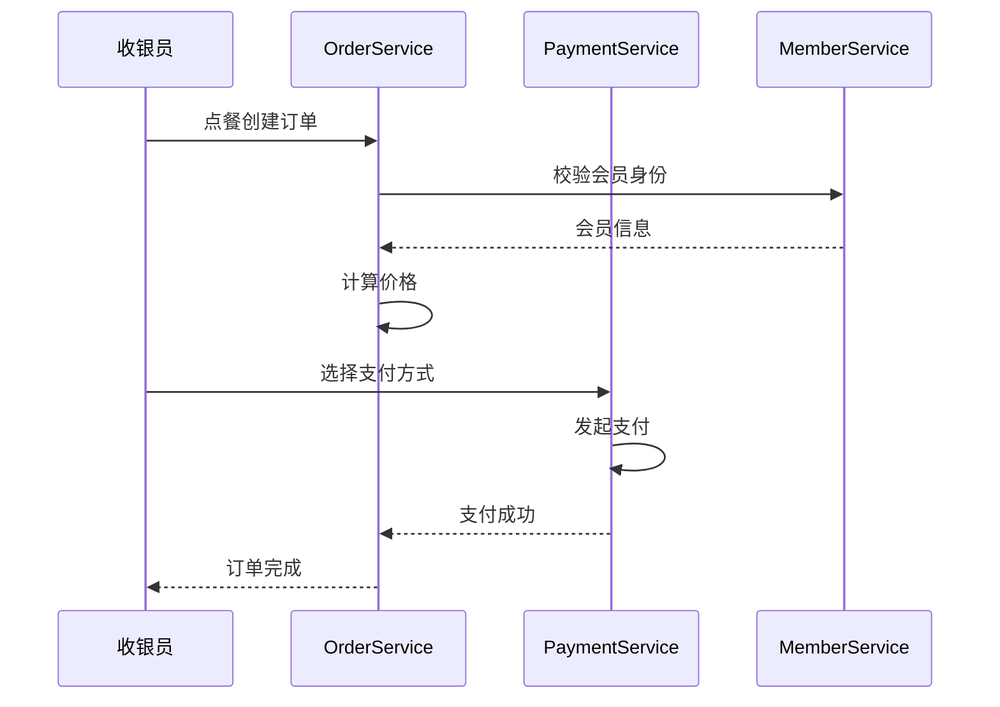
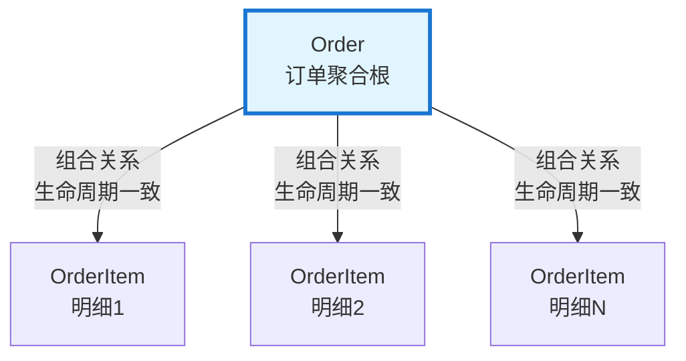
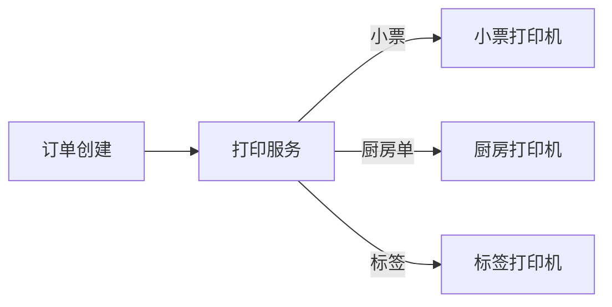

# 业务模式分析

## 模式概览

| 模式 | 描述 | 匹配对象数 | 业务目的 |
|------|------|------------|----------|
| Order-Payment | 订单与支付 | 797 | 跨域协作 |
| Master-Detail | 主从明细 | 481 | 跨域协作 |
| User-Role | 用户权限 | 159 | 跨域协作 |
| Category-Tree | 树形分类 | 73 | 跨域协作 |
| Config-Reference | 配置参照 | 443 | 跨域协作 |
| Print-Label | 打印标签 | 651 | 跨域协作 |
| Goods-SKU | 商品SKU | 396 | 跨域协作 |

## 核心模式详解

### 模式1：订单-支付模式

**业务目的**：顾客完成点餐后，通过多种支付方式完成结算

**参与对象**：
- Order（聚合根）：订单主实体，管理订单生命周期
- OrderItem（实体）：订单明细，记录商品和数量
- Payment（聚合根）：支付记录，管理支付状态
- Member（聚合根）：会员信息，用于会员价计算

**主流程**：

**异常处理**：
| 异常 | 触发条件 | 处理方式 |
|------|----------|----------|
| 会员不存在 | memberId无效 | 使用散客价 |
| 支付失败 | 支付渠道返回失败 | 提示重试 |
| 支付超时 | 支付响应>30s | 取消支付，请求重试 |

**补偿机制**：
- 创建订单时预扣库存
- 支付失败时不扣库存
- 超时自动取消订单

---

### 模式2：主-明细模式

**业务目的**：订单包含多个商品明细，每个明细独立管理

**参与对象**：
- Order（聚合根）：订单主实体
- OrderItem（实体）：订单明细，从属于Order

**对象关系**：

**业务规则**：
- 订单必须至少包含一个明细
- 明细不可独立存在，随订单删除而删除
- 明细可以单独增删改

---

### 模式3：打印标签模式

**业务目的**：订单创建后自动触发多种打印任务

**打印流程**：

**打印类型**：
| 类型 | 触发时机 | 打印机 |
|------|----------|--------|
| 客用小票 | 支付完成后 | 前台打印机 |
| 厨房小票 | 订单创建后 | 厨房打印机 |
| 标签打印 | 商品有标签属性 | 标签打印机 |

---

## 模式归纳总结

### 主导模式
系统中最核心的业务模式是**订单-支付模式**，它贯穿整个收银流程，涉及订单、会员、商品、支付等多个领域。

### 模式特征
1. **本地POS特性**：离线可用是核心约束
2. **事件驱动交互**：通过Netty消息实现本地通信
3. **打印无处不在**：POS系统特有的多打印任务并行
4. **KDS独立展示**：厨房显示与收银分离

### 业务创新点
1. **反结账能力**：已结账订单可以反结账重新编辑
2. **多支付方式**：支持现金、扫码、卡券等多种方式
3. **离线同步**：本地记录，云端同步

### 需人工确认项
- [ ] 验证订单状态机的完整性
- [ ] 确认反结账的业务规则
- [ ] 评估离线模式的数据一致性保障
