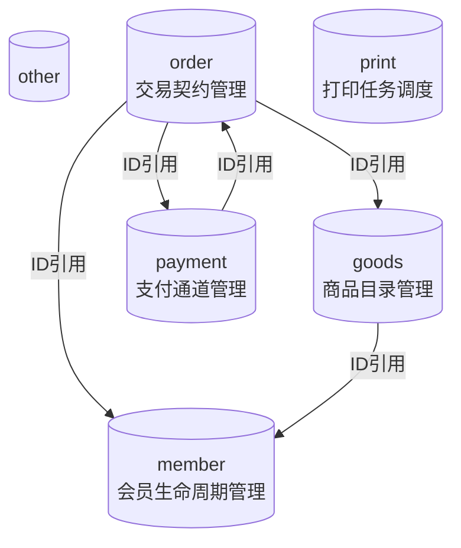

# 领域地图

## 领域概览

| 领域 | 英文名 | 对象数 | 聚合根数 | 核心能力 |
|------|---------|--------|----------|----------|
| other | Other |  | 2017 | 10 |
| order | Order | 交易契约管理 | 612 | 10 |
| goods | Goods | 商品目录管理 | 360 | 10 |
| print | Print | 打印任务调度 | 274 | 10 |
| member | Member | 会员生命周期管理 | 179 | 3 |
| payment | Payment | 支付通道管理 | 177 | 5 |
| kds | KDS | 厨房显示与叫号 | 122 | 10 |
| table | Table | 餐桌管理 | 116 | 5 |
| takeout | Takeout | 外卖订单管理 | 44 | 1 |
| book | Book | 预订管理 | 29 | 1 |

## 领域依赖图

## 核心聚合根

### other 域

- **BaseDataVo**：聚合根
- **BaseDto**：聚合根
- **BaseVo**：聚合根
- **OperateBaseVo**：聚合根
- **OrgBaseDto**：聚合根

### order 域

- **PayResultByTransOrderNoQueryDto**：聚合根
- **OrderTableExclusiveDto**：聚合根
- **OrderGetBo**：聚合根
- **OrderQueryBo**：聚合根
- **CloudOrderDetailExtAddDto**：聚合根

### goods 域

- **AppletOperateSkuDTO**：聚合根
- **CategoryGoodsCountDTO**：聚合根
- **GetGoodsCategoryRequest**：聚合根
- **GoodsBuffetListRequest**：聚合根
- **GoodsCombineRequest**：聚合根

### print 域

- **RechargeInvoicePrintRequest**：聚合根
- **PrintTableSetDTO**：聚合根
- **KDSPrintGroupSettingQuery**：聚合根
- **PrintSettingEntity**：聚合根
- **PrintSettingVo**：聚合根

### member 域

- **CustomerGiftCurrentDayUseEntity**：聚合根
- **MemberMarketingGiftDto**：聚合根
- **MemberCardConsumeRequest**：聚合根

### payment 域

- **PayRetryRequest**：聚合根
- **OnlinePayDto**：聚合根
- **CancelSettlePayRequest**：聚合根
- **PledgePayRecordRequest**：聚合根
- **CashPledgePayResponse**：聚合根

### kds 域

- **KDSScreenAllotScoreQuery**：聚合根
- **KDSScreenMakeDetailTagQuery**：聚合根
- **KdsMakeDetailDto**：聚合根
- **KdsMakeInvalidDto**：聚合根
- **KdsMakeAutoDetailDto**：聚合根

### table 域

- **TableAccountRequest**：聚合根
- **GetBookTableRequest**：聚合根
- **AllotTableAreaVo**：聚合根
- **TableResponse**：聚合根
- **GetTableRequest**：聚合根

## 领域边界分析

| 边界类型 | 分析结论 | 风险 |
|----------|----------|------|
| 订单↔支付 | 双向ID引用 | ⚠️ 需验证是否存在循环依赖 |
| 订单↔商品 | 单向依赖（订单→商品） | ✅ 无风险 |
| 会员↔订单 | 单向依赖（订单→会员） | ✅ 无风险 |
| KDS↔订单 | 单向依赖（KDS→订单） | ✅ 无风险 |

## 架构建议

1. **保护核心域**：订单域是核心，其他领域应尽量解耦
2. **验证边界**：支付域与订单域的依赖关系需人工确认
3. **拆分考虑**：如果未来需要云端同步，KDS域可考虑独立部署
