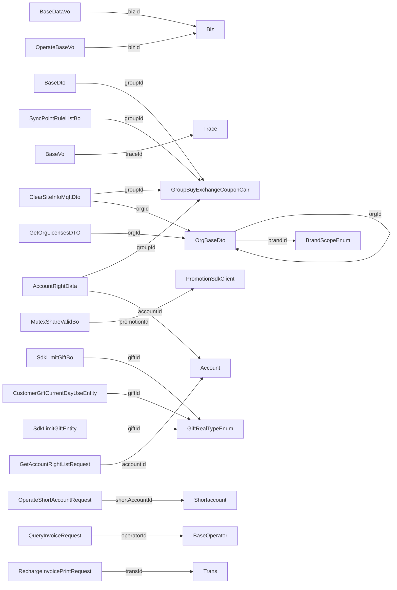

# 关系网络分析

## 概述

| 指标 | 数值 |
|------|------|
| 总关系数 | 276 |
| 关系类型 | N:1 |
| 覆盖领域 | 20 个 |

## 关系分布

| 领域 | 关系数 | 说明 |
|------|--------|------|
| kds | 51 | |
| order | 38 | |
| print | 35 | |
| member | 31 | |
| soldout | 26 | |
| base | 23 | |
| dao | 13 | |
| request | 13 | |
| goods | 10 | |
| biz | 8 | |
| dto | 8 | |
| scrm | 5 | |
| promotion | 3 | |
| takeout | 3 | |
| vo | 3 | |
| web | 2 | |
| book | 1 | |
| common | 1 | |
| table | 1 | |
| tripartite | 1 | |

## 关系类型说明

| 类型 | 说明 | 代码证据 |
|------|------|----------|
| N:1 | 多对一引用关系 | 字段名以Id结尾 |

## 核心关系示例

| 源对象 | 引用字段 | 推断目标 | 关系类型 |
|--------|----------|----------|----------|
| BaseDataVo | `bizId` | Biz | N:1 |
| BaseDto | `groupId` | GroupBuyExchangeCouponCalr | N:1 |
| BaseVo | `traceId` | Trace | N:1 |
| OperateBaseVo | `bizId` | Biz | N:1 |
| OrgBaseDto | `orgId` | OrgBaseDto | N:1 |
| OrgBaseDto | `brandId` | BrandScopeEnum | N:1 |
| MutexShareValidBo | `promotionId` | PromotionSdkClient | N:1 |
| SdkLimitGiftBo | `giftId` | GiftRealTypeEnum | N:1 |
| SyncPointRuleListBo | `groupId` | GroupBuyExchangeCouponCalr | N:1 |
| CustomerGiftCurrentDayUseEntity | `giftId` | GiftRealTypeEnum | N:1 |
| SdkLimitGiftEntity | `giftId` | GiftRealTypeEnum | N:1 |
| AccountRightData | `groupId` | GroupBuyExchangeCouponCalr | N:1 |
| AccountRightData | `accountId` | Account | N:1 |
| GetOrgLicensesDTO | `orgId` | OrgBaseDto | N:1 |
| GetAccountRightListRequest | `accountId` | Account | N:1 |
| OperateShortAccountRequest | `shortAccountId` | Shortaccount | N:1 |
| ClearSiteInfoMqttDto | `groupId` | GroupBuyExchangeCouponCalr | N:1 |
| ClearSiteInfoMqttDto | `orgId` | OrgBaseDto | N:1 |
| QueryInvoiceRequest | `operatorId` | BaseOperator | N:1 |
| RechargeInvoicePrintRequest | `transId` | Trans | N:1 |
| ReqMessageDto | `messageId` | Message | N:1 |
| ResDbMangerDto | `messageId` | Message | N:1 |
| DictionaryResponse | `id` | Id | N:1 |
| DictionaryResponse | `groupId` | GroupBuyExchangeCouponCalr | N:1 |
| BindDeviceResponse | `orgId` | OrgBaseDto | N:1 |
| BindDeviceResponse | `groupId` | GroupBuyExchangeCouponCalr | N:1 |
| OrgResponse | `groupId` | GroupBuyExchangeCouponCalr | N:1 |
| OrgResponse | `orgId` | OrgBaseDto | N:1 |
| RechargePackageInfoDto | `packageStallsId` | Packagestalls | N:1 |
| RechargePackageInfoDto | `rechargePackageId` | Rechargepackage | N:1 |

*... 还有 246 条关系*

## 需人工确认的关系

以下关系需要人工确认其正确性：

1. **跨领域ID引用** - 验证跨域引用是否符合业务语义
2. **推断目标** - AI推断的目标对象可能不准确
3. **关系类型** - 当前仅基于字段名推断，需验证

## 关系网络图

