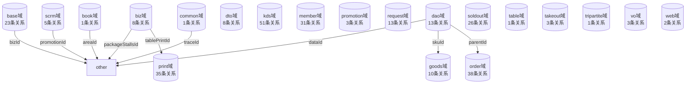
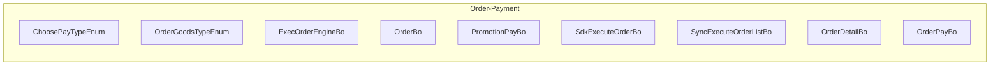

# 关系图谱 (Mermaid)

## 使用说明

以下图表可直接复制到 [Mermaid Live Editor](https://mermaid.live) 查看。

---

## 1. 领域关系总图



## 2. 核心聚合根类图

```mermaid
classDiagram
    class BaseDataVo {
        <<aggregate>>
        bizData: T
        bizId: Long
        bizNo: String
        bizIds: String
        bizNos: String
    }

    class BaseDto {
        <<aggregate>>
        groupId: Long
        useSlave: Boolean
    }

    class BaseVo {
        <<aggregate>>
        code: String
        message: String
        success: Boolean
        traceId: String
    }

    class OperateBaseVo {
        <<aggregate>>
        bizId: Long
    }

    class OrgBaseDto {
        <<aggregate>>
        orgId: Long
        brandId: Long
    }

    class MutexShareValidBo {
        <<aggregate>>
        promotionId: Long
        promotionCode: String
        promotionType: Integer
        promotionName: String
    }

    class SdkLimitGiftBo {
        <<aggregate>>
        giftId: Long
        giftName: String
        limitType: Integer
    }

    class SyncPointRuleListBo {
        <<aggregate>>
        groupId: Long
        list: List<SdkPointRuleBo>
    }

    class CustomerGiftCurrentDayUseEntity {
        <<aggregate>>
        giftId: Long
        useCount: Integer
    }

    class SdkLimitGiftEntity {
        <<aggregate>>
        giftId: Long
        giftName: String
        limitType: Integer
    }

    class AccountRightData {
        <<aggregate>>
        groupId: Long
        accountId: Long
        pageCode: String
        rightCode: String
    }

    class GetOrgLicensesDTO {
        <<aggregate>>
        orgId: String
        productList: List<LicensesProduct>
    }

    class GetAccountRightListRequest {
        <<aggregate>>
        accountId: Long
    }

    class OperateShortAccountRequest {
        <<aggregate>>
        shortAccountId: Long
        shortLoginName: String
        newLoginPwd: String
    }

    class ClearSiteInfoMqttDto {
        <<aggregate>>
        groupId: Long
        orgId: Long
        type: String
        body: String
        msgType: Integer
    }


    %% 聚合根间关系
    BaseDataVo -->|bizId| Biz
    BaseDto -->|groupId| GroupBuyExchangeCouponCalr
    BaseVo -->|traceId| Trace
    OperateBaseVo -->|bizId| Biz
    OrgBaseDto -->|orgId| OrgBaseDto
    OrgBaseDto -->|brandId| BrandScopeEnum
    MutexShareValidBo -->|promotionId| PromotionSdkClient
    SdkLimitGiftBo -->|giftId| GiftRealTypeEnum
    SyncPointRuleListBo -->|groupId| GroupBuyExchangeCouponCalr
    CustomerGiftCurrentDayUseEntity -->|giftId| GiftRealTypeEnum
    SdkLimitGiftEntity -->|giftId| GiftRealTypeEnum
    AccountRightData -->|groupId| GroupBuyExchangeCouponCalr
    AccountRightData -->|accountId| Account
    GetOrgLicensesDTO -->|orgId| OrgBaseDto
    GetAccountRightListRequest -->|accountId| Account
    OperateShortAccountRequest -->|shortAccountId| Shortaccount
    ClearSiteInfoMqttDto -->|groupId| GroupBuyExchangeCouponCalr
    ClearSiteInfoMqttDto -->|orgId| OrgBaseDto
```

## 3. 聚合根对象树示例

聚合根包含的字段结构示例：

```mermaid
graph LR
    subgraph BaseDataVo
        BaseDataVo["BaseDataVo"]
        BaseDataVo --> |"bizData"| bizDataVal["T"]
        BaseDataVo --> |"bizId"| bizVal["Long"]
        BaseDataVo --> |"bizNo"| bizNoVal["String"]
        BaseDataVo --> |"bizIds"| bizsVal["String"]
        BaseDataVo --> |"bizNos"| bizNosVal["String"]
    end
    subgraph BaseDto
        BaseDto["BaseDto"]
        BaseDto --> |"groupId"| groupVal["Long"]
        BaseDto --> |"useSlave"| useSlaveVal["Boolean"]
    end
    subgraph BaseVo
        BaseVo["BaseVo"]
        BaseVo --> |"code"| codeVal["String"]
        BaseVo --> |"message"| messageVal["String"]
        BaseVo --> |"success"| successVal["Boolean"]
        BaseVo --> |"traceId"| traceVal["String"]
    end
    subgraph OperateBaseVo
        OperateBaseVo["OperateBaseVo"]
        OperateBaseVo --> |"bizId"| bizVal["Long"]
    end
    subgraph OrgBaseDto
        OrgBaseDto["OrgBaseDto"]
        OrgBaseDto --> |"orgId"| orgVal["Long"]
        OrgBaseDto --> |"brandId"| brandVal["Long"]
    end
```

## 4. 业务模式示意

### Order-Payment



### Master-Detail


### User-Role

```mermaid
graph LR
    subgraph User-Role
        BaseAuthPageDto["BaseAuthPageDto"]
        MultipleMemberTypeEnum["MultipleMemberTypeEnum"]
        UserAccount["UserAccount"]
        UserAccountConvert["UserAccountConvert"]
        UserAccountConvertImpl["UserAccountConvertImpl"]
        UserAuthEnum["UserAuthEnum"]
        AccountRightAuthRequest["AccountRightAuthRequest"]
        AccountRightAuthService["AccountRightAuthService"]
        UserAccountService["UserAccountService"]
        SyncAccountAuthInfoService["SyncAccountAuthInfoService"]
    end
```



