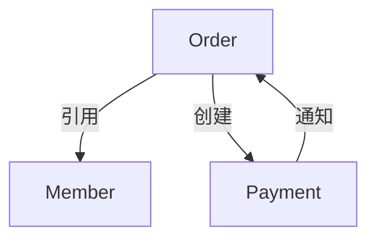

# 更高维业务设计方法论

## 一、问题定义

既有信息系统通常记录了大量已经发生过的业务行为，但它记录的是业务在特定组织、特定流程、特定技术条件下的实现结果。系统中的菜单、接口、表、状态和定时任务，往往只是业务机制留下的痕迹，并不等同于业务本身。

因此，从既有系统出发进行未来设计，不能停留在“把旧功能重新实现一遍”。真正有价值的工作，是从既有实现中识别稳定的业务约束、可变化的业务策略、被技术固化的历史偶然性，以及尚未被系统表达的业务可能性，然后形成能够支撑未来变化的更高维业务设计。

本文所说的“更高维”，不是增加更多页面、字段或模块，而是让设计能够同时表达：

- 业务为什么存在；
- 谁在什么责任下推动业务；
- 业务对象如何变化；
- 哪些规则必须稳定，哪些规则允许变化；
- 业务如何受到时间、资源和不确定性的影响；
- 今天的设计如何容纳明天的组织、渠道和策略变化。

## 二、核心判断：实现模型不等于业务模型

既有系统主要呈现的是实现模型。它回答的是：系统现在有哪些入口、数据如何保存、流程如何流转、接口如何调用。

高维业务设计关注的是业务生成模型。它回答的是：业务目标如何产生、业务责任如何分配、业务规则如何形成、业务对象如何演化，以及变化如何被吸收。

可以用下面的关系理解两者：

```text
既有实现痕迹
    -> 业务事实
    -> 业务机制
    -> 业务能力
    -> 设计约束与变化模型
    -> 未来系统设计
```

其中：

- **业务事实**：已经发生且可以被观察或验证的行为、结果和约束。
- **业务机制**：使一类业务结果能够稳定产生的规则、角色协作、状态变化和资源安排。
- **业务能力**：组织持续完成某类业务目标的能力，而不是某个页面或接口。
- **设计约束**：未来系统必须保留、允许变化、隔离或重新确认的内容。
- **变化模型**：业务在时间、策略、组织、渠道和外部环境变化下的演进方式。

高维设计的关键，不是把既有系统的结构画得更完整，而是把实现痕迹提升为可解释、可验证、可演化的业务模型。

### 三跳理论：从实现痕迹到领域模型的抽象跃迁

既有系统分析不是把代码逐项翻译成文档，而是完成三次不可省略的抽象跃迁：

```text
具体代码与运行痕迹
    → 第一跳：业务对象
    → 第二跳：业务模式
    → 第三跳：领域模型
```

- **第一跳：具体代码到业务对象。** 类、表、接口、消息和定时任务只是技术承载物；分析要识别其中具有业务身份、生命周期、责任、状态或历史意义的存在物。此跳回答“它在业务世界中是什么”，防止把 `Entity`、DTO、Controller 等技术分类直接当作业务模型。
- **第二跳：业务对象到业务模式。** 单个对象尚不能解释一类业务为何稳定发生。应从多个对象及其规则、协作、资源占用、时序和异常收敛中，归纳共同目标、共同不变量与可变策略。此跳回答“这一类业务怎样持续产生结果”，防止只得到对象目录。
- **第三跳：业务模式到领域模型。** 多个模式并列也不自动构成领域。应依据责任边界、核心价值、依赖方向和变化隔离，将模式组织为稳定的业务能力结构。此跳回答“哪些能力属于同一业务边界，并应如何承受未来变化”，为架构与迁移决策提供依据。

三跳与下文八个维度不是两套竞争框架：八个维度是每一跳都应使用的观察坐标；三跳则规定分析结论应当如何从实现层提升到领域层。任何未能说明对象、模式或领域边界的结论，都只能视为中间分析材料，不能替代高维业务设计。

## 三、八个业务设计维度

### 1. 目标维度：业务要产生什么结果

不要把“完成某个操作”直接当成业务目标。操作只是手段，目标是业务希望获得的结果。

例如：

- “创建订单”可能服务于锁定顾客需求、形成履约承诺和产生结算依据；
- “打印后厨单”可能服务于把已确认的履约任务及时传递给生产岗位；
- “关闭班次”可能服务于确认经营责任、核对资金和形成可追溯的经营边界。

目标维度需要区分：

- 直接目标：当前参与者希望完成的结果；
- 上层目标：组织为什么需要这个结果；
- 成功标准：什么条件下才算完成；
- 失败代价：未完成会造成什么损失；
- 目标冲突：速度、准确性、成本、体验和控制之间如何取舍。

### 2. 主体维度：谁拥有责任和决策权

业务主体不等于系统用户。一个账号可能代表不同岗位，一个岗位也可能由多个账号、设备或外部组织共同完成。

需要识别：

- 发起者：谁提出业务请求；
- 执行者：谁实际完成动作；
- 决策者：谁有权批准、拒绝或改变规则；
- 受益者：谁获得业务结果；
- 监督者：谁负责核对、审计和追责；
- 受影响者：谁承担业务结果带来的影响。

高维设计应围绕责任边界组织能力，而不是围绕登录菜单组织功能。

### 3. 对象维度：什么东西在业务中持续存在

页面字段往往是对象的一个切片。业务对象应根据身份、生命周期、责任和历史意义来识别。

判断一个对象是否独立，至少要问：

- 它是否有自己的身份；
- 它是否有独立生命周期；
- 它是否会被不同角色引用；
- 它是否拥有自己的规则；
- 它的变化是否需要保留历史；
- 它是否可能脱离当前流程继续存在。

设计时要区分：

- 核心对象：承载业务价值；
- 协作对象：支撑多个主体之间协作；
- 资源对象：被占用、消耗、分配或转移；
- 证据对象：证明某个动作或结果曾经发生；
- 配置对象：表达可调整策略，而非业务事实本身。

### 4. 资源维度：业务依赖什么有限条件

业务流程并不是只处理信息。桌台、库存、人员、设备、资金、时间窗口、额度和注意力，都可能是业务资源。

资源设计需要表达：

- 资源的所有者；
- 资源的可用状态；
- 资源的占用与释放；
- 资源的消耗与补充；
- 资源冲突时的优先级；
- 资源不足时的降级、排队或拒绝策略。

只建模数据而不建模资源，通常会导致系统看似流程完整，却无法解释真实业务中的冲突和失败。

### 5. 规则维度：哪些条件决定业务结果

规则不是散落在代码中的 `if`，而是业务结果成立的判断依据。规则至少分为四类：

- 不变量：无论渠道、组织和实现如何变化，都必须保持的约束；
- 策略：组织可以根据经营目标调整的选择；
- 流程规则：规定动作顺序、授权关系和协作方式；
- 补偿规则：失败、撤销、超时和异常情况下如何恢复或收敛。

设计时必须把规则的归属、优先级、适用范围、生效时间和冲突处理方式表达出来。

### 6. 时间维度：业务何时成立以及如何变化

业务时间不只是创建时间和更新时间，还包括：

- 生效时间与失效时间；
- 营业日、自然日和结算日；
- 预约时间与实际发生时间；
- 超时期限和等待窗口；
- 班次、周期和版本；
- 规则变更前后的适用范围；
- 历史状态与当前状态的区别。

高维设计必须回答：一条规则改变后，历史业务是否重新解释？一个对象跨越规则版本时，使用旧规则还是新规则？时间不确定或发生冲突时，以谁的时间为准？

### 7. 不确定性维度：业务如何面对未知和例外

低维设计只描述成功路径，高维设计把“不确定”当作业务的正常组成部分。

常见不确定性包括：

- 输入信息不完整；
- 多个主体同时操作；
- 外部系统延迟或不可用；
- 资源在处理中被占用；
- 规则之间发生冲突；
- 业务结果已经发生但系统尚未确认；
- 既有历史数据无法还原完整语义。

设计应明确：

- 哪些情况可以等待；
- 哪些情况可以重试；
- 哪些情况必须人工决策；
- 哪些情况需要补偿；
- 哪些情况只能记录为未知，不能擅自推断；
- 哪些结果允许暂态，哪些结果必须最终收敛。

### 8. 演化维度：业务未来如何改变

高维设计不把今天的业务结构当成永恒结构，而是识别变化的来源和方向：

- 新渠道加入；
- 组织职责重分；
- 规则由人工变为配置；
- 单店模式扩展为多店或多组织；
- 同一对象出现不同履约方式；
- 外部合作方增加；
- 业务从实时处理转为批量或异步处理；
- 既有规则出现版本、区域或客户分层。

设计需要把“变化点”作为一等对象处理，而不是等变化发生后再修改核心流程。

## 四、八个业务设计维度的深入拆解

前面的八个维度不是八个并列标签，而是八种观察同一业务的不同视角。一个完整的业务设计，通常需要把它们连接起来：目标决定业务要产生什么结果，主体决定谁对结果负责，对象承载结果，资源决定结果能否实现，规则决定什么情况下允许实现，时间决定规则何时有效，不确定性决定失败如何处理，演化决定未来如何改变。

可以用下面的链路理解八个维度之间的关系：

```text
目标
  -> 主体围绕目标采取行动
  -> 对象承载行动结果
  -> 资源支持行动发生
  -> 规则决定行动是否合法、合理、优先
  -> 时间决定规则和责任的有效边界
  -> 不确定性决定失败、延迟和冲突如何收敛
  -> 演化决定这套机制如何适应未来变化
```

### 1. 目标维度：从“完成动作”下沉到“产生结果”

#### 1.1 目标维度分析什么

目标维度分析的是业务存在的理由和价值结果，而不是系统提供了哪些按钮。

需要把目标拆成五层：

```text
组织目的
  -> 业务目标
  -> 场景目标
  -> 操作目标
  -> 可验证结果
```

例如，“确认订单”可以继续拆解为：

- 组织目的：保证经营结果能够被履约和结算；
- 业务目标：把顾客意图转化为正式履约承诺；
- 场景目标：确认当前订单具备执行条件；
- 操作目标：由责任主体执行确认动作；
- 可验证结果：订单进入可履约状态，并产生后续任务或责任。

#### 1.2 需要识别的关键变量

- 目标的发起者和受益者是否相同；
- 目标是短期结果还是长期能力；
- 目标是否包含相互冲突的指标；
- 目标失败时损失什么；
- 目标是否必须立即完成，还是允许分阶段完成；
- 目标是否需要其他主体共同完成；
- 目标完成后是否产生新的责任或承诺。

#### 1.3 目标维度的设计判断

如果一个功能只能说明“做了什么”，不能说明“为什么做”和“做完得到什么”，说明目标尚未被抽象出来。

如果多个功能的操作不同，但最终都形成同一种业务结果，可以先按目标归纳；如果操作相似但结果、责任或失败代价不同，则不能仅因操作相似而合并。

#### 1.4 典型产出

- 业务目标树；
- 目标与结果定义；
- 成功标准和失败代价清单；
- 目标冲突矩阵；
- 业务能力名称；
- 场景价值链。

#### 1.5 验证问题

- 这个功能完成后，业务世界发生了什么变化？
- 谁真正从这个结果中获益？
- 如果不做这个动作，业务损失是什么？
- 完成动作是否等于完成业务目标？
- 这个目标是否能被另一个渠道或岗位以不同方式实现？

### 2. 主体维度：从“用户”下沉到“责任关系”

#### 2.1 主体维度分析什么

主体维度分析的是参与业务的角色、权利、责任和决策边界。用户、账号、岗位、组织、设备和外部系统都可能是主体，但它们承担的业务责任不同。

至少要区分六类主体：

| 主体角色 | 主要问题 |
|---|---|
| 请求主体 | 谁提出业务意图 |
| 受理主体 | 谁决定是否接受请求 |
| 执行主体 | 谁实际完成业务动作 |
| 决策主体 | 谁能改变规则或做例外决定 |
| 监督主体 | 谁核对结果并发现问题 |
| 受益或受影响主体 | 谁获得收益或承担后果 |

同一个人可以同时承担多个角色，但设计上不能因为“都是同一个账号”就把这些责任混为一谈。

#### 2.2 需要识别的关键变量

- 主体是个人、岗位、组织还是外部系统；
- 主体是否具有代理关系；
- 主体能做什么，不能做什么；
- 主体的授权是固定的还是临时的；
- 主体的责任是否会转移；
- 主体是否需要双人复核或多人协作；
- 主体执行动作后是否必须留下证据；
- 主体离线、失联或拒绝执行时由谁接管。

#### 2.3 责任关系比权限关系更重要

权限回答“能不能点击”，责任回答“谁对结果负责”。业务设计不能只定义角色权限，还要定义：

```text
谁提出
  -> 谁接受
  -> 谁承诺
  -> 谁执行
  -> 谁确认
  -> 谁承担异常
```

一个账号有权限执行某动作，不代表它就是该业务结果的责任主体。尤其在审批、交接、结算和异常处理场景中，权限和责任经常分离。

#### 2.4 典型产出

- 业务角色模型；
- 责任分配矩阵；
- 授权边界；
- 交接关系图；
- 多主体协作场景；
- 例外决策责任表。

#### 2.5 验证问题

- 业务结果出错时，谁负责解释和修复？
- 执行者和决策者是否可能不是同一个主体？
- 谁可以批准例外，例外是否需要留痕？
- 责任主体发生变化时，历史责任是否仍可追溯？
- 系统是否把“有权限”错误地当成“有责任”？

### 3. 对象维度：从“数据字段”下沉到“业务存在物”

#### 3.1 对象维度分析什么

对象维度分析业务中哪些东西具有独立身份、生命周期、规则和历史意义。一个对象不是一组字段的集合，而是业务可以持续引用、改变和追责的存在物。

识别对象时应区分：

- 业务主体对象：顾客、员工、组织、合作方；
- 业务承诺对象：订单、预约、申请、合同、任务；
- 业务资源对象：商品、库存、桌台、设备、时段、额度；
- 业务结果对象：结算单、交付结果、盘点结果、对账结果；
- 业务证据对象：确认记录、操作记录、审批记录、异常记录；
- 业务规则对象：价格方案、促销规则、权限方案、结算规则。

#### 3.2 对象识别的六个标准

一个对象越符合以下条件，越应独立建模：

1. 有稳定身份，而不是每次通过字段组合临时识别；
2. 有独立生命周期；
3. 被多个场景或主体引用；
4. 拥有独立业务规则；
5. 变化需要保留历史；
6. 可能脱离原始流程继续存在。

例如，订单明细可能不是简单的订单字段，因为它可能独立承载商品、价格、优惠、履约和退换的责任。

#### 3.3 对象关系的深层判断

需要区分几种关系：

- 组成关系：一个对象是否由另一个对象组成；
- 引用关系：一个对象是否只引用另一个对象；
- 承诺关系：对象是否代表未来要完成的责任；
- 证据关系：对象是否证明另一对象曾经发生过某个变化；
- 派生关系：对象是否由其他对象计算产生；
- 替代关系：对象变化后，旧对象是否仍需保留。

对象关系不同，生命周期和删除语义也不同。不能因为两个对象在同一张表或同一个页面中出现，就认定它们属于同一生命周期。

#### 3.4 典型产出

- 业务对象地图；
- 对象生命周期图；
- 对象关系模型；
- 对象责任归属表；
- 历史保留策略；
- 事实对象与配置对象清单。

#### 3.5 验证问题

- 这个对象是否需要独立编号或独立追踪？
- 它的状态是否可以脱离父对象独立变化？
- 它是业务事实，还是当前计算出来的展示结果？
- 删除它会不会破坏审计、结算或历史解释？
- 规则改变后，历史对象是否仍能按照当时语义解释？

### 4. 资源维度：从“有数据”下沉到“有能力执行”

#### 4.1 资源维度分析什么

资源维度分析业务结果实现所依赖的有限条件。资源不仅是库存数量，也包括人员、设备、时间、资金、处理能力、注意力和授权额度。

资源可以分为：

- 可计量资源：库存、金额、数量、额度；
- 可占用资源：桌台、设备、人员、时间窗口；
- 可调度资源：厨房产能、配送运力、处理队列；
- 不可回收资源：已消耗库存、已使用优惠、已产生费用；
- 可恢复资源：取消后可以释放或返还的资源；
- 资格型资源：会员权益、信用额度、操作权限。

#### 4.2 资源生命周期

```text
可用
  -> 预留
  -> 锁定
  -> 占用
  -> 使用中
  -> 消耗、释放或转移
  -> 对账与修正
```

每个阶段都要明确：谁能推动变化、是否允许并发、失败如何恢复、是否有过期时间。

#### 4.3 资源设计中的核心区别

需要区分：

- 资源存在：系统知道它是什么；
- 资源可用：当前可以被使用；
- 资源已预留：已经为某业务保留；
- 资源已占用：正在被执行过程使用；
- 资源已消耗：无法直接恢复；
- 资源账面数量：记录值；
- 资源实际数量：现实世界中的状态。

很多库存、桌台和配送问题，根本原因不是状态少，而是没有区分“记录状态”和“现实资源状态”。

#### 4.4 典型产出

- 资源地图；
- 资源可用性规则；
- 占用与释放模型；
- 资源冲突优先级；
- 资源消耗与补偿规则；
- 资源账实差异处理流程。

#### 4.5 验证问题

- 这个业务是否真的有资源约束？
- 资源是可以共享、排队还是必须独占？
- 同时出现两个请求时如何裁决？
- 业务取消后资源能否完整释放？
- 资源已经现实消耗但系统失败时如何补偿？
- 资源的可用性由谁确认？

### 5. 规则维度：从“条件分支”下沉到“业务决策系统”

#### 5.1 规则维度分析什么

规则维度分析业务结果由哪些判断依据决定，以及这些依据由谁维护、何时生效、适用于谁、冲突时如何裁决。

规则至少有四个层次：

```text
原则
  -> 约束
  -> 决策规则
  -> 执行规则
```

例如“不能超卖”是原则或不变量；“某渠道最多预留多少”是约束；“库存不足时优先满足已支付订单”是决策规则；“系统在提交时检查可用量”是执行规则。

#### 5.2 规则的五个属性

任何重要规则都应明确：

- 规则内容：判断什么；
- 适用范围：对谁、对什么对象有效；
- 生效时间：从何时开始、何时结束；
- 维护主体：谁能修改；
- 冲突优先级：多条规则同时命中时怎么办。

缺少适用范围和生效时间的规则，未来很容易误伤历史业务或其他组织。

#### 5.3 不变量、策略、流程规则和补偿规则

- **不变量**：无论渠道和实现如何变化，都不能被破坏；
- **策略**：组织可以根据经营目标调整；
- **流程规则**：规定谁先做、谁确认、谁授权；
- **补偿规则**：规定失败、撤销、超时后如何恢复。

设计中最常见的问题，是把策略写成硬编码不变量，或者把补偿规则遗漏在主流程之外。

#### 5.4 规则之间的关系

要识别：

- 前置规则：先满足才能继续；
- 互斥规则：满足一个就不能满足另一个；
- 叠加规则：多个规则可以同时生效；
- 覆盖规则：更具体规则覆盖一般规则；
- 委托规则：某个主体可以授权他人决策；
- 反向规则：异常场景采用与正常场景不同的判断。

#### 5.5 典型产出

- 业务规则目录；
- 规则属性卡；
- 规则依赖图；
- 决策表；
- 规则版本矩阵；
- 规则冲突和优先级清单。

#### 5.6 验证问题

- 这条规则保护的是业务不变量，还是当前策略？
- 规则改变后，历史业务是否受影响？
- 多条规则同时命中时，优先级是否明确？
- 规则由谁维护，修改是否需要审批？
- 规则失败后，系统是拒绝、等待、降级还是人工处理？

### 6. 时间维度：从“时间戳”下沉到“业务时态”

#### 6.1 时间维度分析什么

时间维度分析业务事实在什么时候发生、规则在什么时候有效、责任在什么时候转移，以及系统何时知道这件事发生。

至少要区分四种时间：

- 发生时间：现实业务动作实际发生的时间；
- 记录时间：系统写入记录的时间；
- 生效时间：规则或状态开始产生业务效力的时间；
- 确认时间：责任主体确认结果的时间。

在异步、离线和外部系统场景中，这四种时间经常不同。

#### 6.2 时间边界的类型

- 点时间：某一时刻发生；
- 时间段：业务持续一段时间；
- 时间窗口：只允许在某段时间操作；
- 截止时间：超过后权利或责任改变；
- 周期：按日、周、月或班次重复；
- 版本时间：不同时间使用不同规则；
- 业务日：不一定等于自然日。

#### 6.3 时间与历史解释

高维设计必须明确“现在如何看过去”。常见选择包括：

- 按当前规则重新计算；
- 按发生时规则解释；
- 按确认时规则解释；
- 保留当时的计算结果，不再重算；
- 允许重新计算，但必须保留差异和原因。

订单、价格、促销、结算和权限等业务，通常不能只保存当前规则，否则历史结果会随配置变化而漂移。

#### 6.4 典型产出

- 业务时间线；
- 时间边界清单；
- 状态有效期模型；
- 规则版本时间轴；
- 营业日与结算日定义；
- 历史解释策略。

#### 6.5 验证问题

- 系统时间和现实发生时间不一致时，以谁为准？
- 跨营业日、班次或结算周期时如何处理？
- 超时是自动失效、进入人工处理还是继续等待？
- 历史数据按照当时规则还是当前规则解释？
- 时间回拨、重复补录和迟到消息是否会改变结果？

### 7. 不确定性维度：从“异常分支”下沉到“结果收敛”

#### 7.1 不确定性分析什么

不确定性不是偶然错误，而是现实业务中无法立即确认、无法完全控制或可能出现冲突的部分。

可以把不确定性分为：

- 信息不确定：输入不完整或真假未确认；
- 状态不确定：现实已经变化，但系统尚未知道；
- 责任不确定：多个主体都可能负责；
- 资源不确定：资源是否可用无法立即确认；
- 时间不确定：动作何时发生或何时完成不明确；
- 规则不确定：多个规则冲突或适用范围不清；
- 结果不确定：业务已经执行，但结果尚未确认。

#### 7.2 不确定性处理的六种动作

```text
等待
  -> 重试
  -> 查询确认
  -> 转人工
  -> 补偿
  -> 终止并记录
```

每种动作都应有适用条件。不能把所有异常都简单设计为重试，因为重试可能重复扣款、重复发货、重复占用资源或重复发送消息。

#### 7.3 暂态与终态

业务设计必须区分：

- 暂态：仍可能继续变化；
- 可恢复失败：经过重试或补偿可以继续；
- 人工待决：需要责任主体判断；
- 最终失败：业务明确未完成；
- 最终成功：业务结果已确认；
- 不可判定：证据不足，不能擅自归类。

“处理中”不能成为无限期垃圾桶。每个暂态都应有进入条件、最大持续时间、下一步动作和最终收敛方式。

#### 7.4 典型产出

- 异常分类树；
- 暂态和终态模型；
- 重试与幂等规则；
- 人工介入队列；
- 补偿动作清单；
- 未知结果登记表。

#### 7.5 验证问题

- 系统不知道结果时，是否允许继续下一步？
- 重试是否会产生重复业务副作用？
- 谁可以把人工待决改为最终结果？
- 失败后哪些资源必须释放或恢复？
- 无法确认真相时，系统是否会错误地自动推断？
- 所有暂态是否最终都能收敛？

### 8. 演化维度：从“未来扩展”下沉到“变化机制”

#### 8.1 演化维度分析什么

演化维度分析业务为什么会变化、变化会影响哪些对象和责任、变化如何被隔离，以及旧版本如何与新版本共同运行。

业务变化通常来自：

- 规模变化：单点变多点，少量变大量；
- 组织变化：职责重分、权限重分、组织层级变化；
- 渠道变化：新增线上、线下、第三方或设备入口；
- 策略变化：价格、促销、优先级和审核规则变化；
- 对象变化：同类对象出现更多类型或组合；
- 资源变化：资源种类、容量和分配方式变化；
- 外部变化：合作方、法规、接口和结算条件变化。

#### 8.2 变化点的四种处理方式

- 固化：变化极少且属于核心不变量；
- 配置：变化频繁、边界清晰且可由业务维护；
- 策略化：变化需要不同算法、判断过程或责任主体；
- 版本化：新旧规则需要在一段时间内并行存在。

不能把所有变化都做成配置。配置适合表达规则值和范围，不适合掩盖不同业务生命周期、不同责任或不同一致性边界。

#### 8.3 判断模块边界的变化方法

一个边界是否合理，可以观察：

- 谁负责维护它；
- 它的规则由谁决定；
- 它与哪些对象共同变化；
- 它的发布和回滚是否独立；
- 它是否有独立的异常处理；
- 它是否有独立的业务能力结果。

如果两个部分总是由不同原因变化，就不应仅因为当前流程连续而强行放在一起。

#### 8.4 典型产出

- 变化来源地图；
- 不变量与变化点矩阵；
- 能力边界图；
- 版本兼容矩阵；
- 新旧规则并行方案；
- 演进路线图；
- 下线和回滚条件。

#### 8.5 验证问题

- 新增一种渠道时，哪些内容应该复用，哪些内容必须独立？
- 规则变更是否会影响历史业务？
- 新旧版本是否能同时读取和解释数据？
- 变化是参数变化、策略变化还是生命周期变化？
- 如果未来不再支持某种方式，旧数据如何读取？
- 新逻辑失败时能否回到旧逻辑？

## 五、八个维度之间的组合分析

单独分析维度容易得到碎片化结论，真正的业务归纳需要进行组合分析。

### 1. 目标 × 主体：谁为什么做

用于识别责任动机。例如同一个“确认”动作，顾客确认表达意愿，店员确认承担履约责任，财务确认形成结算依据，它们不能因为动作名称相同而合并。

### 2. 主体 × 对象：谁拥有什么责任

用于识别对象归属、操作权限和责任交接。对象的状态变化应能说明是哪个主体在什么责任下推动的。

### 3. 对象 × 资源：对象如何占用现实能力

用于区分“订单记录”和“订单实际占用的库存、桌台、人员或时间窗口”。对象存在不等于资源已经被占用。

### 4. 规则 × 时间：什么规则在什么时候有效

用于处理价格、促销、权限、营业日、结算周期和历史数据解释问题。

### 5. 资源 × 不确定性：资源冲突如何收敛

用于设计库存不足、并发预订、设备故障、人员不足和配送延迟等场景。

### 6. 目标 × 演化：目标不变但实现方式变化

用于判断哪些能力必须保持稳定，哪些流程、渠道和策略可以变化。

### 7. 不确定性 × 演化：系统如何在变化中保持可控

用于设计灰度、版本并行、兼容读取、人工接管、补偿和回滚。

## 六、八维分析的最小完整模板

对一个具体业务，可以使用以下模板进行拆解：

```text
业务名称：

一、目标
- 组织目的：
- 直接目标：
- 成功结果：
- 失败代价：

二、主体
- 请求主体：
- 受理主体：
- 执行主体：
- 决策主体：
- 监督主体：
- 异常责任主体：

三、对象
- 核心对象：
- 协作对象：
- 资源对象：
- 结果对象：
- 证据对象：
- 生命周期：

四、资源
- 可用资源：
- 预留资源：
- 占用资源：
- 消耗资源：
- 冲突处理：
- 释放与补偿：

五、规则
- 核心不变量：
- 准入规则：
- 资格规则：
- 顺序规则：
- 优先级规则：
- 补偿规则：
- 规则版本：

六、时间
- 发生时间：
- 记录时间：
- 生效时间：
- 截止时间：
- 业务日或周期：
- 历史解释方式：

七、不确定性
- 未知输入：
- 外部依赖：
- 并发冲突：
- 暂态：
- 人工介入点：
- 最终收敛状态：

八、演化
- 预计变化来源：
- 可配置部分：
- 可策略化部分：
- 需要版本化部分：
- 历史兼容要求：
- 回滚方式：
```

## 七、八维分析后的归纳结论

完成八维拆解后，最终应归纳出四类结论：

1. **业务本质**：这个业务到底在完成什么目标；
2. **业务机制**：主体如何围绕对象、资源和规则协作；
3. **业务能力**：组织可以稳定提供什么结果；
4. **业务变化模型**：哪些内容稳定，哪些内容变化，变化如何被吸收。

如果只能得到功能列表、字段列表和接口列表，说明分析仍停留在实现层。只有当八个维度能够共同解释目标、责任、对象、资源、规则、时间、异常和变化时，才形成了可以用于泛化和未来设计的业务模型。

## 八、从既有系统提炼高维设计

### 第一步：把实现痕迹还原为业务事件

从接口、按钮、任务、消息、状态变化和数据写入中提取事件，用业务语言描述发生了什么。

技术描述：

> 调用接口更新订单状态，并发送一条消息。

业务描述：

> 履约岗位确认订单进入生产阶段，系统将该承诺传递给后续执行岗位。

每个事件至少记录：

- 事件名称；
- 触发主体；
- 触发条件；
- 作用对象；
- 产生结果；
- 影响资源；
- 后续责任；
- 失败和撤销方式；
- 证据来源与确定程度。

### 第二步：把事件组织成业务场景

单个事件不能说明业务机制。需要把事件按照目标和责任组织成场景：

```text
目标提出
    -> 条件判断
    -> 资源确认
    -> 责任承诺
    -> 协作执行
    -> 结果确认
    -> 结算、归档或补偿
```

场景不应只保留主流程，还应包含：

- 提前取消；
- 重复操作；
- 超时未完成；
- 部分完成；
- 资源不足；
- 外部依赖失败；
- 责任转移；
- 结果争议；
- 历史数据缺失。

### 第三步：区分稳定事实与历史偶然

对每个既有行为进行四类判断：

| 类别 | 含义 | 未来设计处理方式 |
|---|---|---|
| 业务不变量 | 违反后业务结果不成立 | 固化为领域约束 |
| 业务策略 | 当前组织选择的做法 | 设计为可配置或可替换策略 |
| 技术实现 | 为当前系统服务的实现方式 | 通过适配或重构隔离 |
| 历史偶然 | 过去遗留且缺少业务依据的行为 | 保留兼容路径，等待确认后处理 |

不能因为某段逻辑存在于核心代码中，就认定它是业务规则；也不能因为某段规则没有独立表或接口，就认为它不重要。

### 第四步：从规则上升为业务机制

规则回答“什么条件下允许或禁止”，机制回答“业务如何持续运转”。

一个完整机制通常包含：

- 业务目标；
- 参与主体；
- 核心对象；
- 可用资源；
- 触发条件；
- 决策规则；
- 状态变化；
- 协作动作；
- 结果证据；
- 异常收敛方式；
- 时间和版本边界。

例如，“订单确认机制”不只是一个确认按钮，而是：顾客意图被接受后，系统检查资源和规则，责任主体承诺按某种方式履约，后续岗位获得可执行任务，同时保留取消、超时和争议处理的依据。

### 第五步：从机制上升为业务能力

业务能力描述组织能够稳定完成什么，而不是系统提供了什么页面。

能力应具备：

- 明确的业务结果；
- 稳定的责任边界；
- 可识别的输入和输出；
- 可度量的完成标准；
- 可替换的实现方式；
- 可演进的策略边界；
- 对异常和资源约束的处理能力。

一个能力可以由多个既有模块共同实现，也可以由一个模块中的多个流程共同组成。不要直接用模块名作为能力名。

## 五、业务抽象与提炼的具体操作

### 1. 聚类：从实例中寻找同类目标

将不同页面、接口和岗位执行的实例放在一起，先按目标和结果聚类，再按对象和动作聚类。

错误方式：按表名或菜单名聚类。

更可靠的方式：比较以下内容是否相同：

- 是否解决同一种业务问题；
- 是否改变同一种业务对象；
- 是否依赖同一种资源；
- 是否遵守同一组核心规则；
- 是否产生同一种责任结果；
- 是否拥有相同的异常收敛方式。

### 2. 对比：识别真正的变化来源

对同类实例进行横向比较，重点观察差异来自哪里：

- 主体不同；
- 渠道不同；
- 组织不同；
- 对象类型不同；
- 资源状态不同；
- 时间窗口不同；
- 规则版本不同；
- 履约方式不同；
- 异常处理方式不同。

差异若只是展示方式不同，不应上升为业务分支。差异若会改变责任、资源占用、状态流转或结果定义，才是业务变化点。

### 3. 抽取：分别记录不变量、变量和未知项

每个业务机制至少形成三张清单：

- 不变量清单：设计必须保护的内容；
- 变化点清单：设计必须容纳的内容；
- 未知项清单：尚无足够证据，不能直接定案的内容。

未知项不能被强行归入规则，也不能用默认值掩盖。未来设计应给未知项留出确认、补录或人工处理的入口。

### 4. 命名：用业务结果而不是技术动作命名

好的名称能够表达目标、对象或能力，例如：

- 履约承诺管理；
- 资源可用性管理；
- 经营责任交接；
- 业务结果确认；
- 规则版本管理。

不好的名称通常来自技术结构，例如：

- 订单状态接口；
- 数据同步模块；
- 公共配置表；
- 通用处理器。

技术名称可以作为实现名称，但不应承担业务模型的主要含义。

## 六、面向未来设计的推导规则

### 1. 不变量进入核心模型

如果一条约束决定业务结果是否成立，就应进入核心领域模型或明确的领域规则中，而不是只放在页面校验、数据库约束或某个接口分支里。

### 2. 策略从核心流程中分离

如果规则会随组织、时段、渠道、客户、区域或经营目标改变，就不应把它和稳定的业务事实混为一体。可以通过策略、配置、版本或决策表表达，但必须保留规则适用范围和生效时间。

### 3. 历史兼容通过边界承载

既有字段、状态、接口和历史数据可能是兼容契约。未来设计不应直接删除或改写它们，而应使用适配、映射、版本化或兼容读取，将历史实现隔离在边界内。

### 4. 责任边界决定模块边界

模块边界优先依据业务责任和变化原因划分，而不是依据数据库表数量或现有菜单层级划分。两个对象若由不同责任主体维护、拥有不同规则或以不同速度变化，就应认真评估是否需要分开。

### 5. 结果与过程同时建模

只保存最终结果会丢失责任、时间和证据；只保存过程又难以提供稳定查询。设计应同时考虑：

- 当前可用状态；
- 已发生的业务事实；
- 状态变化的原因；
- 责任主体；
- 规则版本；
- 可重建和可审计的证据。

### 6. 异常路径与主路径同等重要

真正决定系统韧性的往往不是成功路径，而是取消、重试、超时、部分完成、重复消息、人工介入和数据修复。设计评审必须要求每个核心机制明确异常入口、责任归属和最终收敛状态。

## 七、业务机制卡

每个核心业务机制都应形成一张独立的机制卡：

```text
机制名称：
业务目标：
成功结果：
触发主体：
执行主体：
决策主体：
核心对象：
占用或消耗的资源：
前置条件：
核心不变量：
可变化策略：
时间边界：
状态变化：
协作对象：
外部依赖：
主路径：
异常路径：
补偿与收敛：
结果证据：
历史兼容要求：
未来变化点：
未确认项：
验证场景：
```

机制卡的用途不是增加文档，而是强制设计者把“为什么存在、谁负责、如何变化、失败怎么办”说清楚。

## 八、设计追溯矩阵

未来设计中的每一个关键决策，都应能够追溯到业务依据：

| 设计决策 | 对应业务目标 | 保护的不变量 | 支持的变化点 | 兼容的历史行为 | 验证场景 |
|---|---|---|---|---|---|
| 核心对象如何划分 |  |  |  |  |  |
| 状态如何定义 |  |  |  |  |  |
| 规则放在哪里 |  |  |  |  |  |
| 哪些能力独立成边界 |  |  |  |  |  |
| 哪些流程异步化 |  |  |  |  |  |
| 异常如何补偿 |  |  |  |  |  |
| 历史接口如何适配 |  |  |  |  |  |

如果一个设计决策无法说明它解决了什么业务问题、保护了什么约束或支持了什么变化，它很可能只是技术偏好，而不是业务设计。

## 九、高维业务设计的评估标准

### 1. 解释力

设计能否解释既有系统中主要的正常、异常和跨模块行为，而不是只覆盖最容易描述的主流程。

### 2. 稳定性

核心模型是否表达了业务不变量，是否避免把当前页面、数据库结构或组织习惯误当成永久规则。

### 3. 变化吸收能力

当增加渠道、调整规则、更换履约方式或重分组织职责时，变化是否能够被限制在明确边界内。

### 4. 责任清晰度

每个关键决策、资源和结果是否有明确的责任主体，异常情况下是否知道由谁处理。

### 5. 证据可追溯性

业务结论、设计决策和验证场景之间是否能够相互追溯，未知项是否被明确标记。

### 6. 迁移可行性

未来设计是否能够与既有接口、历史数据、任务、消息和外部依赖形成兼容过渡，而不是只能一次性推倒重来。

可以用四个问题做快速判断：

```text
它是否解释了业务为什么这样做？
它是否区分了必须稳定和允许变化的内容？
它是否能够处理失败、时间和不确定性？
它是否能够从既有系统逐步迁移过去？
```

四个问题都能回答，才算从“功能重构”进入“业务设计”。

## 十、落地执行流程

### 阶段一：建立事实基础

收集入口、对象、状态、规则、消息、任务、资源和异常行为。此阶段只描述观察到的事实，不急于提出新架构。

### 阶段二：重建业务机制

以目标和结果为中心组织事件，识别主体协作、资源约束、规则依赖、时间边界和异常收敛方式。

### 阶段三：提炼业务能力

将多个机制归纳为组织能够持续提供的能力，明确能力边界、责任主体、输入输出和变化原因。

### 阶段四：形成高维设计

将不变量进入核心模型，将策略和变化点隔离，将历史偶然放入兼容边界，将未知项转化为待确认或人工处理机制。

### 阶段五：建立迁移路径

按能力和业务风险选择迁移顺序：先建立新模型的读取或解释能力，再逐步承接无副作用流程，最后迁移关键写入和结果责任。每一步都要明确旧路径、新路径、兼容窗口、验证证据和回退方式。

### 阶段六：用场景验证设计

至少验证以下场景：

- 正常完成；
- 重复操作；
- 并发冲突；
- 超时；
- 取消和撤销；
- 外部依赖失败；
- 规则版本切换；
- 历史数据读取；
- 新渠道接入；
- 人工介入与结果修复。

## 十一、常见误区

### 误区一：把模块拆得更多就认为维度更高

模块数量增加不代表业务理解更深入。如果目标、责任、规则和变化点没有被重新识别，拆分只会增加协作成本。

### 误区二：把所有既有行为都固化为领域规则

既有行为可能包含技术限制、历史兼容和偶然缺陷。必须先判断它是否有业务依据，再决定固化、配置、适配或暂时保留。

### 误区三：只抽象主流程

缺少异常路径的业务模型无法支撑真实运行。取消、超时、补偿和人工处理不是附属功能，而是业务机制的一部分。

### 误区四：用“通用”掩盖差异

一个名为“通用”的模型如果无法表达主体、对象、规则和责任的真实差异，只是在把差异推迟到更多条件分支中。

### 误区五：过早确定技术方案

领域边界、规则归属和责任关系尚未明确时，先决定微服务、事件总线或表结构，容易让技术结构反过来限制业务理解。

### 误区六：把未知项当成默认值

未知不是“没有”，而是尚未确认。用空值、默认状态或临时枚举掩盖未知，会使未来设计失去纠错和追溯能力。

## 十二、结论

相对遗留信息系统实现更高维的业务设计，本质上是完成一次从“实现复述”到“业务生成模型”的跃迁：

```text
功能与表
    -> 业务事实
    -> 场景与机制
    -> 组织能力
    -> 不变量、策略、变化与不确定性
    -> 可迁移的未来设计
```

高维设计不是抛弃既有系统，也不是无条件保留既有系统。它以既有系统为事实来源，以业务机制为理解单位，以不变量和责任边界为设计基础，以变化和异常为验证对象，以兼容迁移为落地路径。

最终应达到的状态是：未来系统不再只是“能够重复今天的操作”，而是能够解释业务目标、承载业务责任、保护业务约束，并在组织、规则、渠道和环境变化时继续产生正确的业务结果。

## 十三、业务生成模型理论

### 13.1 理论定位：从结构描述到结果生成

前文解决的是“如何观察、抽象和设计业务”。本章进一步提出一个更强的理论主张：

> 业务系统的本质，不是保存对象、执行流程或提供功能，而是在特定目标、责任、资源、规则和时间条件下，持续生成可确认、可追溯、可纠偏的业务结果。

因此，未来设计的评价对象不应只是模块结构，而应是**业务结果生成能力**。一个系统即使拥有清晰的表、接口、服务和状态，如果不能稳定地产生正确结果，不能说明结果由谁负责，不能处理未知和失败，也不能在变化中保持可控，就不能认为它完成了高维业务设计。

本理论不替代领域建模、能力地图、流程分析或架构设计，而是为这些方法提供一个共同的判断对象：它们最终是否解释并改善了业务结果的生成。

### 13.2 核心公式：业务结果生成函数

可以把一类业务结果抽象为：

```text
业务结果
= F（目标，主体，对象，资源，规则，时间，不确定性，演化）
```

这个公式不是数学计算公式，而是一个分析约束。它要求任何重要业务结果都必须回答以下问题：

- **目标**：为什么要产生这个结果；
- **主体**：谁提出、接受、执行、决策、确认并承担责任；
- **对象**：结果作用于什么持续存在的业务对象；
- **资源**：结果依赖哪些有限能力，资源如何占用、消耗和释放；
- **规则**：什么条件下结果成立，冲突时如何裁决；
- **时间**：结果何时发生、何时生效、何时被确认，历史如何解释；
- **不确定性**：证据不足、并发、延迟和失败如何被处理；
- **演化**：规则、组织、渠道和实现变化时，结果如何保持兼容。

如果一个设计结论无法映射到这八类条件中的至少一类，就应警惕它是否只是技术偏好；如果一个核心业务结果长期缺少其中某一类，说明模型可能存在结构性缺口。

### 13.3 三跳理论的增强：每一跳都必须可反证

三跳不是一次性命名过程，而是三个可以被质疑和修正的推理阶段。

```text
实现痕迹
  -> 第一跳：业务对象
  -> 第二跳：业务机制
  -> 第三跳：能力边界
  -> 迁移设计
```

#### 第一跳：从实现痕迹到业务对象

分析者从表、字段、接口、消息、任务、日志和操作行为中识别业务世界中的对象。第一跳的风险是把技术载体直接当成业务对象，或者把展示字段误认为独立存在物。

第一跳必须提供：

- 对象的业务身份和生命周期；
- 对象的责任归属和历史意义；
- 至少一个直接证据来源；
- 至少一个反例，说明为什么它不是字段、视图或临时计算结果。

#### 第二跳：从业务对象到业务机制

分析者从多个对象及其目标、规则、资源和时序中归纳业务机制。第二跳的风险是只得到对象目录，无法解释业务为何能够持续运转。

第二跳必须说明：

- 哪些对象共同产生同一业务结果；
- 哪些规则和资源约束使结果成立；
- 主路径、异常路径和责任转移如何连接；
- 至少一个跨渠道或跨岗位场景仍能被同一机制解释。

#### 第三跳：从业务机制到能力边界

分析者根据责任归属、核心价值、变化原因和异常处理方式，将机制组织为稳定能力。第三跳的风险是把当前模块、菜单或团队边界直接包装成能力边界。

第三跳必须通过：

- 一个跨模块场景检验；
- 一个边界变化场景检验；
- 一个失败和回滚场景检验；
- 至少一个替代边界方案比较。

由此得到增强命题：

> 没有反例检验的抽象，只是命名；没有跨场景解释力的机制，只是流程；没有变化和失败验证的边界，只是当前组织结构的投影。

### 13.4 证据分层理论：结论强度不能超过证据强度

遗留系统分析的最大风险之一，是把“代码存在”误认为“业务必须如此”。为此，所有关键结论应区分四种证据状态：

| 证据层级 | 含义 | 允许的设计动作 |
|---|---|---|
| 事实 | 有代码、数据、日志、接口样例、配置、访谈或运行行为直接支持 | 可作为现状基线，但仍需判断是否为不变量 |
| 推断 | 由多个事实归纳出的较稳定解释 | 可形成候选机制，需通过场景或业务人员验证 |
| 假设 | 为推进分析暂时采用的解释 | 只能进入待验证设计，不得直接固化为核心规则 |
| 未知 | 当前证据不足，无法可靠判断 | 必须保留确认、补录、人工决策或兼容空间 |

证据分层应满足以下原则：

1. 结论强度不得高于证据强度；
2. 关键不变量至少需要两个相互独立的证据来源，或由业务责任主体明确确认；
3. 与金额、库存、权限、结算、租户和历史解释有关的结论，不能仅凭单一代码分支定案；
4. 未知项不能用空值、默认状态或“通用规则”掩盖；
5. 证据发生冲突时，先记录冲突，不得通过平均或猜测消除冲突。

每个关键结论至少应形成一张证据卡：

```text
结论名称：
结论类型：事实 / 推断 / 假设 / 未知
观察到的内容：
证据来源：
支持范围：
反例或冲突证据：
当前置信度：
需要确认的责任主体：
下一步验证动作：
```

### 13.5 三层稳定性理论：不变量、策略与历史偶然

业务设计不应把所有既有行为放在同一个稳定性层级中。建议将观察到的行为分成三层，并额外保留未知层：

```text
核心不变量
  -> 决定业务结果是否成立

可变策略
  -> 决定组织在多种正确结果之间如何选择

历史偶然与技术实现
  -> 解释今天为什么这样运行，但不自动代表未来必须如此

未知项
  -> 尚无足够证据，暂不固化
```

四类内容的处理方式不同：

- 不变量进入核心业务模型，并由测试、约束或审计保护；
- 策略进入有范围、有版本、有责任人的策略机制；
- 历史偶然通过适配、兼容读取或隔离边界保留，等待明确决策；
- 未知项通过待确认、人工处理或证据补录机制承载。

判断一条行为属于哪一层，不能只看它是否位于核心代码中，还要检查：违反它是否会使业务结果失效、谁确认它、是否跨场景稳定、是否随组织和时间变化，以及历史数据是否依赖它。

### 13.6 结果收敛理论：正确处理未知，比快速给出答案更重要

真实业务不是只有成功和失败两个结果。外部系统延迟、资源状态不明、并发冲突、离线操作和人工争议，都会产生暂时无法判定的状态。

因此，业务机制必须定义一个**结果收敛函数**：

```text
当前未知状态
  -> 等待 / 重试 / 查询确认 / 人工决策 / 补偿 / 终止记录
  -> 可验证的最终结果
```

每个暂态必须具备：

- 进入条件；
- 允许持续时间；
- 下一步动作；
- 可执行责任主体；
- 资源和副作用处理方式；
- 最终成功、最终失败或不可判定的出口。

由此得到一个重要判断：

> “处理中”不是业务结果，只是尚未完成的责任状态；如果没有期限、责任人和出口，暂态就是被隐藏的失败。

对于不可逆副作用，例如扣款、扣库存、发货、发券和发送外部通知，未知状态不得简单重试。必须先确认原动作是否已经发生，再决定重试、补偿或人工处理。

### 13.7 责任守恒理论：结果必须携带责任链

业务结果不是脱离主体独立发生的状态。任何关键结果，都应能够沿着责任链回答：

```text
谁提出
  -> 谁受理
  -> 谁承诺
  -> 谁执行
  -> 谁确认
  -> 谁监督
  -> 谁处理异常
```

这里的“责任”不等于登录账号，也不等于技术权限。主体可能通过代理、岗位、组织、设备或外部系统参与，授权也可能在业务过程中变化。

因此，关键动作至少应能保留：

- 业务主体，而非只有账号；
- 动作发生时的岗位、组织和授权版本；
- 代理关系和责任交接时间；
- 操作前提和决策依据；
- 确认、复核或人工接管证据。

责任守恒的含义不是所有动作都要增加复杂审计，而是：凡是会改变业务承诺、资源、资金、权限、结算或历史解释的动作，都不能只留下一个无法解释的状态变化。

### 13.8 迁移闸门理论：设计正确不等于迁移可行

高维业务设计必须同时满足两个条件：模型在业务上合理，迁移在运行上可控。两者不能互相替代。

每个迁移阶段都应经过以下闸门：

```text
事实基线
  -> 新旧结果可比较
  -> 影子或小范围验证
  -> 数据与责任一致性检查
  -> 明确切流门槛
  -> 受控扩大范围
  -> 观察窗口
  -> 可执行回退或前向修复
```

迁移闸门至少要明确：

- 旧路径和新路径分别是什么；
- 哪些数据、接口、消息、任务和报表受影响；
- 新旧结果如何比较，差异由谁判断；
- 哪些指标触发暂停或回退；
- 新写入数据能否被旧逻辑读取；
- 回退后已经产生的结果如何修复；
- 旧路径何时可以下线，由谁确认无历史依赖。

核心命题是：

> 迁移不是把旧系统替换成新系统，而是在一段兼容窗口内，逐步转移“结果解释权”和“业务责任”。

这意味着迁移计划中必须写清楚每一步由哪条路径对最终结果负责，不能只写部署顺序。

### 13.9 高维设计的有效性判据

一个业务设计只有同时满足以下条件，才可称为高维设计：

1. **解释性**：能解释主要正常、异常、跨模块和历史行为；
2. **证据性**：关键结论可追溯，事实、推断、假设和未知没有混淆；
3. **责任性**：关键结果和异常都有明确责任主体；
4. **约束性**：不变量得到保护，资源、并发和副作用有明确边界；
5. **时态性**：能区分发生、记录、生效和确认，并说明历史解释方式；
6. **收敛性**：暂态、未知和失败都有下一步动作及最终出口；
7. **演化性**：组织、渠道、规则和履约方式变化时，核心结果仍可保持；
8. **迁移性**：能够通过兼容窗口、验证和回退逐步落地；
9. **可反驳性**：存在明确反例和失败条件，设计不是无法被质疑的叙事。

可以使用以下最小评审问题：

```text
我们观察到的是什么，证据在哪里？
这个结论是事实、推断、假设还是未知？
业务结果由谁负责，出现争议由谁处理？
哪些内容是不可破坏的不变量，哪些只是当前策略？
资源、时间、并发和不可逆副作用如何处理？
未知状态如何收敛，谁推动下一步？
发生变化时，哪些内容保持稳定，哪些内容可以替换？
新旧路径如何并行验证，失败后如何回退或前向修复？
什么反例可以证明当前抽象是错的？
```

### 13.10 理论的适用边界

本理论适合以下场景：

- 需要理解遗留系统并进行渐进式演进；
- 业务责任、资源、规则和异常相互交织；
- 历史数据、接口、消息或组织流程不能一次性抛弃；
- 未来存在渠道、组织、策略或履约方式变化；
- 需要让业务分析、产品、架构、开发和运营共享同一套判断语言。

本理论不要求所有简单功能都进行完整八维分析。对于低风险、无状态、无资源竞争、无历史兼容和无外部副作用的简单功能，可以使用轻量模板。只有当一个业务结果涉及责任转移、资源占用、规则版本、异常收敛或历史解释时，才应启用完整理论。

这条边界同样是理论的一部分：

> 高维不是增加分析步骤，而是在业务复杂度真正存在时，避免用低维模型掩盖它。

### 13.11 理论到实践的标准产物

一个完整的高维业务设计，建议至少形成以下产物：

1. **事实清单**：系统观察到的入口、对象、状态、规则、资源、任务、消息和异常；
2. **证据卡**：关键结论的来源、确定性、冲突和待验证动作；
3. **机制卡**：目标、主体、对象、资源、规则、时间、不确定性和演化；
4. **反例卡**：能够推翻当前对象、机制或边界判断的场景；
5. **能力边界图**：责任、变化原因、输入输出和异常归属；
6. **设计追溯矩阵**：业务依据到设计决策、验证场景的映射；
7. **迁移闸门表**：旧路径、新路径、切流条件、观察指标、回退和修复；
8. **未知项清单**：尚未确认的语义、责任、数据和兼容依赖。

这些产物不是为了增加文档数量，而是为了让业务设计具备四种能力：能够解释、能够质疑、能够验证、能够迁移。

### 13.12 理论总结

本章提出的增强理论可以压缩为以下链路：

```text
实现痕迹
  -> 有证据的业务事实
  -> 可反证的业务对象
  -> 能解释结果的业务机制
  -> 经边界检验的组织能力
  -> 有责任、有时态、能收敛的业务模型
  -> 经过迁移闸门验证的未来设计
```

其最核心的判断是：

> 遗留系统的高维设计，不是把现有系统描述得更复杂，而是用足够强的证据，解释业务结果如何被生成、由谁负责、受什么约束、如何处理未知，并证明这套生成机制能够在变化中被验证、被迁移和被修正。

---

## 十四、产出组织与索引：双视角输出结构

### 14.1 问题：业务上下文与技术全景的矛盾

遗留系统分析会产出大量结构化知识：对象模型、流程图、规则清单、状态机、依赖图等。这些知识存在两种天然的组织需求：

#### 14.1.1 业务人员的视角需求
- **按业务场景组织**：订单创建、订单支付、订单退款等，每个场景的对象、流程、规则应该放在一起。
- **完整上下文理解**：业务人员关心"订单创建"整体怎么工作，不关心"对象建模"和"流程分析"的技术分类。
- **渐进式交付**：可以按上下文一个个完成，每个上下文都是独立可理解的业务单元。

#### 14.1.2 技术专家的视角需求
- **按分析维度组织**：所有聚合根对象放一起、所有状态机放一起、所有规则依赖图放一起。
- **横向对比分析**：快速查看系统有多少个聚合根、状态机设计是否一致、规则之间是否冲突。
- **权威数据源**：Order对象树应该只有一份完整定义，避免在多个上下文中重复描述导致不一致。

**矛盾**：
- 如果只按业务上下文组织，Order对象树会分散在"订单创建""订单支付""订单退款"多个上下文，技术专家无法快速横向对比。
- 如果只按技术维度组织，业务人员无法理解"订单创建"完整的业务逻辑，因为对象、流程、规则被分散到不同目录。

### 14.2 解决方案：双视角输出结构

采用**主视角+辅助视角**的双重组织方式：

```
系统分析产出/
├── 📁 主视角-按业务上下文组织/          ← 业务人员主入口
│   ├── Level 0-系统总览/
│   ├── Level 1-订单域/
│   │   ├── 订单创建上下文/
│   │   │   ├── 01-上下文概览.md
│   │   │   ├── 02-七要素提取.md
│   │   │   ├── 03-业务对象建模.md      ← 本上下文视角的对象片段
│   │   │   ├── 04-业务逻辑分析.md
│   │   │   └── ...
│   │   └── 订单支付上下文/
│   └── Level 1-支付域/
│
└── 📁 辅助视角-按分析维度索引/          ← 技术专家主入口
    ├── 01-对象建模全景/
    │   ├── 00-聚合根索引.md              ← 所有聚合根清单
    │   ├── Order聚合根完整对象树.md       ← 权威定义
    │   ├── Payment聚合根完整对象树.md
    │   └── Member聚合根完整对象树.md
    ├── 02-流程分析全景/
    │   ├── 00-流程索引.md
    │   ├── 订单创建主流程.md
    │   └── 订单支付主流程.md
    ├── 03-状态机全景/
    │   ├── 00-状态机索引.md
    │   ├── Order状态机.md
    │   └── Payment状态机.md
    ├── 04-规则分析全景/
    │   ├── 00-规则索引.md
    │   └── 规则依赖全景图.md
    └── 05-集成分析全景/
        ├── 00-上下文映射索引.md
        └── 防腐层设计全景.md
```

### 14.3 两种视角的关系与职责

#### 14.3.1 主视角（按业务上下文组织）

**职责**：
- 服务业务人员、产品经理、领域专家理解完整业务场景
- 每个上下文目录包含该场景的对象、流程、规则、状态机等完整信息
- 支持渐进式交付：可以按上下文一个个完成分析

**内容组织**：
- 严格遵守Level 0 → Level 1 → Level 2的三层结构（SOP标准）
- Level 2每个上下文包含10个标准文件
- 对象建模文件只描述**本上下文涉及的对象片段**

**引用规则**：
```markdown
<!-- 主视角：订单创建上下文/03-业务对象建模.md -->
## Order对象树（本上下文视角）

完整定义详见：[Order聚合根完整对象树](../../辅助视角-按分析维度索引/01-对象建模全景/Order聚合根完整对象树.md)

本上下文关注的部分：
- orderId: Long
- orderNo: String
- items: List<OrderItem>  ← 引用，详见辅助视角
- shippingAddress: Address ← 引用，详见辅助视角
- status: OrderStatus      ← 状态机详见辅助视角
```

#### 14.3.2 辅助视角（按分析维度索引）

**职责**：
- 服务技术专家、架构师、DDD实践者进行横向对比和架构分析
- 作为**权威数据源**（Single Source of Truth）：每个聚合根、状态机、规则只定义一次
- 支持架构评审：快速查看系统有多少个聚合根、状态转换是否一致、规则是否冲突

**内容组织**：
- 按技术维度分类：对象建模、流程分析、状态机、规则、集成
- 每个维度包含索引文件（00-*.md）和完整定义文件
- 对象树必须展开到叶子节点，不能只到中间层

**完整性要求**：
```markdown
<!-- 辅助视角：Order聚合根完整对象树.md -->
# Order聚合根完整对象树

## 1. 聚合根基本信息
| 项目 | 内容 |
|------|------|
| 聚合根名称 | Order（订单）|
| 技术标识 | `com.example.order.Order` |
| 数据库表 | `t_order` |
| 涉及上下文 | 订单创建、订单支付、订单退款、订单查询 |

## 2. 完整对象树（展开到叶子节点）

### 2.1 根属性
| 属性 | 类型 | 说明 | 约束 | 证据 |
|------|------|------|------|------|
| orderId | Long | 订单ID | PK | OrderEntity.java:12 |
| orderNo | String | 订单号 | 唯一索引 | OrderEntity.java:15 |
| status | OrderStatus | 订单状态 | 枚举 | OrderEntity.java:18 |
| items | List<OrderItem> | 订单明细 | 组合，非空 | OrderEntity.java:45 |

### 2.2 OrderItem对象树（完整展开）
| 属性 | 类型 | 说明 | 约束 | 证据 |
|------|------|------|------|------|
| itemId | Long | 明细ID | PK | OrderItemEntity.java:10 |
| productId | Long | 商品ID | FK | OrderItemEntity.java:13 |
| productName | String | 商品名称 | 非空 | OrderItemEntity.java:16 |
| quantity | Integer | 数量 | >0 | OrderItemEntity.java:19 |
| price | BigDecimal | 单价 | >=0 | OrderItemEntity.java:22 |

### 2.3 Address值对象树（完整展开）
| 属性 | 类型 | 说明 | 约束 | 证据 |
|------|------|------|------|------|
| province | String | 省份 | 非空 | Address.java:8 |
| city | String | 城市 | 非空 | Address.java:11 |
| detail | String |详细地址 | 非空 | Address.java:14 |
```

### 14.4 双视角的生成与维护策略

#### 14.4.1 生成顺序（关键）

**Phase 1：先生成辅助视角（技术全景）**
1. 扫描所有聚合根 → 生成`01-对象建模全景/`下的完整对象树
2. 扫描所有流程 → 生成`02-流程分析全景/`下的完整流程
3. 扫描所有状态机 → 生成`03-状态机全景/`下的完整状态机
4. 扫描所有规则 → 生成`04-规则分析全景/`下的规则依赖图

**原因**：辅助视角是权威数据源，必须先建立完整定义。

**Phase 2：再生成主视角（业务上下文）**
1. 按Level 0 → Level 1 → Level 2顺序生成
2. Level 2的对象建模文件引用辅助视角，但只展示相关部分
3. Level 2的流程、状态机文件可以复制或引用辅助视角

**原因**：基于Phase 1的权威数据，按业务视角重组。

#### 14.4.2 维护策略

**单一职责原则**：
- **辅助视角**：负责维护完整定义，是唯一可修改的权威数据源
- **主视角**：负责业务理解，通过引用或片段展示，不应独立维护完整定义

**更新流程**：
1. 发现Order对象有新字段 → 更新`辅助视角/01-对象建模全景/Order聚合根完整对象树.md`
2. 检查哪些上下文涉及Order → 更新`主视角/订单创建上下文/03-业务对象建模.md`的引用说明
3. 不在主视角独立维护Order完整定义，避免不一致

### 14.5 辅助视角的索引文件规范

每个分析维度必须包含`00-索引.md`文件，提供快速导航和统计：

```markdown
<!-- 辅助视角/01-对象建模全景/00-聚合根索引.md -->
# 聚合根索引

## 1. 聚合根统计
| 统计项 | 数量 |
|--------|------|
| 聚合根总数 | 12 |
| 已确认聚合根 | 8 |
| 候选聚合根 | 3 |
| 已排除 | 1 |

## 2. 聚合根清单
| 编号 | 聚合根名称 | 所属业务域 | 涉及上下文 | 状态 | 文件链接 |
|------|-----------|-----------|-----------|------|----------|
| AR01 | Order | 订单域 | 订单创建、订单支付、订单退款 | 已确认 | [Order聚合根完整对象树.md](./Order聚合根完整对象树.md) |
| AR02 | Payment | 支付域 | 订单支付、退款处理 | 已确认 | [Payment聚合根完整对象树.md](./Payment聚合根完整对象树.md) |
| AR03 | Member | 会员域 | 会员注册、会员积分 | 已确认 | [Member聚合根完整对象树.md](./Member聚合根完整对象树.md) |

## 3. 聚合根关系图


## 4. 未确认项
| 对象 | 未确认原因 | 待确认动作 |
|------|-----------|-----------|
| ShoppingCart | 是否为聚合根？还是Order的一部分？ | 需确认生命周期和事务边界 |
```

### 14.6 适用场景与例外

#### 14.6.1 必须使用双视角的场景
- 大型系统（>5个业务域，>20个上下文）
- 需要架构评审和DDD落地
- 需要技术专家横向对比（对象一致性、状态机规范、规则冲突）
- 需要渐进式交付和业务人员理解

#### 14.6.2 可以简化的场景
- 小型系统（<3个业务域，<10个上下文）
- 快速摸底分析
- 只需要业务人员理解，不需要架构评审
- **简化方式**：只生成主视角，在Level 2文件中直接写完整定义，不生成辅助视角

#### 14.6.3 例外情况
- 如果某个聚合根只在一个上下文出现，可以不在辅助视角单独建文件
- 如果某个流程没有变体、异常流、补偿流，可以只在主视角记录
- **原则**：辅助视角记录"需要横向对比"和"会在多个上下文重复出现"的内容

### 14.7 双视角与SOP的关系

**主视角**完全遵守SOP的三层结构（Level 0 → Level 1 → Level 2）：
- Level 0：系统总览（4个文件）
- Level 1：业务域汇总（每域3个文件）
- Level 2：上下文细节（每上下文10个文件）

**辅助视角**是SOP的增强补充，不改变SOP的执行流程：
- SOP的Gate门禁、验收标准、检查点保持不变
- 辅助视角的生成可以在G2（Level 2上下文分析）完成后集中进行
- 或在每个上下文分析时增量生成辅助视角

**建议执行策略**：
1. 严格按SOP执行G0 → G1 → G2
2. 在G2完成每个上下文分析时，同步更新辅助视角的索引和完整定义
3. 在G6（验收层）增加"辅助视角完整性检查"：索引文件齐全、完整定义无冲突

### 14.8 双视角的价值

#### 14.8.1 对业务人员
- ✅ 按业务场景理解，不需要理解技术分类
- ✅ 每个上下文独立可读，支持渐进式交付
- ✅ 快速找到"订单创建怎么工作"的完整信息

#### 14.8.2 对技术专家
- ✅ 快速横向对比：所有状态机在一起、所有规则依赖在一起
- ✅ 架构评审：聚合根数量、对象一致性、规则冲突一目了然
- ✅ 权威数据源：Order对象树只定义一次，避免不一致

#### 14.8.3 对项目管理
- ✅ 主视角支持按上下文增量交付
- ✅ 辅助视角支持架构评审卡点
- ✅ 两种视角互相验证：主视角引用的对象必须在辅助视角有完整定义

### 14.9 理论总结

双视角输出结构不是增加文档数量，而是解决**业务理解**和**技术分析**两种天然需求的矛盾：

> 主视角让业务人员按场景理解完整逻辑；辅助视角让技术专家横向对比架构质量；两者通过引用链接，保持单一数据源，避免重复和不一致。

**核心原则**：
1. **辅助视角是权威数据源**：聚合根、状态机、规则只在辅助视角完整定义一次
2. **主视角通过引用复用**：只展示本上下文相关部分，完整定义链接到辅助视角
3. **生成顺序：先辅助后主**：先建立权威数据源，再按业务视角重组
4. **维护策略：单向更新**：只在辅助视角修改完整定义，主视角同步引用

这套结构是高维业务设计在产出组织层面的具体实践，确保分析结果既能服务业务理解，又能支撑架构评审。

