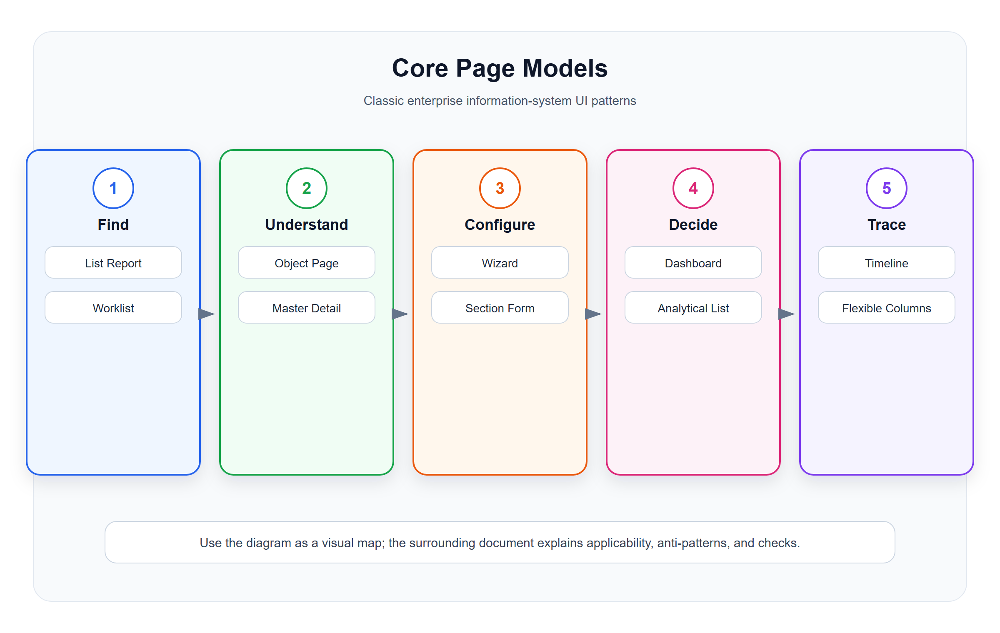

# 核心页面模型

<!-- ui-model-diagram:start -->



> 图源文件：[`assets/01-core-page-models.svg`](assets/01-core-page-models.svg)

<!-- ui-model-diagram:end -->

## 1. List Report 查询列表模型

### 定义

List Report 是企业系统最核心的页面模型：上方筛选条件，中间结果列表，列表上方提供新增、导出、批量操作，行内提供查看、编辑、处理等动作。

### 适用场景

- 订单列表。
- 商品列表。
- 会员列表。
- 库存流水。
- 优惠券列表。
- 门店列表。
- 财务单据列表。

### 标准结构

```text
页面标题
  说明当前对象范围和权限上下文

筛选区
  高频条件
  高级筛选
  重置 / 查询

操作区
  主操作：新增、导入
  批量操作：导出、批量审核、批量作废
  视图操作：列设置、密度、刷新

数据表格
  关键字段
  状态字段
  金额/数量/时间
  行操作

分页 / 汇总
  总数、选中数、合计值
```

### 设计重点

- 默认筛选条件必须符合用户最常见任务，不要让用户每次从空白开始。
- 表格第一屏必须能判断对象身份、状态、金额/数量、时间和责任主体。
- 行操作只放高频动作，低频动作放到更多菜单。
- 批量操作必须显示选中数量，并提供可撤销或二次确认策略。
- 列过多时优先列设置和详情页，不要无限横向滚动。

### 常见反模式

- 一张数据库表直接生成一个列表，字段很多但没有任务重点。
- 查询条件堆满页面，没有默认值和折叠策略。
- 表格中每行放十几个按钮。
- 状态字段只显示数字，不解释业务含义。
- 导出不受筛选条件和权限约束。

### 中文设计案例

#### 案例：零售订单列表页

**场景**：某零售连锁门店店长查看订单

**默认筛选**：
- 状态：待发货（高频）或全部（需要时才改）
- 时间：今天（默认范围明确）
- 门店：当前门店（基于登录身份）

**表格字段顺序**：
```
1. 订单编号（识别）
2. 会员姓名/手机（责任主体）
3. 订单状态（待发货/已发货/已完成）
4. 支付状态（已支付/待支付）
5. 订单金额（决策字段）
6. 商品数量
7. 下单时间
8. 操作（发货/查看/退款）
```

**实际效果**：
店长打开页面第一眼就能看到"今天有哪些订单需要发货"，不需要每次手动筛选。

## 2. Worklist 待办列表模型

### 定义

Worklist 是任务驱动列表，只展示用户当前需要处理的一批对象，不追求全量查询能力。

### 适用场景

- 待审核订单。
- 待发货订单。
- 待处理退款。
- 待补货商品。
- 待确认库存差异。
- 待回访客户。

### 标准结构

```text
待办标题 + 数量
任务分组 Tab
  待我处理
  即将超时
  已退回
  已处理

任务列表
  对象摘要
  紧急程度
  处理原因
  截止时间
  主操作
```

### 设计重点

- 突出“为什么要处理”，而不是只列出对象。
- 任务必须有状态、来源、责任人和时间。
- 高频处理动作应尽量在列表或侧边详情中完成。
- 完成后自动进入下一条，适合连续处理。

### 常见反模式

- 把全量查询列表伪装成待办，没有任务优先级。
- 用户处理完一条后返回第一页，连续处理效率低。
- 待办数量和实际可处理数据不一致。

### 中文设计案例

#### 案例：连锁门店待发货订单处理台

**场景**：连锁零售门店收银员处理待发货订单

**工作流设计**：
```
Tab 分组：
├── 待我处理 (25)
│   └── 订单摘要 + 紧急程度 + 配送方式 + 主操作（发货）
├── 即将超时 (3)
│   └── 超时倒计时 + 催促原因 + 优先处理入口
├── 已退回 (2)
│   └── 退回原因 + 重新处理入口
└── 已处理
    └── 处理结果 + 可查看详情

列表项设计：
┌─────────────────────────────────────────────────┐
│ 🔴 紧急  订单 #SO202607120045                    │
│ 张三 138****1234  │  待发货  │  ¥328.50         │
│ 配送方式：顺丰同城  │  下单：14:32              │
│ 原因：客户已付款，库存已锁定                    │
│                                                   │
│         [查看详情]  [发货]  [退款]               │
└─────────────────────────────────────────────────┘

连续处理体验：
- 按 Enter 打开详情侧边栏
- 按 Y 直接发货
- 发货成功后自动进入下一条
```

**实际效果**：
收银员可以连续处理订单，不需要每处理一条就返回列表。

## 3. Object Page 对象详情模型

### 定义

Object Page 是围绕一个核心业务对象组织的详情页。它不只是展示字段，而是解释对象的状态、历史、关联数据和可执行动作。

### 适用场景

- 订单详情。
- 会员详情。
- 商品详情。
- 门店详情。
- 支付单详情。
- 库存单详情。
- 营销活动详情。

### 标准结构

```text
对象头部
  对象名称 / 编号
  关键状态
  关键指标
  主操作

摘要区
  最重要的业务事实

分区内容
  基础信息
  金额 / 库存 / 权益
  流程状态
  关联对象
  操作记录
  附件 / 备注

底部或侧边
  风险提示
  审计日志
```

### 设计重点

- 头部必须让用户一眼知道“这是什么对象，现在处于什么状态”。
- 关键状态必须解释来源，例如支付状态、库存状态、审批状态。
- 关联列表要有业务意义，不要把所有外键表都堆上来。
- 操作按钮必须受对象状态约束，不可用时解释原因。
- 历史记录要能回答“谁在什么时候做了什么，导致什么变化”。

### 常见反模式

- 详情页只是字段平铺，没有状态解释。
- 所有关联数据都用 Tab 堆叠，用户不知道重点。
- 操作按钮永远可见，点击后才报错。
- 没有操作日志，无法追责。

### 中文设计案例

#### 案例：零售订单详情页

**场景**：店长或客服查看订单详情并处理问题

**对象头部设计**：
```
┌──────────────────────────────────────────────────────────────────┐
│ 📦 订单 #SO202607120045                               [打印] ▼  │
│                                                                  │
│ 🟡 待发货  │  🟢 已支付  │  🔒 已锁库存  │  ⚠️ 2小时后超时      │
│                                                                  │
│ ¥328.50  │  3件商品  │  人民广场店  │  会员：张三(138****1234) │
│                                                                  │
│  [发货]   [取消订单]   [退款]   [备注]   [查看历史]              │
└──────────────────────────────────────────────────────────────────┘
```

**分区内容设计**：
```
1. 订单摘要
   - 订单编号、状态、时间、金额

2. 商品明细
   - 商品名称、规格、数量、单价、小计
   - 图片缩略图（便于识别）

3. 支付信息
   - 支付方式、支付时间、支付流水号
   - 优惠券、积分抵扣

4. 配送信息
   - 配送方式、地址、联系人电话
   - 快递公司、运单号（已发货时）

5. 状态流转时间线
   - 下单 → 支付成功 → 库存锁定 → 发货 → 签收
   - 每步显示操作人、时间和系统/人工标识

6. 操作日志
   - 客服备注、人工改价、异常处理记录
```

**状态解释设计**：
```
订单状态：待发货
  └─ 为什么待发货？
     客户已付款，库存已锁定，等待门店发货
     发货时效：剩余 2小时12分（超过将自动取消）
```

**关联对象设计**：
```
关联对象
├── 会员：张三
│   └── [查看会员详情] [查看消费记录]
├── 支付单：PAY202607120001
│   └── [查看支付详情]
├── 优惠券：满300减30
│   └── 节省 ¥30.00
└── 库存：商品A-红色-XL
    └── 可用库存 25件
```

## 4. Dashboard 仪表盘模型

### 定义

Dashboard 用于快速判断业务状态和异常，而不是展示所有数据。它应该帮助用户回答“现在是否正常，哪里需要处理，下一步去哪”。

### 适用场景

- 经营概览。
- 门店看板。
- 库存看板。
- 财务看板。
- 会员运营看板。
- 支付监控。

### 标准结构

```text
时间和组织范围
核心指标
趋势图
异常提醒
待处理入口
排行 / 分布
钻取入口
```

### 设计重点

- 指标必须绑定口径、时间范围和组织范围。
- 指标卡片不应只显示数字，还要显示变化、目标或异常阈值。
- 图表必须能钻取到明细，否则只能看不能处理。
- 异常优先级高于装饰性图表。

### 常见反模式

- 首页堆满图表，但用户不知道要做什么。
- 指标没有口径说明，导致业务争议。
- 只有总数，没有趋势和对比。
- 看板无法跳到明细。

### 中文设计案例

#### 案例：连锁零售门店店长经营看板

**场景**：店长每天早上打开工作台，快速判断门店运营状态

**标准结构**：
```
┌─────────────────────────────────────────────────────────────────────┐
│ 早安，李店长                                            2026/7/12   │
│ 当前门店：人民广场店  │  昨日数据（17:00更新）                      │
├─────────────────────────────────────────────────────────────────────┤
│                                                                     │
│ ┌──────────┐ ┌──────────┐ ┌──────────┐ ┌──────────┐              │
│ │ ¥48,520  │ │ 156      │ │ ¥311.03  │ │ 89.2%    │              │
│ │ 昨日销售额│ │ 昨日订单数│ │ 昨日客单价│ │ 完成率    │              │
│ │ ↑12.3%   │ │ ↓3.2%    │ │ ↑8.5%    │ │ 目标9万  │              │
│ └────┬─────┘ └────┬─────┘ └────┬─────┘ └────┬─────┘              │
│      └────────点击跳转销售明细────────┘                            │
│                                                                     │
│ ┌─────────────────────────────┐  ┌─────────────────────────────┐  │
│ │ 📊 今日销售趋势               │  │ ⚠️ 待处理事项 (8)          │  │
│ │ [折线图]                     │  │                             │  │
│ │ 10:00 ████ 2,340            │  │ 🔴 待发货订单  12笔  >处理   │  │
│ │ 11:00 ██████ 4,560          │  │ 🟡 库存预警    5个  >查看   │  │
│ │ 12:00 ████████ 8,120        │  │ 🟡 退款申请    3笔  >审批   │  │
│ │ [点击时段可钻取明细]         │  │ 🟢 异常已解决  2笔        │  │
│ └─────────────────────────────┘  └─────────────────────────────┘  │
│                                                                     │
│ ┌─────────────────────────────┐  ┌─────────────────────────────┐  │
│ │ 🏆 商品销售排行              │  │ 📍 门店对比                 │  │
│ │ 1. 可乐 500ml     128件      │  │ 人民广场店    ¥48,520      │  │
│ │ 2. 矿泉水 550ml   98件       │  │ 淮海路店       ¥42,300     │  │
│ │ 3. 面包           67件       │  │ 南京路店       ¥38,900     │  │
│ │ [查看全部排行]               │  │ [查看门店明细]              │  │
│ └─────────────────────────────┘  └─────────────────────────────┘  │
│                                                                     │
│ [经营概览] [商品分析] [库存预警] [会员分析]                         │
└─────────────────────────────────────────────────────────────────────┘
```

**关键设计要点**：
1. **指标卡片**：显示数值 + 趋势 + 目标/阈值
2. **待办优先**：异常和待处理比图表更重要
3. **可钻取**：每个指标都能跳转到明细
4. **口径统一**：数据时间范围明确标注

## 5. Wizard 向导模型

### 定义

Wizard 用于多步骤、强顺序、需要分阶段校验的复杂任务。

### 适用场景

- 创建营销活动。
- 开通门店。
- 配置支付渠道。
- 创建套餐。
- 导入数据。
- 初始化系统。

### 标准结构

```text
步骤导航
  1 基础信息
  2 规则配置
  3 范围选择
  4 预览确认

当前步骤内容
  只展示当前需要填写的字段

底部操作
  上一步
  下一步
  保存草稿
  提交
```

### 设计重点

- 每一步只解决一个明确问题。
- 跨步骤依赖要透明，例如前一步选择影响后一步字段。
- 必须支持保存草稿，复杂配置不能因为关闭页面全部丢失。
- 最后一步要提供预览和风险提示。

### 常见反模式

- 为了好看把简单表单拆成很多步。
- 步骤之间依赖不清，用户回退后数据丢失。
- 最后一步没有总览，用户无法确认整体配置。

### 中文设计案例

#### 案例：零售连锁门店开通向导

**场景**：运营人员为新加盟门店完成系统初始化配置

**步骤设计**：
```
Step 1: 基础信息
├── 门店名称：[人民广场店________________]
├── 门店编码：[SH001_______________]
├── 所属区域：[华东-上海-黄浦区____▼]
├── 门店类型：[直营店▼]  [加盟店▼]
└── 预计开业：[2026-08-01___📅]

Step 2: 业务配置
├── 经营类目：
│   ├── ☑ 生鲜  ☑ 食品  ☑ 日用品
│   └── ☐ 服装  ☐ 家电
├── 启用功能：
│   ├── ☑ 收银  ☑ 库存管理  ☑ 会员积分
│   └── ☑ 线上订单  ☐ 配送到家
├── 结算周期：[日结▼]  [周结▼]  [月结▼]
└── 促销权限：[普通促销▼]  [允许满减▼]  [允许折扣▼]

Step 3: 硬件配置
├── 收银设备：[添加设备____] [+ 新增]
├── 打印机：[□ 前台小票打印机]  [□ 标签打印机]
└── 扫描枪：[□ 启用扫码枪]

Step 4: 预览确认
┌─────────────────────────────────────────────────────────┐
│ 门店开通预览                                           │
│                                                         │
│ 基础信息                                               │
│ • 门店名称：人民广场店                                 │
│ • 门店编码：SH001                                     │
│ • 所属区域：华东-上海-黄浦区                          │
│                                                         │
│ 业务配置                                               │
│ • 经营类目：生鲜、食品、日用品                        │
│ • 启用功能：收银、库存管理、会员积分、线上订单       │
│                                                         │
│ 硬件配置                                               │
│ • 收银设备：收银机A（IPOS-001）                       │
│                                                         │
│ ⚠️ 开通后门店将收到初始化配置通知                     │
│ ⚠️ 请确保硬件设备已正确连接                           │
└─────────────────────────────────────────────────────────┘

[上一步]  [保存草稿]  [确认开通]
```

**设计要点**：
1. 每步只聚焦一个问题
2. 跨步依赖要可见（如选区域才出现门店编码规则）
3. 支持保存草稿，防止网络中断丢失
4. 最后一步预览整页配置并高亮风险点

## 6. Flexible Column Layout 多栏对象链路模型

### 定义

Flexible Column Layout 用多栏并列展示对象链路，常见为列表、详情、子详情三栏。

### 适用场景

- 订单 -> 支付单 -> 支付流水。
- 客户 -> 合同 -> 回款。
- 商品 -> SKU -> 库存。
- 门店 -> 设备 -> 日志。
- 供应商 -> 采购单 -> 入库单。

### 标准结构

```text
第一栏：对象列表
第二栏：选中对象详情
第三栏：关联对象详情或操作面板
```

### 设计重点

- 适合宽屏后台，不适合所有移动端场景。
- 当前选中对象必须高亮，避免用户失去上下文。
- 每一栏都要有明确层级关系，不能只是三个随机区域。
- URL 或状态要能恢复当前选择，方便复制和刷新。

### 常见反模式

- 三栏信息没有父子关系，只是为了塞更多内容。
- 窄屏下压缩到不可读。
- 用户点击后不知道自己正在看哪一层对象。

### 中文设计案例

#### 案例：连锁零售订单追踪链路

**场景**：财务或客服追踪订单 -> 支付单 -> 资金流水

**三栏布局**：
```
┌────────────────┬────────────────────────┬─────────────────────────────┐
│ 第一栏：订单列表 │ 第二栏：订单详情        │ 第三栏：关联流水            │
│                │                        │                             │
│ [筛选：今日订单]│ #SO202607120045       │ 支付流水                    │
│                │ ════════════════════  │ ────────────────────────────│
│ 🔍 待发货      │ 会员：张三            │ PAY流水 #PAY202607120001    │
│   #SO...045   │ 金额：¥328.50        │ 支付方式：微信支付          │
│   #SO...044   │ 状态：待发货          │ 支付时间：14:32:15          │
│   #SO...043   │ 支付状态：已支付      │ 交易流水：WX2026071200001  │
│                │                        │ 到账金额：¥328.50          │
│ ──────────── │ 商品明细              │ 手续费：¥0.99              │
│ 🟢 已发货     │ ├─ 商品A ×2  ¥158.00 │ 状态：已到账               │
│   #SO...042   │ ├─ 商品B ×1  ¥98.00  │                             │
│   #SO...041   │ └─ 商品C ×1  ¥72.00  │ [查看原始报文]              │
│                │                        │                             │
│ ──────────── │ 配送信息              │ ────────────────────────────│
│ 🔵 已完成     │ 配送：顺丰同城        │ 资金流水                    │
│   #SO...040   │ 地址：上海市黄浦区...│ 批次：2026071201            │
│                │                        │ 到账时间：14:33:00          │
│                │ ───────────────────────│ 账户：运营账户-001          │
│                │ 支付信息              │                             │
│                │ 支付单：PAY20260712001│ ────────────────────────────│
│                │ [查看支付单详情 →]   │ 关联操作记录                │
│                │                        │ 14:32:15  支付成功         │
│                │                        │ 14:33:00  资金到账         │
└────────────────┴────────────────────────┴─────────────────────────────┘

面包屑：订单 #SO202607120045 → 支付单 PAY202607120001 → 资金流水

宽度调整：
- 左侧栏可折叠：收起后只显示筛选按钮
- 右侧栏可展开：查看完整流水详情
- 支持拖拽调整各栏宽度
```

**设计要点**：
1. 面包屑说明当前层级关系
2. 当前选中项高亮（第一栏和第二栏联动）
3. 每一栏有明确的数据范围
4. 深层对象可独立打开完整页