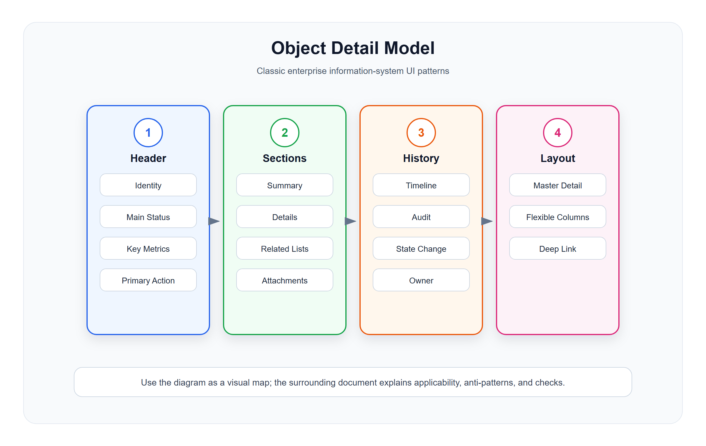

# 对象详情与主从模型

<!-- ui-model-diagram:start -->



> 图源文件：[`assets/03-object-detail-model.svg`](assets/03-object-detail-model.svg)

<!-- ui-model-diagram:end -->

## 1. 对象详情页的本质

详情页不是字段展示页，而是业务对象解释页。它要让用户理解一个对象：

- 它是谁。
- 它当前处于什么状态。
- 它为什么处于这个状态。
- 它关联了哪些对象。
- 它曾经发生过什么。
- 用户现在能做什么。

## 2. Object Page 模型

### 2.1 标准结构

```text
对象头部
  名称 / 编号 / 状态 / 主操作

关键摘要
  金额、数量、客户、门店、时间、责任人

内容分区
  基础信息
  业务明细
  关联对象
  流程状态
  操作记录
  附件备注

风险和异常
  错误、冲突、冻结、超时、权限提示
```

### 2.2 对象头部

对象头部必须稳定展示：

- 对象名称或编号。
- 主状态。
- 关键标签。
- 最重要的 1 到 3 个指标。
- 当前可执行主操作。

示例：

```text
订单 #SO202607040001
状态：待发货 / 已支付 / 已锁库存
金额：128.00 元
门店：人民广场店
操作：发货、取消、打印小票
```

### 2.3 分区设计

分区按业务理解顺序排列，不按数据库表排列。

订单详情推荐分区：

1. 订单摘要。
2. 商品明细。
3. 支付信息。
4. 配送/自提信息。
5. 优惠和积分。
6. 状态流转。
7. 操作日志。

会员详情推荐分区：

1. 会员摘要。
2. 等级和权益。
3. 积分和余额。
4. 消费记录。
5. 券和营销触达。
6. 标签和画像。
7. 操作日志。

商品详情推荐分区：

1. 商品摘要。
2. SKU。
3. 价格。
4. 库存。
5. 上下架渠道。
6. 销售数据。
7. 操作日志。

## 3. Related Lists 关联列表模型

### 定义

关联列表是在详情页中展示与当前对象相关的一组对象。

### 适用场景

- 会员详情中的订单列表。
- 商品详情中的库存流水。
- 门店详情中的设备列表。
- 客户详情中的合同列表。
- 订单详情中的支付流水。

### 设计要求

- 关联列表必须说明关系类型。
- 只展示最关键字段，完整查询跳转到独立列表页。
- 支持在关联列表内做有限操作，例如查看、解绑、补录。
- 大数据量关联列表默认分页或只展示最近记录。

### 反模式

- 把所有外键关系都堆进详情页。
- 关联列表字段过多，变成另一个复杂列表页。
- 没有解释关联关系，用户不知道为什么出现在这里。

### 中文设计案例

#### 案例：零售订单详情页 - 关联列表设计

**HTML 效果示例**：[查看设计案例](cases/03-对象详情与主从模型/03-1-order-detail-related-lists.html)

**关联列表设计要点**：
1. 关联列表只展示最关键字段
2. 说明关系类型（如"关联会员"）
3. 提供"查看详情"入口
4. 大数据量时只展示最近记录

## 4. Timeline 时间线模型

### 定义

时间线用于解释状态变化、操作过程和责任链。

### 适用场景

- 订单状态流转。
- 审批历史。
- 支付回调。
- 库存变动。
- 客户跟进。
- 异常处理过程。

### 标准字段

```text
时间
事件类型
操作人 / 系统来源
前状态
后状态
原因
关联单号
备注 / 附件
```

### 设计要求

- 系统自动事件和人工操作要区分。
- 状态变化要展示前后值。
- 关键事件要支持展开详情。
- 审计日志不要被普通备注覆盖。

## 5. Master-Detail 主从模型

### 定义

左侧或上方是对象集合，右侧或下方是选中对象详情。用户可以快速切换对象而不离开页面。

### 适用场景

- 客户列表 + 客户详情。
- 工单列表 + 工单处理。
- 商品列表 + SKU 详情。
- 订单列表 + 订单摘要。
- 消息列表 + 消息内容。

### 设计重点

- 当前选中项必须清晰高亮。
- 列表和详情之间要保持状态同步。
- 支持键盘上下切换时，详情随之更新。
- 用户编辑详情后，列表摘要也要更新。

### 适用边界

适合连续浏览和处理，不适合极复杂详情页。如果详情包含大量分区、复杂表格和高风险操作，应跳转到完整 Object Page。

## 6. Flexible Column Layout 三栏模型

### 定义

三栏模型用于展示连续的对象链路。

典型结构：

```text
列表栏：订单列表
详情栏：订单详情
子详情栏：支付流水 / 物流记录 / 售后单
```

### 适用场景

- 父子对象强相关。
- 用户需要频繁横向追踪。
- 宽屏办公场景。
- 需要保留上下文而不是频繁跳转。

### 设计要求

- 每一栏有明确层级关系。
- 每一栏宽度可折叠或响应式调整。
- 面包屑、标题或高亮必须说明当前层级。
- 深层对象可独立打开完整页。

## 7. 对象操作模型

详情页操作分三类：

| 类型 | 位置 | 示例 |
|---|---|---|
| 主操作 | 头部右侧 | 发货、审核通过、保存 |
| 次操作 | 头部更多菜单 | 打印、复制、导出 |
| 分区操作 | 分区内 | 添加备注、补录发票、解绑设备 |

设计要求：

- 操作必须受对象状态控制。
- 不可操作时说明原因。
- 高风险操作必须确认。
- 操作成功后刷新相关分区，而不是让用户猜结果。

## 8. 对象详情检查清单

- 对象头部是否说明对象身份和主状态？
- 页面是否解释状态来源，而不是只展示结果？
- 关联列表是否有业务意义？
- 时间线是否能解释关键状态变化？
- 操作按钮是否受状态、权限和业务规则控制？
- 高风险操作是否二次确认？
- 数据为空时是否说明原因？
- 对象详情是否可以从列表、报表和外部链接稳定进入？
- 页面刷新后是否能恢复当前对象和分区？