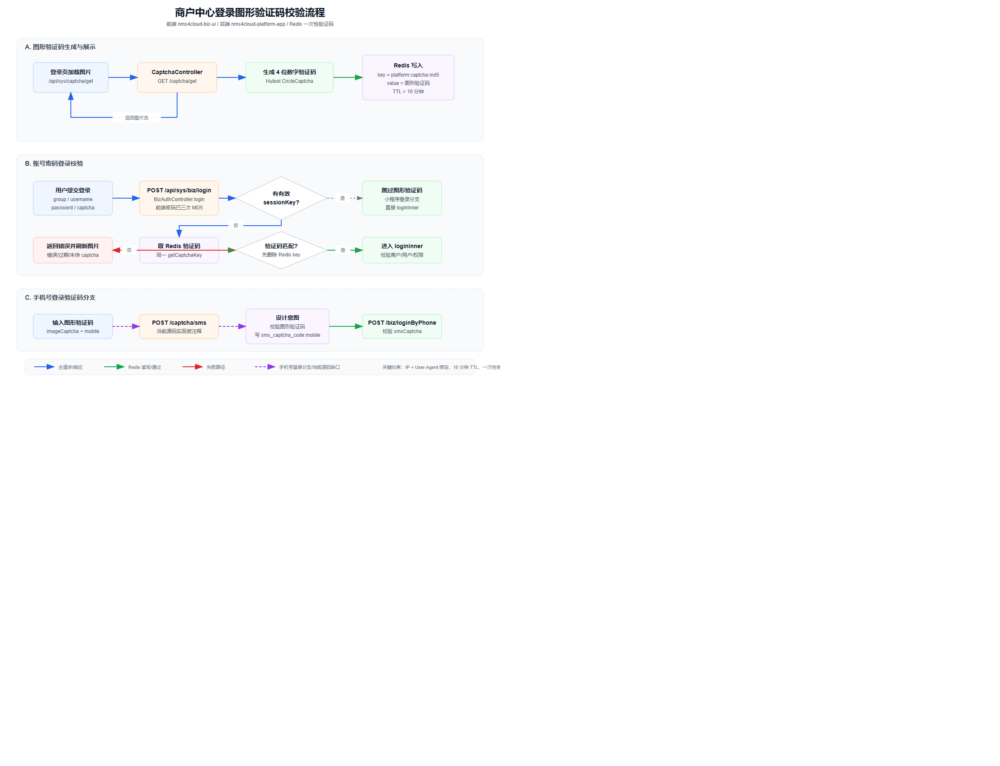

# 18-商户中心登录图形验证码校验链路分析

> 分析时间：2026-05-20
> 涉及前端：`D:\mywork\nms4cloud-biz-ui`
> 涉及后端：`D:\mywork\nms4cloud`
> 场景：商户中心登录页图形验证码生成、展示、提交与后端校验。

## 1. 结论摘要

商户中心登录页红框内的验证码是后端生成的 4 位数字图形验证码。前端通过图片地址请求验证码图片，后端将验证码文本按“客户端指纹”写入 Redis。账号密码登录时，前端把用户输入的 `captcha` 随登录请求提交给 `/api/sys/biz/login`，后端再用同样的客户端指纹取 Redis 中的验证码进行比对。

验证码不是按用户账号保存，也不是按显式 token 保存，而是按请求来源的 IP 与 User-Agent 生成 Redis key。普通浏览器 key 形态为：

```text
nms4cloud-platform:captcha:md5(clientIp + User-Agent)
```

验证码有效期为 10 分钟，且校验时会删除 Redis key，因此属于一次性验证码。

## 2. 涉及模块

| 层级 | 项目/模块 | 文件 | 作用 |
|---|---|---|---|
| 前端 | `nms4cloud-biz-ui` | `src/pages/User/Login/index.tsx` | 登录页 UI，展示图形验证码，提交登录表单 |
| 前端 | `nms4cloud-biz-ui` | `src/services/ant-design-pro/api.ts` | 账号密码登录、手机号登录 API 封装 |
| 前端 | `nms4cloud-biz-ui` | `src/services/ant-design-pro/login.ts` | 手机号登录时获取短信验证码 API 封装 |
| 后端 | `nms4cloud-platform-app` | `CaptchaController.java` | 生成图形验证码图片，写入 Redis |
| 后端 | `nms4cloud-platform-app` | `BizAuthController.java` | 商户后台账号密码登录、手机号登录验证码校验 |
| 后端公共 | `nms4cloud-starter-parent` | `ServletUtilPlus.java` | 生成验证码 Redis key |
| 后端 API DTO | `nms4cloud-starter-redis` | `GetSmsCaptchaRequest.java` | 获取短信验证码请求参数 |
| 后端 API DTO | `nms4cloud-starter-redis` | `LoginByPhoneRequest.java` | 手机号登录请求参数 |

## 3. 前端账号密码登录链路

### 3.1 验证码图片展示

登录页账号密码模式中，图形验证码图片由 `Image` 组件加载：

```tsx
src={`/api/sys/captcha/get?idx=${imageFlag}`}
```

位置：

```text
D:\mywork\nms4cloud-biz-ui\src\pages\User\Login\index.tsx
```

关键逻辑：

- `captcha` 表单项是用户输入的图形验证码。
- 图片接口是 `/api/sys/captcha/get?idx=${imageFlag}`。
- 点击验证码图片时，前端执行 `setImageFlag(imageFlag + 1)`，通过变更 query 参数触发图片重新加载。
- 登录失败时也会执行 `setImageFlag(imageFlag + 1)` 刷新图形验证码。

### 3.2 登录请求提交

账号密码登录调用：

```ts
login({ ...finalValues, type })
```

API 封装位置：

```text
D:\mywork\nms4cloud-biz-ui\src\services\ant-design-pro\api.ts
```

请求地址：

```text
POST /api/sys/biz/login
```

提交参数主要包括：

```json
{
  "group": "企业账号",
  "username": "用户名",
  "password": "三次 MD5 后的密码",
  "captcha": "用户输入的图形验证码",
  "type": "account"
}
```

前端会对密码连续执行 3 次 MD5 后再提交，验证码本身不在前端加密。

## 4. 后端图形验证码生成链路

后端 Controller：

```text
D:\mywork\nms4cloud\nms4cloud-app\1_platform\nms4cloud-platform\nms4cloud-platform-app\src\main\java\com\nms4cloud\platform\app\controller\CaptchaController.java
```

接口：

```text
GET /captcha/get
```

通过网关/前端代理暴露为：

```text
GET /api/sys/captcha/get
```

核心行为：

1. 使用 Hutool `CaptchaUtil.createCircleCaptcha(200, 100, 4, 20)` 创建图形验证码。
2. 使用 `RandomGenerator("0123456789", 4)` 限定为 4 位数字。
3. 调用 `captcha.getCode()` 得到验证码文本。
4. 调用 `ServletUtilPlus.getCaptchaKey(request)` 生成 Redis key。
5. 写入 Redis，过期时间 `Duration.ofMinutes(10L)`。
6. 通过 `captcha.write(outputStream)` 将验证码图片写入 HTTP response。

## 5. Redis Key 生成规则

公共方法：

```text
D:\mywork\nms4cloud\nms4cloud-starter\nms4cloud-starter-parent\src\main\java\com\nms4cloud\common\util\ServletUtilPlus.java
```

方法：

```java
public static String getCaptchaKey(HttpServletRequest request)
```

规则：

| 客户端类型 | Redis key 计算依据 |
|---|---|
| 普通浏览器 | `md5(clientIp + User-Agent)` |
| Cordova 或 header `cordova=true` | `md5(clientIp)` |

最终 Redis key：

```text
nms4cloud-platform:captcha:{md5值}
```

这意味着验证码绑定的是请求客户端指纹，而不是登录账号、手机号或显式 captchaId。

## 6. 后端账号密码登录校验链路

后端 Controller：

```text
D:\mywork\nms4cloud\nms4cloud-app\1_platform\nms4cloud-platform\nms4cloud-platform-app\src\main\java\com\nms4cloud\platform\app\controller\biz\BizAuthController.java
```

接口：

```text
POST /biz/login
```

通过网关/前端代理暴露为：

```text
POST /api/sys/biz/login
```

校验流程：

1. 如果 `request.sessionKey` 非空并且 Redis 中存在对应小程序登录 session key，则视为小程序登录分支，不要求图形验证码。
2. 普通账号密码登录要求 `request.captcha` 非空。
3. 使用 `ServletUtilPlus.getCaptchaKey(servletRequest)` 生成同一个 Redis key。
4. 从 Redis 读取验证码文本。
5. Redis 中不存在验证码时，返回验证码过期。
6. 删除 Redis key，保证验证码只能使用一次。
7. 比较 Redis 验证码和 `request.captcha`。
8. 比对失败返回验证码错误。
9. 比对成功后进入 `loginInner(request, servletRequest)` 执行商户、用户、密码、权限等登录逻辑。

关键特征：

- 删除 Redis key 发生在验证码文本比对之前。
- 因此无论用户输对还是输错，这次图形验证码都会失效。
- 登录失败后前端刷新 `imageFlag`，重新请求新的验证码图片。

## 7. 手机号登录中的验证码链路

手机号登录分两段：

1. 图形验证码用于换取短信验证码。
2. 短信验证码用于手机号登录。

### 7.1 前端获取短信验证码

前端登录页手机号模式中，先输入 `imageCaptcha`，再点击获取短信验证码。

调用位置：

```text
D:\mywork\nms4cloud-biz-ui\src\pages\User\Login\index.tsx
D:\mywork\nms4cloud-biz-ui\src\services\ant-design-pro\login.ts
```

请求：

```text
POST /api/sys/captcha/sms
```

参数：

```json
{
  "mobile": "手机号",
  "imageCaptcha": "用户输入的图形验证码"
}
```

### 7.2 当前源码中的状态

当前 `nms4cloud` 源码里，`CaptchaController` 中 `/sms` 接口实现被整段注释掉。保留的注释代码和私有方法 `checkImageCode(...)` 表明原设计逻辑为：

1. 校验手机号格式。
2. 读取图形验证码 Redis key。
3. 如果 Redis 中没有图形验证码，提示验证码过期。
4. 比较 Redis 图形验证码与 `imageCaptcha`。
5. 成功后删除图形验证码 Redis key。
6. 生成短信验证码。
7. 写入 Redis：`sms_captcha_code:{mobile}`。
8. 值格式类似：`验证码_发送时间戳`。
9. TTL 也是 10 分钟。

但是从当前仓库文本搜索结果看，没有找到启用状态的 `POST /captcha/sms` 实现。因此如果线上手机号登录获取短信验证码可用，可能存在以下情况之一：

- 线上部署版本与当前仓库源码不同。
- 该接口由其他分支或历史版本提供。
- 网关把 `/api/sys/captcha/sms` 转发到了当前仓库之外的服务。
- 当前源码中接口被误注释，手机号登录获取短信验证码在本地版本不可用。

### 7.3 手机号登录时短信验证码校验

手机号登录接口：

```text
POST /api/sys/biz/loginByPhone
```

后端方法：

```java
BizAuthController.loginByPhone(...)
```

校验逻辑：

1. Redis key 为：

```text
sms_captcha_code:{mobile}
```

2. Redis value 使用 `_` 分隔，取第一段作为短信验证码。
3. 如果 Redis 中不存在，返回短信验证码过期。
4. 如果与 `request.smsCaptcha` 不一致，返回短信验证码错误。
5. 成功后删除 Redis key，短信验证码只能使用一次。
6. 后续再根据企业账号、手机号查询用户并完成登录。

请求 DTO：

```text
D:\mywork\nms4cloud\nms4cloud-starter\nms4cloud-starter-redis\src\main\java\com\nms4cloud\platform\api\request\biz\LoginByPhoneRequest.java
```

字段：

```java
public String group;
private String mobile;
private String smsCaptcha;
private String type;
```

## 8. 错误提示来源

账号密码登录失败时，后端返回 `LoginResultVO.error(...)`，前端将结果保存到 `userLoginState`，页面展示 `errorMessage`。如果后端未给出明确错误，前端默认展示“账户或者密码错误”。

图形验证码相关错误大致来自后端：

| 场景 | 后端表现 |
|---|---|
| 未传 `captcha` | 返回验证码错误 |
| Redis 中没有验证码 | 返回验证码过期 |
| 输入与 Redis 值不一致 | 返回验证码错误 |
| 校验成功 | 删除 Redis key 后进入账号密码登录逻辑 |

## 9. 需要注意的兼容点

1. 图形验证码绑定 IP + User-Agent。如果经过代理、负载均衡或网关时客户端 IP 获取不稳定，可能出现“图片是 A key，登录校验是 B key”的问题。
2. 同一个浏览器环境下，多开页面刷新验证码会覆盖同一个 Redis key。后打开或后刷新的验证码会使旧页面上的验证码失效。
3. 验证码大小写不是问题，因为当前生成器只生成数字。
4. 后端先删除再比对，输错一次后必须刷新验证码。
5. 手机号登录依赖 `/api/sys/captcha/sms`，但当前仓库该接口实现被注释，需要结合线上版本或网关确认实际来源。

## 10. 排查建议

如果线上出现“验证码明明输入正确但提示错误/过期”，优先按以下顺序排查：

1. 浏览器 Network 中确认图片请求：`GET /api/sys/captcha/get?idx=...` 是否成功返回图片。
2. 登录请求 `POST /api/sys/biz/login` payload 中是否包含 `captcha` 字段。
3. 图片请求和登录请求的 `User-Agent` 是否一致。
4. 后端获取的客户端 IP 在图片请求和登录请求中是否一致。
5. Redis 中是否存在 `nms4cloud-platform:captcha:*` 相关 key。
6. 是否有多标签页或自动刷新覆盖了同一个客户端指纹下的验证码。
7. 登录失败后前端是否刷新了验证码图片。
8. 如果是手机号登录，确认 `/api/sys/captcha/sms` 线上实际由哪个服务提供。

## 11. 证据文件清单

- `D:\mywork\nms4cloud-biz-ui\src\pages\User\Login\index.tsx`
- `D:\mywork\nms4cloud-biz-ui\src\services\ant-design-pro\api.ts`
- `D:\mywork\nms4cloud-biz-ui\src\services\ant-design-pro\login.ts`
- `D:\mywork\nms4cloud\nms4cloud-app\1_platform\nms4cloud-platform\nms4cloud-platform-app\src\main\java\com\nms4cloud\platform\app\controller\CaptchaController.java`
- `D:\mywork\nms4cloud\nms4cloud-app\1_platform\nms4cloud-platform\nms4cloud-platform-app\src\main\java\com\nms4cloud\platform\app\controller\biz\BizAuthController.java`
- `D:\mywork\nms4cloud\nms4cloud-starter\nms4cloud-starter-parent\src\main\java\com\nms4cloud\common\util\ServletUtilPlus.java`
- `D:\mywork\nms4cloud\nms4cloud-starter\nms4cloud-starter-redis\src\main\java\com\nms4cloud\platform\api\request\GetSmsCaptchaRequest.java`
- `D:\mywork\nms4cloud\nms4cloud-starter\nms4cloud-starter-redis\src\main\java\com\nms4cloud\platform\api\request\biz\LoginByPhoneRequest.java`

## 12. 流程图

SVG 文件：

```text
D:\mywork\techdoc\crm技术文档\18-商户中心登录图形验证码校验流程图.svg
```

PNG 文件：

```text
D:\mywork\techdoc\crm技术文档\18-商户中心登录图形验证码校验流程图.png
```

Markdown 预览：



## 13. 流程图详细描述

### 13.1 图形验证码生成与展示

1. 用户进入商户中心登录页 `/user/login`。
2. 前端登录页渲染图形验证码图片，图片地址为：

```text
/api/sys/captcha/get?idx={imageFlag}
```

3. `idx` 不是后端验证码 ID，只是前端用于刷新图片缓存的 query 参数。
4. 请求经网关或前端代理转到平台服务的验证码接口：

```text
GET /captcha/get
```

5. `CaptchaController.getCaptcha(...)` 使用 Hutool 生成验证码：

```text
CircleCaptcha(200, 100, 4, 20)
RandomGenerator("0123456789", 4)
```

6. 后端得到验证码文本，例如 `9345`。
7. 后端调用 `ServletUtilPlus.getCaptchaKey(request)` 生成 Redis key。
8. 普通浏览器 key 的核心依据是：

```text
clientIp + User-Agent
```

9. 最终 Redis key 形态是：

```text
nms4cloud-platform:captcha:{md5(clientIp + User-Agent)}
```

10. 后端把验证码文本写入 Redis，TTL 为 10 分钟。
11. 后端通过 response 输出流返回验证码图片。
12. 前端只拿到图片，不拿验证码文本，也没有显式 captchaId。

### 13.2 账号密码登录校验主流程

1. 用户输入企业账号、用户名、密码和图形验证码。
2. 前端提交登录前，对密码连续执行 3 次 MD5。
3. 前端调用：

```text
POST /api/sys/biz/login
```

4. 请求体中包含：

```json
{
  "group": "企业账号",
  "username": "用户名",
  "password": "三次 MD5 后的密码",
  "captcha": "用户输入的图形验证码",
  "type": "account"
}
```

5. 后端进入 `BizAuthController.login(...)`。
6. 如果请求中带有有效 `sessionKey`，并且 Redis 中存在对应小程序登录 session key，则走小程序登录兼容分支，不要求图形验证码。
7. 普通账号密码登录必须传 `captcha`。
8. 如果 `captcha` 为空，直接返回验证码错误。
9. 后端再次调用 `ServletUtilPlus.getCaptchaKey(servletRequest)`。
10. 由于图片请求和登录请求来自同一个浏览器环境，理论上会得到同一个 Redis key。
11. 后端从 Redis 读取验证码文本。
12. 如果 Redis 没有该 key，说明验证码过期、已使用、被新验证码覆盖，或请求指纹不一致，返回验证码过期。
13. 后端读取到验证码后，先删除 Redis key。
14. 删除后再比较 Redis 中的验证码文本和请求体中的 `captcha`。
15. 如果不一致，返回验证码错误。
16. 如果一致，进入 `loginInner(request, servletRequest)`。
17. `loginInner(...)` 才继续处理企业账号、用户、密码、角色权限、Token 和会话信息。

### 13.3 一次性验证码的影响

验证码校验时会先删除 Redis key，再进行值比较。这带来几个直接影响：

1. 用户输错一次后，旧验证码立即失效。
2. 用户即使随后把同一个验证码改对，也无法再通过，必须刷新图片。
3. 登录失败后前端会执行 `setImageFlag(imageFlag + 1)`，触发图片重新加载。
4. 多个标签页共用同一个 `clientIp + User-Agent` 指纹，后刷新的验证码会覆盖先前页面的验证码。
5. 如果同一个浏览器开了两个登录页，页面 A 看到的验证码可能被页面 B 刷新后的验证码覆盖。

### 13.4 手机号登录分支

手机号登录不是直接用图形验证码完成登录，而是两段式：

1. 图形验证码用于获取短信验证码。
2. 短信验证码用于手机号登录。

前端获取短信验证码时调用：

```text
POST /api/sys/captcha/sms
```

请求体：

```json
{
  "mobile": "手机号",
  "imageCaptcha": "用户输入的图形验证码"
}
```

从当前后端源码看，`CaptchaController` 中 `/sms` 接口被整段注释掉。保留的代码显示设计意图如下：

1. 校验手机号格式。
2. 使用同一个 `getCaptchaKey(...)` 读取图形验证码。
3. 图形验证码为空时返回验证码过期。
4. 图形验证码不匹配时返回验证码错误。
5. 校验通过后删除图形验证码 Redis key。
6. 生成短信验证码。
7. 写入 Redis：

```text
sms_captcha_code:{mobile}
```

8. Redis value 设计为：

```text
{短信验证码}_{发送时间戳}
```

9. 后续手机号登录调用：

```text
POST /api/sys/biz/loginByPhone
```

10. `BizAuthController.loginByPhone(...)` 从 `sms_captcha_code:{mobile}` 读取短信验证码。
11. 后端取 Redis value 中 `_` 前面的部分，与请求体中的 `smsCaptcha` 比较。
12. 短信验证码不存在时返回过期。
13. 短信验证码不一致时返回错误。
14. 短信验证码正确时删除 Redis key，并继续手机号登录逻辑。

### 13.5 当前源码缺口

当前仓库中可以确认：

1. 图形验证码生成接口存在。
2. 账号密码登录图形验证码校验存在。
3. 手机号登录短信验证码校验存在。
4. 手机号登录“获取短信验证码”的 `/captcha/sms` 接口在当前源码中被注释。

因此，如果线上手机号登录获取短信验证码可用，需要额外确认：

1. 线上部署是否使用了不同版本代码。
2. 网关是否把 `/api/sys/captcha/sms` 转发到其他服务。
3. 是否存在未纳入当前仓库的历史服务或分支实现。

### 13.6 故障定位路径

如果用户反馈“验证码正确但仍提示错误”，优先按流程图中的关键节点排查：

1. 前端是否真的重新请求了 `/api/sys/captcha/get`。
2. 图片请求是否成功返回新的验证码图片。
3. 登录请求 payload 是否包含 `captcha`。
4. 图片请求和登录请求的后端 `clientIp` 是否一致。
5. 图片请求和登录请求的 `User-Agent` 是否一致。
6. Redis 中对应 `nms4cloud-platform:captcha:*` key 是否在 10 分钟内存在。
7. 是否存在多标签页刷新覆盖同一个 Redis key。
8. 后端是否在验证码比对之前已经删除 key，导致复用失败。
9. 如果是手机号登录，先确认 `/api/sys/captcha/sms` 的实际服务来源。
