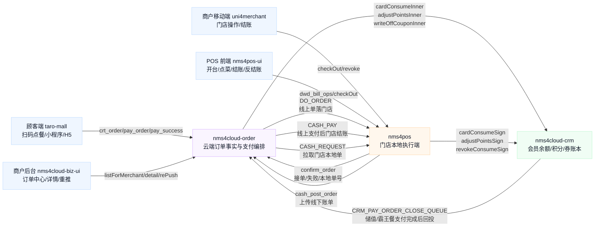
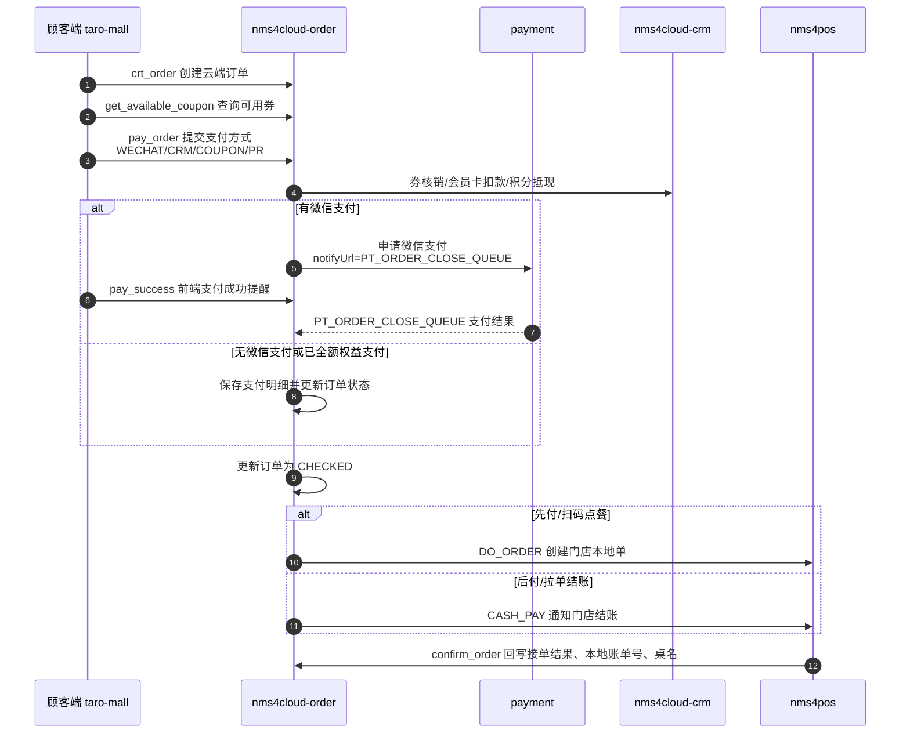
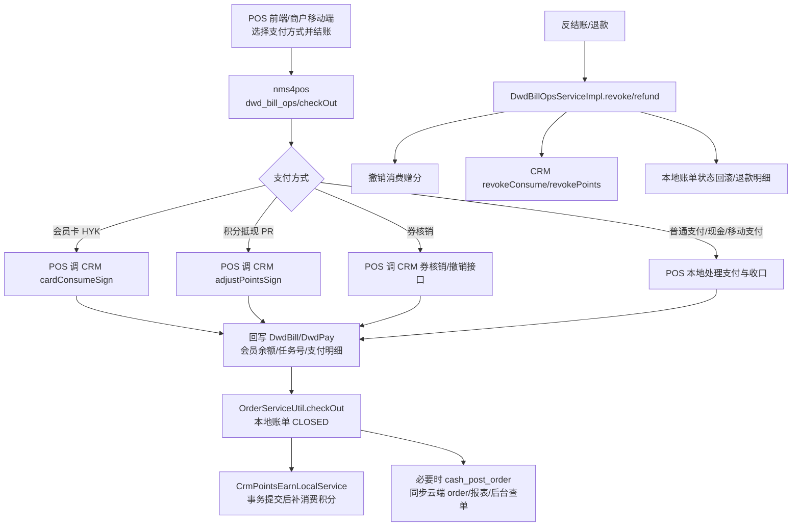
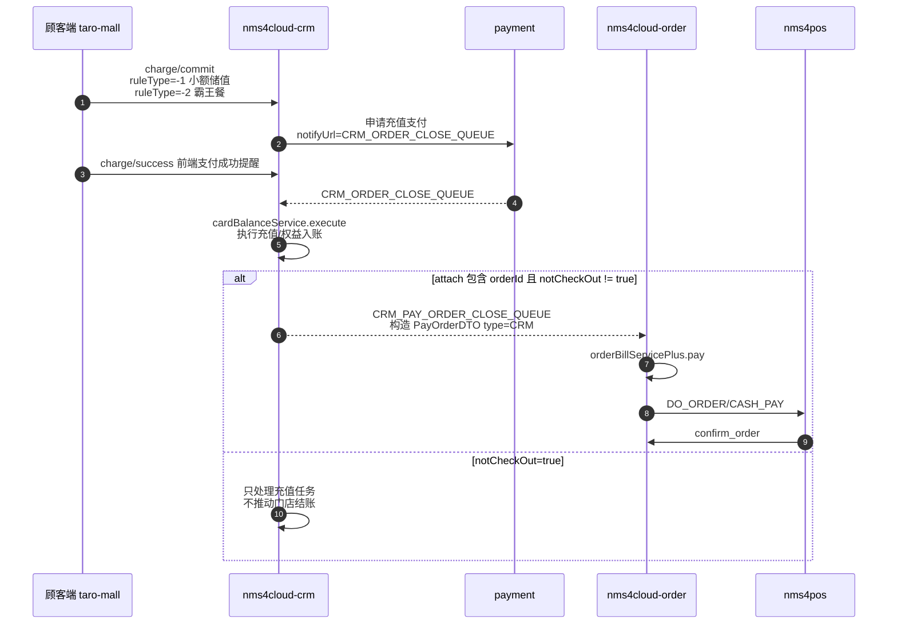

# order、CRM、POS 线上线下订单全链路分析

## 1. 文档目的

这份文档回答一组连在一起的问题：

1. `order` 模块到底是做什么的。
2. 顾客点餐、门店下单、门店结账，分别是不是都要经过 `order`。
3. 线上订单是什么。
4. 线上点菜、线上结账、会员付款、券、积分，分别怎么和 `POS`、`CRM` 交互。
5. 门店本地单为什么有时可以不先经过 `order`，但又会同步到云端。
6. 商户后台为什么查单、查退款、查订单中心，会落到 `order`。

本文只按当前源码分析，不沿用已经被撤销的旧结论。尤其是“`order outbox` 统一做消费后赠券幂等补偿”这一说法，当前代码树里没有可直接支撑它的生效链路。

## 2. 总览结论

先给结论，再展开。

### 2.1 一句话结论

`order` 不是简单的“下单接口集合”，它是云端订单事实中心、线上支付编排中心、门店 POS 消息桥，也是商户后台订单查询中心。

`POS` 不是云端订单中心，它是门店本地执行端，负责本地开单、结账、反结账、打印、离线容错，以及把线下事实同步上云。

`CRM` 不是订单中心，它是会员权益账本和执行器，负责会员卡扣款、积分、券、充值、撤销、补偿。

### 2.2 先总后分的核心关系

可以先把三者理解成三层：

```text
顾客入口 / 商户后台
    ↓
order：云端订单事实、支付编排、消息分发、后台查单中心
    ↓
POS：门店本地执行、结账、反结账、落本地账单
    ↓
CRM：会员余额、积分、券、充值、撤销
```

但真实链路不是单向的。很多场景是双向的：

- 顾客线上下单，先到 `order`，再发消息到门店 `POS`。
- 门店本地下单或结账，先在 `POS` 执行，再同步到云端 `order`。
- 会员余额、积分、券，很多时候不是 `order` 自己扣，而是 `order` 或 `POS` 调 `CRM` 执行，执行结果再回填订单事实。

### 2.3 结论拆分

1. **线上订单**：通常先经过 `order`。`order` 负责保存订单号、菜品、支付方式、状态流转和门店消息。
2. **门店本地单**：可以先不经过 `order`，直接在 `POS` 本地结账；但要上云、查单、退款、会员、券、积分时，会同步到云端。
3. **会员卡扣款**：可以由 `order` 在云端调 `CRM`，也可以由 `POS` 在本地调 `CRM`。两种链路都存在。
4. **券和积分**：不是只能经过 `CRM` 接口；它们本来就要经过 `CRM`，但是否经 `order`，取决于场景。线上订单常见是 `order` 编排，门店本地单常见是 `POS` 直接调 `CRM`。

### 2.4 流程图总览

#### 2.4.1 四个系统的总关系



#### 2.4.2 线上点餐/线上支付/门店落单流程



#### 2.4.3 门店本地单结账/反结账流程



#### 2.4.4 小额储值/霸王餐分支



#### 2.4.5 独立图文件

- [总览图 SVG](./order-crm-pos-关系总览.svg)
- [总览图 PNG](./order-crm-pos-关系总览.png)
- [线上链路 SVG](./order-crm-pos-线上订单链路.svg)
- [线上链路 PNG](./order-crm-pos-线上订单链路.png)
- [门店本地链路 SVG](./order-crm-pos-门店本地单链路.svg)
- [门店本地链路 PNG](./order-crm-pos-门店本地单链路.png)

## 3. 系统角色定位

| 系统 | 角色 | 主要职责 |
| --- | --- | --- |
| `taro-mall` | 顾客侧前端 | 创建订单、选择支付方式、触发支付成功回调、部分储值场景触发 CRM 充值 |
| `nms4cloud-order` | 云端订单中心 | 维护订单事实、支付状态、优惠券/积分/会员扣款编排、向门店发消息、后台查单 |
| `nms4cloud-crm` | 会员权益中心 | 会员卡扣款、积分调整、券核销、充值、撤销 |
| `nms4pos` | 门店执行端 | 本地单、拉单、结账、反结账、打印、POS 本地账单与云端同步 |
| `nms4pos-ui` | 门店前端 | 门店本地账单操作、结账、会员选择、反结账 |
| `nms4cloud-biz-ui` / `uni4merchant` | 商户侧后台/移动端 | 查订单、查门店账单、查会员、执行本地门店操作 |

## 4. 先说清楚三个概念

### 4.1 什么是线上订单

这里的“线上订单”，指的是顾客侧在小程序、H5、扫码点餐、商城等线上入口创建的订单，订单主事实先落在云端 `order`，再按订单状态和支付方式继续编排。

它不等于“一定是微信支付”。

线上订单可以包含：

- 微信支付
- 会员卡支付
- 优惠券抵扣
- 积分抵现
- 混合支付
- 后付单、拉单、扫码单

所以“线上”描述的是**订单创建和编排的入口**，不是唯一支付方式。

### 4.2 什么是门店本地单

门店本地单是 POS 在门店现场直接创建和处理的单据。它的主账单先在本地 `POS` 落地，结账、反结账、打印、补积分等动作也先在本地执行。

这类单据可以不先经过 `order`，但如果要：

- 上云归档
- 后台查单
- 会员权益同步
- 退款/反结账追溯
- 报表统计

就会再同步到云端或调用云端服务。

### 4.3 什么是 `order` 模块

`order` 不是“一个页面”或者“一个支付接口”，它更像云端的订单中枢：

- 保存订单事实
- 保存支付方式与支付状态
- 作为支付成功后的收口点
- 作为门店消息桥，把云端订单变成门店可执行指令
- 作为后台订单中心的查询源
- 协调 CRM 的券、积分、会员卡扣款和撤销

## 5. 线上订单主链路

### 5.1 顾客侧先创建订单

小程序前端创建订单和支付都直接调用 `order`：

- `crtOrder` -> `/order_bill/crt_order`
- `getAvailableCoupon` -> `/order_bill/get_available_coupon`
- `payOrder` -> `/order_bill/pay_order`
- `pay_success` -> `/order_bill/pay_success`

源码证据：

- `D:\mywork\taro-mall\src\common\service\order\bill.ts:36-45`
- `D:\mywork\taro-mall\src\common\service\order\bill.ts:76-80`
- `D:\mywork\taro-mall\src\common\service\order\bill.ts:140-156`

前端在支付页会组装支付方式列表，支持混合支付：

- 微信
- 会员卡 `CRM`
- 优惠券 `COUPON`
- 混合支付 `ZH`

源码证据：

- `D:\mywork\taro-mall\src\pagePop\paycenter\index.tsx:445-473`

### 5.2 `order` 先做支付编排

`PayOrderServiceImpl.preHandle()` 会先检查订单，再检查优惠券、积分支付、会员卡支付、微信支付等信息。

源码证据：

- `D:\mywork\nms4cloud\nms4cloud-app\3_customer\nms4cloud-order\nms4cloud-order-service\src\main\java\com\nms4cloud\order\service\c\order\PayOrderServiceImpl.java:104-170`

`payNext()` 里可以看到三类关键动作：

1. 微信支付申请。
2. 券核销。
3. 会员卡扣款和积分抵现。

源码证据：

- 微信支付通知 `PT_ORDER_CLOSE_QUEUE`：`PayOrderServiceImpl.java:191-282`
- 券核销：`PayOrderServiceImpl.java:287-306`
- 会员卡扣款：`PayOrderServiceImpl.java:307-356`
- 积分抵现：`PayOrderServiceImpl.java:357-428`

这说明 `order` 不只是存订单，它还在做“支付前置校验 + 付款编排 + 会员权益编排”。

### 5.3 支付成功后，`order` 负责收口，再发门店指令

`paySuccess()` 会把订单状态标记为 paid，然后发 `PT_ORDER_CLOSE_QUEUE`。

源码证据：

- `D:\mywork\nms4cloud\nms4cloud-app\3_customer\nms4cloud-order\nms4cloud-order-service\src\main\java\com\nms4cloud\order\service\c\order\PayOrderServiceImpl.java:191-223`

`PTOrderCloseQueueConsumer` 消费这个消息后：

1. 如果支付未成功，就延时重试或自动取消。
2. 如果支付成功，就更新订单。
3. 然后按订单支付模式，发 `DO_ORDER` 或 `CASH_PAY` 给门店。

源码证据：

- `D:\mywork\nms4cloud\nms4cloud-app\3_customer\nms4cloud-order\nms4cloud-order-app\src\main\java\com\nms4cloud\order\app\task\PTOrderCloseQueueConsumer.java:74-190`

这里很关键：

- `payType == 0/2` 时，发 `DO_ORDER`
- 否则发 `CASH_PAY`

源码证据：

- `PTOrderCloseQueueConsumer.java:151-186`

这就是 `order` 作为“云端订单事实中心”和“门店消息桥”的直接证据。

## 6. `order` 和 `POS` 怎么交互

### 6.1 线上先付单：`order -> POS`

在线上先付单里，主顺序是：

```text
小程序/顾客端
→ order 创建订单并处理支付
→ 支付成功后，order 投递 PT_ORDER_CLOSE_QUEUE
→ order 再发 DO_ORDER 或 CASH_PAY 给 POS
→ POS 接单、落本地账单、打印、结账
```

`order` 发给门店的内容不是“只有支付结果”，而是带着：

- 门店号
- 订单号
- 桌台信息
- 会员卡号
- OpenId

源码证据：

- `PayOrderServiceImpl.java:628-680`
- `PTOrderCloseQueueConsumer.java:155-186`

### 6.2 POS 接单后怎么处理

POS 端监听 `SCAN_ORDER_MSG`：

- `DO_ORDER`
- `CASH_PAY`
- `CASH_REQUEST`

源码证据：

- `D:\mywork\nms4pos\ms4cloud-pos3boot\ms4cloud-pos3boot-biz\src\main\java\com\nms4cloud\pos3boot\listeners\OnlineOrderActiveMQListener.java:27-54`

`DO_ORDER` 的处理流程是：

1. 按订单号去云端查单。
2. 生成本地 `DwdBill` / `DwdFood`。
3. 如果订单已经带支付信息，再转入结账处理。
4. 处理成功后回写云端确认状态。

源码证据：

- `D:\mywork\nms4pos\ms4cloud-pos2plugin\ms4cloud-pos2plugin-biz\src\main\java\com\nms4cloud\pos2plugin\service\order\handler\DoOrderHandler.java:123-275`

`CASH_PAY` 的处理流程是：

1. 先查云端订单。
2. 取支付列表。
3. 匹配本地账单。
4. 执行本地结账。
5. 如果有会员卡扣款或积分抵现，回填本地支付明细。
6. 结账成功后补消费积分。
7. 结账成功后补消费赠券。
8. 回写云端确认状态。

源码证据：

- `CashPayHandler.java:167-186`
- `CashPayHandler.java:186-191`
- `CashPayHandler.java:254-455`
- `CashPayHandler.java:745-845`

当前代码结论：

- 线上支付成功后，不是永远直接发 `CASH_PAY`；`PTOrderCloseQueueConsumer` 会按 `payType` 分支，`payType == 0/2` 发 `DO_ORDER`，否则发 `CASH_PAY`。
- 只有进入 `CASH_PAY` 的线上后付/拉单结账，才会直接走 `CashPayHandler`。
- `CashPayHandler` 不是直接在云端替 POS 结账，而是在门店侧调用 `OrderServiceUtil.checkOut(...)` 完成本地清台。
- 当前代码里，`CashPayHandler` 已经在本地结账成功后同时调用：
  - `crmPointsEarnLocalService.grantConsumePointsForCheckout(...)`
  - `crmConsumeCouponLocalService.grantConsumeCouponForCheckout(...)`
- 所以“线上 `CASH_PAY` 只补消费积分、不补消费赠券”不是当前代码结论。当前源码显示：线上 `CASH_PAY` 清台路径已经补了消费赠券，且注释写明“保持与线下清台一致”。

### 6.3 POS 为什么还要回写云端确认

`Nms4cloudUtil.confirmSuccess()` 和 `confirmOrder()` 会把门店侧的接单结果回写到云端订单。

源码证据：

- `D:\mywork\nms4pos\ms4cloud-pos2plugin\ms4cloud-pos2plugin-biz\src\main\java\com\nms4cloud\pos2plugin\util\Nms4cloudUtil.java:407-426`
- `D:\mywork\nms4cloud\ms4cloud-app\3_customer\nms4cloud-order\ms4cloud-order-service\src\main\java\com\nms4cloud\order\service\OrderBillServicePlus.java:793-825`

这说明 `order` 不只是“发指令”，它还接收门店的执行结果，形成云端闭环。

## 7. 会员付款、券、积分到底走哪层

### 7.1 会员卡扣款不是只在 CRM 做，也不是只在 POS 做

当前代码里，会员卡扣款有两种路径：

#### 路径 A：线上订单由 `order` 编排后调用 CRM

`PayOrderServiceImpl.payNext()` 里，会员卡支付会直接调：

- `crmCardOpServiceFeign.cardConsumeInner(...)`

然后把返回的：

- `outTranNo`
- `balance`
- `principalBalance`
- `giveBalance`
- `pointsBalance`

写回订单支付对象。

源码证据：

- `PayOrderServiceImpl.java:307-356`

#### 路径 B：门店本地单由 POS 直接调 CRM

`DwdBillOpsServiceImpl.checkOut()` 会走本地结账流程，再通过 `OrderServiceUtil.dealCardWithBalance()` 调 CRM。

源码证据：

- `DwdBillOpsServiceImpl.java:1215-1224`
- `OrderServiceUtil.java:2111-2152`

结论：

- 会员卡扣款**确实会经过 CRM 接口**
- 但它不一定要先经过 `order`
- 在线上订单场景里，通常由 `order` 编排
- 在线下 POS 场景里，通常由 `POS` 直接编排

### 7.2 线上会员扣款会不会同步到门店

会。

但同步的不是“再扣一次”，而是把云端扣款结果同步到门店账单和支付明细。

`CashPayHandler.addCardPay()` 会把云端已扣款后的结果写进本地 `DwdBill` / `DwdPay`。

源码证据：

- `CashPayHandler.java:745-845`

所以线上会员扣款的同步语义是：

```text
云端 CRM 已扣款
→ POS 接收订单结账消息
→ POS 写本地账单与支付明细
→ 同步余额、任务号、扣款结果
```

不是：

```text
云端扣了一次
→ POS 再扣一次
```

### 7.3 券不是可以直接经过 CRM 吗

是的，券本来就是 CRM 权益对象，最终核销一定要落到 CRM。

但线上订单里，`order` 会先负责把券纳入支付编排，再调用 CRM 核销：

- `checkCouponPay(...)`
- `writeOffCouponInner(...)`

源码证据：

- `PayOrderServiceImpl.java:151-153`
- `PayOrderServiceImpl.java:287-306`

门店本地单里，也可以由 `POS` 直接通过 CRM 接口做券核销/撤销。

所以“能直接经过 CRM”并不否定 `order` 的存在，`order` 负责的是**云端订单事实 + 权益编排 + 状态收口**。

### 7.4 积分也一样

线上订单里，`order` 会直接调 CRM 做积分抵现：

- `adjustPointsInner(...)`

源码证据：

- `PayOrderServiceImpl.java:357-428`

门店本地单里，`POS` 也会直接调 CRM：

- `OrderServiceUtil.dealCardPoint(...)`
- `CrmPointsEarnLocalService.grantConsumePointsForCheckout(...)`

源码证据：

- `OrderServiceUtil.java:2165-2243`
- `CrmPointsEarnLocalService.java:163-270`

## 8. 小额储值、霸王餐这类特殊分支

这部分很重要，因为它最容易把“线上订单”“CRM 充值”“POS 结账”混在一起。

### 8.1 小程序侧不是直接走 `pay_order`

在支付页里，如果选择的是小额储值或霸王餐，前端走的是：

- `/scrm/charge/commit`
- `/scrm/charge/success`

源码证据：

- `D:\mywork\taro-mall\src\pagePop\paycenter\index.tsx:495-535`
- `D:\mywork\taro-mall\src\common\service\crm\charge.ts:55-71`

这说明这类场景的主入口在 CRM，而不是普通 `order pay_order`。

### 8.2 CRM 充值后会再投回 `order`

CRM 的 `/charge/success` 会发 `CRM_ORDER_CLOSE_QUEUE`。

源码证据：

- `CrmChargeController.java:31-40`
- `ChargeService.java:86-105`

`ChargeService.commit()` 还会创建充值任务，并把支付通知挂到 `CRM_ORDER_CLOSE_QUEUE`。

源码证据：

- `ChargeService.java:115-299`

然后 `CrmOrderCloseQueueConsumer` 会把充值结果继续转给 `order`。

源码证据：

- `D:\mywork\nms4cloud\nms4cloud-app\2_business\nms4cloud-crm\nms4cloud-crm-app\src\main\java\com\nms4cloud\crm\app\task\CrmOrderCloseQueueConsumer.java:145-180`

再由 `order` 的 `CrmOrderCloseQueueConsumer` 继续执行 `pay()`。

源码证据：

- `D:\mywork\nms4cloud\nms4cloud-app\3_customer\nms4cloud-order\nms4cloud-order-app\src\main\java\com\nms4cloud\order\app\task\CrmOrderCloseQueueConsumer.java:23-44`

这个链路说明：

```text
CRM 负责充值本身
→ order 负责把充值结果收成“订单/支付事实”
→ 后续还要继续和门店同步
```

### 8.3 `notCheckOut` 的含义

在 CRM 充值里，`notCheckOut=true` 表示这单是线下不结账场景下的特殊充值流程。

源码证据：

- `ChargeService.java:191-199`

它说明同样是“充值”，也可能是门店现场充值、线上充值、或者先建单后收口，不是单一路径。

## 9. 门店本地单链路

### 9.1 门店本地单可以先不经过 `order`

POS 前端直接调用本地结账接口：

- `/api/merchant/dwd_bill_ops/checkOut`
- `/api/merchant/dwd_bill_ops/revoke`

源码证据：

- `D:\mywork\nms4pos-ui\pages\Bill\service.ts:49-72`
- `D:\mywork\nms4pos-ui\components\CheckOut\index.tsx:954-1002`

`uni4merchant` 里的门店移动端也是直接调本地结账：

源码证据：

- `D:\mywork\uni4merchant\src\pages-order\mode\snack\main\index.vue:1151-1166`
- `D:\mywork\uni4merchant\src\pages-order\mode\snack\main\index.vue:1263-1344`

这就是“门店本地单：实时交易可以不先经过 `order`”的直接体现。

### 9.2 门店本地结账时，`POS` 负责什么

`DwdBillOpsServiceImpl.checkOut()` 里，POS 会：

1. 判断支付方式。
2. 处理会员卡扣款。
3. 处理积分抵现。
4. 本地结账。
5. 结账后补消费积分。
6. 结账后补消费赠券。
7. 反结账、退款时撤销或重算消费赠券，并撤销消费赠分和会员扣款。

源码证据：

- `DwdBillOpsServiceImpl.java:1200-1227`
- `DwdBillOpsServiceImpl.java:1227-1233`
- `DwdBillOpsServiceImpl.java:1407-1408`
- `DwdBillOpsServiceImpl.java:2805-2806`
- `DwdBillOpsServiceImpl.java:2986-2987`
- `DwdBillOpsServiceImpl.java:3022-3023`
- `DwdBillOpsServiceImpl.java:1387-1455`
- `DwdBillOpsServiceImpl.java:3004-3321`

### 9.3 POS 为什么还要直接调 CRM

因为门店现场结账必须实时完成，不能等云端订单中枢先建单再回传。

所以 POS 直接调用 CRM 的接口很正常：

- `cardConsumeSign` / `cardConsumeInner`
- `adjustPointsSign` / `adjustPointsInner`
- `revokeConsumeInner`
- `revokeConsumePoints`

源码证据：

- `CrmCardOpController.java:759-820`
- `CrmCardOpController.java:1094-1102`

这就是你问的“券和积分不是可以直接经过 CRM 接口吗”的答案：

- 可以，而且 POS 本地单经常就是这么做的。
- 但这不等于 `order` 没必要，因为 `order` 还承担云端事实、消息桥和后台查单。

## 10. 商户后台为什么也离不开 `order`

商户后台的订单中心，不是直接查 POS 本地内存，也不是只查 CRM，而是查 `order`。

### 10.1 后台订单中心入口

商户后台订单中心走：

- `/order_bill/listForMerchant`
- `/order_bill/orderDetailForMerchantSign`

源码证据：

- `OrderBillController.java:77-120`
- `D:\mywork\nms4cloud-biz-ui\src\pages\...\` 对应调用在订单中心页面里走 `listForMerchant`

`nms4cloud-biz-ui` 的订单中心 service 直接调 `order_bill` 接口。

源码证据：

- `D:\mywork\nms4cloud-biz-ui\src\pages\WxOrderDeliveryMrg\OrderCenter\service.ts:4-39`
- `D:\mywork\nms4cloud-biz-ui\src\pages\WxOrderDeliveryMrg\OrderCenter\index.tsx:279-290`
- `D:\mywork\nms4cloud-biz-ui\src\pages\WxOrderDeliveryMrg\OrderCenter\components\Detail.tsx:20-29`

### 10.2 后台为什么要查 `order`

因为 `order` 存的是云端订单事实：

- 订单号
- 门店号
- 支付状态
- 支付方式
- 商品快照
- 会员信息
- 确认状态
- 门店回写状态

这些信息是后台查单、重推、统计、售后、退款的统一源。

## 11. 为什么必须有 `order`

### 11.1 `order` 解决的是“云端统一事实”

如果没有 `order`：

- 顾客线上单无法有统一订单中心
- 支付状态没有统一收口点
- 混合支付没有统一编排点
- 门店消息无法有统一的云端来源
- 后台查单要拼 POS、CRM、支付多个系统
- 退款、取消、撤销容易散掉

### 11.2 `order` 解决的是“消息桥”

`order` 能把云端订单转换成门店可执行消息：

- `DO_ORDER`
- `CASH_PAY`
- `CASH_REQUEST`

源码证据：

- `OrderMsgTypeEnum.java:22-28`
- `PayOrderServiceImpl.java:628-680`
- `OrderBillServicePlus.java:1357-1385`

### 11.3 `order` 解决的是“云端收口”

支付成功后，`order` 负责把状态推进到 `CHECKED`，然后再发给门店。

源码证据：

- `PTOrderCloseQueueConsumer.java:146-188`

这一步很关键。没有这一步，支付成功和门店落单会脱节。

### 11.4 `order` 解决的是“线上权益编排”

在线上订单里，券、积分、会员卡扣款都不是纯支付平台动作，而是 `order` 编排 CRM 权益的动作。

源码证据：

- `PayOrderServiceImpl.java:287-428`
- `PayOrderServiceImpl.java:733-865`

## 12. 具体回答几个高频问题

### 12.1 顾客点餐不是直接控制去当前门店下单吗

不是“直接控制门店本地 POS 下单”，而是先到云端 `order`，再由 `order` 把单发给门店。

所以更准确的说法是：

```text
顾客点餐
→ 云端 order 建单/支付/编排
→ order 把执行指令发给对应门店 POS
→ 门店 POS 落本地单并执行
```

### 12.2 如果是门店下单结账呢，需要经过 `order` 吗

不一定。

如果是门店实时交易、本地结账、本地反结账，POS 可以直接执行，不一定先经过 `order`。

但如果你希望它：

- 上云
- 被后台查到
- 与会员、券、积分联动
- 退款、反结账可追溯

最终还是要同步到云端，`order` 或相关云端服务会参与。

### 12.3 线上点菜、结账，这个结账是线上结的还是给本地发指令，本地结的

两层都在：

1. **线上结**：先在云端 `order` 里把支付流程完成或发起。
2. **本地结**：支付成功后，`order` 会发 `DO_ORDER` / `CASH_PAY` 给 POS，POS 再落本地账单并完成门店侧收口。

所以不是二选一，而是：

```text
云端先结
→ 本地再落单
```

### 12.4 会员付款也是会执行门店的 POS 指令吗，比如扣款

会分场景。

线上订单里，会员卡扣款通常先由 `order` 调 CRM，之后再把结果同步给 POS。

门店本地单里，POS 会直接调 CRM 执行会员卡扣款。

### 12.5 线上会员扣款信息会同步到门店吗

会。

同步方式不是再扣一次，而是把云端扣款结果写进门店本地账单和支付明细。

### 12.6 券和积分不是可以直接经过 CRM 接口吗

可以。

而且从业务本质看，券和积分本来就属于 CRM 权益。

但 `order` 的作用不是“替代 CRM”，而是：

- 把券、积分、会员卡和订单状态统一编排
- 把结果落成订单事实
- 再把订单事实传给 POS 和后台

### 12.7 为什么老逻辑里会说“门店本地单不用先经过 order，但要上云、会员、券、积分、后台查单、退款，就会同步到 order”

因为源码口径确实支持这个区分：

- 门店本地结账入口在 POS
- 门店会员扣款、积分、券可直接打 CRM
- 但云端查单、后台订单中心、线上支付状态机、门店消息桥还是要靠 `order`

所以这不是矛盾，而是两条链并存：

```text
线上链：顾客 → order → POS / CRM
线下链：POS → CRM → order / 云端
```

## 13. 证据清单

### 13.1 小程序前端

- `D:\mywork\taro-mall\src\common\service\order\bill.ts:36-156`
- `D:\mywork\taro-mall\src\pagePop\paycenter\index.tsx:445-535`
- `D:\mywork\taro-mall\src\common\service\crm\charge.ts:55-71`
- `D:\mywork\taro-mall\src\pages\Order\components\PullSingle\index.tsx:388-416`

### 13.2 云端 order

- `D:\mywork\nms4cloud\nms4cloud-app\3_customer\nms4cloud-order\nms4cloud-order-app\src\main\java\com\nms4cloud\order\app\controller\OrderBillController.java:77-120`
- `OrderBillController.java:199-235`
- `OrderBillController.java:382-485`
- `OrderBillController.java:527-587`
- `D:\mywork\nms4cloud\nms4cloud-app\3_customer\nms4cloud-order\nms4cloud-order-service\src\main\java\com\nms4cloud\order\service\c\order\PayOrderServiceImpl.java:104-428`
- `PayOrderServiceImpl.java:628-910`
- `PayOrderServiceImpl.java:1196-1385`
- `D:\mywork\nms4cloud\nms4cloud-app\3_customer\nms4cloud-order\nms4cloud-order-app\src\main\java\com\nms4cloud\order\app\task\PTOrderCloseQueueConsumer.java:74-190`

### 13.3 云端 CRM

- `D:\mywork\nms4cloud\nms4cloud-app\2_business\nms4cloud-crm\nms4cloud-crm-app\src\main\java\com\nms4cloud\crm\app\controller\charge\CrmChargeController.java:25-40`
- `D:\mywork\nms4cloud\nms4cloud-app\2_business\nms4cloud-crm\nms4cloud-crm-service\src\main\java\com\nms4cloud\crm\service\charge\ChargeService.java:86-299`
- `D:\mywork\nms4cloud\nms4cloud-app\2_business\nms4cloud-crm\nms4cloud-crm-app\src\main\java\com\nms4cloud\crm\app\controller\card\CrmCardOpController.java:615-825`
- `CrmCardOpController.java:1094-1102`

### 13.4 POS

- `D:\mywork\nms4pos\ms4cloud-pos3boot\ms4cloud-pos3boot-biz\src\main\java\com\nms4cloud\pos3boot\listeners\OnlineOrderActiveMQListener.java:27-54`
- `D:\mywork\nms4pos\ms4cloud-pos2plugin\ms4cloud-pos2plugin-biz\src\main\java\com\nms4cloud\pos2plugin\service\order\handler\DoOrderHandler.java:123-275`
- `D:\mywork\nms4pos\ms4cloud-pos2plugin\ms4cloud-pos2plugin-biz\src\main\java\com\nms4cloud\pos2plugin\service\order\handler\CashPayHandler.java:167-186`
- `CashPayHandler.java:254-845`
- `D:\mywork\nms4pos\ms4cloud-pos2plugin\ms4cloud-pos2plugin-biz\src\main\java\com\nms4cloud\pos2plugin\service\order\handler\CashRequestHandler.java:52-120`
- `CashRequestHandler.java:320-340`
- `D:\mywork\nms4pos\ms4cloud-pos2plugin\ms4cloud-pos2plugin-biz\src\main\java\com\nms4cloud\pos2plugin\util\OrderServiceUtil.java:2111-2243`
- `D:\mywork\nms4pos\ms4cloud-pos2plugin\ms4cloud-pos2plugin-biz\src\main\java\com\nms4cloud\pos2plugin\service\order\DwdBillOpsServiceImpl.java:1200-1455`
- `DwdBillOpsServiceImpl.java:3004-3321`
- `D:\mywork\nms4pos\ms4cloud-pos2plugin\ms4cloud-pos2plugin-biz\src\main\java\com\nms4cloud\pos2plugin\service\member\points\CrmPointsEarnLocalService.java:163-270`
- `CrmPointsEarnLocalService.java:818-960`
- `D:\mywork\nms4pos\ms4cloud-pos2plugin\ms4cloud-pos2plugin-biz\src\main\java\com\nms4cloud\pos2plugin\service\member\coupon\CrmConsumeCouponLocalService.java:89-120`
- `CrmConsumeCouponLocalService.java:203-239`

### 13.5 后台

- `D:\mywork\nms4cloud-biz-ui\src\pages\WxOrderDeliveryMrg\OrderCenter\service.ts:4-39`
- `D:\mywork\nms4cloud-biz-ui\src\pages\WxOrderDeliveryMrg\OrderCenter\index.tsx:279-290`
- `D:\mywork\nms4cloud-biz-ui\src\pages\WxOrderDeliveryMrg\OrderCenter\components\Detail.tsx:20-29`

## 14. Evidence / Inference / Unknown

### 14.1 Evidence

- 线上订单先经过 `order`：`crt_order`、`pay_order`、`pay_success` 都在 `order_bill`。
- `order` 会调 CRM 做会员卡扣款、积分抵现、券核销。
- `order` 会在支付成功后发 `DO_ORDER` / `CASH_PAY` 给 POS。
- POS 会监听这些消息并在本地落单、结账、回写确认。
- POS 本地清台路径会在 `OrderServiceUtil.checkOut(...)` 成功后补消费积分和消费赠券；当前 `DwdBillOpsServiceImpl` 与线上 `CASH_PAY` 的 `CashPayHandler` 都有这两个调用。
- 门店本地单可以直接由 POS 结账，不必先经过 `order`。
- CRM 的充值成功会回投给 `order`，再进入订单/支付收口。

### 14.2 Inference

- `order` 的核心价值不是“多一层转发”，而是统一订单事实、支付状态和门店执行桥。
- “券和积分可以直接经过 CRM”与“`order` 仍然必要”并不冲突，因为它们解决的是不同层的问题。
- 线上会员扣款同步到门店，本质是把云端权益执行结果同步进本地账单，而不是二次执行。

### 14.3 Unknown

- POS 普通线上单的全部上传/补偿细节，当前我没有把所有底层 provider 再展开一遍，所以这里只写到现有源码已经直接证明的层级。
- `order` 侧的 `sendConsumeCoupon()` 方法仍然存在，但当前 `order` 里调用被注释；现行可证明的消费赠券主链路在 POS 侧 `CrmConsumeCouponLocalService`，由本地结账成功后触发，并通过本地状态机/重试任务调用 CRM。

## 15. 最后一句话

如果把系统当成一条交易链来看：

```text
order 负责“云端统一账”和“把订单送到门店”
POS 负责“门店现场执行和本地账”
CRM 负责“会员权益的真实账本”
```

线上交易通常先经过 `order`；门店本地交易可以先不经过 `order`，但只要涉及上云、查单、退款、会员、券、积分，最终一定会和 `order`、`POS`、`CRM` 中的一层或多层发生同步。
