# nms4pos POS 系统全流程与 autotest_v2 测试映射

日期：2026-06-06

## 1. 文档目的

这份文档先整理 `D:\mywork\nms4pos` 的 POS 系统主要业务流程，再说明 `D:\mywork\autotest_v2` 应该如何测试这些流程。

本文关注的是“业务闭环”和“可测试流程”，不是把每个后台 CRUD 接口机械列成一个流程。后台配置类接口会按“基础资料下发”“支付方式配置”“打印配置”“权限配置”等流程归类。

## 2. 分析依据

本次分析使用了最新代码图谱和源码入口：

- `nms4pos` 图谱已增量更新，更新时间：`2026-06-06T22:31:54`
- 图谱规模：2571 个文件、12199 个节点、118221 条边
- 主要源码范围：
  - `D:\mywork\nms4pos\nms4cloud-pos2plugin`
  - `D:\mywork\nms4pos\nms4cloud-pos3boot`
  - `D:\mywork\nms4pos\nms4cloud-pos4cloud`
  - `D:\mywork\nms4pos\nms4cloud-pos10printer`
  - `D:\mywork\autotest_v2`
- 关联已有文档：
  - `17-POS门店与云端表同步对应关系.md`
  - `19-order-crm-pos-线上线下订单全链路分析.md`
  - `24-微信点菜到门店接单链路说明.md`
  - `25-小程序点菜与POS加菜双向可见性说明.md`
  - `D:\mywork\nms4pos\docs\print\打印系统总览.md`

## 3. 系统边界

`nms4pos` 不是单一服务，它由多条运行线组成：

| 模块 | 角色 | 主要流程 |
| --- | --- | --- |
| `nms4cloud-pos2plugin` | POS 业务核心能力 | 账单、菜品、桌台、结账、会员、券、打印配置、基础资料 |
| `nms4cloud-pos3boot` | 门店本地运行端 | 登录、同步、本地 API、门店消息监听、外卖、本地设备、日结 |
| `nms4cloud-pos4cloud` | 云端 POS 管控与同步端 | 云端配置、表同步、订单上传、外卖平台、升级、重算 |
| `nms4cloud-pos5sync` | 云端表变更采集 | Canal 事件采集、Kafka 同步源 |
| `nms4cloud-pos10printer` | 独立打印/设备服务 | 打印任务、Netty 设备、称重、语音、硬件接口 |
| `nms4cloud-pos6monitor` | 本地监控壳 | 服务监控、代理、看门狗 |

从测试角度看，POS 系统至少分为三类：

```text
接口可自动化流程：
  登录、基础查询、开单、点菜、结账、会员、券、退款、反结账、拉单、报表核对

消息/同步可自动化但需要环境流程：
  DO_ORDER、CASH_PAY、CASH_REQUEST、Canal 同步、订单上传、外卖推单

硬件/本地环境强依赖流程：
  打印机、钱箱、称重、语音、设备订阅、升级安装、离线网络
```

## 4. 全局业务流程图

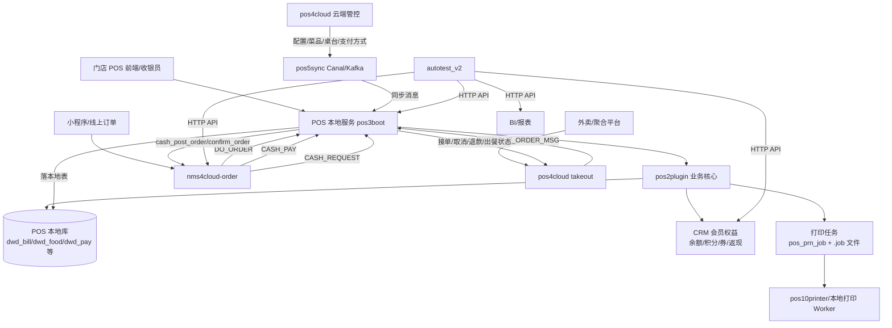

## 5. POS 主要流程清单

### 5.1 登录、门店上下文与权限流程

业务目的：让本地 POS 获得用户、门店、设备、权限和 token 上下文。

流程：

```text
启动 POS
  -> 读取本地/云端配置
  -> POS 登录 /biz/login 或 /merchant/login
  -> 获取 token、mid、sid、devId
  -> 查询本地绑定门店 /sc_store/getLocal
  -> 加载用户权限 /merchant/auth/checkPerm
  -> 进入业务界面
```

关键入口：

| 能力 | 源码入口 | 接口 |
| --- | --- | --- |
| POS 登录 | `BizAuthController` | `/biz/login`、`/merchant/login`、`/biz/loginFromCloud`、`/biz/loginByDevice` |
| 当前用户 | `BizAuthController` | `/biz/currentUser` |
| 退出登录 | `BizAuthController` | `/biz/logout` |
| 权限校验 | `PermAuthController` | `/api/merchant/auth/checkPerm` |
| 本地门店 | `ScStoreLocalController` | `/api/sc_store/getLocal` |

测试方式：

| 测试目标 | autotest_v2 现状 | 建议 |
| --- | --- | --- |
| POS token 获取 | 已有 `pos-token-login.ts` | 作为所有真实 E2E 的前置健康检查 |
| 本地门店可访问 | 已有 `pos.store.getLocal` | 放入 `ai:check` 必检 |
| 权限差异 | 未形成场景 | 新增不同账号/角色的只读和写交易权限测试 |

### 5.2 基础资料与配置同步流程

业务目的：总部/云端配置的菜品、桌台、支付方式、打印机、原因类型、折扣、权限等基础资料同步到门店本地。

流程：

```text
云端配置变更
  -> pos5sync Canal 采集表变更
  -> Kafka topic: nms4cloud-pos5sync
  -> pos4cloud KafkaListenerForSync
  -> Netty 推送到门店
  -> pos3boot /sync/syncByCanalEvent
  -> IncrementalSyncDataService 按 tbl_name 找本地实体
  -> 插入/更新/删除本地表
  -> POS 前端查询本地接口生效
```

关键入口：

| 能力 | 源码入口 | 接口/消息 |
| --- | --- | --- |
| 全量同步 | `SyncDataController` | `/sync/all` |
| 增量同步 | `SyncDataController` | `/sync/incrementalSyncData` |
| Canal 事件同步 | `SyncDataController` | `/sync/syncByCanalEvent` |
| 同步进度 | `SyncDataController` | `/sync/progress` |
| 云端同步监听 | `KafkaListenerForSync` | Kafka topic `nms4cloud-pos5sync` |

典型本地查询入口：

| 数据 | 本地接口 |
| --- | --- |
| 菜品 | `/api/merchant/pt_dish/listAll` |
| 桌台 | `/api/merchant/pt_tbl/listAll` |
| 支付方式 | `/api/merchant/biz_pay_way/list` 或 `/api/pos4cloud/merchant/biz_pay_way/list` |
| 打印机 | `/api/merchant/pos_prn_printer/listAll` |
| 设备 | `/api/merchant/pos_dev/listAll` |

测试方式：

| 测试目标 | autotest_v2 现状 | 建议 |
| --- | --- | --- |
| 菜品/桌台/支付方式可读 | 已有 `pos.dish.list`、`pos.table.list`、`pos.payWay.listCloud` | 作为交易前置检查 |
| 配置变更后门店可见 | 未形成闭环场景 | 新增“云端改配置 -> 触发同步 -> 本地查询生效” |
| Canal tbl_name 映射正确 | 未覆盖 | 按 `17-POS门店与云端表同步对应关系.md` 建表驱动用例 |

### 5.3 桌台堂食主流程

业务目的：门店现场开台、点菜、送单、结账、清台。

流程：

```text
查询桌台/菜品
  -> 检查桌台是否已开台
  -> 创建账单
  -> 可选绑定会员
  -> 添加菜品并送单
  -> 查询账单详情
  -> 加载优惠/券/会员权益
  -> 结账
  -> 生成支付明细
  -> 触发会员权益、积分、返券、返现
  -> 触发打印
  -> 清台/关单
  -> 上传或等待云端同步
```

关键入口：

| 阶段 | 源码入口 | 接口 |
| --- | --- | --- |
| 查询桌台是否开台 | `DwdBillOpsForBizController` | `/api/merchant/dwd_bill_ops/checkOpenTbl` |
| 查询桌台未结账单 | `DwdBillOpsForBizController` | `/api/merchant/dwd_bill_ops/getBillsByTbl` |
| 创建账单 | `DwdBillForBizController` | `/api/merchant/dwd_bill/create` |
| 批量开单 | `DwdBillForBizController` | `/api/merchant/dwd_bill/create/batch` |
| 宴会/多台开单 | `DwdBillForBizController` | `/api/merchant/dwd_bill/create/banquet` |
| 送单 | `DwdBillForBizController` | `/api/merchant/dwd_bill/toOrder` |
| 批量送单 | `DwdBillForBizController` | `/api/merchant/dwd_bill/toOrder/batch` |
| 账单详情 | `DwdBillOpsForBizController` | `/api/merchant/dwd_bill_ops/billOpsDetail` |
| 绑定会员 | `DwdBillOpsForBizController` | `/api/merchant/dwd_bill_ops/enterMember` |
| 结账 | `DwdBillOpsForBizController` | `/api/merchant/dwd_bill_ops/checkOut` |
| 轮询关闭 | `DwdBillOpsForBizController` | `/api/merchant/dwd_bill_ops/pollingClose` |

关键数据：

| 对象 | 说明 |
| --- | --- |
| `DwdBill` | 本地账单主表 |
| `DwdFood` | 本地菜品明细 |
| `DwdPay` | 本地支付明细 |
| `DwdCoupon` | 本地券/平台券核销记录 |
| `pos_prn_job` | 打印任务 |

现有自动化覆盖：

| 场景 | autotest_v2 场景 |
| --- | --- |
| 会员堂食消费结账 | `member-consume-benefits` |
| 多会员消费 | `member-consume-multi-member` |
| 并发消费 | `member-consume-concurrency` |
| 桌台单品券核销结账 | `member-table-coupon-checkout*` |
| 消费权益规则矩阵 | `member-consume-benefit-matrix` |

缺口：

- 宴会/多台开单 `create/banquet`
- 批量开单、批量送单
- 桌台合并、转台、并台、搭台
- 人数、服务费、备注、营销员修改
- 催菜、起菜、叫起、整单赠送、整单折扣

### 5.4 菜品操作流程

业务目的：在账单生命周期内处理菜品级修改、赠送、折扣、退菜、转菜等操作。

流程：

```text
账单已有菜品
  -> 菜品改数量/重量/价格
  -> 菜品赠送/取消赠送
  -> 菜品折扣/取消折扣
  -> 菜品做法/口味/座位修改
  -> 催菜/起菜/叫起
  -> 菜品转移/换菜/删除
  -> 退菜/退款
  -> 重新计算账单金额
  -> 触发厨房/传菜/顾客联打印
```

关键入口：

| 操作 | 源码入口 | 接口 |
| --- | --- | --- |
| 退菜 | `DwdFoodOpsForBizController` | `/api/merchant/dwd_food_ops/refund` |
| 催菜 | `DwdFoodOpsForBizController` | `/api/merchant/dwd_food_ops/urge` |
| 起菜 | `DwdFoodOpsForBizController` | `/api/merchant/dwd_food_ops/up` |
| 叫起 | `DwdFoodOpsForBizController` | `/api/merchant/dwd_food_ops/wake` |
| 改价 | `DwdFoodOpsForBizController` | `/api/merchant/dwd_food_ops/modifyPrice` |
| 改数量/重量 | `DwdFoodOpsForBizController` | `/api/merchant/dwd_food_ops/modifyVolume` |
| 赠送/取消赠送 | `DwdFoodOpsForBizController` | `/gift`、`/cancelGift` |
| 折扣/取消折扣 | `DwdFoodOpsForBizController` | `/discount`、`/discountCancel` |
| 转菜/换菜/删除 | `DwdFoodOpsForBizController` | `/transfer`、`/replace`、`/rmv` |

测试方式：

| 测试目标 | autotest_v2 现状 | 建议 |
| --- | --- | --- |
| 退菜/退款影响权益 | 部分通过 `member-consume-benefit-reversal` | 扩展菜品级退款、部分退款 |
| 改价/赠送/折扣后结账 | 未覆盖 | 新增账单金额断言和报表断言 |
| 催菜/起菜/叫起 | 未覆盖 | 用接口状态断言 + 打印任务断言 |

### 5.5 结账、支付、退款、反结账流程

业务目的：完成账单支付收口，并保证会员余额、积分、券、返现、报表和打印一致。

主流程：

```text
账单详情计算
  -> 选择支付方式
  -> 可选会员卡扣款
  -> 可选积分抵现
  -> 可选券核销
  -> 普通支付/扫码支付/现金支付
  -> checkOut
  -> 写 DwdPay
  -> 账单状态关闭
  -> CRM 权益入账/扣减
  -> 打印结账单
  -> 报表可查
```

异常/反向流程：

```text
已结账账单
  -> 反结账 revokeSettle / revoke
  -> 整单退款 refundByOrder
  -> 按菜退款 refundByFoods
  -> 支付退款 refundPay/refundPayList
  -> 撤销会员扣款/积分/券/返现
  -> 重算剩余权益
  -> 更新账单/退款单/支付明细
  -> 报表延迟后可查
```

关键入口：

| 操作 | 源码入口 | 接口 |
| --- | --- | --- |
| 结账 | `DwdBillOpsForBizController` | `/api/merchant/dwd_bill_ops/checkOut` |
| 查询支付状态 | `DwdBillOpsForBizController` | `/api/merchant/dwd_bill_ops/queryOrderPay` |
| 支付通知 | `DwdBillOpsForBizController` | `/api/merchant/dwd_bill_ops/notify` |
| 修改支付 | `DwdBillOpsForBizController` | `/api/merchant/dwd_bill_ops/changePay` |
| 整单退款 | `DwdBillOpsForBizController` | `/api/merchant/dwd_bill_ops/refundByOrder` |
| 按菜退款 | `DwdBillOpsForBizController` | `/api/merchant/dwd_bill_ops/refundByFoods` |
| 支付退款 | `DwdBillOpsForBizController` | `/refundPay`、`/refundPayList`、`/refundNewPays` |
| 反结账 | `DwdBillOpsForBizController` | `/api/merchant/dwd_bill_ops/revokeSettle` |
| 撤销/取消 | `DwdBillOpsForBizController` | `/revoke`、`/cancel`、`/batchRevoke` |
| 结算/重打结算 | `DwdBillOpsForBizController` | `/settle`、`/reprintSettle` |

现有自动化覆盖：

| 场景 | 覆盖 |
| --- | --- |
| 标准会员消费结账 | `member-consume-benefits` |
| 并发结账 | `member-consume-concurrency` |
| 反结账/权益撤销 | `member-consume-benefit-reversal` |
| 整单退款权益撤销 | `member-consume-benefit-reversal` 中部分覆盖 |
| 会员报表核对 | `member-report-audit` |

缺口：

- 按菜退款和部分退款
- 多支付方式混合支付
- 支付通知重复/超时/失败
- 修改支付后的报表口径
- 结算/反结算小票与状态一致性

### 5.6 会员、储值、积分、券、返现流程

业务目的：POS 本地交易与 CRM 权益账本保持一致。

会员储值流程：

```text
查询会员
  -> 查询可用储值方案
  -> 选择支付方式
  -> cardCharge
  -> CRM 生成储值任务
  -> 会员余额/赠送金额/赠送积分/赠券入账
  -> POS 查询处理任务
  -> 报表核对
```

会员消费流程：

```text
创建账单
  -> 绑定会员
  -> 点菜/送单
  -> checkOut
  -> CRM 扣会员余额
  -> POS 结账后补消费积分/消费赠券/消费返现
  -> 报表核对
```

撤销流程：

```text
已结账/已充值
  -> 反结账/退款/撤销充值
  -> 调 CRM 撤销扣款、撤销赠分、撤销赠券、撤销返现
  -> 本地轮次和远端任务状态一致
```

关键入口：

| 能力 | 源码入口 | 接口 |
| --- | --- | --- |
| 查询会员 | `MemberForBizController` | `/api/merchant/member_ops/get`、`/list` |
| 会员开卡 | `MemberForBizController` | `/api/merchant/member_ops/cardNew` |
| 会员储值 | `MemberDepositPlanForBizController` | `/api/merchant/member_deposit_plan_ops/cardCharge` |
| 老会员储值 | `MemberForBizController` | `/api/merchant/member_ops/cardCharge` |
| 储值撤销 | `MemberDepositPlanForBizController` | `/revokeCharge` |
| 会员锁定/解锁/退款 | `MemberForBizController` | `/lock`、`/unlock`、`/refund` |
| 调整余额/积分 | `MemberForBizController` | `/adjustBalance`、`/adjustPoints` |
| 会员消费撤销 | `MemberForBizController` | `/revokeReverse` |
| CRM 调用 | `Nms4CloudCrmService` | `cardConsumeSign`、`grantConsumePointsSign`、`revokeConsumeSign` 等 |

现有自动化覆盖：

| 场景 | autotest_v2 场景 |
| --- | --- |
| 储值方案充值 | `member-deposit-plan` |
| 储值并发 | `member-deposit-concurrency` |
| 储值边界矩阵 | `member-deposit-boundary-matrix` |
| 消费返券/返现/积分 | `member-consume-benefits` |
| 消费权益规则矩阵 | `member-consume-benefit-matrix` |
| 撤销/退款 | `member-consume-benefit-reversal` |
| 报表审计 | `member-report-audit` |

### 5.7 优惠券、实物券、平台券核销流程

业务目的：在 POS 结账前后完成券的加载、预核销、正式核销、撤销和报表核对。

流程：

```text
会员/订单上下文
  -> loadCoupons 查询可用券
  -> addCoupons 加入账单
  -> 账单重新计算
  -> checkOut 正式结账
  -> CRM/平台券核销
  -> 写 DwdCoupon
  -> 退款/反结账时撤销核销
```

关键入口：

| 操作 | 源码入口 | 接口 |
| --- | --- | --- |
| 加载可用券 | `DwdBillOpsForBizController` | `/api/merchant/dwd_bill_ops/loadCoupons` |
| 加券 | `DwdBillOpsForBizController` | `/api/merchant/dwd_bill_ops/addCoupons` |
| 移除券 | `DwdBillOpsForBizController` | `/api/merchant/dwd_bill_ops/rmvCoupons` |
| 查询账单券 | `DwdBillOpsForBizController` | `/api/merchant/dwd_bill_ops/getCoupons` |
| 快餐核券结账 | `DwdSnackOpsForBizController` | `/api/merchant/snack_ops/checkOut` |
| 平台券凭证沉淀 | `CloudPlatformCouponService` | DO_ORDER 接单后落本地券记录 |

现有自动化覆盖：

| 场景 | 覆盖 |
| --- | --- |
| 会员优惠券核销 | `member-coupon-writeoff` |
| 桌台单品券核销 | `member-table-coupon-checkout*` |
| 小程序实物券预付/后付 | `mini-order-product-coupon-*` |
| 混合平台券下单不结账 | `mini-order-mixed-product-coupon-send-only` |

缺口：

- POS 本地平台券撤销核销
- 多券组合、券叠加规则、券与手工折扣互斥
- 部分退款后的券重算

### 5.8 快餐/取餐流程

业务目的：支持快餐模式的选菜、取餐、叫号、出餐、结账。

流程：

```text
按设备获取当前快餐单
  -> 添加菜品
  -> 修改/删除/备注
  -> 保存/取单
  -> 制作/打包/叫号/取餐
  -> 快餐结账
  -> 可选核券/会员支付
  -> 打印/语音播报/取餐屏更新
```

关键入口：

| 操作 | 源码入口 | 接口 |
| --- | --- | --- |
| 按设备取单 | `DwdSnackOpsForBizController` | `/api/merchant/snack_ops/getByDevId` |
| 加菜 | `DwdSnackOpsForBizController` | `/api/merchant/snack_ops/add` |
| 修改/删除 | `DwdSnackOpsForBizController` | `/update`、`/del`、`/rmv` |
| 打包/制作/取餐 | `DwdSnackOpsForBizController` | `/packaged`、`/made`、`/pickUp`、`/pickMade` |
| 叫号 | `DwdSnackOpsForBizController` | `/called` |
| 结账 | `DwdSnackOpsForBizController` | `/api/merchant/snack_ops/checkOut` |
| 挂单/取单 | `DwdSnackOpsForBizController` | `/save`、`/take` |

现有自动化覆盖：

| 场景 | 覆盖 |
| --- | --- |
| 快餐模式核券结账 | `pos.snack.checkout` 能力，`member-coupon-writeoff` 使用 |

缺口：

- 叫号、取餐屏、制作状态
- 挂单/取单
- 快餐设备隔离
- 语音播报和打印联动

### 5.9 小程序/线上订单与 POS 联动流程

业务目的：云端小程序订单与门店 POS 本地账单互通。

主要消息：

| 消息 | 含义 | POS 监听 |
| --- | --- | --- |
| `DO_ORDER` | 云端订单通知门店接单 | `OnlineOrderActiveMQListener` |
| `CASH_PAY` | 云端支付完成后通知门店本地结账 | `OnlineOrderActiveMQListener` |
| `CASH_REQUEST` | 小程序向 POS 拉取当前线下账单 | `OnlineOrderActiveMQListener` |

流程一：小程序下单到门店接单

```text
小程序 crt_order
  -> 云端 order 保存订单
  -> 云端发送 DO_ORDER
  -> POS 监听 DO_ORDER
  -> POS 调云端 do_get_order 反查完整订单
  -> POS 转换 OrderFoodVO -> DwdFoodCreateDTO
  -> POS toOrder 落本地 DwdBill/DwdFood
  -> POS confirm_order 回写云端
```

流程二：小程序拉 POS 线下账单

```text
小程序 getOfflineOrderInfo
  -> 云端发送 CASH_REQUEST
  -> POS 查询本地 DwdBill/DwdFood
  -> POS cash_post_order 回传云端
  -> 云端写 Redis 临时缓存
  -> 小程序展示 POS 当前账单
```

流程三：云端支付后 POS 本地结账

```text
小程序 pay_order/pay_success
  -> 云端完成支付收口
  -> 云端发送 CASH_PAY
  -> POS 匹配本地账单
  -> POS checkOut
  -> 本地写 DwdPay
  -> 补积分/返券/返现
  -> confirm_order 回写
```

现有自动化覆盖：

| 场景 | autotest_v2 场景 |
| --- | --- |
| 小程序购物车冒烟 | `mini-order-cart-smoke` |
| 小程序创建订单 | `mini-order-create` |
| 小程序微信预支付 | `mini-order-wechat-prepay` |
| 小程序会员余额支付 | `mini-order-member-balance-pay` |
| POS 加菜后小程序拉单结账 | `mini-pos-added-dish-checkout` |
| 小程序实物券下单/结账 | `mini-order-product-coupon-*` |

缺口：

- `DO_ORDER` 重试和幂等失败场景
- `CASH_REQUEST` 超时、过期、msgId 不匹配
- openId 过滤导致 POS 线下单拉不到
- 云端支付成功但 POS 本地结账失败的补偿

### 5.10 外卖/聚合平台流程

业务目的：外部外卖平台订单进入 POS，并在 POS 和平台之间同步接单、取消、退款、出餐、配送等状态。

云端到门店：

```text
外卖平台推单
  -> pos4cloud takeout controller
  -> 识别门店 sid
  -> 发送 TAKE_OUT_ORDER_MSG
  -> pos3boot TakeOutOrderActiveMQListener
  -> POS 本地生成/更新外卖账单
  -> 触发打印和状态更新
```

门店本地操作：

```text
POS 外卖订单列表
  -> 接单 confirm
  -> 取消 cancel
  -> 申请退款 applyRefund
  -> 退款 refund/rejectRefund/refundAcceptance
  -> 出餐 meal_complete/back_cook
  -> 配送 delivery
  -> 状态统计 status_count
```

关键入口：

| 能力 | 源码入口 | 接口/消息 |
| --- | --- | --- |
| POS 外卖订单 | `TakeOutController` | `/takeout/order/*` |
| 云端聚合外卖 | `ZhiLongController`、`SaoBeiController` | `/zhi_long/*`、聚合平台接口 |
| 离线外卖 | `ZhiLongOfflineController` | `/takeout/offline/*` |
| 外卖消息监听 | `TakeOutOrderActiveMQListener` | `TAKE_OUT_ORDER_MSG:*` |

现有自动化覆盖：

| 测试目标 | autotest_v2 现状 | 建议 |
| --- | --- | --- |
| 外卖推单/接单/退款 | 未覆盖 | 需要新增 takeout client、平台模拟器、状态断言 |
| 外卖商品映射 | 未覆盖 | 需要模拟 `good_query/good_import` |

### 5.11 打印流程

业务目的：点菜、结账、退菜、交班等业务动作生成打印任务并最终送到物理打印机。

流程：

```text
业务动作
  -> PrintJobGenerator 判断单据类型和张数
  -> PosPrnJobServicePlus 写 pos_prn_job
  -> 写本地 jobs/yyyy-MM-dd/{lid}.job
  -> PrintUtil.initJob
  -> 加载打印模板和数据源
  -> PosPrnQueueServicePlus 分发队列
  -> PrinterWorkerService 选择打印机
  -> pos10printer 或本地 worker 打印
  -> .job 改 .del / 状态回写
```

关键配置入口：

| 配置 | 本地接口 |
| --- | --- |
| 打印机 | `/api/merchant/pos_prn_printer/*` |
| 打印队列 | `/api/merchant/pos_prn_queue/*` |
| 打印样式 | `/api/merchant/pos_prn_style_row/*` |
| 打印开关 | `/api/merchant/print_job_type_switch/*` |
| 打印数据源调试 | `/prn_data_source_marker/*` |

独立打印服务入口：

| 能力 | 源码入口 | 接口 |
| --- | --- | --- |
| 打印 | `PrinterController` | `/print` |
| 打印机状态 | `PrinterController` | `/state` |
| 设备订阅 | `NettyDevController` | `/subscribe` |
| 清理任务 | `MaintenanceController` | `/maintenance/cleanClientJobs` |

测试方式：

| 层级 | 方式 |
| --- | --- |
| 接口层 | 创建账单/结账后检查 `pos_prn_job` 或 `.job` 是否产生 |
| 内容层 | 调 `/prn_data_source_marker/*` 或读取 `.job` 的 rows/dataSource |
| 分发层 | 检查队列、打印机状态、任务是否进入 worker |
| 硬件层 | 需要真实或模拟打印机，不适合仅靠 `autotest_v2` HTTP 场景完成 |

### 5.12 交班、日结、销售报表流程

业务目的：收银员交班、门店日结、报表重算和云端报表一致。

流程：

```text
营业交易完成
  -> 查询未交班记录
  -> 交班 shift
  -> 生成交班打印数据源
  -> 可重打交班单
  -> 日结 do
  -> 报表日期推进
  -> 必要时 undo
  -> 云端报表/BI 核对
```

关键入口：

| 能力 | 源码入口 | 接口 |
| --- | --- | --- |
| 交班 | `DwdShiftForBizController` | `/api/merchant/dwd_shift/shift` |
| 未交班列表 | `DwdShiftForBizController` | `/listUnShift` |
| 交班重打 | `DwdShiftForBizController` | `/reprint` |
| 交班数据源 | `DwdShiftForBizController` | `/dataSource` |
| 当前报表日期 | `DailySettlementController` | `/daily_settlement/current` |
| 日结 | `DailySettlementController` | `/daily_settlement/do` |
| 反日结 | `DailySettlementController` | `/daily_settlement/undo` |
| 报表重置 | `ReportDataController` | `/report/rmv`、`/report/resetPaid` |

现有自动化覆盖：

| 测试目标 | autotest_v2 现状 | 建议 |
| --- | --- | --- |
| 会员相关报表 | 已有 `member-report-audit` | 保留 |
| POS 交班/日结 | 未覆盖 | 新增“测试账单 -> 交班 -> 日结 -> 报表日期”场景 |

### 5.13 估清、菜品上下架、菜品配置流程

业务目的：控制菜品是否可售、是否同步到门店、是否参与点单和打印。

流程：

```text
云端/本地维护菜品
  -> 菜品、单位、做法、口味、规格、套餐、区域配置
  -> 同步到门店
  -> POS 查询菜品
  -> 估清 create/delete
  -> 本地/云端估清消息同步
  -> 点菜时校验可售和库存状态
```

关键入口：

| 能力 | 源码入口 | 接口 |
| --- | --- | --- |
| 菜品查询 | `PtDishForBizController` | `/api/merchant/pt_dish/listAll`、`/listByType` |
| 菜品维护 | `PtDishForBizController` | `/create`、`/update`、`/adjust_state`、`/delete` |
| 套餐/做法/口味 | `PtDishForBizController` | `/query_package`、`/listCookAll`、`/listFlavorAll` |
| 估清 | `DwdSoldOutForBizController` | `/api/merchant/dwd_sold_out/create`、`/delete`、`/listAll` |
| 估清消息 | `SoldOutActiveMQListener` | `SOLD_OUT_CHANGE`、`SOLD_OUT_CHANGE_UPLOAD` |

测试方式：

| 测试目标 | autotest_v2 现状 | 建议 |
| --- | --- | --- |
| 可售菜品查询 | 已有 `pos.dish.list` | 作为前置检查 |
| 估清后不可点 | 未覆盖 | 新增估清 -> 点菜失败/不可售断言 |
| 估清同步 | 未覆盖 | 需要消息或云端同步环境 |

### 5.14 设备、称重、钱箱、语音流程

业务目的：本地硬件参与业务操作。

流程：

```text
设备配置/订阅
  -> POS 调硬件接口
  -> 获取状态或执行动作
  -> 业务流程使用硬件结果
  -> 异常时展示错误/降级
```

关键入口：

| 能力 | 源码入口 | 接口 |
| --- | --- | --- |
| POS 设备维护 | `PosDevForBizController` | `/api/merchant/pos_dev/*` |
| 打开钱箱 | `DwdBillOpsForBizController` | `/api/merchant/dwd_bill_ops/openCash` |
| 称重 | `WeightController` | `/scale/getCurrentWeight`、`/scale/reConnect` |
| 称重调试 | `WeightController` | `/scale/debug/*` |
| 语音播报 | `VoiceController` | `/voice` |
| 设备订阅 | `NettyDevController` | `/subscribe` |

测试方式：

| 层级 | 方式 |
| --- | --- |
| 接口契约 | 可用 HTTP 模拟请求验证响应结构 |
| 业务集成 | 需要测试设备或模拟服务 |
| 硬件验收 | 必须人工或专用硬件自动化 |

### 5.15 POS 升级、监控与运维流程

业务目的：云端创建升级任务，门店下载、执行、上报状态；本地监控保证服务可用。

流程：

```text
云端创建升级任务
  -> 选择门店/版本
  -> pos4cloud 定时调度任务
  -> 门店收到升级命令
  -> POS 查询最新版本
  -> 下载包
  -> 检查下载完成
  -> 执行升级
  -> 上报升级状态
```

关键入口：

| 能力 | 源码入口 | 接口 |
| --- | --- | --- |
| 创建升级任务 | `PosUpgradeController` | `/platform/pos_upgrade/create` |
| 查询任务/门店版本 | `PosUpgradeController` | `/list`、`/detail`、`/listStores`、`/listStoreVersions` |
| 门店上报 | `PosUpgradeController` | `/report` |
| 门店查询版本 | `UpdateController` | `/update/getLastVersionInfo`、`/getCurrentVersion` |
| 下载/执行 | `UpdateController` | `/handleDownLoad`、`/checkFinish`、`/exePackage`、`/forceExePackage` |
| 指定升级 | `UpdateController` | `/upgradeAppoint`、`/upgradeTask` |
| 定时派发 | `PosUpgradeDispatchTask` | `@Scheduled` |

测试方式：

| 测试目标 | autotest_v2 现状 | 建议 |
| --- | --- | --- |
| 升级任务接口 | 未覆盖 | 可新增云端 API 场景 |
| 下载/安装 | 未覆盖 | 需要专用测试门店和可回滚安装包 |
| 监控重启 | 未覆盖 | 不建议纳入普通 E2E，单独做运维测试 |

### 5.16 云端上传、备份、重算流程

业务目的：POS 本地账单上云，支持后台查单、报表、成本、平台分账和历史修复。

流程：

```text
POS 本地账单完成
  -> 上传账单 put_bill / cash_post_order
  -> 云端保存或缓存账单事实
  -> BI/报表查询
  -> 必要时按日期/门店重算
  -> 必要时备份或删除异常账单
```

关键入口：

| 能力 | 源码入口 | 接口 |
| --- | --- | --- |
| 上传账单 | `UploadBizDataController` | `/shop/bill/put_bill` |
| 删除账单 | `UploadBizDataController` | `/shop/bill/rmv_bill` |
| 范围备份 | `UploadBizDataController` | `/shop/bill/backup_by_range` |
| 账单重算 | `BillRecalcController` | `/billRecalc/recalcAsync`、`/recalcSync` |
| 金额重算 | `BillRecalcController` | `/recalcAmountsAsync`、`/recalcAmountsSync` |
| 定时备份 | `BackupToSaaSScheduledTask` | 定时任务 |

测试方式：

| 测试目标 | autotest_v2 现状 | 建议 |
| --- | --- | --- |
| 会员报表核对 | 已有 `member-report-audit` | 保留并扩展 POS 账单维度 |
| POS 账单上传 | 未直接覆盖 | 新增 `put_bill` 或本地结账后云端可见断言 |
| 重算 | 未覆盖 | 新增只读/小范围测试数据重算场景 |

## 6. autotest_v2 现有能力映射

`autotest_v2` 当前是接口驱动的真实业务自动化测试框架，核心命令：

```powershell
npm run ai:list
npm run ai:doctor
npm run ai:check -- all
npm run ai:plan -- <scenario>
npm run ai:run -- <scenario>
```

### 6.1 已有 POS 能力

现有 `src/clients/pos-client.ts` 和 `src/catalog/member-benefit-capabilities.ts` 已覆盖：

| 能力 | 接口 |
| --- | --- |
| 查询会员 | `/api/merchant/member_ops/get` |
| 查询会员列表 | `/api/merchant/member_ops/list` |
| 查询储值方案 | `/api/merchant/member_deposit_plan_ops/listAvailableDepositPlans` |
| 会员储值 | `/api/merchant/member_deposit_plan_ops/cardCharge` |
| 查询支付方式 | `/api/pos4cloud/merchant/biz_pay_way/list` |
| 查询本地门店 | `/api/sc_store/getLocal` |
| 查询桌台 | `/api/merchant/pt_tbl/listAll` |
| 查询菜品 | `/api/merchant/pt_dish/listAll` |
| 创建账单 | `/api/merchant/dwd_bill/create` |
| 检查开台 | `/api/merchant/dwd_bill_ops/checkOpenTbl` |
| 查询桌台账单 | `/api/merchant/dwd_bill_ops/getBillsByTbl` |
| 绑定会员 | `/api/merchant/dwd_bill_ops/enterMember` |
| 送单 | `/api/merchant/dwd_bill/toOrder` |
| 账单详情 | `/api/merchant/dwd_bill_ops/billOpsDetail` |
| 结账 | `/api/merchant/dwd_bill_ops/checkOut` |
| 反结账 | `/api/merchant/dwd_bill_ops/revokeSettle` |
| 整单退款 | `/api/merchant/dwd_bill_ops/refundByOrder` |
| 加载券 | `/api/merchant/dwd_bill_ops/loadCoupons` |
| 加券 | `/api/merchant/dwd_bill_ops/addCoupons` |
| 快餐结账 | `/api/merchant/snack_ops/checkOut` |

### 6.2 已有小程序/线上能力

| 能力 | 接口 |
| --- | --- |
| 小程序菜品 | `/api/pt/pt_micro/micro_data` |
| 购物车查询 | `/api/sorder/shopping_cart/get` |
| 购物车加菜 | `/api/sorder/shopping_cart/addDish` |
| 创建线上订单 | `/api/sorder/order_bill/crt_order` |
| 拉取 POS 线下单 | `/api/sorder/order_bill/getOfflineOrderInfo` |
| 发起支付 | `/api/sorder/order_bill/pay_order` |
| 查询支付 | `/api/sorder/order_bill/query_pay` |
| 支付成功通知 | `/api/sorder/order_bill/pay_success` |
| 小程序储值预支付 | `/api/scrm/deposit-plan/charge/commit` |

## 7. 流程到自动化测试矩阵

| 流程 | 当前覆盖 | 现有场景 | 建议补充 |
| --- | --- | --- | --- |
| 登录/门店上下文 | 部分覆盖 | token provider、`pos.store.getLocal` | 权限账号矩阵 |
| 基础资料查询 | 已覆盖 | `pos.table.list`、`pos.dish.list` | 配置变更后同步生效 |
| 桌台堂食开单点菜结账 | 已覆盖核心链路 | `member-consume-benefits` | 合台/转台/批量/宴会 |
| 会员储值 | 已覆盖 | `member-deposit-plan` | 撤销储值、多支付方式 |
| 会员消费权益 | 已覆盖 | `member-consume-benefits`、`member-consume-benefit-matrix` | 按菜退款后权益重算 |
| 并发交易 | 已覆盖一部分 | `member-consume-concurrency`、`member-deposit-concurrency` | 同桌并发、重复回调 |
| 券核销 | 已覆盖核心链路 | `member-coupon-writeoff`、`member-table-coupon-checkout*` | 平台券撤销、多券组合 |
| 快餐 | 部分覆盖 | `member-coupon-writeoff` 间接用 `pos.snack.checkout` | 叫号、取餐、挂单 |
| 小程序下单 | 已覆盖 | `mini-order-create` | DO_ORDER 失败/重试 |
| 小程序拉 POS 单 | 已覆盖核心链路 | `mini-pos-added-dish-checkout` | msgId 过期、openId 过滤 |
| 小程序支付 | 部分覆盖 | `mini-order-wechat-prepay`、`mini-order-member-balance-pay` | 支付成功后 POS 本地失败补偿 |
| 外卖 | 未覆盖 | 无 | 平台模拟器 + POS 接单状态 |
| 打印 | 未覆盖 E2E | 无 | job 文件/队列/硬件分层测试 |
| 交班日结 | 未覆盖 | 无 | 交易后交班、日结、反日结 |
| 同步 | 未覆盖闭环 | 无 | 云端改配置 -> 门店可见 |
| 估清 | 未覆盖 | 无 | 估清后不可点、同步恢复 |
| 升级 | 未覆盖 | 无 | 测试门店升级任务 |
| 称重/钱箱/语音 | 未覆盖 | 无 | 硬件模拟或人工验收 |
| 云端上传/重算 | 部分覆盖报表 | `member-report-audit` | put_bill、billRecalc |

## 8. 使用 autotest_v2 测试 POS 的推荐顺序

### 8.1 环境健康检查

目标：证明测试环境、token、门店、基础资料可用。

```powershell
cd D:\mywork\autotest_v2
npm run typecheck
npm test
npm run ai:doctor
npm run ai:check -- all
```

必备配置：

```text
API_BASE_URL=http://127.0.0.1:9180
POS_USERNAME=admin
POS_PASSWORD=...
POS_SID=...
POS_DEV_ID=...
MEMBER_CARD_NO=...
POS_TABLE_LID=...
PAY_WAY_LID=...
REPORT_API_BASE_URL=...
```

### 8.2 只读冒烟

目标：先不写业务数据，确认接口和基础资料可读。

建议场景：

```powershell
npm run ai:plan -- mini-order-cart-smoke
npm run ai:run -- mini-order-cart-smoke
```

同时应检查：

- `pos.store.getLocal`
- `pos.table.list`
- `pos.dish.list`
- `pos.payWay.listCloud`
- `pos.member.get`

### 8.3 核心交易回归

目标：覆盖 POS 最核心的钱、单、会员、券。

```powershell
npm run ai:run -- member-deposit-plan
npm run ai:run -- member-consume-benefits
npm run ai:run -- member-table-coupon-checkout
npm run ai:run -- member-consume-benefit-reversal
npm run ai:run -- member-report-audit
```

验证点：

| 层级 | 断言 |
| --- | --- |
| API 响应 | 返回成功、关键 id 不为空 |
| 账单状态 | 账单已创建、已送单、已结账或已撤销 |
| 会员权益 | 余额、积分、券数量、返现变化符合预期 |
| 报表 | 明细报表延迟后可查 |
| 幂等 | 重复执行不会重复扣款/重复赠券 |

### 8.4 小程序与 POS 联动回归

目标：覆盖线上订单与本地账单互通。

```powershell
npm run ai:run -- mini-order-create
npm run ai:run -- mini-order-member-balance-pay
npm run ai:run -- mini-pos-added-dish-checkout
npm run ai:run -- mini-order-product-coupon-prepay-checkout
```

验证点：

- 小程序创建订单后 POS 能接单。
- POS 后加菜后，小程序重新拉单可见。
- 小程序支付后，POS 本地账单和云端订单状态一致。
- 实物券/平台券凭证能进入后续结账或撤销链路。

### 8.5 并发与边界

目标：验证高风险并发和边界条件。

```powershell
npm run ai:run -- member-consume-concurrency
npm run ai:run -- member-deposit-concurrency
npm run ai:run -- member-deposit-boundary-matrix
npm run ai:run -- member-consume-benefit-matrix
```

重点看：

- 同会员并发扣款是否超扣。
- 同一储值方案并发是否重复赠送。
- 同一规则矩阵是否命中唯一且可解释。
- 报表是否最终一致。

## 9. 新增 POS 流程自动化的落地规范

在 `autotest_v2` 新增一个 POS 流程，建议固定为五层：

```text
capability 接口能力
  -> action 业务动作
  -> scenario 场景定义
  -> e2e spec 真实测试文件
  -> assertion/report audit 结果核对
```

新增流程示例：按菜退款。

```text
1. capability:
   pos.bill.refundByFoods -> /api/merchant/dwd_bill_ops/refundByFoods

2. action:
   pos.bill.partialRefund

3. scenario:
   member-consume-partial-food-refund

4. spec:
   tests/e2e/member-consume-partial-refund.real.spec.ts

5. assertions:
   - 原账单已结账
   - 退款菜品数量/金额正确
   - 会员扣款部分撤销
   - 消费积分/返券/返现按剩余金额重算
   - 报表最终一致
```

## 10. 优先补齐的测试场景

按业务风险排序：

| 优先级 | 场景 | 原因 |
| --- | --- | --- |
| P0 | 按菜退款 + 权益重算 | 直接影响金额、会员、报表 |
| P0 | 混合支付结账 + 反结账 | 容易出现支付明细和权益账不一致 |
| P0 | CASH_REQUEST 超时/openId 过滤 | 小程序拉 POS 单现场高频问题 |
| P1 | 平台券核销后 POS 撤销 | 平台凭证链路长，失败难补 |
| P1 | 合台/转台/并台后结账 | 容易出现桌台与账单归属错乱 |
| P1 | 快餐叫号/取餐/结账 | 快餐是独立模式，当前覆盖弱 |
| P1 | 配置同步后门店可见 | 基础资料不同步会阻断交易 |
| P2 | 打印任务生成和分发 | 影响门店现场履约，但硬件依赖强 |
| P2 | 交班/日结/反日结 | 影响财务口径 |
| P2 | 外卖接单/取消/退款 | 需要平台模拟环境 |
| P3 | 升级/监控/硬件 | 更适合专项测试 |

## 11. 流程测试验收模板

每条 POS 流程用例应至少包含：

```text
流程名称：
业务目标：
入口接口：
参与角色：
前置数据：
操作步骤：
预期账单状态：
预期支付明细：
预期会员权益：
预期券/积分/返现：
预期打印任务：
预期云端同步：
预期报表结果：
异常分支：
幂等/并发要求：
自动化命令：
人工验证项：
回滚方式：
```

## 12. 核心流程细化：可执行测试视角

上一节的流程清单回答了“POS 有哪些流程”，但用于测试还不够。测试平台真正需要的是：**每条流程的触发条件、操作顺序、关键状态、落库对象、外部调用、异常分支和自动化断言**。

下面按核心业务闭环细化。每个流程都可以直接拆成 `autotest_v2` 的 capability、action、scenario 和 E2E 断言。

### 12.1 桌台堂食：开台 -> 点菜 -> 送单 -> 结账 -> 清台

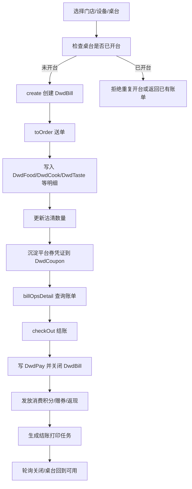

**前置条件**

| 条件 | 说明 |
| --- | --- |
| token | POS 登录成功，具备开台、点菜、结账权限 |
| 门店上下文 | `mid/sid/devId` 有效，`/api/sc_store/getLocal` 可返回本地门店 |
| 桌台 | `/api/merchant/pt_tbl/listAll` 能选到一个未结账桌台 |
| 菜品 | `/api/merchant/pt_dish/listAll` 能选到可售菜品，必要时避开沽清菜 |
| 支付方式 | `/api/pos4cloud/merchant/biz_pay_way/list` 能选到测试支付方式 |
| 营业日 | `BizBusinessHoursServicePlus.getCurrent` 能返回当前营业时段和 `reportDate` |

**主路径步骤**

| 步骤 | 接口/方法 | 关键动作 | 必断言 |
| --- | --- | --- | --- |
| 1 | `checkOpenTbl` | 按 `tableLid/tableId` 检查是否已有未关闭账单 | 空桌台返回未开台；已有账单时不能盲目新建 |
| 2 | `DwdBillServicePlus.create` | 校验 `mid/sid/orderSubType`、桌台、桌型、区域、营业时段；生成 `lid/saasOrderKey/reportDate` | 返回 `lid`、`saasOrderKey`、`orderStatus=TO_BE_ORDERED` 或前端指定状态 |
| 3 | `DwdBillServicePlus.toOrder` | 校验账单未关闭、点菜权限、赠送权限、菜品/做法/口味/部位、沽清 | `toOrder` 成功；`billOpsDetail.foods` 出现新增菜 |
| 4 | 明细写入 | 批量插入 `DwdFood/DwdCook/DwdTaste/DwdArea/DwdFlavor/DwdRequire` | 明细数量、金额、做法、套餐子菜关系正确 |
| 5 | 沽清处理 | `dwdSoldOutServicePlus.updateSoldOut` | 可售数量减少；失败时看配置是否允许忽略 |
| 6 | 平台券沉淀 | `CloudPlatformCouponService.saveCloudPlatformCoupons` | 小程序平台券菜品带凭证时，本地 `DwdCoupon` 可用于后续撤销 |
| 7 | `billOpsDetail` | 重新计算账单 | `foodAmount/paidAmount/discountAmount/serviceChargeAmount` 与菜品合计一致 |
| 8 | `DwdBillOpsServiceImpl.checkOut` | 检查支付方式，处理现金/移动支付/会员/积分/券 | `DwdPay` 金额合计等于应收，支付类型正确 |
| 9 | `OrderServiceUtil.checkOut` | 关闭账单，设置 `checkoutBy/checkoutTime/checkType` | `DwdBill.orderStatus=CLOSED`，桌台不再返回未结账单 |
| 10 | CRM 权益 | `grantConsumePointsForCheckout`、`grantConsumeCouponForCheckout`、`grantConsumeCashForCheckout` | 消费积分、消费赠券、返现按规则只发一次 |
| 11 | 打印 | `OrderServiceUtil.printCheckOut` | 有 `pos_prn_job` 或 `.job` 文件；无打印配置时记录为环境缺口 |

**状态/数据变化**

| 对象 | 开台前 | 开台后 | 送单后 | 结账后 |
| --- | --- | --- | --- | --- |
| `DwdBill` | 不存在 | `OrderOpType=N`，未关闭，带桌台/营业日 | 金额可计算 | `OrderStatus=CLOSED`，写结账人、设备、支付状态 |
| `DwdFood` | 不存在 | 不一定有 | 新增菜品、套餐、做法、赠送/折扣字段 | 写已付数量/金额，后续退款依赖它 |
| `DwdPay` | 不存在 | 不存在 | 券可能预生成 | 结账支付明细落库 |
| `DwdCoupon` | 可为空 | 可为空 | 平台券凭证可能沉淀 | 核销券绑定账单 |
| 打印任务 | 无 | 可无 | 送单可触发厨房/顾客联 | 结账单、钱箱等任务 |

**异常分支**

| 异常 | 代码行为 | 测试断言 |
| --- | --- | --- |
| 重复开台 | `create` 在锁内查同桌未关闭账单，抛“不能重复开台” | 第二次开同桌失败，且只存在一张未关闭 `DwdBill` |
| 菜品不存在/做法不存在 | `toOrder` 中 `checkFood/getDishMap/getTasteMap` 抛业务异常 | 不写入部分明细，账单金额不变化 |
| 沽清不足 | `updateSoldOut` 或限购校验失败 | 返回失败，`DwdFood` 不增加 |
| 无点菜/赠送权限 | `PermissionUtil.checkOrderPerm/checkGiftPerm` 失败 | 返回权限错误，不写菜品 |
| 移动支付已申请 | `checkOut` 发现 `payQrCode` 未撤销 | 结账失败，提示先撤销移动支付 |
| 微信和支付宝同时选择 | `checkOut` 直接拒绝 | 断言错误信息和无支付落库 |

**自动化断言**

| 层级 | 断言 |
| --- | --- |
| API | 每一步返回成功；失败分支返回指定错误 |
| 账单 | `lid/saasOrderKey/reportDate/tableLid/orderStatus` 符合状态机 |
| 金额 | 菜品金额、优惠、服务费、支付合计、实收虚收一致 |
| 明细 | `DwdFood` 数量、套餐子菜、做法、赠送、折扣、券字段可追溯 |
| 会员 | 会员余额、积分、赠券、返现只在结账成功后变化 |
| 打印 | 送单/结账对应打印任务生成；硬件不可用时至少断言任务层 |
| 幂等 | 重复 `toOrder/checkOut` 不产生重复菜、重复扣款、重复赠送 |

**autotest_v2 覆盖/缺口**

| 项 | 现状 |
| --- | --- |
| 已覆盖 | `member-consume-benefits`、`member-consume-concurrency`、`member-consume-multi-member` 已覆盖开台、送单、结账、会员权益 |
| 部分覆盖 | `member-table-coupon-checkout*` 覆盖单品券与桌台结账 |
| 缺口 | 宴会多台、批量开单/送单、桌台合并/转台/搭台、送单打印任务断言、重复支付回调 |

### 12.2 菜品级操作：改价/改量/赠送/折扣/催菜/退菜/转菜

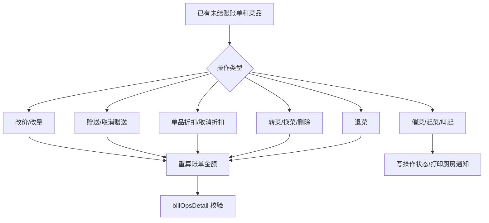

**前置条件**

| 条件 | 说明 |
| --- | --- |
| 账单 | 已开台且未结账 |
| 菜品 | 至少一条 `DwdFood`，最好包含普通菜、套餐、可称重菜、券兑换菜各一类 |
| 权限 | 操作员具备改价、赠送、折扣、退菜等权限 |
| 原因配置 | 退菜/赠送/折扣需要对应原因类型时，应准备可用原因 |

**主路径步骤和断言**

| 操作 | 接口 | 状态变化 | 自动化断言 |
| --- | --- | --- | --- |
| 改价 | `/api/merchant/dwd_food_ops/modifyPrice` | `DwdFood.foodProPrice/isModPrice/paidAmount` 变化 | 账单应收按新价重算 |
| 改量/改单位 | `/modifyVolume` | `foodNumber/paidNumber/unitRate` 变化，沽清回补或扣减 | 数量不能小于已退/已付约束 |
| 赠送 | `/gift` | `send=true/sendAmount/sendBy/sendFor` | 应收减少，赠送金额计入报表口径 |
| 取消赠送 | `/cancelGift` | 赠送字段回滚 | 应收恢复 |
| 单品折扣 | `/discount` | `discountRate/discountAmount` | 单品折扣和整单折扣叠加规则正确 |
| 取消折扣 | `/discountCancel` | 折扣字段回滚 | 应收恢复 |
| 催菜/起菜/叫起 | `/urge`、`/up`、`/wake` | 菜品出品状态或操作记录变化 | 状态可查，必要时有厨房打印任务 |
| 转菜/换菜 | `/transfer`、`/replace` | 菜品归属账单或菜品编码变化 | 原账单/目标账单金额同步变化 |
| 删除菜 | `/rmv` | 未送或可删菜品移除 | `billOpsDetail.foods` 不再出现，金额回滚 |
| 退菜 | `/refund` | `cancelNumber/cancelAmount/refund*` 变化 | 退菜数量、退菜原因、退菜打印正确 |

**异常分支**

| 异常 | 测试断言 |
| --- | --- |
| 子菜单独改量 | 返回“子菜不能单独更改数量或者单位”类似错误 |
| 券兑换菜直接改量/删除 | 返回“请先取消优惠券”类错误 |
| 已结账账单改菜 | 拒绝或要求走退款流程 |
| 退菜金额超过可退 | 返回错误，原菜品 `refundAmount/refundNumber` 不变化 |
| 沽清回补失败 | 根据配置判断是否阻断；必须记录失败分支 |

**autotest_v2 覆盖/缺口**

| 项 | 现状 |
| --- | --- |
| 已覆盖 | 退款/撤销在 `member-consume-benefit-reversal` 有部分覆盖 |
| 缺口 | 改价、改量、赠送、折扣、催菜、起菜、转菜、换菜、删除菜的独立场景 |
| 建议新增 | `member-consume-food-adjustment`、`member-consume-food-refund-partial` |

### 12.3 结账、反结账、整单退款、按菜退款

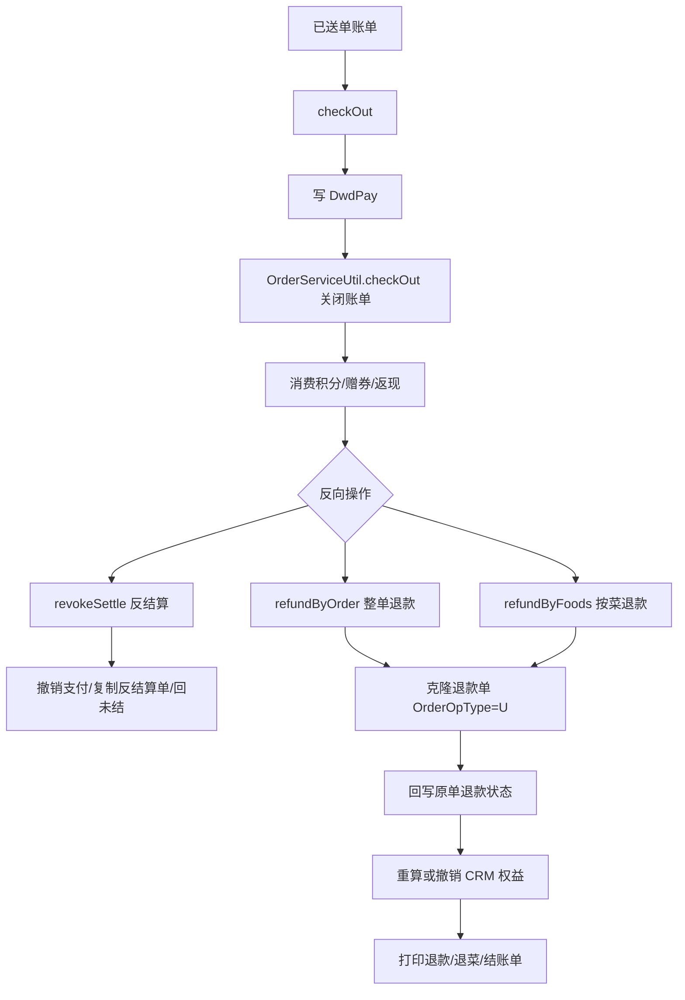

**结账主路径**

| 步骤 | 代码边界 | 必测点 |
| --- | --- | --- |
| 支付方式检查 | `DwdBillOpsServiceImpl.checkOut` | 微信和支付宝不能同时选；二维码未撤销不能普通结账 |
| 快速结账 | `checkType=K` 时由 `payWayType/payAmount` 自动构造 `DwdPayCreateDTO` | 快速结账金额等于应收或指定金额 |
| 移动支付 | `dealMobile` | 二维码场景返回 `mobile=true/close=false` 时账单不应关闭 |
| 挂账 | `OrderServiceUtil.dealCredit` | 挂账支付不误算现金实收 |
| 会员卡 | `dealCardWithBalance` | HYK 扣款成功后写会员余额前后快照 |
| 积分抵现 | `dealCardPoint` | PR 金额和积分变化一致 |
| 关闭账单 | `OrderServiceUtil.checkOut` | `DwdBill=CLOSED`，`DwdFood/DwdPay` 状态同步 |
| 消费后权益 | 三个 `grant*ForCheckout` | 结账失败不发权益，结账成功后只发一次 |
| 打印 | `printCheckOut` | 结账单任务生成 |

**反结账/退款路径**

| 流程 | 入口 | 关键状态 | 自动化断言 |
| --- | --- | --- | --- |
| 反结算 | `/revokeSettle` | 取消未支付二维码，账单回 `UNSETTLED`，删除支付明细 | 原账单可重新结账，未产生退款单 |
| 整单退款 | `/refundByOrder` | 原单 `refundState=A/refundAmount=paidAmount`，新增退款单 `OrderOpType=U` | 原单不可重复全退，退款单金额为负向事实 |
| 按菜退款 | `/refundByFoods` | 原单 `refundState=P/A`，选中菜品 `refundNumber/refundAmount` 增加，新增退款单 | 本次退款金额等于所选支付退款金额，不能超出菜品剩余可退 |
| 支付退款 | `/refundPay`、`/refundPayList` | `DwdApplyPay.refundState/refundedAmount` 更新 | 第三方退款状态与本地一致 |
| 权益重算 | `recalculateConsumePointsAfterRefund` 等 | 退款后撤销或重算积分/赠券/返现 | 部分退款后权益按剩余付款方式重算，返现按当前策略撤销 |

**异常分支**

| 异常 | 测试断言 |
| --- | --- |
| 日结后禁止退款 | 开启配置后，历史 `reportDate` 账单退款失败 |
| 退款金额大于订单剩余可退 | 返回明确错误，原单退款字段不变化 |
| 退款金额大于所选菜品剩余可退 | 返回明确错误，不插入退款单 |
| 付券退款金额不合法 | 返回每张券金额校验错误 |
| 重复整单退款 | 第二次返回“订单已全部退款” |

**autotest_v2 覆盖/缺口**

| 项 | 现状 |
| --- | --- |
| 已覆盖 | `member-consume-benefit-reversal` 覆盖反结账/整单退款权益撤销 |
| 已有能力 | `pos-client.ts` 已有 `revokeSettle`、`refundByOrder`、`refundByFoods` |
| 缺口 | 按菜退款独立场景、混合支付退款、支付退款接口、日结后禁止退款 |

### 12.4 会员储值方案充值与撤销

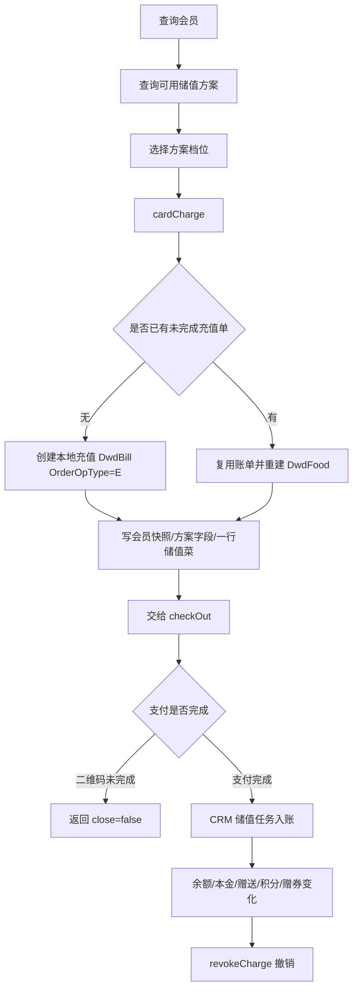

**前置条件**

| 条件 | 说明 |
| --- | --- |
| 会员 | `member_ops/get` 或 `list` 能查到测试会员 |
| 方案 | `listAvailableDepositPlans` 返回至少一个可用方案和档位 |
| 支付方式 | 测试用支付方式可用；二维码场景需支付回调或手工查询 |
| 设备 | `devId` 有效，避免同设备未完成充值单干扰 |

**主路径步骤**

| 步骤 | 接口/方法 | 必断言 |
| --- | --- | --- |
| 1 | `memberCheck` | 会员存在，余额/本金/赠送/积分快照记录 |
| 2 | `MemberDepositPlanForBizController.cardCharge` | `planLid/tierIndex` 必填 |
| 3 | 创建/复用充值单 | 新单 `OrderOpType=E`；复用单清掉旧 `DwdFood` 后重建 |
| 4 | 写方案字段 | `depositPlanLid/depositTierIndex` 写入 `DwdBill` |
| 5 | 写储值菜 | 只生成一行 `DwdFood`，金额为本金+赠送，实付为本金 |
| 6 | `checkOut` | 非二维码支付直接关闭；二维码支付返回 `close=false` 等待收口 |
| 7 | CRM 入账 | `cardCharge`/储值方案工具执行后，会员余额、赠送、积分、券变化 |
| 8 | `revokeCharge` | 先撤本地充值单/退款，再调用 CRM 撤销余额 |

**异常分支**

| 异常 | 测试断言 |
| --- | --- |
| 无方案或档位无效 | `cardCharge` 返回方案/档位不能为空或不可用 |
| 付款码支付无 `lid` | 返回“充值订单lid不能为空” |
| 同设备同方案同档位重复提交 | 复用未完成单，不产生多张未完成充值单 |
| 撤销非储值方案单 | 不允许误撤老普通充值单 |
| CRM 撤销失败 | POS 本地和 CRM 状态必须可追踪，不应静默成功 |

**autotest_v2 覆盖/缺口**

| 项 | 现状 |
| --- | --- |
| 已覆盖 | `member-deposit-plan`、`member-deposit-concurrency`、`member-deposit-boundary-matrix`、`member-deposit-manual-amount` |
| 缺口 | 储值方案撤销、二维码未完成单复用、CRM 入账失败补偿 |

### 12.5 会员消费权益：余额、积分、消费赠券、消费返现

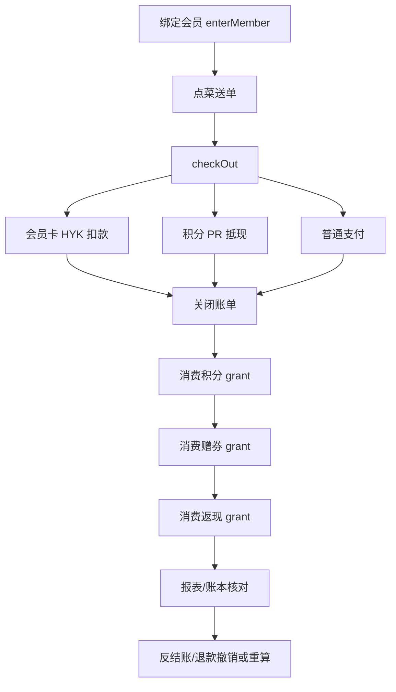

**主路径断言**

| 权益 | 触发点 | 断言 |
| --- | --- | --- |
| 会员余额扣款 | `dealCardWithBalance` | HYK 支付金额扣减，`cardBalanceBefore/After` 正确 |
| 积分抵现 | `dealCardPoint` | `points` 与抵现金额匹配，余额不受积分抵现影响 |
| 消费积分 | `grantConsumePointsForCheckout` | 只在账单关闭后发放；失败账单不发 |
| 消费赠券 | `grantConsumeCouponForCheckout` | 命中规则后发券，券归属会员并可被后续 POS 核销 |
| 消费返现 | `grantConsumeCashForCheckout` | 本地登记轮次，CRM 幂等接口执行余额增加 |
| 退款重算 | `recalculate*AfterRefund` | 按剩余付款方式重算积分/赠券；返现按当前策略撤销 |
| 反结账撤销 | `revoke*ForBill` 类路径 | 原扣款/赠送权益可撤销，重复撤销幂等 |

**异常分支**

| 异常 | 测试断言 |
| --- | --- |
| 会员余额不足 | 结账失败，不关闭账单，不发消费权益 |
| 积分不足 | 结账失败或积分支付被拒，不产生 PR 支付 |
| 消费规则不命中 | 不发券/返现/积分，但账单仍可正常结账 |
| 重复结账/重复回调 | 不重复扣余额，不重复发券/返现 |
| 部分退款 | 不按原始全额继续保留全部权益 |

**autotest_v2 覆盖/缺口**

| 项 | 现状 |
| --- | --- |
| 已覆盖 | `member-consume-benefits`、`member-consume-benefit-matrix`、`member-consume-benefit-reversal` |
| 缺口 | 积分抵现组合、会员余额不足失败分支、部分退款后返现策略专项 |

### 12.6 优惠券、实物券、平台券核销与撤销

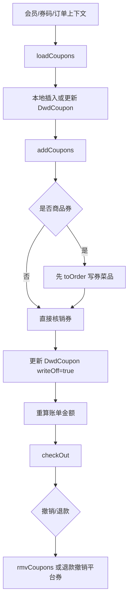

**主路径步骤**

| 步骤 | 接口/方法 | 必断言 |
| --- | --- | --- |
| 1 | `loadCoupons` | 从 CRM/平台拉券，插入或更新本地 `DwdCoupon` |
| 2 | `addCoupons` | 检查券是否已被其他账单使用 |
| 3 | 商品券下单 | 商品券/套餐券先写 `DwdFood`，避免外部券已核销但本地下单失败 |
| 4 | 外部核销 | `CouponHandler.writeOff` 返回成功后更新 `writeOff=true/writeOffId/writeOffAt` |
| 5 | 重算账单 | 账单优惠、券支付、商品券菜品金额正确 |
| 6 | 结账 | 券核销账单正常关闭 |
| 7 | 撤销 | `rmvCoupons` 调 `cancelOff`，并清理券菜品关联字段 |

**异常分支**

| 异常 | 测试断言 |
| --- | --- |
| 券未加载到系统 | `addCoupons` 返回“优惠券未加载到系统中” |
| 券已被其他账单核销 | 返回已被账单使用，不能重复核销 |
| 商品券未选择菜品 | 套餐券/商品券返回需要选择下单商品 |
| 外部核销失败 | 本地不应标记 `writeOff=true` |
| 取消核销失败 | 返回错误，不清理本地券状态 |
| 券菜品直接删除/改量 | 返回请先取消优惠券 |

**autotest_v2 覆盖/缺口**

| 项 | 现状 |
| --- | --- |
| 已覆盖 | `member-coupon-writeoff`、`member-table-coupon-checkout*`、`mini-order-product-coupon-*` |
| 缺口 | `rmvCoupons` 独立撤销、平台券退款撤销、多券叠加、券与手工折扣互斥 |

### 12.7 小程序 DO_ORDER：线上订单落 POS 本地单

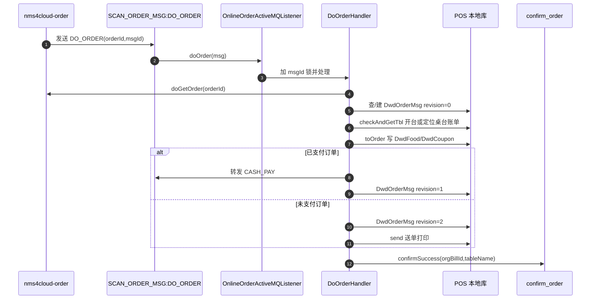

**主路径步骤**

| 步骤 | 代码边界 | 必断言 |
| --- | --- | --- |
| 1 | `OnlineOrderActiveMQListener.doOrder` | 消息进入 `SCAN_ORDER_MSG:DO_ORDER`，`msgId` 加锁 |
| 2 | `DwdOrderMsg` 幂等记录 | 首次写 `revision=0`；重复消息按 revision 处理 |
| 3 | `doGetOrder` | 能从云端查到订单、菜品、支付、口味 |
| 4 | `checkAndGetTbl` | 能定位桌台，必要时创建本地 `DwdBill` |
| 5 | `toCreateDTO` | 线上 `OrderFoodVO` 转成本地 `DwdFoodCreateDTO`，平台券字段透传 |
| 6 | `toOrderEx` | 写本地菜品，并更新云端订单字段 |
| 7 | paid 分支 | 已支付订单写 `revision=1` 并投递 `CASH_PAY` |
| 8 | unpaid 分支 | 未支付订单写 `revision=2` 并送单 |
| 9 | confirm | 成功回写云端本地账单号和桌名 |

**异常分支**

| 异常 | 代码行为 | 测试断言 |
| --- | --- | --- |
| 云端订单查询失败 | 返回 `false`，监听器 10 秒后最多重试 3 次 | 不写成功 confirm |
| 已处理消息 `revision=2` | 直接 `confirmSuccess` | 不重复写菜品 |
| `revision=1` | 说明接单成功但结账失败，重新投递 `CASH_PAY` | 不重复接单，只重试结账 |
| 桌台不可用/菜品异常 | 写 `DwdBillError` 并 `confirmError` | 云端能看到失败原因 |
| 平台券字段缺失 | 本地平台券撤销链路不可用 | 用例必须断言 `DwdCoupon` 凭证字段 |

**autotest_v2 覆盖/缺口**

| 项 | 现状 |
| --- | --- |
| 已覆盖 | `mini-order-create`、`mini-order-product-coupon-send-only` 等覆盖线上下单主链路 |
| 缺口 | 直接模拟 DO_ORDER 重试、`revision=1` 失败恢复、`DwdBillError` 失败断言 |

### 12.8 小程序 CASH_REQUEST：小程序拉 POS 线下账单

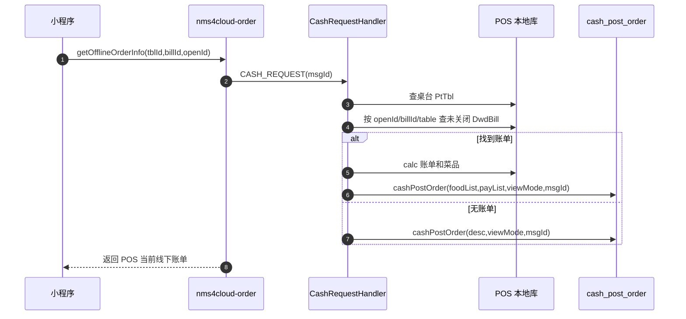

**主路径步骤**

| 步骤 | 代码边界 | 必断言 |
| --- | --- | --- |
| 1 | 云端 `getOfflineOrderInfo` | 生成 `msgId` 并等待 POS 回包 |
| 2 | `CashRequestHandler.handle` | `tblId` 必须能找到 `PtTbl` |
| 3 | 查账单 | 配置 `g_WXMCDDARSCXDDH` 开启时按 `openId` 过滤；否则按桌台或 `billId` 查 |
| 4 | `useCard` | 配置允许时按 `cardId` 录入会员并重算折扣 |
| 5 | `calc` | 读取当前 `DwdBill/DwdFood/DwdPay` |
| 6 | 构造 `CashPostOrderDTO` | `foodList` 来自 POS 当前线下账单，不是小程序购物车 |
| 7 | `cashPostOrder` | 回传云端，云端按 `msgId` 写临时缓存并返回前端 |

**异常分支**

| 异常 | 测试断言 |
| --- | --- |
| 桌台不存在 | 返回 `desc=不存在编号...桌台`，`viewMode=-1` |
| 无账单且必须线下开台 | 返回“请联系服务员开台后才能点餐” |
| 无账单但允许线上开台 | 返回“此桌台无账单”，`viewMode=1` |
| 已预结且配置不允许自助拉单 | 返回“订单已结算，请联系服务员结账” |
| `msgId` 过期 | 云端不应把过期回包当作当前拉单结果 |

**autotest_v2 覆盖/缺口**

| 项 | 现状 |
| --- | --- |
| 已覆盖 | `mini-pos-added-dish-checkout` 证明 POS 后加菜后，小程序重新拉单可见 |
| 缺口 | `openId` 过滤、`mustOfflineOpenTbl`、`msgId` 过期、预结不可拉单 |

### 12.9 小程序 CASH_PAY：线上支付后 POS 收口结账

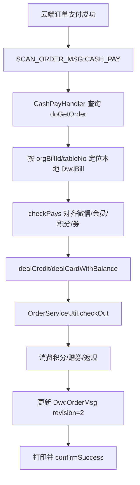

**主路径步骤**

| 步骤 | 代码边界 | 必断言 |
| --- | --- | --- |
| 1 | `CashPayHandler.handle` | 能查到云端订单和支付列表；无支付列表时不结账 |
| 2 | `DwdOrderMsg` | 不存在则插入，存在则复用 |
| 3 | 定位本地账单 | 按 `orgBillId/tableNo` 找未关闭 POS 账单 |
| 4 | `checkPays` | WECHAT -> `WXZF`，CRM -> `HYK`，PR -> `PR`，COUPON -> `FJ` |
| 5 | 会员卡处理 | 如果线上未扣会员卡，POS 补扣；已扣则不重复扣 |
| 6 | 关闭账单 | `OrderServiceUtil.checkOut(..., CheckTypeEnum.N)` |
| 7 | 权益补齐 | CASH_PAY 也会补消费积分、赠券、返现，口径与线下结账一致 |
| 8 | 打印/同步 | 堂食、快餐、先付分支打印不同，但都应可追踪 |
| 9 | confirm | 成功回云端；失败写 `DwdBillError` 并 `confirmError` |

**异常分支**

| 异常 | 测试断言 |
| --- | --- |
| 本地账单不存在或已结账 | `confirmError`，提示订单已结账或找不到 |
| 支付列表为空 | 不关闭 POS 账单 |
| 第三方/云端网络异常 | 返回“门店服务器网络异常，接单失败”，允许消息重试 |
| HYK 已在线上扣款 | POS 不应重复扣会员卡 |
| 重复 CASH_PAY | `DwdOrderMsg revision=2` 后不重复结账和发权益 |

**autotest_v2 覆盖/缺口**

| 项 | 现状 |
| --- | --- |
| 已覆盖 | `mini-order-member-balance-pay`、`mini-order-product-coupon-postpay-*` 覆盖部分线上支付后 POS 收口 |
| 缺口 | 重复 CASH_PAY、线上已扣 HYK 的本地不重复扣、失败写 `DwdBillError` |

### 12.10 快餐：设备开单 -> 加菜 -> 挂单/取单 -> 叫号/取餐 -> 结账

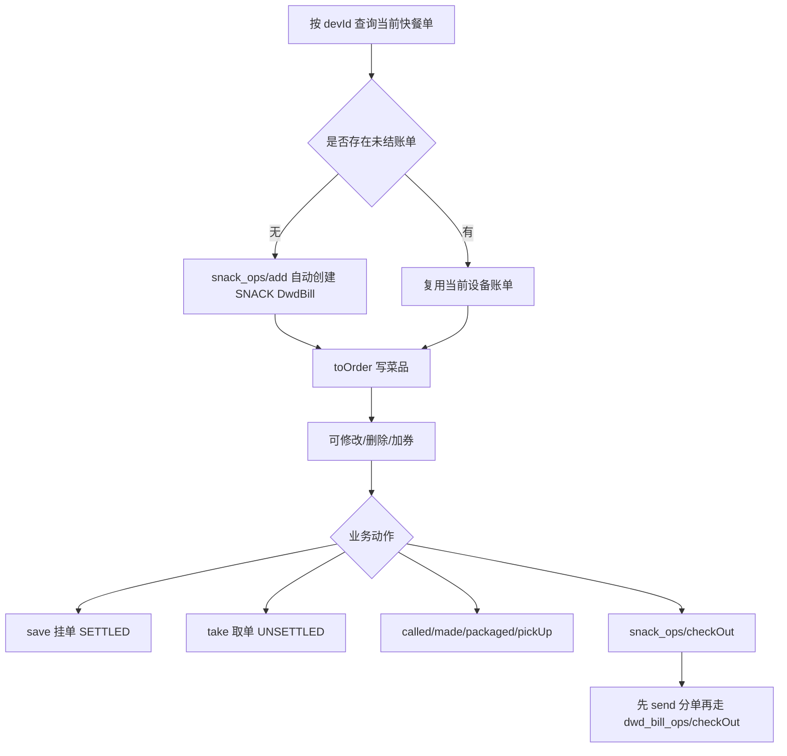

**主路径步骤**

| 步骤 | 接口/方法 | 必断言 |
| --- | --- | --- |
| 1 | `getByDevId` | 同设备当前未结账快餐单可查 |
| 2 | `add` | 无单时自动创建 `OrderType=SNACK`、`OrderStatus=UNSETTLED` |
| 3 | `toOrder` | 写快餐菜品，支持促销规则前后处理 |
| 4 | `update/del/rmv` | 修改或删除菜品，券商品需先取消券 |
| 5 | `save` | 挂单把 `OrderStatus` 置为 `SETTLED` |
| 6 | `take` | 取单把 `OrderStatus` 置回 `UNSETTLED`，绑定当前 `devId` |
| 7 | `called/made/packaged/pickUp` | 叫号/制作/打包/取餐状态和大屏通知 |
| 8 | `checkOutInner` | 先 `send` 分单，再构造 `DwdBillCheckOutDTO` 调普通结账 |

**异常分支**

| 异常 | 测试断言 |
| --- | --- |
| 同设备已有非 E2E 未结账单 | 测试框架不应直接清理，应中止并提示 |
| 券兑换菜直接删除 | 返回先取消优惠券 |
| 挂单后直接结账 | 应先取单或按业务规则处理 |
| 无效设备 | `checkOut` 校验设备失败 |
| 叫号/取餐屏不可用 | API 可成功，通知层作为环境缺口记录 |

**autotest_v2 覆盖/缺口**

| 项 | 现状 |
| --- | --- |
| 已覆盖 | `auto-snack-coupon-checkout.ts`、`auto-snack-member-consume.ts` 及 `member-coupon-writeoff` 间接覆盖快餐核券结账 |
| 缺口 | 挂单/取单、叫号/取餐、大屏通知、制作/打包状态 |

### 12.11 基础资料同步：云端配置 -> 门店本地表

```mermaid
flowchart TD
  A[云端表变更] --> B[pos5sync Canal/Kafka]
  B --> C[pos4cloud KafkaListenerForSync]
  C --> D[/sync/syncByCanalEvent]
  D --> E[SYNC_BY_CANAL_EVENT 队列]
  E --> F[IncrementalSyncDataService.handleEvent]
  F --> G{CLASS_MAP 是否存在 tbl_name}
  G -->|存在| H[映射到本地实体]
  H --> I[按事件插入/更新/删除本地表]
  G -->|不存在| J[忽略或记录无法同步]
  I --> K[/sync/progress 或本地查询接口验证]
```

**主路径步骤**

| 步骤 | 代码边界 | 必断言 |
| --- | --- | --- |
| 1 | 云端配置变更 | 变更菜品/桌台/支付方式/打印队列等一条测试数据 |
| 2 | `tbl_name` 确认 | 使用实际 Canal 事件表名，不按同名表猜 |
| 3 | `SyncDataController.syncByCanalEvent` | 接口只入队，不能把接口成功当作同步完成 |
| 4 | `IncrementalSyncDataService.CLASS_MAP` | `tbl_name` 能映射到门店实体，例如 `sc_tbl -> PtTbl`、`sc_pay_way -> BizPayWay` |
| 5 | 落本地表 | 本地实体表更新 |
| 6 | 业务接口验证 | `pt_tbl/listAll`、`pt_dish/listAll`、`biz_pay_way/list` 等能读到变化 |

**异常分支**

| 异常 | 测试断言 |
| --- | --- |
| `tbl_name` 未注册 | 同步不生效，文档和测试应明确映射缺口 |
| 已有同步任务未完成 | `/sync/incrementalSyncData` 返回“正在同步数据，请稍候” |
| 全量同步并发 | `/sync/all` 通过锁避免重复全量 |
| 进度失败 | `/sync/progress` 返回失败信息，测试不应继续交易 |

**autotest_v2 覆盖/缺口**

| 项 | 现状 |
| --- | --- |
| 已覆盖 | 只读前置查询覆盖菜品/桌台/支付方式是否可读 |
| 缺口 | 云端改配置 -> Canal/Kafka -> 门店落表 -> 本地查询生效的闭环 |
| 建议新增 | `pos-sync-table-mapping-smoke`，按 `17-POS门店与云端表同步对应关系.md` 做表驱动 |

### 12.12 打印任务：业务触发 -> 任务持久化 -> 队列分发 -> Worker 执行

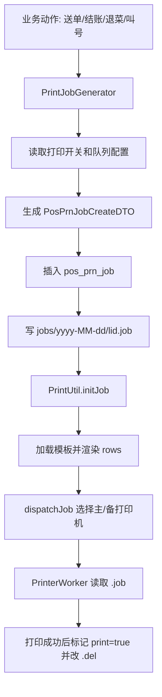

**主路径步骤**

| 步骤 | 代码边界 | 必断言 |
| --- | --- | --- |
| 1 | 业务触发 | 送单触发厨房/顾客联，结账触发结账单，退菜触发退菜单 |
| 2 | `PrintJobGenerator` | 根据 `PrintJobTypeSwitch` 判断是否需要打印、打印几张 |
| 3 | `PosPrnJobServicePlus.create` | 校验 `mid/sid/type/purpose/prnQueueLid`，插入 `pos_prn_job` |
| 4 | `.job` 文件 | `{appDir}/jobs/yyyy-MM-dd/{lid}.job` 存在且 JSON 可解析 |
| 5 | `initJob` | 模板行和数据源渲染为实际 rows |
| 6 | `dispatchJob` | 有健康主打印机优先主队列；主故障用备队列；全故障延迟重试 |
| 7 | Worker | 成功后 `.job` 改 `.del`，`pos_prn_job.print=true`，Redis 计数清理 |

**异常分支**

| 异常 | 测试断言 |
| --- | --- |
| 打印开关为 0 张 | 不生成对应类型任务 |
| 队列不存在/未配置打印机 | 任务存在但分发失败，日志可追踪 |
| 主打印机故障 | 应选择备打印机 |
| 全部故障但未超时 | 延迟重试，不应丢任务 |
| `.job` 文件缺失 | 初始化失败，`pos_prn_job` 与文件不一致 |

**autotest_v2 覆盖/缺口**

| 项 | 现状 |
| --- | --- |
| 已覆盖 | 普通交易会间接触发打印，但没有断言打印任务 |
| 缺口 | 打印任务层断言、队列分发、故障重试、硬件 Worker |
| 建议 | 普通 E2E 先断言 `pos_prn_job/.job`，硬件专项再断言 `.del` 和物理打印 |

### 12.13 交班/日结/反日结

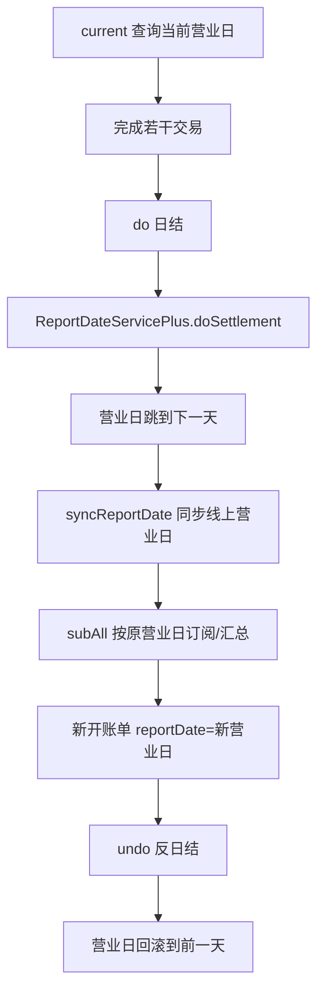

**主路径步骤**

| 步骤 | 接口 | 必断言 |
| --- | --- | --- |
| 1 | `/daily_settlement/current` | 返回当前配置营业日 |
| 2 | 完成测试交易 | 交易账单 `reportDate` 等于当前营业日 |
| 3 | `/daily_settlement/do` | 需要 `daily_settlement:do` 权限；返回下一营业日 |
| 4 | 日结后新开单 | 新账单 `reportDate` 为新营业日 |
| 5 | `/daily_settlement/undo` | 需要 `daily_settlement:undo` 权限；返回前一营业日 |
| 6 | 退款约束 | 若启用日结后禁止退款，旧营业日账单退款失败 |

**异常分支**

| 异常 | 测试断言 |
| --- | --- |
| 无权限日结 | 返回权限错误，营业日不变 |
| 日结过程中同步线上失败 | 本地营业日变化但线上同步异常需可追踪 |
| 反日结后交易 | 新账单营业日必须跟回滚后的日期一致 |
| 日结后退款 | 配置开启时 `refundByOrder/refundByFoods` 拒绝 |

**autotest_v2 覆盖/缺口**

| 项 | 现状 |
| --- | --- |
| 已覆盖 | 无独立日结场景 |
| 缺口 | `current/do/undo` 客户端能力、营业日影响交易和退款的场景 |

### 12.14 云端上传、报表、重算

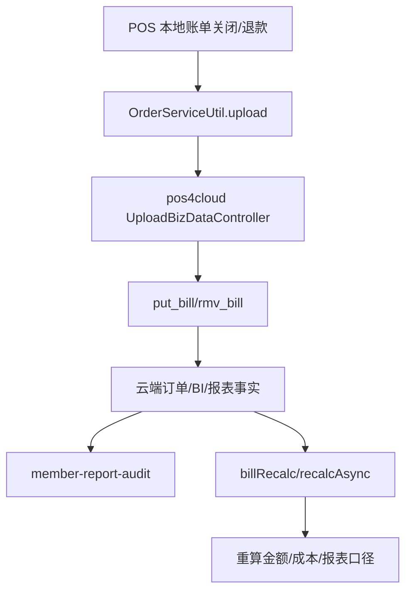

**主路径步骤**

| 步骤 | 入口 | 必断言 |
| --- | --- | --- |
| 1 | 本地结账/退款 | 本地 `DwdBill` 已关闭或产生退款单 |
| 2 | `OrderServiceUtil.upload` | 本地账单进入上传链路 |
| 3 | `/shop/bill/put_bill` | 云端保存账单事实 |
| 4 | 报表查询 | 会员充值、会员消费、券核销、订单报表最终可查 |
| 5 | 重算 | `/billRecalc/recalcAsync` 或同步重算只对测试范围执行 |

**异常分支**

| 异常 | 测试断言 |
| --- | --- |
| 上传失败 | 本地应保留可重试状态，不影响本地账单事实 |
| 删除账单 | `/rmv_bill` 后报表不再统计或按删除口径统计 |
| 重算范围过大 | 自动化禁止对生产大范围执行 |
| 报表延迟 | 测试应轮询最终一致，不把短暂不可见当失败 |

**autotest_v2 覆盖/缺口**

| 项 | 现状 |
| --- | --- |
| 已覆盖 | `member-report-audit` 覆盖会员报表审计 |
| 缺口 | POS 账单上传接口、删除账单、重算专项 |

### 12.15 外卖接单、状态变更、退款

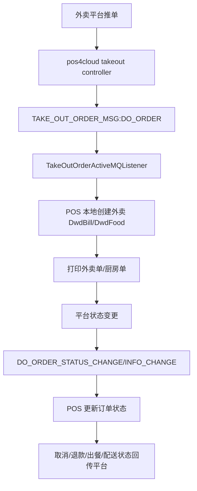

**主路径步骤**

| 步骤 | 入口 | 必断言 |
| --- | --- | --- |
| 1 | 平台推单 | `ZhiLongController/SaoBeiController` 解析平台消息 |
| 2 | 发送门店消息 | `TAKE_OUT_ORDER_MSG:DO_ORDER` |
| 3 | POS 接单 | 创建外卖类型本地账单，菜品 `foodNo=-1` 或映射到本地菜 |
| 4 | 打印 | 外卖小票和厨房联生成 |
| 5 | 状态变更 | 取消、退款、出餐、配送状态同步 |

**异常分支**

| 异常 | 测试断言 |
| --- | --- |
| 菜品无法映射 | 外卖菜以外部菜品兜底或接单失败，错误可追踪 |
| 平台重复推单 | 不重复创建本地账单 |
| 平台取消已接单 | 本地账单状态和退款状态正确 |
| POS 离线 | pos4cloud 侧应保留失败或重推能力 |

**autotest_v2 覆盖/缺口**

| 项 | 现状 |
| --- | --- |
| 已覆盖 | 无 |
| 缺口 | 平台模拟器、外卖消息注入、状态回传断言 |

### 12.16 流程细化后的测试分层

| 测试层 | 适用流程 | 断言重点 |
| --- | --- | --- |
| 接口 E2E | 登录、开台、点菜、结账、会员、券、退款、快餐 | API 成功、状态流转、金额、权益、幂等 |
| 消息 E2E | DO_ORDER、CASH_REQUEST、CASH_PAY、外卖、同步 | 消息幂等、重试、回包、失败记录 |
| 数据审计 | 报表、会员账本、券账本、上传 | 最终一致、账实一致、重复执行不重复入账 |
| 任务层测试 | 打印、同步、升级 | 任务记录、队列状态、文件状态、进度 |
| 硬件/专项 | 打印机、钱箱、称重、语音、升级安装 | 设备状态、物理效果、失败恢复 |

`autotest_v2` 适合作为前三层的主测试平台；打印和硬件流程也能先测任务层，但最终仍需要专项环境验证物理设备。

## 13. 结论

`autotest_v2` 可以作为 `nms4pos` 的核心业务流程自动化测试平台，但覆盖边界要清楚：

1. 已经适合测试：会员、储值、桌台点菜、结账、券、反结账、退款、小程序 POS 联动、报表核对。
2. 需要补能力后测试：外卖、同步闭环、交班日结、估清、合台转台、按菜退款、混合支付。
3. 不应只靠普通接口 E2E 测试：打印硬件、称重、钱箱、语音、安装升级、网络离线恢复。

推荐的建设顺序是：

```text
先固化核心交易回归
  -> 再补退款/反结账/混合支付
  -> 再补小程序 POS 联动异常
  -> 再补同步、打印、日结
  -> 最后补硬件和升级专项
```

这样测试平台会从“能跑几个接口”升级为“能证明 POS 核心业务闭环正确”的回归体系。
