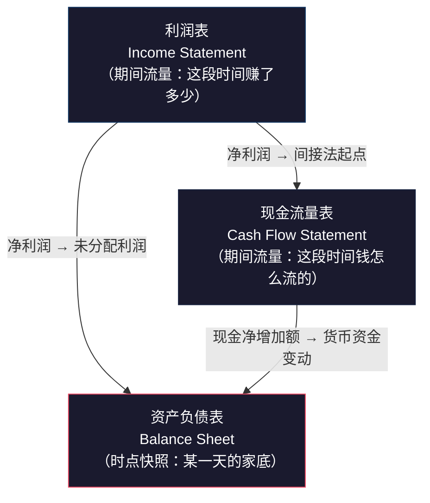
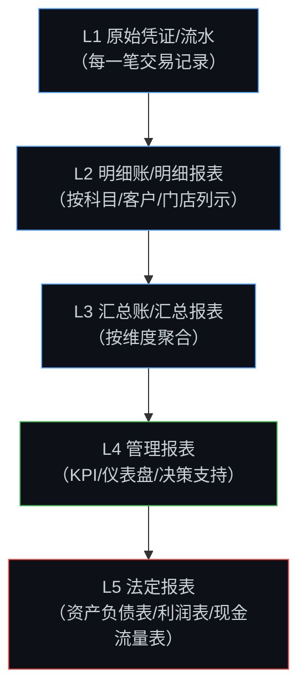
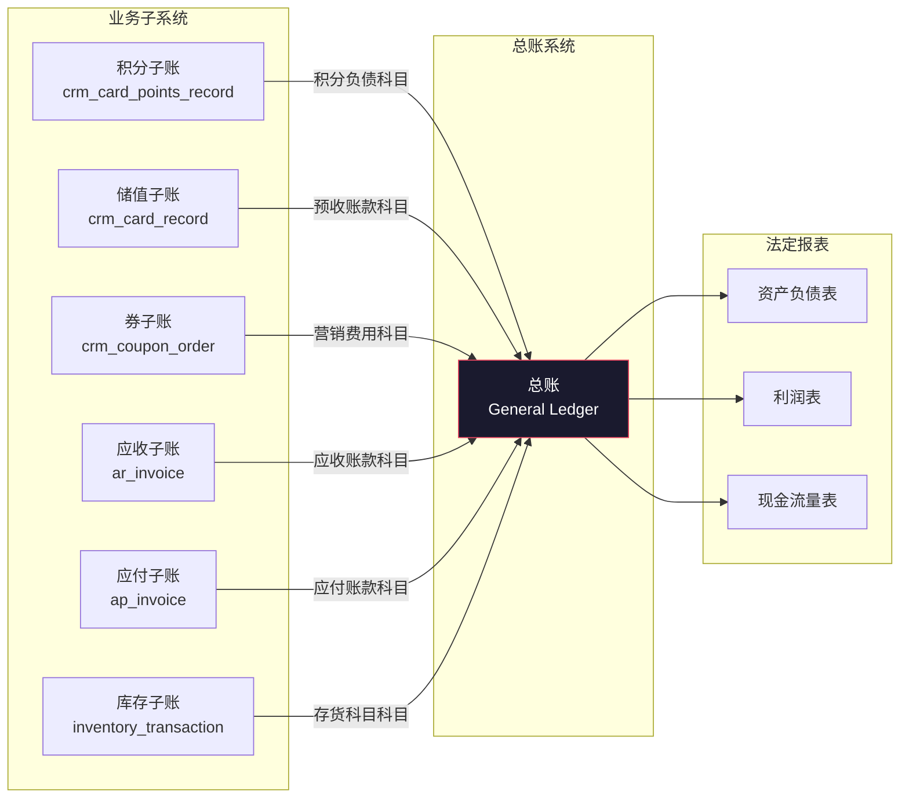
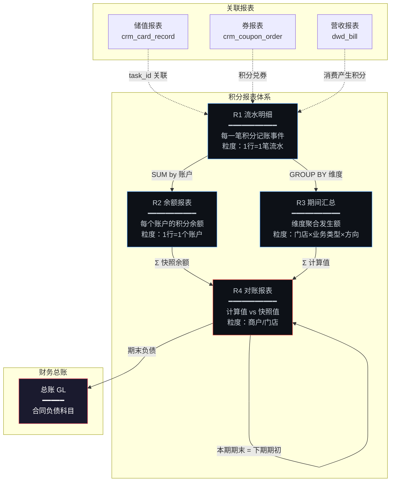

# 企业报表体系中各类报表之间的关系

> 报表不是孤立存在的。企业中每一张报表都是整个报表体系"网络"中的一个节点。
> 理解报表间的关系，才能设计出**可验证、可追溯、自洽闭环**的报表系统。

---

## 一、三大财务报表的"铁三角"关系

企业的法定财务报表有三张核心报表，它们之间存在**数学级别的强勾稽关系**：



### 核心勾稽关系

| 关系 | 公式 | 含义 |
|------|------|------|
| 资产负债表内部 | **资产 = 负债 + 所有者权益** | 恒等式，任何时点必须成立 |
| 利润表 → 资产负债表 | 期末未分配利润 = 期初未分配利润 + 本期净利润 - 本期分配 | 利润表的"结果"流入资产负债表 |
| 现金流量表 → 资产负债表 | 期末现金 = 期初现金 + 经营活动净现金流 + 投资活动净现金流 + 筹资活动净现金流 | 现金流的"结果"等于资产负债表中货币资金的变动 |
| 利润表 → 现金流量表 | 经营活动净现金流 = 净利润 + 非现金调整项 + 营运资金变动 | 间接法编制现金流量表的起点 |

### 积分业务在三大报表中的位置

```
资产负债表（负债侧）：
  合同负债 / 预计负债
    └── 积分负债（期末未兑换积分的公允价值）  ← 你的 R4 对账的"期末快照余额"

利润表（收入侧）：
  主营业务收入
    ├── 商品/服务收入（扣除积分分摊后）
    └── 积分兑换释放收入（积分被使用或过期时确认）  ← 你的 R3 "本期减少"中的兑换/过期部分

现金流量表：
  积分不涉及现金流动（非现金项目）
  但积分兑换实物商品时，采购成本体现在经营活动现金流出
```

> [!IMPORTANT]
> 你的积分 R4 对账报表的 `期末快照余额`，最终会汇入企业资产负债表的"合同负债"科目。如果 R4 对不平，企业的资产负债表也会不平。这就是为什么 R4 对账如此重要——它不只是积分系统内部的事，而是整个企业财务报表准确性的一环。

---

## 二、报表的层级金字塔



### 你的四张积分报表在金字塔中的位置

| 层级 | 你的报表 | 对应层级 | 向上汇入 |
|------|---------|---------|---------|
| L1 | **R1 流水明细报表** | 明细账 | → R2、R3 |
| L2 | **R2 余额报表** | 明细账（账户维度） | → R4 |
| L3 | **R3 期间汇总报表** | 汇总账 | → R4、管理报表 |
| L3.5 | **R4 对账报表** | 内控报表 | → 总账（合同负债科目） |

**关键原则：下层数据可以推导出上层，上层数据可以下钻到下层**

```
R1（流水明细）
  ↓ 按账户聚合
R2（余额 = R1 的期初 + SUM(增加) - SUM(减少)）
  ↓ 按门店/科目/业务类型聚合  
R3（汇总 = R1 按维度 GROUP BY）
  ↓ 与快照对比
R4（对账 = R3 的计算期末 vs R2 的快照余额）
```

---

## 三、业务子系统报表与财务总账的关系

企业中存在多个业务子系统，每个子系统有自己的"子账"，最终汇入财务"总账"：



### 子账与总账的勾稽规则

```
规则：子账余额之和 = 总账对应科目余额

积分子账举例：
  Σ 所有会员的积分余额（从 crm_card.points 汇总）
  = 总账"合同负债-积分"科目余额
  
  如果不等 → 说明有积分变动没有同步到总账（凭证缺失）
```

### 各子账之间的交叉关系

| 关系 | 触发场景 | 涉及子账 | 勾稽要求 |
|------|---------|---------|---------|
| 消费产生积分 | 会员消费 | 储值子账 ↔ 积分子账 | 同一 `task_id` 下两个子账都有记录 |
| 积分兑换商品 | 积分商城 | 积分子账 ↔ 库存子账 | 积分减少 = 商品出库 |
| 积分抵扣消费 | 积分+现金混合支付 | 积分子账 ↔ 储值/收银子账 | 积分抵扣额 + 现金支付 = 订单总额 |
| 券核销积分 | 用积分兑换优惠券 | 积分子账 ↔ 券子账 | 积分减少，券发放 |
| 退款退积分 | 订单退款 | 储值子账 ↔ 积分子账 | 退款发生时积分是否同步冲回 |

> [!WARNING]
> 你的文档中提到"退款时储值和积分**分别处理**，储值退款不自动冲销积分"——这在业务上是合理的，但在报表层面必须能**追溯到同一笔原始交易**，否则财务无法核实退款的完整性。`task_id` 是关键的关联纽带。

---

## 四、跨报表验证规则体系

### 4.1 同一报表内部的自洽性验证

| 报表 | 验证规则 | 公式 |
|------|---------|------|
| R1 流水明细 | 行级恒等式 | `balance_before + amount = balance_after` |
| R2 余额报表 | 期间恒等式 | `opening_balance + earned - used = computed_closing` |
| R3 期间汇总 | 合计校验 | `Σ(各门店期初) + Σ(各门店增加) - Σ(各门店减少) = Σ(各门店期末)` |
| R4 对账报表 | 差异校验 | `computed_closing ≈ snapshot_balance (容差内)` |

### 4.2 报表之间的交叉验证

```
验证1：R1 → R2
  R2 的"本期获得积分" = R1 中该账户、该期间、amount > 0 的 SUM(amount)
  R2 的"本期消耗积分" = R1 中该账户、该期间、amount < 0 的 SUM(ABS(amount))
  → 如果不等，说明 R2 的聚合逻辑有 BUG

验证2：R1 → R3
  R3 的"本期增加积分"(某门店) = R1 中该门店、该期间、amount > 0 的 SUM(amount)
  R3 的"发生笔数"(某门店) = R1 中该门店、该期间的 COUNT(*)
  → 如果不等，说明 R3 的 GROUP BY 或 WHERE 条件有差异

验证3：R2 → R4
  R4 的"期末快照余额" = Σ R2 中所有账户的 current_points（快照时点）
  → 如果不等，说明快照生成时遗漏了部分账户

验证4：R3 → R4
  R4 的"本期增加积分" = R3 所有维度的 SUM(earned_points)
  R4 的"本期减少积分" = R3 所有维度的 SUM(used_points)
  → R3 是 R4 的明细展开，汇总后必须一致

验证5：R4 本期 → R4 下期
  本期 R4 的"计算期末余额" = 下期 R4 的"期初积分余额"
  → 如果不等，说明两个期间之间有数据遗漏或重复
```

**验证 SQL 示例**（R1 → R3 交叉验证）：

```sql
-- 用 R1 明细重算 R3 汇总，检查差异
WITH r1_recompute AS (
    SELECT
        sid,
        SUM(CASE WHEN amount > 0 THEN amount ELSE 0 END) AS earned_from_r1,
        SUM(CASE WHEN amount < 0 THEN ABS(amount) ELSE 0 END) AS used_from_r1,
        COUNT(*) AS count_from_r1
    FROM crm_card_points_record
    WHERE mid = :mid
      AND if_deal_success = 1
      AND yingyeriqi BETWEEN :startDate AND :endDate
      AND amount IS NOT NULL AND amount <> 0
    GROUP BY sid
)
SELECT
    r3.sid,
    r3.earned_points AS r3_earned,
    r1.earned_from_r1,
    r3.earned_points - r1.earned_from_r1 AS earned_diff,
    r3.record_count AS r3_count,
    r1.count_from_r1,
    r3.record_count - r1.count_from_r1 AS count_diff
FROM r3_report_result r3
FULL OUTER JOIN r1_recompute r1 ON r3.sid = r1.sid
WHERE r3.earned_points <> r1.earned_from_r1
   OR r3.record_count <> r1.count_from_r1
```

### 4.3 与外部系统的对账关系

```
积分系统 ↔ 总账系统：
  Σ crm_card.points（全部会员） = GL.合同负债-积分 科目余额

积分系统 ↔ 收银系统：
  积分消费抵扣总额（积分子账） = 积分支付方式总额（收银子账）

积分系统 ↔ 第三方：
  第三方积分发放总额 = is_third_party=1 的 SUM(amount > 0)
```

---

## 五、报表之间的关系全景图



### 关系总结表

| 关系类型 | 具体关系 | 验证方式 |
|---------|---------|---------|
| **聚合关系** | R1 → R2（按账户聚合） | R2 的发生额 = R1 明细之和 |
| **聚合关系** | R1 → R3（按维度聚合） | R3 的汇总 = R1 明细之和 |
| **校验关系** | R2 + R3 → R4（交叉验证） | R4 计算值 = R3 汇总；R4 快照 = R2 余额之和 |
| **承继关系** | R4(T) → R4(T+1) | 本期期末 = 下期期初 |
| **下钻关系** | R3 → R1（点击穿透） | 汇总行可展开为明细行 |
| **下钻关系** | R4 差异 → R1（差异追溯） | 差异金额可追溯到具体流水 |
| **关联关系** | R1 ↔ 储值报表（task_id） | 同一笔消费的储值和积分流水 |
| **汇入关系** | R4 → 总账（科目余额） | 积分期末负债 → 合同负债科目 |

---

## 六、时间维度上的报表关系（期间接续）

```
          1月              2月              3月
     ┌──────────┐    ┌──────────┐    ┌──────────┐
R4:  │期初 → 期末│───→│期初 → 期末│───→│期初 → 期末│
     │  100  120 │    │  120  135 │    │  135  150 │
     └──────────┘    └──────────┘    └──────────┘
          ↑                ↑                ↑
     1月R3汇总        2月R3汇总        3月R3汇总
     增加30 减少10    增加25 减少10    增加20 减少5

规则：
  2月期初(120) = 1月期末(120) ← 必须严格相等
  2月期末(135) = 2月期初(120) + 2月增加(25) - 2月减少(10) ← 恒等式
  年度：1月期初(100) + 全年增加(75) - 全年减少(25) = 3月期末(150) ← 年度校验
```

> [!CAUTION]
> **断链检测**：如果发现某月的期初 ≠ 上月的期末，说明存在**关账后的数据篡改**或**ETL 任务异常**。这是最严重的数据完整性问题之一，必须设置自动化告警。

```sql
-- 期间接续断链检测 SQL
WITH monthly_recon AS (
    SELECT
        recon_period,
        opening_balance,
        computed_closing,
        LAG(computed_closing) OVER (ORDER BY recon_period) AS prev_closing
    FROM rpt_points_recon
    WHERE mid = :mid AND scope_type = 'MERCHANT'
)
SELECT
    recon_period,
    opening_balance,
    prev_closing,
    opening_balance - prev_closing AS chain_break_amount
FROM monthly_recon
WHERE prev_closing IS NOT NULL
  AND ABS(opening_balance - prev_closing) > 1  -- 容差
ORDER BY recon_period
```

---

## 七、设计原则总结

1. **上卷可聚合**：明细报表 SUM/GROUP BY 后，必须等于汇总报表对应值
2. **下钻可追溯**：汇总报表的任何数字，点击后必须能看到原始明细
3. **期间可接续**：本期期末 = 下期期初，不能有断链
4. **跨表可验证**：不同报表从不同路径计算同一指标，结果必须一致
5. **外部可对账**：内部报表汇总后，必须能与外部系统（总账/第三方）对上
6. **任何差异可解释**：差异 ≠ 0 时，必须能定位到具体的流水记录

> [!NOTE]
> 这六条原则可以作为报表系统的**验收标准清单**。每新增一张报表，都应该检查它与现有报表体系的关系是否满足以上六条。
