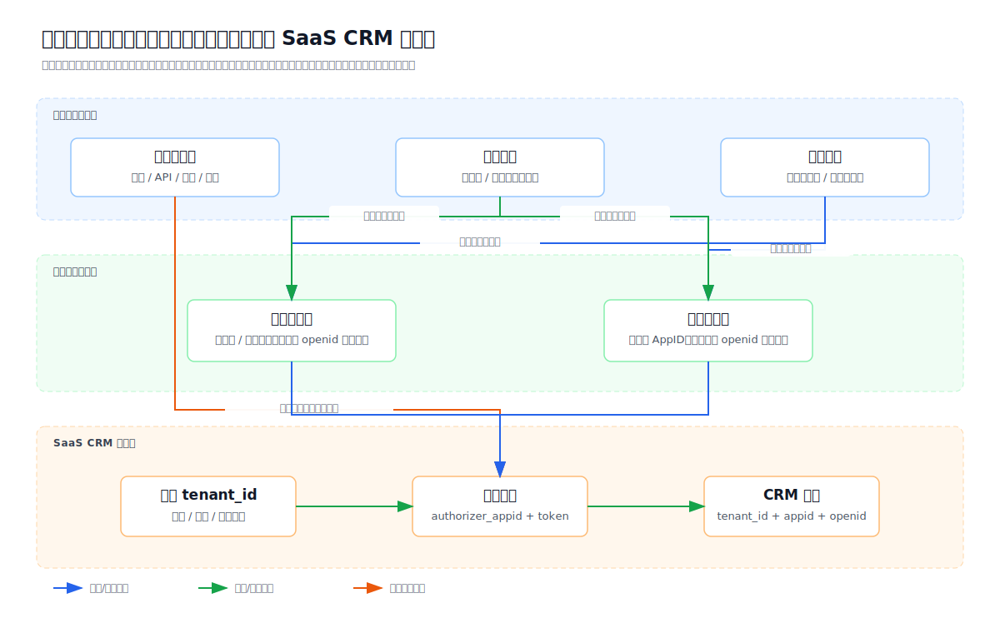
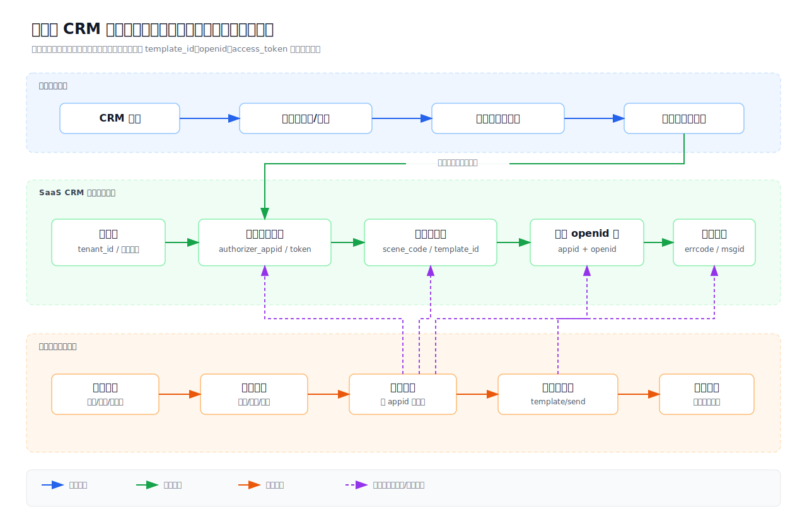

# 微信开放平台第三方平台与 CRM 模板消息开发指南

> 适用对象：多租户 SaaS CRM、会员系统、商户后台、公众号/小程序接入开发人员。  
> 目标：说明微信开发者平台、公众平台、开放平台、公众号、小程序之间的关系，并指导开发人员基于微信开放平台第三方平台，为不同租户、不同公众号的会员发送公众号模板消息。

## 0.0 英文术语速查

微信开放平台、公众号、小程序的接口文档里会频繁出现 `component`、`authorizer`、`open`、`union` 这些英文。开发前先理解这些词，可以避免把“服务商平台”“客户公众号/小程序”“客户开放平台用户身份”混在一起。

| 英文 | 中文含义 | 属于谁 | 用途 |
|---|---|---|---|
| `component_appid` | 第三方平台 AppID | SaaS 服务商的第三方平台 | 标识你的 SaaS 第三方平台 |
| `component_access_token` | 第三方平台接口调用凭据 | SaaS 服务商的第三方平台 | 用来调用开放平台第三方平台接口，例如生成授权链接、刷新客户授权 token |
| `authorizer_appid` | 授权方 AppID | 客户的公众号或小程序 | 标识哪个客户公众号/小程序授权给了 SaaS |
| `authorizer_access_token` | 授权方接口调用凭据 | 客户的公众号或小程序 | SaaS 用它代客户公众号/小程序调用接口 |
| `authorizer_refresh_token` | 授权方刷新凭据 | 客户的公众号或小程序 | 用来刷新 `authorizer_access_token` |
| `open_appid` | 开放平台账号 ID | 客户自己的开放平台账号 | 标识客户用于 UnionID 打通的开放平台账号 |
| `unionid` | 微信用户统一 ID | 微信用户在同一开放平台体系下的统一身份 | 判断同一个微信用户在客户公众号和客户小程序里是不是同一个人 |
| `openid` | 用户在某个公众号或小程序下的 ID | 具体公众号或小程序 | 调用具体渠道接口时使用；公众号模板消息必须使用公众号 `openid` |
| `scene_code` | SaaS 自定义业务场景编码 | SaaS 系统 | 把 CRM 业务事件映射到具体微信模板，例如消费成功、积分变动 |

简单例子：

```text
SaaS 服务商：
  component_appid = SaaS 第三方平台的 ID
  component_access_token = SaaS 第三方平台调用开放平台接口的 token

客户A公众号：
  authorizer_appid = 客户A公众号 AppID
  authorizer_access_token = SaaS 代客户A公众号发模板消息用的 token

客户A小程序：
  authorizer_appid = 客户A小程序 AppID
  authorizer_access_token = SaaS 代客户A小程序调用接口用的 token

客户A开放平台：
  open_appid = 客户A开放平台账号 ID
  unionid = 同一个微信用户在客户A公众号和小程序下的统一 ID
```

最关键的区分：

```text
component_* = SaaS 第三方平台自己的东西
authorizer_* = 客户授权给 SaaS 的公众号/小程序的东西
open_* / unionid = 客户用来打通公众号和小程序用户身份的东西
```

字段归属结构图：

```text
SaaS 服务商开放平台
└── 第三方平台
    ├── component_appid
    │   └── 标识 SaaS 的第三方平台
    └── component_access_token
        └── SaaS 调用第三方平台接口的凭据
            ├── 生成客户授权链接
            ├── 获取/刷新客户授权方 token
            └── 管理授权方公众号/小程序

客户 A 授权给 SaaS 的微信账号
├── 客户 A 公众号
│   ├── authorizer_appid
│   │   └── 客户 A 公众号 AppID
│   ├── authorizer_access_token
│   │   └── SaaS 代客户 A 公众号调用接口的凭据
│   ├── authorizer_refresh_token
│   │   └── 刷新客户 A 公众号 authorizer_access_token
│   └── mp_openid
│       └── 某个用户在客户 A 公众号下的 openid，可用于公众号模板消息 touser
│
└── 客户 A 小程序
    ├── authorizer_appid
    │   └── 客户 A 小程序 AppID
    ├── authorizer_access_token
    │   └── SaaS 代客户 A 小程序调用接口的凭据
    ├── authorizer_refresh_token
    │   └── 刷新客户 A 小程序 authorizer_access_token
    └── mini_openid
        └── 某个用户在客户 A 小程序下的 openid，可用于小程序登录/订阅消息

客户 A 自己的开放平台账号
├── open_appid
│   └── 客户 A 用于 UnionID 打通的开放平台账号 ID
├── 绑定：客户 A 公众号 authorizer_appid
├── 绑定：客户 A 小程序 authorizer_appid
└── unionid
    └── 同一微信用户在客户 A 公众号和客户 A 小程序下的统一身份
```

从发送消息角度再看一次：

```text
发公众号模板消息
  需要：客户公众号 authorizer_access_token + 客户公众号 template_id + mp_openid
  不需要：mini_openid
  unionid：只能帮助找到同一个 CRM 会员，不能作为 touser

发小程序订阅消息
  需要：客户小程序 authorizer_access_token + 小程序订阅模板ID + mini_openid
  不需要：mp_openid
  unionid：只能帮助找到同一个 CRM 会员，不能作为 touser
```

推荐落库关系：

```text
crm_tenant（客户/租户）
└── crm_wechat_authorizer（客户授权给 SaaS 的公众号/小程序）
    ├── tenant_id
    ├── account_type = OFFICIAL_ACCOUNT / MINI_PROGRAM
    ├── authorizer_appid
    ├── authorizer_access_token
    ├── authorizer_refresh_token
    └── open_appid
        └── 该授权账号当前绑定的客户开放平台账号，可为空

crm_open_platform_binding（客户开放平台绑定关系，可选）
├── tenant_id
├── open_appid
├── mp_authorizer_appid
├── mini_authorizer_appid
└── bind_status

crm_member_wechat_identity（会员在不同微信账号下的身份）
├── tenant_id
├── member_id
├── account_type = OFFICIAL_ACCOUNT / MINI_PROGRAM
├── authorizer_appid
├── openid
│   ├── 公众号身份时：mp_openid
│   └── 小程序身份时：mini_openid
└── unionid
    └── 有开放平台打通时才可能有
```

用更口语的方式理解：

```text
SaaS 服务商开放平台
= SaaS 的“代办授权中心”
= 客户把公众号/小程序授权过来，SaaS 才能代客户调用微信接口

客户自己的开放平台
= 客户自己的“用户身份合并中心”
= 客户自己的公众号和小程序绑在这里，才能用 unionid 识别同一个微信用户
```

所以：

```text
客户授权给 SaaS 第三方平台，是为了让 SaaS 能操作接口。
客户绑定到自己的开放平台，是为了让客户公众号和小程序用户身份能打通。
```

## 0. 理论基础：服务商开放平台、客户开放平台与微信用户身份

在多租户 SaaS CRM 场景中，必须先区分两个开放平台角色：

```text
SaaS 服务商开放平台
= 服务商创建第三方平台，用于让客户授权公众号/小程序，并由 SaaS 代调用微信接口。

客户自己的开放平台
= 客户把自己的公众号、小程序、App、网站应用绑定在一起，用于打通同一微信用户的 unionid。
```

这两个角色解决的是两个不同问题：

| 角色 | 解决的问题 | 关键能力 | 关键字段 |
|---|---|---|---|
| SaaS 服务商开放平台 | SaaS 如何合法代客户调用微信接口 | 第三方平台授权、token 刷新、代公众号/小程序调用接口 | `component_appid`、`component_access_token`、`authorizer_appid`、`authorizer_access_token` |
| 客户自己的开放平台 | 客户自己的公众号和小程序如何识别同一个微信用户 | UnionID 打通、账号绑定 | `open_appid`、`unionid` |

### 0.1 授权和绑定不是同一件事

开发时最容易混淆的是“授权给第三方平台”和“绑定到开放平台账号”。

```text
授权给第三方平台
= 客户允许 SaaS 代调用自己的公众号/小程序接口。
= 解决接口代调用问题。

绑定到开放平台账号
= 公众号、小程序归属到同一个开放平台账号体系。
= 解决 unionid 身份打通问题。
```

客户的公众号、小程序可以授权给 SaaS 服务商的第三方平台，但这不代表它们被绑定到了服务商自己的开放平台账号下。

正确架构应是：

下面这段图表达的是两类关系同时存在：

1. **客户公众号/小程序授权给 SaaS 第三方平台**：SaaS 获得代调用接口的权限。
2. **客户公众号/小程序绑定在客户自己的开放平台账号下**：客户自己的公众号和小程序能返回同一个 `unionid`。

```text
SaaS 服务商开放平台
  └── 第三方平台 component_appid
        ├── 客户A公众号授权给 SaaS
        ├── 客户A小程序授权给 SaaS
        ├── 客户B公众号授权给 SaaS
        └── 客户B小程序授权给 SaaS

客户A开放平台
  ├── 客户A公众号
  └── 客户A小程序

客户B开放平台
  ├── 客户B公众号
  └── 客户B小程序
```

换成表格理解：

| 关系 | 谁和谁发生关系 | 目的 | 产生/使用的关键字段 |
|---|---|---|---|
| 授权关系 | 客户A公众号/小程序 -> SaaS 第三方平台 | 让 SaaS 可以代客户调用接口 | `component_appid`、`authorizer_appid`、`authorizer_access_token` |
| 绑定归属 | 客户A公众号 + 客户A小程序 -> 客户A开放平台 | 让客户A自己的公众号和小程序用户身份打通 | `open_appid`、`unionid` |

所以，图里上半部分不是说“客户A公众号、小程序被绑定到 SaaS 开放平台”，而是说“客户A公众号、小程序授权给 SaaS 第三方平台”。真正用于 `unionid` 打通的绑定关系，在下面的客户A开放平台、客户B开放平台中。

不建议设计成：

下面这段图表达的是把所有客户的公众号、小程序都**绑定归属**到 SaaS 服务商自己的开放平台账号下。这个设计不推荐。

```text
SaaS 服务商自己的开放平台账号
  ├── 客户A公众号
  ├── 客户A小程序
  ├── 客户B公众号
  └── 客户B小程序
```

它和上面的“授权给第三方平台”不是一回事：

| 做法 | 是否推荐 | 原因 |
|---|---|---|
| 客户账号授权给 SaaS 第三方平台 | 推荐，且 SaaS 必须这样做 | SaaS 才能合法代客户调用微信接口 |
| 客户账号绑定到客户自己的开放平台 | 推荐 | 客户自己的公众号和小程序才能用 `unionid` 打通用户 |
| 所有客户账号绑定到 SaaS 服务商自己的开放平台账号 | 不推荐 | 不同主体绑定额度有限、身份边界混乱、客户迁移困难，也会增加数据隔离和合规风险 |

### 0.2 SaaS 服务商开放平台的作用

SaaS 服务商申请微信开放平台后，核心是创建第三方平台。第三方平台用于承接客户授权，并让 SaaS 后端代客户调用接口。

典型能力包括：

1. 生成公众号/小程序授权链接。
2. 接收客户授权回调。
3. 保存授权方 `authorizer_appid`、`authorizer_refresh_token` 和权限集。
4. 刷新授权方 `authorizer_access_token`。
5. 代客户公众号发送模板消息。
6. 代客户小程序完成登录、订阅消息、代码上传、提交审核等能力。
7. 接收客户公众号/小程序的消息和事件回调。

一句话：

```text
服务商开放平台 = 授权管理 + 接口代调用
```

### 0.3 客户开放平台的作用

客户自己的开放平台用于把客户自己的公众号和小程序绑定到同一个开放平台账号下，从而让同一个微信用户在这些应用下返回同一个 `unionid`。

示例：

```text
客户A开放平台
  ├── 客户A公众号 wx_mp_a
  └── 客户A小程序 wx_mini_a

同一个微信用户张三：
  在客户A公众号下：mp_openid = mp_openid_888，unionid = union_abc
  在客户A小程序下：mini_openid = mini_openid_001，unionid = union_abc
```

注意：

```text
mp_openid != mini_openid
unionid 相同，只能说明这是同一个微信用户
```

一句话：

```text
客户开放平台 = 客户自己的微信应用之间做用户身份打通
```

### 0.4 如果客户没有开放平台

如果客户没有开放平台，也没有把公众号和小程序绑定到同一个开放平台账号下，SaaS 通常只能分别拿到两套互不相通的身份：

```text
小程序侧：
  mini_appid
  mini_openid

公众号侧：
  mp_appid
  mp_openid
```

此时通常没有可用于自动打通公众号和小程序用户的 `unionid`。

这种情况下，SaaS 只能依赖业务身份做合并，例如：

1. 手机号。
2. CRM 会员 ID。
3. 会员卡号。
4. 订单手机号。
5. 公众号带参数二维码。
6. 小程序绑定手机号后，再引导公众号网页授权。

### 0.5 SaaS 如何获取 mp_openid

严格说，SaaS 不能“主动获取”某个小程序会员的 `mp_openid`。`mp_openid` 不能通过小程序 `openid` 直接换取，也不能仅凭 `unionid` 凭空生成。

`mp_openid` 只能来自客户公众号侧的用户行为或客户公众号历史用户数据。SaaS 作为第三方服务商，最多是在客户公众号授权后，代客户接收回调、代客户发起公众号网页授权、保存授权结果和做会员合并。

对 SaaS 来说，更准确的说法是：

```text
SaaS 不能从小程序 openid 推导出 mp_openid。
SaaS 只能在用户进入客户公众号链路后，记录客户公众号返回的 mp_openid。
```

适合 SaaS 的方式：

1. **客户公众号网页授权**：客户在自己的公众号菜单、自动回复、会员中心入口中放 SaaS 提供的授权链接。用户从客户公众号进入后，SaaS 通过公众号网页授权拿到该客户公众号下的 `mp_openid`。
2. **客户公众号关注事件**：客户公众号授权给 SaaS 第三方平台后，用户关注客户公众号时，微信会把关注事件推给 SaaS 配置的回调地址。事件中的 `FromUserName` 就是该客户公众号下的 `mp_openid`。
3. **客户公众号带参数二维码**：SaaS 可以为客户生成公众号带参数二维码。用户扫码关注客户公众号后，关注事件会带回二维码参数，SaaS 用参数里的 `tenant_id`、`member_id` 或 `order_id` 把 `mp_openid` 绑定到 CRM 会员。
4. **客户已有公众号会员数据导入或同步**：如果客户历史系统里已经有公众号 `mp_openid`，可以在客户授权和数据合规允许的前提下导入或同步到 SaaS，再用手机号、会员号或 `unionid` 合并会员。

不适合或不成立的方式：

1. 用小程序 `mini_openid` 直接换公众号 `mp_openid`。
2. 用 `unionid` 直接生成或查询公众号 `mp_openid`。
3. SaaS 在用户没有进入客户公众号、没有关注客户公众号、没有公众号历史数据的情况下，后台主动拿到 `mp_openid`。
4. 把服务商自己的公众号 `openid` 当成客户公众号 `mp_openid`。

因此，小程序点餐后如果没有客户公众号侧身份，SaaS 不能直接发公众号模板消息。更适合的默认方案是小程序订阅消息；如果业务坚持公众号模板消息，需要先设计客户公众号关注/网页授权/带参数二维码的会员绑定链路。

SaaS 正确获取 `mp_openid` 的标准链路应按下面设计。

**链路一：公众号网页授权，适合会员中心入口**

```text
客户公众号授权给 SaaS 第三方平台
  ↓
客户在自己的公众号菜单/自动回复/文章里配置“会员中心”入口
  ↓
用户从客户公众号打开该入口
  ↓
SaaS 构造公众号网页授权链接，appid 使用客户公众号 AppID
  ↓
微信回调 SaaS，带回 code
  ↓
SaaS 用 code 换取网页授权结果，得到该客户公众号下的 mp_openid
  ↓
SaaS 保存 tenant_id + mp_appid + mp_openid
  ↓
如果有 unionid/手机号/会员登录态，则合并到 CRM member_id
```

适用场景：

1. 客户公众号菜单进入会员中心。
2. 公众号自动回复引导进入会员中心。
3. 公众号文章或服务通知链接进入会员中心。
4. 需要在用户主动进入公众号 H5 时识别会员。

**链路二：带参数二维码，适合小程序点餐后补采集公众号身份**

```text
小程序点餐产生订单
  ↓
SaaS 已知道 tenant_id、member_id、order_id、mini_openid
  ↓
SaaS 为客户公众号生成带参数二维码
  ↓
二维码参数携带 member_id 或 order_id
  ↓
用户扫码关注客户公众号
  ↓
微信推送 subscribe 事件给 SaaS 回调地址
  ↓
事件 FromUserName = 该客户公众号下的 mp_openid
  ↓
事件 EventKey / Ticket 可还原二维码参数
  ↓
SaaS 绑定 member_id + mp_appid + mp_openid
```

适用场景：

1. 小程序点餐后提示“关注公众号接收消费通知”。
2. 门店桌贴、收银台、订单完成页引导关注公众号。
3. 需要把小程序会员补绑定到客户公众号身份。

**链路三：关注/扫码事件，适合公众号自然关注用户**

```text
用户自然关注客户公众号
  ↓
微信推送关注事件
  ↓
SaaS 从 FromUserName 得到 mp_openid
  ↓
SaaS 根据 ToUserName/original_id 找到 tenant_id 和 mp_appid
  ↓
保存公众号身份
  ↓
如果后续用户绑定手机号或产生 unionid，再合并到 CRM member_id
```

适用场景：

1. 用户先关注公众号，后续再成为会员。
2. 客户公众号已有自然粉丝。
3. 公众号侧先沉淀身份，小程序侧后续再通过手机号或 unionid 合并。

**链路四：客户历史公众号会员数据导入，适合迁移场景**

```text
客户原系统已有 mp_openid
  ↓
客户授权 SaaS 迁移会员数据
  ↓
SaaS 导入 tenant_id + mp_appid + mp_openid + 手机号/会员号/unionid
  ↓
小程序点餐后用手机号/会员号/unionid 找到同一个 member_id
  ↓
再用已导入的 mp_openid 发送公众号模板消息
```

适用场景：

1. 客户从旧会员系统迁移到 SaaS。
2. 客户已有公众号会员资产。
3. 需要保留历史公众号消息触达能力。

**链路五：授权后同步当前公众号粉丝列表，适合授权前已关注用户**

如果用户在客户公众号授权给 SaaS 之前就已经关注了公众号，授权后微信不会把这些历史关注事件重新推送一遍。

但只要用户当前仍然关注该公众号，SaaS 可以在客户公众号授权成功后，使用客户公众号的 `authorizer_access_token` 调用公众号用户管理接口，同步当前关注者列表。

流程：

```text
客户公众号授权给 SaaS
  ↓
SaaS 获取客户公众号 authorizer_access_token
  ↓
调用公众号获取用户列表接口
  ↓
分页拉取当前关注该公众号的 openid 列表
  ↓
这些 openid 就是该客户公众号下的 mp_openid
  ↓
批量获取用户基本信息
  ↓
尽量补充 unionid、subscribe、subscribe_time 等信息
  ↓
保存 tenant_id + mp_appid + mp_openid
```

适用场景：

1. 客户公众号授权给 SaaS 之前已经有粉丝。
2. SaaS 首次接入客户公众号，需要初始化当前关注用户。
3. 需要把公众号历史关注用户和 CRM 会员做后续合并。

限制：

1. 授权后不会补推历史关注事件。
2. 只能同步当前仍关注公众号的用户。
3. 授权前关注过、授权时已经取消关注的历史用户，通常无法通过微信重新拿到 `mp_openid`。
4. 拿到 `mp_openid` 不等于知道这是哪个 CRM 会员，还需要通过 `unionid`、手机号、会员号、历史数据迁移或带参数二维码做会员合并。
5. 需要客户公众号授权包含用户管理相关接口权限。

开发判断：

```text
如果用户没有进入过客户公众号链路，也没有关注客户公众号，也没有历史 mp_openid 数据：
  SaaS 没有正确方式获取 mp_openid。

如果用户从客户公众号网页授权进入：
  用网页授权 code 换 mp_openid。

如果用户扫码关注客户公众号：
  用关注事件 FromUserName 作为 mp_openid。

如果用户已是客户公众号历史会员：
  从客户授权迁移的数据中读取 mp_openid。

如果用户在授权前已关注公众号且授权后仍关注：
  授权成功后同步当前关注用户列表，拿到 mp_openid。

如果用户授权前关注过但授权时已经取关：
  微信通常不会补给 mp_openid，只能依赖客户历史数据。
```

#### 0.5.1 第三方平台回调接口在哪里配置

客户公众号授权给 SaaS 第三方平台后，用户关注公众号、取消关注、点击菜单、扫码等事件，会推送到 SaaS 配置的第三方平台回调地址。

这个地址不是每个客户公众号单独配置，而是在 SaaS 服务商自己的微信开放平台第三方平台后台配置。

配置入口通常是：

```text
微信开放平台 open.weixin.qq.com
  -> 管理中心
  -> 第三方平台
  -> 选择 SaaS 的第三方平台
  -> 开发资料 / 开发配置
```

这里要区分两个 URL：

| 配置项 | 用途 | 是否用于获取 mp_openid |
|---|---|---|
| 授权事件接收 URL | 接收 `component_verify_ticket`、授权成功、授权更新、取消授权等第三方平台授权事件 | 否 |
| 消息与事件接收 URL | 接收授权公众号/小程序的用户消息和业务事件，例如关注公众号、取消关注、点击菜单、扫码、用户发消息 | 是，关注/扫码等公众号事件里可拿到 `FromUserName`，即 `mp_openid` |

示例配置：

```text
授权事件接收 URL：
https://saas.example.com/wechat/open-platform/auth-event

消息与事件接收 URL：
https://saas.example.com/wechat/open-platform/message-event/$APPID$
```

其中 `$APPID$` 通常会被微信替换为实际授权方 AppID。SaaS 可以用它识别是哪个客户公众号或小程序。

#### 0.5.2 消息与事件接收 URL 如何拿到 mp_openid

以客户公众号关注事件为例：

```text
客户公众号已授权给 SaaS 第三方平台
  ↓
用户关注客户公众号
  ↓
微信把 subscribe 事件推送到 SaaS 的“消息与事件接收 URL”
  ↓
SaaS 验签并解密消息
  ↓
FromUserName = 用户在该客户公众号下的 mp_openid
  ↓
ToUserName / AuthorizerAppid / URL 中的 $APPID$ = 哪个客户公众号
  ↓
SaaS 查询 tenant_id
  ↓
保存 tenant_id + mp_appid + mp_openid
```

注意：

1. `FromUserName` 在公众号事件里表示用户在该公众号下的 `openid`，也就是本文中的 `mp_openid`。
2. `ToUserName` 通常是公众号原始 ID，例如 `gh_xxx`，可用于辅助定位授权公众号。
3. 如果 URL 带 `$APPID$`，SaaS 可以直接从路径识别授权方 AppID。
4. 消息通常需要按微信开放平台消息加解密规则处理，不能直接按明文假设。

#### 0.5.3 这个接口可以接收哪些事件

授权公众号的消息与事件接收 URL 常见可接收：

| 类型 | 事件/消息 | 是否可能获得 mp_openid | 用途 |
|---|---|---|---|
| 关注事件 | `subscribe` | 是，`FromUserName` | 用户关注公众号，记录 `mp_openid` |
| 取消关注事件 | `unsubscribe` | 是，`FromUserName` | 更新会员关注状态，通常不能再发模板消息 |
| 已关注扫码事件 | `SCAN` | 是，`FromUserName` | 用户已关注公众号后扫码，可用场景参数绑定会员 |
| 未关注扫码关注事件 | `subscribe` + 场景参数 | 是，`FromUserName` | 用户扫码后关注，可用二维码参数绑定会员 |
| 菜单点击事件 | `CLICK` | 是，`FromUserName` | 用户点击公众号菜单，可触发业务逻辑 |
| 菜单跳转事件 | `VIEW` | 是，`FromUserName` 通常可用于事件处理 | 用户点击菜单跳转 H5 |
| 普通文本消息 | text message | 是，`FromUserName` | 用户向公众号发消息 |
| 图片/语音/视频/位置等消息 | image/voice/video/location 等 | 是，`FromUserName` | 公众号客服、互动等场景 |

授权小程序也可能有自己的事件推送，但小程序事件中的用户标识不是公众号 `mp_openid`。要获取公众号模板消息所需的 `mp_openid`，必须来自客户公众号事件或客户公众号网页授权。

#### 0.5.4 SaaS 后端建议接口设计

建议至少拆两个入口：

```text
POST /wechat/open-platform/auth-event
  用途：接收第三方平台授权事件
  示例：component_verify_ticket、authorized、updateauthorized、unauthorized

POST /wechat/open-platform/message-event/{authorizerAppid}
  用途：接收授权公众号/小程序的用户消息和事件
  示例：subscribe、unsubscribe、SCAN、CLICK、text message
```

处理规则：

1. `auth-event` 只处理平台授权状态，不处理会员 `mp_openid`。
2. `message-event` 才处理公众号用户事件，并从 `FromUserName` 提取 `mp_openid`。
3. 进入业务逻辑前必须先校验签名、解密消息、识别授权方 AppID。
4. 根据 `authorizerAppid` 或 `ToUserName` 查 `tenant_id`。
5. 保存或更新 `crm_member_wechat_identity`。
6. 对重复推送要做幂等处理。

### 0.6 小程序点餐后非要发公众号模板消息的前提

小程序点餐后，如果业务坚持使用公众号模板消息，而不是小程序订阅消息，则发送前必须同时满足：

1. 客户公众号已授权给 SaaS 第三方平台。
2. 客户公众号已配置对应模板消息 `template_id`。
3. SaaS 已拿到该会员在客户公众号下的 `mp_openid`。
4. SaaS 能把小程序会员身份和公众号会员身份合并到同一个 `member_id`。
5. 客户公众号授权状态正常，`authorizer_access_token` 可用。

发送判断逻辑：

```text
小程序订单支付成功
  ↓
根据订单找到 tenant_id、member_id、mini_appid、mini_openid
  ↓
查询该租户绑定的客户公众号 mp_appid
  ↓
查询 member_id 在该公众号下是否存在 mp_openid
  ↓
有 mp_openid：
      用客户公众号 authorizer_access_token + template_id 发送公众号模板消息
  ↓
无 mp_openid：
      不能发送公众号模板消息
      可改用小程序订阅消息，或引导用户关注公众号/公众号网页授权
```

最终结论：

```text
SaaS 服务商开放平台负责“代客户调用接口”。
客户开放平台负责“客户自己的公众号和小程序 unionid 打通”。
unionid 只用于识别同一个微信用户，不能替代公众号 mp_openid。
公众号模板消息必须发给公众号 mp_openid。
小程序 openid 不能用于公众号模板消息。
```

### 0.7 用一个餐饮 SaaS 例子理解

假设有一个餐饮 SaaS，服务两个客户：

```text
客户A：小王餐厅
  公众号：小王餐厅服务号
  小程序：小王餐厅点餐小程序

客户B：老李火锅
  公众号：老李火锅服务号
  小程序：老李火锅点餐小程序
```

SaaS 服务商自己的开放平台只负责让客户授权：

```text
小王餐厅服务号      授权给 SaaS 第三方平台
小王餐厅点餐小程序  授权给 SaaS 第三方平台
老李火锅服务号      授权给 SaaS 第三方平台
老李火锅点餐小程序  授权给 SaaS 第三方平台
```

授权后，SaaS 知道：

```text
tenant_id = 小王餐厅
  mp_appid = 小王餐厅服务号 AppID
  mini_appid = 小王餐厅小程序 AppID

tenant_id = 老李火锅
  mp_appid = 老李火锅服务号 AppID
  mini_appid = 老李火锅小程序 AppID
```

但这只代表 SaaS 能代调用接口，不代表已经知道每个消费者是谁。

消费者张三在小王餐厅小程序点餐时，SaaS 最多先拿到：

```text
tenant_id = 小王餐厅
mini_appid = 小王餐厅小程序 AppID
mini_openid = 张三在小王餐厅小程序下的 openid
unionid = 如果小王餐厅公众号和小程序已绑定到同一个开放平台，可能返回
```

如果要给张三发公众号模板消息，SaaS 还必须知道：

```text
mp_appid = 小王餐厅服务号 AppID
mp_openid = 张三在小王餐厅服务号下的 openid
```

没有 `mp_openid` 时，SaaS 不能发送公众号模板消息。即使有 `mini_openid`，也不能把它放到公众号模板消息的 `touser` 里。

### 0.8 三种 ID 的区别

| ID | 由谁产生 | 作用范围 | 能不能用于公众号模板消息 | 说明 |
|---|---|---|---|---|
| `mini_openid` | 小程序登录产生 | 某一个小程序 | 不能 | 用于小程序登录、订阅消息、小程序业务身份 |
| `mp_openid` | 公众号关注、公众号网页授权等产生 | 某一个公众号 | 能 | 公众号模板消息的 `touser` 必须是它 |
| `unionid` | 同一开放平台账号体系下返回 | 同一开放平台账号下的多个微信应用 | 不能 | 只能用来识别同一个微信用户，不能作为消息接收人 |

开发人员要牢记：

```text
发小程序订阅消息：用 mini_openid
发公众号模板消息：用 mp_openid
合并小程序用户和公众号用户：优先用 unionid，其次用手机号/会员ID/带参二维码
```

### 0.9 四种常见状态与处理方式

| 当前已知身份 | 是否能发公众号模板消息 | 处理方式 |
|---|---|---|
| 只有 `mini_openid` | 不能 | 发小程序订阅消息，或引导关注公众号 |
| 有 `mini_openid` 和 `unionid`，但没有 `mp_openid` | 不能 | 只能证明小程序侧身份，仍需采集公众号身份 |
| 有 `mp_openid`，但没有 `mini_openid` | 能给公众号发 | 可发送公众号模板消息，但不能代表小程序身份已绑定 |
| 同一 `member_id` 下同时有 `mini_openid`、`mp_openid`、`unionid` | 能 | 小程序消费后可查到公众号身份并发模板消息 |

### 0.10 为什么不能把所有客户绑到服务商自己的开放平台

服务商自己的开放平台主要是为了创建第三方平台，让客户授权接口调用。它不应该成为所有客户公众号和小程序的 UnionID 归属账号。

这里要再强调一次：

```text
客户授权给 SaaS 第三方平台
= SaaS 拿到代调用权限
= 推荐

客户绑定到 SaaS 服务商自己的开放平台账号
= 客户微信资产的 UnionID 归属到了服务商名下
= 不推荐
```

不建议这样做：

```text
服务商开放平台账号
  ├── 客户A公众号
  ├── 客户A小程序
  ├── 客户B公众号
  ├── 客户B小程序
  ├── 客户C公众号
  └── 客户C小程序
```

原因：

1. 不同客户通常是不同主体，不同主体绑定额度有限。
2. 客户 A、客户 B 的用户身份会处在服务商同一个开放平台体系下，数据边界不清晰。
3. 客户以后更换 SaaS 服务商或迁移微信资产会更麻烦。
4. 服务商需要解释为什么客户的微信资产被绑定到服务商开放平台，合规和运维成本高。
5. 这个设计不符合多租户 SaaS 的隔离模型。

推荐方式：

```text
客户A开放平台账号
  ├── 客户A公众号
  └── 客户A小程序

客户B开放平台账号
  ├── 客户B公众号
  └── 客户B小程序
```

对开发人员来说，可以用下面这个判断来避免混淆：

```text
看到“授权”：
  想到 SaaS 第三方平台、component_appid、authorizer_appid、authorizer_access_token。

看到“绑定”：
  想到客户开放平台、open_appid、unionid。
```

如果客户没有开放平台，SaaS 可以提供两条路径：

1. 指导客户自己创建开放平台，并绑定自己的公众号和小程序。
2. 如果第三方平台具备开放平台账号管理能力，则按客户维度代创建/代绑定，而不是绑定到服务商自己的开放平台账号。

### 0.11 第三方平台代创建/代绑定客户开放平台账号

这里的“代创建/代绑定”，指的是 SaaS 通过微信开放平台第三方平台的开放平台账号管理能力，帮客户把自己的公众号和小程序绑定到同一个客户维度的开放平台账号下。

它解决的是：

```text
客户自己的公众号和小程序如何返回同一个 unionid
```

它不解决：

```text
SaaS 如何代客户调用接口
SaaS 如何自动得到用户的 mp_openid
SaaS 如何发送公众号模板消息
```

这些仍然分别依赖第三方平台授权、公众号侧身份采集和公众号模板消息接口。

目标结构是：

```text
客户A open_appid
  ├── 客户A公众号
  └── 客户A小程序

客户B open_appid
  ├── 客户B公众号
  └── 客户B小程序
```

不是：

```text
SaaS 服务商自己的 open_appid
  ├── 客户A公众号
  ├── 客户A小程序
  ├── 客户B公众号
  └── 客户B小程序
```

#### 0.11.1 前置条件

1. SaaS 已创建微信开放平台第三方平台。
2. SaaS 第三方平台具备开放平台账号管理相关权限。
3. 客户公众号已经授权给 SaaS 第三方平台。
4. 客户小程序已经授权给 SaaS 第三方平台。
5. SaaS 已保存客户公众号、小程序的 `authorizer_appid`。
6. 最好是客户公众号和小程序同主体，否则可能受微信规则、额度、审核限制影响。

#### 0.11.2 处理步骤

**步骤 1：客户授权公众号和小程序**

```text
客户A公众号 -> 授权给 SaaS 第三方平台
客户A小程序 -> 授权给 SaaS 第三方平台
```

SaaS 保存：

```text
tenant_id = 客户A
mp_authorizer_appid = 客户A公众号 AppID
mini_authorizer_appid = 客户A小程序 AppID
```

**步骤 2：查询公众号和小程序是否已有 open_appid**

SaaS 分别查询：

```text
客户A公众号是否已有 open_appid
客户A小程序是否已有 open_appid
```

可能出现的情况：

| 查询结果 | 处理方式 |
|---|---|
| 公众号和小程序都没有 `open_appid` | 为客户创建新的开放平台账号 |
| 公众号已有 `open_appid`，小程序没有 | 将小程序绑定到公众号已有的 `open_appid` |
| 小程序已有 `open_appid`，公众号没有 | 将公众号绑定到小程序已有的 `open_appid` |
| 二者已有同一个 `open_appid` | 已经打通，无需处理 |
| 二者已有不同 `open_appid` | 不要自动强绑，需要人工确认、解绑或迁移策略 |

**步骤 3：为客户创建开放平台账号**

如果客户公众号和小程序都没有绑定开放平台账号，SaaS 可以选择其中一个已授权账号，例如客户公众号，调用微信开放平台账号管理接口创建开放平台账号。

逻辑是：

```text
使用客户A公众号 authorizer_appid
  ↓
调用创建开放平台账号接口
  ↓
微信创建一个 open_appid
  ↓
客户A公众号绑定到这个 open_appid
```

SaaS 保存：

```text
tenant_id = 客户A
open_appid = 微信返回的客户A开放平台账号ID
```

**步骤 4：把客户小程序绑定到同一个 open_appid**

SaaS 再调用绑定接口：

```text
open_appid = 客户A刚创建或已有的开放平台账号ID
authorizer_appid = 客户A小程序 AppID
```

绑定成功后：

```text
客户A open_appid
  ├── 客户A公众号
  └── 客户A小程序
```

之后同一个微信用户在客户A公众号和客户A小程序下，才可能返回同一个 `unionid`。

**步骤 5：保存绑定结果**

建议保存：

```text
tenant_id
open_appid
mp_authorizer_appid
mini_authorizer_appid
bind_status
bind_time
bind_source = THIRD_PARTY_API
```

同时记录每个授权账号当前绑定的 `open_appid`，方便后续排查。

**步骤 6：验证 unionid 是否打通**

验证方式：

```text
用户进入客户A小程序
  -> wx.login / code2Session
  -> 得到 mini_openid + unionid

用户进入客户A公众号
  -> 公众号网页授权或关注后取用户信息
  -> 得到 mp_openid + unionid
```

如果是同一个微信用户，且绑定成功，期望结果是：

```text
mini_openid != mp_openid
unionid 相同
```

#### 0.11.3 开发注意事项

1. 代创建/代绑定只解决 `unionid` 打通，不会自动得到 `mp_openid`。
2. 发公众号模板消息仍然必须拿到用户在客户公众号下的 `mp_openid`。
3. 如果公众号和小程序已经属于不同 `open_appid`，不要自动迁移或解绑，必须人工确认。
4. 不要把多个客户的公众号、小程序绑定到 SaaS 服务商自己的 `open_appid`。
5. 这类能力依赖微信开放平台当前接口权限和规则，开发前必须以微信官方最新文档和开放平台后台权限为准。

### 0.12 开发时的最终判断表

| 问题 | 判断 |
|---|---|
| 客户公众号/小程序是否要授权给 SaaS 第三方平台 | 要，否则 SaaS 不能代调用接口 |
| 客户公众号/小程序是否要绑定到客户开放平台 | 强烈建议，否则小程序和公众号用户难以用 `unionid` 打通 |
| 是否要绑定到服务商自己的开放平台账号 | 不建议，除非有明确、合规、可解释的特殊场景 |
| 有小程序 `openid` 能不能发公众号模板消息 | 不能 |
| 有 `unionid` 能不能发公众号模板消息 | 不能，仍然要 `mp_openid` |
| 怎样拿 `mp_openid` | 公众号网页授权、关注事件、带参数二维码、已有公众号身份合并 |
| 小程序点餐后最推荐的消息方式 | 小程序订阅消息 |
| 非要公众号模板消息怎么办 | 先查同一 `member_id` 是否已有该公众号下的 `mp_openid` |

## 1. 核心结论

1. **公众号和小程序属于微信公众平台管理对象**。商户自己的公众号、小程序，通常在微信公众平台 `mp.weixin.qq.com` 注册、认证、配置、运营。
2. **开发者平台不是多公众号管理后台**。开发者平台主要提供官方文档、接口说明、调试工具、开发工具链和能力说明。
3. **开放平台负责跨应用、跨主体、服务商授权能力**。SaaS 系统如果要统一接入多个商户、多个不同主体公众号，应使用微信开放平台的“第三方平台”能力。
4. **第三方平台不是公众号，也不是小程序**。它是服务商/SaaS 的授权中枢，用来让不同商户把自己的公众号或小程序授权给 SaaS。
5. **模板消息配置归公众号，不归开放平台**。每个授权公众号都有自己的模板库、自己的 `template_id`、自己的 `authorizer_access_token`。
6. **SaaS 只能代公众号发送消息**。真正发出模板消息的主体是商户自己的公众号，SaaS 使用开放平台授权后拿到的授权方调用凭据代调接口。
7. **会员 openid 按公众号隔离**。同一个微信用户在不同公众号下通常有不同 `openid`，发送公众号模板消息时必须使用目标公众号下的 `openid`。

## 2. 平台与对象关系

### 2.1 三个平台

| 名称 | 主要作用 | 面向对象 | 是否管理公众号/小程序 | SaaS 开发中的作用 |
|---|---|---|---|---|
| 开发者平台 | 文档、接口、调试、工具链 | 开发人员 | 否 | 查接口、看规则、调试调用 |
| 公众平台 | 公众号、小程序、小游戏等后台管理 | 公众号/小程序主体管理员 | 是 | 商户管理自己的公众号/小程序 |
| 开放平台 | App、网站应用、第三方平台、服务商、多账号授权 | 服务商、SaaS、跨应用开发者 | 间接代管，依赖授权 | SaaS 统一接入多个商户公众号/小程序 |

### 2.2 公众号、小程序、开放平台、开发者平台关系

```text
开发者平台
  = 官方文档、接口说明、开发工具、调试工具

公众平台
  = 公众号和小程序的后台管理入口
  = 商户自己注册、认证、配置、运营公众号/小程序

开放平台
  = 跨应用、跨主体、服务商能力入口
  = SaaS 创建第三方平台，让商户授权公众号/小程序

公众号
  = 公众平台中的一种账号类型
  = 模板消息、菜单、网页授权、客服消息等能力主要围绕公众号 openid

小程序
  = 公众平台中的一种应用类型
  = 订阅消息、小程序登录、小程序码、代码代上传等能力围绕小程序 AppID
```

### 2.3 概念关系图



PNG 版本：`./微信开放平台CRM模板消息-概念关系图.png`

## 3. 为什么多租户 CRM 要用开放平台第三方平台

如果 CRM 服务多个商户，每个商户都有自己的公众号，不能让商户把公众号账号密码交给 SaaS，也不能让 SaaS 运维人员逐个登录商户公众平台后台。

正确方式是：

```text
商户公众号 / 商户小程序
        ↓ 管理员扫码授权
微信开放平台第三方平台
        ↓ 回调授权码
SaaS CRM
        ↓ 保存 authorizer_appid、refresh_token、权限集
按租户、按公众号代调用微信接口
```

第三方平台解决的是：

1. **合法授权**：商户管理员扫码确认，微信官方记录授权关系。
2. **权限可控**：商户只授权指定权限集，SaaS 不能越权。
3. **多账号接入**：一个 SaaS 可以接入多个不同主体公众号和小程序。
4. **无需账号密码**：SaaS 不保存商户公众平台账号密码。
5. **可撤销授权**：商户可以取消授权，SaaS 必须停止代调用。

## 4. 多租户 CRM 的账号模型

### 4.1 核心隔离键

| 字段 | 含义 | 来源 | 作用 |
|---|---|---|---|
| `tenant_id` | SaaS 租户/商户 ID | CRM 自己生成 | 隔离商户数据 |
| `authorizer_appid` | 授权公众号或小程序 AppID | 微信授权返回 | 区分具体微信账号 |
| `original_id` | 公众号原始 ID，通常为 `gh_xxx` | 微信账号信息 | 消息回调路由、人工排查 |
| `openid` | 用户在某个公众号下的 openid | 微信网页授权/关注事件/业务绑定 | 模板消息接收人 |
| `unionid` | 微信开放平台下的统一用户 ID | 需满足 UnionID 条件 | 跨公众号/小程序识别同一微信用户 |
| `template_id` | 公众号模板消息模板 ID | 公众号模板库 | 发送模板消息 |
| `scene_code` | CRM 业务场景编码 | CRM 自定义 | 匹配业务消息和模板 |

### 4.2 推荐关系

```text
crm_tenant
  1 ── N crm_wechat_authorizer
             1 ── N crm_wechat_template
             1 ── N crm_member_wechat_identity
             1 ── N crm_wechat_message_log
```

含义：

1. 一个 CRM 租户可以绑定多个微信公众号或小程序。
2. 一个授权公众号有自己的模板配置。
3. 一个会员在不同公众号下可能有不同 `openid`。
4. 每次发送模板消息都必须记录发送日志。

## 5. 推荐表设计

> 字段名可按项目规范调整，但不要丢失关键隔离字段：`tenant_id`、`authorizer_appid`、`openid`、`scene_code`、`template_id`。

### 5.1 租户表：`crm_tenant`

| 字段 | 类型建议 | 说明 |
|---|---|---|
| `id` | bigint | CRM 租户 ID |
| `tenant_name` | varchar | 租户名称 |
| `principal_name` | varchar | 商户主体名称 |
| `status` | int | 租户状态 |
| `created_at` | datetime | 创建时间 |
| `updated_at` | datetime | 更新时间 |

### 5.2 微信授权账号表：`crm_wechat_authorizer`

| 字段 | 类型建议 | 说明 |
|---|---|---|
| `id` | bigint | 内部主键 |
| `tenant_id` | bigint | CRM 租户 ID |
| `account_type` | int | 账号类型：公众号、小程序 |
| `authorizer_appid` | varchar | 授权方 AppID，唯一识别公众号/小程序 |
| `original_id` | varchar | 公众号原始 ID，小程序可为空或按返回值保存 |
| `nick_name` | varchar | 公众号/小程序名称 |
| `principal_name` | varchar | 主体名称 |
| `authorizer_refresh_token` | varchar | 刷新授权方 token 的凭据 |
| `authorizer_access_token` | varchar | 当前授权方接口调用凭据，可缓存 |
| `token_expire_at` | datetime | token 到期时间 |
| `func_info` | json/text | 授权权限集 |
| `auth_status` | int | 授权状态：已授权、已取消、异常 |
| `created_at` | datetime | 创建时间 |
| `updated_at` | datetime | 更新时间 |

关键约束：

```text
唯一索引：authorizer_appid
普通索引：tenant_id
普通索引：tenant_id + account_type
```

说明：

1. `authorizer_appid` 是微信账号维度的核心键。
2. 不同租户不应绑定同一个 `authorizer_appid`，除非业务明确支持代运营/共享主体，并且有严格权限规则。
3. token 必须加密存储或至少按敏感字段管理。

### 5.3 会员微信身份表：`crm_member_wechat_identity`

| 字段 | 类型建议 | 说明 |
|---|---|---|
| `id` | bigint | 内部主键 |
| `tenant_id` | bigint | CRM 租户 ID |
| `member_id` | bigint | CRM 会员 ID |
| `authorizer_appid` | varchar | 公众号或小程序 AppID |
| `openid` | varchar | 用户在该账号下的 openid |
| `unionid` | varchar | 可选，用于跨账号识别 |
| `subscribe_status` | int | 是否关注公众号 |
| `subscribe_time` | datetime | 关注时间 |
| `unSubscribe_time` | datetime | 取消关注时间 |
| `source` | varchar | 来源：网页授权、关注事件、小程序登录、手机号绑定 |
| `created_at` | datetime | 创建时间 |
| `updated_at` | datetime | 更新时间 |

关键约束：

```text
唯一索引：authorizer_appid + openid
普通索引：tenant_id + member_id
普通索引：tenant_id + authorizer_appid + member_id
普通索引：unionid
```

注意：

1. 公众号模板消息必须发送给该公众号下的 `openid`。
2. 小程序 `openid` 不能直接当公众号模板消息的 `touser` 使用。
3. `unionid` 可以辅助识别同一微信用户，但不能替代发送模板消息所需的公众号 `openid`。

### 5.4 模板配置表：`crm_wechat_template`

| 字段 | 类型建议 | 说明 |
|---|---|---|
| `id` | bigint | 内部主键 |
| `tenant_id` | bigint | CRM 租户 ID |
| `authorizer_appid` | varchar | 公众号 AppID |
| `scene_code` | varchar | 业务场景编码，例如 `POINT_CHANGE`、`COUPON_ARRIVED` |
| `template_id_short` | varchar | 微信模板库编号，用于从模板库添加模板 |
| `template_id` | varchar | 微信模板 ID |
| `template_title` | varchar | 模板标题 |
| `template_content` | text | 模板内容快照 |
| `field_mapping` | json/text | CRM 字段到模板字段的映射 |
| `jump_url_type` | int | 跳转类型：H5、小程序、不跳转 |
| `default_url` | varchar | 默认 H5 跳转地址 |
| `default_miniprogram_appid` | varchar | 默认跳转小程序 AppID |
| `default_miniprogram_pagepath` | varchar | 默认跳转小程序路径 |
| `enabled` | int | 是否启用 |
| `created_at` | datetime | 创建时间 |
| `updated_at` | datetime | 更新时间 |

关键约束：

```text
唯一索引：tenant_id + authorizer_appid + scene_code
普通索引：authorizer_appid + template_id
```

说明：

1. 同一个 `scene_code` 在不同公众号下可能对应不同 `template_id`。
2. 不要把 `template_id` 设计成 SaaS 全局配置。
3. 字段映射必须支持不同公众号模板字段略有差异的情况。
4. `template_id` 一般不会自动变化，但删除后重加、换模板、换公众号或模板权限变化时会变化或失效，因此需要支持重新同步和重新配置。
5. SaaS 应保存 `template_id_short` 和 `template_id` 的映射：`template_id_short` 用于说明从微信模板库添加哪个模板，`template_id` 用于真正发送公众号模板消息。

### 5.5 模板消息发送任务表：`crm_wechat_message_task`

| 字段 | 类型建议 | 说明 |
|---|---|---|
| `id` | bigint | 任务 ID |
| `tenant_id` | bigint | CRM 租户 ID |
| `authorizer_appid` | varchar | 目标公众号 AppID |
| `member_id` | bigint | 会员 ID |
| `openid` | varchar | 目标公众号下 openid |
| `scene_code` | varchar | 业务场景 |
| `template_id` | varchar | 模板 ID |
| `payload` | json/text | 最终发送请求体 |
| `biz_id` | varchar | 业务单据 ID，如订单号、券 ID、积分流水 ID |
| `dedupe_key` | varchar | 幂等键 |
| `status` | int | 待发送、发送中、成功、失败、放弃 |
| `retry_count` | int | 重试次数 |
| `next_retry_at` | datetime | 下次重试时间 |
| `created_at` | datetime | 创建时间 |
| `updated_at` | datetime | 更新时间 |

关键约束：

```text
唯一索引：dedupe_key
普通索引：tenant_id + status
普通索引：authorizer_appid + status
```

### 5.6 模板消息发送日志表：`crm_wechat_message_log`

| 字段 | 类型建议 | 说明 |
|---|---|---|
| `id` | bigint | 日志 ID |
| `task_id` | bigint | 发送任务 ID |
| `tenant_id` | bigint | CRM 租户 ID |
| `authorizer_appid` | varchar | 公众号 AppID |
| `member_id` | bigint | 会员 ID |
| `openid` | varchar | 接收人 openid |
| `scene_code` | varchar | 业务场景 |
| `template_id` | varchar | 模板 ID |
| `request_body` | json/text | 请求体，敏感字段按需脱敏 |
| `response_body` | json/text | 微信响应 |
| `errcode` | int | 微信错误码 |
| `errmsg` | varchar | 微信错误信息 |
| `msgid` | varchar | 微信消息 ID |
| `send_status` | int | 成功/失败 |
| `created_at` | datetime | 创建时间 |

## 6. 模板消息配置归属

### 6.1 结论

```text
模板消息模板属于公众号。
开放平台不保存模板库。
SaaS 只保存每个租户、每个公众号、每个业务场景对应的 template_id 和字段映射。
```

### 6.2 配置方式一：商户在公众平台后台配置

流程：

1. 商户登录微信公众平台。
2. 在公众号后台选择模板消息相关能力。
3. 配置行业。
4. 从模板库添加模板。
5. 获取 `template_id`。
6. 在 SaaS CRM 后台维护业务场景和 `template_id` 映射。

优点：

1. 商户自己控制模板。
2. SaaS 开发复杂度低。
3. 适合早期快速接入。

缺点：

1. 人工配置容易填错。
2. SaaS 难以统一模板内容和字段。
3. 多商户规模化运维成本高。

### 6.3 配置方式二：SaaS 通过第三方平台代配置

前提：

1. 商户公众号已授权给 SaaS 第三方平台。
2. 授权权限包含模板消息相关接口权限。
3. SaaS 能拿到该公众号的 `authorizer_access_token`。

流程：

1. SaaS 先查询该公众号当前已添加的模板列表。
2. 如果目标业务场景已经有可用模板，直接保存现有 `template_id`。
3. 如果目标业务场景没有可用模板，再按公众号行业和模板库规则添加模板。
4. 添加成功后，微信会返回该公众号下本次添加得到的 `template_id`。
5. SaaS 保存 `tenant_id + authorizer_appid + scene_code + template_id`。
6. SaaS 后续按场景发送模板消息。

`template_id` 的稳定性说明：

```text
template_id 一般不会自动变化。
它是“某个公众号已经添加的某个模板”的实例 ID。
```

但以下情况会导致 `template_id` 变化或失效：

1. 商户在公众号后台删除了该模板。
2. SaaS 或商户删除模板后又重新添加。
3. 商户更换了模板库中的另一个模板。
4. 同一个业务场景换到另一个公众号发送。
5. 公众号行业、模板权限或平台规则变化导致原模板不可用。

所以开发上不要每次发送前都“添加模板”。正确做法是：

```text
配置阶段：
  查询模板列表
  缺失时添加模板
  保存 template_id

发送阶段：
  按 tenant_id + authorizer_appid + scene_code 查已保存 template_id
  直接发送

异常阶段：
  如果微信返回模板无效/不存在
  标记模板配置异常
  提示重新同步或重新添加模板
```

优点：

1. SaaS 可以自动化配置。
2. 多租户模板管理更统一。
3. 可以减少商户手工操作。

缺点：

1. 对授权权限依赖更强。
2. 需要处理接口限制、行业限制、模板差异。
3. 商户取消授权后必须停止代配置和代发送。

## 7. 模板消息发送架构



PNG 版本：`./微信开放平台CRM模板消息-发送架构图.png`

## 8. 开发流程

### 8.1 开放平台侧准备

1. 注册或登录微信开放平台。
2. 创建第三方平台。
3. 配置第三方平台基本信息。
4. 配置授权发起页域名。
5. 配置授权事件接收 URL。
6. 配置公众号/小程序消息与事件接收 URL。
7. 保存第三方平台的：
   - `component_appid`
   - `component_appsecret`
   - 消息校验 Token
   - 消息加解密 Key
8. 接收并保存微信定时推送的 `component_verify_ticket`。
9. 使用 `component_verify_ticket` 获取 `component_access_token`。

### 8.2 商户授权流程

```text
商户进入 CRM 后台
  ↓
点击“授权公众号”
  ↓
SaaS 使用 component_access_token 生成预授权码
  ↓
SaaS 拼接授权链接或展示二维码
  ↓
商户公众号管理员扫码确认
  ↓
微信回调 SaaS 授权回调地址，带授权码
  ↓
SaaS 使用授权码换取 authorizer_appid、authorizer_access_token、authorizer_refresh_token、权限集
  ↓
SaaS 拉取授权方账号信息
  ↓
SaaS 保存 tenant_id 与 authorizer_appid 的绑定关系
```

### 8.3 获取和刷新授权方 token

SaaS 调公众号接口时使用的是授权公众号的 `authorizer_access_token`，不是 SaaS 自己的 `component_access_token`。

二者区别：

| token | 归属 | 用途 |
|---|---|---|
| `component_access_token` | 第三方平台 | 调开放平台第三方平台接口，例如生成预授权码、刷新授权方 token |
| `authorizer_access_token` | 被授权公众号/小程序 | 代该公众号/小程序调用公众号或小程序接口 |
| `authorizer_refresh_token` | 被授权公众号/小程序 | 刷新 `authorizer_access_token` |

开发要求：

1. token 缓存必须按 `authorizer_appid` 隔离。
2. 刷新 token 时要加分布式锁，避免并发刷新覆盖新 token。
3. 接口返回 token 失效时，允许触发一次强制刷新后重试。
4. 如果刷新失败，标记公众号授权异常，不要无限重试。

### 8.4 获取会员公众号 openid

公众号模板消息只能发给该公众号下的 `openid`。CRM 获取 openid 的常见方式：

1. **公众号网页授权**：会员从公众号菜单、消息链接进入会员中心，通过 OAuth 获取公众号 openid。
2. **关注事件**：用户关注公众号后，微信事件推送中包含 `FromUserName`，即该公众号下的用户 openid。
3. **业务绑定**：会员登录 H5 后绑定手机号，把 CRM 会员 ID 与公众号 openid 关联。
4. **UnionID 辅助合并**：如果公众号和小程序满足 UnionID 条件，可用 unionid 合并同一微信用户，但发送仍使用公众号 openid。

错误做法：

```text
只存手机号，不存 openid
只存 unionid，不存 openid
只存小程序 openid，用它发送公众号模板消息
跨公众号复用同一个 openid
```

### 8.5 模板配置开发

建议 CRM 后台提供“微信模板消息配置”页面。

`scene_code` 是 SaaS 自己定义的业务场景编码，不是微信返回字段。它用于把 CRM 内部业务事件和某个微信模板绑定起来。

示例：

```text
CONSUME_SUCCESS        消费成功通知
POINT_CHANGE           积分变动通知
COUPON_ARRIVED         优惠券到账通知
MEMBER_LEVEL_UPGRADE   会员等级升级通知
ORDER_PAID             订单支付成功通知
```

三者关系：

```text
scene_code
  = SaaS 内部业务场景，例如 CONSUME_SUCCESS

template_id_short
  = 微信模板库编号，用于说明要从模板库添加哪个模板

template_id
  = 模板添加到客户公众号后，微信返回的公众号专属模板 ID
  = 真正发送公众号模板消息时使用
```

推荐保存方式：

```text
SaaS 场景模板定义：
  scene_code = CONSUME_SUCCESS
  scene_name = 消费成功通知
  account_type = OFFICIAL_ACCOUNT
  wechat_message_type = TEMPLATE_MESSAGE
  template_id_short = OPENTMxxxx
  expected_fields = first, keyword1, keyword2, keyword3, remark
  default_field_mapping = 消费金额 -> keyword1，消费时间 -> keyword2

客户公众号模板实例：
  tenant_id = 客户A
  authorizer_appid = 客户A公众号 AppID
  scene_code = CONSUME_SUCCESS
  template_id_short = OPENTMxxxx
  template_id = 客户A公众号添加模板后返回的 ID
```

因此，SaaS 需要保存的不是单独的 `template_id_short` 或单独的 `template_id`，而是按租户、公众号、业务场景保存它们的映射：

```text
tenant_id + authorizer_appid + scene_code
  -> template_id_short
  -> template_id
```

示例：

```text
客户A + 客户A公众号 + CONSUME_SUCCESS
  template_id_short = OPENTMxxxx
  template_id = abc_A_001

客户B + 客户B公众号 + CONSUME_SUCCESS
  template_id_short = OPENTMxxxx
  template_id = abc_B_999
```

发送时只使用 `template_id`：

```text
订单支付成功
  ↓
scene_code = CONSUME_SUCCESS
  ↓
查 tenant_id + authorizer_appid + scene_code
  ↓
得到客户公众号自己的 template_id
  ↓
发送公众号模板消息
```

开发注意：

1. `scene_code` 可以自定义，但一旦上线应保持稳定。
2. 不要把 `scene_code` 直接设计成微信模板 ID。
3. 同一个 `scene_code` 在不同公众号下可以对应不同 `template_id`。
4. 发送任务和发送日志都应记录 `scene_code`，方便按业务场景排查。

页面维度：

```text
租户
  ↓
公众号
  ↓
业务场景
  ↓
模板 ID
  ↓
字段映射
  ↓
启用状态
```

业务场景示例：

| scene_code | 场景 | 说明 |
|---|---|---|
| `MEMBER_REGISTER` | 会员注册成功 | 会员完成注册后通知 |
| `POINT_CHANGE` | 积分变动 | 积分增加或扣减 |
| `COUPON_ARRIVED` | 优惠券到账 | 发券成功 |
| `STORE_VALUE_CHANGE` | 储值余额变动 | 充值、消费、退款 |
| `ORDER_PAID` | 订单支付成功 | 支付完成 |
| `RESERVATION_SUCCESS` | 预约成功 | 预约类业务 |
| `MEMBER_LEVEL_UPGRADE` | 会员等级升级 | 等级变更 |

字段映射示例：

```json
{
  "first": "title",
  "keyword1": "memberName",
  "keyword2": "changeAmount",
  "keyword3": "balance",
  "keyword4": "changeTime",
  "remark": "remark"
}
```

模板消息请求体示例：

```json
{
  "touser": "OPENID_OF_THIS_OFFICIAL_ACCOUNT",
  "template_id": "TEMPLATE_ID_OF_THIS_OFFICIAL_ACCOUNT",
  "url": "https://crm.example.com/member/points/detail?id=123",
  "data": {
    "first": {
      "value": "您的积分发生变动"
    },
    "keyword1": {
      "value": "张三"
    },
    "keyword2": {
      "value": "+100"
    },
    "keyword3": {
      "value": "2300"
    },
    "keyword4": {
      "value": "2026-05-22 10:30:00"
    },
    "remark": {
      "value": "感谢您的使用"
    }
  }
}
```

### 8.6 发送服务开发

发送入口不建议在业务事务内直接调用微信接口。推荐使用任务化方式：

```text
业务服务提交事件
  ↓
生成模板消息任务
  ↓
事务提交后投递消息队列或异步任务
  ↓
发送服务消费任务
  ↓
按 tenant_id + authorizer_appid + scene_code 查询模板配置
  ↓
按 tenant_id + authorizer_appid + member_id 查询公众号 openid
  ↓
按 authorizer_appid 获取 authorizer_access_token
  ↓
调用公众号模板消息发送接口
  ↓
保存发送日志
  ↓
按错误码决定成功、重试、失败或放弃
```

伪代码：

```java
public void sendTemplateMessage(TemplateMessageCommand command) {
  WechatAuthorizer authorizer = authorizerService.getEnabled(
      command.getTenantId(),
      command.getAuthorizerAppid()
  );

  WechatTemplate template = templateService.getEnabled(
      command.getTenantId(),
      command.getAuthorizerAppid(),
      command.getSceneCode()
  );

  MemberWechatIdentity identity = memberWechatIdentityService.getOfficialAccountOpenid(
      command.getTenantId(),
      command.getAuthorizerAppid(),
      command.getMemberId()
  );

  String accessToken = authorizerTokenService.getAuthorizerAccessToken(
      authorizer.getAuthorizerAppid()
  );

  WechatTemplatePayload payload = payloadBuilder.build(
      identity.getOpenid(),
      template,
      command.getBusinessData()
  );

  WechatSendResult result = wechatOfficialAccountClient.sendTemplateMessage(
      accessToken,
      payload
  );

  messageLogService.save(command, payload, result);
}
```

### 8.7 回调路由开发

第三方平台通常需要接收两类回调：

1. **授权事件回调**：授权成功、授权变更、取消授权、component_verify_ticket 推送。
2. **公众号消息/事件回调**：用户关注、取消关注、点击菜单、用户发消息等。

路由原则：

```text
微信回调
  ↓
解密消息
  ↓
识别 authorizer_appid 或 original_id
  ↓
查询 crm_wechat_authorizer
  ↓
得到 tenant_id
  ↓
进入租户自己的业务处理逻辑
```

注意：

1. 回调解析必须先验签、再解密。
2. 取消授权事件要立即把 `auth_status` 标为已取消。
3. 已取消授权的公众号禁止继续发送模板消息。
4. 关注/取消关注事件应更新 `crm_member_wechat_identity.subscribe_status`。

## 9. 小程序与公众号的差异

### 9.1 能力边界

| 项目 | 公众号 | 小程序 |
|---|---|---|
| 管理后台 | 公众平台 | 公众平台 |
| 开放平台接入 | 可授权给第三方平台 | 可授权给第三方平台 |
| 用户标识 | 公众号 openid | 小程序 openid |
| 统一标识 | unionid，需满足条件 | unionid，需满足条件 |
| 服务通知 | 公众号模板消息 | 小程序订阅消息 |
| 常见入口 | 公众号菜单、文章、H5 网页授权 | 小程序页面、小程序码 |
| 模板配置 | 公众号模板库 | 小程序订阅消息模板 |

### 9.2 开发注意事项

1. 公众号模板消息和小程序订阅消息不是同一个接口。
2. 公众号 `openid` 和小程序 `openid` 不通用。
3. 如果 CRM 同时接入公众号和小程序，会员身份表必须记录 `account_type` 和 `authorizer_appid`。
4. 用户从小程序进入 CRM 后，如果后续要发公众号模板消息，还需要引导用户通过公众号网页授权或关注公众号获取公众号 openid。
5. 可用 `unionid` 把公众号用户和小程序用户合并到同一个 CRM 会员，但具体触达渠道仍按各自 openid 发送。

### 9.3 小程序如何获取用户 openid

小程序获取用户 openid 的标准链路是小程序登录，不是公众号网页授权。

流程：

```text
小程序端调用 wx.login()
  ↓
微信返回临时登录凭证 code
  ↓
小程序把 code 发送给 SaaS 后端
  ↓
SaaS 后端使用小程序 appid、secret 或第三方平台授权能力调用 code2Session
  ↓
微信返回 openid、session_key，以及在满足条件时返回 unionid
  ↓
SaaS 保存 tenant_id + 小程序 authorizer_appid + openid + unionid
```

对于第三方平台代开发/代运营小程序，后端调用登录凭证校验时应按开放平台第三方平台模式处理授权小程序的 `authorizer_appid`，不要把 SaaS 自己的 AppID 当成商户小程序 AppID。

小程序会员身份建议保存：

```text
tenant_id
account_type = MINI_PROGRAM
authorizer_appid = 商户小程序 AppID
openid = 用户在该小程序下的 openid
unionid = 满足条件时返回
member_id = CRM 会员 ID
```

### 9.4 小程序 openid 和公众号 openid 是否一样

不一样。

同一个微信用户，在同一个商户的小程序和公众号下，通常会有两个不同的 openid：

```text
用户张三
  在商户小程序 wx_mini_a 下：openid = mini_openid_001
  在商户公众号 wx_mp_a 下：openid = mp_openid_888
```

如果小程序和公众号绑定到同一个微信开放平台账号，并且满足微信 UnionID 返回条件，二者可能拥有同一个 `unionid`：

```text
mini_openid_001
mp_openid_888
  ↓
同一个 unionid = union_abc
```

因此 CRM 的正确做法是：

1. 用 `unionid` 判断“是不是同一个微信用户”。
2. 用 `authorizer_appid + openid` 判断“用户属于哪个微信触达渠道”。
3. 发公众号模板消息时，必须使用公众号 openid。
4. 做小程序登录、下单、会员中心时，使用小程序 openid。
5. 不允许用小程序 openid 发送公众号模板消息。

### 9.5 小程序不能发公众号模板消息时如何触达用户

如果用户只进入过小程序，CRM 只有小程序 openid，没有公众号 openid，则不能直接发送公众号模板消息。

可选方案：

1. **小程序订阅消息**：用户在小程序内授权订阅后，按小程序订阅消息规则发送服务通知。
2. **引导关注公众号**：在业务路径中引导用户关注公众号或从公众号进入会员中心，从而获得公众号 openid。
3. **UnionID 合并会员**：用 unionid 把小程序用户和公众号用户合并为同一个 CRM 会员，但触达时仍按渠道选择对应 openid。
4. **短信或 App Push**：当没有公众号 openid 或订阅授权时，使用 CRM 已合规获取的其他触达渠道。

## 10. 安全与合规要求

### 10.1 多租户隔离

1. 所有查询必须带 `tenant_id`。
2. 微信账号维度操作必须校验 `tenant_id + authorizer_appid` 绑定关系。
3. 禁止仅凭前端传入的 `authorizer_appid` 直接调用微信接口。
4. 后台管理页面只能展示当前租户已授权账号。
5. 发送任务必须校验会员是否属于当前租户。

### 10.2 token 安全

1. `component_appsecret`、`authorizer_refresh_token` 等按敏感配置保存。
2. 生产日志不得明文输出完整 token。
3. token 刷新失败要有告警。
4. 取消授权后应清理或禁用相关 token。
5. 配置中心、数据库、日志系统都要避免泄露微信密钥。

### 10.3 模板消息合规

1. 模板消息用于服务通知，不应用作营销群发。
2. 发送内容必须与业务事件真实相关。
3. 跳转链接应指向该租户自己的会员中心或业务详情页。
4. 不要跨租户使用模板、链接、openid。
5. 失败重试要有次数上限，避免错误配置导致刷屏。

## 11. 异常处理

| 场景 | 处理方式 |
|---|---|
| 公众号未授权 | 禁止发送，提示租户授权公众号 |
| 授权已取消 | 禁止发送，标记任务失败并提示重新授权 |
| 未配置模板 | 不发送，记录配置缺失 |
| 会员没有公众号 openid | 不发送，引导会员从公众号进入或关注 |
| token 过期 | 刷新 token 后重试一次 |
| token 刷新失败 | 标记授权异常，告警 |
| 微信接口限流 | 延迟重试，按公众号维度限速 |
| openid 无效 | 标记该会员微信身份异常 |
| 模板 ID 无效 | 禁用模板配置或提示重新配置 |
| 网络失败 | 按幂等键重试 |

## 12. 幂等、重试与限流

### 12.1 幂等键建议

```text
tenant_id + authorizer_appid + scene_code + biz_id + member_id
```

例如：

```text
1001:wxaaa:POINT_CHANGE:point_log_90001:member_30001
```

### 12.2 重试策略

1. 网络超时、短暂限流：可重试。
2. token 过期：刷新 token 后重试一次。
3. 模板不存在、openid 无效、权限不足：通常不应无限重试。
4. 重试次数建议 3 次以内。
5. 重试间隔建议指数退避。

### 12.3 限流策略

建议按以下维度限流：

1. `authorizer_appid`：每个公众号独立限流。
2. `tenant_id`：避免单租户挤占全局发送资源。
3. `scene_code`：营销风险高或低优先级场景降低速率。
4. 全局：保护 SaaS 自身和微信接口调用额度。

## 13. 开发模块建议

### 13.1 后端模块

```text
wechat-open-platform
  - component token 管理
  - 授权链接生成
  - 授权回调处理
  - 授权方 token 刷新
  - 授权方账号信息拉取

wechat-official-account
  - 模板列表查询
  - 添加模板
  - 删除模板
  - 发送模板消息
  - 公众号消息/事件回调

crm-wechat-binding
  - 租户绑定公众号
  - 会员 openid 绑定
  - 关注状态维护

crm-template-message
  - 场景配置
  - 字段映射
  - 任务生成
  - 异步发送
  - 日志与重试
```

### 13.2 前端页面

建议提供：

1. 微信账号授权页
   - 展示已授权公众号/小程序。
   - 支持发起授权。
   - 展示授权状态、主体名称、AppID、权限状态。
2. 模板消息配置页
   - 按公众号选择业务场景。
   - 配置 `template_id`。
   - 配置字段映射。
   - 配置跳转链接或小程序跳转。
   - 支持发送测试消息。
3. 发送日志页
   - 按租户、公众号、场景、会员、状态查询。
   - 展示微信错误码和错误信息。
   - 支持失败原因排查。

## 14. 测试清单

### 14.1 授权测试

1. 商户首次授权公众号。
2. 商户重新授权公众号。
3. 商户取消授权。
4. 授权权限不足。
5. 授权回调重复通知。
6. 授权回调验签失败。

### 14.2 token 测试

1. 正常获取 `component_access_token`。
2. `component_verify_ticket` 更新后刷新 token。
3. 正常刷新 `authorizer_access_token`。
4. 多线程并发刷新同一个公众号 token。
5. token 失效后发送服务自动刷新并重试。

### 14.3 模板配置测试

1. 每个公众号独立配置 `template_id`。
2. 不同公众号同一 `scene_code` 使用不同 `template_id`。
3. 模板字段缺失时阻止保存或提示错误。
4. 禁用模板后不发送。
5. 未配置模板时记录配置缺失。

### 14.4 会员身份测试

1. 公众号网页授权绑定会员 openid。
2. 关注事件更新关注状态。
3. 取消关注后不再发送或按业务规则处理。
4. 小程序 openid 不被误用于公众号模板消息。
5. unionid 合并会员后仍能按公众号 openid 发送。

### 14.5 发送测试

1. 单租户单公众号发送成功。
2. 单租户多公众号发送，template_id 和 openid 不串号。
3. 多租户多公众号并发发送，数据不串租户。
4. 微信接口返回 token 过期后刷新并重试。
5. 微信接口返回模板无效后记录失败。
6. 网络超时后按幂等键重试，不重复生成业务消息。
7. 发送日志记录 request、response、errcode、msgid。

## 15. 上线检查清单

1. 已完成第三方平台创建和线上域名配置。
2. 授权事件接收 URL 可公网访问。
3. 公众号消息事件接收 URL 可公网访问。
4. 回调验签和解密逻辑已验证。
5. `component_verify_ticket` 能正常接收和持久化。
6. `component_access_token` 能正常刷新。
7. `authorizer_access_token` 按 `authorizer_appid` 隔离缓存。
8. 租户绑定公众号时校验重复绑定。
9. 模板配置按 `tenant_id + authorizer_appid + scene_code` 唯一。
10. 会员 openid 按 `authorizer_appid + openid` 唯一。
11. 发送任务有幂等键。
12. 微信错误码进入日志。
13. 取消授权后停止发送。
14. token 和密钥不输出到日志。
15. 发送接口有租户权限校验。
16. 有测试公众号完成完整链路验证。

## 16. 常见误区

### 16.1 “开放平台配置模板消息”

错误。模板消息模板属于公众号。开放平台第三方平台只能在公众号授权后代公众号调用模板相关接口。

### 16.2 “一个 template_id 全租户共用”

错误。`template_id` 是公众号维度的。即使模板标题一样，不同公众号下也通常是不同 `template_id`。

### 16.3 “一个 openid 全平台共用”

错误。`openid` 通常按公众号或小程序隔离。公众号模板消息必须使用目标公众号下的 `openid`。

### 16.4 “开发者平台可以管理不同主体公众平台”

错误。开发者平台不是多主体管理后台。多主体公众号/小程序统一接入应使用开放平台第三方平台。

### 16.5 “有 unionid 就能发模板消息”

错误。`unionid` 用于识别用户，不是模板消息接收人。模板消息 `touser` 需要公众号 `openid`。

## 17. 建议接口

### 17.1 发起授权

```text
POST /wechat/open-platform/authorize-url
```

请求：

```json
{
  "tenantId": 1001,
  "accountType": "OFFICIAL_ACCOUNT",
  "redirectUrl": "https://crm.example.com/wechat/auth/callback"
}
```

响应：

```json
{
  "authorizeUrl": "https://mp.weixin.qq.com/cgi-bin/componentloginpage?...",
  "expiresIn": 600
}
```

### 17.2 授权回调

```text
POST /wechat/open-platform/auth-callback
```

处理：

1. 接收授权码。
2. 换取授权方信息。
3. 保存绑定关系。
4. 跳回 CRM 授权结果页。

### 17.3 保存模板配置

```text
POST /crm/wechat-template/save
```

请求：

```json
{
  "tenantId": 1001,
  "authorizerAppid": "wxaaa",
  "sceneCode": "POINT_CHANGE",
  "templateId": "template_xxx",
  "fieldMapping": {
    "first": "title",
    "keyword1": "memberName",
    "keyword2": "changeAmount",
    "keyword3": "balance",
    "keyword4": "changeTime",
    "remark": "remark"
  },
  "enabled": true
}
```

### 17.4 发送测试模板消息

```text
POST /crm/wechat-template/test-send
```

请求：

```json
{
  "tenantId": 1001,
  "authorizerAppid": "wxaaa",
  "sceneCode": "POINT_CHANGE",
  "openid": "openid_of_target_official_account"
}
```

### 17.5 查询发送日志

```text
POST /crm/wechat-message-log/list
```

查询条件：

```json
{
  "tenantId": 1001,
  "authorizerAppid": "wxaaa",
  "sceneCode": "POINT_CHANGE",
  "sendStatus": "FAILED",
  "beginTime": "2026-05-01 00:00:00",
  "endTime": "2026-05-22 23:59:59"
}
```

## 18. 官方文档参考

1. 微信开放平台第三方平台授权流程：  
   `https://developers.weixin.qq.com/doc/oplatform/Third-party_Platforms/2.0/getting_started/authorization_flow.html`
2. 获取授权方接口调用凭据：  
   `https://developers.weixin.qq.com/doc/oplatform/openApi/OpenApiDoc/ticket-token/getAuthorizerAccessToken.html`
3. 公众号模板消息接口：  
   `https://developers.weixin.qq.com/doc/offiaccount/Message_Management/Template_Message_Interface.html`
4. 小程序登录与 code2Session：  
   `https://developers.weixin.qq.com/miniprogram/dev/OpenApiDoc/user-login/code2Session.html`

## 19. 文档评审

### 19.0 面向新开发者的可理解性评审

本文档不是只给熟悉微信生态的人看的。一个没有做过微信开放平台、公众号、小程序接入的新开发者，阅读本文后至少应该能回答下面这些问题：

1. SaaS 服务商为什么要申请自己的微信开放平台。
2. SaaS 服务商开放平台和客户开放平台分别解决什么问题。
3. 客户公众号、小程序“授权给第三方平台”和“绑定到开放平台账号”有什么区别。
4. 为什么不能把所有客户公众号、小程序都绑定到服务商自己的开放平台账号。
5. 小程序点餐时拿到的是哪个 openid。
6. 公众号模板消息必须使用哪个 openid。
7. `unionid` 能解决什么问题，不能解决什么问题。
8. 没有 `mp_openid` 时为什么不能发公众号模板消息。
9. SaaS 可以通过哪些方式采集 `mp_openid`。
10. 小程序消费后非要发公众号模板消息时，后端应该按什么顺序判断。
11. 为什么 SaaS 不能通过小程序 `openid` 或 `unionid` 主动换取公众号 `mp_openid`。
12. 第三方平台代创建/代绑定客户开放平台账号的目的、步骤和边界。
13. 第三方平台回调接口在哪里配置，哪个回调可以拿到公众号 `mp_openid`。
14. 授权前已关注公众号的用户，授权后如何同步当前粉丝列表，以及已取关历史用户为什么通常拿不到。

建议新开发者按下面顺序阅读：

```text
第 0.0 节：先看英文术语速查，知道 component、authorizer、open、union 分别属于谁。
第 0 章：先建立理论基础，弄清服务商开放平台、客户开放平台、openid、unionid 的关系。
第 1-3 章：理解平台关系和为什么要使用第三方平台。
第 4-5 章：理解数据库里应该如何保存租户、授权账号、会员微信身份和模板配置。
第 6-8 章：理解模板消息配置归属、授权流程、token 刷新、发送流程。
第 9 章：理解小程序 openid、公众号 openid、unionid 的区别。
第 10-15 章：理解安全、异常、重试、测试和上线检查。
第 16-20 章：用常见误区、接口建议、评审和最小落地路径做开发前复核。
```

可理解性自检结论：

| 检查项 | 结论 |
|---|---|
| 是否先用业务语言解释平台角色，再进入接口字段 | 已补充 |
| 是否用餐饮 SaaS 示例串起客户、公众号、小程序、会员 | 已补充 |
| 是否明确区分 `mini_openid`、`mp_openid`、`unionid` | 已补充 |
| 是否说明 `unionid` 不能替代 `mp_openid` | 已说明 |
| 是否说明服务商开放平台不等于客户开放平台 | 已说明 |
| 是否说明授权不等于绑定 | 已说明 |
| 是否说明没有 `mp_openid` 时不能发公众号模板消息 | 已说明 |
| 是否说明 SaaS 不能主动从小程序身份推导公众号 `mp_openid` | 已说明 |
| 是否说明代创建/代绑定开放平台账号只解决 `unionid` 打通 | 已说明 |
| 是否说明授权事件接收 URL 和消息与事件接收 URL 的区别 | 已说明 |
| 是否说明关注事件中的 `FromUserName` 是公众号 `mp_openid` | 已说明 |
| 是否说明历史关注事件不会补推，但可同步当前关注用户列表 | 已说明 |
| 是否给出新开发者阅读路径 | 已补充 |

评审结论：本文档已经可以作为新开发者入门材料使用。开发者应先读第 0 章建立概念，再按第 20 章的最小落地路径拆分任务。实际开发前仍需结合微信官方最新文档、客户真实公众号/小程序权限、项目现有表结构和现有微信组件做落地确认。

### 19.1 准确性评审

| 检查项 | 结论 |
|---|---|
| 是否区分开发者平台、公众平台、开放平台 | 已区分 |
| 是否说明公众号/小程序归公众平台管理 | 已说明 |
| 是否说明开放平台第三方平台用于多主体授权 | 已说明 |
| 是否说明模板配置归公众号 | 已说明 |
| 是否说明 `template_id` 不能全局共用 | 已说明 |
| 是否说明 `template_id` 一般稳定但删除重加/换模板/换公众号会变化或失效 | 已说明 |
| 是否说明 SaaS 必须按租户、公众号、场景保存 `template_id_short` 与 `template_id` 映射 | 已说明 |
| 是否说明 `openid` 按公众号隔离 | 已说明 |
| 是否说明 `scene_code` 是 SaaS 自定义业务场景编码，不是微信字段 | 已说明 |
| 是否说明小程序 openid 和公众号 openid 不相同 | 已说明 |
| 是否说明小程序通过登录 code 换取 openid | 已说明 |
| 是否区分 `component_access_token` 与 `authorizer_access_token` | 已说明 |

### 19.2 开发可执行性评审

| 检查项 | 结论 |
|---|---|
| 是否给出推荐表结构 | 已给出 |
| 是否给出核心唯一索引 | 已给出 |
| 是否给出授权流程 | 已给出 |
| 是否给出发送流程 | 已给出 |
| 是否给出伪代码 | 已给出 |
| 是否给出接口建议 | 已给出 |
| 是否给出测试清单 | 已给出 |
| 是否给出上线检查清单 | 已给出 |

### 19.3 风险评审

| 风险 | 建议 |
|---|---|
| 微信平台接口和权限规则会变化 | 开发前以微信官方最新文档和实际账号权限为准 |
| 模板消息能力可能受公众号类型、认证状态、行业配置影响 | 接入时用测试公众号和真实认证公众号分别验证 |
| 多租户数据串号风险高 | 所有查询和发送必须校验 `tenant_id + authorizer_appid` |
| token 并发刷新可能覆盖新值 | 使用分布式锁和版本时间判断 |
| openid 来源复杂 | 会员绑定流程必须显式记录 openid 来源和账号类型 |
| 模板消息滥用可能触发平台处罚 | 只发送真实服务通知，不做营销群发 |

### 19.4 仍需项目落地确认

1. 当前 CRM 是否已有租户表、会员表、微信账号绑定表，需按现有表结构合并设计。
2. 当前项目是否已有统一微信开放平台组件，避免重复实现 token 和回调解密。
3. 当前 CRM 的会员来源是否包含公众号网页授权、小程序登录、POS 会员绑定，需要统一会员身份合并规则。
4. 模板消息业务场景需要产品确认，避免把营销类触达混入服务通知。
5. 是否采用 MQ 异步发送，需要结合现有消息中间件和事务事件机制确定。
6. 是否需要兼容已有公众号直连模式。如果已有旧逻辑，应保留旧公众号配置并新增第三方平台授权模式。

## 20. 最小落地路径

如果要先做可运行版本，建议按以下顺序：

1. 完成第三方平台授权接入。
2. 保存租户与 `authorizer_appid` 的绑定关系。
3. 完成公众号网页授权，拿到会员在该公众号下的 `openid`。
4. 人工在 CRM 后台维护 `scene_code + template_id + field_mapping`。
5. 实现单场景模板消息异步发送。
6. 增加发送日志和失败排查页面。
7. 再逐步做自动添加模板、更多场景、批量发送、限流和告警。

## 21. 当前 nms4cloud 源码落地分析

本章基于 `D:\mywork\nms4cloud` 当前源码分析，说明现有实现如何对应本文前面设计的能力。结论先行：当前系统已经具备“第三方平台授权、授权账号配置、微信事件回调、公众号 openid 获取、CRM 会员绑定、公众号模板消息发送”的主链路，但落地模型与本文推荐的新表设计并不完全一致。现有代码主要沿用 `mid + appid + openid/card_lid` 的旧模型，而不是完整的 `tenant_id + authorizer_appid + scene_code + task/log` 模型。

### 21.1 源码模块分布

| 功能 | 当前源码模块 | 主要文件 |
|---|---|---|
| 第三方平台授权、授权账号保存 | `nms4cloud-wechat` | `nms4cloud-app/1_platform/nms4cloud-wechat/nms4cloud-wechat-app/src/main/java/com/nms4cloud/wechat/app/controller/WxMerchantConfigController.java` |
| 授权回调业务处理 | `nms4cloud-wechat` | `nms4cloud-app/1_platform/nms4cloud-wechat/nms4cloud-wechat-service/src/main/java/com/nms4cloud/wechat/service/WxMerchantConfigServicePlus.java` |
| 微信开放平台 ticket/授权事件接收 | `nms4cloud-wechat` | `nms4cloud-app/1_platform/nms4cloud-wechat/nms4cloud-wechat-app/src/main/java/com/nms4cloud/wechat/app/controller/WechatNotifyController.java` |
| 授权公众号消息与事件回调 | `nms4cloud-wechat` | `WechatNotifyController.java`、`AppConfigMgrService.java`、`WxMpMessageEventHandler.java` |
| 关注公众号后获取 `mp_openid` / `unionid` | `nms4cloud-wechat` | `nms4cloud-wechat-service/src/main/java/com/nms4cloud/wechat/service/task/event/SubscribeHandler.java` |
| 微信会员卡提交资料事件 | `nms4cloud-wechat` + `nms4cloud-crm` | `WxCardSubmitMemberCardUserInfoHandler.java`、`CrmCardSubmitMemberCardUserInfoHandler.java` |
| CRM 会员注册和微信身份映射 | `nms4cloud-crm` | `nms4cloud-crm-service/src/main/java/com/nms4cloud/crm/service/user/UserLoginService.java` |
| CRM 调用微信服务发送模板消息 | `nms4cloud-crm` + `nms4cloud-wechat` | `CrmCardOpServicePlus.java`、`CardBalanceService.java`、`WxMsgTmplController.java`、`WxMsgTmplServicePlus.java` |

### 21.2 第三方平台回调接口如何落地

当前源码里有两类容易混淆的“回调”。

第一类是微信开放平台第三方平台自身的授权事件、ticket 推送接口：

```text
/notify/receive_ticket/{openId}
```

对应代码：

```text
nms4cloud-app/1_platform/nms4cloud-wechat/nms4cloud-wechat-app/src/main/java/com/nms4cloud/wechat/app/controller/WechatNotifyController.java
```

核心逻辑：

1. 从路径变量 `openId` 找第三方平台 `WxOpenServiceImpl`。
2. 校验 `encrypt_type=aes` 和微信签名。
3. 通过 `WxOpenXmlMessage.fromEncryptedXml(...)` 解密微信推送 XML。
4. 调用 `wxOpenService.getWxOpenComponentService().route(inMessage)` 交给 WxJava 的开放平台路由处理。
5. 返回 `success`。

这对应本文前面“开放平台授权事件接收 URL”和“component_verify_ticket 接收”的能力。

第二类是商户完成扫码授权后的业务回调接口：

```text
POST /wx_merchant_config/auth_callback
```

对应代码：

```text
nms4cloud-app/1_platform/nms4cloud-wechat/nms4cloud-wechat-app/src/main/java/com/nms4cloud/wechat/app/controller/WxMerchantConfigController.java
nms4cloud-app/1_platform/nms4cloud-wechat/nms4cloud-wechat-service/src/main/java/com/nms4cloud/wechat/service/WxMerchantConfigServicePlus.java
```

入参包括：

| 参数 | 当前含义 |
|---|---|
| `openid` | 当前代码里实际作为第三方平台 `component_appid/openId` 使用 |
| `mid` | 商户 ID，相当于本文推荐模型里的租户标识 |
| `type` | 授权账号类型，例如公众号、小程序 |
| `auth_code` | 微信授权成功后返回的授权码 |
| `expires_in` | 授权码有效期 |

`WxMerchantConfigServicePlus.authCallback(...)` 的核心处理：

1. 根据 `openid` 找第三方平台服务：`appConfigMgrService.getOpenServiceByOpenId(openid)`。
2. 用 `auth_code` 调 `componentService.getQueryAuth(authCode)` 换授权信息。
3. 从返回值里拿 `authorizationInfo.getAuthorizerAppid()` 和 `authorizationInfo.getAuthorizerRefreshToken()`。
4. 保存或更新 `wx_merchant_config`，字段包括 `authorizer_appid`、`authorizer_refresh_token`、`app_type`、`mid`。
5. 写入 `wx_app_config`，字段包括 `mid`、`weappType`、`bridgeModel=PLATFORM`、`appid=authorizer_appid`、`openid=component_appid`。
6. 异步执行 `bound(...)`，继续绑定开放平台账号、服务器域名、二维码跳转、支付配置等。

这对应本文“商户授权流程”“保存租户与授权账号关系”“获取和刷新授权方 token”的落地部分。

### 21.3 授权公众号消息回调如何落地

授权公众号的消息和事件回调接口是：

```text
/notify/{appId}/callback
```

对应代码：

```text
nms4cloud-app/1_platform/nms4cloud-wechat/nms4cloud-wechat-app/src/main/java/com/nms4cloud/wechat/app/controller/WechatNotifyController.java
```

处理过程：

1. 根据授权方 `appId` 找对应第三方平台服务：`appConfigService.getOpenServiceAndOpenIdByAppId(appId)`。
2. 校验签名。
3. 用 `WxOpenXmlMessage.fromEncryptedMpXml(...)` 解密成公众号消息 `WxMpXmlMessage`。
4. 识别 `subscribe`、`unsubscribe`、`SCAN`、`CARD_SUBMIT_MEMBERCARD_USER_INFO`、文本消息等事件。
5. 通过 `AppConfigMgrService.getMessageRouterByOpenId(...)` 找消息路由。
6. 调用 `messageRouter.route(inMessage, appId)` 分发事件。

自有公众号或非第三方平台模式还有一个接口：

```text
/notify/{appId}/callbackV2
```

它使用 `appConfigService.getMpService(appId)` 处理，整体逻辑类似，但不是通过第三方平台 `WxOpenService` 解密。

事件路由配置在：

```text
nms4cloud-app/1_platform/nms4cloud-wechat/nms4cloud-wechat-service/src/main/java/com/nms4cloud/wechat/service/wx/AppConfigMgrService.java
```

当前路由监听的主要事件包括：

```text
SUBSCRIBE
UNSUBSCRIBE
SCAN
CARD_PASS_CHECK
CARD_USER_VIEW_CARD
CARD_USER_GET_CARD
CARD_SUBMIT_MEMBERCARD_USER_INFO
msg_text
```

这些事件统一交给：

```text
nms4cloud-app/1_platform/nms4cloud-wechat/nms4cloud-wechat-service/src/main/java/com/nms4cloud/wechat/service/handlers/event/WxMpMessageEventHandler.java
```

`WxMpMessageEventHandler` 把事件包装成 `WxMpXmlMessageVO`，写入 MQ：

```text
RocketMqTopicConstants.WX_EVENT + ":" + wxMessage.getEvent()
```

这对应本文“回调路由开发”和“异步事件分发”的能力。

### 21.4 用户如何成为 CRM 会员

当前源码里，用户成为会员主要有三条路径。

#### 21.4.1 关注公众号：只保存微信身份，不一定创建正式会员

微信关注事件先由微信服务消费：

```text
nms4cloud-app/1_platform/nms4cloud-wechat/nms4cloud-wechat-service/src/main/java/com/nms4cloud/wechat/service/task/event/SubscribeHandler.java
```

关键点：

1. `msgVo.getMessage().getFromUser()` 是用户在该公众号下的 `openid`，也就是本文里的 `mp_openid`。
2. 代码调用 `appConfigMgrService.getMpService(appId).getUserService().userInfo(fromUser)` 获取 `WxMpUser`。
3. `WxMpUser.getOpenId()` 是公众号 `openid/mp_openid`。
4. `WxMpUser.getUnionId()` 是 `unionid`。
5. 根据 `appId` 查 `mid`。
6. 把 `mid`、`appId`、`WxMpUser` 发送到 `RocketMqTopicConstants.WX_EVENT_SUBSCRIBE`。

CRM 消费该消息：

```text
nms4cloud-app/2_business/nms4cloud-crm/nms4cloud-crm-app/src/main/java/com/nms4cloud/crm/app/task/mp/event/SubscribeHandler.java
```

组装的登录请求是：

```java
UserLoginRequest.builder()
    .cardType(CardTypeEnum.WECHAT_MP)
    .appId(appId)
    .openId(wxMpUser.getOpenId())
    .unionId(wxMpUser.getUnionId())
    .onlyNeedCardLid(true)
    .needSaveOpenId(true)
    .build();
```

然后调用：

```text
UserLoginService.login(userLoginRequest)
```

在 `UserLoginService.login(...)` 中，如果找不到已有会员映射，并且没有手机号，同时 `notNeedPhone` 不是 `true`，代码会直接返回 `null`，不会创建正式会员。因为关注事件传了 `needSaveOpenId=true`，`saveCardMapInDb(...)` 会保存 `crm_card_map`，并把 `card_lid` 设为 `-1`。源码注释说明：`-1` 代表“关注了公众号，但是还没有找到关联的会员”。

因此，当前系统里“关注公众号”不是正式会员注册动作，只是保存公众号 openid / unionid 的临时身份映射。

#### 21.4.2 微信会员卡提交资料：通常会创建正式会员

微信服务处理会员卡资料提交事件：

```text
nms4cloud-app/1_platform/nms4cloud-wechat/nms4cloud-wechat-service/src/main/java/com/nms4cloud/wechat/service/task/event/WxCardSubmitMemberCardUserInfoHandler.java
```

处理过程：

1. 从微信事件中取 `cardId` 和 `userCardCode`。
2. 调 `memberCardService.getUserInfo(cardId, userCardCode)` 获取会员卡提交资料。
3. 从 `userInfoResult.getOpenId()` 再调用 `mpService.getUserService().userInfo(...)` 获取 `WxMpUser`。
4. 将 `userInfoResult`、`wxMpUser`、`userCardCode`、`mid`、`appId` 发给 CRM。
5. 同步保存或更新 `wx_user` 表，字段包括 `appid`、`openid`、`unionid`、`nick_name`、`phone_number` 等。

CRM 处理对应消息：

```text
nms4cloud-app/2_business/nms4cloud-crm/nms4cloud-crm-app/src/main/java/com/nms4cloud/crm/app/task/mp/event/CrmCardSubmitMemberCardUserInfoHandler.java
```

它从微信提交资料里取手机号、姓名、生日、性别，然后组装：

```java
UserLoginRequest.builder()
    .cardType(CardTypeEnum.WECHAT_MP)
    .appId(appId)
    .openId(openId)
    .unionId(unionId)
    .wxCardId(userCardCode)
    .name(name)
    .birthday(birthday)
    .phone(phone)
    .sex(sex)
    .onlyNeedCardLid(true)
    .build();
```

这次请求带有手机号，所以 `UserLoginService.login(...)` 查不到旧会员时，会进入 `register(...)` 创建正式会员。

`UserLoginService.register(...)` 会保存：

| 表/对象 | 当前写入内容 |
|---|---|
| `crm_member` | 会员主档，包含 `mid`、`sid`、`lid`、`name`、`phone`、`join_time` 等 |
| `crm_card` | 会员卡，包含 `openid`、`unionid`、`phone`、`wx_card_id`、`card_status` 等 |
| `crm_card_map` | 多身份映射，保存 `openId + WECHAT_MP`、`unionId + WECHAT_UNIONID`、`phone + PHONE` |

这对应本文“会员公众号 openid 获取”“会员微信身份绑定”“会员注册后可发送模板消息”的落地能力。

#### 21.4.3 小程序/H5 登录和手机号授权：通过 `UserLoginService` 合并身份

小程序/H5 登录入口在：

```text
nms4cloud-app/2_business/nms4cloud-crm/nms4cloud-crm-service/src/main/java/com/nms4cloud/crm/service/user/WxLoginService.java
```

`maLogin(...)` 根据 `appId` 查 `mid`，再调用 `getUser(...)` 获取微信用户信息，最后组装 `UserLoginRequest`：

```java
.cardType(request.isH5() ? CardTypeEnum.WECHAT_MP : CardTypeEnum.WECHAT_MINI)
.appId(appId)
.openId(wxUser.getOpenid())
.unionId(wxUser.getUnionid())
.phone(wxUser.getPhoneNumber())
```

手机号授权处理在：

```text
nms4cloud-app/2_business/nms4cloud-crm/nms4cloud-crm-service/src/main/java/com/nms4cloud/crm/service/user/WxGetPhoneService.java
```

非 H5 小程序路径会调用：

```text
wxMaUserReactiveFeign.getPhoneNoInfo(...)
```

拿到手机号后，再用 session 中已有的 `openid/unionid` 调 `UserLoginService.login(...)`。

需要注意：小程序 `openid` 和公众号 `mp_openid` 不是同一个值。当前系统用 `CardTypeEnum.WECHAT_MINI`、`CardTypeEnum.WECHAT_MP`、`CardTypeEnum.WECHAT_UNIONID` 区分不同身份来源。

### 21.5 openid、mp_openid、unionid 在当前代码里的来源和存储

| 身份 | 当前代码来源 | 当前存储位置 | 备注 |
|---|---|---|---|
| `mp_openid` | 公众号事件 `FromUser`，或 `WxMpUser.getOpenId()` | `crm_card.openid`、`crm_card_map.id(type=WECHAT_MP)`、`wx_user.openid` | 公众号模板消息 `touser` 必须用这个 |
| 小程序 `openid` | 小程序登录/session，`WxUserVO.openid` | `crm_card.openid`、`crm_card_map.id(type=WECHAT_MINI)` | 不能直接用于公众号模板消息 |
| `unionid` | `WxMpUser.getUnionId()`、H5 OAuth、或小程序登录返回 | `crm_card.unionid`、`crm_card_map.id(type=WECHAT_UNIONID)`、`crm_card_map.unionid/unionid_plus`、`wx_user.unionid` | 用于跨公众号/小程序识别同一微信用户 |
| `authorizer_appid` | 第三方平台授权 `getQueryAuth(authCode)` 返回 | `wx_merchant_config.authorizer_appid`、`wx_app_config.appid` | 标识商户授权的公众号或小程序 |
| `component_appid` | 第三方平台配置或 `auth_callback` 入参 `openid` | `wx_app_config.openid` | 当前命名容易混淆，入参叫 `openid`，实际语义更接近第三方平台 appid |

### 21.6 模板消息发送如何落地

CRM 侧发送模板消息的典型入口包括：

```text
nms4cloud-app/2_business/nms4cloud-crm/nms4cloud-crm-app/src/main/java/com/nms4cloud/crm/app/controller/card/CrmCardOpController.java
nms4cloud-app/2_business/nms4cloud-crm/nms4cloud-crm-service/src/main/java/com/nms4cloud/crm/service/card/CrmCardOpServicePlus.java
nms4cloud-app/2_business/nms4cloud-crm/nms4cloud-crm-service/src/main/java/com/nms4cloud/crm/service/balance/CardBalanceService.java
```

`CardBalanceService.getCardMap(mid, cardLid)` 默认查：

```java
CardTypeEnum.WECHAT_MP
```

也就是说，余额变动、优惠券等需要发公众号模板消息时，CRM 默认取 `crm_card_map` 中 `type=WECHAT_MP` 的 `id` 作为 `WxMpTemplateMessage.toUser`。这个 `id` 必须是公众号 openid，也就是本文里的 `mp_openid`。

CRM 通过 Feign 调微信服务：

```text
nms4cloud-app/1_platform/nms4cloud-wechat/nms4cloud-wechat-api/src/main/java/com/nms4cloud/wechat/api/feign/WxMsgTmplFeign.java
```

接口：

```text
POST /wx_msg_tmpl/sendTmplMsg
```

微信服务 Controller：

```text
nms4cloud-app/1_platform/nms4cloud-wechat/nms4cloud-wechat-app/src/main/java/com/nms4cloud/wechat/app/controller/WxMsgTmplController.java
```

`WxMsgTmplController.sendTmplMsg(...)` 的注释说明：`clientMsgId` 和 `templateId` 在发送前会被转换。当前约定是：

| `WxMpTemplateMessage` 字段 | 当前系统语义 |
|---|---|
| `clientMsgId` | 暂存 `mid` |
| `templateId` | 暂存系统内部 `tid`，发送前转换为真实微信 `template_id` |
| `toUser` | 公众号 `mp_openid` |

最终发送逻辑在：

```text
nms4cloud-app/1_platform/nms4cloud-wechat/nms4cloud-wechat-service/src/main/java/com/nms4cloud/wechat/service/WxMsgTmplServicePlus.java
```

`sendTmplMsg(long mid, int tid, String toUser, WxMpTemplateMessage templateMessage)` 会：

1. 根据 `mid + tid` 查询 `wx_msg_tmpl` 中的模板配置。
2. 校验真实 `templateId` 是否存在、模板是否启用。
3. 构造新的 `WxMpTemplateMessage`。
4. 用 `getWxMpTemplateMsgService(mid).sendTemplateMsg(...)` 调微信接口发送。

这对应本文“模板配置表”“发送服务开发”“公众号模板消息必须使用公众号 openid”的落地能力。

### 21.7 当前实现与本文推荐设计的对应关系

| 本文推荐能力 | 当前源码落地 | 当前状态 |
|---|---|---|
| `tenant_id` 多租户隔离 | 使用 `mid` 作为商户/租户标识 | 已落地，命名不同 |
| `authorizer_appid` 授权账号 | `wx_merchant_config.authorizer_appid`、`wx_app_config.appid` | 已落地 |
| `component_appid` 第三方平台账号 | `WechatOpenProperties`、`AppConfigMgrService.openServiceMap`、`wx_app_config.openid` | 已落地，但部分变量命名为 `openid`，语义容易混淆 |
| 授权方 refresh token | `wx_merchant_config.authorizer_refresh_token` | 已落地 |
| 公众号消息回调 | `/notify/{appId}/callback` | 已落地 |
| 自有公众号回调 | `/notify/{appId}/callbackV2` | 已落地 |
| 会员公众号 openid | `crm_card_map.id(type=WECHAT_MP)` | 已落地 |
| 小程序 openid | `crm_card_map.id(type=WECHAT_MINI)` | 已落地 |
| unionid 身份合并 | `crm_card_map.id(type=WECHAT_UNIONID)`、`unionid`、`unionid_plus` | 已落地 |
| 模板配置 | `wx_msg_tmpl`、`WxMsgTmplServicePlus` | 已落地 |
| 模板消息发送任务表 | 未看到独立 `crm_wechat_message_task` 模型 | 部分缺失，当前多为直接发送或 MQ 消费发送 |
| 模板消息发送日志表 | 未看到按本文建议独立建模的 `crm_wechat_message_log` | 部分缺失，需要继续核对日志/业务记录 |
| `scene_code` 业务场景抽象 | 当前更多使用 `tid`、常量、业务代码直接构造消息 | 部分落地但未统一抽象 |
| 幂等键、发送状态机 | 未看到完整统一任务状态机 | 当前不完整 |

### 21.8 当前实现的关键差异和风险

1. 当前代码不是完全按本文推荐表结构实现，而是已有系统模型：`wx_merchant_config`、`wx_app_config`、`wx_msg_tmpl`、`crm_card`、`crm_card_map`。
2. 当前 `auth_callback` 的 `openid` 参数实际更像第三方平台 `component_appid/openId`，不是用户 openid。后续维护时不要和会员 `openid/mp_openid` 混用。
3. 当前“关注公众号”只保存 `card_lid=-1` 的临时身份映射，不代表已经创建正式 CRM 会员。
4. 公众号模板消息必须使用 `WECHAT_MP` 类型的 `crm_card_map.id`，也就是公众号 `mp_openid`；小程序 openid 不能直接拿来发公众号模板消息。
5. 当前模板消息发送更偏同步/半异步业务调用，没有完全按本文推荐的“任务表 + 日志表 + 状态机 + 重试策略”统一治理。
6. 当前模板场景使用 `tid` 和业务硬编码较多，和本文推荐的 `scene_code + field_mapping` 还不是一一对应关系。

### 21.9 按当前源码理解的一条完整链路

#### 授权链路

```text
商户扫码授权
  -> /wx_merchant_config/auth_callback
  -> WxMerchantConfigServicePlus.authCallback(...)
  -> componentService.getQueryAuth(authCode)
  -> 保存 wx_merchant_config
  -> 保存 wx_app_config
  -> bound(authorizer_appid, component_appid/openid, mid, weappType, true)
```

#### 关注公众号与会员身份链路

```text
用户关注授权公众号
  -> 微信推送 /notify/{appId}/callback
  -> WechatNotifyController 解密成 WxMpXmlMessage
  -> AppConfigMgrService 路由到 WxMpMessageEventHandler
  -> MQ: WX_EVENT:subscribe
  -> nms4cloud-wechat SubscribeHandler
  -> userInfo(FromUser) 获取 WxMpUser(openId, unionId)
  -> MQ: WX_EVENT_SUBSCRIBE
  -> nms4cloud-crm SubscribeHandler
  -> UserLoginService.login(...)
  -> 无手机号时保存 crm_card_map(card_lid=-1)，不创建正式会员
```

#### 会员卡资料提交注册链路

```text
用户提交微信会员卡资料
  -> 微信推送 /notify/{appId}/callback
  -> MQ: WX_EVENT:card_submit_membercard_user_info
  -> WxCardSubmitMemberCardUserInfoHandler
  -> memberCardService.getUserInfo(cardId, userCardCode)
  -> userInfo(openId) 获取 WxMpUser(openId, unionId)
  -> MQ: WX_EVENT_CARD_SUBMIT_MEMBERCARD_USER_INFO
  -> CrmCardSubmitMemberCardUserInfoHandler
  -> 取手机号、姓名、生日、性别
  -> UserLoginService.login(...)
  -> UserLoginService.register(...)
  -> 保存 crm_member、crm_card、crm_card_map
```

#### 模板消息发送链路

```text
CRM 业务触发模板消息
  -> 查 crm_card_map(type=WECHAT_MP) 获取 mp_openid
  -> 构造 WxMpTemplateMessage(toUser=mp_openid, templateId=tid, clientMsgId=mid)
  -> WxMsgTmplFeign.sendTmplMsg(...)
  -> /wx_msg_tmpl/sendTmplMsg
  -> WxMsgTmplServicePlus 根据 mid + tid 找真实 template_id
  -> getWxMpTemplateMsgService(mid).sendTemplateMsg(...)
  -> 微信公众号模板消息接口
```

### 21.10 对后续开发的落地建议

如果后续要让当前源码更贴近本文推荐设计，建议不要推翻旧模型，而是在旧模型上做兼容增强：

1. 保留 `mid` 作为现有租户键，不强行改名为 `tenant_id`。
2. 保留 `wx_merchant_config`、`wx_app_config`，补充文档说明它们分别对应本文的授权账号表和授权账号运行配置。
3. 保留 `crm_card_map` 作为会员微信身份映射表，但明确 `type=WECHAT_MP` 才能用于公众号模板消息。
4. 新增模板消息任务/日志能力时，可以围绕现有 `WxMsgTmplFeign.sendTmplMsg(...)` 包一层，不直接改底层发送。
5. 新增业务场景时，优先引入 `scene_code -> tid/template_id/field_mapping` 的配置层，减少业务代码里直接硬编码模板 ID 和字段。
6. 对外文档和代码注释中应避免继续把第三方平台 `component_appid` 参数命名为 `openid`，至少在文档里明确该参数不是用户 openid。

### 21.11 源码功能对应明细

本节把当前源码中的主要类、方法、接口、表实体和 MQ 主题按功能展开，方便后续开发直接定位“文档中的能力在代码里由谁负责”。

#### 21.11.1 微信授权账号管理

| 文档能力 | 源码落点 | 当前功能 |
|---|---|---|
| 商户授权完成回调 | `WxMerchantConfigController.authCallback(...)` | 暴露 `POST /wx_merchant_config/auth_callback`，接收 `openid`、`mid`、`type`、`auth_code`、`expires_in` |
| 用授权码换授权方信息 | `WxMerchantConfigServicePlus.authCallback(...)` | 调 `componentService.getQueryAuth(authCode)` 获取 `authorizer_appid`、`authorizer_refresh_token` |
| 保存授权关系 | `WxMerchantConfigServicePlus.authCallback(...)` | 保存或更新 `wx_merchant_config`，把商户 `mid` 与授权方 `authorizer_appid` 绑定 |
| 保存运行配置 | `WxAppConfigServicePlus.add(...)` | 写入 `wx_app_config`，保存 `mid`、`weappType`、`bridgeModel`、`appid`、`openid` 等运行时配置 |
| 删除授权配置 | `WxMerchantConfigServicePlus.del(...)` | 删除 `wx_merchant_config`，同时调用 `unbound(...)` 和 `wxAppConfigServicePlus.del(...)` 清理运行配置 |
| 重新初始化授权配置 | `WxMerchantConfigServicePlus.retryInit(...)` | 重新执行绑定域名、跳转二维码、开放平台绑定、支付配置等初始化动作 |
| 绑定服务器域名 | `WxMerchantConfigServicePlus.boundServerDomain(...)` | 根据公众号/小程序类型配置服务器域名、业务域名、WebView 域名等 |
| 绑定会员卡跳转二维码 | `WxMerchantConfigServicePlus.boundJumpQrCode(...)` | 生成或绑定会员卡相关跳转二维码配置 |
| 绑定开放平台账号 | `WxMerchantConfigServicePlus.boundOpenApp(...)` | 把授权公众号/小程序与开放平台账号绑定，用于打通 `unionid` |
| 支付配置绑定 | `WxMerchantConfigServicePlus.boundPayConf(...)` | 根据商户下小程序/公众号配置刷新支付侧绑定关系 |

当前实现中，`wx_merchant_config` 更接近本文推荐的“微信授权账号表”；`wx_app_config` 更接近“授权账号运行配置表”。两者不是本文建议表名，但承担了对应职责。

#### 21.11.2 微信回调接入

| 回调类型 | URL | 源码落点 | 做什么 |
|---|---|---|---|
| 第三方平台 ticket/授权事件 | `/notify/receive_ticket/{openId}` | `WechatNotifyController.receiveTicket(...)` | 校验签名、解密 `WxOpenXmlMessage`、交给 `WxOpenComponentService.route(...)` |
| 第三方平台代理公众号消息 | `/notify/{appId}/callback` | `WechatNotifyController.callback(...)` | 根据授权方 `appId` 找第三方平台，解密成 `WxMpXmlMessage`，交给 `WxOpenMessageRouter` |
| 自有公众号消息 | `/notify/{appId}/callbackV2` | `WechatNotifyController.callbackV2(...)` | 根据 `appId` 找 `WxMpService`，校验签名、解密公众号消息，交给 `WxMpMessageRouter` |
| 全网发布测试辅助 | `/notify/test`、`callbackByTest(...)` | `WechatNotifyController` | 处理第三方平台全网发布测试相关消息 |
| 抖音 webhook | `/notify/douyin` | `WechatNotifyController.receiveTicket(@RequestBody String body)` | 接收抖音消息并转发 MQ，与微信模板消息链路无直接关系 |

当前回调控制器只负责入口、验签、解密和路由，不直接创建 CRM 会员，也不直接发送模板消息。具体业务通过消息路由和 MQ Consumer 下沉到微信服务、CRM 服务处理。

#### 21.11.3 微信服务运行时配置

| 源码落点 | 当前功能 |
|---|---|
| `AppConfigMgrService.addOpenApp(...)` | 根据 `WechatOpenProperties` 初始化第三方平台 `WxOpenServiceImpl`，写入 `openServiceMap` 和 `messageOpenRouterMap` |
| `AppConfigMgrService.getOpenServiceByOpenId(openId)` | 用第三方平台 appid/openId 获取对应 `WxOpenServiceImpl` |
| `AppConfigMgrService.getOpenServiceAndOpenIdByAppId(appId)` | 用授权公众号/小程序 `appId` 找归属第三方平台服务 |
| `AppConfigMgrService.getMpService(appId)` | 获取指定公众号的 `WxMpService`，用于拉用户信息、发模板消息等 |
| `AppConfigMgrService.getMessageRouterByOpenId(openId)` | 获取第三方平台代理消息路由 |
| `AppConfigMgrService.getMessageRouterByAppId(appId)` | 获取自有公众号消息路由 |
| `AppConfigMgrService.crtWxOpenMessageRouter(...)` | 注册 `subscribe`、`unsubscribe`、`SCAN`、会员卡等公众号事件处理器 |
| `AppConfigMgrService.setAppIdToMidMap(...)` | 把 `appid -> mid` 写入 Redis，供事件和登录链路根据 `appId` 反查商户 |
| `WxAppConfigServicePlus.getMidByAppId(appId)` | 根据授权账号 appid 查询商户 `mid` |
| `WxAppConfigFeignPlus.getMidByAppId(...)` | CRM 等业务服务通过 Feign/Redis 查询 `appId -> mid` |

这部分相当于本文推荐架构里的“微信账号运行时上下文”和“多租户授权账号解析层”。

#### 21.11.4 微信事件到 MQ 的分发

| 微信事件 | 微信服务 Consumer/Handler | 输入 Topic | 输出 Topic | 功能 |
|---|---|---|---|---|
| 所有已注册公众号事件 | `WxMpMessageEventHandler` | 公众号回调路由内存调用 | `WX_EVENT:{event}` | 把 `WxMpXmlMessage` 包装为 `WxMpXmlMessageVO` 投递 MQ |
| 关注公众号 `subscribe` | `wechat.service.task.event.SubscribeHandler` | `WX_EVENT:subscribe` | `WX_EVENT_SUBSCRIBE` | 根据 `FromUser` 拉 `WxMpUser`，补齐 `openId/unionId`，发送给 CRM |
| 取消关注 `unsubscribe` | `wechat.service.task.event.UnsubscribeHandler` | `WX_EVENT:unsubscribe` | `WX_EVENT_UNSUBSCRIBE` | 将取消关注事件传给下游业务 |
| 扫码 `SCAN` | `crm.app.task.mp.event.MpScanHandler` | `WX_EVENT:SCAN` | CRM 内部队列 | 处理公众号扫码触发的排队、执行器、客服消息等业务 |
| 会员卡提交资料 | `WxCardSubmitMemberCardUserInfoHandler` | `WX_EVENT:card_submit_membercard_user_info` | `WX_EVENT_CARD_SUBMIT_MEMBERCARD_USER_INFO` | 拉取会员卡提交资料、获取 `WxMpUser`，转发 CRM 注册会员 |
| 会员卡领取/查看 | `WxCardUserGetCardUserInfoHandler`、`WxCardUserViewCardHandler` | `WX_EVENT:card_user_get_card`、`WX_EVENT:card_user_view_card` | 相关业务 Topic | 处理微信卡券领取、查看事件 |
| 文字菜单消息 | `MsgTextHandler` | `WX_EVENT:msg_text` | 业务消息 Topic | 处理公众号文本消息或菜单消息 |

源码里的事件设计是“回调入口尽快解密和投递，后续通过 RocketMQ 消费”。这和本文建议的异步化方向一致。

#### 21.11.5 CRM 会员身份和注册

| 文档能力 | 源码落点 | 当前功能 |
|---|---|---|
| 根据公众号关注保存微信身份 | `crm.app.task.mp.event.SubscribeHandler` | 消费 `WX_EVENT_SUBSCRIBE`，构造 `UserLoginRequest(cardType=WECHAT_MP, needSaveOpenId=true)` |
| 微信会员卡资料注册 | `CrmCardSubmitMemberCardUserInfoHandler` | 消费会员卡提交资料事件，提取手机号、姓名、生日、性别，调用 `UserLoginService.login(...)` |
| 小程序/H5 登录 | `WxLoginService.maLogin(...)` | 根据 `appId` 找 `mid`，获取微信用户，按 H5/小程序区分 `WECHAT_MP` 或 `WECHAT_MINI` |
| 小程序手机号授权 | `WxGetPhoneService.execute(...)` | 调微信小程序手机号接口，拿手机号后调用 `UserLoginService.login(...)` |
| 登录或注册统一入口 | `UserLoginService.login(...)` | 先查身份映射；无会员且无手机号时返回 `null`；满足条件时进入注册 |
| 正式注册会员 | `UserLoginService.register(...)` | 保存 `crm_member`、`crm_card`、`crm_card_map` |
| 查询身份映射 | `UserLoginService.queryUserInfoFromDb(...)`、`queryUserInfoFromDbALL(...)` | 按 `openId`、`unionId`、`phone` 查询 `crm_card_map` |
| 临时保存 openid | `UserLoginService.saveCardMapInDb(...)` | 当 `needSaveOpenId=true` 时保存 `card_lid=-1` 的 `crm_card_map` |
| 绑定历史临时映射到正式会员 | `UserLoginService.updateCardLidInDb(...)` | 注册或找到会员后，把临时 `card_lid=-1` 映射更新为正式会员卡 `card_lid` |
| 兼容老数据查找 | `UserLoginService.findCardMapFromCrmCard(...)` | 从 `crm_card` 的 `phone/openid/unionid` 反查并补足 `crm_card_map` |

当前“成为会员”的判断核心在 `UserLoginService.login(...)`：有手机号，或者明确允许无手机号注册，才会进入 `register(...)`。单纯关注公众号只会保存微信身份映射，不保证创建正式会员。

#### 21.11.6 CRM 身份类型枚举

`CardTypeEnum` 是当前 CRM 微信身份建模的关键枚举：

| 枚举 | code | 当前语义 | 常见来源 |
|---|---:|---|---|
| `PHYSICAL_CARD` | 1 | 实体卡/物理卡身份 | 会员卡号、线下卡 |
| `WECHAT_MP` | 2 | 微信公众号身份 | 公众号关注、H5 OAuth、微信会员卡 |
| `WECHAT_MINI` | 3 | 微信小程序身份 | 小程序登录、手机号授权 |
| `WECHAT_UNIONID` | 4 | 微信统一身份 | 公众号、小程序在同一开放平台下返回的 `unionid` |
| `PHONE` | 7 | 手机号身份 | 会员注册、手机号授权 |
| `PHONE_FOR_MUL` | 8 | 多手机号兼容身份 | 历史兼容或多手机号场景 |

模板消息发送时必须找 `WECHAT_MP` 的 `crm_card_map.id`，因为公众号模板消息的 `touser` 只能是公众号 `openid/mp_openid`。

#### 21.11.7 模板消息配置和发送

| 文档能力 | 源码落点 | 当前功能 |
|---|---|---|
| 设置公众号行业 | `WxMsgTmplController.setIndustry(...)`、`WxMsgTmplServicePlus.setIndustry(...)` | 调微信公众号模板消息行业设置接口 |
| 获取行业 | `WxMsgTmplController.getIndustry(...)`、`WxMsgTmplServicePlus.getIndustry(...)` | 查询公众号当前行业 |
| 初始化平台模板 | `WxMsgTmplController.init(...)`、`WxMsgTmplServicePlus.initPlatTmpl(...)` | 初始化系统内置模板定义 |
| 添加平台模板 | `WxMsgTmplController.addPlatTmpl(...)`、`WxMsgTmplServicePlus.addPlatTmpl(...)` | 批量添加平台模板配置 |
| 商户模板列表 | `WxMsgTmplController.list(...)`、`WxMsgTmplServicePlus.list(...)` | 查询 `wx_msg_tmpl` 和 `wx_msg_tmpl_item` |
| 添加模板 | `WxMsgTmplController.add(...)`、`WxMsgTmplServicePlus.add(...)` | 调微信接口获取真实 `template_id`，并保存 `wx_msg_tmpl` |
| 启停模板 | `WxMsgTmplController.switch(...)`、`WxMsgTmplServicePlus.switchMsgTmpl(...)` | 启用/停用模板配置 |
| 删除模板 | `WxMsgTmplController.del(...)`、`WxMsgTmplServicePlus.del(...)` | 删除微信侧和本地模板配置 |
| 查询模板 ID | `WxMsgTmplController.getTempIds(...)`、`WxMsgTmplServicePlus.getTempIds(...)` | 根据模板标识查询真实微信模板 ID |
| 发送公众号模板消息 | `WxMsgTmplController.sendTmplMsg(...)`、`WxMsgTmplServicePlus.sendTemplateMsg(...)` | 将内部 `mid + tid` 转成真实 `template_id` 后调用微信发送 |
| 发送小程序订阅消息 | `WxMsgTmplController.sendSubscribeMsg(...)`、`WxMsgTmplServicePlus.sendMaSubscribeMsg(...)` | 小程序订阅消息发送，不等同于公众号模板消息 |
| MQ 异步发送公众号模板 | `SendWxTmplMsgHandler` | 消费 `WX_SEND_TMPL_MSG`，按 `clientMsgId=appid` 直接调用公众号模板消息服务发送 |
| 平台模板消息转换发送 | `SendWxPlatformMsgHandler` | 消费 `WX_SEND_PLATFORM_TMPL_MSG`，把较短 `tid` 转成真实模板 ID 后发送小程序订阅消息 |

当前 `WxMsgTmplController.sendTmplMsg(...)` 有一个重要约定：调用方传入的 `WxMpTemplateMessage.clientMsgId` 暂存 `mid`，`templateId` 暂存内部 `tid`，微信服务发送前再查询 `wx_msg_tmpl` 转成真实微信 `template_id`。

#### 21.11.8 CRM 触发模板消息的业务入口

| CRM 场景 | 源码落点 | 当前发送方式 |
|---|---|---|
| 会员卡操作接口发送模板消息 | `CrmCardOpController.sendTmplMsg(...)`、`CrmCardOpServicePlus.sendTmplMsg(...)` | 接收 `CrmCardTmplMsgDTO`，校验消息后调用 `WxMsgTmplFeign.sendTmplMsg(...)` |
| 会员卡码通知 | `CrmCardOpServicePlus` 内构造 `WxMpTemplateMessage` | 直接调用 `wxMsgTmplFeign.sendTmplMsg(...)` |
| 余额变动通知 | `CardBalanceService` | 先查 `getCardMap(mid, cardLid)` 获取 `WECHAT_MP` openid，再调用 `wxMsgTmplFeign.sendTmplMsg(...)` |
| 优惠券通知 | `CouponMsgTmplConsumer` | 消费 `COUPON_TMPL_MSG_TOPIC`，构造 `WxMpTemplateMessage` 并调用微信模板消息 Feign |
| 会员卡提交资料注册成功通知 | `CrmCardSubmitMemberCardUserInfoHandler` | 注册成功后构造注册成功模板消息，`toUser=openId`，调用 `wxMsgTmplFeign.sendTmplMsg(...)` |
| 关注后新人礼包通知 | `crm.app.task.mp.event.SubscribeHandler.pushNewGift(...)` | 关注事件后尝试推送新人礼包相关消息 |

这说明当前模板消息不是集中由一个“消息任务表”调度，而是多个 CRM 业务点直接或通过 MQ 构造 `WxMpTemplateMessage` 后调用微信服务。若后续要补发送任务/日志，建议在这些入口外侧统一包装。

#### 21.11.9 当前核心表和实体职责

| 表/实体 | 源码实体 | 当前职责 | 对应本文推荐模型 |
|---|---|---|---|
| `wx_merchant_config` | `WxMerchantConfig` | 商户授权账号关系，保存 `authorizer_appid`、`authorizer_refresh_token`、`app_type`、`mid` | `crm_wechat_authorizer` |
| `wx_app_config` | `WxAppConfig` | 微信账号运行配置，保存 `appid`、`openid`、`weapp_type`、`bridge_model`、token/aes 等 | 授权账号运行配置 |
| `wx_msg_tmpl` | `WxMsgTmpl` | 模板主配置，保存内部 `tid`、真实 `template_id`、短模板 ID、启停状态、`appid` 等 | `crm_wechat_template` |
| `wx_msg_tmpl_item` | `WxMsgTmplItem` | 模板字段项配置 | 模板字段映射 |
| `wx_user` | `WxUser` | 微信服务侧用户缓存，保存 `appid`、`openid`、`unionid`、昵称、手机号等 | 微信用户资料缓存 |
| `crm_member` | `CrmMember` | CRM 会员主档 | CRM 会员表 |
| `crm_card` | `CrmCard` | CRM 会员卡，保存 `openid`、`unionid`、`phone`、`wx_card_id` 等 | 会员卡/会员账户 |
| `crm_card_map` | `CrmCardMap` | 多身份映射，按 `type` 区分公众号 openid、小程序 openid、unionid、手机号 | `crm_member_wechat_identity` + 手机号映射 |

当前没有看到完全对应本文推荐的独立 `crm_wechat_message_task` 和 `crm_wechat_message_log` 统一模型。现有实现更偏“业务点直接发送 + 局部 MQ 异步消费”。

#### 21.11.10 当前源码与文档功能的一句话对照

| 文档中的功能 | 当前源码如何实现 |
|---|---|
| 多租户隔离 | 使用 `mid`，不是 `tenant_id` |
| 授权公众号/小程序标识 | 使用 `authorizer_appid`，同时写入 `wx_app_config.appid` |
| 第三方平台标识 | 使用配置里的 component appid，部分接口参数命名为 `openid` |
| 授权方 token 管理 | `WxOpenService` 和 `authorizer_refresh_token` 负责刷新，运行配置进入 `wx_app_config` |
| 微信回调验签解密 | `WechatNotifyController` 统一处理 |
| 事件异步分发 | `WxMpMessageEventHandler -> RocketMQ` |
| 公众号 openid 获取 | `FromUser -> userInfo(FromUser) -> WxMpUser.openId` |
| unionid 获取 | `WxMpUser.getUnionId()` 或小程序/H5 登录返回 |
| 会员注册 | `UserLoginService.login/register` |
| 微信身份映射 | `crm_card_map`，通过 `CardTypeEnum` 区分来源 |
| 公众号模板消息 touser | `crm_card_map.id(type=WECHAT_MP)` |
| 模板配置 | `wx_msg_tmpl`、`wx_msg_tmpl_item` |
| 模板消息发送 | CRM 构造 `WxMpTemplateMessage`，微信服务将 `mid + tid` 转成真实 `template_id` 后发送 |
| 发送任务/日志 | 当前未形成统一任务表/日志表，需要后续补强 |

### 21.12 按功能反查源码入口

如果后续开发或排查问题，可以按下面的功能入口反查源码。

| 要查的问题 | 优先看这些源码 |
|---|---|
| 商户授权后为什么没有绑定成功 | `WxMerchantConfigController.authCallback(...)`、`WxMerchantConfigServicePlus.authCallback(...)`、`bound(...)` |
| 微信回调为什么进不来 | `WechatNotifyController.receiveTicket(...)`、`callback(...)`、`callbackV2(...)` |
| 公众号关注后为什么没有会员 | `wechat SubscribeHandler`、`crm SubscribeHandler`、`UserLoginService.login(...)`、`saveCardMapInDb(...)` |
| 有 unionid 但发不了公众号模板消息 | `crm_card_map` 是否存在 `type=WECHAT_MP` 的记录；`CardBalanceService.getCardMap(...)` |
| 小程序登录后为什么公众号收不到模板消息 | 检查是否只有 `WECHAT_MINI` openid，没有 `WECHAT_MP` openid |
| 模板 ID 为什么不对 | `WxMsgTmplServicePlus.getTempIdByTid(...)`、`sendTemplateMsg(...)`、`wx_msg_tmpl.template_id` |
| 注册成功模板消息为什么没发 | `CrmCardSubmitMemberCardUserInfoHandler`、`WxMsgTmplFeign.sendTmplMsg(...)`、`WxMsgTmplController.sendTmplMsg(...)` |
| 优惠券模板消息为什么没发 | `CouponMsgTmplConsumer`、`crm_card_map(type=WECHAT_MP)`、`WxMsgTmplServicePlus.sendTemplateMsg(...)` |
| 公众号和小程序身份为什么没合并 | `UserLoginService.queryUserInfoFromDbALL(...)`、`crm_card_map(type=WECHAT_UNIONID)`、开放平台绑定是否成功 |

### 21.13 当前缺口补全建议

基于当前源码，若要把本文推荐方案完整落地，建议补齐以下能力：

1. 在现有 `wx_msg_tmpl` 外增加业务场景层，例如 `scene_code -> tid/template_id/field_mapping`，避免业务代码直接依赖模板常量和字段名。
2. 增加统一模板消息发送任务表，记录 `mid`、`appid`、`card_lid`、`to_user`、`scene_code`、`template_id`、payload、状态、重试次数。
3. 增加统一发送日志表，记录微信返回 `msgid`、错误码、错误信息、发送耗时和最终状态。
4. 在 `WxMsgTmplFeign.sendTmplMsg(...)` 外包一层 CRM 发送服务，业务代码不直接调用微信 Feign。
5. 对 `auth_callback` 的 `openid` 参数在文档、DTO 或后续接口中改名为 `componentAppid` 或 `openAppId`，降低和用户 openid 混淆的风险。
6. 给 `crm_card_map` 增加明确唯一约束或幂等规则说明，至少保证同一 `mid + type + id` 不重复。
7. 对“只有小程序 openid，没有公众号 openid”的用户，发送公众号模板消息前给出明确失败原因，而不是静默查不到 `WECHAT_MP` 映射。
8. 在会员注册链路中补充更明确的身份来源字段，区分关注公众号、会员卡资料、小程序手机号授权、H5 OAuth 等来源。
