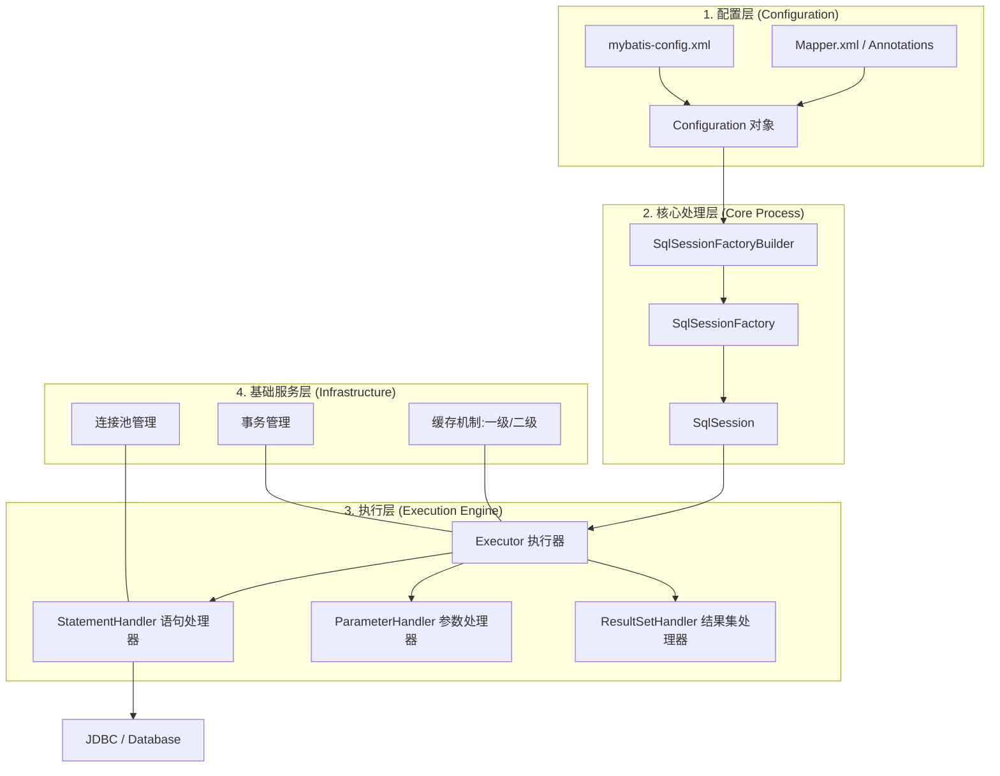
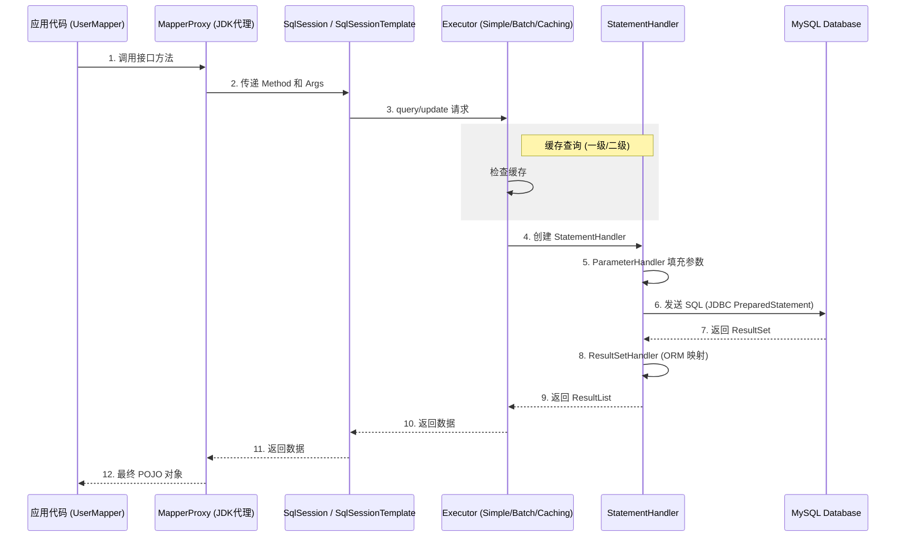
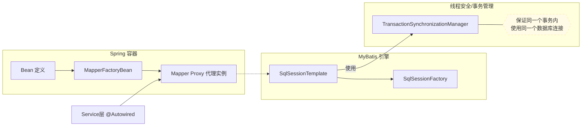

<div id="chap-mybatis"></div>

[⬆️ 返回目录](#catalog)

## mybatis

这是一个非常敏锐的问题！你触及了 MyBatis 扫描机制的核心逻辑。作为资深程序员，我来为你揭开这层“面纱”。

---

### 1. 是不是只要是接口，都会被当成 Mapper？

**结论是：如果你只配置了包路径，答案是肯定的。**

在 `mybatis-spring` 的默认逻辑中，如果你在启动类上只写了：

```java
@MapperScan("com.example.mapper")
```

那么 `ClassPathMapperScanner`（MyBatis 的扫描器）会非常“贪婪”。它会**把这个包下所有的接口**都注册为 `MapperFactoryBean`。

**这会带来什么后果？**
如果你的 `com.example.mapper` 包下不小心放了一个不属于 MyBatis 的普通接口（比如一个业务逻辑接口 `UserConverter`），MyBatis 也会尝试为它生成代理对象。

- **启动时**：通常不会报错。
- **运行时**：当你真正调用这个“误报接口”的方法时，MyBatis 会因为找不到对应的 SQL 映射而抛出著名的 `BindingException: Invalid bound statement (not found)`。

为了防止这种“误伤”，MyBatis 提供了你提到的另外两个**过滤器（Markers）**。

---

### 2. 什么是 `annotationClass`？（按注解过滤）

这是最常用的过滤手段。

- **含义**：告诉扫描器，只有标了“特定注解”的接口才算 Mapper。
- **配置方式**：

```java
@MapperScan(basePackages = "com.example.mapper", annotationClass = Mapper.class)
```

- **原理**：
  1. 扫描器扫到接口 `A`。
  2. 检查 `A` 上有没有 `@Mapper` 注解。
  3. 有则通过，没有则忽略。

**资深建议**：即使你用了 `@MapperScan`，在接口上写 `@Mapper` 也是个好习惯，它不仅能防止误扫，还能让阅读代码的人一眼看出这是个持久层接口。

---

### 3. 什么是 `markerInterface`？（按身份过滤）

这是一种“按族谱过滤”的手段。

- **含义**：告诉扫描器，只有继承了“特定父接口”的接口才算 Mapper。
- **使用场景**：比如你定义了一个自己的基础接口，要求所有 Mapper 必须继承它。

**代码示例**：

1. **定义一个标志接口**（通常是空的）：
   ```java
   public interface MyBaseMapper { }
   ```
2. **Mapper 继承它**：
   ```java
   public interface UserMapper extends MyBaseMapper { ... }
   ```
3. **配置扫描器**：
   ```java
   @MapperScan(basePackages = "com.example.mapper", markerInterface = MyBaseMapper.class)
   ```

- **原理**：扫描器会检查当前接口是不是 `MyBaseMapper` 的子类。如果是，才给它发“准考证”。

---

### 4. 为什么需要这两个东西？（资深架构思维）

在大型项目中，由于包结构复杂，可能会出现以下情况：

1.  **包路径污染**：多人协作时，有人把非 Mapper 接口放进了 mapper 包里。
2.  **多套持久层框架**：项目里可能同时存在 MyBatis 和 Spring Data JPA。如果不加过滤，MyBatis 可能会尝试去接管 JPA 的接口，导致冲突。
3.  **精准控制**：在多模块项目中，你可能只想扫描某些特定类型的 Mapper。

### 总结对照表

| 过滤策略            | 严格程度 | 配置方式                | 典型场景                         |
| :------------------ | :------- | :---------------------- | :------------------------------- |
| **仅包路径**        | 最松     | `@MapperScan("...")`    | 简单项目，确保包里全是 Mapper    |
| **annotationClass** | 高       | 指定 `Mapper.class`     | 业界主流，通过 `@Mapper` 标记    |
| **markerInterface** | 高       | 指定 `BaseMapper.class` | 规范严谨，所有 Mapper 有统一父类 |

**一句话总结：**
MyBatis 的扫描器默认是“宁可错杀一千，不可放过一个”。通过 `annotationClass` 和 `markerInterface`，我们给了它一副“眼镜”，让它能够精准识别真正的 Mapper 接口。

这是一个非常敏锐的问题！你触及了 MyBatis 扫描机制的核心逻辑。作为资深程序员，我来为你揭开这层“面纱”。

---

### 1. 是不是只要是接口，都会被当成 Mapper？

**结论是：如果你只配置了包路径，答案是肯定的。**

在 `mybatis-spring` 的默认逻辑中，如果你在启动类上只写了：

```java
@MapperScan("com.example.mapper")
```

那么 `ClassPathMapperScanner`（MyBatis 的扫描器）会非常“贪婪”。它会**把这个包下所有的接口**都注册为 `MapperFactoryBean`。

**这会带来什么后果？**
如果你的 `com.example.mapper` 包下不小心放了一个不属于 MyBatis 的普通接口（比如一个业务逻辑接口 `UserConverter`），MyBatis 也会尝试为它生成代理对象。

- **启动时**：通常不会报错。
- **运行时**：当你真正调用这个“误报接口”的方法时，MyBatis 会因为找不到对应的 SQL 映射而抛出著名的 `BindingException: Invalid bound statement (not found)`。

为了防止这种“误伤”，MyBatis 提供了你提到的另外两个**过滤器（Markers）**。

---

### 2. 什么是 `annotationClass`？（按注解过滤）

这是最常用的过滤手段。

- **含义**：告诉扫描器，只有标了“特定注解”的接口才算 Mapper。
- **配置方式**：

```java
@MapperScan(basePackages = "com.example.mapper", annotationClass = Mapper.class)
```

- **原理**：
  1. 扫描器扫到接口 `A`。
  2. 检查 `A` 上有没有 `@Mapper` 注解。
  3. 有则通过，没有则忽略。

**资深建议**：即使你用了 `@MapperScan`，在接口上写 `@Mapper` 也是个好习惯，它不仅能防止误扫，还能让阅读代码的人一眼看出这是个持久层接口。

---

### 3. 什么是 `markerInterface`？（按身份过滤）

这是一种“按族谱过滤”的手段。

- **含义**：告诉扫描器，只有继承了“特定父接口”的接口才算 Mapper。
- **使用场景**：比如你定义了一个自己的基础接口，要求所有 Mapper 必须继承它。

**代码示例**：

1. **定义一个标志接口**（通常是空的）：
   ```java
   public interface MyBaseMapper { }
   ```
2. **Mapper 继承它**：
   ```java
   public interface UserMapper extends MyBaseMapper { ... }
   ```
3. **配置扫描器**：
   ```java
   @MapperScan(basePackages = "com.example.mapper", markerInterface = MyBaseMapper.class)
   ```

- **原理**：扫描器会检查当前接口是不是 `MyBaseMapper` 的子类。如果是，才给它发“准考证”。

---

### 4. 为什么需要这两个东西？（资深架构思维）

在大型项目中，由于包结构复杂，可能会出现以下情况：

1.  **包路径污染**：多人协作时，有人把非 Mapper 接口放进了 mapper 包里。
2.  **多套持久层框架**：项目里可能同时存在 MyBatis 和 Spring Data JPA。如果不加过滤，MyBatis 可能会尝试去接管 JPA 的接口，导致冲突。
3.  **精准控制**：在多模块项目中，你可能只想扫描某些特定类型的 Mapper。

### 总结对照表

| 过滤策略            | 严格程度 | 配置方式                | 典型场景                         |
| :------------------ | :------- | :---------------------- | :------------------------------- |
| **仅包路径**        | 最松     | `@MapperScan("...")`    | 简单项目，确保包里全是 Mapper    |
| **annotationClass** | 高       | 指定 `Mapper.class`     | 业界主流，通过 `@Mapper` 标记    |
| **markerInterface** | 高       | 指定 `BaseMapper.class` | 规范严谨，所有 Mapper 有统一父类 |

**一句话总结：**
MyBatis 的扫描器默认是“宁可错杀一千，不可放过一个”。通过 `annotationClass` 和 `markerInterface`，我们给了它一副“眼镜”，让它能够精准识别真正的 Mapper 接口。

作为一个资深程序员，我将通过 **核心架构图**、**执行流程图** 以及 **Spring 集成原理图** 三个维度，带你从底层看透 MyBatis。

---

### 一、 MyBatis 核心架构（静态视图）

这个架构展示了 MyBatis 内部组件的层级关系。



---

### 二、 SQL 执行生命周期（动态流程视图）

当你调用 `mapper.selectUser(id)` 时，内部发生的详细步骤如下：



---

### 三、 Spring 集成 MyBatis 的“魔法”原理

很多开发者不理解为什么接口可以直接 `@Autowired`，这张图解释了 `mybatis-spring` 的桥梁作用。

非常抱歉，这是我的疏忽。在 Mermaid 的 **`graph` (流程图)** 语法中，并不支持像 **`sequenceDiagram` (时序图)** 那样的 `Note` 关键字。

为了修复这个问题，我将第三张图（Spring 集成原理图）改用兼容的流程图节点来表示注释。以下是修正后的代码：

### 修正后的 Spring 集成原理图



### 总结

## 现在这段代码可以在任何支持 Mermaid 的编辑器（如 Notion, GitHub, Obsidian, Typora）中正常渲染了。它清晰地展示了 **Spring 是如何通过 `MapperFactoryBean` 产生代理对象**，并利用 **`TransactionSynchronizationManager` 解决数据库连接在多线程下的同步问题**。

### 四、 核心组件深度解析（资深视角）

1.  **SqlSessionTemplate (核心中的核心)**：
    - 在 Spring 中，它是 `SqlSession` 的实现类。
    - **功能**：它是线程安全的。它不亲自干活，而是每次调用时，根据当前线程查找是否有活跃的事务。如果有，就借用事务的连接；如果没有，就开启新连接。

2.  **Executor (执行器)**：
    - **SimpleExecutor**：每执行一次 SQL，创建一个 Statement。
    - **ReuseExecutor**：重复使用 Statement（基于 SQL 语句缓存）。
    - **BatchExecutor**：专门用于批量更新。
    - **CachingExecutor**：装饰器模式，在以上三者之上增加了“二级缓存”的支持。

3.  **StatementHandler**：
    - 这是真正处理 JDBC 的地方。它负责 `java.sql.Statement` 的创建、参数设置（通过 ParameterHandler）以及执行。

4.  **MappedStatement**：
    - MyBatis 把每一个 `<select|insert|update|delete>` 标签都封装成一个 `MappedStatement` 对象。
    - 它包含了：SQL 语句（含动态 SQL 处理后的）、输入参数映射、输出结果映射。

### 总结

作为资深程序员，理解这些图表的价值在于：

- **排查性能问题**：你知道该去 `Executor` 还是 `JDBC` 层优化。
- **自定义扩展**：如果你要写拦截器（Interceptor），你会清楚应该拦截 `StatementHandler` 还是 `ResultSetHandler`。
- **架构设计**：明白 Spring 如何通过 `FactoryBean` 代理接口，有助于你理解其他框架（如 Feign, Retrofit）的集成原理。

<!-- 跳转链接 -->

[⬆️ 返回目录](#catalog) | [文章开头 ➡️](#chap-mybatis)
