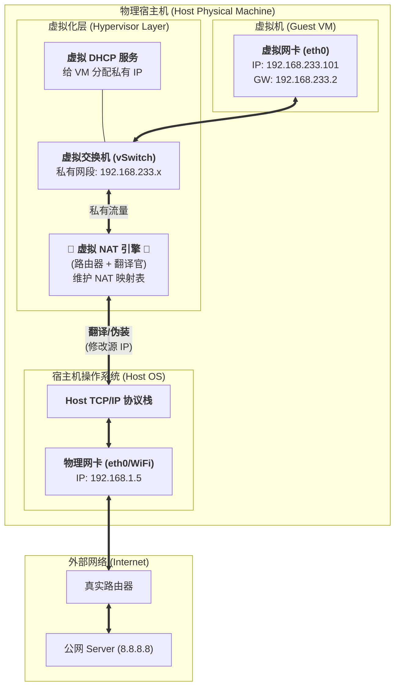
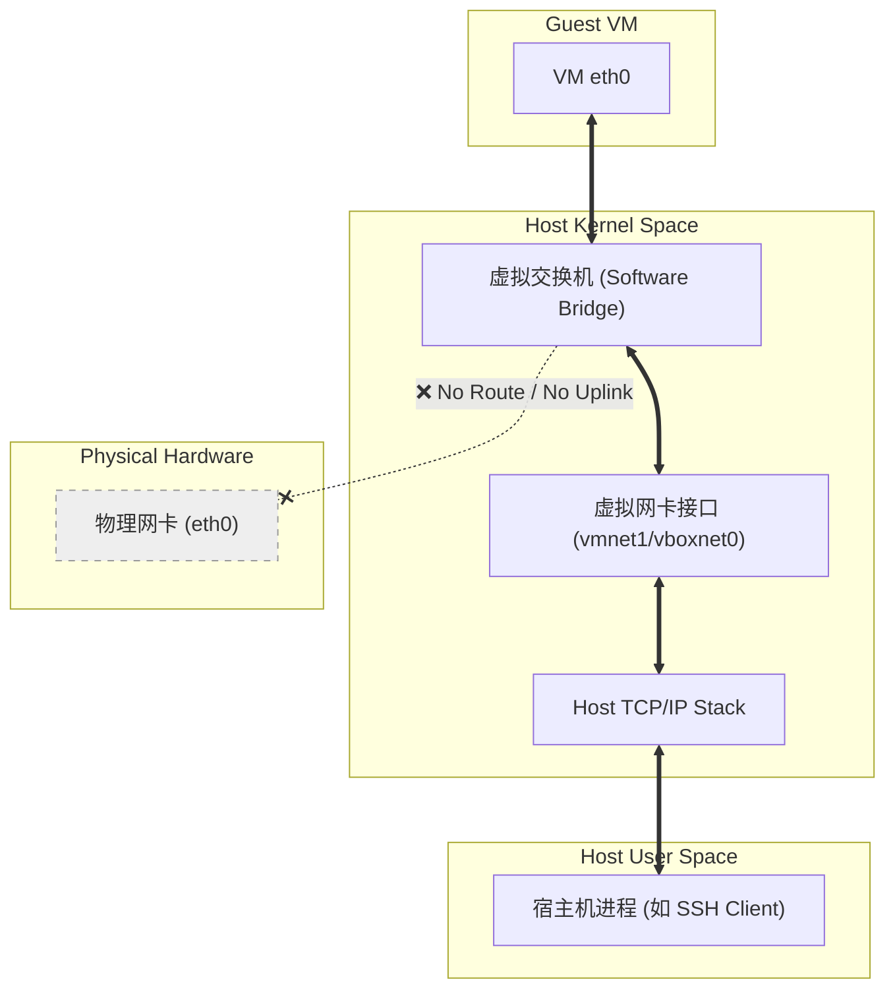
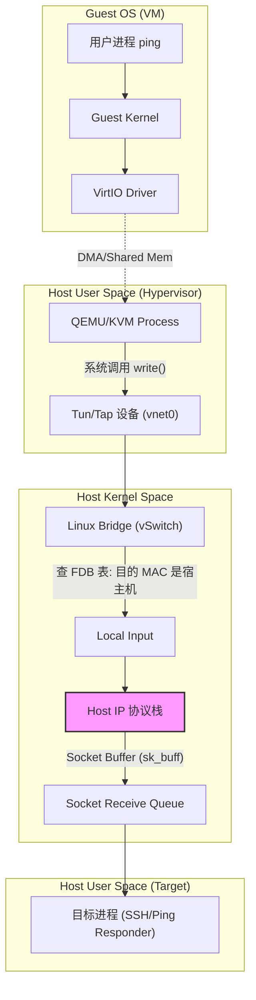
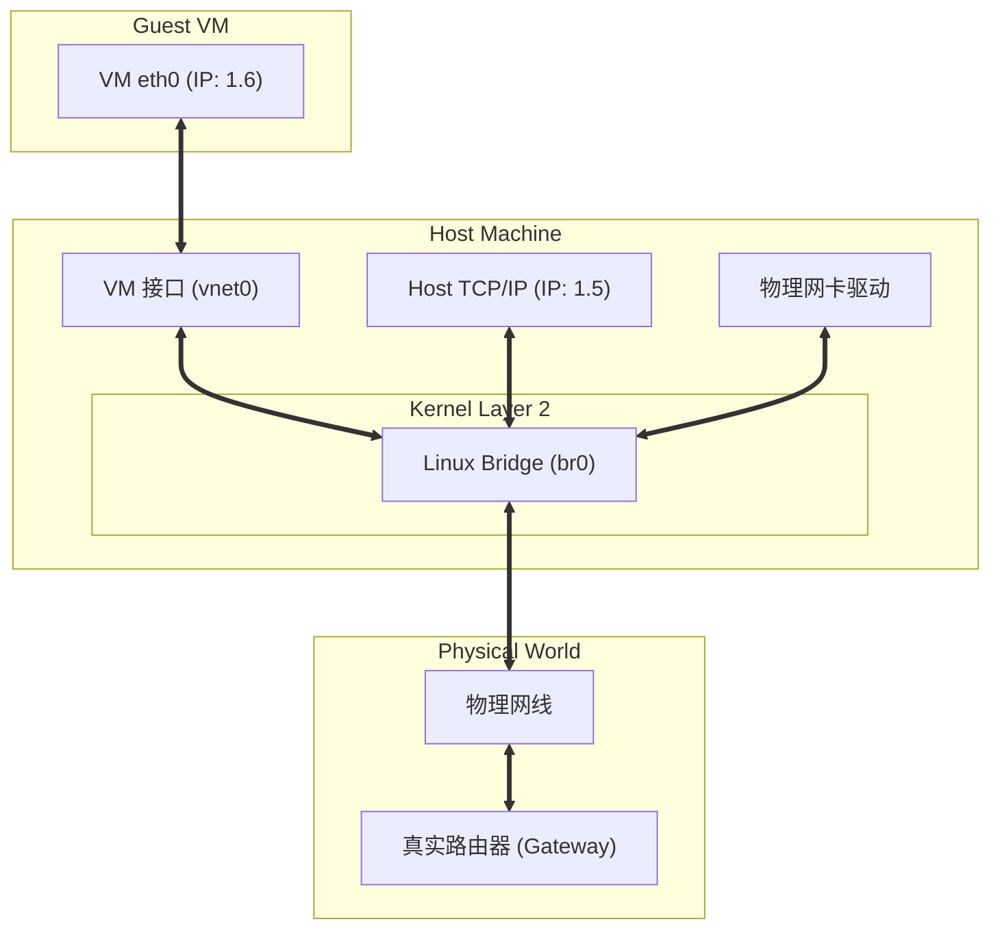
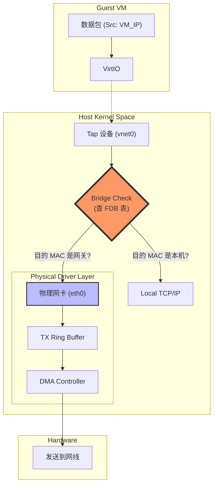
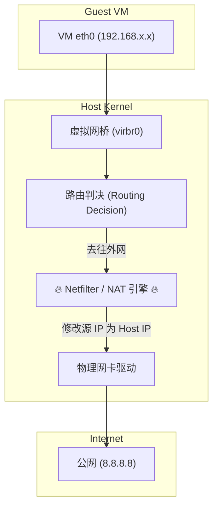
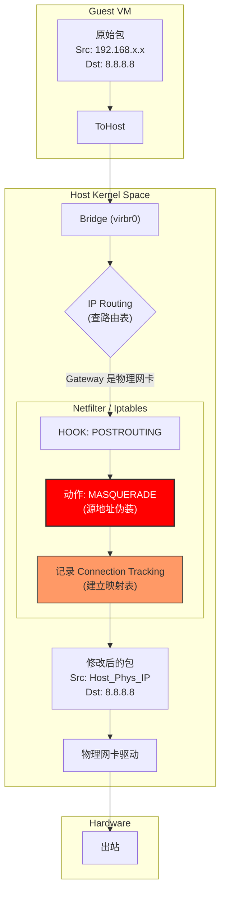

[⬆️ 返回目录](#catalog)

## NAT

NAT 模式是虚拟化中最常用、也是最“聪明”的模式。如果说 **Host-Only** 是闭门造车，**Bridged** 是登堂入室，那么 **NAT (Network Address Translation)** 就是**“狐假虎威”**。

在 NAT 模式下，宿主机（Host）对于虚拟机（VM）来说，扮演了**路由器 + 代理服务器**的角色。

### 1. 核心架构图：NAT 的“寄生”结构

这张图展示了 NAT 引擎是如何打通虚拟和现实的。请注意中间那个关键的 **NAT 引擎**，它是 Host-Only 模式中缺失的“桥梁”。

### 2. 数据流向原理：一次“偷天换日”的旅行

为了让你理解得更透彻，我们跟踪一个 `ping 8.8.8.8` 的数据包，看看它经历了什么。

#### 阶段一：出站 (Outbound) —— 伪装
1.  **VM 发包：**
    *   源 IP: `192.168.233.101` (VM)
    *   目的 IP: `8.8.8.8`
    *   *VM 查路由表，发现去公网要走网关 `192.168.233.2` (即 NAT 引擎的虚拟接口)。*
2.  **NAT 引擎拦截：**
    *   NAT 引擎收到包，**修改 IP 包头**。
    *   **源 IP 被修改为：** `192.168.1.5` (宿主机的物理 IP)。
    *   **源端口被修改为：** 宿主机的一个随机高位端口 (例如 50001)。
    *   *登记造册：* 在内存中的 **NAT 映射表** 记下一笔：`50001端口 <-> 192.168.233.101:ICMP`。
3.  **物理发送：**
    *   数据包通过宿主机的物理网卡发出去。
    *   **外部视角：** 路由器和 8.8.8.8 只看到宿主机 (`192.168.1.5`) 在发请求，根本不知道 VM 的存在。

#### 阶段二：入站 (Inbound) —— 还原
1.  **公网回包：**
    *   源 IP: `8.8.8.8`
    *   目的 IP: `192.168.1.5` (宿主机)
    *   目的端口: `50001`
2.  **NAT 引擎查表：**
    *   宿主机收到包，发现是发给端口 `50001` 的。
    *   转交给 NAT 引擎。
    *   NAT 引擎查表：`50001` 对应的是 `192.168.233.101`。
3.  **修改转发：**
    *   **目的 IP 被修改回：** `192.168.233.101` (VM)。
    *   数据包扔进 vSwitch，传给 VM。

---

### 3. 资深网管/程序员视角的 NAT 痛点与特性

#### A. 单向可见性 (最大的坑)
*   **VM -> 外网：** ✅ **通畅**。VM 可以随意访问百度、GitHub、宿主机。
*   **外网 -> VM：** ❌ **不通**。你同事的电脑无法 ping 通你的 VM。因为 VM 的 IP (`192.168.233.x`) 是你电脑内部虚拟出来的，外面的路由器不认识路由。
*   **宿主机 -> VM：** ✅ **通畅**。宿主机可以通过 `vnet8` (VMware) 或 `vboxnet` 网卡直接访问 VM。

#### B. 端口转发 (Port Forwarding) —— 解决痛点 A
如果你在 NAT 模式的 VM 里部署了一个 Nginx (`80` 端口)，想让局域网的同事访问，你必须在 Hypervisor 里配置**端口映射**：

> **规则：** 将 宿主机 IP 的 `8080` 端口 映射到 VM IP 的 `80` 端口。

流程变成了：
`同事浏览器` -> `宿主机:8080` -> `NAT 引擎` -> `VM:80`

这也就是 Docker `docker run -p 8080:80` 的底层原理（Docker 默认的 Bridge 模式本质上就是 NAT）。

#### C. 为什么 NAT 是默认首选？
1.  **抗干扰性强：** 无论你是在公司用静态 IP，还是回家用 DHCP，还是连手机热点，宿主机的网络环境怎么变，VM 的网络都不需要改配置（因为对外它是隐身的）。
2.  **节省 IP：** 不需要向网管申请额外的公司静态 IP。
3.  **安全性：** 天然的防火墙。外部攻击者很难直接扫描到内网的 VM。

### 总结
*   **Host-Only:** 拔了网线的局域网。
*   **Bridged:** 并联在物理网线上，独立身份。
*   **NAT:** 躲在宿主机背后的“马甲”，出去时穿宿主机的衣服，回来时再脱掉。

这是一个非常专业的要求。从资深开发和内核级网络管理的视角，要真正理解这三种模式，必须深入到 **内核空间 (Kernel Space)** 的数据包流转路径。

我们将分为三组，每组包含一张 **宏观架构图**（拓扑与连接）和一张 **微观内核流程图**（`sk_buff` 结构体在内核中的流转）。

---

### 第一组：Host-Only 模式 (仅主机)

这是最基础的模式，数据包在到达宿主机内核协议栈后就“到站”了，或者在二层被丢弃。

#### 1.1 宏观架构图 (拓扑)

#### 1.2 内核流程图 (Packet Flow)
这里展示的是从 VM 发包 ping 宿主机的过程。

---

### 第二组：Bridged 模式 (桥接)

桥接的核心在于 Linux Kernel 的 `Bridge` 模块，它工作在二层（数据链路层），就像一个虚拟的物理交换机。

#### 2.1 宏观架构图 (拓扑)

#### 2.2 内核流程图 (Packet Flow)
这里展示 VM 发包到公网的过程。关键在于 `Bridge Check` 环节。

---

### 第三组：NAT 模式 (网络地址转换)

这是最复杂的，因为涉及到了 Netfilter (iptables) 的介入，数据包被“篡改”了。

#### 3.1 宏观架构图 (拓扑)

#### 3.2 内核流程图 (Packet Flow)
注意 `POSTROUTING` 链上的 SNAT 操作，这是 NAT 模式的灵魂。

### 总结：内核视角的本质区别

1.  **Host-Only:** 数据包在宿主机内核的 `Bridge` 处查表，发现没有物理出口，只能发给本机或丢弃。**生命周期不涉及物理网卡驱动。**
2.  **Bridged:** 宿主机内核仅充当“二层交换机”。它检查 MAC 地址，如果是外网的，直接把 `sk_buff` 从虚拟接口搬运到物理接口的发送队列。**不修改 IP 头。**
3.  **NAT:** 宿主机内核充当“三层路由器 + 代理”。它必须拆包，在 `Netfilter` 层修改 IP Header（SNAT），还要记录 `conntrack` 以便回包时改回来。**开销最大，但隔离性最好。**

<!-- 跳转链接 -->
[⬆️ 返回目录](#catalog)  |  [文章开头 ➡️](#chap-nat)