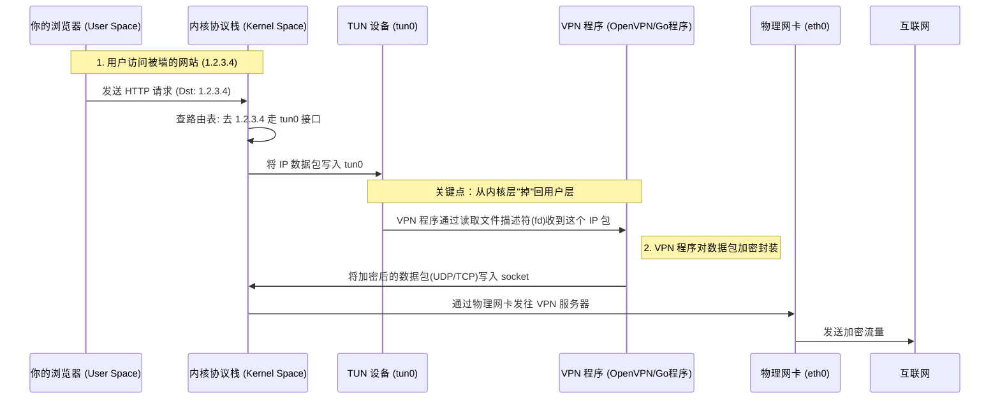
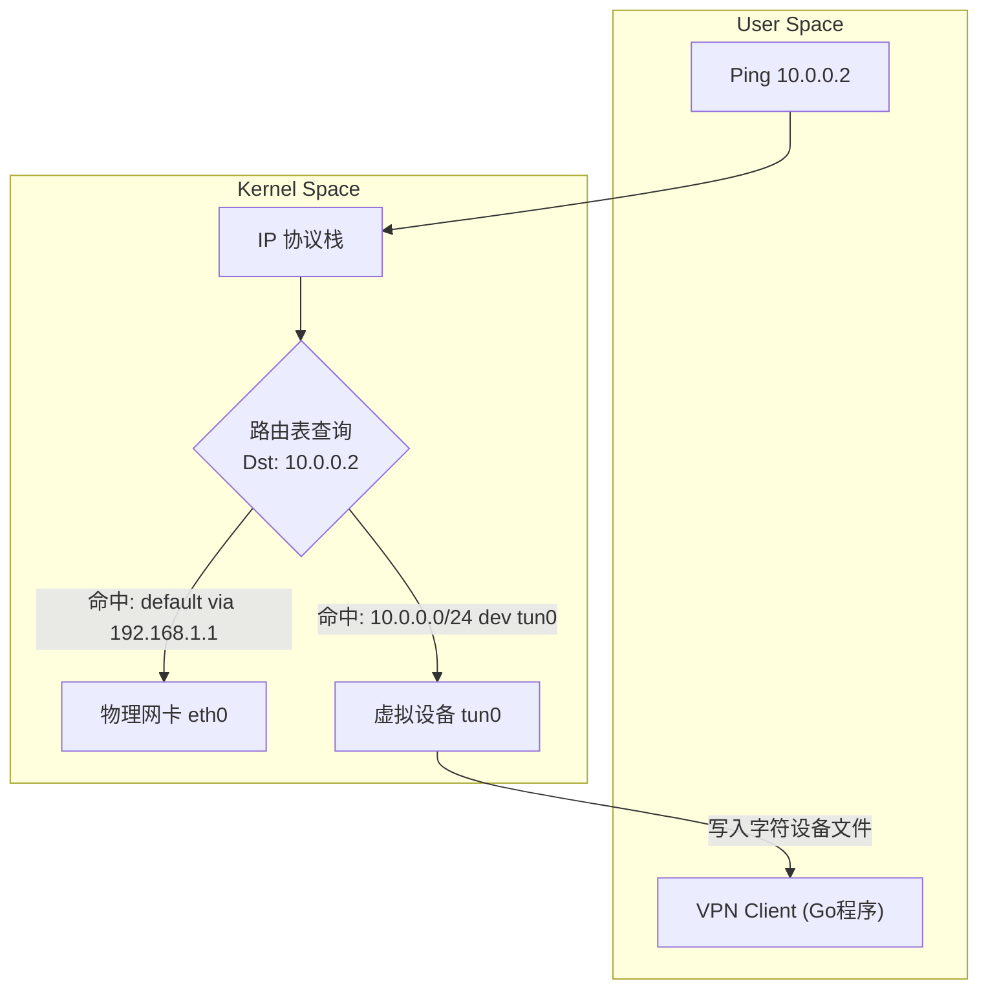
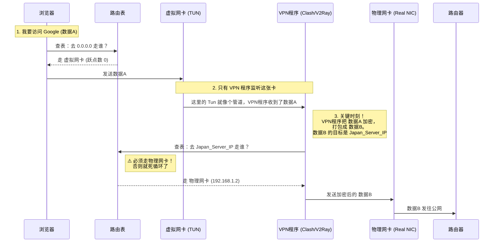

<div id="chap-tun"></div>

[⬆️ 返回目录](#catalog)


## TUN

这是一个非常棒的切入点。在 Linux 网络虚拟化中，**TUN** 和 **TAP** 是双胞胎，但性格完全不同。

一句话概括：**TAP 是模拟“网卡”，TUN 是模拟“网线/隧道”。**

*   **TAP** (Network Tap) 工作在 **OSI 二层 (数据链路层)**，它处理的是 **以太网帧 (Ethernet Frames)**。
*   **TUN** (Network Tunnel) 工作在 **OSI 三层 (网络层)**，它处理的是 **IP 数据包 (IP Packets)**。

在之前的虚拟机流程图中，我们主要用到的是 **TAP** 设备，因为虚拟机需要模拟 MAC 地址，假装自己是一台真实的物理机。

那么 **TUN** 到底是干嘛的？为什么需要它？

---

### 1. TUN 的核心原理：三层隧道

**TUN** 设备在 Linux 内核中是一个纯软件的逻辑设备。

*   **物理网卡：** 收到数据包 -> 转化为电信号 -> 通过 RJ45 网线发出去。
*   **TUN 设备：** 收到数据包 -> **转化为文件流** -> 发送给用户空间的程序（User Space Program）。

**这就好比：**
操作系统以为自己把数据包发给了“网卡”，结果这个“网卡”的背后不是网线，而是**另一个程序**（比如 OpenVPN 进程）。

### 2. TUN vs TAP：技术细节对比

| 特性 | TAP 设备 | TUN 设备 |
| :--- | :--- | :--- |
| **OSI 层级** | **Layer 2 (数据链路层)** | **Layer 3 (网络层)** |
| **传输单元** | **以太网帧 (Ethernet Frame)** | **IP 数据包 (IP Packet)** |
| **包含 MAC 头?** | ✅ 是 (Src MAC, Dst MAC) | ❌ 否 (只有 IP 头) |
| **主要用途** | **虚拟机 (VM)**, 网桥 (Bridge) | **VPN (OpenVPN, WireGuard)** |
| **形象比喻** | 虚拟的以太网卡 | 虚拟的点对点(P2P)管道 |

### 3. TUN 的经典工作流程 (以 VPN 为例)

这是 TUN 最著名的应用场景。当你连接 VPN 时，你的电脑上会多出一个 `tun0` 接口。



### 4. 为什么要区分 TUN 和 TAP？

作为资深程序员，你可能会问：*“既然 TAP 能发以太网帧（包含 IP 包），那它不是包含 TUN 的功能吗？为什么还要专门搞个 TUN？”*

原因有两点：**效率** 和 **路由模型**。

1.  **开销 (Overhead)：**
    *   **TAP:** 每次传输都要带 14 字节的 Ethernet Header (MAC 地址)。
    *   **TUN:** 纯粹的 IP 包，没有 MAC 头。对于 VPN 这种通过互联网传输的场景，MAC 地址在公网传输中是没有意义的（因为经过第一个路由器 MAC 就变了），所以用 TUN 可以节省带宽和处理开销。
2.  **路由逻辑：**
    *   **TAP** 看起来像一个局域网设备，支持广播 (ARP)。
    *   **TUN** 是点对点 (Point-to-Point) 设备。你不需要 ARP 协议去问“谁是 IP x.x.x.x”，因为数据管子里只有两头，扔进去对方肯定能收到。这简化了 VPN 的网络拓扑。

### 5. Go 语言实战：如何玩转 TUN

既然你用 Go，我们可以看一段伪代码，展示如何从 TUN 设备读取数据。这在写自定义代理或 VPN 时非常有用。

你可以使用 `github.com/songgao/water` 这样的库（Go 社区常用的 TUN/TAP 库）。

```go
package main

import (
	"fmt"
	"log"
	"github.com/songgao/water"
)

func main() {
	// 1. 配置并创建一个 TUN 设备
	config := water.Config{
		DeviceType: water.TUN, // 如果改成 water.TAP，读到的就是带 MAC 头的帧
	}
	
	// 这步操作相当于在 Linux 执行 `ip tuntap add dev tun0 mode tun`
	ifce, err := water.New(config)
	if err != nil {
		log.Fatal(err)
	}

	fmt.Printf("Interface Name: %s\n", ifce.Name())

	buffer := make([]byte, 2000)

	for {
		// 2. 就像读文件一样，从设备读取 IP 数据包
		// 当内核向 tun0 发送数据时，这里就会读到
		n, err := ifce.Read(buffer)
		if err != nil {
			log.Fatal(err)
		}

		// 3. 此时 buffer[:n] 就是一个纯粹的 IPv4/IPv6 包
		// 你可以解析它，看源 IP、目的 IP，甚至修改它
		packet := buffer[:n]
		
		// 简单的判断：IPv4 的第一个字节通常是 0x45 (Version 4, Header Len 20)
		if packet[0]>>4 == 4 {
			fmt.Printf("Received IPv4 Packet, Len: %d\n", n)
		}
	}
}
```

### 总结
*   **TAP:** 也就是 Virtual Ethernet。**VM 用它**，因为它要模拟真实的网卡，需要 MAC 地址做桥接。
*   **TUN:** 也就是 Virtual Point-to-Point。**VPN 用它**，因为它只需要传 IP 数据，不需要 MAC 地址这种累赘。


这是一个非常深刻的内核网络问题。很多网管熟悉 ARP 和 MAC，一旦遇到 TUN 这种“不讲武德”的设备，确实容易困惑。

我们分两部分来拆解：**数据是如何被“骗”进 TUN 的**，以及 **为什么在 TUN 的世界里 MAC 地址是多余的**。

---

### 问题一：数据是如何流向 TUN 的？

**答案：全靠路由表（Routing Table）的指引。**

在 Linux 内核中，网卡（无论是物理的 `eth0` 还是虚拟的 `tun0`）对 IP 协议栈来说，地位是平等的。它们都是 `net_device`。

当一个应用程序（比如浏览器或 ping）发出一个数据包时，数据流向并不是由物理连线决定的，而是由**路由决策**决定的。

#### 1. 流程解析
假设你的 TUN 设备 IP 是 `10.0.0.1`，对端是 VPN 服务器。你执行 `ping 10.0.0.2`。

1.  **应用层：** `ping` 构造一个 ICMP 请求，目标 IP `10.0.0.2`。
2.  **传输层/网络层：** 数据包进入内核协议栈。
3.  **核心步骤——查路由表：**
    内核问：“我要去 `10.0.0.2`，该走哪个门？”
    *   路由表里有一条规则（通常由 VPN 软件启动时添加）：
        `10.0.0.0/24 dev tun0`
    *   内核：“哦，去 `tun0` 那个门。”
4.  **设备发送：**
    内核调用 `tun0` 设备的发送函数（`ndo_start_xmit`）。
    *   **如果是 eth0：** 这个函数会把数据拷贝到网卡的 DMA 环形缓冲区，变成电信号。
    *   **如果是 tun0：** 这个函数仅仅是将数据包（`sk_buff`）**写入到一个队列**中。
5.  **用户空间读取：**
    你的 Go 程序（VPN 客户端）正在监听 `tun0` 的文件描述符。一旦队列里有数据，`file.Read()` 就被唤醒，读到了这个 IP 包。

#### 流程图：路由把关



---

### 问题二：为什么不需要网卡地址 (MAC)？

**一句话：因为 TUN 是“点对点 (Point-to-Point)”连接，不是“总线 (Bus)”连接。**

#### 1. 以太网 (eth0/TAP) 为什么需要 MAC？
以太网的设计基于**广播/共享介质**（即使现在用交换机，逻辑上依然如此）。
*   **场景：** 一个房间里有 100 个人（100 台主机）。
*   **问题：** 我要给“张三”发文件。我不能只喊一句“给你的”，因为李四、王五也能听到。
*   **解决：** 我必须在文件封面上写上**MAC 地址**（相当于身份证号）。大家收到后看一眼封面，如果不是自己的 MAC，就丢弃。
*   **机制：** 所以需要 ARP 协议：“谁是 10.0.0.2？请告诉我你的 MAC。”

#### 2. TUN 为什么不需要 MAC？
TUN 模拟的是**三层隧道**（直连管道）。
*   **场景：** 我手里拿着一根管子，管子的另一头**直接**插在你的耳朵里（VPN 程序）。
*   **现状：** 这个管子里只有我们两个人。没有李四，没有王五。
*   **推论：**
    1.  我往管子里扔东西，**一定**是你收到。
    2.  我不需要在封面上写“给张三”（MAC 地址），因为根本没有其他人会收到。
    3.  既然不需要写 MAC，那我就不需要 ARP 去问你的 MAC 是多少。
    4.  既然不需要 MAC 头（14字节），那我发给你的就只是纯粹的 IP 内容。

#### 3. 抓包对比 (Wireshark 视角)

如果你用 tcpdump 抓包，你会发现明显的区别：

*   **抓 eth0 (Layer 2 + Layer 3):**
    ```text
    [MAC Destination] [MAC Source] [IP Header] [TCP Header] [Data]
    |---- 14 bytes --|             |-----------------------------|
    ```
    内核必须封装 MAC 头才能发出去。

*   **抓 tun0 (Layer 3 Only):**
    ```text
    [IP Header] [TCP Header] [Data]
    |-----------------------------|
    ```
    内核**直接**把 IP 包扔进管道，没有任何二层头部。

### 总结

1.  **数据怎么去 TUN？**
    靠 **路由表 (Routing Table)**。路由表把去往特定网段的流量“导流”给了 `tun0` 接口。
2.  **为什么不要 MAC？**
    因为 **拓扑结构不同**。
    *   **网卡/TAP** 是“广场喊话”，需要 MAC 区分听众。
    *   **TUN** 是“传声筒”，只有两端，进去就是给对方的，不需要寻址，所以不需要二层头部（MAC），自然也不需要 ARP。

这是一个非常经典的 **Windows 路由表** 视角。

你在 Linux (`route -n`) 里看到的“接口”通常是网卡的名字（比如 `eth0`, `tun0`），但在 Windows (`route print`) 里，**“接口”一列显示的是该网卡绑定的 IP 地址**。

简单来说：
*   **网关 (Gateway):** 是**下一跳**的 IP（别人的 IP，路由器的 IP）。
*   **接口 (Interface):** 是**本机出口**的 IP（你自己网卡的 IP）。

我们来详细拆解你给出的这两行，这非常有意思，特别是第二行。

### 1. 为什么显示 IP 而不是网卡名？

在 Windows 的逻辑里，**接口 = 这个 IP 所在的那个网卡**。

想象一下你有一张网卡，你给它绑定了两个 IP：`192.168.1.2` 和 `10.0.0.5`。
*   如果有流量要走 `192.168.1.2` 出去，Windows 就在接口列显示 `192.168.1.2`。
*   这样做的好处是更精确：它不仅告诉你是哪张硬件网卡，还告诉你是以**哪个身份（源 IP）** 发出去的。

---

### 2. 深度解读你的路由表

你的路由表里有两条 `0.0.0.0` (默认路由)，这意味着你在运行某种 **VPN 或 代理软件**（极有可能是 Clash、Tun Mode 或者类似的透明代理）。

#### 第一行：你的物理网络
```text
网络目标        网络掩码          网关             接口           跃点数
0.0.0.0        0.0.0.0        192.168.1.1      192.168.1.2     35
```
*   **含义：** “如果要上网（去任意地方），默认可以走这条路。”
*   **网关 (192.168.1.1):** 这是你家路由器的 IP。
*   **接口 (192.168.1.2):** 这是**你自己电脑**物理网卡（或 Wi-Fi）拿到的局域网 IP。
*   **跃点数 (35):** 优先级较低（数字越大，优先级越低）。

#### 第二行：你的虚拟网络 (VPN/代理)
```text
网络目标        网络掩码          网关             接口           跃点数
0.0.0.0        0.0.0.0        198.18.0.2       198.18.0.1      0
```
*   **含义：** “如果要上网，**优先**（跃点数是 0，优先级最高）走这条路！”
*   **接口 (198.18.0.1):** 这是**你自己**电脑上虚拟网卡（TUN 网卡）的 IP。
*   **网关 (198.18.0.2):** 这是虚拟网卡对面的那个程序（代理软件/VPN核心）的虚拟 IP。
*   **关键点：** `198.18.x.x` 是一个专用的基准测试网段，现在被很多代理软件（如 Clash Premium 的 TUN 模式）用来做**“Fake IP”**或者虚拟路由。

### 3. 数据包是怎么跑的？

根据这两行路由，你的上网流量发生了 **“劫持”**：

1.  你想访问 `baidu.com`。
2.  Windows 查路由表。发现有两条路都能去 `0.0.0.0`（外网）。
3.  **比拼优先级：**
    *   走物理网卡（192.168.1.2），跃点数 35。
    *   走虚拟网卡（198.18.0.1），跃点数 0。
    *   **赢家：** 虚拟网卡。
4.  **发送：** Windows 把数据包交给接口 `198.18.0.1`。
5.  **接收：** 这个接口背后连接的是你的**代理软件**（就像我们刚才讨论的 TUN 设备原理）。
6.  **处理：** 代理软件加密数据包，然后通过物理网卡（192.168.1.2）真正发给路由器（192.168.1.1）。

### 总结

*   **Linux** 告诉你**“从哪个门（eth0）出去”**。
*   **Windows** 告诉你**“拿着哪张身份证（192.168.1.2）出去”**。

这里的“网址”（IP地址），实际上就是**你自己**在该网络接口上的身份标识。

这是一个非常敏锐的观察！你触碰到了 VPN 原理中最“烧脑”的一个点：**套娃悖论（The Encapsulation Paradox）**。

如果你发现路由表中有一条规则，接口对应的是**物理网卡**，但你明明开了 VPN，这通常是因为以下两个原因之一。我们需要看你具体指的是哪一条路由。

### 情况一：你看到的是“去往 VPN 服务器”的特权路由
**现象：**
路由表中有一条指向 **VPN 服务器公网 IP** 的路由，它的接口是 **物理网卡**。

**原因：**
这是一个“鸡生蛋”的问题。
1.  VPN 的作用是把你的数据加密，塞进隧道里。
2.  但是，**加密后的数据包（加密信封）本身**需要通过互联网传送到 VPN 服务器去。
3.  如果“去往 VPN 服务器”的数据包也走 VPN 隧道，那就变成了“我自己钻进了我自己的肚子里”，形成了死循环。

**结论：**
必须有一条**特权路由（Hole in the tunneling）**。操作系统必须明确知道：“去往全世界的流量都走 VPN，**唯独**去往 VPN 服务器（比如 `123.45.67.89`）的流量，必须走**物理网卡**，直接发给路由器。”

### 情况二：你指的是 `0.0.0.0` 那条物理路由还在
**现象：**
```text
网络目标    网关           接口           跃点数
0.0.0.0    198.18.0.2    198.18.0.1     0     <-- VPN路由 (优先级高)
0.0.0.0    192.168.1.1   192.168.1.2    35    <-- 物理路由 (优先级低)
```
你发现物理网卡（192.168.1.2）的这条 `0.0.0.0` 规则依然存在。

**原因：**
这是正常的**“备胎”机制**。
VPN 软件通常不会**删除**你原本的物理默认路由，它只是通过修改**跃点数（Metric）**，插入了一条优先级更高的 VPN 路由（跃点数 0 < 35）。
*   操作系统会优先走 Metric 0 的 VPN 路。
*   物理路由只是“沉底”了，并没有消失。
*   这也解释了为什么有些 VPN 突然断开后，你的电脑会自动切回直连模式（这也是为什么需要“Kill Switch”来强制切断物理路由，防止流量泄漏）。

---

### 图解：由于 VPN 是“套娃”，所以必须经过物理网卡

让我们看看数据包是如何在你的电脑里流转的，你会发现**物理网卡是必经之路**。

假设你要访问 `Google`，而你的 VPN 服务器 IP 是 `Japan_Server_IP`。



### 总结

即便你用了 VPN，**物理网卡（接口）依然在工作**，而且工作量一点都没少。

*   **虚拟网卡（TUN）** 负责接收你浏览器发出的**原始内容**（明文 HTTP/HTTPS）。
*   **物理网卡** 负责发送 VPN 程序加密后的**密文包裹**。

所以，你在路由表里看到物理网卡的 IP 是绝对正常的。**它负责运送隧道本身。**

这是一个非常硬核的问题。你问到了点子上：**VPN客户端凭什么能既接管所有流量，又把自己“摘出去”？**

这里涉及两个层面的技术：一个是**路由表的“最长匹配原则”**，另一个是**Socket层面的“接口绑定”**。

并不是VPN客户端“控制”了查表的过程（查表是操作系统内核锁死的逻辑，谁都改不了），而是VPN客户端利用了查表的规则，或者使用了“后门”。

### 核心一：利用“最长前缀匹配” (Longest Prefix Match) —— 规则碾压

这是网络路由的**最高宪法**。
操作系统在查路由表时，如果发现有多个规则都能匹配同一个目标 IP，它永远会选择**掩码最长（也就是限制最具体）**的那一条。

VPN客户端虽然把默认路由（`0.0.0.0/0`，掩码长度0）改向了虚拟网卡，但它会在路由表里偷偷加一条**极高优先级**的规则。

#### 场景模拟
*   **VPN服务器 IP:** `123.45.67.89`
*   **物理网关 IP:** `192.168.1.1`

VPN客户端启动时，会在后台做这几件事：

1.  **添加默认路由指向 TUN:**
    `Target: 0.0.0.0/0` -> `Interface: TUN`
    （意思是：不管去哪，都走隧道）

2.  **关键一步：添加“特权”路由指向物理网卡:**
    `Target: 123.45.67.89/32` -> `Gateway: 192.168.1.1` -> `Interface: Physical`
    （意思是：**唯独**去 `123.45.67.89` 这个 IP，必须走物理网卡！）

#### 内核查表过程
当 VPN 客户端程序要把加密后的数据包发给 `123.45.67.89` 时，内核进行比对：

*   规则 A (`0.0.0.0/0`): 匹配吗？匹配。掩码长度 0。
*   规则 B (`123.45.67.89/32`): 匹配吗？匹配。掩码长度 32。

**裁判结果：** 32 > 0。**规则 B 胜出。**
数据包被物理网卡带走。VPN 客户端利用这条精准路由，成功“逃逸”出了隧道。

---

### 核心二：Socket 绑定 (SO_BINDTODEVICE) —— 走后门

除了修改路由表，资深的 VPN 开发者（程序员视角）还有更暴力的手段。

在编写 VPN 客户端代码时，我们可以通过系统调用（System Call）强制指定某个 Socket 走哪个网卡，**完全无视路由表**。

#### 代码逻辑（Go语言伪代码）

```go
// 创建一个用于发送加密数据的 UDP 连接
conn, _ := net.ListenPacket("udp", ":0")

// 获取底层的文件描述符
fd := getFD(conn)

// 关键魔法：强制绑定到物理网卡 (比如 "eth0" 或 "Wi-Fi")
// 在 Linux 上是 SO_BINDTODEVICE
// 在 Windows 上是 IP_UNICAST_IF
syscall.SetsockoptString(fd, syscall.SOL_SOCKET, syscall.SO_BINDTODEVICE, "eth0")

// 发送数据
conn.WriteTo(encryptedData, vpnServerAddr)
```

**原理：**
一旦 Socket 被绑定了特定设备（Interface），操作系统内核在处理这个 Socket 发出的数据包时，会**跳过常规的路由查找逻辑**（或者限制查找范围仅在该接口内），直接把包扔给那个网卡。

这就像是你在发快递时，没有把它扔进邮筒等邮局分拣（查路由表），而是直接拿着包裹走到了某一家快递公司的柜台（绑定接口）。

---

### 核心三：它凭什么有权修改？(权限)

你可能会问：“凭什么它能改路由表，或者绑定硬件？”

**答案：Root / Administrator 权限。**

*   你注意过吗？在 Linux 上运行 VPN 都要 `sudo`。
*   在 Windows 上运行 Clash/VPN，启动“系统代理”或“TUN模式”时，UAC 都会弹窗请求**管理员权限**。

没有这个权限，VPN 客户端无法修改路由表，无法创建 TUN 设备，也无法绑定底层网卡。它只是一个拥有了系统最高权限的普通进程。

### 总结

VPN 客户端能控制数据走物理网卡，依靠的是：

1.  **权限：** 你亲手授予的管理员权限。
2.  **精确打击（路由表）：** 添加一条指向 VPN 服务器 IP 的 `/32` 路由，利用“最长匹配原则”覆盖掉默认的 VPN 路由。
3.  **强制绑定（代码层）：** 在代码里通过 `bind` 强行指定数据出口，绕过路由表。

通常情况下，现在的 VPN 客户端是**双管齐下**，既写路由表（为了保底），也在代码里做绑定（为了稳定），确保加密隧道本身绝对不会断连。

think:
User is asking a crucial question about how a physical NIC (which requires Ethernet frames with MAC headers) can transmit data coming from a TUN interface (which has no MAC headers).

Key concept: The process involves encapsulation and routing. The TUN packet is payload. It gets wrapped.

Steps to explain:
1.  **Clarify the Misconception:** The physical NIC *never* sends raw TUN data directly without headers. That would be illegal on the wire.
2.  **The "Wrapping" Process (Encapsulation):**
    *   Application (VPN App) reads from TUN.
    *   This data (IP packet) is now just a byte array (payload) in the memory of the VPN app.
    *   VPN App opens a *new* socket (UDP/TCP) to the VPN Server using the physical connection.
    *   VPN App writes that byte array (TUN data) into the new socket.
    *   OS Stack adds new headers:
        *   New IP Header (Src: Host Phys IP, Dst: Server IP).
        *   New UDP/TCP Header.
        *   **New MAC Header** (Src: Host Phys MAC, Dst: Gateway MAC).
3.  **Visual Metaphor:** Russian Dolls (Matryoshka) or Envelopes.
    *   TUN packet = Inner Letter.
    *   VPN Tunnel = Envelope.
    *   Physical NIC sends the Envelope.
4.  **Diagram:** Show the transformation from TUN read to Physical write.

Drafting the response:
*   Direct Answer: It doesn't. It wraps it.
*   Mechanism: Tunneling.
*   Step-by-step flow:
    1.  TUN -> App (User Space). App sees an IP Packet.
    2.  App -> Socket (Kernel Space). App treats that IP Packet as "Data".
    3.  Kernel -> Phys NIC. Kernel wraps that "Data" with standard Ethernet/IP/UDP headers.
*   The "Magic": To the physical NIC, the VPN traffic is just standard UDP packets. It doesn't care that the payload inside happens to be another IP packet.

Check for clarity: Ensure distinction between the "Inner IP" (Virtual) and "Outer IP" (Physical). Ensure distinction between "Virtual Interface" and "Physical Interface".

Refining the explanation of "Why MAC is added": The kernel adds the MAC for the *outer* packet because the route for the outer packet points to the physical gateway.

Final Polish: Use the "Courier" analogy. TUN is the letter. Physical NIC is the truck. The truck doesn't carry loose letters; it carries boxes. You put the letter in a box. The truck needs the address of the distribution center (MAC) to move.

Let's write it down.

---
**这是一个天大的误解。**

物理网卡**并没有**发送“没有二层头”的数据。物理网卡发送的**永远是**标准的、带有 MAC 头、IP 头、UDP/TCP 头的完整数据包。

那你可能会问：*“TUN 里的数据明明没有 MAC 头，怎么变出来的？”*

答案是：**打包（Encapsulation）**。也就是我们常说的“隧道”。

这个过程就像**寄快递套娃**。

### 1. 核心揭秘：TUN 的数据只是“货物”

当 VPN 程序从 TUN 设备里读出一个数据包（我们叫它 **包A**）时，这个 **包A** 确实没有 MAC 头，只有 IP 头。

但在物理网卡把数据发出去之前，VPN 程序对 **包A** 做了一件关键的事：**把它当作普通数据（Payload），塞进了一个新的数据包（包B）里。**

### 2. 全流程演示

假设你要访问 Google (`8.8.8.8`)，你的 VPN 服务器是 `1.2.3.4`。

#### 第一步：TUN 里的“裸奔包” (包A)
你的浏览器发起请求，路由表把包导向 TUN。
*   **内容：** `[ IP头: 去往 8.8.8.8 ] + [ TCP: HTTP请求 ]`
*   **状态：** 此时它在内存里，确实没有 MAC 头。
*   **动作：** VPN 程序通过 `tun.Read()` 读到了这串二进制数据。

#### 第二步：VPN 程序的“打包操作”
VPN 程序拿到这串数据后，把它加密（变成了乱码），然后调用标准的 Socket API（比如 UDP Socket），向 VPN 服务器发起发送请求。
*   **代码逻辑：** `conn.WriteTo(加密后的包A, "1.2.3.4")`

#### 第三步：物理网卡的“穿衣过程” (包B)
操作系统内核接收到 VPN 程序的 `Write` 请求，开始构建**全新的数据包（包B）**。这个包是要通过物理网卡 `eth0` 发给 VPN 服务器的。

内核会做以下封装：
1.  **加 UDP 头：** 源端口 12345，目的端口 443。
2.  **加新 IP 头：** 源 IP `192.168.1.5` (你的物理IP)，目的 IP `1.2.3.4` (VPN服务器)。
3.  **加新 MAC 头：** **重点来了！** 内核查 ARP 表，找到网关的 MAC 地址，填入 `Ethernet Header`。

#### 第四步：物理发送
最终，物理网卡发送出去的数据包结构是这样的：

```text
[ 外层 MAC 头 ] [ 外层 IP 头 ] [ 外层 UDP 头 ] [ 载荷 (Payload) ]
      ^               ^              ^                 ^
      |               |              |                 |
  真实的物理      去往 VPN      隧道协议         这里面包裹着
  MAC 地址       服务器的IP                     加密后的 包A
```

### 3. 形象比喻

*   **TUN 数据 (包A)：** 是一封**信**。信封上写着“寄给 Google”。这封信没有贴邮票（没有 MAC），不能直接扔进邮箱。
*   **VPN 程序：** 是你的**秘书**。秘书从 TUN 那个“内部信箱”拿出这封信。
*   **物理发送 (包B)：** 秘书拿了一个**顺丰的大快递袋**。
    1.  把信塞进快递袋。
    2.  在快递袋上写上：寄给“VPN 总部”（外层 IP）。
    3.  在快递袋上贴上顺丰的运单（外层 MAC）。
*   **物理网卡：** 是**快递员**。快递员只看最外面的顺丰运单（MAC），根本不在乎里面装的是信还是石头。

### 总结

物理网卡**从来没有**发送过 TUN 的原始数据。

它发送的是**一个新的 UDP/TCP 包**，而 TUN 的数据（那个没有 MAC 的包）只是作为这个新包肚子里的**一部分内容（Payload）**被携带出去了。

这就是为什么：
1.  TUN 不需要 MAC（因为它是内部信件）。
2.  物理网卡依然能工作（因为它发送的是合法的、有 MAC 的外层包裹）。
3.  中间的路由器看不懂你的流量（因为外层是普通的 UDP，内层信件被包裹且加密了）。

<!-- 跳转链接 -->
[⬆️ 返回目录](#catalog)  |  [文章开头 ➡️](#chap-tun)