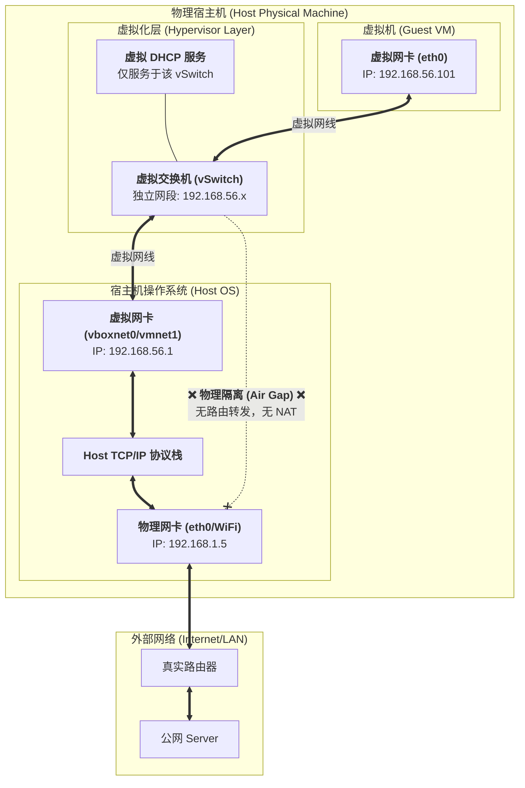

<div id="chap-onlyhost"></div>

[⬆️ 返回目录](#catalog)


## 仅主机

这是一个非常经典的系统架构问题。作为一个资深网络管理员（Net Admin）和开发者，我们需要透过现象看本质：**虚拟化网络的核心在于“虚拟交换机（vSwitch）”和“数据包拦截/转发机制”**。

你提到的“Host模式”在虚拟机（VMware/VirtualBox）领域通常指的是 **Host-Only（仅主机模式）**。但在容器（Docker）领域，Host 模式含义完全不同。鉴于你之前问的是 Go 和 VM 相关，我主要从 **虚拟机（VM）** 的角度深度剖析 **Host-Only**，同时对比 NAT 和 Bridged，最后顺带提一下容器的 Host 模式以防混淆。

---

### 1. 核心组件：虚拟化网络的基础

在理解任何模式之前，脑海里必须有一个图：
*   **物理网卡（Physical NIC）：** 你电脑上插网线或连 Wi-Fi 的那个硬件。
*   **虚拟交换机（vSwitch）：** Hypervisor（如 VMware, KVM, VirtualBox）在内存里模拟出来的一个二层交换机。
*   **虚拟网卡（vNIC）：** 虚拟机里看到的 `eth0`。

所有模式的区别，仅仅在于**这三者是如何连接的，以及谁负责分配 IP 和路由**。

---

### 2. Host-Only 模式 (仅主机模式) —— “闭门造车”

这是最封闭、最安全，也是理解起来最纯粹的模式。

#### 技术原理
在 Host-Only 模式下，Hypervisor 构建了一个**完全隔离的内部局域网**。

1.  **物理隔绝：** 虚拟交换机（vSwitch）**没有**连接到宿主机的物理网卡。这意味着，VM 的数据包根本没有路径流向外部互联网。
2.  **宿主机的角色：** 宿主机（Host OS）会在自己身上创建一个虚拟网卡（例如 VMware 的 `vmnet1` 或 VirtualBox 的 `vboxnet0`）。这个虚拟网卡插在这个隔离的 vSwitch 上。
3.  **通信链路：**
    *   `VM` <--> `vSwitch` <--> `Host OS (虚拟网卡)`
4.  **IP分配：** 通常 Hypervisor 会自带一个轻量级的 DHCP 服务运行在这个 vSwitch 上，给 VM 分配一个私有网段的 IP（比如 `192.168.56.x`）。

#### 数据包流向
*   **VM 发包：** 数据到达 vSwitch。
*   **vSwitch 查表：**
    *   如果是发给同一网段的其他 VM，直接二层转发。
    *   如果是发给 Host，转发给 Host 的虚拟网卡。
    *   如果是发给百度（公网），**直接丢弃**（因为没有网关指向物理网卡）。

#### 适用场景 (Admin 视角)
*   **高危测试：** 比如测试勒索病毒、恶意软件。你绝对不希望它们能访问互联网或公司内网。
*   **私有集群开发：** 在笔记本上搞一个 Kubernetes 集群，只希望宿主机能 SSH 连进去，不希望它们暴露在公网。

---

### 3. Bridged 模式 (桥接模式) —— “伪装潜入”

这是最像“真实物理机”的模式。

#### 技术原理
Hypervisor 在宿主机的物理网卡驱动上安装了一个**过滤驱动（Filter Driver）**。

1.  **二层打通：** vSwitch 直接“并联”到了物理网卡上。
2.  **混杂模式（Promiscuous Mode）：** 物理网卡被置于（或模拟）混杂模式，它不仅接收发给宿主机 MAC 地址的包，也接收发给 VM MAC 地址的包。
3.  **身份欺骗：** 对局域网里的路由器来说，VM 就是一台独立的物理电脑，有自己独立的 MAC 地址。

#### 数据包流向
*   **VM 发包：** 数据 -> vSwitch -> **宿主机的物理网卡驱动** -> 物理网线 -> 真实路由器。
*   **IP 获取：** VM 直接向局域网的**真实路由器**申请 IP（和宿主机在同一个网段，比如都是 `192.168.1.x`）。

#### 缺点
*   **IP 冲突/限制：** 如果公司网络有 MAC 地址绑定或 802.1x 认证，桥接模式下的 VM 可能无法联网。
*   **安全风险：** VM 直接暴露在局域网中，容易被攻击或攻击他人。

---

### 4. NAT 模式 (网络地址转换) —— “寄生虫”

这是大多数虚拟机的**默认模式**。

#### 技术原理
Hypervisor 在宿主机内部构建了一个**虚拟的 NAT 路由器**。

1.  **网络结构：** VM 在一个私有子网里（如 `192.168.233.x`）。
2.  **代理转发：** 宿主机充当了 VM 的网关。当 VM 要上网时，Hypervisor 截获数据包，将其**源 IP** 修改为宿主机的物理 IP，记录在 NAT 表中，然后通过物理网卡发出去。
3.  **外部视角：** 外部网络（路由器、百度）根本不知道 VM 的存在，它们只看到宿主机在发请求。

#### 数据包流向
*   **VM 发包：** VM -> vSwitch -> **虚拟 NAT 引擎** -> 宿主机 TCP/IP 协议栈 -> 物理网卡。
*   **回包：** 物理网卡 -> 宿主机 -> **虚拟 NAT 引擎 (查表反查)** -> vSwitch -> VM。

#### 适用场景
*   **开发环境：** VM 需要上网（下载 apt/yum 包），但不需要被外部访问。
*   **移动办公：** 无论宿主机连的是家里的 Wi-Fi 还是星巴克的 Wi-Fi，VM 的 IP 都不用变，因为 NAT 会自动处理外部变化。

---

### 5. 补充：Docker 的 Host 模式 (完全不同)

既然你写 Go，可能会接触 Docker。Docker 的 `network: host` 是个特例，它**不是**虚拟化。

*   **原理：** 容器**没有**自己的 Network Namespace。
*   **效果：** 容器直接共享宿主机的网络栈。容器里监听 `80` 端口，就是监听宿主机的 `80` 端口。`ip addr` 看到的网卡和宿主机一模一样。
*   **性能：** 这是性能最好的模式，因为没有任何 NAT 或 vSwitch 的开销（Zero overhead），但端口冲突风险最大。

---

### 总结：资深视角的“一句话原理”

| 模式 | 核心技术原理 | 网络拓扑比喻 | 外部可见性 | IP 来源 |
| :--- | :--- | :--- | :--- | :--- |
| **Host-Only** | **vSwitch 与物理网卡断开** | **孤岛**（只有一条电话线连着宿主机） | 不可见，亦不可上网 | Hypervisor 的 DHCP |
| **Bridged** | **物理网卡过滤驱动 + MAC欺骗** | **合租室友**（和宿主机平起平坐，共用路由器） | 完全可见（独立设备） | 真实路由器 |
| **NAT** | **源地址转换 + 端口映射** | **公司前台**（所有 VM 的快递都以前台宿主机的名义收发） | 不可见（隐身） | Hypervisor 的 DHCP |

作为程序员，如果你的 Go 程序在 VM 里跑：
*   想让同事访问你的 API -> **Bridged**
*   只想在自己电脑上调试 -> **Host-Only**
*   只要能下载 GitHub 依赖就行 -> **NAT** (默认)

为了让你从“上帝视角”看清 **Host-Only (仅主机模式)** 的内部构造，我为你设计了两张图。

第一张是**架构拓扑图**，展示组件是如何连接（或断开）的。
第二张是**数据流向图**，展示数据包是如何“碰壁”的。

---

### 图一：Host-Only 核心架构拓扑图

这张图清晰地展示了 **“两个世界”**：左边是封闭的虚拟化世界，右边是真实的物理世界。



---

### 深入技术细节 (资深开发者必读)

#### 1. 为什么叫 Host-"Only"？
因为对于 VM 来说，它的世界里**只有**宿主机这一台“活人”。
*   VM 的路由表通常长这样：
    ```bash
    Destination     Gateway         Genmask         Flags Metric Ref    Use Iface
    192.168.56.0    0.0.0.0         255.255.255.0   U     0      0        0 eth0
    # 注意：通常没有 default (0.0.0.0) 网关行！
    ```

#### 2. 如何打破 Host-Only 强行上网？
这就是很多高级网络攻防实验的原理：**把宿主机变成路由器**。
如果你在宿主机（Linux）上执行：
```bash
# 1. 开启内核转发
sysctl -w net.ipv4.ip_forward=1

# 2. 配置 iptables NAT (IP 伪装)
iptables -t nat -A POSTROUTING -s 192.168.56.0/24 -o eth0 -j MASQUERADE
```
并且在 VM 里手动把网关设为 `192.168.56.1`。
**结果：** 架构上虽然还是 Host-Only 连接，但逻辑上你手工实现了一个“软件路由器”，这就变成了 **NAT 模式** 的手工版！

#### 3. 开发中的应用
当你写 Go 微服务，需要模拟一个**纯内网环境**（例如模拟数据库只允许内网访问，严禁公网连接）时，把数据库的 VM 设为 Host-Only 是最安全的做法。就算开发机中了毒，数据也不容易泄漏到公网。

这是 Linux 下 `route -n` 或 `netstat -rn` 输出的经典路由表格式。理解这个表是网络排查的基本功。

这条路由实际上告诉了操作系统：**“如果你要去 `192.168.56.x` 这个小区，不需要问路（Gateway），出门（eth0）直接喊（广播）就能找到。”**

我们逐列深度解析这条看似简单的路由：

```text
Destination     Gateway         Genmask         Flags Metric Ref    Use Iface
192.168.56.0    0.0.0.0         255.255.255.0   U     0      0        0 eth0
```

### 1. `Destination` (目的地) & `Genmask` (掩码)
*   **Destination:** `192.168.56.0`
*   **Genmask:** `255.255.255.0` (也就是 /24)

**含义：** 这两列结合起来定义了一个**目标范围**。
意思是：“这条规则适用于所有要去往 `192.168.56.1` ~ `192.168.56.254` 的数据包。”

### 2. `Gateway` (网关) —— 最关键的一点
*   **Gateway:** `0.0.0.0` (或者在某些系统中显示为 `*` 或 `On-link`)

**为什么是 0.0.0.0？这是什么 IP？**
这里的 `0.0.0.0` **不是**指那个代表“所有网络”的 IP，而在路由表中，它的特定含义是：**无网关 (No Gateway)** 或 **直连 (Directly Connected)**。

*   **直白解释：**
    如果我要去的地方（比如 `192.168.56.102`）就在我的局域网里（和我插在同一个交换机上），我还需要把包发给路由器（网关）让他帮我转发吗？
    **不需要！**
    我只需要直接发 **ARP 广播** 问一下：“谁是 192.168.56.102？”，对方就会回复我 MAC 地址，然后我直接把包扔给他。

*   **对比：**
    如果是去 `8.8.8.8`（公网），因为不在同一个网段，Gateway 这一列就会是一个具体的 IP（比如 `192.168.56.1`），意思是“我不认识路，先把包给这个网关”。

### 3. `Iface` (接口)
*   **Iface:** `eth0`

**含义：** 既然知道不需要网关了，那从哪个门出去呢？从 `eth0` 这个网卡出去。

### 4. `Flags` (标志位)
*   **Flags:** `U`

**含义：**
*   **U (Up):** 这条路由是有效的（网卡是启动状态）。
*   **注意：** 这里没有 `G` (Gateway)。如果 Flags 里有 `G`，说明这是要去外网的，需要走网关。这里没有 `G`，再次印证了这是**直连路由**。

---

### 总结：这句话对操作系统说了什么？

当操作系统拿到一个要发往 `192.168.56.5` 的数据包时，它查表：

1.  **匹配：** `192.168.56.5` 属于 `192.168.56.0/24` 吗？ -> **是**。
2.  **看网关：** Gateway 是 `0.0.0.0`。
3.  **决策：**
    “哦，原来是邻居啊。不用找路由器了。
    我直接在 `eth0` 接口发 ARP 广播找他的 MAC 地址，然后直接发给他。”

这就是所谓的**二层直连通信**，也就是 Host-Only 模式下 VM 只能和同网段（Host 或其他 VM）通信的根本原因——**因为它只有这一条直连路由，没有带 `G` 标志的默认路由（Default Gateway）。**

<!-- 跳转链接 -->
[⬆️ 返回目录](#catalog)  |  [文章开头 ➡️](#chap-onlyhost)