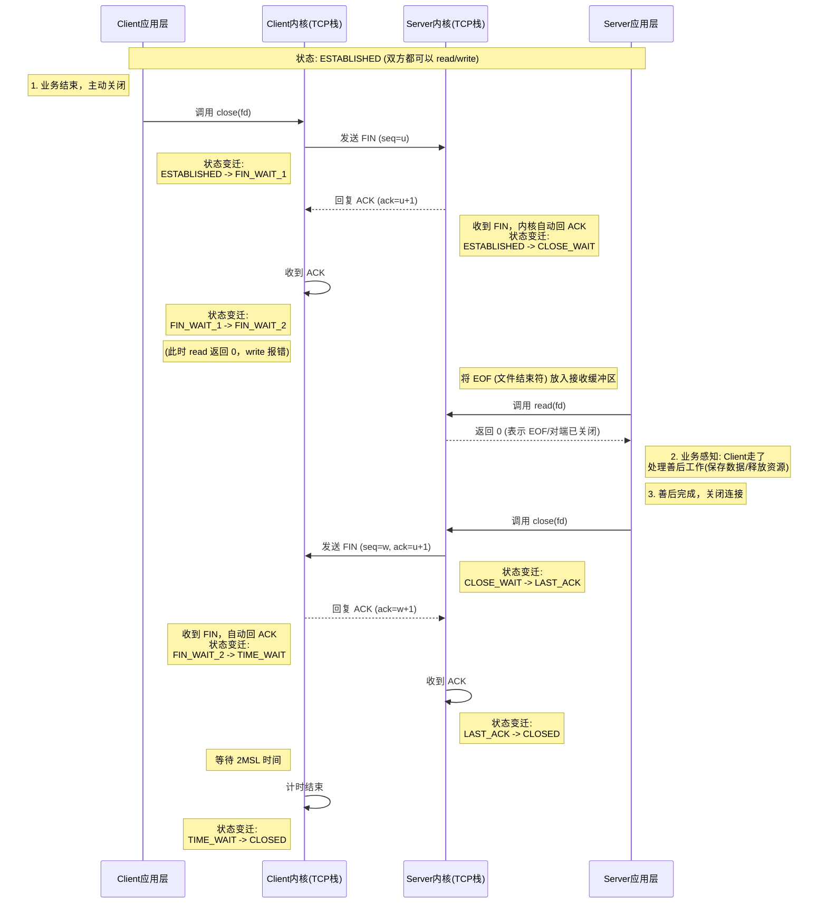
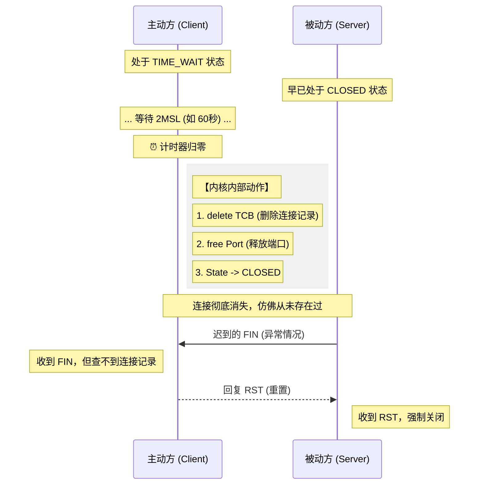

<div id="chap-three-shakehand"></div>

[⬆️ 返回目录](#catalog)


## 三次握手

既然你是程序员，那我们就跳过那些“打电话”、“开门”的通俗比喻，直接从 **TCP 协议的设计目标**、**状态机转换**以及**网络的不确定性**（不可靠信道）这几个维度来深挖。

TCP 的核心目标是在不可靠的 IP 层之上构建**可靠的（Reliable）、面向连接的（Connection-oriented）、全双工（Full-Duplex）**的数据传输服务。

所有的“握手”和“挥手”逻辑，本质上都是为了解决两个核心问题：
1.  **初始化序列号（ISN, Initial Sequence Number）的同步**。
2.  **全双工通道的独立关闭**。

---

### 一、 为什么要三次握手？ (Three-Way Handshake)

很多教材只说是为了确认双方收发能力正常，但这只是表象。**三次握手的核心技术原理是：通信双方必须确认并同步对方的初始序列号（ISN）。**

#### 1. 深度原理解析

TCP 的可靠性依赖于 **Sequence Number (SEQ)**。为了去重（De-duplication）和乱序重排（Reordering），通信双方必须维护一个序列号。
*   **ISN 不是固定的**：出于安全（防止 TCP 欺骗攻击）和区分不同连接实例的考虑，ISN 是随时间动态生成的（通常基于时钟）。
*   **同步过程**：
    *   Client 需要告诉 Server：“我的 ISN 是 X，请确认”。
    *   Server 需要告诉 Client：“我的 ISN 是 Y，请确认”。

如果只有两次握手，只能做到 Client 同步了 ISN 给 Server，Server 无法确认 Client 是否收到了自己的 ISN。只有第三次握手（Client 发送 ACK），Server 才能确定“Client 已经知道我的 ISN 是 Y 了”。

#### 2. 必须是三次的硬核理由：防止“失效的历史连接”初始化

RFC 793 指出，三次握手的主要原因是为了防止 **旧的重复连接初始化（Duplicate Connection Initiation）**。

**场景推演：**
假设网络拥堵，Client 发出的第一个 SYN 包（Seq=100）滞留了（Zombie Packet）。
1.  Client 超时重传，发了新的 SYN（Seq=200），建立连接，数据传输，关闭连接。
2.  **此时，那个滞留的旧 SYN（Seq=100）到达了 Server。**

*   **如果是两次握手：**
    Server 收到旧 SYN，误以为 Client 要起新连接，立刻进入 `ESTABLISHED` 状态，并向 Client 发送数据。此时 Client 根本没想建连，或者 Client 现在的上下文里期望的是 Seq=200，结果收到了 Seq=100 的响应。Client 会发送 RST，但在 Server 收到 RST 前，Server 已经分配了资源（内存、端口），造成资源浪费。

*   **如果是三次握手：**
    Server 收到旧 SYN (Seq=100)，回复 SYN+ACK (Ack=101, Seq=Y)。
    Client 收到这个 SYN+ACK，发现 Ack=101 对不上自己当前的上下文（或者自己处于 CLOSED 状态），Client 判定这是个历史连接，于是发送 **RST (Reset)** 报文给 Server。
    Server 收到 RST，放弃连接，不分配资源。

**总结：三次握手是为了在不可靠的网络信道中，通过确认机制，避免历史滞留报文导致 Server 端错误的资源分配和状态迁移。**

---

### 二、 为什么要四次挥手？ (Four-Way Handshake)

**四次挥手的核心技术原理是：TCP 是全双工（Full-Duplex）协议。**

全双工意味着数据可以在两个方向上同时传输：Client -> Server 和 Server -> Client 是两条独立的通道。因此，**关闭连接时，必须单独关闭每一条通道。**

#### 1. 状态机流转解析

*   **第一次挥手 (FIN)**：Client 发送 `FIN M`。
    *   含义：Client 没数据要发了，请求关闭 `Client -> Server` 的通道。
    *   状态：Client 进入 `FIN_WAIT_1`。
*   **第二次挥手 (ACK)**：Server 收到 `FIN`，回一个 `ACK M+1`。
    *   含义：Server 知道了，同意关闭 `Client -> Server` 方向。
    *   状态：Client 进入 `FIN_WAIT_2`，Server 进入 `CLOSE_WAIT`。
    *   **关键点**：此时处于 **半关闭（Half-Close）** 状态。Client 不能发数据了，但 Server 如果还有数据没发完，可以继续发，Client 必须接收。
*   **第三次挥手 (FIN)**：Server 数据发完了，应用层调用 `close()`，发送 `FIN N`。
    *   含义：Server 也没数据了，请求关闭 `Server -> Client` 的通道。
    *   状态：Server 进入 `LAST_ACK`。
*   **第四次挥手 (ACK)**：Client 收到 `FIN`，回一个 `ACK N+1`。
    *   含义：Client 确认 Server 关闭。
    *   状态：Client 进入 `TIME_WAIT`，Server 收到 ACK 后进入 `CLOSED`。

#### 2. 为什么不像握手那样合并成三次？

在握手时，Server 的 `ACK`（确认对方 SYN）和 `SYN`（同步自己 ISN）通常合并在一个包里发送（Piggybacking，捎带机制）。

但在挥手时，当 Server 收到 Client 的 `FIN` 时：
1.  内核协议栈会立即自动回复一个 `ACK`（第二次挥手），防止 Client 超时重传。
2.  **但是，Server 能否发送 `FIN`（第三次挥手），取决于 Server 端的应用程序。** 应用程序可能还有缓冲区的数据需要 flush，或者还有逻辑没处理完。内核不能替应用程序决定何时关闭发送通道。

因此，`ACK` 和 `FIN` 通常是分开发送的，这就导致了四次挥手。

---

### 三、 程序员必须懂的深度细节：TIME_WAIT

在面试或生产排查中，最常问的不是握手挥手过程，而是 **TIME_WAIT** 状态。

#### 1. 为什么 Client 最后要等待 2MSL？

在第四次挥手后，Client 不会立即关闭，而是进入 `TIME_WAIT` 状态，等待 **2MSL (Maximum Segment Lifetime，报文最大生存时间)**。

*   **理由一：保证最后一个 ACK 能到达 Server。**
    如果 Client 发完 ACK 直接跑路（CLOSED），而这个 ACK 在网络中丢了。Server 会超时重传 `FIN`。如果 Client 已经没了，Server 就永远关不掉连接（直到报错）。
    Client 等待 2MSL，如果收到 Server 重传的 `FIN`，说明刚才的 ACK 丢了，Client 会重传 ACK 并重新计时。

*   **理由二：防止“旧连接的脏数据”混入新连接。**
    TCP 使用 (源IP, 源端口, 目的IP, 目的端口) 四元组标识连接。
    如果在关闭连接后，立刻以相同的四元组建立新连接，而网络中还滞留着上一个连接的旧数据包。这些旧包可能会在新连接中“诈尸”，导致数据错乱。
    等待 2MSL（一来一回的时间），足以让网络中所有滞留的报文段自然消亡。

#### 2. 生产环境的坑

*   **现象**：高并发服务器上出现大量 `TIME_WAIT`。
*   **原因**：服务器主动关闭了连接（Server 变成了发起 FIN 的一方）。
*   **危害**：`TIME_WAIT` 会占用本地端口。如果端口耗尽，无法建立新连接（Cannot assign requested address）。
*   **优化**：调整内核参数 `net.ipv4.tcp_tw_reuse` (允许重用 TIME_WAIT socket) 或 `tcp_max_tw_buckets`。

### 总结

*   **三次握手**：是为了在不可靠信道上可靠地同步双方的 **ISN**，并防止**历史连接**造成的资源浪费。
*   **四次挥手**：是因为 TCP 是**全双工**的，接收方收到 FIN 时可能还有数据要处理，需要先回 ACK，等应用层处理完了再发 FIN，所以分成了四步。

这两个问题问得非常刁钻且切中要害，直接触及了内核协议栈的实现细节和实际生产环境调优的误区。我们逐一深挖。

---

报文最大生存时间（MSL - Maximum Segment Lifetime）这个参数，以及 TCP 在挥手时要等待 2MSL 的原因，涉及到 TCP 协议在不可靠网络环境中保证**数据可靠性**和**连接状态的正确迁移**的深刻设计。

我们来拆解一下。

---

### 1. 报文最大生存时间 (MSL) 的作用

MSL 本身不是一个直接的 TCP 参数，而是**一个概念**，代表一个 TCP 报文段在网络中能够存活的最长时间。这个时间通常是由网络协议栈或者操作系统设定的一个比较保守的值（例如 30 秒、60 秒、120 秒）。

**MSL 的核心作用是：**
*   **设定一个“安全等待期”**：任何 TCP 报文段，一旦发送出去，都应该在这个时间段内被正确处理（被接收、被确认）。
*   **提供关闭连接的“缓冲”**：在连接的关闭阶段，MSL 被用来确保所有残留的、可能干扰未来连接的报文段都已“死亡”。

---

### 2. 为什么挥手时要等待 2MSL？ (TIME_WAIT 状态)

Client 在第四次挥手（发送最后一个 ACK）后，会进入 `TIME_WAIT` 状态，并等待 `2 * MSL` 的时间。这主要有两个至关重要的原因：

#### 原因一：保证最后一个 ACK 能送达 Server (防止连接中断)

*   **场景**：Client 发送了最后一个 `ACK`（对 Server 发出的 `FIN` 的确认）。
*   **网络问题**：这个 `ACK` 包在网络中丢失了。
*   **Server 端情况**：Server 发送 `FIN` 后，一直没有收到 Client 的 `ACK`。TCP 协议规定，Server 会超时重传 `FIN`，试图让 Client 确认。
*   **Client 的 `TIME_WAIT` 作用**：
    *   如果 Client **没有**等待 `2MSL`，而是在收到 `FIN` 后立即进入 `CLOSED` 状态。那么当 Server 重传 `FIN` 时，Client 已经不存在了，Server 永远不会收到 ACK，这个连接就会永远处于一种不确定的“挂起”状态（直到 Server 端超时）。
    *   **Client 等待 `2MSL`**：在此期间，如果 Server 重传了 `FIN`，Client 就能收到。Client 收到后，会**重新发送一次 ACK**，并**重新开始计时** `2MSL`。这样就确保了 Server 最终能收到 Client 的确认，连接可以安全关闭。

#### 原因二：防止旧连接的数据包干扰新连接 (防止“幽灵包”)

*   **场景**：Client 刚刚关闭了一个连接（比如端口 10000），然后立即想用**相同的四元组**（源IP, 源端口, 目的IP, 目的端口）建立一个**新连接**。
*   **网络问题**：在这个短暂的关闭和重连期间，网络中可能还**滞留着**上一个连接的旧报文段（比如 Client 之前发送的，但 Server 还没来得及处理或 ACK 的数据）。
*   **`TIME_WAIT` 状态的风险**：如果 Client 立即重连，新连接的 TCP 协议栈可能会收到这些来自“前世”的旧报文。
    *   如果旧报文是 `SYN`（来自 Client），新连接可能误以为这是一个新的连接请求，从而错乱。
    *   如果旧报文是 `FIN`，它可能会导致新连接过早关闭。
    *   如果旧报文是 `ACK`，它可能与新连接的序列号对不上。
*   **Client 等待 `2MSL` 的作用**：
    *   `2MSL` 的时间长度，足以确保在正常的网络环境下，**任何一个在网络中游荡的、来自先前连接的报文段，都已经超过了它的最大生存时间，从而被网络丢弃。**
    *   这样，当 Client 准备建立新的连接时，它可以放心地认为网络中没有来自“前世”的脏数据包了。

---

### 3. `TIME_WAIT` 状态的意义（为什么叫“等待”？）

`TIME_WAIT` 状态的正确叫法是 **“2MSL Wait”**。它代表的是：

*   **最后一次通信的确认期**：为确保双方都正确收到并处理了最后的信息。
*   **连接重用保护期**：为防止历史报文影响新连接。

#### 生产环境中的 TIME_WAIT 问题

在高并发服务器（尤其是**主动关闭连接**的一方，通常是客户端，但服务器也可以主动关闭）上，可能会出现大量的 `TIME_WAIT` 连接。

*   **原因**：如果服务器频繁地主动关闭连接，每个连接关闭后都会短暂进入 `TIME_WAIT` 状态。
*   **问题**：`TIME_WAIT` 状态的 socket 仍然占用着本地端口。当服务器需要大量并发短连接时，如果端口资源耗尽，新的连接请求就会失败（`Cannot assign requested address`）。
*   **解决方案**：
    *   **调整内核参数**：
        *   `net.ipv4.tcp_tw_reuse = 1`: 允许在客户端（主动关闭方）将处于 `TIME_WAIT` 状态的 socket 快速重用，用于建立新的 TCP 连接。这**不影响**对重传的 `FIN` 的处理，因为 `TIME_WAIT` 的重传计时器是独立的。
        *   `net.ipv4.tcp_fin_timeout`: 缩短 `FIN_WAIT_2` 的超时时间（不是 `TIME_WAIT`，但可以略微影响关闭流程）。
        *   `net.ipv4.tcp_max_tw_buckets`: 限制系统进入 `TIME_WAIT` 状态的 socket 数量，超过则强制销毁（有风险，可能导致丢包）。
    *   **架构调整**：尽量让服务器作为被动关闭方（Server 收到 FIN 后，进入 CLOSE_WAIT，然后由 Server 应用层决定何时关闭，从而避免大量 TIME_WAIT）。

---

### 总结

*   **MSL**：报文段在网络中能存活的最长时间。
*   **2MSL 等待**：TCP 连接关闭后，客户端（主动关闭方）进入 `TIME_WAIT` 状态，等待 2MSL。
*   **作用**：
    1.  **可靠性**：保证最后一个 ACK 报文能成功送达，确保 Server 正确收到连接关闭确认。
    2.  **隔离性**：防止网络中滞留的上一个连接的旧报文段干扰到新建立的连接。

理解 `TIME_WAIT` 状态，对于构建稳定、高并发的网络应用至关重要。

### 问题 1：MSL=30秒是不是太长了？挥手丢包会导致 TIME_WAIT 无限延长吗？

#### 1. MSL 确实“太长了”，但这是必要的妥协
在 Linux 标准实现中，MSL 通常被硬编码为 **60秒**（而非 30秒），这意味着 `2MSL` 默认是 **2分钟**（定义在内核源码 `include/net/tcp.h` 中的 `TCP_TIMEWAIT_LEN`）。当然，现在的发行版很多将其调整为 30秒 或 60秒 不等。

对于局域网或现代高速光纤网络，2分钟简直是“万年”。但在复杂的公网环境下（跨海光缆、卫星链路、拥堵的路由节点），一个数据包迷路几十秒后再到达并不罕见。
**结论**：这是一个为了“全球互联网最差情况”而设定的保守值，以此换取绝对的数据安全性（防止旧数据包混入）。

#### 2. 挥手丢包确实会延长 TIME_WAIT
你的担忧是对的。`TIME_WAIT` 的计时器**并不是**到了 60 秒就强制关闭，它具有**“重置”机制**。

**场景推演：**
1.  Client 进入 `TIME_WAIT`，开始倒计时 60s。
2.  Server 端因为网络原因，**没收到** Client 发的最后一个 ACK。
3.  Server 此时处于 `LAST_ACK` 状态，它会触发超时重传，再次发送 `FIN`。
4.  Client 在 `TIME_WAIT` 状态下收到了 Server 重传的 `FIN`。
5.  **关键点**：Client 协议栈会认为“哎呀，刚才我发的 ACK 肯定丢了，Server 还在催”。于是 Client：
    *   立即重发一个 ACK。
    *   **重置 2MSL 计时器**（重新开始倒数 60s）。

**会“老是保持”吗？**
不会无限保持。Server 的重传是有次数限制的（由 `tcp_orphan_retries` 等参数控制）。如果 Server 重传多次 `FIN` 后仍收不到 ACK，Server 会直接断开连接（RST）。Client 这边的 `TIME_WAIT` 在最后一次重置后，度过 2MSL 就会自然消亡。
**结论**：丢包会导致 `TIME_WAIT` 存活时间 > 2MSL，但不会无限延长。

---

### 问题 2：`net.ipv4.tcp_tw_reuse = 1` 到底是谁配？跟优化服务端有啥关系？

这是一个极易混淆的概念。很多运维和开发为了解决服务端的 `TIME_WAIT` 报警，盲目在服务端开启这个参数，其实大部分时候是**无效的**。

我们必须厘清 **“客户端”** 这个词在 TCP 语境和 业务语境 下的区别。

#### 1. 核心技术原理：`reuse` 仅对 `connect()` 有效
Linux 内核源码告诉我们要害：`tcp_tw_reuse` 仅在调用 `connect()` 函数时起作用。

*   **connect()**：是发起连接的一方调用的（通常是客户端）。
*   **accept()**：是接收连接的一方调用的（通常是服务端）。

**结论**：`tcp_tw_reuse` 的作用是：让**主动发起连接的一方**，在调用 `connect()` 时，如果发现本地端口不够用了，可以复用处于 `TIME_WAIT` 状态的端口。

#### 2. 场景分析：谁才是“客户端”？

这里的“客户端”指的是 **TCP 连接的发起者**。

**场景 A：普通用户访问 Web 服务器**
*   **拓扑**：浏览器（你的电脑） -> Nginx（服务器）
*   **谁是 TCP 发起者？** 浏览器。
*   **谁会产生 TIME_WAIT？** 
    *   如果是 HTTP/1.0 或短连接，通常是服务端主动关闭，**服务端**产生 TIME_WAIT。
    *   如果是 HTTP/1.1 Keep-Alive，通常是浏览器空闲超时关闭，**浏览器**产生 TIME_WAIT。
*   **优化谁？** 
    *   如果在 Nginx（服务器）上配 `reuse`：**完全没用**。因为 Nginx 在这里只调用 `accept()`，不调用 `connect()`。Nginx 就算有 10 万个 TIME_WAIT，它也不需要复用端口去连别人。
    *   **注意**：这里的 TIME_WAIT 占用的是服务器的文件描述符和内存，并不会导致“端口耗尽”（因为服务器只监听 80/443 端口），所以服务端的 TIME_WAIT 只要内存够，通常不是致命问题。

**场景 B：反向代理 / 微服务架构（这是重点！）**
*   **拓扑**：Nginx（负载均衡） -> Tomcat（后端服务）
*   **角色反转**：
    *   对于用户，Nginx 是服务端。
    *   **对于 Tomcat，Nginx 是客户端！**
*   **发生了什么？**
    Nginx 需要转发请求给 Tomcat，它必须调用 `connect()` 去连接 Tomcat 的 8080 端口。
    如果在高并发下，Nginx 主动关闭了和 Tomcat 的连接，Nginx 本机就会产生大量的 `TIME_WAIT`。
*   **危害**：Nginx 服务器的 **本地随机端口（ephemeral ports，默认范围 32768-60999）** 会被耗尽。一旦耗尽，Nginx 就无法建立连接去转发请求给 Tomcat，导致 502 Bad Gateway。
*   **优化谁？**
    **在 Nginx（服务端）上配置 `tcp_tw_reuse = 1`。**
    这里的 Nginx 虽然在业务上是服务端，但在 TCP 层面，它是连接后端数据库、Redis、Tomcat 的**客户端**。

#### 3. 总结回答你的问题

> **如果是客户端，这个参数是在客户端设置吗？**

是的，**必须设置在发起 TCP 连接（执行 connect）的那台机器上**。

> **那跟优化服务端有什么联系？**

联系在于：**现代服务端通常也是别人的客户端。**

1.  **纯粹的服务端（只被动接收）**：配置 `reuse` **毫无意义**。解决 TIME_WAIT 过多只能靠 `tcp_max_tw_buckets`（暴力清理）或者改为长连接。
2.  **中间件/代理/微服务（既接收又发送）**：这是 `reuse` 的主战场。比如 API 网关、Nginx、PHP-FPM 连接 MySQL 等。在这些“服务端”上开启 `reuse`，是为了防止它作为客户端去连接后端资源时，把自己的端口耗尽。

**技术细节补充**：开启 `tcp_tw_reuse` 必须同时开启 `tcp_timestamps`（时间戳），否则协议栈无法判断哪个是新连接的报文，哪个是旧连接的“鬼魂”，出于安全会拒绝复用。


这是一个非常棒的补充要求。作为程序员，将**抽象的网络协议**与**具体的代码 API**对应起来，才是理解 TCP 挥手的终极奥义。

这里以最标准的 **Linux Socket API (C语言/Posix标准)** 为例（Java/Python/Go 底层调用的也是这些系统调用），为你重新绘制带 API 触发的流程图，并深度解析每一步。

---

### 一、 TCP 四次挥手流程图 (带 API 调用与返回值)

假设：**Client 主动断开**，**Server 被动断开**。



---

### 二、 API 与状态转换深度解析

#### 1. 主动关闭方 (Client) 的动作

*   **API 触发**: `close(socket_fd)`
*   **发生了什么**:
    *   应用程序告诉内核：“我不再发送数据了，也不再接收数据了，把这个 Socket 的引用计数减 1”。
    *   **内核动作**: 如果引用计数为 0，内核构建一个 TCP 报文，将 **FIN** 标志位置为 1，发送给对端。
    *   **状态变迁**: `ESTABLISHED` -> `FIN_WAIT_1`。
*   **潜在问题**: 如果此时应用层还有数据在 Socket 发送缓冲区没发完，默认情况下内核会尝试把这些数据发完再发 FIN（除非设置了 `SO_LINGER` 强制丢弃）。

#### 2. 被动关闭方 (Server) 的感知 —— 关键点！

这是程序员最容易写 Bug 的地方。

*   **内核收到 FIN**:
    *   TCP 协议栈收到 FIN 包，**立即自动**回复 ACK。
    *   **状态变迁**: `ESTABLISHED` -> **`CLOSE_WAIT`**。
    *   **重要细节**: 内核会在 Socket 的接收缓冲区末尾插入一个 **EOF (End Of File)** 标记。
*   **API 感知**: `read(fd, buffer)` 或 `recv(fd, ...)`
    *   Server 的应用程序此时正在阻塞等待数据，或者轮询。
    *   当读到缓冲区末尾的 EOF 时，**`read()` 函数会返回 0**。
    *   **程序员的职责**: 代码中必须判断 `n = read(...)` 的返回值。
        *   `n > 0`: 收到业务数据。
        *   `n == 0`: **对端关闭了连接！** (收到 FIN)。
        *   `n < 0`: 出错。

> **Bug 之源 (CLOSE_WAIT 堆积)**:
> 如果你的代码写成这样：
> ```c
> while(true) {
>     read(fd, buf);
>     // 忽略了返回值判断，或者以为返回0只是暂时没数据
>     do_something();
> }
> ```
> 这里的 `read` 一直返回 0，代码进入死循环，**永远不调用 close()**。
> 于是，Server 一直停留在 `CLOSE_WAIT` 状态，不会发送第三次挥手的 FIN，连接泄露。

#### 3. 被动关闭方 (Server) 的关闭

*   **API 触发**: `close(socket_fd)`
*   **前提**: 程序通过 `read` 返回 0 得知对方要走，处理完剩下的逻辑后，显式调用 `close`。
*   **发生了什么**:
    *   内核构建 FIN 报文发送给 Client。
    *   **状态变迁**: `CLOSE_WAIT` -> `LAST_ACK`。

#### 4. 主动关闭方 (Client) 的最终确认

*   **内核收到 FIN**:
    *   Client 的内核收到 Server 发来的 FIN。
    *   **状态变迁**: `FIN_WAIT_2` -> `TIME_WAIT`。
    *   内核自动回复 ACK。
*   **API 表现**: 此时 Client 的应用程序通常早已退出或不再持有该 Socket，这部分完全由内核接管。

---

### 三、 常见问题对应的代码逻辑

为了加深理解，这里对比一下“正常代码”和“导致问题的代码”。

#### 正常处理逻辑 (伪代码)

```c
// Server 端代码
char buffer[1024];
while (1) {
    int n = read(conn_fd, buffer, 1024);
    
    if (n > 0) {
        // 正常处理业务
        process(buffer);
    } else if (n == 0) {
        // === 关键点 ===
        // read 返回 0，说明 Client 发了 FIN
        // 我们必须跳出循环，去执行 close
        log("Client disconnected");
        break; 
    } else {
        // 出错
        perror("read error");
        break;
    }
}
// 只有执行到这里，发送 FIN，状态从 CLOSE_WAIT -> LAST_ACK
close(conn_fd); 
```

#### 导致 CLOSE_WAIT 堆积的逻辑

```c
// 错误示范：忘记 close
while (1) {
    int n = read(conn_fd, buffer, 1024);
    if (n > 0) {
        process(buffer);
    }
    // 根本没判断 n == 0 的情况！
    // 或者判断了 break 出去了，但是外面忘了写 close(conn_fd)！
}
// 结果：内核早已帮我们回了 ACK (进入 CLOSE_WAIT)，
// 但因为我们没调 close，永远发不出 FIN，连接一直“半死不活”。
```

### 四、 总结

1.  **ACK 是内核自动回的**：你无法通过 API 控制 ACK 的发送，只要收到包，TCP 栈就自动回了。
2.  **FIN 是由 `close()` API 触发的**：
    *   Client 调 `close()` -> 发第一个 FIN。
    *   Server 调 `close()` -> 发第二个 FIN。
3.  **CLOSE_WAIT 的本质**：Server 内核收到了 FIN（并自动回了 ACK），但在**等待 Server 应用程序调用 `close()`** 的那段时间。
4.  **read 返回 0**：这是应用层识别“对端发送了 FIN”的唯一信号。

这个困惑非常合理。你觉得“等待”是一个**被动**的状态（我都闲着了，为什么不能干活？），但实际上在操作系统内核里，`TIME_WAIT` 是一个**强占有**的状态。

所谓“连接无法建立”，并不是说网线断了，而是指：**操作系统（内核）会无情地拒绝你（应用程序）试图复用这个端口来发起新连接的请求。**

我们可以把这个过程具象化，分为**“对内（你的程序）”**和**“对外（网络包）”**两个视角来看。

---

### 1. 对内视角：操作系统“锁死”了端口

假设你是写代码的程序员，你的客户端程序刚刚关闭了连接（进入 `TIME_WAIT`），端口是 10000。

**场景：**
现在，你写了一个死循环，想立即**强制**再次使用 10000 端口连接同一个服务器。

```c
// 伪代码
socket = create_socket();
bind(socket, 10000); // 绑定本地端口 10000
connect(socket, Server_IP, 80); // 尝试发起连接
```

**发生了什么？**
1.  **bind() 阶段**：当你调用 `bind(10000)` 时，操作系统内核会去查一张表（端口占用表）。
2.  **内核发现**：端口 10000 对应的 Socket 结构体还在内存里，状态标记为 `TIME_WAIT`。
3.  **内核判定**：虽然这个连接已经不传数据了，但根据 TCP 协议，这个“坑”必须保留。
4.  **结果**：内核直接向你的程序返回一个错误代码 —— **`EADDRINUSE` (Address already in use，地址已被占用)**。

**这就是“连接无法建立”的第一层含义：你的程序连第一步（占用端口）都迈不出去，直接被操作系统报错打回来了。**

> **比喻**：你刚在餐厅吃完饭结账（关闭连接），人虽然走了，但服务员在桌子上放了个“已预订”的牌子（TIME_WAIT），要保留 2 分钟打扫卫生。后面排队的人（新连接请求）想坐这个位置，服务员直接拒绝：“对不起，这桌还没清理完，不能坐。”

---

### 2. 对外视角：拒绝任何“闯入者”

假设你使用了某种黑科技（比如设置了 `SO_REUSEADDR` 选项），强行绕过了上面的 `bind` 错误，成功发送了 `SYN` 包试图建立新连接。或者，是对面服务器发来了数据包。

这时候，“连接无法建立”体现在 TCP 协议栈的处理逻辑上：

**情况 A：旧报文（老家伙）到了**
*   **事件**：处于 `TIME_WAIT` 的端口收到了一个来自旧连接的 `SEQ=500` 的数据包。
*   **处理**：内核根据五元组匹配到这个 `TIME_WAIT` 的 Socket。内核一看：“哦，是前朝余孽”。
*   **结果**：内核会根据具体情况，要么**默默丢弃**，要么回一个 ACK 告诉对方“早就关了，别发了”。**绝对不会把数据交给任何新的应用程序**。

**情况 B：新连接的 SYN 发出去了（假设强行发了）**
*   **事件**：你强行复用端口发了 `SYN`。
*   **Server 端**：Server 可能还处于 `LAST_ACK` 状态（还没收到你上一个连接最后的 ACK）。
*   **冲突**：Server 收到 `SYN`，但它期待的是 `ACK`。Server 认为逻辑错乱，会回发一个 `RST`（重置），把你这个新连接直接炸断。

**这就是“连接无法建立”的第二层含义：即使强行发包，也会因为协议状态不匹配，导致握手失败。**

---

### 3. 为什么一定要叫“等待”？

这个“等待”不是在等你有空，而是在**“服刑”**。

*   **Socket 结构体还在内存里**：虽然你的代码里可能已经 `close()` 了，但在内核里，代表这个连接的结构体（TCB）并没有被释放，它实实在在地占用了内存和端口资源。
*   **倒计时**：内核给它挂了一个定时器（2MSL，比如 60秒）。
*   **刑满释放**：只有当倒计时结束，内核才会把这个 TCB 彻底删除，端口 10000 才会变回“Free”状态，别人才能用。

### 总结

所谓**“客户端还在等待，连接无法建立”**，翻译成人话就是：

1.  **对内**：你在这个端口上**无法发起**新连接（系统报错说端口被占用了）。
2.  **对外**：这个端口**拒绝接收**新连接的数据（任何到达的数据包都会被视作旧连接的遗留物处理掉）。

它就像是一个**“隔离区”**，在隔离期结束前，既不让里面的人出去（发起新连接），也不让外面的人进来（接收数据）。

`TIME_WAIT` 是 TCP 协议设计中最被误解、也最天才的一个状态。很多程序员视其为“占着茅坑不拉屎”的 Bug，但实际上它是 **TCP 可靠性** 的最后一道防线。

简单来说，`TIME_WAIT` 出现在**主动关闭连接**的一方，它会保持 **2MSL**（Maximum Segment Lifetime，报文最大生存时间）的时长。

设计的核心原理只有两条：
1.  **可靠地终止连接**（防丢包：防止最后一个 ACK 丢失）。
2.  **防止旧报文混淆**（防串味：防止上一次连接的“幽灵数据包”干扰下一次连接）。

---

### 原理一：可靠地终止连接 (The Reliability Issue)

**场景**：
Client 发完第四次挥手的 ACK 后，如果直接进入 `CLOSED` 状态，会发生什么？

#### 如果没有 TIME_WAIT：
1.  Client 发送最后一个 ACK，然后直接“关机走人” (`CLOSED`)。
2.  **糟糕的情况发生了**：这个 ACK 在网络中丢失了。
3.  Server 端因为没收到 ACK，会认为自己发的 FIN 丢了，于是**重传 FIN**。
4.  Client 再次收到 FIN，但它已经关机了（Socket 已销毁）。
5.  Client 的内核根据 TCP 规范，收到一个不认识的包，直接回一个 **RST (Reset)** 包。
6.  Server 收到 RST，虽然连接也断了，但 Server 会认为**“这是一个异常错误”**，而不是正常的关闭。这可能导致服务器端的应用层抛出异常。

#### 有了 TIME_WAIT：
1.  Client 发送最后一个 ACK，进入 `TIME_WAIT`，**依然在线**，只是不发新数据了。
2.  如果 ACK 丢了，Server 重传 FIN。
3.  Client 在 `TIME_WAIT` 状态下再次收到 FIN，它知道：“哦，对方没收到我的再见，我得**再发一次 ACK**”，并且**重置** 2MSL 计时器。
4.  Server 终于收到了 ACK，正常关闭。

**结论**：`TIME_WAIT` 的第一个作用是**充当“备胎”或“保底”**，确保被动关闭方能收到确认，从而优雅地关闭连接。

---

### 原理二：防止旧报文混淆 (The Integrity Issue)

这是更深层次、更重要的原因。

**背景**：
TCP 报文在网络中传输时，可能会**迷路**（路由循环）、**延迟**。这些“迟到”的报文被称为 **LSS (Lost Duplicate Segment)**。

**场景**：
假设我们没有 `TIME_WAIT`，连接 A（IP:Port 对）关闭后，立马建立了一个新的连接 B（IP:Port 对完全相同）。

1.  **连接 A** 传输过程中，发了一个数据包 `Seq=100`，但因为网络拥堵卡在路上了。
2.  **连接 A** 快速关闭了（如果没有 TIME_WAIT）。
3.  **连接 B** 马上在相同的 IP 和端口上建立起来。恰好，连接 B 的初始序列号（ISN）和 A 差不多。
4.  **灾难发生**：连接 A 那个迟到的 `Seq=100` 的包终于到了。
5.  **连接 B** 检查序列号，发现：“哎，正好是我在等的！收下！”
6.  **结果**：**新连接的数据被旧连接的幽灵数据污染了**。这会导致严重的数据错乱（比如文件校验和错误、数据库数据损坏）。

#### 有了 TIME_WAIT：
*   TCP 协议规定，`TIME_WAIT` 必须维持 **2MSL** 的时间。
*   MSL (Maximum Segment Lifetime) 是一个报文在网络中能存活的最长时间（RFC 793 建议 2分钟，Linux 默认 60秒）。
*   **2MSL** 意味着：**发送出去的包死掉了 + 回复回来的包也死掉了** 的时间总和。

在这个 **2MSL** 期间，操作系统**禁止**在这个 IP:Port 对上建立新的连接。这就像餐馆服务员在客人走后，必须**清扫桌子**，等待足够长的时间，确保上一桌留下的所有垃圾（迷路的数据包）都已经在网络中自然消亡，绝不可能再出现，才允许下一波客人入座。

**结论**：`TIME_WAIT` 的第二个作用是**“清场”**，确保网络中所有关于该连接的旧数据包都彻底死透。

---

### 三、 为什么是 2MSL？

*   **1 MSL**：保证我发的最后一个 ACK 能够到达对方（或者死在半路）。
*   **1 MSL**：保证对方如果重传 FIN，这个 FIN 能够到达我这里（或者死在半路）。

如果等待时间少于 2MSL，就无法涵盖“一来一回”的最坏网络延迟情况。

---

### 四、 程序员视角的总结

| 维度 | 说明 |
| :--- | :--- |
| **谁会产生 TIME_WAIT** | **主动关闭连接的那一方**。如果你写 Server，千万别轻易主动踢掉 Client，否则服务器会堆积大量 TIME_WAIT 耗尽端口。 |
| **持续时间** | 2MSL（Linux 默认 60秒）。 |
| **如果不设计它** | 1. 对方可能收到 RST 报错；<br>2. 新连接可能被旧数据污染（数据损坏）。 |
| **副作用** | 占用本地端口（Ephemeral Ports）。高并发短连接场景下会导致 `Cannot assign requested address` 错误。 |
| **如何优化** | 1. **`net.ipv4.tcp_tw_reuse = 1`** (推荐，允许复用 TIME_WAIT 状态的 Socket 用于建立**新**连接，前提是开启时间戳)。<br>2. **长连接** (Keep-Alive) 是王道，别频繁开关连接。 |

**一句话总结：**
`TIME_WAIT` 是 TCP 为了**“善始善终”**（确保优雅关闭）和**“划清界限”**（隔离新旧连接数据）而付出的必要代价。它是 Feature，不是 Bug。

这是一个非常清晰的临界点问题。

当 **2MSL** 倒计时结束（即超过了 `TIME_WAIT` 时间），TCP 连接的生命周期就彻底终结了。

此时，**主动方**（Active Closer）和 **被动方**（Passive Closer）的处理逻辑是完全不同的。我们可以把它比作“注销户口”的过程。

---

### 一、 主动关闭方（Active Closer）的处理

**状态：** 从 `TIME_WAIT` -> `CLOSED`
**动作：** **静默注销，释放资源**。

当 2MSL 定时器归零的那一瞬间，主动方的操作系统内核（Kernel）会执行以下操作：

1.  **销毁 TCB (Transmission Control Block)**：
    TCB 是内核用来维护 TCP 连接状态的数据结构（包含 IP、端口、序列号、窗口大小等）。内核直接从内存中删除这个结构块。
    *   这意味着：**内核彻底“失忆”了**。它不再记得曾经有过这样一条连接。

2.  **释放端口 (Release Port)**：
    该连接占用的 **本地端口**（Ephemeral Port）被标记为“可用”。
    *   这意味着：其他新的连接现在可以使用这个端口去建立连接了。

3.  **静默结束**：
    这个过程是**完全在这个机器内部发生的**。主动方**不会**发送任何数据包（如 FIN 或 ACK）给对方。它只是悄悄地把自己关机了。

---

### 二、 被动关闭方（Passive Closer）的处理

**状态：** 早已 `CLOSED`
**动作：** **无动作（通常情况）**。

在绝大多数正常情况下，被动方在收到第四次挥手的 ACK 后，就已经进入了 `CLOSED` 状态。
当主动方的 `TIME_WAIT` 结束时，被动方早就已经“人走茶凉”很久了（至少过了 2 分钟）。

所以，对于被动方来说：**此时什么都不会发生，它根本不知道主动方的 TIME_WAIT 什么时候结束。**

---

### 三、 特殊情况：如果此时发生了“意外”？

这才是理解 `TIME_WAIT` 结束机制的核心。如果 `TIME_WAIT` 刚结束，网络中突然冒出来一个关于这条旧连接的包，会发生什么？

#### 场景 1：被动方的 FIN 迟到了（或者重传了）

假设网络极差，被动方一直没收到第四次挥手的 ACK，它一直在重传 FIN。
恰好，在主动方 `TIME_WAIT` **刚刚结束**的那一秒，这个迟到的 FIN 终于到达了主动方。

*   **主动方视角的反应**：
    1.  内核收到一个 FIN 包。
    2.  内核去查 TCB 表（连接记录表）。
    3.  **查不到！**（因为刚才 `TIME_WAIT` 结束，TCB 已经被销毁了，失忆了）。
    4.  内核判断：这是一个发给“不存在连接”的非法包。
    5.  **内核动作**：直接回复一个 **RST (Reset)** 标志位的包。
    6.  **潜台词**：“你是谁？我不认识你！别烦我！”

*   **被动方视角的反应**：
    1.  收到 RST。
    2.  意识到连接出错了（或者已经断了）。
    3.  被动方强制关闭连接，停止重传。

#### 场景 2：端口被新连接复用（Ghost Packet 攻击）

假设 `TIME_WAIT` 刚结束，端口 `12345` 刚刚释放。
操作系统立刻用端口 `12345` 建立了一个**新的连接**（连的还是同一个服务器）。

*   **旧数据的干扰**：
    此时，上一条连接（也就是刚结束的那条）的一个迷路的数据包（Seq=999）突然到达了。
*   **新连接的反应**：
    因为 `TIME_WAIT` 的 2MSL 时间足够长（理论上），这个迷路包应该早就死在网络里了。但如果它真的奇迹般地活下来并到达了：
    1.  新连接检查序列号（Seq）。
    2.  发现这个 Seq=999 完全对不上号（新连接的 Seq 可能是 10000+）。
    3.  **丢弃该包**。

---

### 四、 总结图解



### 程序员视角的结论

1.  **主动方**：`TIME_WAIT` 结束 = **静默释放资源**。就像 C 语言里的 `free()`，把内存还给操作系统，不通知任何人。
2.  **被动方**：早已关闭，无感。
3.  **后续交互**：如果连接结束后还有旧社会的余孽（旧包）找上门，主动方会翻脸不认人，直接回 **RST**。
<!-- 跳转链接 -->
[⬆️ 返回目录](#catalog)  |  [文章开头 ➡️](#chap-three-shakehand)